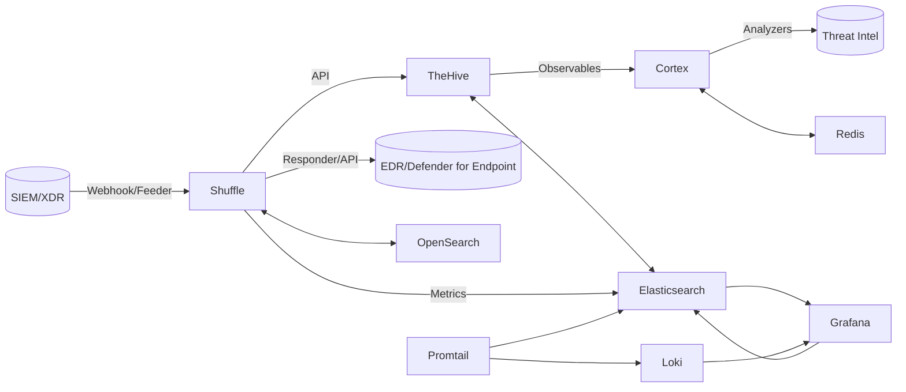

# Laboratorio SOAR para Respuesta ante Ransomware

**Trabajo Fin de Máster (TFM) - Máster en Ciberseguridad**

Este repositorio contiene la **Infraestructura como Código (IaC)** completa y los scripts necesarios para implementar un
laboratorio **SOAR (Security Orchestration, Automation and Response)** especializado en la respuesta ante incidentes de
ransomware. El laboratorio integra múltiples herramientas de seguridad desplegadas mediante **Docker**, con suites de
pruebas completas y automatización mediante **Makefile**.

> ⚠️ **Advertencia**: Este laboratorio está diseñado exclusivamente para entornos de pruebas y formación académica. No
> se recomienda su uso en entornos de producción sin aplicar las guías oficiales y medidas de seguridad adicionales.

---

## Índice

- [Objetivos del Laboratorio](#objetivos-del-laboratorio)
- [Arquitectura General](#arquitectura-general)
- [Resumen de Arquitectura](#resumen-de-arquitectura)
- [Estructura del Repositorio](#estructura-del-repositorio)
- [Documentación del Proyecto](#documentación-del-proyecto)
- [Instalación Rápida](#instalación-rápida)
- [Automatización Opcional](#automatización-opcional)
- [Buenas Prácticas](#buenas-prácticas)
- [Métricas y Pruebas](#métricas-y-pruebas)
- [Contexto Académico](#contexto-académico)
- [Referencias Clave](#referencias-clave)
- [Licencia y Uso](#licencia-y-uso)

---

## 🎯 Objetivos del Laboratorio

- Simular incidentes de ransomware en un entorno controlado y seguro
- Automatizar la respuesta mediante **playbooks SOAR** con múltiples orquestadores
- Reducir el Tiempo Medio de Respuesta (**MTTR**) y mejorar la trazabilidad
- Proporcionar un entorno reproducible para pruebas y formación en ciberseguridad
- Validar la eficacia de la orquestación automatizada en incidentes reales
- Integrar herramientas de Threat Intelligence para análisis automatizado

---

## 🏗️ Arquitectura General

El laboratorio sigue una **arquitectura hexagonal (Ports and Adapters)** en el código Python y una **arquitectura modular de
Docker Compose** en el despliegue. El dominio (`src/soar_lab/domain/`) define modelos, puertos y casos de uso; la
infraestructura (`src/soar_lab/infrastructure/`) provee los adaptadores concretos (clientes HTTP, repositorios, drivers, JWT,
backup); y las interfaces (`src/soar_lab/interfaces/`) exponen una API FastAPI, un panel web y la CLI. El cableado de
dependencias se centraliza en `src/soar_lab/interfaces/api/composition.py`.



### Resumen de Arquitectura

En el flujo operativo, el simulador genera alertas que Shuffle consume mediante webhook. Shuffle orquesta la
creación de casos en TheHive, el enriquecimiento de observables en Cortex y la decisión de contención simulada. Las
métricas se indexan en Elasticsearch y se visualizan en Grafana; los logs se agregan en Loki. Nginx actúa como proxy
inverso HTTPS para los servicios que lo soportan, mientras que otros servicios se acceden directamente por puerto.

**Componentes Principales:**

- **Shuffle**: Orquestador principal, recibiendo alertas y ejecutando flujos automatizados
- **TheHive**: Gestiona casos de incidentes y evidencias forenses
- **Cortex**: Analiza Indicadores de Compromiso (IoCs) mediante analyzers especializados
- **Elasticsearch 7.10.2**: Motor de búsqueda para TheHive, Cortex y las métricas indexadas por Shuffle
- **OpenSearch 2.10.0**: Motor de búsqueda usado por Shuffle y el backend del stack de logging
- **Redis**: Servicio de soporte para persistencia y caché
- **PostgreSQL**: Base de datos para TheHive y Grafana
- **MariaDB**: Base de datos para MISP
- **MISP**: Plataforma de inteligencia de amenazas (Threat Intelligence)
- **Nginx**: Reverse proxy centralizado para acceso a todos los servicios
- **API**: API REST (FastAPI) para gestión y automatización del laboratorio
- **Web Management**: Panel de control web centralizado
- **Docs Site**: Sitio de documentación Docusaurus
- **Grafana**: Dashboards de KPIs y observabilidad
- **Loki**: Agregación de logs
- **Promtail**: Recolección de logs de contenedores

---

## 📁 Estructura del Repositorio

```
soar-ransomware-lab/
├── README.md                    # Documentación principal del proyecto
├── LICENSE                      # Licencia del proyecto
├── Makefile                     # Comandos rápidos: up/down/test/metrics (Linux/Mac)
├── Makefile.win                 # Comandos rápidos: up/down/test/metrics (Windows)
├── pyproject.toml               # Configuración de proyecto Python
├── pytest.ini                  # Configuración de pytest
├── requirements-test.txt         # Dependencias para testing
├── .gitignore                  # Archivos ignorados por git
├── .env.full                   # Variables de entorno completas (generado por `make generate-secrets`, .gitignore)
├── .env.example                # Plantilla saneada de variables de entorno con marcadores de relleno
├── CHANGELOG.md                # Historial de cambios
├── CONTRIBUTING.md              # Guía de contribución
├── docs/                       # Documentación técnica (6 docs principales + assets + archive + thesis)
│   ├── 01-getting-started.md   # Instalación, requisitos y guía rápida
│   ├── 02-architecture.md      # Arquitectura hexagonal, Docker, código, seguridad
│   ├── 03-api-and-integrations.md  # API REST, endpoints e integraciones
│   ├── 04-operations.md        # Configuración, infraestructura, backups, troubleshooting
│   ├── 05-testing.md           # Estrategia de pruebas y suite
│   ├── 06-project-management.md  # Objetivos, plan, riesgos, auditorías
│   ├── glossary.md             # Glosario central
│   ├── index.md                # Índice de documentación
│   ├── assets/                 # Imágenes y referencias técnicas (openapi.json)
│   ├── archive/                # Auditorías y archivos obsoletos
│   └── thesis/                 # Tesis de Máster (TFM)
├── infra/                      # Infraestructura como código
│   ├── docker/                # Configuración Docker
│   │   ├── compose/           # Archivos docker-compose yml
│   │   │   ├── docker-compose.yml
│   │   │   ├── docker-compose.core.yml
│   │   │   ├── docker-compose.misp.yml
│   │   │   ├── docker-compose.opensearch.yml
│   │   │   ├── docker-compose.api.yml
│   │   │   └── logging/       # Stack de logging (Loki, Promtail, Grafana)
│   │   ├── config/            # Configuraciones centralizadas
│   │   │   ├── nginx/
│   │   │   ├── cortex.application.conf/
│   │   │   └── thehive.application.conf/
│   │   └── images/            # Dockerfiles personalizados
│   │       └── cortex/
├── apps/                       # Aplicaciones del proyecto
│   ├── api/                   # Contenedor API FastAPI (Dockerfile)
│   ├── docs-site/             # Sitio de documentación Docusaurus
│   └── web-management/        # Panel de gestión web (HTML/JS estático)
├── src/soar_lab/             # Código fuente principal (Hexagonal Architecture)
│   ├── application/           # Casos de uso y servicios de aplicación
│   │   └── use_cases/         # analytics, auth, backup, etc.
│   ├── auth/                  # Re-export de AuthService (fachada)
│   ├── common/                # Excepciones y utilidades compartidas
│   ├── config/                # Configuración, esquemas y logging
│   ├── data/                  # Esquemas y utilidades de datos
│   ├── db/                    # Inicialización de base de datos
│   ├── domain/                # Lógica de negocio pura
│   │   ├── models.py          # Entidades de dominio (dataclasses)
│   │   ├── ports/             # Interfaces (Protocolos)
│   │   ├── services/          # Servicios de dominio (kpi_analyzer, ioc_generator)
│   │   ├── statistical_calculator.py
│   │   └── value_objects/
│   ├── infrastructure/        # Adaptadores e implementaciones
│   │   ├── integrations/      # Clientes de integraciones (Shuffle, MISP, TheHive, Cortex, ES)
│   │   ├── messaging/         # Envío de alertas
│   │   ├── monitoring/        # Health checks, métricas, KPI alerts
│   │   ├── network_watcher/   # Conectividad dinámica de workers Shuffle
│   │   ├── persistence/       # Repositorios (SQLite, InMemory)
│   │   ├── scripts/           # Scripts de setup y utilidades
│   │   ├── security/          # JWT y credenciales
│   │   └── templates/         # Plantillas
│   ├── interfaces/            # Puntos de entrada (API, CLI, Webhooks)
│   │   └── api/               # FastAPI routes, models, auth
│   ├── logging/               # StructuredLogger wrapper
│   ├── resilience/            # Circuit breaker, retry, timeout
│   ├── security/              # PayloadSanitizer
│   ├── simulator/             # Simulador de alertas SIEM
│   └── validation/            # Validadores reutilizables
├── tests/                      # Suite de pruebas completa
│   ├── unit/                  # Pruebas unitarias
│   ├── atomic/                # Pruebas atómicas
│   ├── integration/           # Pruebas de integración
│   ├── e2e/                   # Pruebas end-to-end
│   ├── architecture/          # Pruebas de arquitectura
│   ├── baseline/              # Inventario de tests
│   ├── contracts/             # Tests de contratos
│   ├── general/               # Pruebas generales
│   ├── performance/           # Pruebas de rendimiento
│   ├── quality/               # Tests de calidad
│   ├── reports/               # Tests de reportes
│   ├── runners/               # Ejecutores de tests
│   ├── runtime/               # Tests de runtime
│   ├── security/              # Pruebas de seguridad
│   └── conftest.py            # Configuración pytest
├── docs/                       # Documentación completa
│   ├── 01-getting-started.md  # Instalación y guía rápida
│   ├── 02-architecture.md     # Arquitectura hexagonal, Docker, código
│   ├── 03-api-and-integrations.md  # API REST e integraciones
│   ├── 04-operations.md       # Operaciones, infraestructura, backups
│   ├── 05-testing.md          # Estrategia de pruebas
│   ├── 06-project-management.md  # Gestión del proyecto
│   ├── glossary.md            # Glosario central
│   ├── index.md               # Índice de documentación
│   ├── api/                   # Documentación de API (Sphinx/OpenAPI)
│   ├── archive/               # Documentación histórica (audits, deprecated)
│   ├── assets/                # Imágenes y referencias
│   └── thesis/                # Documentación académica TFM
└── artifacts/                  # Artefactos generados
    ├── backups/               # Copias de seguridad
    ├── coverage/              # Reportes de cobertura
    ├── data/                  # Datos persistentes
    ├── logs/                  # Logs de ejecución
    └── results/               # Resultados de pruebas
```

---

## Estado Documental

| Área | Documento principal | Estado |
|------|---------------------|--------|
| Getting Started | [01-getting-started.md](docs/01-getting-started.md) | En revisión |
| Arquitectura | [02-architecture.md](docs/02-architecture.md) | En revisión |
| API e Integraciones | [03-api-and-integrations.md](docs/03-api-and-integrations.md) | En revisión |
| Operaciones | [04-operations.md](docs/04-operations.md) | En revisión |
| Pruebas | [05-testing.md](docs/05-testing.md) | Actualizado |
| Gestión de Proyecto | [06-project-management.md](docs/06-project-management.md) | En revisión |
| Glosario | [glossary.md](docs/glossary.md) | Actualizado |
| Tesis | [thesis/](docs/thesis/) | En revisión |
| Índice completo | [docs/README.md](docs/README.md) | En revisión |

> La tabla detallada con fechas de última revisión y responsable está en [`docs/README.md`](docs/README.md).

---

## 📚 Documentación del Proyecto

Este proyecto incluye documentación técnica completa organizada en el directorio `docs/`:

### Documentación Principal

- **[Índice de Documentación](docs/README.md)** - Índice completo de toda la documentación del proyecto
- **[CHANGELOG.md](docs/thesis/CHANGELOG_THESIS_UPDATE.md)** - Historial de cambios y versiones del proyecto
- **[CONTRIBUTING.md](CONTRIBUTING.md)** - Guía para desarrolladores y contribuidores

### Documentación Técnica

- **[01-getting-started.md](docs/01-getting-started.md)** - Visión general, requisitos, instalación y guía rápida
- **[02-architecture.md](docs/02-architecture.md)** - Arquitectura hexagonal, Docker, código, seguridad y matriz de versiones
- **[03-api-and-integrations.md](docs/03-api-and-integrations.md)** - API REST, endpoints, contratos e integraciones con TheHive, Cortex y Shuffle
- **[04-operations.md](docs/04-operations.md)** - Configuración, infraestructura, backups, certificados, logging, troubleshooting y playbooks
- **[05-testing.md](docs/05-testing.md)** - Estrategia de pruebas, suite, tests unitarios, de integración y E2E
- **[06-project-management.md](docs/06-project-management.md)** - Objetivos, alcance, plan, requisitos, riesgos, deuda técnica y auditorías
- **[glossary.md](docs/glossary.md)** - Glosario central de acrónimos, términos y componentes

### Documentación Académica (TFM)

- **[Thesis](docs/thesis/)** - Documentación completa de la Tesis de Máster (múltiples archivos)

---

## 🚀 Instalación Rápida

### Requisitos Previos

- Docker Engine 20.10+
- Docker Compose 2.0+
- Python 3.11+
- 16GB+ RAM recomendado (mínimo 8GB)
- 50GB+ SSD

### Pasos de Instalación

1. **Configurar Variables de Entorno**:
   ```bash
   # Generar .env.full desde .env.example con todos los secretos (incluido JWT)
   make generate-secrets
   # o manualmente
   python src/soar_lab/scripts/setup/generate_env.py
   ```
   Edita `.env.full` para ajustar puertos, hosts y credenciales.

2. **Iniciar el Stack Completo**:
   ```bash
   # Windows (make uses Makefile, which delegates to Makefile.win)
   make up
   # o
   make -f Makefile.win up
   ```

3. **Detener Servicios**:
   ```bash
   # Windows
   make down
   # o
   make -f Makefile.win down
   ```

### Servicios y Accesos

| Servicio              | URL                                    | Vía Nginx | Descripción                            |
|-----------------------|----------------------------------------|-----------|----------------------------------------|
| **Nginx Proxy**       | `https://soar.local`                   | —         | Proxy inverso HTTPS principal          |
| **Web Management UI** | `http://localhost:8085` / `/`        | Sí (/)    | Panel de gestión principal             |
| **API REST**          | `http://localhost:8000` / `/api/`    | Sí        | API de gestión del laboratorio         |
| **Shuffle UI**        | `http://localhost:8081`                | No        | Orquestador SOAR                       |
| **Shuffle API**       | `http://localhost:5001` / `/shuffle-api/` | Sí     | API REST de Shuffle                    |
| **TheHive**           | `http://localhost:8100` / `/thehive/`| Sí        | Gestión de casos e incidentes          |
| **Cortex**            | `http://localhost:8101` / `/cortex/` | Sí        | Análisis de IoCs y analyzers           |
| **MISP**              | `http://localhost:8083`                | No        | Inteligencia de amenazas               |
| **Grafana**           | `http://localhost:8084`                | No        | Dashboards de KPIs y logging           |
| **Docs Site**         | `http://localhost:8086`                | No        | Documentación Docusaurus               |
| **Elasticsearch**     | `http://localhost:8200`               | No        | Motor de búsqueda (puerto externo)     |

> **Swagger/OpenAPI** de la API: `http://localhost:8000/docs` (o `https://soar.local/api/docs` a través de Nginx).

> Servicios marcados como *No* en la columna *Vía Nginx* usan SPA/assets absolutos o no soportan subpath proxy; accede a ellos directamente por puerto.

> **Nota Windows/Docker Desktop**: Algunos puertos pueden estar bloqueados por rangos de exclusión de Hyper-V.
> Todos los servicios internos funcionan correctamente a través de la red Docker.

---

## 🔧 Automatización Opcional

### Lint de documentación

El target `make docs-lint` ejecuta las validaciones documentales antes de un commit:

- `markdownlint` sobre `docs/`
- `lychee` (comprobación de enlaces rotos)
- `src/soar_lab/scripts/ci/docs_quality.py` (calidad de docs, OpenAPI, tests)
- `pytest --collect-only` (verificación de la suite de pruebas)

Windows:
```powershell
make -f Makefile.win docs-lint
```

Linux/macOS:
```bash
make docs-lint
```

---

## 🛡️ Buenas Prácticas

- No subir archivos `.env` ni certificados al repositorio (usar `.gitignore`)
- Documentar pruebas en `tests/e2e` y resultados en `docs/05-testing.md`
- Utilizar TLS y credenciales seguras en todo momento
- Realizar copias de seguridad periódicas de la configuración
- Mantener actualizadas las dependencias y Docker images

---

## 📊 Métricas y Pruebas

### Ejecución de Pruebas

Para ejecutar pruebas, consultar la documentación completa en **[docs/05-testing.md](docs/05-testing.md)
**:

```bash
# Windows - Ejecutar todas las pruebas
make test-all
# o
make -f Makefile.win test-all

# Ejecutar categorías específicas (Windows)
make -f Makefile.win test-unit
make -f Makefile.win test-atomic
make -f Makefile.win test-security
make -f Makefile.win test-integration
make -f Makefile.win test-performance
make -f Makefile.win test-e2e

# Ejecutar con cobertura (mínimo 80% requerido)
make -f Makefile.win test-coverage

# Enviar alerta maliciosa de prueba
python src/soar_lab/infrastructure/messaging/send_alert.py --type malicious --single

# Enviar alerta benigna de prueba
python src/soar_lab/infrastructure/messaging/send_alert.py --type benign --single
```

**Estado Actual de Tests (v1.4.0):**

- Archivos de prueba (`test_*.py`): 184
  - Unit: 79 · Atomic: 4 · Integration: 30 · E2E: 49 (TC-00..TC-33 + TC-99 + TC-KPI-01..06) · Security: 1 · Performance: 4 · Quality: 14 · Architecture: 1 · General: 2
- Funciones definidas: ~2092
- Recolección reproducible (`python -m pytest --collect-only -q`): 2232 items / 327 deselected / 1905 seleccionados (0 errores de colección).
- Todos los errores previos de recolección (`ModuleNotFoundError`, `NameError`, `SyntaxError`) han sido resueltos.
- El desglose completo se mantiene en `docs/05-testing.md` y `baseline/tests_inventory.json`.
- Última sincronización documental: 2026-08-21.

### Cálculo de KPIs

```bash
# Calcular métricas MTTR (Linux/Mac)
make metrics

# Calcular métricas MTTR (Windows)
make -f Makefile.win metrics

# Ver resultados
cat artifacts/results/kpis.csv
```

### Análisis de Datos

```bash
# Ver estado de datos disponibles
make data-status

# Generar análisis completo
make data-generate

# Ver todos los datos disponibles
make data-view

# Monitorear cambios en tiempo real
make data-watch
```

### Análisis de Resultados

- Documentar resultados en `artifacts/results/kpis.csv` y `docs/test_report.md`
- Verificar cumplimiento de umbrales: p50 ≤ 120s, p90 ≤ 180s
- Analizar logs de ejecución en `artifacts/logs/notify.log`
- Ver documentación completa de pruebas en **[docs/05-testing.md](docs/05-testing.md)**

---

## 🎓 Contexto Académico

Este laboratorio SOAR ha sido desarrollado como **Trabajo Fin de Máster** en el área de ciberseguridad, cumpliendo con
los siguientes objetivos académicos:

- **Aplicación Práctica**: Implementación de conceptos teóricos de SOAR en entorno realista
- **Investigación Aplicada**: Validación de la eficacia de la automatización en respuesta a incidentes
- **Innovación Tecnológica**: Desarrollo de un laboratorio reproducible para formación especializada
- **Contribución Académica**: Creación de recursos educativos reutilizables

---

## 🔗 Referencias Clave

### Documentación Oficial

- [TheHive Docker](https://docs.strangebee.com/thehive/installation/docker/)
- [Cortex Analyzers](https://docs.strangebee.com/cortex/)
- [Shuffle SOAR](https://shuffler.io/docs)

### Tecnologías Utilizadas

- [Docker Volumes](https://docs.docker.com/engine/storage/volumes/)
- [PostgreSQL Docker](https://hub.docker.com/_/postgres/)
- [Redis Docker](https://hub.docker.com/_/redis/)
- [Docker Compose](https://docs.docker.com/compose/)

---

## 📄 Licencia y Uso

Este proyecto está licenciado bajo los términos especificados en el archivo `LICENSE`. El uso académico y educativo está
fomentado, siempre que se cite adecuadamente la fuente.

---

**Autor**: [Nombre del Autor]  
**Director/a**: [Nombre del Director/a]  
**Universidad**: [Nombre de la Universidad]  
**Año Académico**: 2025-2026  
**Versión**: 1.4.0
