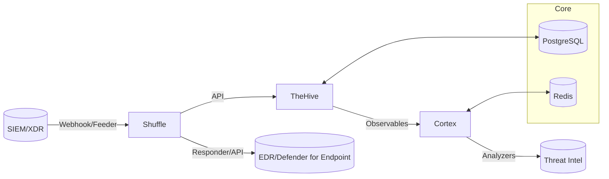

# Laboratorio SOAR para Respuesta ante Ransomware

**Trabajo Fin de Máster (TFM) - Máster en Ciberseguridad**

Este repositorio contiene la **Infraestructura como Código (IaC)** y los scripts necesarios para implementar un laboratorio **SOAR (Security Orchestration, Automation and Response)** especializado en la respuesta ante incidentes de ransomware. El laboratorio integra **TheHive**, **Cortex** y **Shuffle**, desplegados mediante **Docker**, con opciones de automatización mediante **Vagrant** y **Ansible**.

> ⚠️ **Advertencia**: Este laboratorio está diseñado exclusivamente para entornos de pruebas y formación académica. No se recomienda su uso en entornos de producción sin aplicar las guías oficiales y medidas de seguridad adicionales.

---

## 🎯 Objetivos del Laboratorio

- Simular incidentes de ransomware en un entorno controlado y seguro
- Automatizar la respuesta mediante **playbooks SOAR**
- Reducir el Tiempo Medio de Respuesta (**MTTR**) y mejorar la trazabilidad
- Proporcionar un entorno reproducible para pruebas y formación en ciberseguridad
- Validar la eficacia de la orquestación automatizada en incidentes reales

---

## 🏗️ Arquitectura General



**Descripción de Componentes:**
- **Shuffle**: Actúa como orquestador principal, recibiendo alertas y ejecutando el flujo automatizado
- **TheHive**: Gestiona casos de incidentes y evidencias forenses
- **Cortex**: Analiza Indicadores de Compromiso (IoCs) mediante analyzers especializados
- **PostgreSQL** y **Redis**: Servicios de soporte para persistencia de datos y caché

---

## 📁 Estructura del Repositorio (con EDT)

```
laboratorio_soar_ransomware/
├── README.md                # Documentación principal del proyecto (EDT 8.x)
├── LICENSE                  # Licencia del proyecto
├── Makefile                 # Comandos rápidos: up/down/test/metrics (EDT 4.1, 7.4)
├── docker/
│   ├── docker-compose.yml   # Define stack SOAR: TheHive, Cortex, Shuffle, DB, Redis (EDT 4.1)
│   └── .env.example         # Variables seguras: credenciales DB, tokens API (EDT 4.2)
├── vagrant/                 # Automatización opcional con Vagrant (EDT 4.3)
│   ├── Vagrantfile          # Configura VM Ubuntu y opcional Windows (EDT 4.3)
│   └── provision.sh         # Script para instalar Docker y Compose (EDT 4.3)
├── ansible/                 # Opcional para multi-host (EDT 4.4)
│   ├── inventory.ini        # Hosts remotos (EDT 4.4)
│   ├── playbook.yml         # Playbook para instalar Docker y desplegar Compose (EDT 4.4)
│   └── roles/docker/tasks/main.yml # Tareas específicas (EDT 4.4)
├── playbooks/
│   └── shuffle/README.md    # Documentación del flujo E2E en Shuffle (EDT 6.x)
├── scripts/
│   ├── generate_iocs.py     # Genera IoCs para pruebas (EDT 6.1)
│   ├── send_alert.py        # Simula alerta SIEM para disparar playbook (EDT 5.4)
│   ├── isolate_host.sh      # Acción de contención simulada en Linux (EDT 6.4)
│   ├── isolate_endpoint.ps1 # Acción de contención simulada en Windows (EDT 6.4)
│   ├── notify.sh            # Notificación al equipo (EDT 6.5)
│   ├── gen_certs.sh         # Genera TLS autofirmado (EDT 4.2)
│   └── calc_kpis.py         # Calcula métricas MTTR y exporta CSV (EDT 7.4)
├── schemas/
│   └── alert.schema.json    # Esquema JSON para validar alertas (EDT 6.1)
├── tests/                   # Suite de pruebas completa (ver [docs/tests.md](docs/tests.md))
│   ├── unit/               # Pruebas unitarias
│   ├── integration/        # Pruebas de integración
│   ├── performance/        # Pruebas de rendimiento
│   ├── security/           # Pruebas de seguridad
│   └── e2e/               # Pruebas end-to-end
│       ├── TC-01/         # Caso malicioso (EDT 7.1)
│       ├── TC-02/         # Caso benigno (EDT 7.1)
│       └── TC-03/         # Casos extremos y edge cases
├── logs/
│   └── notify.log           # Registro de pasos del playbook (EDT 6.5, 7.4)
├── results/
│   └── kpis.csv             # KPIs calculados (EDT 7.2, 7.4)
└── docs/
    ├── scope.md             # Definición del alcance del proyecto (EDT 1.1)
    ├── objectives.md        # Objetivos SMART del TFM (EDT 1.2)
    ├── plan.md              # Planificación y cronograma del proyecto (EDT 2.1)
    ├── risks.md             # Análisis de riesgos técnicos y temporales (EDT 2.2)
    ├── architecture.md      # Diseño arquitectónico del laboratorio (EDT 3.1)
    ├── api.md               # Integraciones de APIs (reales vs simuladas) (EDT 3.3)
    ├── technical.md         # Configuración técnica detallada (EDT 8.1)
    ├── playbook_manual.md   # Manual del flujo en Shuffle (EDT 8.2)
    ├── test_report.md       # Informe de pruebas y resultados (EDT 8.3)
    ├── closure.md           # Lecciones aprendidas y cierre del proyecto (EDT 8.4)
    ├── user_guide.md        # Guía de usuario completa (EDT 8.5)
    ├── troubleshooting.md   # Guía de resolución de problemas (EDT 8.6)
    └── security.md          # Checklist de seguridad (EDT 4.2)
```

---

## 📚 Documentación del Proyecto

Este proyecto incluye documentación académica completa estructurada según las directrices de Trabajo Fin de Máster (TFM):

### 1. Documentación Fundamental del TFM
1. **[Alcance del Proyecto](docs/scope.md)** - Definición de qué incluye y excluye el TFM
2. **[Objetivos SMART](docs/objectives.md)** - Objetivos medibles con ubicación de evidencias
3. **[Planificación del Proyecto](docs/plan.md)** - Cronograma, hitos y ruta crítica
4. **[Análisis de Riesgos](docs/risks.md)** - Riesgos técnicos y temporales con mitigaciones

### 2. Documentación Técnica y Arquitectónica
5. **[Arquitectura](docs/architecture.md)** - Diseño detallado del sistema y relaciones entre componentes
6. **[Integraciones de APIs](docs/api.md)** - APIs reales vs simuladas con detalles de configuración
7. **[Guía Técnica](docs/technical.md)** - Configuración completa, despliegue y resolución de problemas
8. **[Manual del Playbook](docs/playbook_manual.md)** - Documentación detallada del flujo en Shuffle

### 3. Resultados y Análisis del Proyecto
9. **[Informe de Pruebas](docs/test_report.md)** - Resultados de pruebas E2E, KPIs y análisis de rendimiento
10. **[Cierre del Proyecto](docs/closure.md)** - Lecciones aprendidas y recomendaciones futuras
11. **[Guía de Seguridad](docs/security.md)** - Mejores prácticas de seguridad y checklist

### 4. Guías de Usuario y Operativas
12. **[Guía de Usuario](docs/user_guide.md)** - Manual completo de operación del laboratorio
13. **[Resolución de Problemas](docs/troubleshooting.md)** - Guía completa de diagnóstico y soluciones

### 5. Documentación de Mejoras Implementadas
14. **[Análisis de Mejoras](docs/improvement_recommendations.md)** - Análisis completo de 44 mejoras identificadas
15. **[Implementación de Mejoras](docs/improvements_implementation.md)** - Documentación de todas las mejoras implementadas
16. **[Reporte Final de Implementación](docs/final_implementation_report.md)** - Reporte completo del proyecto transformado

### 6. Documentación API y Desarrollo
17. **[Documentación API](docs/api.md)** - Documentación completa de endpoints REST
18. **[Guía de Contribución](CONTRIBUTING.md)** - Guía para desarrolladores y contribuidores
19. **[CHANGELOG](CHANGELOG.md)** - Historial de cambios y versiones del proyecto

### 7. Archivos de Configuración y Plantillas
20. **[Plantilla TheHive](docs/thehive_template.json)** - Plantilla de casos para incidentes de ransomware
21. **[Analyzers Cortex](docs/cortex_analyzers.md)** - Configuración y documentación de analyzers

---

## 🚀 Instalación Rápida

### Requisitos Previos
- Docker Engine 20.10+
- Docker Compose 2.0+
- Python 3.8+
- 8GB+ RAM (16GB+ recomendado)
- 50GB+ SSD (100GB+ recomendado)

### Pasos de Instalación

1. **Configurar Variables de Entorno**:
   ```bash
   # Copiar plantilla de configuración
   cp docker/.env.example docker/.env
   
   # Editar configuración con credenciales seguras
   nano docker/.env
   ```

2. **Generar Certificados TLS**:
   ```bash
   # Generar certificados autofirmados
   ./scripts/gen_certs.sh
   ```

3. **Iniciar Servicios**:
   ```bash
   # Iniciar todos los servicios
   make up
   
   # Verificar estado de los contenedores
   docker compose ps
   ```

4. **Detener Servicios**:
   ```bash
   # Detener todos los servicios
   make down
   ```

---

## 🔧 Automatización Opcional

### Vagrant
```bash
# Crear entorno automatizado
vagrant up

# Incluir máquina Windows opcional
vagrant up windows
```

### Ansible
```bash
# Despliegue en múltiples hosts
ansible-playbook -i ansible/inventory.ini ansible/playbook.yml
```

---

## 🛡️ Buenas Prácticas

- No subir archivos `.env` ni certificados al repositorio (usar `.gitignore`)
- Documentar pruebas en `tests/e2e` y resultados en `docs/test_report.md`
- Utilizar TLS y credenciales seguras en todo momento
- Realizar copias de seguridad periódicas de la configuración
- Mantener actualizadas las dependencias y Docker images

---

## 📊 Métricas y Pruebas

### Ejecución de Pruebas
Para ejecutar pruebas, consultar la documentación completa en **[docs/tests.md](docs/tests.md)**:

```bash
# Ejecutar todas las pruebas
make test-all

# Ejecutar categorías específicas
make test-unit
make test-integration
make test-e2e

# Ejecutar con cobertura
make test-coverage

# Enviar alerta maliciosa de prueba
python3 scripts/send_alert.py --type malicious --single

# Enviar alerta benigna de prueba
python3 scripts/send_alert.py --type benign --single
```

### Cálculo de KPIs
```bash
# Calcular métricas MTTR
make metrics

# Análisis completo con generación de datos
make metrics-full

# Ver resultados
cat results/kpis.csv
```

### Análisis de Datos
```bash
# Ver estado de datos disponibles
make data-status

# Generar análisis completo
make data-generate

# Ver todos los datos disponibles
make data-view

# Monitorear cambios en tiempo real
make data-watch
```

### Análisis de Resultados
- Documentar resultados en `results/kpis.csv` y `docs/test_report.md`
- Verificar cumplimiento de umbrales: p50 ≤ 120s, p90 ≤ 180s
- Analizar logs de ejecución en `logs/notify.log`
- Ver documentación completa de pruebas en **[docs/tests.md](docs/tests.md)**

---

## 🎓 Contexto Académico

Este laboratorio SOAR ha sido desarrollado como **Trabajo Fin de Máster** en el área de ciberseguridad, cumpliendo con los siguientes objetivos académicos:

- **Aplicación Práctica**: Implementación de conceptos teóricos de SOAR en entorno realista
- **Investigación Aplicada**: Validación de la eficacia de la automatización en respuesta a incidentes
- **Innovación Tecnológica**: Desarrollo de un laboratorio reproducible para formación especializada
- **Contribución Académica**: Creación de recursos educativos reutilizables

---

## 🔗 Referencias Clave

### Documentación Oficial
- [TheHive Docker](https://docs.strangebee.com/thehive/installation/docker/)
- [Cortex Analyzers](https://docs.strangebee.com/cortex/)
- [Shuffle SOAR](https://shuffler.io/docs)

### Tecnologías Utilizadas
- [Docker Volumes](https://docs.docker.com/engine/storage/volumes/)
- [PostgreSQL Docker](https://hub.docker.com/_/postgres/)
- [Redis Docker](https://hub.docker.com/_/redis/)
- [Docker Compose](https://docs.docker.com/compose/)

---

## 📄 Licencia y Uso

Este proyecto está licenciado bajo los términos especificados en el archivo `LICENSE`. El uso académico y educativo está fomentado, siempre que se cite adecuadamente la fuente.

---

**Autor**: [Nombre del Autor]  
**Director/a**: [Nombre del Director/a]  
**Universidad**: [Nombre de la Universidad]  
**Año Académico**: 2024-2025  
**Versión**: 1.3.0
