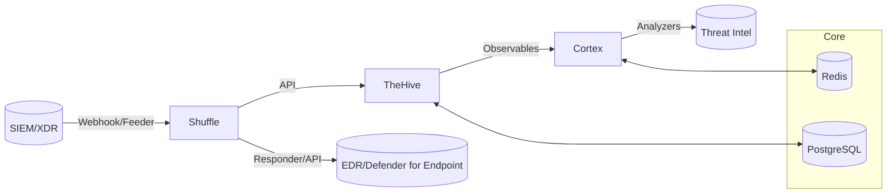

# Laboratorio SOAR para Respuesta a Ransomware

Repositorio de IaC y automatización para montar un laboratorio **SOAR** basado en **TheHive**, **Cortex** y **Shuffle**, con **Docker** y provisionamiento opcional de **VMs**.

> Aviso: Este repo está orientado a entorno de laboratorio. Para producción, usa las guías oficiales.

## Arquitectura (alto nivel)


## Estructura de carpetas
```
repo_soar_laboratorio/
├── README.md
├── LICENSE
├── .gitignore
├── .env.example
├── docker/
│   └── docker-compose.yml
├── vagrant/
│   ├── Vagrantfile
│   └── provision.sh
├── ansible/
│   ├── inventory.ini
│   ├── playbook.yml
│   └── roles/docker/tasks/main.yml
├── playbooks/
│   └── shuffle/README.md
├── scripts/
│   ├── generate_iocs.py
│   └── atomic_red_team_example.ps1
├── tests/
│   └── atomic/README.md
└── docs/
    ├── architecture.md
    └── diagrams/architecture.mmd
```

## Puesta en marcha rápida (local)
1. Copia `.env.example` a `.env` y ajusta credenciales.
2. Levanta servicios base (DB/Cache):
```
cd docker
docker compose up -d postgres redis
```
3. TheHive y Cortex: usa los perfiles oficiales de StrangeBee (ver docs en README).
4. Shuffle (on‑prem): sigue su guía oficial.

## Automatización con Vagrant
```
cd vagrant
vagrant up
```

## Automatización con Ansible
```
ansible-playbook -i ansible/inventory.ini ansible/playbook.yml
```

## Referencias clave
- TheHive (Docker): https://docs.strangebee.com/thehive/installation/docker/
- Cortex (instalación/analyzers): https://docs.strangebee.com/cortex/
- Shuffle (docs): https://shuffler.io/docs
- Docker Volumes: https://docs.docker.com/engine/storage/volumes/
- PostgreSQL Docker: https://hub.docker.com/_/postgres/
- Redis Docker: https://hub.docker.com/_/redis/
