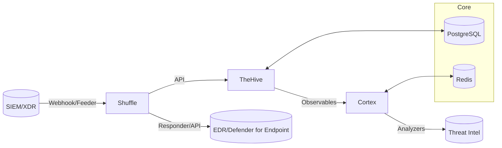

# Laboratorio SOAR para Respuesta a Ransomware

Este repositorio contiene la **Infraestructura como Código (IaC)** y scripts necesarios para montar un laboratorio **SOAR** orientado a la respuesta ante incidentes de ransomware. El laboratorio integra **TheHive**, **Cortex** y **Shuffle**, desplegados sobre **Docker**, con opciones de automatización mediante **Vagrant** y **Ansible**.

> ⚠️ Este laboratorio está diseñado para entornos de pruebas y formación. No se recomienda para producción sin aplicar las guías oficiales y medidas de seguridad adicionales.

---

## ✅ Objetivo del laboratorio
- Simular incidentes de ransomware en un entorno controlado.
- Automatizar la respuesta mediante **playbooks SOAR**.
- Reducir el tiempo medio de respuesta (**MTTR**) y mejorar la trazabilidad.
- Proporcionar un entorno reproducible para pruebas y formación.

---

## ✅ Arquitectura (alto nivel)


**Explicación:**
- **Shuffle** actúa como orquestador, recibiendo alertas y ejecutando el flujo automatizado.
- **TheHive** gestiona casos y evidencias.
- **Cortex** analiza IoCs mediante analyzers.
- **PostgreSQL** y **Redis** son servicios de soporte para persistencia y cache.

---

## ✅ Estructura del repositorio (con comentarios y EDT)
```
repo_soar_laboratorio/
├── README.md                # Documentación principal del proyecto (EDT 8.x)
├── LICENSE                  # Licencia del proyecto
├── Makefile                 # Comandos rápidos: up/down/test/metrics (EDT 4.1, 7.4)
├── docker/
│   ├── docker-compose.yml   # Define stack SOAR: TheHive, Cortex, Shuffle, DB, Redis (EDT 4.1)
│   └── .env.example         # Variables seguras: credenciales DB, tokens API (EDT 4.2)
├── vagrant/                 # Automatización opcional con Vagrant (EDT 4.3)
│   ├── Vagrantfile          # Configura VM Ubuntu y opcional Windows (EDT 4.3)
│   └── provision.sh         # Script para instalar Docker y Compose (EDT 4.3)
├── ansible/                 # Opcional para multi-host (EDT 4.4)
│   ├── inventory.ini        # Hosts remotos (EDT 4.4)
│   ├── playbook.yml         # Playbook para instalar Docker y desplegar Compose (EDT 4.4)
│   └── roles/docker/tasks/main.yml # Tareas específicas (EDT 4.4)
├── playbooks/
│   └── shuffle/README.md    # Documentación del flujo E2E en Shuffle (EDT 6.x)
├── scripts/
│   ├── generate_iocs.py     # Genera IoCs para pruebas (EDT 6.1)
│   ├── send_alert.py        # Simula alerta SIEM para disparar playbook (EDT 5.4)
│   ├── isolate_host.sh      # Acción de contención simulada en Linux (EDT 6.4)
│   ├── isolate_endpoint.ps1 # Acción de contención simulada en Windows (EDT 6.4)
│   ├── notify.sh            # Notificación al equipo (EDT 6.5)
│   ├── gen_certs.sh         # Genera TLS autofirmado (EDT 4.2)
│   └── calc_kpis.py         # Calcula métricas MTTR y exporta CSV (EDT 7.4)
├── schemas/
│   └── alert.schema.json    # Esquema JSON para validar alertas (EDT 6.1)
├── tests/
│   ├── atomic/README.md     # Pruebas unitarias con Atomic Red Team (EDT 7.1)
│   └── e2e/
│       ├── TC-01/           # Caso malicioso (EDT 7.1)
│       └── TC-02/           # Caso benigno (EDT 7.1)
├── logs/
│   └── notify.log           # Registro de pasos del playbook (EDT 6.5, 7.4)
├── results/
│   └── kpis.csv             # KPIs calculados (EDT 7.2, 7.4)
└── docs/
    ├── architecture.md       # Diseño del laboratorio (EDT 3.1)
    ├── plan.md               # Roadmap del proyecto (EDT 2.1)
    ├── riesgos.md            # Análisis de riesgos (EDT 2.2)
    ├── tecnico.md            # Configuración técnica (EDT 8.1)
    ├── manual_playbook.md    # Detalles del flujo en Shuffle (EDT 8.2)
    ├── informe_pruebas.md    # Resultados y KPIs (EDT 8.3)
    ├── cierre.md             # Lecciones aprendidas (EDT 8.4)
    └── security.md           # Checklist de seguridad (EDT 4.2)
```

---

## ✅ Instalación rápida
1. Copia `.env.example` a `.env` y ajusta credenciales.
2. Levanta el stack:
```bash
make up
```
3. Baja el stack:
```bash
make down
```

---

## ✅ Automatización opcional
- **Vagrant**: `vagrant up` (Ubuntu + Windows opcional).
- **Ansible**: `ansible-playbook -i ansible/inventory.ini ansible/playbook.yml`.

---

## ✅ Buenas prácticas
- No subas `.env` ni certificados (usa `.gitignore`).
- Documenta pruebas en `tests/e2e` y resultados en `docs/informe_pruebas.md`.
- Usa TLS y credenciales seguras.

---

## ✅ Métricas y pruebas
- Ejecuta pruebas E2E con casos maliciosos y benignos.
- Calcula KPIs (p50, p90, media) con `scripts/calc_kpis.py`.
- Documenta resultados en `results/kpis.csv` y `docs/informe_pruebas.md`.

---

## ✅ Referencias clave
- [TheHive Docker](https://docs.strangebee.com/thehive/installation/docker/)
- [Cortex Analyzers](https://docs.strangebee.com/cortex/)
- [Shuffle SOAR](https://shuffler.io/docs)
- [Docker Volumes](https://docs.docker.com/engine/storage/volumes/)
- [PostgreSQL Docker](https://hub.docker.com/_/postgres/)
- [Redis Docker](https://hub.docker.com/_/redis/)
