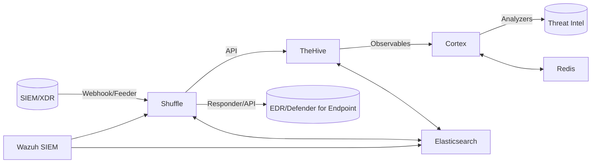

# Laboratorio SOAR para Respuesta ante Ransomware

**Trabajo Fin de Máster (TFM) - Máster en Ciberseguridad**

Este repositorio contiene la **Infraestructura como Código (IaC)** completa y los scripts necesarios para implementar un
laboratorio **SOAR (Security Orchestration, Automation and Response)** especializado en la respuesta ante incidentes de
ransomware. El laboratorio integra múltiples herramientas de seguridad desplegadas mediante **Docker**, con suites de
pruebas completas y automatización mediante **Makefile**.

> ⚠️ **Advertencia**: Este laboratorio está diseñado exclusivamente para entornos de pruebas y formación académica. No
> se recomienda su uso en entornos de producción sin aplicar las guías oficiales y medidas de seguridad adicionales.

---

## 🎯 Objetivos del Laboratorio

- Simular incidentes de ransomware en un entorno controlado y seguro
- Automatizar la respuesta mediante **playbooks SOAR** con múltiples orquestadores
- Reducir el Tiempo Medio de Respuesta (**MTTR**) y mejorar la trazabilidad
- Proporcionar un entorno reproducible para pruebas y formación en ciberseguridad
- Validar la eficacia de la orquestación automatizada en incidentes reales
- Integrar herramientas de Threat Intelligence para análisis automatizado

---

## 🏗️ Arquitectura General



**Componentes Principales:**

- **Shuffle**: Orquestador principal, recibiendo alertas y ejecutando flujos automatizados
- **TheHive**: Gestiona casos de incidentes y evidencias forenses
- **Cortex**: Analiza Indicadores de Compromiso (IoCs) mediante analyzers especializados
- **Wazuh Manager**: Plataforma SIEM/XDR para detección de amenazas y respuesta a incidentes
- **Kibana**: Dashboard de visualización de datos y logs de Wazuh/Elasticsearch
- **Elasticsearch**: Motor de búsqueda y análisis para logs (compartido por todos los servicios)
- **Redis**: Servicio de soporte para persistencia y caché
- **MISP**: Plataforma de inteligencia de amenazas (Threat Intelligence)
- **Nginx**: Reverse proxy centralizado para acceso a todos los servicios
- **API**: API REST (FastAPI) para gestión y automatización del laboratorio
- **Docs Site**: Sitio de documentación Docusaurus

---

## 📁 Estructura del Repositorio

```
soar-ransomware-lab/
├── README.md                    # Documentación principal del proyecto
├── LICENSE                      # Licencia del proyecto
├── Makefile                     # Comandos rápidos: up/down/test/metrics (Linux/Mac)
├── Makefile.win                 # Comandos rápidos: up/down/test/metrics (Windows)
├── pyproject.toml               # Configuración de proyecto Python
├── pytest.ini                  # Configuración de pytest
├── requirements-test.txt         # Dependencias para testing
├── .gitignore                  # Archivos ignorados por git
├── .env.full                   # Variables de entorno completas
├── .env.example                # Plantilla de variables de entorno
├── CHANGELOG.md                # Historial de cambios
├── CONTRIBUTING.md              # Guía de contribución
├── API_DOCUMENTATION.md        # Documentación de la API
├── infra/                      # Infraestructura como código
│   ├── docker/                # Configuración Docker Compose
│   │   ├── compose/           # Archivos docker-compose yml
│   │   │   ├── docker-compose.yml
│   │   │   ├── docker-compose.core.yml
│   │   │   ├── docker-compose.misp.yml
│   │   │   ├── docker-compose.wazuh.yml
│   │   │   ├── docker-compose.api.yml
│   │   │   └── logging/
│   │   │       └── docker-compose.logging.yml
│   │   └── nginx/             # Configuración Nginx
│   │       ├── nginx.conf
│   │       └── ssl/            # Certificados SSL
│   └── vagrant/              # Automatización opcional con Vagrant
│       └── Vagrantfile
├── src/soar_lab/             # Código fuente principal
│   ├── api/                   # API FastAPI
│   ├── config/                # Configuración y esquemas
│   ├── data/                  # Gestión de datos y KPIs
│   ├── domain/                # Dominio y puertos
│   ├── infrastructure/        # Implementaciones de infraestructura
│   ├── integrations/          # Clientes de integraciones
│   ├── services/              # Servicios principales
│   └── validation/            # Validadores
├── tests/                      # Suite de pruebas completa
│   ├── unit/                  # Pruebas unitarias
│   ├── integration/           # Pruebas de integración
│   ├── e2e/                  # Pruebas end-to-end
│   ├── fixtures/              # Datos de prueba y fixtures
│   └── conftest.py            # Configuración pytest
├── docs/                       # Documentación completa
│   ├── architecture/          # Documentación de arquitectura
│   ├── getting_started/       # Guías de inicio
│   ├── operations/            # Guías operativas
│   ├── project/               # Documentación de proyecto
│   ├── testing/               # Documentación de pruebas
│   └── thesis/                # Documentación académica TFM
└── artifacts/                  # Artefactos generados
    ├── backups/               # Copias de seguridad
    ├── coverage/              # Reportes de cobertura
    ├── data/                  # Datos persistentes
    ├── logs/                  # Logs de ejecución
    └── results/               # Resultados de pruebas
```

---

## 📚 Documentación del Proyecto

Este proyecto incluye documentación técnica completa organizada en el directorio `docs/`:

### Documentación Principal

- **[Índice de Documentación](docs/README.md)** - Índice completo de toda la documentación del proyecto
- **[API_DOCUMENTATION.md](API_DOCUMENTATION.md)** - Documentación completa de todas las APIs del sistema
- **[CHANGELOG.md](CHANGELOG.md)** - Historial de cambios y versiones del proyecto
- **[CONTRIBUTING.md](CONTRIBUTING.md)** - Guía para desarrolladores y contribuidores

### Documentación Técnica

- **[Índice de Documentación](docs/README.md)** - Índice completo de toda la documentación del proyecto
- **[Arquitectura](docs/architecture/overview.md)** - Diseño detallado del sistema y relaciones entre componentes
- **[Arquitectura Docker](docs/architecture/docker_architecture.md)** - Arquitectura Docker, archivos compose y
  despliegue
- **[Seguridad](docs/architecture/security.md)** - Consideraciones de seguridad y mejores prácticas

### Guías de Usuario

- **[Visión General](docs/getting_started/overview.md)** - Visión general del laboratorio
- **[Guía de Instalación](docs/getting_started/installation_guide.md)** - Guía paso a paso de instalación
- **[Guía de Usuario](docs/getting_started/user_guide.md)** - Manual completo de operación del laboratorio

### Operaciones

- **[Manual de Configuración](docs/operations/configuration_manual.md)** - Configuración completa del laboratorio
- **[Playbooks](docs/operations/playbooks/)** - Documentación de playbooks
- **[Troubleshooting](docs/operations/troubleshooting.md)** - Guía de diagnóstico y soluciones

### Integraciones

- **[Integraciones](docs/integrations/)** - Documentación de integraciones y contratos de APIs

### Pruebas

- **[Testing](docs/testing/)** - Documentación de pruebas y estrategias de testing

### Gestión de Proyecto

- **[Proyecto](docs/project/)** - Documentación de gestión de proyecto (alcance, objetivos, planificación, riesgos)

### Documentación Académica (TFM)

- **[Thesis](docs/thesis/)** - Documentación completa de la Tesis de Máster (múltiples archivos)

---

## 🚀 Instalación Rápida

### Requisitos Previos

- Docker Engine 20.10+
- Docker Compose 2.0+
- Python 3.11+
- 16GB+ RAM recomendado (mínimo 8GB)
- 50GB+ SSD

### Pasos de Instalación

1. **Configurar Variables de Entorno**:
   ```bash
   # El archivo .env.full contiene la configuración completa
   # Editar credenciales antes de arrancar
   nano .env.full
   ```

2. **Iniciar el Stack Completo**:
   ```bash
   # Linux/Mac
   make up
   
   # Windows
   make -f Makefile.win up
   ```

3. **Detener Servicios**:
   ```bash
   # Linux/Mac
   make down
   
   # Windows
   make -f Makefile.win down
   ```

### Servicios y Accesos

| Servicio              | URL                         | Descripción                            |
|-----------------------|-----------------------------|----------------------------------------|
| **Web Management UI** | http://localhost:8085       | Panel de gestión principal             |
| **Nginx Proxy**       | http://localhost            | Proxy inverso a todos los servicios    |
| **TheHive**           | http://localhost:19000      | Gestión de casos e incidentes          |
| **Cortex**            | http://localhost:19001      | Análisis de IoCs y analyzers           |
| **Shuffle UI**        | http://localhost:8081       | Orquestador SOAR                       |
| **Shuffle API**       | http://localhost:15001      | API REST de Shuffle                    |
| **Kibana**            | http://localhost:15601      | Dashboards y visualización de logs     |
| **Grafana**           | http://localhost:8084       | Dashboards de logging centralizado     |
| **MISP**              | http://localhost:8083       | Inteligencia de amenazas               |
| **API REST**          | http://localhost:8000       | API de gestión del laboratorio         |
| **Docs Site**         | http://localhost:8086/docs/ | Documentación del proyecto             |
| **Elasticsearch**     | http://localhost:19200      | Motor de búsqueda (puerto externo)     |
| **Wazuh Manager**     | interno Docker              | SIEM/XDR (API en puerto 55100 interno) |

> **Nota Windows/Docker Desktop**: Los puertos de Wazuh API (55000) y Elasticsearch están bloqueados por rangos de
> exclusión de Hyper-V. Todos los servicios internos funcionan correctamente a través de la red Docker.

---

## 🔧 Automatización Opcional

### Vagrant

```bash
# Crear entorno automatizado
vagrant up

# Incluir máquina Windows opcional
vagrant up windows
```

### Ansible

```bash
# Despliegue en múltiples hosts
ansible-playbook -i ansible/inventory.ini ansible/playbook.yml
```

---

## 🛡️ Buenas Prácticas

- No subir archivos `.env` ni certificados al repositorio (usar `.gitignore`)
- Documentar pruebas en `tests/e2e` y resultados en `docs/test_report.md`
- Utilizar TLS y credenciales seguras en todo momento
- Realizar copias de seguridad periódicas de la configuración
- Mantener actualizadas las dependencias y Docker images

---

## 📊 Métricas y Pruebas

### Ejecución de Pruebas

Para ejecutar pruebas, consultar la documentación completa en **[docs/testing/test_suite.md](docs/testing/test_suite.md)
**:

```bash
# Linux/Mac - Ejecutar todas las pruebas
make test-all

# Windows - Ejecutar todas las pruebas
make -f Makefile.win test-all

# Ejecutar categorías específicas (Linux/Mac)
make test-unit
make test-atomic
make test-security
make test-integration
make test-performance
make test-e2e

# Ejecutar categorías específicas (Windows)
make -f Makefile.win test-unit
make -f Makefile.win test-atomic
make -f Makefile.win test-security
make -f Makefile.win test-integration
make -f Makefile.win test-performance
make -f Makefile.win test-e2e

# Ejecutar con cobertura (mínimo 80% requerido)
make test-coverage  # Linux/Mac
make -f Makefile.win test-coverage  # Windows

# Enviar alerta maliciosa de prueba
python3 -m soar_lab.services.send_alert --type malicious --single

# Enviar alerta benigna de prueba
python3 -m soar_lab.services.send_alert --type benign --single
```

**Estado Actual de Tests (v1.4.0):**
- Total tests: 1393 passed, 5 skipped ✅
- Unit tests: 1000+ passed ✅
- Integration tests: 277+ passed ✅
- E2E tests: 16 passed ✅
- Atomic tests: 86 passed ✅
- Security tests: 5 passed ✅
- Performance tests: 9 passed ✅
- Coverage: 84%+ ✅ (objetivo >=80%)
- Última ejecución: 2026-07-06
- Correcciones: Elasticsearch disk watermark assertion ajustado a 90%, health check Shuffle backend corregido (puerto 15001)

### Cálculo de KPIs

```bash
# Calcular métricas MTTR (Linux/Mac)
make metrics

# Calcular métricas MTTR (Windows)
make -f Makefile.win metrics

# Ver resultados
cat artifacts/results/kpis.csv
```

### Análisis de Datos

```bash
# Ver estado de datos disponibles
make data-status

# Generar análisis completo
make data-generate

# Ver todos los datos disponibles
make data-view

# Monitorear cambios en tiempo real
make data-watch
```

### Análisis de Resultados

- Documentar resultados en `artifacts/results/kpis.csv` y `docs/test_report.md`
- Verificar cumplimiento de umbrales: p50 ≤ 120s, p90 ≤ 180s
- Analizar logs de ejecución en `artifacts/logs/notify.log`
- Ver documentación completa de pruebas en **[docs/testing/test_suite.md](docs/testing/test_suite.md)**

---

## 🎓 Contexto Académico

Este laboratorio SOAR ha sido desarrollado como **Trabajo Fin de Máster** en el área de ciberseguridad, cumpliendo con
los siguientes objetivos académicos:

- **Aplicación Práctica**: Implementación de conceptos teóricos de SOAR en entorno realista
- **Investigación Aplicada**: Validación de la eficacia de la automatización en respuesta a incidentes
- **Innovación Tecnológica**: Desarrollo de un laboratorio reproducible para formación especializada
- **Contribución Académica**: Creación de recursos educativos reutilizables

---

## 🔗 Referencias Clave

### Documentación Oficial

- [TheHive Docker](https://docs.strangebee.com/thehive/installation/docker/)
- [Cortex Analyzers](https://docs.strangebee.com/cortex/)
- [Shuffle SOAR](https://shuffler.io/docs)

### Tecnologías Utilizadas

- [Docker Volumes](https://docs.docker.com/engine/storage/volumes/)
- [PostgreSQL Docker](https://hub.docker.com/_/postgres/)
- [Redis Docker](https://hub.docker.com/_/redis/)
- [Docker Compose](https://docs.docker.com/compose/)

---

## 📄 Licencia y Uso

Este proyecto está licenciado bajo los términos especificados en el archivo `LICENSE`. El uso académico y educativo está
fomentado, siempre que se cite adecuadamente la fuente.

---

**Autor**: [Nombre del Autor]  
**Director/a**: [Nombre del Director/a]  
**Universidad**: [Nombre de la Universidad]  
**Año Académico**: 2024-2025  
**Versión**: 1.4.0
