# Arquitectura — SOAR Ransomware Lab

## Índice

- [1. Resumen](#1-resumen)
 - [1.1 Objetivo](#11-objetivo)
 - [1.2 Contexto](#12-contexto)
- [2. Alcance](#2-alcance)
 - [2.1 Qué cubre](#21-qué-cubre)
 - [2.2 Límites](#22-límites)
 - [2.3 Dependencias](#23-dependencias)
- [3. Contenido principal](#3-contenido-principal)
 - [3.1 Visión general de arquitectura](#31-visión-general-de-arquitectura)
 - [3.2 Aplicaciones y componentes](#32-aplicaciones-y-componentes)
 - [3.3 Estructura de código](#33-estructura-de-código)
 - [3.4 Composition root](#34-composition-root)
 - [3.5 Arquitectura Docker](#35-arquitectura-docker)
 - [3.6 Arquitectura hexagonal](#36-arquitectura-hexagonal)
 - [3.7 Inventario de dominio y aplicaciones](#37-inventario-de-dominio-y-aplicaciones)
 - [3.8 Coexistencia de motores de búsqueda](#38-coexistencia-de-motores-de-búsqueda)
 - [3.9 Seguridad](#39-seguridad)
 - [3.10 Matriz de versiones](#310-matriz-de-versiones)
- [4. Validación](#4-validación)
 - [4.1 Verificación](#41-verificación)
 - [4.2 Criterios de aceptación](#42-criterios-de-aceptación)
 - [4.3 Evidencias](#43-evidencias)
- [5. Problemas y consideraciones](#5-problemas-y-consideraciones)
 - [5.1 Limitaciones](#51-limitaciones)
 - [5.2 Riesgos o incidencias](#52-riesgos-o-incidencias)
 - [5.3 Recomendaciones / troubleshooting](#53-recomendaciones-troubleshooting)
- [6. Referencias](#6-referencias)

---

## 1. Resumen

### 1.1 Objetivo

Describir la arquitectura del sistema, componentes y principios de diseño del SOAR Ransomware Lab.

### 1.2 Contexto

Plataforma de orquestación de seguridad integral para respuesta ante incidentes de ransomware. Integra Shuffle, TheHive, Cortex y MISP en un entorno Docker Compose unificado.

---

## 2. Alcance

### 2.1 Qué cubre

- Arquitectura de alto nivel del sistema
- Componentes principales y sus interacciones
- Arquitectura de código (hexagonal) y de despliegue (Docker)
- Seguridad y matriz de versiones

### 2.2 Límites

- No cubre detalles de configuración específicos de cada herramienta
- No cubre procedimientos operativos paso a paso (ver 04-operations.md)

### 2.3 Dependencias

- Archivos Docker Compose en `infra/docker/compose/`
- Código fuente en `src/soar_lab/`

---

## 3. Contenido principal

### 3.1 Visión general de arquitectura


Este documento describe la arquitectura del sistema, componentes y principios de diseño del SOAR Ransomware Lab. Su
objetivo es proporcionar una visión integral de la plataforma para comprender su estructura, flujo de datos, seguridad y
despliegue.


El SOAR Ransomware Lab es una plataforma de orquestación de seguridad integral diseñada específicamente para la
respuesta ante incidentes de ransomware. Integra múltiples herramientas de seguridad (Shuffle, TheHive, Cortex, MISP) en un entorno Docker Compose unificado para proporcionar capacidades de detección, análisis y
respuesta
automatizada.


Este documento cubre:

- Arquitectura de alto nivel del sistema
- Componentes principales y sus interacciones
- Flujo de datos y procesamiento de alertas
- Arquitectura de seguridad y defensa en profundidad
- Estrategias de escalabilidad y rendimiento
- Arquitectura de integración y patrones
- Configuración de despliegue (Docker Compose)
- Stack tecnológico y herramientas de desarrollo
- Consideraciones de arquitectura futura


Este documento no cubre:

- Detalles de configuración específicos de cada herramienta (ver documentación individual)
- Procedimientos operativos paso a paso (ver user_guide.md)
- Estrategias de pruebas específicas (ver testing/)
- Planificación del proyecto (ver docs/06-project-management.md)
- Contratos de API detallados (ver docs/03-api-and-integrations.md)


Este documento depende de:

- Documentación oficial de cada componente (Shuffle, TheHive, Cortex, MISP)
- Archivos de configuración Docker Compose en `infra/docker/compose/`
- Documentación de seguridad (docs/02-architecture.md)
- Guía de usuario (docs/01-getting-started.md)
- Estrategia de Docker (docs/02-architecture.md)
- Estructura del paquete Python (docs/02-architecture.md)
- Estructura del código fuente (docs/02-architecture.md)


#### 3.1 Arquitectura general

#### Arquitectura de Código (Python)

El código Python sigue una **arquitectura hexagonal (Ports and Adapters)**. Las dependencias apuntan siempre hacia el
interior; el dominio no conoce detalles de infraestructura ni de interfaces de usuario.

```
src/soar_lab/
├── application/ # Capa de aplicación
│ ├── ports/ # Definición de puertos (interfaces) de entrada/salida
│ └── use_cases/ # analytics_service, auth_service, backup_service, etc.
├── auth/ # Re-export de AuthService (fachada)
├── common/ # Excepciones y utilidades compartidas
├── config/ # Configuración, esquemas y logging
├── data/ # Esquemas y utilidades de datos
├── domain/ # Capa de dominio
│ ├── models.py # Entidades: IOC, Alert, Case
│ ├── ports/ # Protocolos (repositories, integrations, infrastructure)
│ ├── services/ # kpi_analyzer, ioc_generator
│ └── statistical_calculator.py # Cálculos estadísticos puros
├── infrastructure/ # Capa de infraestructura
│ ├── integrations/ # Clientes externos (Shuffle, TheHive, Cortex, MISP, Elasticsearch)
│ ├── messaging/ # Envío de alertas
│ ├── monitoring/ # Health checks, HealthService, SystemMetricsDriver, KPIAlertManager
│ ├── network_watcher/ # Conectividad dinámica de workers Shuffle
│ ├── persistence/ # Repositorios (SQLite, InMemory)
│ ├── scripts/ # Scripts auxiliares de infraestructura
│ ├── security/ # Hardening (no implementado; escaneo vía Trivy en CI)
│ ├── templates/ # Plantillas de configuración
│ ├── jwt_token_provider.py # Generación y validación de tokens JWT
│ ├── pytest_test_runner.py # Ejecución remota de pruebas
│ ├── tar_backup_driver.py # Driver de backups en tar
│ └── validate_credentials.py # Validación de credenciales de servicios
├── interfaces/ # Capa de interfaces
│ └── api/ # FastAPI: main.py, auth.py, models.py, cli.py, composition.py
├── logging/ # StructuredLogger wrapper
├── resilience/ # Circuit breaker, retry, timeout
├── security/ # PayloadSanitizer
├── simulator/ # Simulador de alertas SIEM
└── validation/ # Validadores reutilizables
```

**Composition Root:** `src/soar_lab/interfaces/api/composition.py` centraliza el cableado de dependencias. Es el único
lugar donde se instancian adaptadores de infraestructura y se inyectan en los servicios de aplicación y dominio.
Nuevos adaptadores o servicios deben registrarse aquí para mantener la separación de capas.

> **Matrices de referencia**: versiones en [`02-architecture.md`](02-architecture.md) y mapeo de puertos/URLs en
> [`04-operations.md`](04-operations.md).

#### Arquitectura de Despliegue (Docker)

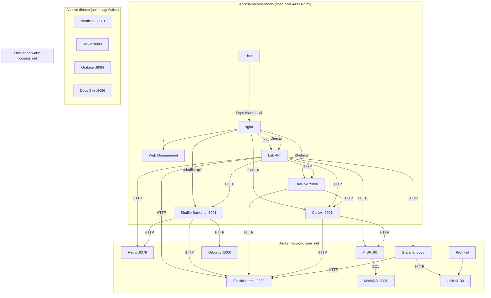

> **Nota sobre accesos directos:** Shuffle UI Dashboard, MISP, Grafana y Docs Site usan SPA/assets absolutos y no funcionan correctamente bajo subpath en Nginx. Se acceden por sus puertos de host (`8081`, `8202`, `8083`, `8084`, `8086`).

#### Servicios SOAR Core

1. **Shuffle** (`:8081` UI host / `:5001` API host)
 - Orquestador SOAR principal
 - Constructor de workflows drag-and-drop
 - Ejecuta playbooks de respuesta automatizada
 - Orborus ejecuta contenedores de apps como workers

2. **TheHive** (`:8100` host → `:9000` container)
 - Plataforma de gestión de casos de incidentes
 - Seguimiento de evidencias y observables
 - Asignación de tareas y línea de tiempo
 - Se integra con Cortex para enriquecimiento

3. **Cortex** (`:8101` host → `:9001` container)
 - Motor de análisis de IoCs
 - Ejecuta analyzers y responders
 - Se integra con MISP, VirusTotal, etc.
 - Soporte para analyzers personalizados en Python

#### SIEM / Detección

4. **OpenSearch Dashboards** (`:8202` host → `:5601` container)
 - Exploración de logs vía Discover

#### Inteligencia de Amenazas

5. **MISP** (`:8083`)
 - Plataforma de inteligencia de amenazas open-source
 - Compartición y gestión de IoCs
 - Integración de feeds
 - Conectado a analyzers de Cortex

#### Capa de Datos

7. **Elasticsearch** (red Docker interna)
 - `docker.elastic.co/elasticsearch/elasticsearch:7.10.2`
 - Backend para TheHive, Cortex, métricas del Lab API (`soar-metrics`) y datasource de Grafana
 - Agregación de logs y búsqueda full-text
 - Configuración single-node con `xpack.security.enabled=false`; se mantiene un password canónico `ELASTIC_PASSWORD=ElasticLab2024SecurePass` en `.env.full` y en las aplicaciones para compatibilidad con clientes que sí envían credenciales.
 - **No es redundancia**: OpenSearch 2.10.0 se despliega en paralelo porque Shuffle requiere un motor OpenSearch nativo, mientras que TheHive/Cortex dependen de `elastic4play` / ES 7.x (ver [Motores de búsqueda: coexistencia de Elasticsearch y OpenSearch](#38-coexistencia-de-motores-de-búsqueda)).

8. **Redis** (interno)
 - Almacenamiento de sesiones y caché para Shuffle
 - Cola de mensajes

9. **MariaDB** (interno)
 - Backend de base de datos para MISP

10. **Tenzir** (nodo de desarrollo, opcional)
 - Imagen: `tenzir/tenzir:v6.8.1`
 - Puertos host: `15160` → `5160`, `15140` → `1514/udp`
 - Estado: desplegado en `docker-compose.core.yml` pero su pipeline de ingestión no está integrado en los playbooks activos del laboratorio.

#### Acceso y Gestión

10. **Nginx** (`:80`, `:443`)
 - Terminación TLS y proxy inverso en `:443`; `:80` redirige a HTTPS
 - Expone `/` → Web Management, `/thehive/` → TheHive, `/cortex/` → Cortex, `/shuffle-api/` → Shuffle Backend
 - Shuffle UI (`:8081`), Web Management (`:8085`), Docs Site (`:8086`) y Grafana (`:8084`) se acceden directamente por sus puertos
 - **Shuffle UI no soporta subpath en Nginx** (`/shuffle` no funciona por rutas SPA absolutas); usar siempre `http://localhost:8081`

11. **Lab API** (`:8000`)
 - Aplicación FastAPI (`src/soar_lab/interfaces/api/main.py`)
 - Endpoints de gestión y automatización del laboratorio
 - Health check en `/health`
 - WebSocket `/api/ws/logs` para streaming de logs en vivo

12. **Docs Site** (`:8086`)
 - Sitio estático Docusaurus
 - Servido directamente en puerto 8086

#### Zonas de Seguridad

```
┌─────────────────────────────────────────────────────────────┐
│ Zona DMZ │
│ Web UI │ API Gateway │ Load Balancer │
├─────────────────────────────────────────────────────────────┤
│ Zona de Aplicación │
│ FastAPI │ Lógica de Negocio │ Autenticación │
├─────────────────────────────────────────────────────────────┤
│ Zona de Datos │
│ TheHive │ Cortex │ OpenSearch │ PostgreSQL │
├─────────────────────────────────────────────────────────────┤
│ Zona de Gestión │
│ Docker │ Monitoreo │ Logging │ Backup │
└─────────────────────────────────────────────────────────────┘
```

#### 3.2 Componentes y servicios

#### Estado Actual de la Arquitectura Hexagonal

El proyecto organiza el código en capas con dirección de dependencias hacia el interior:

- **`src/soar_lab/domain/`**: modelos (`models.py`), puertos (`ports/`) y servicios de dominio (`services/`).
- **`src/soar_lab/application/`**: casos de uso (`use_cases/`) que dependen de los puertos del dominio.
- **`src/soar_lab/infrastructure/`**: adaptadores concretos (`integrations/*`, `persistence/*`, `monitoring/`, `messaging/`, `jwt_token_provider.py`, etc.).
- **`src/soar_lab/interfaces/api/composition.py`**: Composition Root que crea los adaptadores, repositorios y servicios y los inyecta en la aplicación FastAPI.

**Deuda Técnica:**

- `domain/ports/` es extenso; su adopción parcial hace que algunos scripts y helpers aún usen implementaciones concretas.
- Los clientes externos (`infrastructure/integrations/`) se usan mayoritariamente vía la fachada de la API y tests; parte del wiring legacy queda por migrar al CompositionRoot.
- La trayectoria es seguir consolidando el CompositionRoot como único punto de creación de instancias.

#### Lógica de Negocio / Servicios (Python)

**Servicios Actuales:**

- **`src/soar_lab/application/use_cases/analytics_service.py`**: Servicio de análisis de alertas y métricas. Depende de domain/ports (AlertRepository,
 MetricRepository, IocRepository, IOCGenerator, StatisticalCalculatorInterface)
- **`src/soar_lab/application/use_cases/auth_service.py`**: Servicio de autenticación y autorización. Depende de domain/ports (TokenProviderInterface)
- **`src/soar_lab/application/use_cases/backup_service.py`**: Servicio de backup y restauración. Depende de domain/ports (BackupDriver,
 BackupStorageProvider)
- **`src/soar_lab/infrastructure/monitoring/health_service.py`**: Servicio de health checks. Depende de domain/ports (HealthCheckInterface,
 SystemMetricsInterface)
- **`src/soar_lab/domain/services/kpi_analyzer.py`**: Analizador de KPIs y métricas. Depende de domain/ports (StatisticalCalculatorInterface)
- **`scripts/test_service.py`**: Servicio de ejecución de pruebas. Depende de domain/ports (CacheInterface, TestRunner,
 TestResultParserInterface)
- **`scripts/setup/generate_secrets.py`**: Generador de secretos y claves. Depende de domain/ports (FileSystemInterface)

**Dependencias:**

- Los servicios dependen correctamente de domain/ports/ para interfaces (no de infrastructure directamente)
- Esto es consistente con el patrón hexagonal
- Sin embargo, la inyección de dependencias no está completamente implementada en toda la aplicación

#### Servicios SOAR Core

1. **Shuffle** (`:8081` UI host / `:5001` API host)
 - Orquestador SOAR principal
 - Constructor de workflows drag-and-drop
 - Ejecuta playbooks de respuesta automatizada
 - Orborus ejecuta contenedores de apps como workers

2. **TheHive** (`:8100` host → `:9000` container)
 - Plataforma de gestión de casos de incidentes
 - Seguimiento de evidencias y observables
 - Asignación de tareas y línea de tiempo
 - Se integra con Cortex para enriquecimiento

3. **Cortex** (`:8101` host → `:9001` container)
 - Motor de análisis de IoCs
 - Ejecuta analyzers y responders
 - Se integra con MISP, VirusTotal, etc.
 - Soporte para analyzers personalizados en Python

#### SIEM / Detección

4. **OpenSearch Dashboards** (`:8202` host → `:5601` container)
 - Exploración de logs vía Discover

#### Inteligencia de Amenazas

5. **MISP** (`:8083`)
 - Plataforma de inteligencia de amenazas open-source
 - Compartición y gestión de IoCs
 - Integración de feeds
 - Conectado a analyzers de Cortex

#### Capa de Datos

7. **Elasticsearch** (red Docker interna)
 - `docker.elastic.co/elasticsearch/elasticsearch:7.10.2`
 - Backend para TheHive, Cortex, métricas del Lab API (`soar-metrics`) y datasource de Grafana
 - Agregación de logs y búsqueda full-text
 - Configuración single-node con `xpack.security.enabled=false`; se mantiene un password canónico `ELASTIC_PASSWORD=ElasticLab2024SecurePass` en `.env.full` y en las aplicaciones para compatibilidad con clientes que sí envían credenciales.
 - **No es redundancia**: OpenSearch 2.10.0 se despliega en paralelo porque Shuffle requiere un motor OpenSearch nativo, mientras que TheHive/Cortex dependen de `elastic4play` / ES 7.x (ver [Motores de búsqueda: coexistencia de Elasticsearch y OpenSearch](#38-coexistencia-de-motores-de-búsqueda)).

8. **Redis** (interno)
 - Almacenamiento de sesiones y caché para Shuffle
 - Cola de mensajes

9. **MariaDB** (interno)
 - Backend de base de datos para MISP

10. **Tenzir** (nodo de desarrollo, opcional)
 - Imagen: `tenzir/tenzir:v6.8.1`
 - Puertos host: `15160` → `5160`, `15140` → `1514/udp`
 - Estado: desplegado en `docker-compose.core.yml` pero su pipeline de ingestión no está integrado en los playbooks activos del laboratorio.

#### Acceso y Gestión

10. **Nginx** (`:80`, `:443`)
 - Terminación TLS y proxy inverso en `:443`; `:80` redirige a HTTPS
 - Expone `/` → Web Management, `/thehive/` → TheHive, `/cortex/` → Cortex, `/shuffle-api/` → Shuffle Backend
 - Shuffle UI (`:8081`), Web Management (`:8085`), Docs Site (`:8086`) y Grafana (`:8084`) se acceden directamente por sus puertos

11. **Lab API** (`:8000`)
 - Aplicación FastAPI (`src/soar_lab/interfaces/api/main.py`)
 - Endpoints de gestión y automatización del laboratorio
 - Health check en `/health`
 - WebSocket `/api/ws/logs` para streaming de logs en vivo

12. **Docs Site** (`:8086`)
 - Sitio estático Docusaurus
 - Servido directamente en puerto 8086

#### 3.4 Flujos principales

#### Pipeline de Procesamiento de Alertas

```
Fuentes de Alertas → API de Ingestión → Validación → Enriquecimiento → Scoring → Almacenamiento → Análisis → Respuesta
```

1. **Ingestión**: Múltiples fuentes de alertas (SIEM, EDR, APIs personalizadas)
2. **Validación**: Validación de esquema y normalización de datos
3. **Enriquecimiento**: Extracción de IoCs, búsqueda de inteligencia de amenazas
4. **Scoring**: Evaluación automatizada de severidad
5. **Almacenamiento**: Almacenamiento persistente en TheHive/OpenSearch
6. **Análisis**: Reconocimiento de patrones y detección de anomalías
7. **Respuesta**: Ejecución automatizada de playbooks

#### Flujo de Respuesta

```
Detección de Alerta → Triage → Investigación → Contención → Erradicación → Recuperación → Reporte
```

#### Real vs. Simulado en la Respuesta

| Fase | Estado | Evidencia / Notas | |------|--------|-------------------| | Detección | Real | Agentes y manager levantados en Docker; alertas generadas por simulador o agente real | | Ingesta Webhook (Shuffle) | Real | `init_shuffle_webhook.py` crea workflow y webhook en Shuffle | | Triage (Shuffle) | Real | Reglas del workflow evalúan severidad y contexto | | Enriquecimiento (Cortex/MISP) | Real | Analyzers y búsquedas en MISP ejecutados en contenedores | | Creación de caso (TheHive) | Real | Caso, observables y tareas creados por API | | Contención de endpoint | Simulado | `notify.sh` / acciones de contención notifican pero no aíslan la red real; requiere agente EDR real para acción real | | Erradicación/Recuperación | Simulado | Scripts de notificación y métricas; no se eliminan amenazas reales | | Métricas (MTTR/KPIs) | Real | Cálculo e indexación en `soar-metrics` y Grafana |

> Ver también [`docs/02-architecture.md`](#39-seguridad) para la matriz de controles de seguridad.

#### Integraciones Externas

1. **Herramientas de Seguridad**
 - Sistemas SIEM (Splunk, ELK)
 - Soluciones EDR (CrowdStrike, SentinelOne)
 - Plataformas de inteligencia de amenazas
 - Escáners de vulnerabilidades

2. **Sistemas de Comunicación**
 - Notificaciones por email
 - Integración Slack/Teams
 - Alertas SMS
 - Callbacks de webhook

3. **Infraestructura**
 - Proveedores cloud (AWS, Azure, GCP)
 - Orquestación de contenedores (Kubernetes)
 - Plataformas de logging (Splunk, ELK)

#### Patrones de Integración

1. **Integración basada en API**
 - APIs RESTful
 - Interfaces GraphQL
 - Suscripciones de webhook
 - Arquitectura event-driven

2. **Integración basada en Mensajes**
 - Colas RabbitMQ
 - Streams Apache Kafka
 - Redis pub/sub
 - Event sourcing

3. **Integración basada en Archivos**
 - Importaciones CSV/JSON
 - Parsing de archivos de log
 - Sincronización de configuración
 - Operaciones de backup/restore

#### Diagramas de Secuencia de Integración

**Flujo de Alerta SIEM → Shuffle → TheHive → Cortex:**

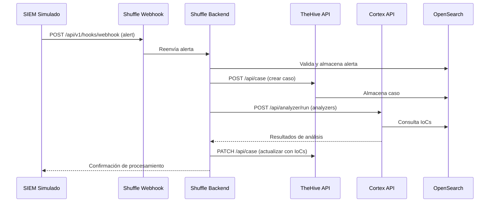

**Flujo de Respuesta Automatizada:**

```mermaid
sequenceDiagram
 participant Shuffle as Shuffle Orborus
 participant TheHive as TheHive
 participant Cortex as Cortex
 participant Scripts as Scripts de Contención
 participant as

 Shuffle->>TheHive: Consulta caso y observables
 TheHive-->>Shuffle: Datos del caso
 Shuffle->>Cortex: Ejecuta analyzers en IoCs
 Cortex-->>Shuffle: Resultados (score, verdict)
 alt Score ≥ 80 o verdict malicioso
 Shuffle->>Scripts: Ejecuta contención simulada
 Scripts->>: Notificación de aislamiento
 Shuffle->>TheHive: Marca como "contención activada"
 else Score < 80 y verdict benigno
 Shuffle->>TheHive: Marca como "benigno"
 end
 Shuffle-->>TheHive: Actualización final del caso
```

#### 3.3 Redes, puertos y dependencias

#### Servicios, Puertos y Redes

| Servicio | Imagen | Puerto host→contenedor | Redes | |--------------------|-------------------------------------------------------|---------------------------------------|-----------------------| | `nginx` | nginx:1.25-alpine | `80:80`, `443:443` | soar_net, logging_net | | `thehive` | thehiveproject/thehive:3.5.2-1 | `${THEHIVE_HTTP_PORT:-8100}:9000` | soar_net | | `cortex` | build `infra/docker/images/cortex/Dockerfile` (FROM `thehiveproject/cortex:3.2.0-1`) | `${CORTEX_HTTP_PORT:-8101}:9001` | soar_net | | `shuffle-backend` | ghcr.io/shuffle/shuffle-backend:2.2.1* | `${SHUFFLE_API_PORT:-5001}:5001` | soar_net | | `shuffle-frontend` | ghcr.io/shuffle/shuffle-frontend:2.2.1* | `${SHUFFLE_UI_PORT:-8081}:80` | soar_net | | `orborus` | build `infra/docker/images/orborus/Dockerfile` (tag `ghcr.io/shuffle/shuffle-orborus:2.2.1-patched`) | — (interno) | soar_net | | `elasticsearch` | docker.elastic.co/elasticsearch/elasticsearch:7.10.2 | `${ELASTICSEARCH_PORT:-8200}:9200` | soar_net, ti_net | | `redis` | redis:7-alpine | `${REDIS_PORT:-6379}:6379` | soar_net, ti_net | | `misp` | ghcr.io/misp/misp-docker/misp-core:v2.5.44* | `${MISP_PORT:-8083}:80` | soar_net | | `misp-db` | mariadb:10.11 | — (interno) | soar_net | | `misp-modules` | ghcr.io/misp/misp-docker/misp-modules:v3.0.9* | — (interno) | soar_net | | `api` | build: apps/api/Dockerfile | `${API_PORT:-8000}:8000` | soar_net, ti_net | | `web-management` | build: apps/web-management/Dockerfile | `8085:80` | soar_net | | `docs-site` | build: apps/docs-site/Dockerfile | `${DOCS_PORT:-8086}:8080` | soar_net | | `loki` | grafana/loki:2.9.10 | — (interno) | logging_net | | `promtail` | grafana/promtail:2.9.9 | — (interno) | logging_net | | `grafana` | grafana/grafana:10.3.4 | `${GRAFANA_PORT:-8084}:3000` | logging_net, soar_net | | `grafana-db` | postgres:14-alpine | — (interno) | logging_net |

#### Redes Docker

| Red | Driver | Subred | Propósito | |---------------|-------------------|-----------------|-----------------------------------------------------------------------------------| | `soar_net` | bridge | `10.100.0.0/16` | Red interna principal — todos los servicios SOAR | | `ti_net` | bridge (internal) | `172.22.0.0/16` | Red de Threat Intelligence — Elasticsearch, Redis, API, MISP (sin acceso externo) | | `logging_net` | bridge | `172.23.0.0/16` | Red de logging — Loki, Promtail, Grafana |

> ⚠️ **Windows/Hyper-V**: rangos de puertos 55000–55099 y 5600–5699 están excluidos por reservas de Hyper-V. Los puertos
> del stack están configurados fuera de esos rangos (ver `.env.full`).

#### Volúmenes Persistentes

| Volumen | Servicio | Contenido persistido | |---------------------------|-----------------|------------------------------------------------------------------| | `thehive_files` | thehive | Ficheros adjuntos a casos e incidentes | | `cortex_data` | cortex | Configuración y datos de analyzers | | `es_data` | elasticsearch | Índices y datos de búsqueda (TheHive, Shuffle, métricas del Lab API) | | `redis_data` | redis | Persistencia de sesiones y caché de Shuffle | | `shuffle_apps` | shuffle-backend | Apps y workflows de Shuffle | | `shuffle_files` | shuffle-backend | Ficheros subidos al orquestador | | `misp_files` | misp | Eventos e IoCs de MISP | | `misp_db` | misp-db | Base de datos MariaDB de MISP | | `misp_configs` | misp | Configuración de MISP | | `misp_logs` | misp | Logs de aplicación de MISP | | `nginx_logs` | nginx | Logs de acceso y error del proxy | | `loki_data` | loki | Logs almacenados en Loki | | `grafana_data` | grafana | Configuración y dashboards de Grafana | | `grafana_db_data` | grafana-db | Base de datos PostgreSQL de Grafana |

#### Stack Tecnológico

**Tecnologías principales**

- **Backend**: Python 3.11, FastAPI (`src/soar_lab/interfaces/api/main.py`)
- **Frontend**: HTML/JS estático (Web Management), React (Shuffle)
- **Orquestación SOAR**: Shuffle (`ghcr.io/shuffle/shuffle-backend`, `-frontend`, `-orborus` 2.2.1)
- **Gestión de casos**: TheHive 3.5.2-1 + Cortex 3.2.0-1
- **Inteligencia de amenazas**: MISP 2.5.44 (`ghcr.io/misp/misp-docker/misp-core`)
- **Búsqueda e índices**: Elasticsearch 7.10.2
- **Caché**: Redis 7
- **Proxy inverso / TLS**: Nginx 1.25
- **Documentación**: Docusaurus 3 (`apps/docs-site`)
- **Contenerización**: Docker Compose 2

**Tecnologías de seguridad**

- **Autenticación**: JWT con `PyJWT`, algoritmo `HS256`
- **Cifrado en tránsito**: TLS 1.2/1.3 vía Nginx con certificados autofirmados
- **Escaneo de vulnerabilidades**: Trivy en CI (`.github/workflows/ci.yml`, job `security-scan`)
- **Gestión de secretos**: Variables de entorno `.env.full`; generación mediante `soar-lab generate-secrets`

**Herramientas de desarrollo**

- **Control de versiones**: Git, GitHub
- **CI/CD**: GitHub Actions
- **Pruebas**: pytest (unit, integration, atomic, e2e, contracts, security, performance)
- **Documentación**: Docusaurus (portal oficial); Swagger/OpenAPI como fuente de contratos HTTP

#### 3.5 Diagramas y tablas de apoyo

#### Diagrama de Arquitectura de Capas

El diagrama de arquitectura de alto nivel presentado en la sección 3.1 muestra la organización en capas del sistema,
desde la capa de acceso hasta la capa de datos e infraestructura.

#### Zonas de Seguridad

El diagrama de zonas de seguridad presentado en la sección 3.1 muestra la segmentación de red en cuatro zonas
principales: DMZ, Aplicación, Datos y Gestión.

#### Matriz de estado funcional por componente

| Componente / Capacidad | Estado | Evidencia / Notas | |------------------------|--------|---------------------| | Nginx (proxy inverso + TLS) | Parcial | Termina TLS en `https://soar.local`; no incluye WAF ni rate limiting avanzado | | Lab API (FastAPI) | Implementado | Endpoints de auth, analytics, backups, tests y proxy SOAR en `src/soar_lab/interfaces/api/main.py` | | Shuffle (workflows + webhook) | Implementado | Contenedores `shuffle-frontend`, `shuffle-backend`, `orborus`; workflow creado por `init_shuffle_webhook.py` | | TheHive | Implementado | Gestión de casos vía API en `soar_thehive:9000`; conexión con Cortex | | Cortex | Implementado | Analyzers ejecutados en contenedor; conexión con TheHive y MISP | | MISP | Implementado | Servicio `misp` en Docker; enriquecimiento de IoCs | | Elasticsearch | Implementado | `elasticsearch:9200`; backend para Shuffle, TheHive, métricas `soar-metrics` | | Redis | Implementado | Sesiones/caché de Shuffle | | Grafana + Loki + Promtail | Implementado | Dashboards en `:8084`; logs centralizados; plugin ES instalado | | Web Management | Implementado | SPA en `:8085` | | Network Watcher | Implementado | Reconecta workers de Shuffle a `soar_net` | | Tenzir Node | Parcial / No verificado | Desplegado en `docker-compose.core.yml` pero pipeline no integrado en playbooks activos | | Autenticación JWT | Implementado | Firma `HS256`; secret en `.env.full`; endpoints `/auth/login` y `/auth/verify` | | Autenticación MFA | Planificado | No hay implementación operativa | | Single Sign-On (SSO/SAML/OIDC) | Planificado | No implementado | | WAF | No verificado / Planificado | Nginx no está configurado como WAF | | DMZ / segmentación de red real | Simulado | Diagramas conceptuales; contenedores comparten Docker networks | | Contención de endpoints | Simulado | Acciones de contención son notificaciones/logs; no aísla endpoints reales sin agente EDR | | Erradicación / recuperación automatizada | Simulado | Backups y métricas reales; la erradicación real no se ejecuta | | Cifrado en tránsito (TLS) | Parcial | TLS en Nginx y ; tráfico interno Docker mayoritariamente HTTP | | Cifrado en reposo | Parcial / No verificado | Depende de configuración de Elasticsearch/OpenSearch/ |

### 3.2 Aplicaciones y componentes

#### 1. Resumen

#### 1.1 Objetivo

Este documento describe las aplicaciones del proyecto ubicadas en `apps/`. Cada aplicación se empaqueta como un
contenedor Docker independiente y cumple una función específica dentro del laboratorio SOAR.

#### 1.2 Contexto

La carpeta `apps/` contiene tres aplicaciones:

- `api/` — API REST del laboratorio basada en FastAPI.
- `docs-site/` — Sitio de documentación estática generado con Docusaurus.
- `web-management/` — Panel de gestión web con HTML, CSS y JavaScript.

Cada aplicación tiene su propio `Dockerfile` y se despliega mediante `infra/docker/compose/docker-compose.api.yml`.

---

#### 2. `apps/api`

**Propósito:** Contenedor principal de la API REST del laboratorio.

**Base:** `python:3.11-slim`

**Componentes:**

- `Dockerfile` — Imagen Docker con dependencias Python, pytest y código fuente.
- `api-docs.html` — Documentación HTML de la API (legacy; la documentación actual está en `docs/` y `docs/03-api-and-integrations.md`).
- `docs/` — Documentación adicional empaquetada en el contenedor (legacy).
- `pyproject.toml` — Dependencias Python del servicio.

**Punto de entrada:**

```bash
uvicorn soar_lab.interfaces.api.composition:create_app --host 0.0.0.0 --port 8000 --factory
```

**Puerto expuesto:** `8000`

**Health check:** `curl -f http://localhost:8000/health || exit 1`

**Variables de entorno principales (`.env.full`):**

- `API_PORT` — puerto host para la API (por defecto `8000`).
- `CORS_ORIGINS` — orígenes permitidos para peticiones CORS.
- `JWT_SECRET_KEY` — secret preferente para firma JWT (mínimo 32 caracteres).
- `API_AUTH_SECRET` — secret legacy para firma JWT; solo se usa si `JWT_SECRET_KEY` no está definido.
- `WEB_UI_USER` / `WEB_UI_PASSWORD` — credenciales de acceso al Web Management.
- `THEHIVE_API_KEY`, `CORTEX_API_KEY`, `SHUFFLE_DEFAULT_APIKEY`, `MISP_API_KEY`, etc.

**Redes Docker:** `soar_net`, `ti_net`, `logging_net`.

**Acceso:**

- Directo: `http://localhost:8000`.
- A través de Nginx: `https://soar.local/api/`.
- Swagger/OpenAPI: `http://localhost:8000/docs` o `https://soar.local/api/docs`.

**Funciones expuestas:**

- `/health`, `/auth/login`, `/auth/verify`.
- `/analytics/metrics`, `/analytics/kpis`.
- `/services/status`.
- `/backup/create`, `/backup/list`, `/backup/restore`.
- `/tests/run`.
- `/ws/logs` (WebSocket de logs).
- Proxy a integraciones bajo `/soar/thehive/`, `/soar/cortex/`, `/soar/misp/`, `/soar/shuffle/`, etc.

**Notas:**

- El `Dockerfile` copia `src/` y `tests/` dentro del contenedor.
- Se usa el usuario `app` para ejecutar el servicio.
- El contenedor también se utiliza para ejecutar tests.

---

#### 3. `apps/docs-site`

**Propósito:** Sitio de documentación del proyecto construido con Docusaurus.

**Archivos principales:**

- `Dockerfile` — Imagen Docker basada en Node.js para servir el sitio estático.
- `docusaurus.config.js` — Configuración de Docusaurus.
- `package.json` — Dependencias Node.js.
- `sidebars.js` — Configuración de la barra lateral.
- `src/` — Código fuente y páginas del sitio.
- `docs/` — Documentación en formato Markdown.

**Puerto expuesto:** `8086` (mapeado al puerto `8080` del contenedor)

**Acceso:**

- Directo: `http://localhost:8086`.
- **No** se expone a través de Nginx con subpath; acceso directo únicamente.

**Dependencias:** Ninguna obligatoria; solo requiere la documentación Markdown en `docs/` montada en `/opt/docusaurus/docs`.

---

#### 4. `apps/web-management`

**Propósito:** Panel de gestión web estático del laboratorio.

**Archivos principales:**

- `Dockerfile` — Imagen ligera basada en Nginx.
- `index.html` — Página principal del panel.
- `script.js` — Lógica JavaScript del frontend.
- `styles.css` — Hojas de estilo.
- `nginx.conf` — Configuración de Nginx para servir la aplicación.

**Puerto expuesto:** `8085` (mapeado al puerto `80` del contenedor)

**Acceso:**

- Directo: `http://localhost:8085`.
- A través de Nginx: `https://soar.local/` (raíz del proxy).

**Comunicación con la API:**

- `script.js` usa `const API_BASE = '/api'` (ruta relativa), por lo que depende de que Nginx reescriba `https://soar.local/api/` a `http://api:8000`.
- El acceso directo `http://localhost:8085` **no expone `/api`**; en ese modo `script.js` intentará `http://localhost:8000/api/...`, que tampoco estará disponible en el puerto 8085. Para desarrollo o pruebas directas, setear `API_BASE = 'http://localhost:8000'` temporalmente y permitir `CORS_ORIGINS`.
- El token JWT se almacena en `localStorage`; no debe guardarse en cookies sin `HttpOnly`.
- Reconexión WebSocket contra `/ws/logs` (o `/api/ws/logs` si pasa por Nginx); Nginx transmite `Upgrade` y `Connection`.

**Nota:** Si se accede directamente por `http://localhost:8085`, asegúrate de que `CORS_ORIGINS` incluye `http://localhost:8085` y considera que `/api` no estará disponible sin un proxy inverso.

---

#### 5. Tabla resumen

| Aplicación | Servicio Compose | Contenedor (proyecto `soar`) | Tecnología | Puerto host | Puerto contenedor | Acceso recomendado | Vía Nginx | |------------|------------------|------------------------------|------------|-------------|-------------------|--------------------|-----------| | `apps/api` | `api` | `soar_api` | FastAPI / Python 3.11 | `8000` | `8000` | `http://localhost:8000` | Sí (`/api/`) | | `apps/docs-site` | `docs-site` | `soar_docs_site` | Docusaurus / Node.js | `8086` | `8080` | `http://localhost:8086` | No | | `apps/web-management` | `web-management` | `soar_web_management` | HTML / JS / Nginx | `8085` | `80` | `http://localhost:8085` | Sí (`/`) |

---

#### 6. Referencias

- [Arquitectura Docker](#35-arquitectura-docker)
- [Arquitectura general](#31-visión-general-de-arquitectura)
- [Guía de infraestructura](04-operations.md)
- [README principal](../README.md)


### 3.3 Estructura de código

#### 1. Resumen

#### 1.1 Objetivo

Este documento describe la organización del código fuente en `src/soar_lab/` siguiendo una arquitectura hexagonal
(ports and adapters). El objetivo es separar la lógica de negocio pura de los detalles de infraestructura e interfaces.

#### 1.2 Contexto

Tras la refactorización, el código se reorganizó en cuatro capas principales:

- **Domain** — Lógica de negocio pura e interfaces abstractas.
- **Application** — Casos de uso y orquestación de servicios.
- **Infrastructure** — Implementaciones concretas, adaptadores y clientes externos.
- **Interfaces** — Puntos de entrada (API REST, CLI, webhooks).

---

#### 2. Visión general de `src/soar_lab`

```
src/soar_lab/
├── __init__.py
├── application/ # Capa de aplicación
│ ├── ports/ # Definición de puertos (interfaces) de entrada/salida
│ └── use_cases/ # analytics_service, auth_service, backup_service, etc.
├── auth/ # Re-export de AuthService (fachada)
├── common/ # Excepciones y utilidades compartidas
├── config/ # Configuración, esquemas y logging
├── data/ # Esquemas y utilidades de datos
├── domain/ # Capa de dominio
│ ├── models.py # Entidades: IOC, Alert, Case
│ ├── ports/ # Protocolos (repositories, integrations, infrastructure)
│ ├── services/ # kpi_analyzer, ioc_generator
│ └── statistical_calculator.py # Cálculos estadísticos puros
├── infrastructure/ # Capa de infraestructura
│ ├── integrations/ # Clientes externos (Shuffle, TheHive, Cortex, MISP, Elasticsearch)
│ ├── messaging/ # Envío de alertas
│ ├── monitoring/ # Health checks, HealthService, SystemMetricsDriver, KPIAlertManager
│ ├── network_watcher/ # Conectividad dinámica de workers Shuffle
│ ├── persistence/ # Repositorios (SQLite, InMemory)
│ ├── scripts/ # Scripts auxiliares de infraestructura
│ ├── security/ # Hardening (no implementado; escaneo vía Trivy en CI)
│ ├── templates/ # Plantillas de configuración
│ ├── jwt_token_provider.py # Generación y validación de tokens JWT
│ ├── pytest_test_runner.py # Ejecución remota de pruebas
│ ├── tar_backup_driver.py # Driver de backups en tar
│ └── validate_credentials.py # Validación de credenciales de servicios
├── interfaces/ # Capa de interfaces
│ └── api/ # FastAPI: routes, models, auth, cli, composition
├── logging/ # StructuredLogger wrapper
├── resilience/ # Circuit breaker, retry, timeout
├── security/ # PayloadSanitizer
├── simulator/ # Simulador de alertas SIEM
└── validation/ # Validadores
```

#### 2.1 Correspondencia puertos → adaptadores

Tabla one-to-one entre los protocolos del dominio y sus implementaciones concretas en infraestructura. Cada fila muestra el contrato (puerto), el adaptador que lo materializa y el archivo principal.

| Puerto (Protocol) | Definición | Adaptador / Implementación | Archivo principal | |---|---|---|---| | `AlertRepository` | `domain/ports/repositories.py` | `SqliteAlertRepository`, `InMemoryAlertRepository` | `infrastructure/persistence/sqlite_alert_repository.py`, `infrastructure/in_memory_alert_repository.py` | | `BackupDriver` | `domain/ports/infrastructure.py` | `TarBackupDriver` | `infrastructure/tar_backup_driver.py` | | `StorageProvider` | `domain/ports/infrastructure.py` | `FilesystemStorage` | `infrastructure/filesystem_storage.py` | | `TestRunner` | `domain/ports/infrastructure.py` | `PytestTestRunner` | `infrastructure/pytest_test_runner.py` | | `TestResultParserInterface` | `domain/ports/infrastructure.py` | `PytestOutputParser` | `infrastructure/pytest_output_parser.py` | | `ConfigProvider` | `domain/ports/infrastructure.py` | `InfrastructureConfigProvider` | `infrastructure/config_provider.py` | | `TokenProviderInterface` | `domain/ports/infrastructure.py` | `JWTTokenProvider` | `infrastructure/jwt_token_provider.py` | | `HTTPClient` | `domain/ports/infrastructure.py` | `AioHTTPClient` | `infrastructure/http_client.py` | | `SyncHTTPClient` | `domain/ports/infrastructure.py` | `BaseHTTPClient` | `infrastructure/integrations/base_client.py` | | `WebSocketManager` | `domain/ports/infrastructure.py` | `ConnectionManager` | `infrastructure/websocket_manager.py` | | `SystemMetricsInterface` | `domain/ports/infrastructure.py` | `SystemMetricsDriver` | `infrastructure/monitoring/system_metrics_driver.py` | | `HealthCheckInterface` | `domain/ports/infrastructure.py` | `HTTPHealthCheckAdapter`, `HealthService` | `infrastructure/monitoring/health_check_adapter.py`, `infrastructure/monitoring/health_service.py` | | `SubprocessRunner` | `domain/ports/infrastructure.py` | `SubprocessRunner` | `infrastructure/subprocess_runner.py` | | `LogReader` | `domain/ports/infrastructure.py` | `FileLogReader` | `infrastructure/file_log_reader.py` | | `LogParser` | `domain/ports/infrastructure.py` | `LogParser` | `infrastructure/log_parser.py` | | `KPIFormatter` | `domain/ports/infrastructure.py` | `CSVKPIFormatter` | `infrastructure/kpi_formatter.py` | | `ChecksumService` | `domain/ports/infrastructure.py` | `ChecksumService` | _no implementado_ | | `CacheInterface` | `domain/ports/infrastructure.py` | `Redis` client wrapper | `infrastructure/clients.py` | | `PathProviderInterface` | `domain/ports/infrastructure.py` | *(sin adaptador — puerto sin implementación)* | — | | `FileSystemInterface` | `domain/ports/infrastructure.py` | `FilesystemStorage` | `infrastructure/filesystem_storage.py` | | `IOCGenerator` | `domain/ports/integrations.py` | `IOCGenerator` | `domain/services/ioc_generator.py` | | `AlertTransporter` | `domain/ports/integrations.py` | `HTTPAlertSender` | `infrastructure/http_alert_sender.py` |

> Nota: el dominio depende únicamente de los protocolos (`Protocol`). El `CompositionRoot` (`src/soar_lab/interfaces/api/composition.py`) es el único lugar donde se inyectan las implementaciones reales, manteniendo la independencia de capas.

#### 2.2 Paquetes auxiliares en la raíz de `src/soar_lab/`

Además de las cuatro capas hexagonales, el código fuente contiene paquetes de conveniencia y soporte:

| Paquete | Contenido destacado | Responsabilidad | |---|---|---| | `auth/` | `models.py` | Modelos de autenticación/RBAC (`Permission`, `Role`, `User`). `AuthService` vive en `application/use_cases/auth_service.py`. | | `common/` | `exceptions.py` | Excepciones base compartidas por todas las capas. | | `config/` | `settings.py`, `schemas/`, `logging.py` | Configuración central, Pydantic settings y logging. | | `data/` | `generate_iocs.py`, `calc_kpis.py` | Esquemas de datos y helpers de transformación. | | `db/` | `transaction.py` | Inicialización y gestión de transacciones de BD. | | `logging/` | `structured.py` | `StructuredLogger` wrapper sobre `logging`. | | `resilience/` | `circuit_breaker.py`, `retry.py`, `timeout.py` | Patrones de tolerancia a fallos (reintentos, circuit breaker, timeouts). | | `security/` | `sanitization.py` | `PayloadSanitizer` para saneamiento básico de entradas. | | `validation/` | `validators.py` | Validadores centralizados (IP, hash, rutas, alertas). |

---

#### 3. Domain Layer

Ubicación: `src/soar_lab/domain/`

Responsabilidad: Contener la lógica de negocio pura sin dependencias externas.

| Módulo | Propósito | |--------|-----------| | `models.py` | Entidades de dominio (`IOC`, `Alert`, `Case`) con validación | | `ports/repositories.py` | Protocolos de repositorios (`AlertRepository`, `CaseRepository`, etc.) | | `ports/infrastructure.py` | Protocolos de infraestructura (`ConfigProvider`, `HTTPClient`, etc.) | | `ports/integrations.py` | Protocolos de integraciones (`IOCGenerator`, `AlertTransporter`) | | `ports/` | Submódulos organizados por categoría de puerto | | `services/kpi_analyzer.py` | Cálculo de métricas KPI | | `services/ioc_generator.py` | Generación de IOCs simulados | | `statistical_calculator.py` | Cálculos estadísticos puros |

---

#### 4. Application Layer

Ubicación: `src/soar_lab/application/`

Responsabilidad: Orquestar casos de uso utilizando los puertos del dominio.

| Módulo | Propósito | |--------|-----------| | `ports/` | Definición de puertos (interfaces) de entrada/salida | | `use_cases/analytics_service.py` | Cálculo y exportación de estadísticas y KPIs | | `use_cases/auth_service.py` | Autenticación JWT y verificación de credenciales | | `use_cases/backup_service.py` | Creación, listado y restauración de backups | | `use_cases/aggregated_kpis.py` | Agregación de KPIs | | `use_cases/node_timings.py` | Métricas de tiempos por nodo del workflow | | `use_cases/node_timing_extractor.py` | Extracción de tiempos de ejecución por nodo |

---

#### 5. Infrastructure Layer

Ubicación: `src/soar_lab/infrastructure/`

Responsabilidad: Implementar los puertos del dominio y conectar con sistemas externos.

| Módulo | Propósito | |--------|-----------| | `integrations/` | Clientes HTTP de Elasticsearch, Shuffle, TheHive, Cortex, MISP | | `messaging/` | Transporte de alertas (`send_alert.py`) | | `monitoring/` | Health checks, `HealthService`, `SystemMetricsDriver`, `KPIAlertManager` | | `network_watcher/` | Servicio para conectar workers de Shuffle a `soar_net` | | `persistence/` | Implementaciones de repositorios (`SqliteAlertRepository`) | | `security/` | Hardening (no implementado; escaneo vía Trivy en CI) | | `templates/` | Plantillas de configuración | | `jwt_token_provider.py` | `JWTTokenProvider`: generación y validación de tokens JWT | | `pytest_test_runner.py` | `PytestTestRunner`: ejecución remota de pruebas | | `tar_backup_driver.py` | `TarBackupDriver`: copias de seguridad en tar | | `validate_credentials.py` | Validación de credenciales de servicios externos |

---

#### 6. Interface Layer

Ubicación: `src/soar_lab/interfaces/`

Responsabilidad: Exponer la funcionalidad al exterior.

| Módulo | Propósito | |--------|-----------| | `api/composition.py` | `CompositionRoot` y `create_app`: cableado de dependencias de la app FastAPI | | `api/main.py` | Aplicación FastAPI principal con todos los endpoints REST | | `api/cli.py` | CLI nativo `soar-lab` (api, generate-secrets, generate-iocs, version) | | `api/models.py` | Modelos Pydantic para request/response | | `api/auth.py` | Dependencias de autenticación |

---

#### 7. Código compartido

| Módulo | Propósito | |--------|-----------| | `common/` | Excepciones y utilidades compartidas | | `config/` | `settings.py`, `logging.py`, `schemas/` | | `data/` | Esquemas de datos y utilidades | | `validation/` | Validadores reutilizables |

---

#### 8. Scripts y simulador

| Módulo | Propósito | |--------|-----------| | `scripts/` | Scripts del laboratorio: `setup/`, `debug/`, `maintenance/`, generación de KPI/alertas, tests | | `simulator/simulate_alerts.py` | Simulador de alertas SIEM para pruebas (genera y envía payloads al webhook de Shuffle) |

---

#### 9. Referencias

- [Arquitectura hexagonal](#36-arquitectura-hexagonal)
- [Arquitectura general del sistema](#31-visión-general-de-arquitectura)
- [Aplicaciones del proyecto](#32-aplicaciones-y-componentes)
- [Composition Root](#34-composition-root)
- [Guía de infraestructura](04-operations.md)


### 3.4 Composition root

#### 1. Resumen

#### 1.1 Objetivo

Este documento describe el **Composition Root** del proyecto: el punto único donde se instancian y conectan las
dependencias de la aplicación siguiendo el patrón de arquitectura hexagonal.

#### 1.2 Contexto

En arquitectura hexagonal, el dominio define puertos (interfaces) y la infraestructura proporciona adaptadores
(implementaciones). El Composition Root es el único lugar con permiso para conocer ambos lados y cablearlos juntos.
Esto garantiza que el dominio y la aplicación permanezcan independientes de detalles técnicos.

---

#### 2. Ubicación

**Archivo:** `src/soar_lab/interfaces/api/composition.py`

**Clase principal:** `CompositionRoot`

**Factory pública:** `create_app` — crea y configura la aplicación FastAPI con todas las dependencias resueltas.

---

#### 3. Responsabilidades

El `CompositionRoot` realiza las siguientes tareas:

1. **Configuración:** Carga ajustes mediante `create_settings` y `InfrastructureConfigProvider`.
2. **Logging:** Inicializa el sistema de logging con `setup_logging`.
3. **Directorios:** Garantiza que los directorios necesarios existen a través de `PathService`.
4. **Adaptadores de infraestructura:** Crea repositorios, clientes HTTP, almacenamiento, etc.
5. **Servicios de dominio:** Instancia `KPIAnalyzer` y `StatisticalCalculator`.
6. **Servicios de aplicación:** Crea `AnalyticsService`, `AuthService`, `BackupService` y `TestService`.
7. **Clientes utilitarios:** Crea `docker_client` y `redis_client`.
8. **Integración externa:** Inicializa clientes para Shuffle, TheHive, Cortex, MISP, Elasticsearch y .
9. **Aplicación FastAPI:** Construye la API con `create_app` y le inyecta todas las dependencias.

---

#### 4. Componentes cableados

| Componente | Tipo | Rol | |------------|------|-----| | `InfrastructureConfigProvider` | Adaptador de config | Lee variables de entorno y `.env.full` | | `PathService` | Utilidad | Resuelve rutas del proyecto y crea directorios | | `FilesystemStorage` | Adaptador de almacenamiento | Acceso a archivos del sistema | | `SqliteAlertRepository` | Adaptador de persistencia | Almacena alertas en SQLite | | `AioHTTPClient` | Adaptador HTTP | Cliente HTTP asíncrono | | `HTTPHealthCheckAdapter` | Adaptador de health | Realiza health checks HTTP | | `SystemMetricsDriver` | Adaptador de métricas | Recolecta CPU, RAM, disco | | `JWTTokenProvider` | Adaptador de seguridad | Genera y valida tokens JWT | | `TarBackupDriver` | Adaptador de backup | Crea backups comprimidos | | `ConnectionManager` (`websocket_manager.py`) | Adaptador WebSocket | Gestiona conexiones WS para logs | | `Docker Client` | Cliente utilitario | Interacción con Docker | | `Redis Client` | Cliente utilitario | Conexión a Redis | | `KPIAnalyzer` | Servicio de dominio | Calcula métricas KPI | | `StatisticalCalculator` | Servicio de dominio | Cálculos estadísticos | | `AnalyticsService` | Servicio de aplicación | Orquesta analytics y exportación | | `AuthService` | Servicio de aplicación | Autenticación JWT | | `BackupService` | Servicio de aplicación | Crea, lista y restaura backups | | `TestService` | Servicio de aplicación | Ejecuta tests y parsea resultados | | `HealthService` | Servicio de aplicación | Verifica salud de todos los servicios | | `ShuffleClient` | Cliente externo | Integración con Shuffle SOAR | | `TheHiveClient` | Cliente externo | Integración con TheHive | | `CortexClient` | Cliente externo | Integración con Cortex | | `MISPClient` | Cliente externo | Integración con MISP | | `ElasticsearchClient` | Cliente externo | Integración con Elasticsearch |

---

#### 5. Cómo añadir un nuevo adaptador

Para añadir una nueva dependencia sin romper la arquitectura:

1. Define un **puerto** en `src/soar_lab/domain/ports/` (Protocol).
2. Implementa el **adaptador** en `src/soar_lab/infrastructure/`.
3. Registra el adaptador en `CompositionRoot.__init__`.
4. Inyecta el adaptador en el servicio de aplicación o dominio correspondiente.
5. Expón el servicio a `create_app` si debe usarse desde la API.

---

#### 6. Ejemplo de flujo

```python
# Punto de entrada de la aplicación
from soar_lab.interfaces.api.composition import create_app

app = create_app
```

Dentro de `CompositionRoot`:

1. Se crea `settings` y `config_provider`.
2. Se instancian `SqliteAlertRepository`, `SystemMetricsDriver`, `AioHTTPClient`.
3. Se crea `AnalyticsService` con `KPIAnalyzer` y `StatisticalCalculator`.
4. Se crean los clientes utilitarios (`docker_client`, `redis_client`) y los clientes externos (Shuffle, TheHive, Cortex, MISP, Elasticsearch).
5. Se construye `create_app(...)` y se le pasan todas las dependencias.

---

#### 7. Referencias

- [Arquitectura general](#31-visión-general-de-arquitectura)
- [Estructura del código fuente](#33-estructura-de-código)
- [Arquitectura hexagonal](#36-arquitectura-hexagonal)
- [src/soar_lab/interfaces/api/composition.py](../src/soar_lab/interfaces/api/composition.py)


### 3.5 Arquitectura Docker

> Este documento describe la arquitectura Docker del SOAR Ransomware Lab, incluyendo la organización de archivos
> Compose, configuración de redes, persistencia de datos y procedimientos de despliegue.

#### Índice

- [1. Resumen](#1-resumen)
 - [1.1 Objetivo](#11-objetivo)
 - [1.2 Contexto](#12-contexto)
- [2. Alcance](#2-alcance)
 - [2.1 Qué cubre](#21-qué-cubre)
 - [2.2 Límites](#22-límites)
 - [2.3 Dependencias](#23-dependencias)
- [3. Contenido principal](#3-contenido-principal)
 - [3.1 Estrategia de contenerización](#31-estrategia-de-contenerización)
 - [3.2 Servicios y composición](#32-servicios-y-composición)
 - [3.3 Redes y volúmenes](#33-redes-y-volúmenes)
 - [3.4 Comandos y operaciones](#34-comandos-y-operaciones)
 - [3.5 Troubleshooting Docker](#35-troubleshooting-docker)
- [4. Validación](#4-validación)
 - [4.1 Verificación](#41-verificación)
 - [4.2 Criterios de aceptación](#42-criterios-de-aceptación)
 - [4.3 Evidencias](#43-evidencias)
- [5. Problemas y consideraciones](#5-problemas-y-consideraciones)
 - [5.1 Limitaciones](#51-limitaciones)
 - [5.2 Riesgos o incidencias](#52-riesgos-o-incidencias)
 - [5.3 Recomendaciones / troubleshooting](#53-recomendaciones-troubleshooting)
- [6. Referencias](#6-referencias)

---

#### 1. Resumen

#### 1.1 Objetivo

Este documento describe la arquitectura Docker del SOAR Ransomware Lab, incluyendo la organización de archivos Compose,
configuración de redes, persistencia de datos y procedimientos de despliegue.

#### 1.2 Contexto

El SOAR Ransomware Lab utiliza Docker Compose para orquestar 18 servicios a través de 4 redes con mejoras en networking,
persistencia de datos y logging. Para la arquitectura completa del sistema, ver [README.md](../README.md).

#### 2. Alcance

#### 2.1 Qué cubre

Este documento cubre:

- Organización de archivos Docker Compose
- Configuración de redes Docker
- Estrategia de persistencia de datos
- Configuración de servicios y healthchecks
- Límites de recursos
- Configuración de logging
- Estrategia de backup
- Consideraciones de seguridad
- Procedimientos de mantenimiento

#### 2.2 Límites

Este documento no cubre:

- Arquitectura de alto nivel del sistema (ver docs/02-architecture.md)
- Detalles de configuración específicos de cada herramienta (ver documentación individual)
- Procedimientos operativos paso a paso (ver docs/01-getting-started.md)
- Estrategias de pruebas específicas (ver docs/05-testing.md)

#### 2.3 Dependencias

Este documento depende de:

- Documentación oficial de Docker Compose
- Documentación de arquitectura (docs/02-architecture.md)
- Documentación de seguridad (docs/02-architecture.md)
- Guía de usuario (docs/01-getting-started.md)

#### 3. Contenido principal

#### 3.1 Estrategia de contenerización

#### Organización de archivos Compose

La orquestación se divide en varios archivos `docker-compose*.yml` bajo `infra/docker/compose/` para facilitar perfiles y arranque selectivo:

| Archivo | Propósito | Servicios principales | |---|---|---| | `infra/docker/compose/docker-compose.yml` | Redes, volúmenes globales y `elasticsearch` | `elasticsearch` | | `infra/docker/compose/docker-compose.core.yml` | Core SOAR | `redis`, `thehive`, `cortex`, `shuffle-frontend`, `shuffle-backend`, `orborus`, `network-watcher`, `tenzir-node` | | `infra/docker/compose/docker-compose.misp.yml` | Inteligencia de amenazas | `misp-db`, `misp-modules`, `misp` | | `infra/docker/compose/docker-compose.api.yml` | API, portal y proxy | `api`, `docs-site`, `web-management`, `nginx` | | `infra/docker/compose/logging/docker-compose.logging.yml` | Observabilidad | `grafana-db`, `grafana`, `loki`, `promtail` |

> Nota: Todos los comandos se ejecutan desde la raíz del repositorio, salvo indicación expresa.

#### Configuración auxiliar de logging

```
infra/docker/compose/logging/
├── docker-compose.logging.yml
├── promtail-config.yml # descubrimiento de contenedores Docker → Loki
├── loki-config.yml # archivo de referencia; compose usa la config por defecto de la imagen
├── grafana-datasources.yml # datasource Elasticsearch para KPIs
├── grafana-kpi-dashboard.yml # provisioning del dashboard
└── kpi-dashboard.json # definición del dashboard de KPIs
```

#### Iniciar servicios

Desde la raíz, con `make up` (recomendado, incluye logging):

```bash
make up
```

Equivalente manual:

```bash
docker compose --env-file .env -f infra/docker/compose/docker-compose.yml -f infra/docker/compose/docker-compose.core.yml -f infra/docker/compose/docker-compose.misp.yml -f infra/docker/compose/docker-compose.opensearch.yml -f infra/docker/compose/docker-compose.api.yml -f infra/docker/compose/logging/docker-compose.logging.yml up -d
```

#### Consideraciones de seguridad

- `ti_net` es `internal: true`; `soar_net` y `logging_net` no son internas en esta versión de laboratorio.
- La exposición externa se realiza mediante `ports:` mapeadas; no se usa una red edge dedicada.
- `orborus` y `cortex` montan el socket Docker del host para lanzar analizadores; implica riesgo de escalada de privilegios y está limitado a entornos controlados.
- Los healthchecks se ejecutan dentro del contenedor y deben distinguirse entre *liveness*, *readiness* y salud funcional completa.

#### 3.2 Servicios y composición

#### Tabla canónica de servicios

| Servicio | Imagen / build | Contenedor (por defecto) | Puerto host → contenedor | Redes | Healthcheck | Propósito | |---|---|---|---|---|---|---| | elasticsearch | `docker.elastic.co/elasticsearch/elasticsearch:7.10.2` | `soar_elasticsearch` | `${ELASTICSEARCH_PORT:-8200}` → 9200 | `soar_net`, `ti_net` | `GET /_cluster/health` | Motor de búsqueda y métricas | | redis | `redis:7-alpine` | `soar_redis` | 6379 → 6379 | `ti_net`, `soar_net` | `nc -z 127.0.0.1 6379` | Cache/cola con autenticación | | thehive | `thehiveproject/thehive:3.5.2-1` | `soar_thehive` | `${THEHIVE_HTTP_PORT:-8100}` → 9000 | `soar_net` | `GET /api/status` | Gestión de casos | | cortex | build `infra/docker/images/cortex/Dockerfile` | `soar_cortex` | `${CORTEX_HTTP_PORT:-8101}` → 9001 | `soar_net` | HTTP 2xx/3xx en `:9001/` | Motor de analizadores; monta `/var/run/docker.sock` | | shuffle-frontend | `ghcr.io/shuffle/shuffle-frontend:2.2.1` | `soar_shuffle_frontend` | `${SHUFFLE_UI_PORT:-8081}` → 80 | `soar_net`, `ti_net` | `GET http://localhost:80` | UI de workflows | | shuffle-backend | `ghcr.io/shuffle/shuffle-backend:2.2.1` | `soar_shuffle_backend` | `${SHUFFLE_API_PORT:-5001}` → 5001 | `soar_net`, `ti_net` | deshabilitado | Motor de workflows | | orborus | build `infra/docker/images/orborus/Dockerfile` (tag `ghcr.io/shuffle/shuffle-orborus:2.2.1-patched`) | `soar_orborus` | — | `soar_net` | `nc -z shuffle-backend 5001` | Ejecutor de contenedores de analizadores | | network-watcher | build `src/soar_lab/infrastructure/network_watcher` | `soar_network_watcher` | `${NETWORK_WATCHER_PORT:-15130}` → 8080 | `soar_net` | `GET /health` en `:8080` | Diagnóstico/recuperación de red (sincroniza `/etc/hosts` de workers) | | tenzir-node | `tenzir/tenzir:v6.8.1` | `soar_tenzir_node` | 15160 → 5160, 15140 → 1514 | `soar_net` | `tenzir 'api "/ping"'` | Nodo Tenzir (modo dev) | | misp-db | `mariadb:10.11` | `soar_misp_db` | — | `soar_net` | `mysqladmin ping` | BD MISP (volumen Docker, no bind) | | misp-modules | `ghcr.io/misp/misp-docker/misp-modules:v3.0.9` | `soar_misp_modules` | — | `soar_net` | socket `localhost:6666` | Módulos MISP | | misp | `ghcr.io/misp/misp-docker/misp-core:v2.5.44` | `soar_misp` | `${MISP_PORT:-8083}` → 80 | `soar_net` | `GET /users/heartbeat` | Plataforma de inteligencia de amenazas | | api | build `apps/api/Dockerfile` (contexto raíz) | `soar_api` | `${API_PORT:-8000}` → 8000 | `soar_net`, `ti_net`, `logging_net` | `GET /health` | API FastAPI | | docs-site | build `apps/docs-site/Dockerfile` (contexto raíz) | `soar_docs_site` | `${DOCS_PORT:-8086}` → 8080 | `soar_net` | deshabilitado | Portal Docusaurus | | web-management | build `apps/web-management/Dockerfile` | `soar_web_management` | 8085 → 80 | `soar_net` | `pgrep nginx` | SPA web de operación | | nginx | `nginx:1.25-alpine` | `soar_nginx` | 80 → 80, 443 → 443 | `soar_net`, `logging_net` | `GET /nginx-health` | Proxy inverso y TLS | | grafana-db | `postgres:14-alpine` | `soar_grafana_db` | — | `logging_net` | `pg_isready -U grafana` | BD Grafana | | grafana | `grafana/grafana:10.3.4` | `soar_grafana` | `${GRAFANA_PORT:-8084}` → 3000 | `logging_net`, `soar_net` | `GET /api/health` | Visualización KPIs/logs | | loki | `grafana/loki:2.9.10` | `soar_loki` | — | `logging_net` | — (imagen sin shell) | Agregación de logs | | promtail | `grafana/promtail:2.9.9` | `soar_promtail` | — | `logging_net`, `soar_net` | — | Envío de logs Docker a Loki |

**Notas de nomenclatura**:
- Los nombres de contenedor usan el prefijo `${COMPOSE_PROJECT_NAME:-soar}_` y `_` como separador (ej. `soar_api`).
- Los nombres de servicio con guión (`shuffle-frontend`, `.manager`) son los nombres internos de Docker Compose.
- `soar_api` es el nombre del **contenedor**; el **servicio** Compose es `api` y el **hostname** interno es `api`.

#### Healthchecks y dependencias

- `shuffle-backend` no tiene healthcheck configurado; `orborus` lo monitoriza mediante `nc -z shuffle-backend 5001`.
- `loki` usa la imagen mínima de Grafana Loki (`2.9.10`), sin shell ni curl, por lo que no dispone de healthcheck.
- `thehive` usa `/api/status` para evitar falsos negativos mientras Elasticsearch prepara sus índices.

#### Límites de recursos

Valores extraídos de los archivos Compose; pueden ajustarse en `.env.full` o directamente en `deploy.resources`:

| Grupo | Servicios | CPU límite / reserva | Memoria límite / reserva | |---|---|---|---| | Grandes | `elasticsearch`, `thehive`, `cortex`, `shuffle-backend`, `misp` | 2.0 / 1.0 cores | 4GB / 2GB | | Medianos | `redis`, `shuffle-frontend`, `orborus`, `.manager`, `.indexer`, `grafana`, `api` | 1.0 / 0.5 cores | 1-2GB / 0.5-1GB | | Pequeños | `docs-site`, `web-management`, `promtail` | 0.5 / 0.25 cores | 256-512MB / 128-256MB |

#### 3.3 Redes y volúmenes

#### Topología de red

| Red | CIDR | Tipo | Servicios | Propósito | |---|---|---|---|---| | `bridge` | — | `external: true` | Ninguno directamente | Red por defecto de Docker; declarada por compatibilidad | | `soar_net` | `10.100.0.0/16` | bridge | `elasticsearch`, `redis`, `thehive`, `cortex`, `shuffle-*`, `orborus`, `network-watcher`, `tenzir-node`, `misp*`, `.*`, `api`, `web-management`, `nginx`, `grafana`, `promtail` | Red principal del laboratorio | | `ti_net` | `172.22.0.0/16` | `internal: true` | `elasticsearch`, `redis`, `api` | Aislada del exterior; tráfico de inteligencia de amenazas | | `logging_net` | `172.23.0.0/16` | bridge | `grafana-db`, `grafana`, `loki`, `promtail`, `nginx` | Tráfico de observabilidad |

> **Importante:** El acceso externo se controla mediante mapeos de puertos del host; no se usa una red edge dedicada.

#### DNS y aliases

- Docker Compose crea un servidor DNS interno (`127.0.0.11`) en cada red.
- Los nombres de servicio (`api`, `thehive`, `elasticsearch`) resuelven a la IP del contenedor dentro de la red.
- `orborus` lanza contenedores de analizadores en la red `soar_net` (o `${COMPOSE_PROJECT_NAME}_net` según `SHUFFLE_APP_NETWORK`); requiere que exista la red y que el socket Docker tenga permisos adecuados.
- `network-watcher` puede modificar `/etc/hosts` o DNS de contenedores dependientes para resolver problemas de conectividad (ver `docs/04-operations.md`).

#### Seguridad de red

- `ti_net` es la única red marcada como `internal: true`; no tiene salida a Internet.
- Los servicios expuestos al host (`ports:`) no están necesariamente en una red externa; el aislamiento depende del firewall del host.
- `api` pertenece a `soar_net`, `ti_net` y `logging_net` para orquestar integraciones y consumir métricas/logs.
- `nginx` conecta a `soar_net` y `logging_net`; termina TLS y enruta a `api` y `web-management`.

#### Estrategia de volúmenes

Los volúmenes se declaran en `infra/docker/compose/docker-compose.yml`. La mayoría son bind mounts que apuntan a `runtime/`:

```
runtime/
├── data/
│ ├── elasticsearch/ # es_data
│ ├── thehive/files/ # thehive_files
│ ├── cortex/ # cortex_data
│ ├── shuffle/apps/ # shuffle_apps
│ ├── shuffle/files/ # shuffle_files
│ ├── redis/ # redis_data
│ ├── misp/files/ # misp_files
│ ├── misp/configs/ # misp_configs
│ ├── /... # múltiples bind mounts
│ ├── loki/ # loki_data
│ └── grafana/ # grafana_data
├── logs/
│ ├── nginx/ # nginx_logs
│ └── misp/ # misp_logs
└── backups/ # montado en /app/backups (api)
```

**Casos especiales:**

- `misp_db` es un **volumen Docker normal** (no bind mount). En Windows/Docker Desktop, bind mounts de MariaDB generan errores de permisos (`rename`). Usar `docker compose down -v` elimina el volumen lógico, no un directorio local.
- El logging stack usa volúmenes Docker normales para `grafana_db_data`, `grafana_data` y `loki_data`.

#### Logging

Cada servicio utiliza el driver `json-file` con rotación:

- `max-size`: 10 MB
- `max-file`: 3 archivos
- Total aproximado: ~30 MB por servicio en disco de Docker.

Ubicaciones adicionales:

- Host: `runtime/logs/nginx/` y `runtime/logs/misp/` (bind mounts explícitos).
- Streaming en vivo: `api` expone `/ws/logs` (WebSocket) y `/api/ws/logs` vía Nginx.
- Logging centralizado:
 - `promtail` descubre contenedores por el socket Docker y envía a `loki`.
 - `grafana` consulta `loki` y `elasticsearch` (`soar-metrics`) para logs y KPIs.

#### Estrategia de backup

- El servicio de backup reside en `src/soar_lab/application/use_cases/backup_service.py` y se expone en `/backup/create` y `/backup/restore`.
- Los artefactos se escriben en `runtime/backups/` (montado en `/app/backups` del contenedor `api`).
- Para backup completo del laboratorio se recomienda detener el stack y copiar `runtime/` (incluidos `data/` y `logs/`), además de exportar volúmenes Docker normales (`misp_db`, `-indexer-data`, etc.).


#### 3.4 Comandos y operaciones

#### Comandos de Gestión

```bash
# Iniciar todos los servicios
make up

# Detener todos los servicios
make down

# Reiniciar el stack completo
make down && make up

# Ver estado de todos los servicios
docker ps --format "table {{.Names}}\t{{.Status}}"

# Ver logs de un servicio específico
docker logs soar_thehive --tail 50

# Acceder a un contenedor
docker exec -it soar_thehive bash
```

#### Mantenimiento

**Actualizaciones:**

- Actualizar imágenes Docker regularmente
- Revisar y actualizar archivos `infra/docker/compose/docker-compose*.yml`
- Aplicar parches de seguridad a contenedores

**Monitoreo:**

- Verificar health checks de servicios
- Monitorear uso de recursos con `docker stats`
- Revisar logs regularmente

#### 3.5 Troubleshooting Docker

#### El servicio no inicia

```bash
# Revisar logs
docker logs <service_name>

# Verificar estado de salud
docker compose ps

# Reiniciar servicio específico
docker compose restart <service_name>
```

#### Problemas de conectividad de red

```bash
# Verificar conectividad de red
docker network inspect soar_net

# Probar conexión entre contenedores
docker exec <container1> ping <container2>
```

#### Problemas de persistencia de datos

```bash
# Verificar montajes de volúmenes
docker inspect <container_name> | grep -A 10 Mounts

# Verificar que existe el directorio de datos
ls -la runtime/data/
```

#### Conflictos de puertos

```bash
# Verificar uso de puertos
netstat -tuln | grep <port>

# Cambiar puerto en .env.full
```

#### Alto uso de memoria

```bash
# Verificar uso de recursos
docker stats

# Ajustar límites de recursos en infra/docker/compose/docker-compose*.yml
```

#### Elasticsearch lento

```bash
# Verificar salud de Elasticsearch
curl http://localhost:8200/_cluster/health

# Aumentar límite de memoria en infra/docker/compose/docker-compose*.yml
```

#### Problema de Índice de Elasticsearch en TheHive

**Problema:** TheHive requiere el índice de Elasticsearch `the_hive_17` que puede no existir en una instalación fresca.

**Solución Actual:** El healthcheck se cambió para usar `/api/status` en lugar de `/api/health` para evitar la
dependencia del índice. El índice se creará automáticamente por TheHive al iniciar.

#### 4. Validación

##### 4.1 Verificación

La configuración Docker se verifica mediante:

- Ejecución de `docker compose config` para validar sintaxis
- Verificación de que todas las redes se crean correctamente (`docker network ls`)
- Verificación de que todos los volúmenes se montan correctamente (`docker volume ls`)
- Ejecución de health checks para cada servicio
- Pruebas de conectividad entre servicios en redes específicas

#### 4.2 Criterios de aceptación

La configuración Docker se considera válida cuando:

- Todos los servicios inician sin errores
- Los health checks pasan para todos los servicios
- Las redes están correctamente configuradas y aisladas
- Los volúmenes se montan correctamente
- Los servicios pueden comunicarse entre sí según la topología de red
- Los logs se generan correctamente

#### 4.3 Evidencias

Las evidencias de validación incluyen:

- Salida de `docker compose config` sin errores
- Salida de `docker compose ps` mostrando servicios en ejecución
- Salida de `docker network ls` mostrando las 4 redes
- Salida de `docker volume ls` mostrando volúmenes montados
- Logs de Docker Compose sin errores críticos
- Resultados de health checks (`docker inspect`)

#### 5. Problemas y consideraciones

##### 5.1 Limitaciones

- **Bind mounts en Windows**: El rendimiento de bind mounts puede ser menor en Windows Docker Desktop
- **Single-node Elasticsearch**: Configuración actual no soporta clustering
- **Recursos limitados**: Mínimo 8GB RAM requerido para stack completo

#### 5.2 Riesgos o incidencias

- **Servicios no inician**: Puede ser debido a puertos ya en uso o conflictos de configuración
- **Problemas de conectividad de red**: Configuración incorrecta de redes internas
- **Problemas de persistencia de datos**: Montajes de volúmenes fallidos
- **Conflictos de puertos**: Puertos ya en uso por otros servicios
- **Problemas de rendimiento**: Recursos insuficientes o configuración subóptima

#### 5.3 Recomendaciones / troubleshooting

**Recomendaciones Generales:**

- Para troubleshooting específico de Docker, ver sección 3.5
- Mantener las imágenes Docker actualizadas regularmente
- Monitorear el uso de recursos con `docker stats`
- Revisar logs regularmente para detectar problemas temprano
- Implementar una estrategia de backup regular

#### 6. Referencias

- **Repositorio del Proyecto**: [alesanfe/soar-ransomware-lab](https://github.com/alesanfe/soar-ransomware-lab.git)
- **Documentación de Docker Compose**: https://docs.docker.com/compose/
- **Documentación de Docker Networking**: https://docs.docker.com/network/
- **Documentación de Docker Volumes**: https://docs.docker.com/storage/volumes/
- **Documentación de Shuffle**: https://shuffler.io/docs
- **Documentación de TheHive**: https://docs.strangebee.com/thehive/
- **Documentación de Cortex**: https://docs.strangebee.com/cortex/
- **Documentación de MISP**: https://www.misp-project.org/documentation/
- **Documentación de Elasticsearch**: https://www.elastic.co/guide/en/elasticsearch/reference/current/index.html
- **Documentación de Arquitectura**: [docs/02-architecture.md](#31-visión-general-de-arquitectura)
- **Documentación de Seguridad**: [docs/02-architecture.md](#39-seguridad)
- **Guía de Usuario**: [docs/01-getting-started.md](01-getting-started.md)


### 3.6 Arquitectura hexagonal

El paquete `soar_lab` sigue una arquitectura hexagonal: el dominio define puertos, la aplicación orquesta casos de uso,
y la infraestructura e interfaces implementan los adaptadores.

#### Capas principales

| Capa | Ubicación | Responsabilidad | |------|-----------|----------------| | **Dominio** | `src/soar_lab/domain/` | Entidades, value objects, reglas puras y contratos de puertos (`ports/`) | | **Aplicación** | `src/soar_lab/application/` | Casos de uso, coordinación de adaptadores y DTOs | | **Infraestructura** | `src/soar_lab/infrastructure/` | Implementaciones de puertos: clientes externos, persistencia, mensajería, monitoreo | | **Interfaces** | `src/soar_lab/interfaces/` | Puntos de entrada: API REST FastAPI y CLI | | **Scripts** | `scripts/` | Setup, mantenimiento y depuración (no son runtime) | | **Soporte / utilidades** | `src/soar_lab/{auth,common,config,data,db,logging,resilience,security,validation,simulator}` | Paquetes de soporte: autenticación/RBAC, excepciones compartidas, configuración, datos, BD, logging estructurado, resiliencia, validaciones, sanitización y simulador. La lógica de negocio pura permanece en `domain/`. |

> **Nota:** El entrypoint `soar-lab` y la imagen Docker usan `src/soar_lab/interfaces/api/` directamente (no hay paquete `src/soar_lab/api/` separado). `composition.py` expone `create_app` y `CompositionRoot`; `main.py` expone la app FastAPI; `cli.py` expone el CLI.

#### Diagrama de arquitectura hexagonal

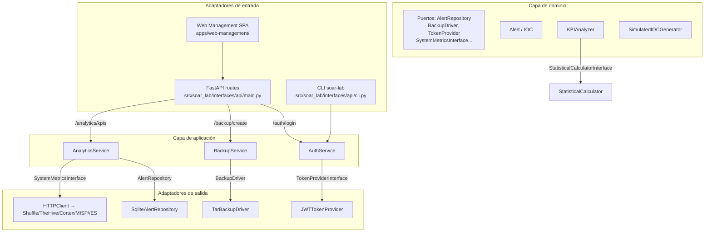

#### Dominio

Entidades y value objects (`src/soar_lab/domain/models.py`):

- `Alert`: entidad principal de alerta de seguridad (`alert_id`, `hostname`, `src_ip`, `severity`, `iocs`, ...).
- `Case`: entidad de caso de incidente (`case_id`, `title`, `severity`, `tags`, `tlp`, `alerts`, ...).
- `IOC`: indicador de compromiso con tipo, valor, confianza y tags.
- `AlertSeverity` / `AlertStatus`: enumeraciones de severidad y estado.

Servicios de dominio puros (`src/soar_lab/domain/services/`):

- `KPIAnalyzer`: cálculo de MTTR, percentiles, health score y KPIs agregados.
- `SimulatedIOCGenerator`: generación de IOCs sintéticos (hash, IP, dominio, URL).
- `StatisticalCalculator`: operaciones estadísticas usadas por `KPIAnalyzer`.

Puertos (`src/soar_lab/domain/ports/`): `AlertRepository`, `IocRepository`, `MetricRepository`, `CaseRepository`, `BackupRepository`, `TestResultRepository`, `ChecksumService`, `StorageProvider`, `BackupDriver`, `TokenProviderInterface`, `SystemMetricsInterface`, `FileSystemInterface`, `LogReader`, `LogParser`, `KPIFormatter`, `StatisticalCalculatorInterface`.

#### Aplicación

Casos de uso (`src/soar_lab/application/use_cases/`):

- `AuthService`: autenticación, verificación de credenciales (`WEB_UI_USER`/`WEB_UI_PASSWORD`) y creación/validación de JWT a través de `TokenProviderInterface`.
- `BackupService`: creación, listado y restauración de backups `.tar.gz` usando `BackupDriver` y `BackupStorageProvider`.
- `AnalyticsService`: recopilación de métricas del sistema, KPIs y estadísticas, orquestando `KPIAnalyzer`, repositorios y lectores de logs.
- `AggregatedKpisUseCase`: obtención de KPIs agregados desde Elasticsearch.
- `NodeTimingsUseCase`: obtención de timings por nodo de ejecuciones de workflow desde Elasticsearch/OpenSearch.
- `NodeTimingExtractor`: extracción de métricas de timing por nodo desde Shuffle (OpenSearch) para dashboards y análisis.

#### Puerto → adaptador → implementación


#### Ejemplo real de flujo: recepción y contención de una alerta

> **Nota**: el ingreso de alertas no pasa por la Lab API. El `main.py` de FastAPI expone métricas, estado y orquestación de casos; la ingestión real ocurre a través del webhook de Shuffle generado por `init_shuffle_webhook.py`.

```text
[src/soar_lab/simulator/simulate_alerts.py] genera alerta (dict JSON)
 │
 ▼
[infrastructure/messaging/send_alert.py] POST al webhook de Shuffle
 │
 ▼
[Shuffle workflow] recibe la alerta y ejecuta el workflow de respuesta
 │
 ▼
[infrastructure/integrations/thehive/client.py] crea caso en TheHive
 │
 ▼
[infrastructure/integrations/cortex/client.py] ejecuta analyzers
 │
 ▼
[infrastructure/integrations/misp/client.py] enriquece IoCs
 │
 ▼
[Shuffle workflow] ejecuta lógica de decisión y contención simulada
 │
 ▼
[infrastructure/integrations/thehive/client.py] actualiza caso con resultado
 │
 ▼
[domain/services/kpi_analyzer.py] calcula MTTR
 │
 ▼
[Shuffle workflow] indexa métricas KPI en Elasticsearch (`soar-metrics`)
```

#### Convenciones de importación

```python
# Lógica pura de dominio
from soar_lab.domain.services.ioc_generator import SimulatedIOCGenerator
from soar_lab.domain.services.kpi_analyzer import KPIAnalyzer

# Puertos e interfaces del dominio
from soar_lab.domain.ports import BackupDriver, AlertRepository

# Adaptadores de infraestructura
from soar_lab.infrastructure.integrations.shuffle.client import ShuffleClient
from soar_lab.infrastructure.http_alert_sender import HTTPAlertSender
from soar_lab.infrastructure.jwt_token_provider import JWTTokenProvider
from soar_lab.infrastructure.persistence.sqlite_alert_repository import SqliteAlertRepository

# Casos de uso
from soar_lab.application.use_cases.backup_service import BackupService

# Interfaces (API/CLI)
from soar_lab.interfaces.api.composition import create_app
```

#### Notas de migración

- `api/` quedó en `src/soar_lab/interfaces/api/`.
- `integrations/` se reubicó en `src/soar_lab/infrastructure/integrations/`.
- `services/` se dividió en `application/use_cases/` (orquestación) y `domain/services/` (lógica pura).
- `infrastructure/setup/` se movió a `scripts/setup/`; la carpeta `infrastructure/scripts/` se
 considera legacy y no forma parte del runtime.
- `exceptions.py` centralizado en `src/soar_lab/common/exceptions.py`.


### 3.7 Inventario de dominio y aplicaciones

Este documento inventaria las clases y responsabilidades de las capas internas del proyecto, sirviendo de mapa rápido para
mantenedores y revisores.

#### Domain Layer (`src/soar_lab/domain/`)

Responsabilidad: modelos de negocio, reglas puras, contratos de puertos y servicios del dominio.

| Archivo / Módulo | Responsabilidad principal | |------------------|---------------------------| | `models.py` | Entidades de dominio (`Alert`, `IOC`, `Case`, `AlertSeverity`, `AlertStatus`) | | `alert_generator.py` | Generación de alertas de prueba para simulación | | `statistical_calculator.py` | Utilidades estadísticas para comparaciones y tests | | `ports/` | Contratos de puertos (driven/driving) para persistencia, mensajería, backups y KPIs, organizados por categoría (`infrastructure.py`, `integrations.py`, `repositories.py`) | | `services/ioc_generator.py` | Generación de IoCs de ejemplo para tests y simulación | | `services/kpi_analyzer.py` | Cálculo de MTTR, percentiles y métricas de respuesta | | `services/_ioc_helpers.py` | Funciones auxiliares para generación de IoCs |

#### Application Layer (`src/soar_lab/application/`)

Responsabilidad: casos de uso, orquestación de dominio, coordinación de adaptadores.

| Archivo / Módulo | Responsabilidad principal | |------------------|---------------------------| | `use_cases/analytics_service.py` | Casos de uso de analytics y generación de KPIs | | `use_cases/auth_service.py` | Casos de uso de autenticación (login, validación JWT) | | `use_cases/backup_service.py` | Casos de uso de backup/restore | | `dto/` | Objetos de transferencia de datos (DTOs) entre capas |

#### Interface/API Layer (`src/soar_lab/interfaces/api/`)

Responsabilidad: exponer la aplicación como CLI y API REST.

| Archivo | Responsabilidad principal | |---------|---------------------------| | `main.py` | Aplicación FastAPI: endpoints REST, routers, health y wiring general | | `composition.py` | `CompositionRoot` / `create_app`: creación y cableado de dependencias | | `cli.py` | CLI nativo `soar-lab` (api, generate-secrets, generate-iocs, version) | | `auth.py` | Dependencias de autenticación y autorización FastAPI | | `route_helpers.py` | Constantes compartidas y factorías de dependencias para los módulos de rutas | | `routes_soar.py` | Endpoints `/soar/*` (TheHive, Cortex, MISP, Shuffle, Elasticsearch) | | `routes_services.py` | Endpoints `/services/status`, `/api/v1/contain`, `/api/v1/cache/ioc` | | `routes_analytics.py` | Endpoints de analíticas y KPIs | | `models.py` | Modelos Pydantic para request/response | | `contracts.py` | Validación de contratos OpenAPI y sincronización de schemas | | `validation.py` | Validadores de request/response reutilizables | | `middleware/trace_id.py` | Middleware de trace ID para correlación de logs | | `static/` | Recursos estáticos servidos por la API | | `__init__.py` | Package init con exports y metadata del módulo API |

#### Infrastructure Layer (`src/soar_lab/infrastructure/`)

Responsabilidad: implementar los puertos del dominio y conectar con sistemas externos.

| Archivo / Módulo | Responsabilidad principal | |------------------|---------------------------| | `integrations/` | Clientes HTTP de Elasticsearch, Shuffle, TheHive, Cortex, MISP | | `messaging/` | Transporte de alertas (`send_alert.py`) | | `monitoring/` | Health checks, `HealthService`, `SystemMetricsDriver`, `KPIAlertManager` | | `network_watcher/` | Servicio para conectar workers de Shuffle a `soar_net` | | `persistence/` | Implementaciones de repositorios (`SqliteAlertRepository`) | | `scripts/` | Scripts auxiliares de infraestructura (setup, utilidades) | | `security/` | Hardening (no implementado; escaneo vía Trivy en CI) | | `templates/` | Plantillas de configuración | | `jwt_token_provider.py` | `JWTTokenProvider`: generación y validación de tokens JWT | | `pytest_test_runner.py` | `PytestTestRunner`: ejecución remota de pruebas | | `tar_backup_driver.py` | `TarBackupDriver`: copias de seguridad en tar | | `validate_credentials.py` | Validación de credenciales de servicios externos | | `websocket_manager.py` | Gestión de WebSockets para logs y eventos en tiempo real | | `config_provider.py` | Proveedor centralizado de configuración basado en variables de entorno | | `filesystem_storage.py` | Almacenamiento basado en filesystem | | `in_memory_storage.py` | Almacenamiento en memoria para tests | | `log_parser.py` | Parsing de logs de ejecución | | `kpi_formatter.py` | Formateo de resultados de KPI | | `file_log_reader.py` | Lectura de archivos de log para análisis | | `subprocess_runner.py` | Ejecución de subprocesos con manejo de salida | | `path_service.py` | Utilidades de resolución de rutas | | `http_client.py` | Cliente HTTP reutilizable | | `clients.py` | Fábricas de clientes externos | | `pytest_output_parser.py` | Parser de salida de pytest | | `http_alert_sender.py` | Envío de alertas por HTTP | | `in_memory_alert_repository.py` | Repositorio en memoria de alertas (para tests) | | `auth_defaults.py` | Valores por defecto de autenticación | | `cleanup_service.py` | Servicio de limpieza de recursos |

#### Notas de coherencia

- `src/soar_lab/interfaces/api/models.py` contiene los modelos Pydantic de la API REST; los modelos de negocio viven en
 `src/soar_lab/domain/models.py`.
- Los servicios `analytics_service.py` y `auth_service.py` en `application/use_cases/` actúan como fachadas que
 orquestan adaptadores de infraestructura; las implementaciones finales están en `infrastructure/`.
- `infrastructure/security/` contiene únicamente scripts de hardening; no contiene lógica de aplicación Python.
- `infrastructure/scripts/` está marcado como **legacy**; para scripts canónicos ver `scripts/`.


### 3.8 Coexistencia de motores de búsqueda

#### Resumen de la decisión

El laboratorio despliega **dos motores de búsqueda simultáneamente**: Elasticsearch 7.10.2 y OpenSearch 2.10.0. Esta no es una redundancia accidental, sino una decisión técnica forzada por las incompatibilidades de las dependencias de cada servicio.

| Servicio | Motor de búsqueda | Motivo | |---|---|---| | TheHive 3.5.2 | Elasticsearch 7.10.2 | `elastic4play` no envía credenciales REST de forma fiable con `xpack.security.enabled=true` y presenta problemas de mapeo (`include_type_name`) con ES 8.x/OpenSearch 2.x. | | Cortex 3.2.0 | Elasticsearch 7.10.2 | Misma librería subyacente que TheHive (`elastic4play` / `elastic4s`). Requiere API 7.x. | | Lab API / KPI / Grafana | Elasticsearch 7.10.2 | Los datasources de Grafana y los índices de KPI (`soar-metrics`, `soar-alerts`) se crean sobre Elasticsearch. | | Shuffle 2.2.1 | OpenSearch 2.10.0 | El backend y `orborus` de Shuffle usan el cliente de OpenSearch y no funcionan correctamente con Elasticsearch 8.x. |

#### Por qué no se consolidó en un único motor

- **Shuffle** migró a OpenSearch porque el cliente/ backend no era compatible con Elasticsearch 8.x y la gestión de `include_type_name` era problemática.
- **TheHive/Cortex** permanecen en Elasticsearch 7.10.2 porque `elastic4play` está atado a la API 7.x. Subir a Elasticsearch 8.x o a OpenSearch 2.x genera errores de mapeo y autenticación REST.

#### Configuración actual

#### Elasticsearch (`soar_elasticsearch`)

- Imagen: `docker.elastic.co/elasticsearch/elasticsearch:7.10.2`
- Red: `soar_net`
- Seguridad: `xpack.security.enabled=false` (necesario para evitar errores de *missing authentication credentials* en TheHive/Cortex).
- Credenciales en `.env.full`:
 - `ELASTIC_USERNAME=elastic`
 - `ELASTIC_PASSWORD=ElasticLab2024SecurePass`
- Configuración de aplicaciones (templates renderizados a `runtime/config/` por `scripts/setup/render_configs.py`):
 - `infra/docker/config/templates/thehive.conf.template` → montado en `/etc/thehive/application.conf`
 - `infra/docker/config/templates/cortex.conf.template` → montado en `/etc/cortex/application.conf`
- Scripts que interactúan con ES:
 - `scripts/setup/configure_es.py`
 - `scripts/setup/reset_cortex.py`
 - `scripts/setup/init_thehive.py`
 - `scripts/setup/init_shuffle_webhook.py`

#### OpenSearch (`soar_opensearch`)

- Imagen: `opensearchproject/opensearch:2.10.0`
- Red: `soar_net`
- Seguridad: `plugins.security.disabled=true`
- Credenciales en `.env.full`:
 - `OPENSEARCH_USERNAME=admin`
 - `OPENSEARCH_PASSWORD=<generado por make generate-secrets>`
- Servicios consumidores:
 - `shuffle-backend` (`SHUFFLE_OPENSEARCH_URL=http://opensearch:9200`)
 - `orborus` (`SHUFFLE_OPENSEARCH_URL=http://opensearch:9200`)

#### Dependencias en Docker Compose

- `thehive` y `cortex` dependen de `elasticsearch`.
- `shuffle-backend` y `orborus` dependen de `opensearch`.
- `api` se comunica con `elasticsearch` para health-checks y métricas.

#### Riesgos y consideraciones

- **Doble consumo de recursos**: cada nodo aloca ~2 GB de heap (`ES_JAVA_OPTS` / `OPENSEARCH_JAVA_OPTS`). En entornos con poca RAM puede ser necesario escalar verticalmente.
- **Backups coherentes**: hay que respaldar dos conjuntos de datos (`soar_es_data` y `soar_opensearch_data`).
- **Hoja de ruta futura**: cuando TheHive/Cortex o sus forks soporten OpenSearch 2.x de forma nativa, Elasticsearch podrá eliminarse y Shuffle/OpenSearch/ podrían compartir un único clúster.

#### Cómo verificar el estado de ambos motores

```powershell
# Elasticsearch
curl -sf http://localhost:8200/_cluster/health

# OpenSearch
curl -sf http://localhost:8200/_cluster/health # OpenSearch escucha en 9200 interno, mapeado a 8200 en host según .env.full
```

Para ver qué servicios usan cada motor, consultar:

- `infra/docker/compose/docker-compose.yml` (Elasticsearch)
- `infra/docker/compose/docker-compose.opensearch.yml` (OpenSearch)
- `infra/docker/compose/docker-compose.core.yml` (TheHive, Cortex, Shuffle)


### 3.9 Seguridad

#### 1. Resumen

#### 1.1 Objetivo

Este documento describe la estrategia de seguridad defensa en profundidad implementada para proteger contra ataques de
ransomware y garantizar la integridad de las operaciones de seguridad del SOAR Ransomware Lab.

#### 1.2 Contexto

El SOAR Ransomware Lab implementa una estrategia de seguridad defensa en profundidad para proteger contra ataques de
ransomware y garantizar la integridad de las operaciones de seguridad. Este documento describe los controles de
seguridad, políticas y procedimientos implementados en la plataforma.

**Principios de Seguridad:**

- **Arquitectura Zero Trust**: Nunca confiar, siempre verificar
- **Principio de Mínimo Privilegio**: Acceso mínimo requerido
- **Defensa en Profundidad**: Múltiples capas de seguridad
- **Seguridad por Diseño**: Seguridad integrada en cada componente
- **Monitoreo Continuo**: Detección de amenazas en tiempo real

#### 2. Alcance

#### 2.1 Qué cubre

Este documento cubre:

- Modelo de amenazas y vectores de ataque
- Arquitectura de seguridad y zonas de seguridad
- Autenticación y autorización (MFA, SSO, RBAC)
- Protección de datos (clasificación, encriptación, gestión del ciclo de vida)
- Seguridad de red (firewalls, IDS/IPS, segmentación)
- Seguridad de aplicación (SDLC, validación de entrada)
- Seguridad de infraestructura (contenedores, cloud)
- Cumplimiento regulatorio (GDPR, SOC 2, ISO 27001)
- Operaciones de seguridad (monitoreo, mantenimiento)
- Respuesta a incidentes (procedimientos, protocolos)
- Pruebas de seguridad (evaluaciones, pentesting)

#### 2.2 Límites

Este documento no cubre:

- Detalles de configuración específicos de cada herramienta (ver documentación individual)
- Procedimientos operativos paso a paso (ver user_guide.md)
- Estrategias de pruebas específicas (ver testing/)
- Planificación del proyecto (ver docs/06-project-management.md)
- Contratos de API detallados (ver docs/03-api-and-integrations.md)

#### 2.3 Dependencias

Este documento depende de:

- Documentación oficial de cada componente (Shuffle, TheHive, Cortex, MISP)
- Documentación de arquitectura (docs/02-architecture.md)
- Guía de usuario (docs/01-getting-started.md)
- Estrategia de Docker (docs/02-architecture.md)
- Documentación de pruebas (docs/05-testing.md)
- Contratos de API (docs/03-api-and-integrations.md)

#### 3. Contenido principal

#### 3.1 Principios de seguridad

Los principios de seguridad fundamentales que guían el diseño y operación del SOAR Ransomware Lab son:

- **Arquitectura Zero Trust**: Nunca confiar, siempre verificar
- **Principio de Mínimo Privilegio**: Acceso mínimo requerido
- **Defensa en Profundidad**: Múltiples capas de seguridad
- **Seguridad por Diseño**: Seguridad integrada en cada componente
- **Monitoreo Continuo**: Detección de amenazas en tiempo real

#### 3.2 Modelo de amenazas

#### Amenazas Principales

**Amenazas Principales:**

1. **Ataques de Ransomware**
 - Encriptación de archivos
 - Exfiltración de datos
 - Disrupción del sistema
 - Impacto de negocio

2. **Amenazas Internas**
 - Insiders maliciosos
 - Exposición accidental de datos
 - Escalada de privilegios
 - Robo de datos

3. **Ataques Externos**
 - Intrusión de red
 - Abuso de API
 - Denegación de servicio
 - Ataques a la cadena de suministro

4. **Violaciones de Datos**
 - Acceso no autorizado
 - Fuga de datos
 - Violaciones de privacidad
 - Incumplimiento regulatorio

#### Arquitectura de Seguridad

**Zonas de Seguridad:**

```
┌─────────────────────────────────────────────────────────────┐
│ Zona DMZ │
│ Load Balancer │ Web Firewall │ SSL Termination │
├─────────────────────────────────────────────────────────────┤
│ Zona de Aplicación │
│ API Gateway │ WAF │ Rate Limiting │
├─────────────────────────────────────────────────────────────┤
│ Zona de Datos │
│ Database │ File Storage │ Encryption │
├─────────────────────────────────────────────────────────────┤
│ Zona de Gestión │
│ Monitoring │ Logging │ Backup Systems │
└─────────────────────────────────────────────────────────────┘
```

**Controles de Seguridad:**

1. **Controles Preventivos**
 - Firewalls y segmentación de red
 - Validación y saneamiento de entrada
 - Mecanismos de control de acceso
 - Encriptación y protección de datos

2. **Controles Detectivos**
 - Sistemas de detección de intrusiones
 - Monitoreo de seguridad y logging
 - Algoritmos de detección de anomalías
 - Analytics de comportamiento de usuario

3. **Controles Correctivos**
 - Procedimientos de respuesta a incidentes
 - Mecanismos de recuperación de sistemas
 - Gestión de parches de seguridad
 - Herramientas de análisis forense

#### Seguridad de Infraestructura

**Seguridad de Contenedores:**

1. **Seguridad de Imágenes**
 - Escaneo de imágenes base
 - Evaluación de vulnerabilidades
 - Superficie de ataque mínima
 - Actualizaciones regulares

2. **Seguridad en Runtime**
 - Aislamiento de contenedores
 - Límites de recursos
 - Políticas de red
 - Monitoreo en runtime

3. **Seguridad de Orquestación**
 - Implementación de RBAC
 - Gestión de secrets
 - Segmentación de red
 - Logging de auditoría

#### Estado de implementación de controles clave

> Matriz de clasificación funcional del despliegue de laboratorio, siguiendo la taxonomía: Implementado, Parcialmente implementado, Simulado, Planificado, No verificado, Histórico/Obsoleto.

| Control | Estado | Evidencia / Notas | |---------|--------|---------------------| | Autenticación JWT (`JWTTokenProvider`) | Implementado | `src/soar_lab/infrastructure/jwt_token_provider.py`; algoritmo `HS256`; secretos gestionados por `AuthService` en `src/soar_lab/application/use_cases/auth_service.py`; rutas críticas protegidas en `interfaces/api/main.py` | | Autorización / RBAC | Parcial | JWT valida identidad; granularidad de permisos limitada; roles definidos solo a nivel documental | | Autenticación MFA | Planificado / No verificado | No existe implementación operativa en el laboratorio | | Single Sign-On (SSO/SAML/OIDC) | Planificado | No implementado en el laboratorio actual | | WAF | No verificado | Nginx actúa como proxy inverso; módulo WAF no configurado | | DMZ / segmentación de red | Simulado | Diagramas conceptuales; sin zonas de red reales entre contenedores | | Contención real de endpoints | Simulado | `scripts/setup/notify.sh` registra notificaciones; no hay agente EDR ni aislamiento de red real | | Escaneo de vulnerabilidades | Implementado (script + CI) | `scripts/` y `.github/workflows/ci.yml` (`aquasecurity/trivy-action@master`, `scan-type: fs`) | | TLS/SSL en tránsito | Parcial | Certificados autofirmados vía Nginx (`soar.local.crt`); tráfico interno entre contenedores es mayoritariamente HTTP | | Encriptación en reposo | Parcial / No verificado | Depende de configuración de Elasticsearch/OpenSearch/ en Compose | | Network Watcher | Implementado | `src/soar_lab/infrastructure/network_watcher/` conecta workers de Shuffle a `soar_net` | | Logging centralizado | Implementado | Loki + Promtail + Grafana (`infra/docker/compose/logging/docker-compose.logging.yml`) | | Trivy / escaneo de imágenes en CI | Implementado | Job `security-scan` en `.github/workflows/ci.yml` genera `trivy-results.sarif` | | Secretos estáticos / tokens SIEM | Mitigado | Los valores operativos han sido sustituidos en documentación por placeholders (`<...>`) y `<SIEM_TOKEN>`; se recomienda auditar historial Git, logs y artefactos |

> **Nota:** Las recomendaciones de producción (MFA, SSO, WAF, DMZ real, RBAC completo, TLS mútuo, encriptación forzada) deben tratarse como trabajo futuro, no como capacidades activas del laboratorio.

---

#### 3.3 Controles implementados

#### Autenticación y Autorización

> **Ámbito real del laboratorio:** La autenticación operativa de la Lab API se basa únicamente en **JWT**. Los siguientes mecanismos se listan como capacidades futuras o arquitectónicas; **no deben afirmarse como implementados** hasta que cuenten con evidencia de prueba.

**Implementado:**

1. **Autenticación JWT**
 - Tokens firmados con `HS256`
 - Secret gestionado por `JWT_SECRET_KEY` / fallback `API_AUTH_SECRET` en `.env.full`
 - Expiración configurable mediante `JWT_EXPIRATION_MINUTES` (default 60)
 - Endpoints `/auth/login` y `/auth/verify`

**Futuro / No verificado en este despliegue:**

2. **Autenticación Multi-Factor (MFA)**
 - Planificada: OTP basado en tiempo, SMS, tokens de hardware, biometría

3. **Single Sign-On (SSO)**
 - Planificado: SAML 2.0, OAuth 2.0 / OpenID Connect, LDAP/Active Directory

**Control de Acceso:**

- **Principio de Mínimo Privilegio**: aplicado a nivel de configuración y variables `.env`; RBAC con roles granulares no está implementado.
- **Separación de Deberes**: conceptual en los workflows; no cuenta con aprobaciones automáticas en este despliegue.

#### Implementación de JWT

La autenticación de la API se implementa mediante tokens JWT gestionados por `AuthService` y `JWTTokenProvider`.

| Aspecto | Valor / Comportamiento | Ubicación | |---------|------------------------|-----------| | Algoritmo | `HS256` | `src/soar_lab/infrastructure/jwt_token_provider.py` | | Librería | `PyJWT` | `src/soar_lab/infrastructure/jwt_token_provider.py` | | Secret | `config_provider.get('jwt_secret_key')` o fallback `api_auth_secret` | `src/soar_lab/application/use_cases/auth_service.py` | | Longitud mínima | 32 caracteres (se rechaza si es menor, salvo `API_AUTH_SECRET` legacy) | `auth_service.py` | | Expiración | `JWT_EXPIRATION_MINUTES` (por defecto 60 minutos) | `auth_service.py` | | Claims | `sub` (usuario), `iat`, `exp`, `scope: access` | `jwt_token_provider.py` | | Verificación | `POST /auth/verify` con `Authorization: Bearer <token>` | `src/soar_lab/interfaces/api/main.py` |

**Rotación, almacenamiento y buenas prácticas:**

- El secreto JWT (`JWT_SECRET_KEY` o fallback `API_AUTH_SECRET`) se almacena únicamente en `.env.full` y se inyecta vía `config_provider`; nunca se codifica en fuente.
- La longitud mínima recomendada es 32 caracteres; `auth_service.py` rechaza secretos más cortos salvo que se use `API_AUTH_SECRET` legacy.
- El secreto debe regenerarse con `soar-lab generate-secrets --env > .env.full` (o el `Makefile` equivalente) y nunca publicarse en repositorios.
- Tras cambiar `JWT_SECRET_KEY` / `API_AUTH_SECRET`, los tokens emitidos con el secreto anterior quedan inválidos; los usuarios deben volver a autenticarse.
- Los endpoints protegidos usan el dependency `create_get_current_user(auth_service)`.
- JWT no cifra los claims; solo garantiza integridad. No debe transmitirse información sensible (PII, contraseñas) dentro del token.

#### Seguridad de WebSocket (`/ws/logs`)

- El endpoint `/ws/logs` de la Lab API transmite logs en tiempo real usando WebSocket.
- Actualmente no implementa autenticación en la apertura del socket; la autorización se basa en que la API esté levantada y accesible dentro de la red interna o vía Nginx.
- El SPA web-management construye la URL dinámicamente:
 ```javascript
 const protocol = window.location.protocol === 'https:' ? 'wss:' : 'ws:';
 const wsUrl = `${protocol}//${window.location.host}/api/ws/logs`;
 ```
- Si el cliente se accede por `https://soar.local`, la conexión usa `wss://soar.local/api/ws/logs`; si es por `http://localhost:8000`, usa `ws://localhost:8000/ws/logs`.
- Nginx reenvía `/api/ws/logs` al backend y añade las cabeceras `Upgrade` y `Connection`.
- **Consideraciones de seguridad**:
 - Usar siempre HTTPS/WSS en entornos no locales para evitar exposición del token y los logs.
 - Validar origen en el servidor (`Origin`/`Host`) antes de aceptar conexiones si se expone la API fuera de `localhost`.
 - Limitar el tamaño y frecuencia de mensajes para mitigar DoS.
 - No enviar credenciales, PII ni datos clasificados a través del canal de logs.
 - La reconexión es manual en `apps/web-management/script.js`; en producción se recomienda implementar reconexión con backoff y notificación de desconexión.

#### Credenciales de ejemplo y valores por defecto del laboratorio

> **Ámbito:** Los siguientes valores son **funcionales para el entorno de laboratorio local**. Están codificados o configurados como *fallbacks* para que el stack arranque cuando `.env.full` no sobrescribe una variable, **pero no deben considerarse secretos operativos**.

| Variable / secreto | Valor por defecto en el laboratorio | Ubicación típica | |--------------------|--------------------------------------|------------------| | `ELASTIC_PASSWORD` | `<ELASTIC_PASSWORD>` (generado por `make generate-secrets`) | `.env.full`, `grafana-datasources.yml` (provisioning) | | `GRAFANA_ADMIN_PASSWORD` | `<GRAFANA_ADMIN_PASSWORD>` (generado; ejemplo: `${GRAFANA_ADMIN_PASSWORD}`) | `.env.full`, scripts de setup de Grafana | | OpenSearch `AUTH` | `admin` / `<OPENSEARCH_PASSWORD>` (fallback `<OPENSEARCH_PASSWORD>`) | `.env.full`, `docker-compose.core.yml` y `docker-compose.opensearch.yml` | | `API_AUTH_SECRET` (fallback) | `<API_AUTH_SECRET>` | `.env.full`, `infra/docker/compose/docker-compose.api.yml` | | `JWT_SECRET_KEY` (fallback) | `<JWT_SECRET_KEY>` (mínimo 32 caracteres) | `.env.full`, `src/soar_lab/config/settings.py` |

**Recomendaciones:**

- Antes de cualquier despliegue no local, generar valores seguros con `soar-lab generate-secrets --env > .env.full` y sobrescribir todos los valores anteriores.
- La documentación y los ejemplos de comandos deben usar placeholders inequívocos del tipo `<ELASTIC_PASSWORD>`, `<JWT_SECRET_KEY>`, etc.
- No publicar capturas de pantalla, logs, artefactos ni backups que contengan estas credenciales sin enmascararlas.

#### Protección de Datos

**Gestión del Ciclo de Vida de Datos:**

1. **Retención de Datos**
 - Políticas de retención automatizadas
 - Procedimientos de legal hold
 - Eliminación segura de datos
 - Documentación de cumplimiento

2. **Privacidad de Datos**
 - Identificación y enmascaramiento de PII
 - Cumplimiento GDPR
 - Principios de minimización de datos
 - Privacidad por diseño

#### Seguridad de Aplicación

**Ciclo de Vida de Desarrollo Seguro:**

1. **Fase de Diseño**
 - Modelado de amenazas
 - Revisión de arquitectura de seguridad
 - Definición de requisitos de seguridad
 - Evaluación de impacto de privacidad

2. **Fase de Desarrollo**
 - Estándares de codificación segura
 - Procesos de revisión de código
 - Escaneo de análisis estático
 - Escaneo de vulnerabilidades de dependencias

3. **Fase de Pruebas**
 - Automatización de pruebas de seguridad
 - Pruebas de penetración
 - Evaluación de vulnerabilidades
 - Pruebas de regresión de seguridad

4. **Fase de Despliegue**
 - Revisión de configuración de seguridad
 - Hardening de producción
 - Configuración de monitoreo de seguridad
 - Preparación de respuesta a incidentes

#### Respuesta a Incidentes

**Proceso de Respuesta a Incidentes:**

```
┌─────────────────────────────────────────────────────────────┐
│ Ciclo de Vida de Respuesta a Incidentes │
├─────────────────────────────────────────────────────────────┤
│ Preparación → Detección → Análisis → Contención → Erradicación │
├─────────────────────────────────────────────────────────────┤
│ Recuperación → Post-incidente → Lecciones Aprendidas → Mejora │
└─────────────────────────────────────────────────────────────┘
```

**Procedimientos de Respuesta:**

1. **Respuesta a Ransomware**
 - Aislamiento inmediato
 - Preservación de evidencia
 - Protocolos de comunicación
 - Procedimientos de recuperación

2. **Respuesta a Violación de Datos**
 - Medidas de contención
 - Evaluación de impacto
 - Procedimientos de notificación
 - Acciones de remediación

3. **Respuesta a Incidente de Seguridad**
 - Triage y priorización
 - Procedimientos de investigación
 - Análisis forense
 - Requisitos de documentación

#### Procedimientos Específicos de Respuesta a Ransomware

**Fase 1: Detección y Aislamiento (0-15 minutos)**

```bash
# 1. Identificar sistemas afectados
docker ps | grep -E "thehive|cortex|shuffle"

# 2. Aislar contenedores afectados
docker stop soar_thehive soar_cortex soar_shuffle_backend

# 3. Preservar evidencia forense
docker commit soar_thehive soar_thehive_forensic_<timestamp>
docker logs soar_thehive > runtime/forensic/thehive_<timestamp>.log
```

**Fase 2: Análisis y Contención (15-60 minutos)**

> **Nota sobre contención activa:** No existe un `containment_service.py` en el repositorio. La contención real de endpoints (aislamiento de red, bloqueo de cuentas, terminación de procesos) **está simulada**: el workflow de Shuffle decide y, en caso malicioso, invoca `scripts/setup/notify.sh` para registrar la notificación y generar métricas. Una respuesta activa real requeriría un agente EDR o responder conectado.

```bash
# 1. Analizar logs de alertas
cat runtime/logs/notify.log | grep -i ransomware

# 2. Verificar integridad de datos
bash scripts/

# 3. Ejecutar scripts de contención simulada
bash scripts/setup/notify.sh
```

**Fase 3: Erradicación y Recuperación (1-4 horas)**

```bash
# 1. Restaurar desde backup limpio
curl -X POST http://localhost:8000/backup/restore \
 -H "Authorization: Bearer $TOKEN" \
 -H "Content-Type: application/json" \
 -d '{"name": "<clean_backup_name>"}'

# 2. Verificar integridad de servicios
make health

# 3. Actualizar credenciales comprometidas
soar-lab generate-secrets --env > .env.full
```

#### 3.4 Cumplimiento y protección de datos

#### Clasificación de Datos

```
┌─────────────────────────────────────────────────────────────┐
│ Clasificación de Datos │
├─────────────────────────────────────────────────────────────┤
│ Público │ Interno │ Confidencial │ Secreto │
│ - Marketing │ - Operaciones │ - Datos de Cliente │ - Claves │
│ - Documentación│ - Procedimientos│ - Incidentes │ - Cripto│
│ - APIs Públicas │ - Documentos Internos│ - Forensics │ - Admin │
└─────────────────────────────────────────────────────────────┘
```

#### Matriz de Trazabilidad: Controles de Seguridad vs Requisitos Regulatorios

| Control de Seguridad | GDPR Art. 32 | SOC 2 CC6.1 | ISO 27001 A.12 | NIST CSF PR.AC | Implementación | |-----------------------------|--------------|-------------|----------------|----------------|-------------------------------------------------------------| | Autenticación MFA | ✓ | ✓ | ✓ | ✓ | Shuffle, TheHive (pendiente) | | Encriptación AES-256 | ✓ | ✓ | ✓ | ✓ | Elasticsearch (pendiente) | | TLS 1.3 en tránsito | ✓ | ✓ | ✓ | ✓ | Nginx (pendiente) | | RBAC | ✓ | ✓ | ✓ | ✓ | Todos los servicios (parcial) | | Logging de auditoría | ✓ | ✓ | ✓ | ✓ | Docker logs (implementado) | | Retención de datos | ✓ | ✓ | ✓ | ✓ | Configuración por definir | | Respuesta a incidentes | ✓ | ✓ | ✓ | ✓ | Playbook E2E (implementado) | | Backups automatizados | ✓ | ✓ | ✓ | ✓ | API `/backup/create` (implementado) | | Escaneo de vulnerabilidades | ✓ | ✓ | ✓ | ✓ | `scripts/` (implementado) |

**Nota:** Los controles marcados como "pendiente" son recomendaciones para producción que no están implementados en el
laboratorio actual.

#### Cumplimiento Regulatorio

El laboratorio está orientado hacia los siguientes marcos de referencia, pero **no constituye una certificación** ni garantía formal:

- **GDPR**: Protección de datos personales
- **SOC 2**: Seguridad y disponibilidad
- **ISO 27001**: Gestión de seguridad de la información

#### 3.5 Diagramas o matrices

#### Vectores de Ataque

```
┌─────────────────────────────────────────────────────────────┐
│ Superficie de Ataque │
├─────────────────────────────────────────────────────────────┤
│ Web Interface │ API Endpoints │ File Uploads │ Email │
├─────────────────────────────────────────────────────────────┤
│ Network Ports │ Authentication │ Data Storage │ Logs │
├─────────────────────────────────────────────────────────────┤
│ Third-party │ Dependencies │ Backups │ Config │
└─────────────────────────────────────────────────────────────┘
```

#### Procedimientos de Hardening por Componente

**Shuffle SOAR:**

- Cambiar credenciales por defecto (SHUFFLE_DEFAULT_APIKEY)
- Habilitar autenticación multi-factor
- Configurar HTTPS con certificados TLS válidos
- Limitar acceso a IPs específicas
- Deshabilitar analyzers no necesarios

**TheHive:**

- Cambiar credenciales por defecto de admin
- Configurar HTTPS con certificados TLS
- Implementar políticas de retención de datos
- Habilitar auditoría de acciones
- Configurar CORS restrictivo

**Cortex:**

- Cambiar credenciales por defecto
- Limitar analyzers activos
- Configurar rate limiting
- Habilitar autenticación fuerte
- Revisar y actualizar analyzers regularmente

**Elasticsearch:**

- Habilitar xpack.security (actualmente deshabilitado para desarrollo)
- Configurar autenticación básica o TLS
- Implementar encriptación de datos en reposo
- Configurar firewall de red
- Limitar acceso a puertos (9201)

**MISP:**

- Cambiar credenciales por defecto
- Configurar HTTPS
- Implementar autenticación SAML/LDAP
- Configurar políticas de feed
- Habilitar logging de auditoría

**:**

- Configurar autenticación API
- Implementar reglas de firewall
- Configurar políticas de retención
- Habilitar encriptación de comunicaciones
- Limitar acceso a puertos (15141-1516)

**Nginx:**

- Configurar HTTPS con TLS 1.3
- Implementar HSTS
- Configurar WAF básico
- Limitar tamaño de uploads
- Configurar rate limiting

#### Framework de Autorización (RBAC)

```python
# Control de acceso basado en roles (RBAC)
ROLES = {
 'admin': ['read', 'write', 'delete', 'manage'],
 'analyst': ['read', 'write', 'analyze'],
 'operator': ['read', 'execute'],
 'viewer': ['read']
}

PERMISSIONS = {
 'alerts': ['read', 'write', 'delete'],
 'cases': ['read', 'write', 'delete', 'assign'],
 'playbooks': ['read', 'write', 'execute'],
 'users': ['read', 'write', 'delete'],
 'system': ['read', 'write', 'manage']
}
```

#### Estándares de Encriptación

**Datos en Reposo:**

- Encriptación AES-256
- Encriptación de disco completo
- Encriptación de base de datos
- Encriptación de filesystem

**Datos en Tránsito:**

- TLS 1.3 para todas las comunicaciones
- Certificate pinning
- Autenticación TLS mutua
- VPN para acceso remoto

**Gestión de Claves:**

- Módulos de Seguridad de Hardware (HSM)
- Políticas de rotación de claves
- Almacenamiento seguro de claves
- Procedimientos de escrow y recuperación

#### Seguridad de Red

**Arquitectura de Red:**

```
┌─────────────────────────────────────────────────────────────┐
│ Internet │
├─────────────────────────────────────────────────────────────┤
│ Firewall │ IDS/IPS │ Load Balancer │ WAF │
├─────────────────────────────────────────────────────────────┤
│ Red DMZ │
│ Web Servers │ API Gateways │ Reverse Proxies │
├─────────────────────────────────────────────────────────────┤
│ Red de Aplicación │
│ App Servers │ Microservices │ Internal APIs │
├─────────────────────────────────────────────────────────────┤
│ Red de Datos │
│ Databases │ File Storage │ Backup Systems │
└─────────────────────────────────────────────────────────────┘
```

#### Marcos Regulatorios

**GDPR (Regulación General de Protección de Datos):**

- Derechos del sujeto de datos
- Gestión de consentimiento
- Notificación de violación de datos
- Privacidad por diseño

**SOC 2 (Service Organization Control 2):**

- Controles de seguridad
- Controles de disponibilidad
- Integridad de procesamiento
- Controles de privacidad

**ISO 27001 (Gestión de Seguridad de la Información):**

- Implementación de ISMS
- Gestión de riesgos
- Mejora continua
- Mantenimiento de certificación

#### 4. Validación

#### 4.1 Verificación

La seguridad se verifica mediante:

- Escaneos automatizados de vulnerabilidades
- Pruebas de penetración periódicas
- Auditorías de seguridad internas y externas
- Revisiones de código de seguridad
- Monitoreo continuo de seguridad
- Evaluaciones de cumplimiento

#### 4.2 Criterios de aceptación

La seguridad se considera válida cuando:

- Todos los controles de seguridad están implementados
- Las pruebas de seguridad pasan sin vulnerabilidades críticas
- El monitoreo de seguridad detecta anomalías
- Los procedimientos de respuesta a incidentes están documentados y probados
- El cumplimiento regulatorio se mantiene
- Los usuarios están capacitados en políticas de seguridad

#### 4.3 Evidencias

Las evidencias de validación incluyen:

- Reportes de escaneo de vulnerabilidades
- Reportes de pruebas de penetración
- Logs de auditoría de seguridad
- Certificados de cumplimiento
- Documentación de políticas y procedimientos
- Registros de capacitación de seguridad

#### 5. Problemas y consideraciones

#### 5.1 Limitaciones

- **Configuración por defecto**: Las configuraciones por defecto de las herramientas pueden no ser adecuadas para
 producción
- **Recursos limitados**: Monitoreo y respuesta a incidentes requieren personal dedicado
- **Dependencias de terceros**: Seguridad depende de la seguridad de componentes de terceros
- **Evolución de amenazas**: Las amenazas evolucionan constantemente, requiriendo actualizaciones continuas

#### 5.2 Riesgos o incidencias

- **Falta de hardening**: Configuraciones inseguras pueden exponer vulnerabilidades
- **Fuga de datos**: Brechas de seguridad pueden resultar en pérdida de datos sensibles
- **Disponibilidad**: Ataques DDoS pueden afectar la disponibilidad del sistema
- **Cumplimiento**: Falta de cumplimiento puede resultar en sanciones regulatorias
- **Insiders**: Usuarios maliciosos internos pueden eludir controles de seguridad

#### 5.3 Recomendaciones / troubleshooting

- **Hardening**: Implementar hardening de seguridad antes de despliegue en producción
- **Monitoreo**: Configurar alertas de seguridad para detección temprana
- **Capacitación**: Proporcionar capacitación regular de seguridad a todos los usuarios
- **Actualizaciones**: Mantener todos los componentes actualizados con parches de seguridad
- **Pruebas**: Ejecutar pruebas de seguridad regularmente para identificar vulnerabilidades

#### 6. Referencias

- **Repositorio del Proyecto**: [alesanfe/soar-ransomware-lab](https://github.com/alesanfe/soar-ransomware-lab.git)
- **Documentación de Seguridad de Shuffle**: https://shuffler.io/docs/security
- **Documentación de Seguridad de TheHive**: https://docs.strangebee.com/thehive/admin-guide/security/
- **Documentación de Seguridad de Cortex**: https://docs.strangebee.com/cortex/admin-guide/security/
- **Documentación de Seguridad de MISP**: https://www.misp-project.org/guides/admin/
- **Documentación de Seguridad de Elasticsearch
 **: https://www.elastic.co/guide/en/elasticsearch/reference/current/security-settings.html
- **OWASP Top 10**: https://owasp.org/www-project-top-ten/
- **Marco de Ciberseguridad NIST**: https://www.nist.gov/cyberframework
- **Benchmarks CIS**: https://www.cisecurity.org/cis-benchmarks/
- **Documentación de Arquitectura**: [docs/02-architecture.md](#31-visión-general-de-arquitectura)
- **Guía de Usuario**: [docs/01-getting-started.md](01-getting-started.md)

---

**Mejoras implementadas:**

- Corregidas referencias a docs/core/ a rutas correctas (docs/02-architecture.md, docs/01-getting-started.md)
- Añadidos procedimientos detallados de hardening para cada componente (Shuffle, TheHive, Cortex, Elasticsearch, MISP, Nginx)
- Documentados procedimientos específicos de respuesta a ransomware con 3 fases (detección, análisis, recuperación)
- Añadida matriz de trazabilidad entre controles de seguridad y requisitos regulatorios (GDPR, SOC 2, ISO 27001, NIST
 CSF)


### 3.10 Matriz de versiones

Esta matriz resume las versiones canónicas de las dependencias, imágenes Docker y herramientas utilizadas en el repositorio. La fuente de verdad sigue siendo `pyproject.toml`, los archivos `docker-compose*.yml` y `.github/workflows/ci.yml`.

#### Proyecto

| Componente | Versión / Requisito | Fuente | |------------|---------------------|--------| | `soar-lab` (proyecto) | `1.4.0` | `pyproject.toml` | | Python | `>=3.11` | `pyproject.toml` | | Node.js (docs-site) | `>=18.0` | `apps/docs-site/package.json` | | Docusaurus | `^3.0.0` | `apps/docs-site/package.json` | | React | `^18.2.0` | `apps/docs-site/package.json` |

#### Dependencias principales (Python)

| Paquete | Versión mínima | Fuente | |---------|----------------|--------| | FastAPI | `>=0.100.0` | `pyproject.toml` | | Uvicorn | `>=0.23.0` | `pyproject.toml` | | Pydantic | `>=2.0.0` | `pyproject.toml` | | Redis (cliente) | `>=4.0.0` | `pyproject.toml` | | Docker SDK | `>=6.0.0` | `pyproject.toml` | | psutil | `>=5.9.0` | `pyproject.toml` |

#### Calidad de código y tests

| Herramienta | Versión / Configuración | Fuente | |-------------|-------------------------|--------| | pytest | `>=7.0.0` | `pyproject.toml` (`[tool.pytest.ini_options]`) | | pytest-cov | `>=4.0.0` | `pyproject.toml` | | pytest-asyncio | `>=0.21.0` | `pyproject.toml` | | Black | `>=23.0.0` / longitud `100` / `py311` | `pyproject.toml`, `.pre-commit-config.yaml` | | isort | `>=5.12.0` / perfil `black` | `pyproject.toml`, `.pre-commit-config.yaml` | | flake8 | `>=6.0.0` / `max-line-length=100` | `pyproject.toml`, `.pre-commit-config.yaml` | | mypy | `>=1.0.0` / `python_version=3.11` | `pyproject.toml` | | pre-commit | `>=3.0.0` | `pyproject.toml` | | ShellCheck | (versión del runner) | `.github/workflows/ci.yml` |

#### Imágenes Docker

#### Core / SOAR

| Servicio | Imagen | Fuente | |----------|--------|--------| | Redis | `redis:7-alpine` | `infra/docker/compose/docker-compose.core.yml` | | TheHive | `thehiveproject/thehive:3.5.2-1` | `infra/docker/compose/docker-compose.core.yml` | | Shuffle Frontend | `ghcr.io/shuffle/shuffle-frontend:2.2.1` | `infra/docker/compose/docker-compose.core.yml` | | Shuffle Backend | `ghcr.io/shuffle/shuffle-backend:2.2.1` | `infra/docker/compose/docker-compose.core.yml` | | Shuffle Orborus | `ghcr.io/shuffle/shuffle-orborus:2.2.1-patched` | `infra/docker/compose/docker-compose.core.yml` | | Tenzir Node | `tenzir/tenzir:v6.8.1` | `infra/docker/compose/docker-compose.core.yml` | | Nginx | `nginx:1.25-alpine` | `infra/docker/compose/docker-compose.api.yml` |

#### Bases de datos e índices

| Servicio | Imagen | Fuente | |----------|--------|--------| | Elasticsearch | `docker.elastic.co/elasticsearch/elasticsearch:7.10.2` | `infra/docker/compose/docker-compose.yml` | | OpenSearch | `opensearchproject/opensearch:2.10.0` | `infra/docker/compose/docker-compose.opensearch.yml` | | OpenSearch Dashboards | `opensearchproject/opensearch-dashboards:2.10.0` | `infra/docker/compose/docker-compose.opensearch.yml` | | Grafana DB (Postgres) | `postgres:14-alpine` | `infra/docker/compose/logging/docker-compose.logging.yml` |

#### Logging y observabilidad

| Servicio | Imagen | Fuente | |----------|--------|--------| | Grafana | `grafana/grafana:10.3.4` | `infra/docker/compose/logging/docker-compose.logging.yml` | | Loki | `grafana/loki:2.9.10` | `infra/docker/compose/logging/docker-compose.logging.yml` | | Promtail | `grafana/promtail:2.9.9` | `infra/docker/compose/logging/docker-compose.logging.yml` |

#### MISP

| Servicio | Imagen | Fuente | |----------|--------|--------| | MISP DB | `mariadb:10.11` | `infra/docker/compose/docker-compose.misp.yml` | | MISP Core | `ghcr.io/misp/misp-docker/misp-core:v2.5.44` | `infra/docker/compose/docker-compose.misp.yml` | | MISP Modules | `ghcr.io/misp/misp-docker/misp-modules:v3.0.9` | `infra/docker/compose/docker-compose.misp.yml` |

###

| Servicio | Imagen | Fuente | |----------|--------|--------|

#### CI/CD y runners

| Componente | Versión | Fuente | |------------|---------|--------| | GitHub Actions runner | `ubuntu-latest` | `.github/workflows/ci.yml` | | Python CI | `3.11` | `.github/workflows/ci.yml` | | Node.js CI | `20` | `.github/workflows/ci.yml` | | Trivy | `master` (`aquasecurity/trivy-action`) | `.github/workflows/ci.yml` |

#### Notas de coherencia

- El proyecto requiere **Python 3.11+** en `pyproject.toml` y en `.github/workflows/ci.yml`.
- `apps/docs-site/package.json` declara `node>=18.0`, mientras que CI usa `node-version: '20'`; ambas son compatibles.
- `tenzir/tenzir:v6.8.1` está fijada a una etiqueta de versión; para mayor reproducibilidad se recomienda fijar a un digest SHA en producción.
- Las imágenes `misp-core:v2.5.44` y `misp-modules:v3.0.9` están fijadas a etiquetas de versión; para mayor reproducibilidad se recomienda fijar a un digest SHA.
- Las versiones de Shuffle (`2.2.1`) y TheHive (`3.5.2-1`) coinciden con las variables documentadas en `docs/03-api-and-integrations.md` y `docs/02-architecture.md`.


---

#### 4. Validación

#### 4.1 Verificación

La validación se realiza mediante tests automatizados, health checks y verificación manual del stack.

#### 4.2 Criterios de aceptación

- Todos los servicios críticos responden a health checks
- Los tests unitarios y de integración pasan sin errores
- El composition root cablea correctamente las dependencias

#### 4.3 Evidencias

- Resultados de `pytest` en CI
- `docker ps` mostrando servicios healthy
- Reportes de cobertura en `runtime/coverage/`

---

#### 5. Problemas y consideraciones

#### 5.1 Limitaciones

- Algunos componentes requieren Docker-in-Docker para funcionar completamente
- Elasticsearch single-node: estado `yellow` es normal

#### 5.2 Riesgos o incidencias

- Dependencia de imágenes Docker externas para servicios core
- Fragmentación de configuración entre múltiples archivos Compose

#### 5.3 Recomendaciones / troubleshooting

- Usar `make health` tras `make up` para verificar el stack
- Revisar `make logs` si un servicio no responde
- Consultar [04-operations.md](04-operations.md) para troubleshooting detallado

---

#### 6. Referencias

- [01-getting-started.md](01-getting-started.md)
- [03-api-and-integrations.md](03-api-and-integrations.md)
- [04-operations.md](04-operations.md)
- [glossary.md](glossary.md)

## 4. Validación

### 4.1 Verificación

La arquitectura se verifica mediante:

- Pruebas de configuración Docker (`tests/integration/test_docker_runtime_status.py`)
- Pruebas de runtime Docker (`tests/integration/test_docker_runtime_status.py`)
- Pruebas de navegador (`tests/integration/test_docker_runtime_status.py`)
- Health checks de cada servicio
- Verificación de conectividad entre redes Docker

### 4.2 Criterios de aceptación

La arquitectura se considera válida cuando:

- Todos los servicios inician correctamente
- Los puertos configurados son accesibles
- Las redes Docker permiten la comunicación requerida
- Los volúmenes persistentes montan correctamente
- Los servicios de logging y monitoreo funcionan
- Los health checks pasan para todos los servicios

### 4.3 Evidencias

Las evidencias de validación incluyen:

- Logs de Docker Compose (`docker compose up`)
- Salida de `docker ps` mostrando contenedores en ejecución
- Logs de health checks
- Resultados de pruebas automatizadas
- Capturas de pantalla de interfaces web accesibles

## 5. Problemas y consideraciones

### 5.1 Limitaciones

- **Single-node Elasticsearch**: Configuración actual no soporta clustering
- **Requisitos de recursos**: Mínimo 8GB RAM requerido para stack completo
- **Windows/Hyper-V**: Restricciones en rangos de puertos debido a reservas de Hyper-V
- **Escalabilidad**: Diseño actual no soporta alta disponibilidad nativa
- **Persistencia**: Los volúmenes Docker requieren backup manual

### 5.2 Riesgos o incidencias

- **Pérdida de datos**: Si los volúmenes Docker no se respaldan regularmente
- **Conflictos de puertos**: Puertos ya en uso en el host pueden causar fallos
- **Dependencias de red**: Requiere conectividad a internet para pulls de imágenes
- **Versiones de componentes**: Actualizaciones pueden romper compatibilidad
- **Seguridad**: Configuración por defecto puede no ser adecuada para producción

### 5.3 Recomendaciones / troubleshooting

- **Backup**: Implementar backup automatizado de volúmenes persistentes
 ```bash
 # Crear backup vía API
 curl -X POST http://localhost:8000/api/backup/create \
 -H "Authorization: Bearer $TOKEN" \
 -H "Content-Type: application/json" \
 -d '{"name": "manual-backup"}'
 ```
- **Procedimiento de Backup de Volúmenes**:
 - Los volúmenes Docker usan bind mounts a `runtime/data/`
 - Backup manual: Copiar directorio `runtime/data/` a ubicación segura
 - Backup automatizado: Llamar al endpoint `/api/backup/create` o programar tarea con `curl`
 - Restauración: Llamar al endpoint `/api/backup/restore` con el nombre del backup
- **Monitoreo**: Configurar alertas para health checks y métricas de recursos
- **Seguridad**: Revisar y hardening de configuración antes de despliegue en producción
- **Documentación**: Mantener documentación actualizada con cambios de configuración
- **Testing**: Ejecutar pruebas de configuración antes de cambios en Docker Compose

---

#### Navegación

- [Instalación y guía rápida](01-getting-started.md)
- [API REST, endpoints e integraciones](03-api-and-integrations.md)
- [Configuración, infraestructura, backups, troubleshooting](04-operations.md)
- [Estrategia de pruebas y suite](05-testing.md)
- [Objetivos, plan, riesgos, auditorías](06-project-management.md)
- [Glosario central](glossary.md)
- [Índice](index.md)
## 6. Referencias

- **Repositorio del Proyecto**: [alesanfe/soar-ransomware-lab](https://github.com/alesanfe/soar-ransomware-lab.git)
- **Documentación de Shuffle**: https://shuffler.io/docs
- **Documentación de TheHive**: https://docs.strangebee.com/thehive/
- **Documentación de Cortex**: https://docs.strangebee.com/cortex/
- **Documentación de MISP**: https://www.misp-project.org/documentation/
- **Documentación de Elasticsearch**: https://www.elastic.co/guide/en/elasticsearch/reference/current/index.html
- **Documentación de Docker Compose**: https://docs.docker.com/compose/
- **Documentación de FastAPI**: https://fastapi.tiangolo.com/
- **Documentación de Nginx**: https://nginx.org/en/docs/
- **Documentación de Seguridad**: [docs/02-architecture.md](#39-seguridad)
- **Guía de Usuario**: [docs/01-getting-started.md](01-getting-started.md)
- **Estrategia de Docker**: [docs/02-architecture.md](#35-arquitectura-docker)

---

**Mejoras implementadas:**

- Corregidas referencias a docs/core/ a rutas correctas (docs/02-architecture.md)
- Documentados procedimientos de backup de volúmenes en sección 5.3
- Añadidos diagramas de secuencia Mermaid para flujos de integración en sección 3.4


---

## Anexo: Diagramas Canónicos de Arquitectura y Flujos


Referencia TFM: complementa el Capítulo 4 (Desarrollo específico) y el Capítulo 2 (Estado del arte),
y Anexo B (Playbook SOAR). Estos diagramas son la versión canónica extraída de
`docs/02-architecture.md`, `docs/04-operations.md`, `docs/06-project-management.md`
y `README.md`. Los diagramas de `specific_development.md` son versiones simplificadas;
los de este anexo son los completos.

---

## F.1. Arquitectura de Alto Nivel

Diagrama de componentes principales y flujo de datos del sistema SOAR. Muestra
los 23 contenedores Docker del laboratorio más el simulador SIEM (script Python,
no contenedor) y TI (sistemas externos).

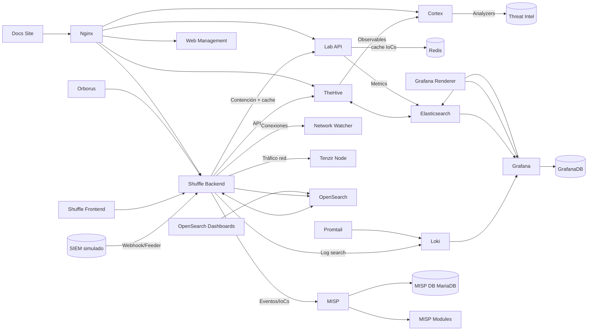

Fuente: `README.md` e `infra/docker/compose/docker-compose*.yml`

---

## F.2. Arquitectura de Despliegue Docker

Diagrama completo de la topología Docker: Nginx proxy, redes (soar_net, ti_net,
logging_net) y conexiones entre los 23 servicios.

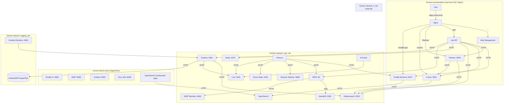

Fuente: `docs/02-architecture.md` línea 169

---

## F.3. Arquitectura Hexagonal (Ports & Adapters)

Diagrama de la arquitectura hexagonal del código Python: capas de dominio, aplicación,
infraestructura e interfaces, con sus puertos y adaptadores.

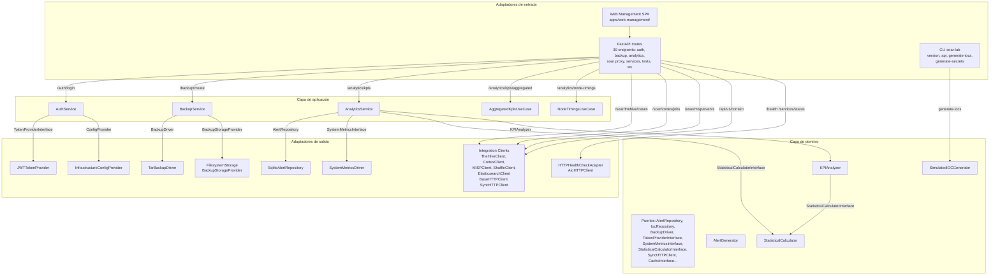

Fuente: `docs/02-architecture.md` línea 1390

---

## F.4. Diagrama de Contexto C4

Modelo C4 de contexto mostrando los límites del sistema y las integraciones externas.

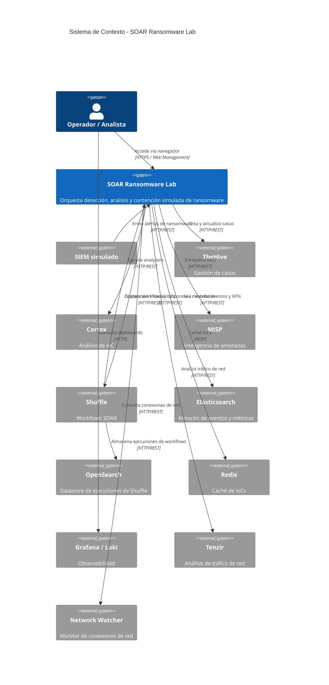

Fuente: `docs/04-operations.md` línea 1296

---

## F.5. Flujo End-to-End de Alertas (Sequence Diagram)

Diagrama de secuencia completo del flujo de una alerta desde el simulador SIEM hasta
la indexación de métricas en Elasticsearch, pasando por Shuffle, TheHive, Cortex y MISP.

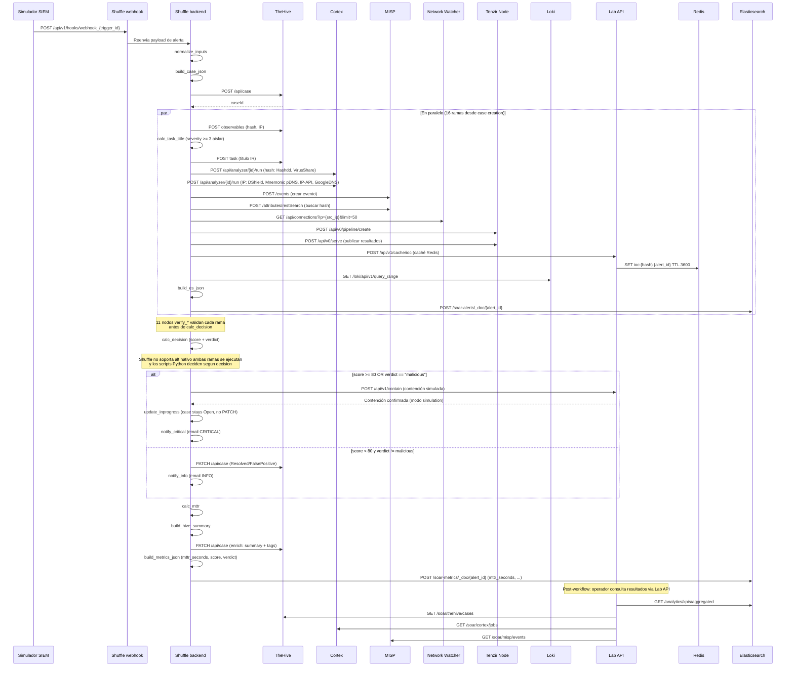

Fuente: `docs/04-operations.md` línea 1380

---

## F.6. Árbol de Decisión del Playbook

Flowchart del playbook SOAR mostrando la lógica de decisión: validación, creación de caso,
análisis con Cortex, y branching entre contención (malicioso) y falso positivo (benigno).

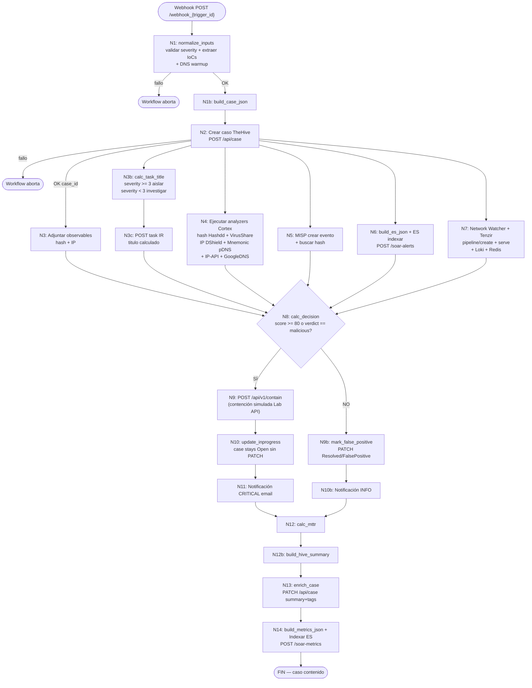

Fuente: `docs/04-operations.md` línea 4302

---

## F.7. Respuesta Automatizada (Sequence Diagram)

Diagrama de secuencia del zoom sobre la rama de decisión del playbook: tras
`calc_decision`, el workflow ejecuta contención (malicioso) o marca falso positivo
(benigno), seguido del enriquecimiento del caso y la indexación de métricas.

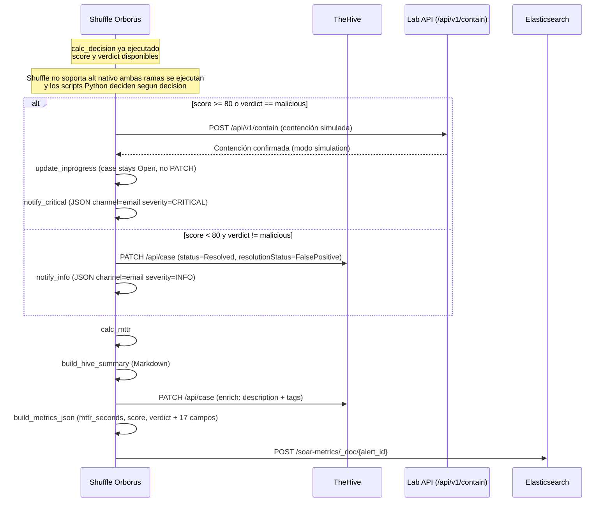

Fuente: `docs/02-architecture.md` línea 519

---

## F.8. Cronograma de Objetivos SMART (Gantt)

Diagrama Gantt del cronograma de los 20 objetivos SMART distribuidos en 4 fases
(planificación inicial 12 semanas, aumentada a 15 tras diseño, ejecución real 18 semanas,
27 abr - 31 ago 2026).

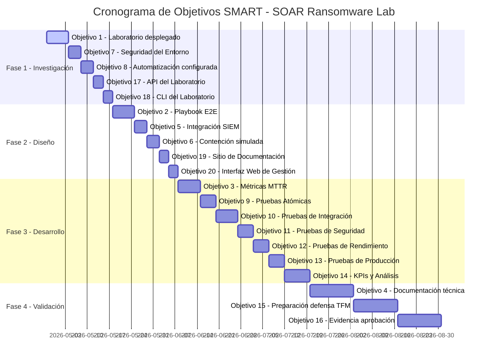

Fuente: `docs/thesis/objectives_and_methodology.md` líneas 86-116 (cronograma 18 semanas 2026), `docs/06-project-management.md` líneas 171-203 (objetivos SMART)

---

## F.9. Roadmap Semanal (Gantt)

Diagrama Gantt simplificado del roadmap semanal con ruta crítica marcada.

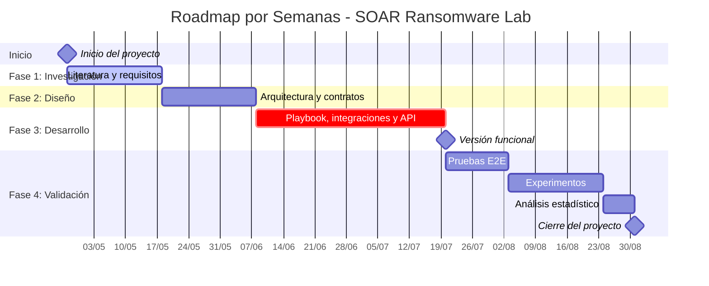

Nota: La planificación inicial era de 12 semanas, aumentada a 15 tras
la fase de diseño (integración de Cortex con analyzers externos y stack de
monitoreo no contemplados inicialmente). La ejecución real se extendió a
18 semanas (27 abr - 31 ago 2026, 3+3+6+6) debido a la ampliación de la
suite de tests (2233 tests coleccionados, 1905 seleccionados) y la ejecución del experimento (n=50).
Ver `objectives_and_methodology.md` para el cronograma real.

Fuente: `docs/thesis/objectives_and_methodology.md` líneas 90-116 (Gantt 18 semanas 2026)

---

## F.10. Matriz de Priorización de Riesgos

Diagrama de la matriz de riesgos del proyecto, clasificados por probabilidad e impacto.

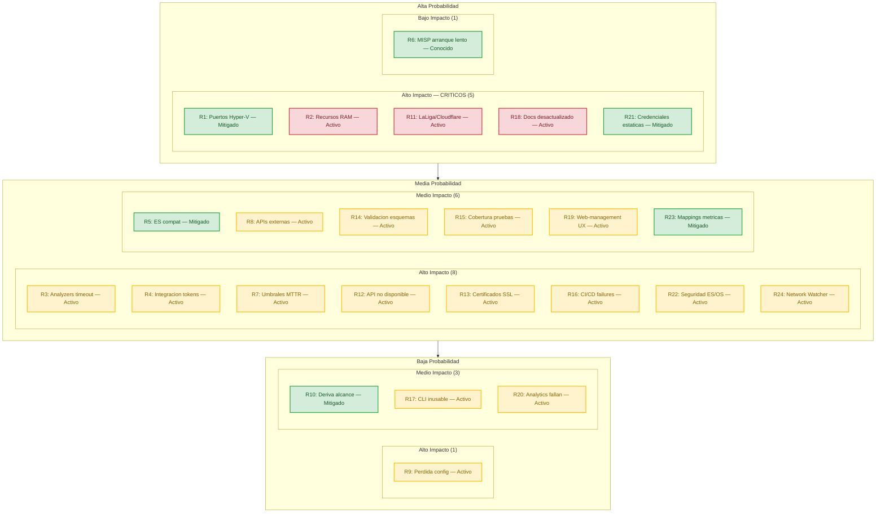

Leyenda: Sí Mitigado o Conocido · Parcial En seguimiento / Activo

Fuente: `docs/06-project-management.md` línea 1381 (tabla detallada R1-R24, fuente autoritativa)

---

## F.11. Caso de Estudio: GMinst4ll (Flujo de Infección)

Diagrama del flujo completo de infección del malware **GMinst4ll 2.03.rar** (884 MB,
InfoStealer/Loader), analizado forensemente entre el 11-13 de junio de 2026 en un
sandbox aislado (Ubuntu 20.04 + Windows Server 2016 con Vagrant, red aislada, Sysmon).
El caso de estudio valida el laboratorio SOAR con IoCs reales: 4 hashes SHA256, 7 URLs
C2, 9 IPs, 1 clave de registro, 66 dominios bloqueados y 7 técnicas MITRE ATT&CK.

| Atributo | Valor |
|----------|-------|
| Actor | `boycots563` (GitHub user ID 193230682, 1 repo, 0 stars, 1 watcher) |
| Origen | Eslovaquia (subida a MediaFire 2026-06-10 23:57:07) |
| Repo C2 | `github.com/boycots563/wlt56` — público y activo, 253 commits (ago 2026) |
| Operador Telegram | @KJL4999S (Chat ID 6820575341, bot `buchstys4_bot` ID 7675556882) |
| Sofisticación | RAR anidado, ConfuserEx, servicios legítimos para C2 |


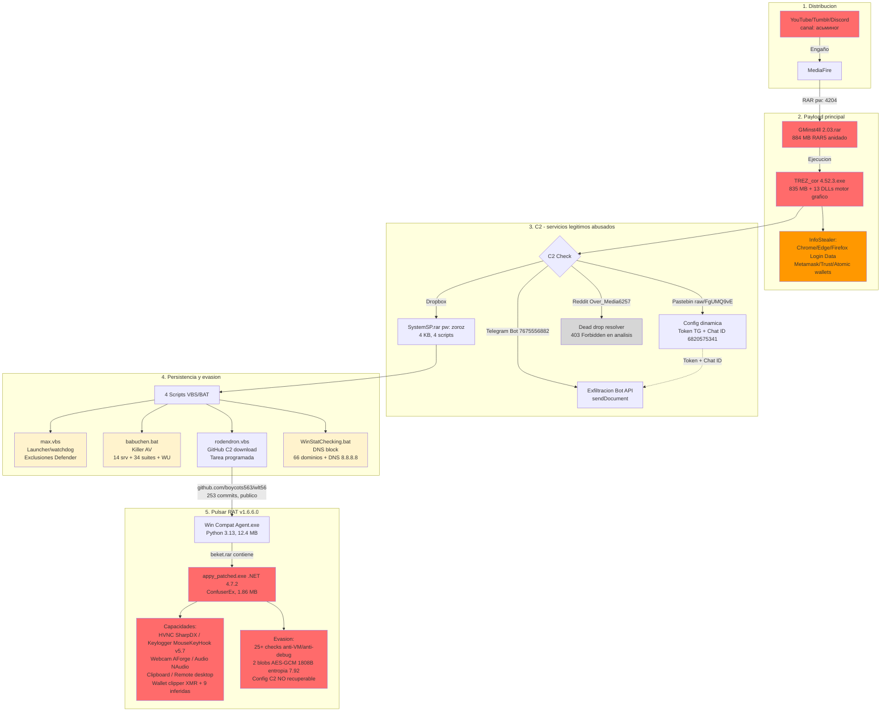

El malware se distribuye mediante engaño social en cuatro plataformas: YouTube (canal
"асьминог", octopus en ruso, vídeo `okNhSxfa__U` reciclado posteriormente para
distribuir "RPG Maker MZ"), Tumblr (`@tutorialsfrommax`, tutoriales falsos de minería),
MediaFire (`GMinstall_4.11.rar`, variante 4.11 vs 2.03) y Discord (`sub4unlock.io/ajLvu`,
trust score 10/100, scam CPA). El ejecutable principal `TREZ_cor 4.52.3.exe` (835 MB)
incluye 13 DLLs de motor gráfico (core_init, physics_core, mesh_processor, renderer,
etc.) y actúa como InfoStealer robando credenciales de navegadores (Chrome, Edge,
Brave, Opera, Firefox — `Login Data` y `logins.json`) y wallets (Metamask, Trust
Wallet, Atomic). Tras el robo de datos, realiza un C2 check contra cuatro servicios
legítimos abusados: Pastebin (configuración dinámica con token Telegram y Chat ID),
Dropbox (payload SystemSP.rar), Reddit (user `Over_Media6257`, dead drop resolver, 403
Forbidden) y Telegram Bot API (exfiltración vía `sendDocument`).

SystemSP.rar (4 KB, contraseña "zoroz") contiene cuatro scripts VBS/BAT para
persistencia y evasión:

| Script | Tipo | Función |
|--------|------|---------|
| `max.vbs` | VBScript | Launcher/watchdog, exclusiones de Windows Defender para `appy.exe` |
| `babuchen.bat` | Batch | Killer AV: detiene 14 servicios, destruye 34 suites, elimina Windows Update |
| `rodendron.vbs` | VBScript | Descarga `Windows Compatibility Agent.exe` desde GitHub C2, tarea programada recurrente |
| `WinStatChecking.bat` | Batch | Bloquea 66 dominios AV en hosts, fuerza DNS a 8.8.8.8 |

El repositorio GitHub C2 (`github.com/boycots563/wlt56`, público y activo, 253 commits
entre octubre 2025 y agosto 2026) contiene nueve archivos:

| Archivo | Tipo | Tamaño | Notas |
|---------|------|--------|-------|
| `Windows Compatibility Agent.exe` | Python 3.13 | 12.4 MB | Imports USER32/KERNEL32/ADVAPI32, packer MachO_File_pyinstaller |
| `Windows Compatibility Agent Host.exe` | Python 3.14 | 8.5 MB | Mismos imports + OpenProcessToken/GetTokenInformation |
| `kamzat.exe` | Python 3.13 | 12.4 MB | PyCryptodome completo (AES, SHA, HMAC, BLAKE2, keccak) + asyncio |
| `postevak.exe` | Python 3.13 | 7.9 MB | HTTP básico, sin criptografía avanzada |
| `appy.exe` | Rust | 719 KB | Launcher, imports ntdll.dll (NtWriteFile, NtCreateNamedPipeFile) |
| `beket.rar` | RAR | — | Contiene `appy_patched.exe` (Pulsar RAT .NET 1.86 MB) |
| `PROMOTIO.BAT` | Batch | — | Actualizado 3-nov-2025 |
| `maximusz.bat` | Batch | — | Actualizado 3 veces el 17-oct-2025 |
| `README.md` | Markdown | — | Disclaimer falso "PoC educativo" añadido 2-ago-2026 |

El patrón de commits revela ciclos repetidos de "Add files via upload" + "Delete
appy.exe"/"Delete kamzat.exe" (oct-nov 2025, dic 2025, abr 2026), indicando rotación de
payloads para evadir detección. Ningún ejecutable Python contiene URLs/IPs directas en
strings — la configuración C2 está probablemente cifrada.

El Pulsar RAT v1.6.6.0 (.NET 4.7.2, ConfuserEx) se distribuye en `beket.rar` como
`appy_patched.exe` (.NET, 1.86 MB, import mscoree.dll) y debe distinguirse de
`appy.exe` (Rust, 719 KB, launcher). Sus capacidades y librerías detectadas:

| Capacidad | Librería .NET | Funciones |
|-----------|---------------|-----------|
| HVNC | SharpDX DirectX | StartHVNCProcess, DoHVNCInput, CreateDesktop, SetThreadDesktop |
| Keylogger | Gma.System.MouseKeyHook v5.7 | KeyboardHook, IKeyboardEvents, GetKeyloggerLogsDirectory |
| Webcam | AForge.Video.DirectShow v2.2.5 | VideoCaptureDevice, StartWebcamStreaming |
| Audio | NAudio.Core v2.2.1 | Wasapi, WinMM, GetMicrophone, EnumerateAudioEndPoints |
| Clipboard | Win32 API | SendClipboardData, AddClipboardFormatListener, get/set_ClipboardText |
| Remote desktop | Pulsar.Common.Messages | RemoteDesktop, RemoteShell, RemoteAddress, RemotePort |
| Wallet clipper | Regex + protobuf-net | XMR detectado, 9 criptomonedas inferidas (BTC/LTC/ETH/SOL no confirmadas) |

La evasión incluye 25+ checks anti-VM/anti-debug (BeingDebugged, IsDebuggerPresent,
KernelDebuggerEnabled, WMI_VM_Detect, SystemVmGenerationCountInformation) y ConfuserEx.
La configuración C2 está cifrada en 2 blobs AES-GCM de 1808 bytes con entropía 7.92 y
nonces de 12 bytes; no fue recuperable estáticamente (Fase 14 descartada: GUI
VirtualBox no funcional).

| Categoría | Detalle |
|-----------|---------|
| MITRE ATT&CK (7) | T1566.002 Spearphishing Link, T1059.001 PowerShell, T1547.001 Winlogon UserInit, T1562.001 Impair Defenses, T1056.001 Keylogger, T1102 Web Service C2, T1567.002 Exfiltration Telegram |
| Hashes SHA256 | GMinst4ll `d70c31b0...`, TREZ_cor `a75def53...`, SystemSP `a50e0785...`, appy_patched `eabe4c16...` |
| Mutex | `Global\{TOKEN-EX-}` |
| PDF señuelo | `IF IT DOESN'T WORK.pdf` (autor: "David Thompson", keywords: `DAGflPA11iY`, `BAGTfYCSpno`) |
| Reglas YARA | `GMinst4ll_Stealer`, `PulsarRAT_AES_GCM_Config`, `PulsarRAT_Deobfuscated_Strings` |
| Reglas Sigma | `Winlogon UserInit Modification`, `SystemSP Directory Creation`, `Suspicious WScript Execution` |
| Navegadores objetivo | Chrome, Edge, Brave, Opera, Firefox (`Login Data`, `logins.json`) |
| Wallets objetivo | Metamask (extensión), Trust Wallet (`%APPDATA%\Trust Wallet`), Atomic (`%APPDATA%\atomic`) |
| Ruta instalación | `%PROGRAMDATA%\SystemSP\SystemSP\` (max.vbs, archive.rar) |
| Registry | `HKLM\SOFTWARE\Microsoft\Windows NT\CurrentVersion\Winlogon\UserInit` |

La timeline de la campaña abarca desde marzo 2025 hasta agosto 2026:

| Fecha | Evento |
|-------|--------|
| 2025-03-04 | Creación archivo PASSWORD (metadata RAR interna) |
| 2025-10-17 | Primer commit GitHub C2 (actualización `maximusz.bat`) |
| 2025-11-02 a 04 | Ciclos Add/Delete `appy.exe` + `PROMOTIO.BAT` |
| 2025-12-25 a 27 | Ciclos Add/Delete `appy.exe` |
| 2026-04-19 a 25 | Ciclos Add/Delete `Windows Compatibility Agent Host.exe` |
| 2026-05-13 | Add files via upload |
| 2026-06-10 23:57 | Subida a MediaFire desde Eslovaquia |
| 2026-06-11 a 13 | Análisis forense (15 fases, 39 archivos .txt, 14 análisis detallados) |
| 2026-08-02 | README.md con disclaimer falso "PoC educativo" |

Las hipótesis de atribución indican una campaña activa desde 2025 (múltiples variantes:
versiones 2.03, 4.11, 4.52.3, rotación de payloads en GitHub mediante ciclos
Add/Delete), un operador rusohablante (cirílico "асьминог" en YouTube, nombres temáticos
eslavos: babuchen, rodendron, kamzat, postevak, maximusz) y monetización múltiple (robo
de wallets, venta de credenciales en foros, ingresos por sub4unlock.io CPA).

Fuente: `github.com/alesanfe/gminst4ll-forensics` (README.md, 01_INFORME_PRINCIPAL,
02_BITACORA_FASES, 03_IOCS_Y_DETECCION, 04_OSINT_Y_CAMPANA, 05_PENDIENTES_Y_PLAN,
06_METADATOS_ANALISIS). Estado del repo C2 verificado directamente en
`github.com/boycots563/wlt56` (agosto 2026).

---

## F.12. Pipeline SOAR para IoCs de GMinst4ll

Diagrama del flujo concreto de los IoCs de GMinst4ll a través del pipeline SOAR,
mostrando qué analyzers procesan cada tipo de IoC, qué resultados devuelven y cómo se
construye el score de `calc_decision` paso a paso desde el valor base (60) hasta el
umbral de contención (>=80). A diferencia de F.5 (flujo genérico end-to-end), F.6
(árbol de decisión del playbook) y F.7 (zoom sobre la rama de decisión), este diagrama
muestra la **instanciación específica** con los IoCs reales de GMinst4ll validados en
TC-33 (10 subtests).

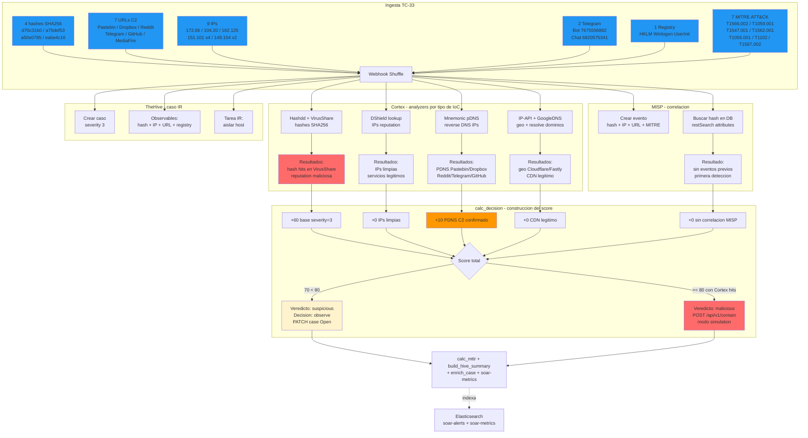

El score base de `calc_decision` es 60 (severity=3 → +60) con veredicto `suspicious` y
decisión `observe`. Para los IoCs de GMinst4ll, los analyzers de Cortex devuelven
resultados mixtos: los hashes SHA256 obtienen reputation maliciosa en VirusShare
(Hashdd confirma hits), pero las IPs corresponden a servicios legítimos (Pastebin,
Dropbox, Reddit, Telegram) con reputation limpia en DShield. El passive DNS de
Mnemonic confirma que las IPs resuelven dominios C2 conocidos, sumando +10 al score.
MISP no encuentra eventos previos (primera detección). El score total de 70 (< 80)
produce veredicto `suspicious` y decisión `observe` — el caso permanece abierto para
investigación. Si los analyzers de Cortex elevaran el veredicto a `malicious` (hash con
reputation confirmada en múltiples fuentes), el score superaría 80 y se activaría la
contención simulada vía `POST /api/v1/contain`.

| Subtest TC-33 | Tipo IoC | Analyzer Cortex | Resultado esperado | Impacto score |
|---------------|----------|-----------------|--------------------|---------------|
| TC-33.01 | Hash SHA256 GMinst4ll | Hashdd + VirusShare | Reputation maliciosa | +base |
| TC-33.02 | Hash SHA256 TREZ_cor | Hashdd + VirusShare | Sin reputation | +base |
| TC-33.03 | Hash SHA256 SystemSP | Hashdd + VirusShare | Sin reputation | +base |
| TC-33.04 | Hash SHA256 appy_patched | Hashdd + VirusShare | Reputation maliciosa | +base |
| TC-33.05 | URLs C2 (7) | — (no analyzer) | Indexadas en ES | +base |
| TC-33.06 | Dominios (6) | GoogleDNS resolve | CDN legitimo | +0 |
| TC-33.07 | IPs (9) | DShield + Mnemonic pDNS | IP limpia + PDNS C2 | +10 |
| TC-33.08 | Telegram (Bot + Chat) | — (no analyzer) | Indexado en ES | +base |
| TC-33.09 | Registry UserInit | — (no analyzer) | Indexado en ES | +base |
| TC-33.10 | MITRE ATT&CK (7) | — (no analyzer) | Tags en TheHive | +base |

Las consultas SIEM para hunting incluyen `pastebin.com` (o URLs específicas
`/raw/FgUMQ9vE`, `/raw/E3s5iTTz`), `dropbox.com/scl/fi/` (path SystemSP.rar),
`reddit.com/user/Over_Media6257/`, `api.telegram.org/bot7675556882` y
`github.com/boycots563/wlt56/`. Los patrones de proceso a monitorizar son `TREZ_cor`
en línea de comandos, `wscript.exe` ejecutando `.vbs` desde `%PROGRAMDATA%` y PowerShell
con `-Verb RunAs` tras ejecutar archivos sospechosos.

Fuente: `github.com/alesanfe/gminst4ll-forensics` (03_IOCS_Y_DETECCION_GMINST4LL.md —
Apéndice A con origen exacto de cada IoC: archivo fuente + línea). Pipeline SOAR:
`docs/04-operations.md` línea 4807, TC-33: `tests/e2e/TC-33/`.


---

## Anexo: Desarrollo Específico


## 4.1. Desarrollo de software

### 4.1.1. Identificación de requisitos

El problema abordado es la gestión manual de incidentes de ransomware en equipos de respuesta (SOC y CSIRT), donde la fragmentación de herramientas provoca tiempos de respuesta elevados, variabilidad entre analistas y dificultad para generar evidencias trazables. El contexto de uso comprende organizaciones con recursos limitados (pymes, universidades y CSIRTs en formación) que no pueden asumir licencias comerciales de plataformas SOAR propietarias. Los requisitos se han identificado a partir de la literatura revisada en el Capítulo 2, los marcos de referencia (NIST SP 800-61, ISO/IEC 27035, MITRE ATT&CK) y la experiencia en despliegue de laboratorios reproducibles con herramientas open source.

Requisitos Funcionales

Los requisitos funcionales describen las capacidades que el sistema debe ofrecer para cumplir su propósito:

- RF-01: Gestión de alertas. El sistema debe recibir notificaciones de fuentes externas (SIEM, EDR), clasificarlas
  según patrones de ransomware y dirigirlas al playbook correspondiente.
- RF-02: Análisis de indicadores de compromiso (IoCs). Hashes, dominios, IPs y archivos se enriquecen mediante analyzers
  libres de Cortex (sin API key requerida) y se almacenan en Elasticsearch para detectar patrones recurrentes.
- RF-03: Orquestación del flujo completo. Desde el análisis hasta la contención simulada y el escalado según la
  severidad del incidente.
- RF-04: Gestión de casos. Cada incidente debe generar un caso en TheHive con IoCs, etiquetas y registro de
  acciones, preservando las evidencias.
- RF-05: Monitoreo. MTTR, tasa de éxito y KPIs del playbook, visualizados en Grafana mediante logs agregados por
  Loki y Promtail, con datos indexados en Elasticsearch.
- RF-06: Simulador de alertas. Un módulo generador debe producir alertas maliciosas y benignas con IoCs realistas
  hacia el webhook de Shuffle, permitiendo repetir el experimento sin dependencias externas.
- RF-07: Contención simulada. El sistema debe ejecutar acciones de contención simulada (aislamiento de endpoint,
  bloqueo de IP) mediante endpoints mock que registran la intención sin aplicar cambios reales.
- RF-08: API REST de gestión. Una API FastAPI debe exponer endpoints para health, autenticación, backup, métricas
  analíticas, estado de servicios y operaciones SOAR, con documentación OpenAPI automática.
- RF-09: Cálculo de métricas estadísticas. El sistema debe calcular MTTR (media, mediana, percentiles p50 y p90),
  desviación estándar y coeficiente de variación a partir de las ejecuciones del playbook.

Requisitos No Funcionales

Los requisitos no funcionales fijan los criterios de calidad del sistema:

- RNF-01: Rendimiento. Reducción del MTTR ≥ 50 % respecto al baseline manual, con medición de percentiles p50 y p90
  sobre 50 ejecuciones por escenario.
- RNF-02: Reproducibilidad. Despliegue reproducible mediante Docker Compose y Makefile, con `make up` como único punto
  de entrada y `make generate-secrets` para la generación de credenciales.
- RNF-03: Seguridad. Aislamiento de red entre componentes, secretos gestionados mediante variables de entorno,
  autenticación JWT para la API, sanitización de payloads de entrada y certificados TLS autofirmados para el tráfico
  externo.
- RNF-04: Calidad del software. Suite de tests automatizada con pytest (2041 tests) y despliegue verificable con
  `make test-e2e`.
- RNF-05: Resiliencia. Circuit breaker y reintentos con backoff exponencial en las integraciones entre componentes
  para manejar fallos transitorios sin perder la alerta.
- RNF-06: Observabilidad. Health checks por servicio, logs estructurados agregados en Loki y dashboards de Grafana
  con métricas en tiempo real.

Requisitos de Integración

Los requisitos de integración especifican las conexiones entre componentes del sistema:

- RI-01: Integración entre TheHive y Cortex. Los observables creados en TheHive se envían a Cortex para su análisis
  mediante analyzers configurados, y los resultados se devuelven automáticamente.
- RI-02: Integración entre Shuffle y TheHive. Shuffle recibe alertas por webhook y crea o actualiza casos mediante API
  sin intervención manual, con reintentos ante fallos temporales.
- RI-03: Fuentes externas de threat intelligence. Analyzers libres de Cortex para reputación de IPs (DShield),
  resolución DNS (GoogleDNS) y passive DNS (Mnemonic pDNS) para infraestructura de comando y control.
- RI-04: Integración opcional con MISP. Intercambio de indicadores de amenazas con MISP para enriquecimiento
  adicional, sin ser requisito para la ejecución del playbook E2E.

## Tabla 3: Matriz de Trazabilidad de Requisitos

La matriz de trazabilidad conecta cada requisito con su componente implementador, prioridad y método de verificación:

| ID     | Requisito          | Componente | Prioridad | Verificación                                     |
|--------|--------------------|------------|-----------|--------------------------------------------------|
| RF-01  | Gestión de Alertas | Shuffle    | Alta      | Prueba E2E del flujo completo de alertas         |
| RF-02  | Análisis de IoCs   | Cortex     | Alta      | Prueba de integración de analyzers               |
| RF-03  | Orquestación       | Shuffle    | Alta      | Prueba funcional del playbook                    |
| RF-04  | Gestión de Casos   | TheHive    | Alta      | Prueba E2E de creación y cierre de casos         |
| RF-05  | Monitoreo          | Loki/Grafana | Media   | Verificación de métricas en dashboard            |
| RF-06  | Simulador          | Python/simulator | Alta | Pruebas E2E y de carga usan el simulador    |
| RF-07  | Contención simulada | FastAPI   | Alta      | Endpoint `/api/v1/contain` en `routes_services` |
| RF-08  | API REST           | FastAPI    | Media     | Pruebas de integración de API                    |
| RF-09  | Métricas estadísticas | Python/domain | Alta | Resultados en `reports/e2e/` (n=50)          |
| RNF-01 | Rendimiento        | Sistema    | Alta      | Benchmark de MTTR (n=50 por escenario)           |
| RNF-02 | Reproducibilidad   | Docker     | Alta      | `make up` + `pytest tests/e2e/`                  |
| RNF-03 | Seguridad          | Docker/Nginx/FastAPI | Media | Revisión de config, JWT, sanitización    |
| RNF-04 | Calidad            | pytest     | Media     | Suite de tests (2041 tests)                      |
| RNF-05 | Resiliencia        | Python/resilience | Media | Prueba unit de circuit breaker             |
| RNF-06 | Observabilidad     | Loki/Grafana | Media   | Health checks y dashboards                       |
| RI-01  | TheHive ↔ Cortex   | TheHive/Cortex | Alta  | Prueba de integración de observables             |
| RI-02  | Shuffle ↔ TheHive  | Shuffle/TheHive | Alta | Prueba E2E de webhook y creación de casos        |
| RI-03  | Threat intelligence | Cortex    | Media     | Verificación de analyzers libres                 |
| RI-04  | MISP (opcional)    | MISP       | Baja      | `docker-compose.misp.yml` disponible             |

La **Tabla 4** resume el estado de cumplimiento de los requisitos.

## Tabla 4: Estado de Cumplimiento de Requisitos

| ID     | Tipo   | Requisito                     | Métrica de Verificación  | Estado             |
|--------|--------|-------------------------------|--------------------------|--------------------|
| RF-01  | **F**  | Gestión de alertas ransomware | 100% alertas procesadas  | Cumplido           |
| RF-02  | **F**  | Análisis automático IoCs      | Analyzers libres Cortex  | Cumplido           |
| RF-03  | **F**  | Orquestación playbook         | 1 playbook E2E, 2 escenarios | Cumplido      |
| RF-04  | **F**  | Gestión de casos              | Integración TheHive      | Cumplido           |
| RF-05  | **F**  | Monitoreo                     | Dashboard Grafana + Loki | Cumplido           |
| RF-06  | **F**  | Simulador de alertas          | E2E + pruebas de carga   | Cumplido           |
| RF-07  | **F**  | Contención simulada           | Endpoint mock FastAPI    | Cumplido           |
| RF-08  | **F**  | API REST de gestión           | Tests de integración API | Cumplido           |
| RF-09  | **F**  | Métricas estadísticas         | Resultados n=50 en `reports/e2e/` | Cumplido   |
| RNF-01 | **NF** | Reducción MTTR ≥ 50%          | 92.3% (n=50)             | Cumplido           |
| RNF-02 | **NF** | Reproducibilidad              | `make up` + tests E2E    | Cumplido           |
| RNF-03 | **NF** | Seguridad                     | Aislamiento, JWT, sanitización | Cumplido     |
| RNF-04 | **NF** | Calidad                       | 2041 tests automatizados | Cumplido           |
| RNF-05 | **NF** | Resiliencia                   | Circuit breaker + retry  | Cumplido           |
| RNF-06 | **NF** | Observabilidad                | Health checks + Loki     | Cumplido           |
| RI-01  | **I**  | TheHive ↔ Cortex              | Observables enriquecidos | Cumplido           |
| RI-02  | **I**  | Shuffle ↔ TheHive             | Webhook + API            | Cumplido           |
| RI-03  | **I**  | Threat intelligence           | Hashdd_Status, IP-API, DShield, Mnemonic pDNS, GoogleDNS, DomainMailSPFDMARC, ValidateObservable | Cumplido  |
| RI-04  | **I**  | MISP (opcional)               | `docker-compose.misp.yml` | Opcional          |


### 4.1.2. Descripción de la herramienta software desarrollada

Arquitectura General del Sistema

El laboratorio combina dos patrones arquitectónicos. El código Python sigue una arquitectura hexagonal (ports and adapters) que aísla el dominio de los detalles técnicos: `domain/` no importa nada de `infrastructure/`, los puertos definen qué operaciones necesita el dominio y los adaptadores las implementan contra tecnologías concretas. Pydantic (Pydantic, 2024) valida los payloads en los límites. El beneficio es doble: en tests, los adaptadores se mockean sin tocar el dominio; en producción, sustituir un proveedor (por ejemplo, Elasticsearch por OpenSearch) solo requiere reescribir un adaptador.

Para la infraestructura Docker se emplea una arquitectura en capas que mantiene la lógica de negocio desacoplada de las implementaciones concretas. La **Figura 3** muestra la arquitectura general y la **Figura 4** el despliegue Docker Compose, ambos en formato Mermaid canónico en el **Anexo F** (sección F.1).

Flujo General del Sistema

```mermaid
---
title: Flujo General del Sistema
---
graph TD     A[Generación de Alertas] --> B[Recepción en Shuffle]
    B --> C[Validación y Clasificación]
    C --> D[Análisis de Indicadores]
    D --> E[Cálculo de Riesgo]
    E --> F{Riesgo Alto?}     F -->|Sí| G[Activación de Contención]
    F -->|No| H[Marcar como falso positivo]
    G --> I[Creación de Caso en TheHive]
    H --> I     I --> J[Registro de Acciones]
    J --> K[Cálculo de KPIs]
    K --> L[Monitoreo y Dashboards]
    L --> M[Análisis de Resultados]
```

#### Arquitectura de Código Python

El código en `src/soar_lab/` se organiza según el patrón hexagonal: el dominio en el centro, aislado de infraestructura y frameworks. Los diagramas canónicos completos están en el **Anexo F** (secciones F.2, F.3 y F.4).

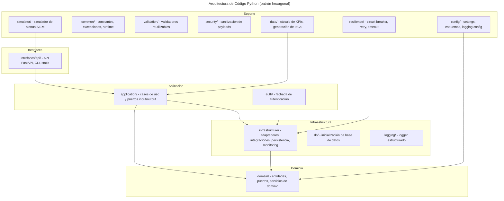

Las capas son:

- `domain/`: lógica de negocio pura. Define entidades (alertas, casos, IoCs), puertos (contratos de infraestructura) y servicios de dominio (cálculos de métricas).
- `application/`: casos de uso que orquestan los puertos del dominio (análisis de KPIs, autenticación, backup, salud, pruebas).
- `auth/`: fachada que re-exporta `AuthService` para acceso desde la API.
- `infrastructure/`: adaptadores concretos de los puertos. Incluye `integrations/` (clientes de TheHive, Cortex, Shuffle, MISP), `persistence/`, `monitoring/`, `messaging/`, `network_watcher/`, `security/` y `templates/`.
- `interfaces/`: API FastAPI (`api/`), CLI y recursos estáticos. Gestiona la inyección de dependencias.
- `config/`: settings, esquemas de datos y configuración de logging.
- `common/`: constantes, excepciones y utilidades de runtime compartidas.
- `validation/`: validadores de datos reutilizables.
- `security/`: sanitización de payloads de entrada.
- `resilience/`: circuit breaker, retry con backoff y timeout para integraciones.
- `simulator/`: simulador de alertas SIEM (maliciosas y benignas).
- `data/`: scripts para cálculo de KPIs y generación de IoCs.
- `db/`: inicialización y gestión de transacciones de base de datos.
- `logging/`: wrapper de logger estructurado.

#### Arquitectura de Despliegue

La infraestructura se organiza en cuatro capas:

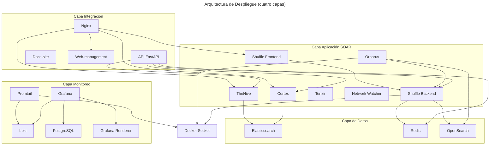

La capa de datos incluye Elasticsearch (Elastic, 2024; Elastic, n.d.) para TheHive y Cortex, Redis (Redis Ltd., 2024) para colas y caché, y OpenSearch (OpenSearch Project, 2024) como motor de búsqueda de Shuffle. La capa de aplicación SOAR la forman TheHive (TheHive Project, 2024; TheHive Project, n.d.), Cortex (Cortex Project, 2024; Cortex Project, n.d.), Shuffle (frontend y backend) (Shuffle Tools, 2024; Shuffle Tools, n.d.), Orborus (ejecutor de workflows que accede al socket de Docker (Docker Inc., 2024; Docker, n.d.) para lanzar contenedores), Tenzir (procesamiento de eventos de red) y Network Watcher (monitor de la red soar_net). La capa de integración incluye Nginx (Nginx, 2024; Nginx, n.d.) como proxy inverso, la API FastAPI (FastAPI, 2024), el sitio de documentación y la interfaz web de gestión. El monitoreo usa Loki (Grafana Labs, 2024b), Promtail (Grafana Labs, 2024c), Grafana (Grafana Labs, 2024; Grafana, n.d.) con PostgreSQL como base de datos y Grafana Renderer para exportación de paneles.

La infraestructura se define con varios archivos Docker Compose (Docker Inc., 2024) que se combinan para desplegar el sistema completo. El archivo principal `docker-compose.yml` define cuatro redes (perimetral bridge, interna soar_net, inteligencia ti_net, monitoreo logging_net) y los volúmenes persistentes, e incluye Elasticsearch. El archivo `docker-compose.core.yml` contiene Redis, TheHive, Cortex, Shuffle, Orborus, Network Watcher y Tenzir, con verificaciones de salud, límites de recursos y dependencias. Los archivos complementarios añaden: `docker-compose.api.yml` (API FastAPI, docs-site, web-management y Nginx), `docker-compose.misp.yml` (MISP, misp-db y misp-modules) (MISP Project, 2024), `docker-compose.opensearch.yml` (OpenSearch y OpenSearch Dashboards) (OpenSearch Project, 2024) y `docker-compose.logging.yml` (Loki, Promtail, Grafana, PostgreSQL y Grafana Renderer).

La segmentación de redes sigue un modelo por zonas de seguridad: la red bridge es accesible desde el host, soar_net (10.100.0.0/16) conecta los componentes SOAR, ti_net (172.22.0.0/16, red interna) vincula Elasticsearch, Redis, Shuffle y la API, y logging_net (172.23.0.0/16) aísla el stack de logging (Grafana, Loki y Promtail conectan además a soar_net para recoger datos de los servicios). Esta separación limita el movimiento lateral en caso de compromiso. Los volúmenes usan enlaces al directorio runtime con subdirectorios por servicio; los datos sobreviven a reinicios y pueden migrarse copiando ese directorio. La **Tabla 6** detalla la configuración de recursos.

## Tabla 6: Configuración de Recursos Docker

| Servicio             | CPU Límite | Memoria Límite | CPU Reserva | Memoria Reserva | Health Check |
|----------------------|------------|----------------|-------------|-----------------|--------------|
| **Elasticsearch**    | 2.0 cores  | 4GB            | 1.0 cores   | 2GB             | Cada 30s   |
| **OpenSearch**       | 2.0 cores  | 4GB            | 1.0 cores   | 2GB             | Cada 30s   |
| **TheHive**          | 2.0 cores  | 4GB            | 1.0 cores   | 2GB             | Cada 30s   |
| **Cortex**           | 2.0 cores  | 4GB            | 1.0 cores   | 2GB             | Cada 30s   |
| **Shuffle Backend**  | 2.0 cores  | 4GB            | 1.0 cores   | 2GB             | Disabled    |
| **Shuffle Frontend** | 1.0 cores  | 2GB            | 0.5 cores   | 1GB             | Cada 15s   |
| **Orborus**          | 2.0 cores  | 2GB            | 1.0 cores   | 1GB             | Cada 15s   |
| **Tenzir**           | 1.0 cores  | 1GB            | 0.5 cores   | 512MB           | Cada 30s   |
| **Redis**            | 0.5 cores  | 1GB            | 0.25 cores  | 512MB           | Cada 10s   |
| **API FastAPI**      | 1.0 cores  | 2GB            | 0.5 cores   | 512MB           | Cada 30s   |
| **Nginx**            | 0.5 cores  | 512MB          | 0.25 cores  | 128MB           | Cada 30s   |
| **Grafana**          | 1.0 cores  | 1GB            | 0.5 cores   | 512MB           | Cada 30s   |
| **Loki**             | 1.0 cores  | 1GB            | 0.5 cores   | 512MB           | Cada 30s   |
| **Promtail**         | 0.5 cores  | 512MB          | 0.25 cores  | 256MB           | Cada 30s   |

Esta configuración permite el despliegue en sistemas con 16GB+ RAM, haciendo el laboratorio accesible para organizaciones con recursos moderados.

Flujo de Integración entre Componentes

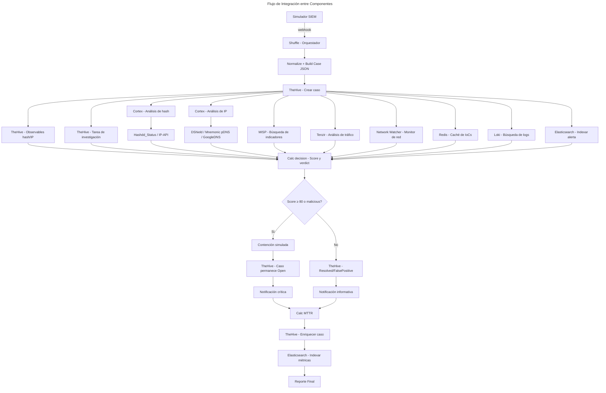

TheHive (v3.5.2) gestiona el ciclo de vida de los casos (TheHive Project, 2024) con plantillas especializadas para ransomware, asignación de tareas y registro de acciones. Su integración con Cortex permite analizar IoCs sin salir de la interfaz del caso. Las evidencias se almacenan con verificación hash para asegurar su integridad forense.

Cortex (v3.2.0) analiza IoCs en entornos aislados (Cortex Project, 2024) con 7 analyzers libres sin API key: Hashdd_Status (hashes), IP-API y DShield (IPs), GoogleDNS y DomainMailSPFDMARC (dominios), Mnemonic pDNS (passive DNS) y ValidateObservable (validación). El sistema cachea resultados para evitar consultas redundantes. La **Tabla 5** lista los analyzers con su tipo y uso en el playbook.

## Tabla 5: Analyzers Cortex Configurados

| Analyzer              | Tipo     | API Key | Uso en Playbook   |
|-----------------------|----------|---------|-------------------|
| **Hashdd_Status**     | Hash     | No      | Status lookup de hashes |
| **IP-API**            | IP       | No      | Geolocalización de IP |
| **DShield**           | IP       | No      | Reputación SANS ISC |
| **Mnemonic pDNS**     | Domain/IP| No      | Passive DNS |
| **GoogleDNS**         | Domain   | No      | Resolución DNS |
| **DomainMailSPFDMARC**| Domain   | No      | SPF/DMARC lookup |
| **ValidateObservable**| Multiple | No      | Validación de observables |

La selección prioriza analyzers libres sin API key (RF-02). Todos están integrados en el playbook, enriqueciendo cada IoC detectado.

Shuffle (v2.2.1) orquesta los flujos mediante una interfaz visual de bloques (Shuffle Tools, 2024). Orborus ejecuta workflows en paralelo entre workers y gestiona reintentos automáticos. La ejecución condicional y la programación de tareas permiten adaptar el flujo al contexto del incidente.

#### Scripts de Automatización Desarrollados

```mermaid
---
title: Capacidades de Automatización
---
graph TD
    subgraph Provisionamiento
        P1[Generación de secretos]
        P2[Renderizado de configuración]
        P3[Inicialización de servicios]
        P4[Instalación de analyzers e IoCs]
    end

    subgraph Orquestación de Workflows
        O1[Definición del workflow]
        O2[Cableado de integraciones]
        O3[Scripts embebidos en Shuffle]
    end

    subgraph Simulación
        SM1[Generación de alertas]
        SM2[IoCs realistas CISA/MITRE]
        SM3[Envío al webhook]
    end

    subgraph Mantenimiento
        M1[Limpieza de ejecuciones stale]
        M2[Espera de workflows]
        M3[Verificación de imágenes]
        M4[Limpieza de casos TheHive]
        M5[Warmup de Shuffle]
    end

    subgraph Observabilidad
        OB1[notify.log + Elasticsearch]
        OB2[StatisticalCalculator]
        OB3[MTTR / P50 / P90 / Medias]
        OB4[KPIAnalyzer]
        OB5[kpis.csv]
        OB6[Dashboard Grafana]
        OB7[Reportes E2E]
    end

    subgraph Calidad y CI
        Q1[Análisis estático]
        Q2[Mutation testing]
        Q3[Calidad de documentación]
        Q4[Revisión holística]
    end

    subgraph Seguridad operacional
        SF1[Preservación de credenciales]
        SF2[Restauración de credenciales]
    end

    P3 --> O1
    O1 --> O2
    O2 --> O3
    P4 --> O2
    SM3 --> O1
    O3 --> OB1
    OB1 --> OB2
    OB2 --> OB3
    OB3 --> OB4
    OB4 --> OB5
    OB5 --> OB6
    M1 --> O1
    M2 --> OB7
    M5 --> O1
    Q1 --> Q4
    Q2 --> Q4
    Q3 --> Q4
    SF1 --> SF2
    SF2 --> P3
```

La automatización se organiza en siete capacidades. El **provisionamiento** genera secretos, renderiza configuración desde plantillas, inicializa TheHive/Cortex/Shuffle y instala los analyzers de Cortex junto con los IoCs en MISP, de forma que un único comando (`make up`) deja el laboratorio operativo. La **orquestación de workflows** define el playbook completo (46 nodos, 60 ramas) y cablea cada integración; 21 scripts Python embebidos se ejecutan dentro de Shuffle para normalizar, decidir y enriquecer.

La **simulación** genera alertas de ransomware con IoCs realistas (hashes SHA256 de advisories CISA, IPs C2, técnicas MITRE ATT&CK) y las envía al webhook de Shuffle vía HTTP, permitiendo configurar tipo, volumen y frecuencia. El **mantenimiento** limpia ejecuciones stale de Shuffle y casos de TheHive, hace warmup del orquestador antes de los tests, espera a que los workflows terminen para sincronizar los tests E2E y verifica la integridad de las imágenes Docker.

La **observabilidad** calcula KPIs (MTTR, percentiles P50/P90, medias, desviaciones) desde los logs y Elasticsearch, los exporta a CSV y los visualiza en dashboards de Grafana; genera además informes automáticos de los tests E2E. La **calidad y CI** ejecuta análisis estático (bandit, ruff, pylint, radon, vulture), mutation testing, control de calidad y terminología de la documentación, y una revisión holística del proyecto en 15 dimensiones. La **seguridad operacional** preserva y restaura las credenciales de los servicios entre resets, evitando rotaciones manuales de API keys.


#### Sistema de Monitoreo

```mermaid
---
title: Sistema de Monitoreo
---
graph TD
    subgraph Recopilación
        P1[Promtail]
    end

    subgraph Almacenamiento
        L1[Loki]
        ES[Elasticsearch soar-metrics]
    end

    subgraph Visualización
        G1[Grafana]
        GR[Grafana Renderer]
        PG[PostgreSQL]
    end

    subgraph Fuentes
        DK[Docker Socket]
        SH[Shuffle Workflow]
        API2[API FastAPI]
    end

    DK --> P1
    P1 --> L1
    SH --> ES
    G1 --> L1
    G1 --> ES
    G1 --> API2
    G1 --> PG
    G1 --> GR
```

El monitoreo usa Loki (Grafana Labs, 2024b), Promtail (Grafana Labs, 2024c), Grafana (Grafana Labs, 2024) con PostgreSQL como base de datos y Grafana Renderer para exportación de paneles. Promtail descubre automáticamente todos los contenedores vía Docker socket (`docker_sd_configs`) y los envía a Loki. El workflow de Shuffle indexa métricas en Elasticsearch (índice `soar-metrics`). Grafana consulta tres datasources: Loki para logs, Elasticsearch para KPIs y la API FastAPI para datos en tiempo real, usando PostgreSQL para su configuración.

El dashboard de Grafana (`SOAR KPI Dashboard`) implementa 15 paneles con las métricas reales del proyecto: MTTR (medio, P50, P90, max/min, rango, percentiles P50/P75/P90/P95), total de alertas procesadas, alertas críticas (severity=3), tasa de éxito por tipo de alerta, tasa de éxito por servicio (TheHive/Cortex/MISP), tasa de éxito por severidad, alertas por severidad, throughput por hora, evolución temporal de MTTR, evolución de alertas por tipo y comparación de MTTR por tipo de alerta. La **Tabla 7** resume las métricas con sus umbrales.

## Tabla 7: Métricas del Dashboard de Grafana

| Categoría          | Métrica              | Objetivo       | Panel |
|--------------------|----------------------|----------------|-------|
| **Rendimiento**    | MTTR medio           | ≤ 120s         | MTTR Medio (s) |
| **Rendimiento**    | MTTR P50 (mediana)   | ≤ 120s         | MTTR p50 |
| **Rendimiento**    | MTTR P90             | ≤ 180s         | MTTR p90 |
| **Rendimiento**    | MTTR max/min         | —              | MTTR Max / Min |
| **Rendimiento**    | Percentiles P50/P75/P90/P95 | —       | Análisis de Percentiles |
| **Rendimiento**    | Throughput           | —              | Alertas procesadas por hora |
| **Negocio**        | Total alertas        | —              | Total Alerts Processed |
| **Negocio**        | Alertas críticas     | —              | Alertas Criticas (severity=3) |
| **Negocio**        | Tasa de éxito por tipo | 100%         | Tasa de Exito por Tipo |
| **Negocio**        | Tasa de éxito por servicio | 100%    | Tasa de Exito Servicios |
| **Negocio**        | Alertas por severidad | —             | Alertas por Severidad |
| **Negocio**        | Evolución MTTR diario | —            | Evolucion MTTR |
| **Negocio**        | MTTR por tipo de alerta | —           | MTTR por Tipo de Alerta |
| **Negocio**        | Tasa de éxito por severidad | 100%   | Tasa de Exito por Severidad |
| **Negocio**        | Evolución de alertas por tipo | —     | Evolucion de Alertas por Tipo |

El stack se inicia con `make up` y la interfaz de Grafana está disponible en el puerto configurado con credenciales del archivo de entorno.

### 4.1.3. Evaluación

#### 4.1.3.1. Diseño Experimental

La evaluación compara la respuesta manual con la automatizada SOAR. La variable independiente es el tipo de respuesta; la dependiente, el MTTR en segundos (desde recepción de la alerta hasta contención simulada). Las variables controladas comprenden el entorno Docker Compose, el hardware, la configuración de los componentes y el conjunto de alertas.

**Justificación del baseline manual.** El valor de 3600 s (1 hora) se fundamenta en datos de la industria. CrowdStrike establece el benchmark ideal 1-10-60: detectar en 1 minuto, investigar en 10 y contener en 60 (CrowdStrike, 2021), aunque la media real de las organizaciones encuestadas es de 16 horas. ReliaQuest reporta un MTTR tradicional de 2.3 días sin automatización (ReliaQuest, 2024). La SANS SOC Survey 2025 sitúa el tiempo mediano de triaje en 260 minutos (SANS Institute, 2025). El valor de 3600 s adoptado se alinea con el benchmark de CrowdStrike y es conservador frente a las medias reales, evitando sobreestimar la reducción lograda.

#### 4.1.3.2. Procedimiento de Evaluación

En la respuesta SOAR, Shuffle recibe la alerta por webhook, clasifica el incidente, lanza los analyzers de Cortex en paralelo, crea el caso en TheHive mediante API y activa la contención simulada si el score supera el umbral, sin intervención del analista durante la ejecución. El baseline manual (3600 s) se fundamenta en benchmarks de la industria (sección 4.1.3.1) y no se ejecuta experimentalmente.

El cálculo de KPIs se realiza con `calc_kpis.py`, que instancia `ExecutionLogParser`, `KPIAnalyzer` y `StatisticalCalculator`. La métrica principal es el MTTR total (desde recepción de la alerta hasta contención o clasificación), indexada en Elasticsearch como `mttr_seconds`; el script consulta el índice `soar-metrics` por defecto y usa `notify.log` como fallback. Los resultados se exportan a CSV con `CSVKPIFormatter`.

Comandos de ejecución:

- `make up` (despliegue del stack completo)
- `make test-e2e-tc01` (escenario malicioso, 11 subtests)
- `make test-e2e-tc02` (escenario benigno / falso positivo, 5 subtests)
- `make test-e2e-tc03` (casos de borde E2E)
- `make test-e2e` (suite completa: 33 casos de test + 5 tests de KPI)
- `make simulate-batch N=50` (envío de lote de 50 alertas para experimentos)
- `make metrics` (cálculo de KPIs y exportación a CSV)

Los resultados experimentales se almacenan en `reports/e2e/` y `reports/validation/results/kpis.csv`.

#### 4.1.3.3. Resultados Experimentales

El experimento ejecutó 50 runs del playbook sobre el entorno Docker aislado, todas con alertas maliciosas (45 ransomware, 2 RAT, 2 troyano, 1 infostealer). La **Figura 6** muestra la comparación visual del MTTR manual vs automatizado, donde se aprecia la drástica reducción de 3600 s a 277.15 s (92.3 %). El cumplimiento de objetivos resume los umbrales definidos frente a los valores medidos:

## Tabla 10: Cumplimiento de Objetivos del Experimento

| Objetivo | Umbral | Valor medido | Cumple |
|----------|--------|--------------|--------|
| MTTR P50 (mediana) | ≤ 120 s | 193.19 s | No |
| MTTR P90 | ≤ 180 s | 621.83 s | No |
| Tasa de éxito | ≥ 95 % | 100 % | Sí |
| Dataset (n ejecuciones) | ≥ 50 | 50 | Sí |
| Reducción MTTR vs manual | ≥ 50 % | 92.3 % | Sí |

**Cumplimiento global: 3 de 5 objetivos.** La **Tabla 8** presenta los resultados detallados contrastando la respuesta manual estimada con la SOAR automatizada.

## Tabla 8: Resultados Experimentales Detallados

| Métrica                 | Manual (estimado) | SOAR (n=50)  | Reducción |
|-------------------------|-------------------|--------------|-----------|
| **MTTR Promedio**       | 3600s             | 277.15s      | 92.3%     |
| **MTTR Mediana (P50)**  | 3600s             | 193.19s      | 94.6%     |
| **P90**                 | 3600s             | 621.83s      | 82.7%     |
| **P95**                 | 3600s             | 644.46s      | 82.1%     |
| **Tasa Éxito**          | ~80% (est.)       | 100%         | +20pp     |

Las métricas siguientes son específicas del sistema SOAR automatizado, sin equivalente en la respuesta manual:

## Tabla 8b: Métricas Específicas del Sistema SOAR

| Métrica                 | SOAR (n=50)  |
|-------------------------|--------------|
| **Desviación Estándar** | 187.61s      |
| **Coef. Variación**     | 67.7%        |
| **Tasa Contención**     | 92.0%        |
| **Score Promedio**      | 96.2/100     |
| **Falsos Negativos**    | 8.0%         |
| **Recursos (mem pico)** | 2.58 GiB     |

La tasa de éxito del 100 % (50/50) y la contención del 92.0 % (46/50 con score >= 80) indican que la automatización no sacrifica calidad por velocidad. El score promedio de 96.2/100 confirma el motor de scoring basado en threat intelligence (Cortex Project, 2024; MISP Project, 2024; Tenzir, 2024; Grafana Labs, 2024b; MITRE, 2025). El tiempo mínimo fue 65.38 s.

La **Figura 7** muestra los tiempos medios por componente del workflow y las tasas de éxito por tipo de alerta. En los tiempos por fase se aprecia que la creación de caso (2773.48 s) y el análisis de IoCs (2393.46 s) dominan el tiempo acumulado, mientras que la contención (422.0 s) y el triaje (103.92 s) son relativamente rápidos. En las tasas de éxito, el sistema mantiene 100 % en todos los tipos procesados (ransomware, RAT, troyano, infostealer). La **Tabla 9** detalla estas fases:


**Figura 7a**: Tiempos medios por componente del workflow E2E (ingesta, triage, análisis de IoCs, creación de caso, contención y cierre).


**Figura 7b**: Tasas de éxito por tipo de alerta durante las 50 ejecuciones E2E, mostrando 100 % de éxito en todos los tipos procesados.

## Tabla 9: Análisis por Componente de Tiempo

| Componente             | SOAR (n=50) | % del total |
|------------------------|-------------|-------------|
| **Recepción y Triaje** | 103.92s     | 1.8%        |
| **Análisis de IoCs**   | 2393.46s    | 42.0%       |
| **Creación de Caso**   | 2773.48s    | 48.7%       |
| **Contención**         | 422.0s      | 7.4%        |
| **MTTR medio (wall-clock)** | 277.15s | —      |

Los tiempos por fase son acumulativos con solapamiento entre nodos paralelos, por lo que su suma excede el MTTR wall-clock de 277.15 s. Esto identifica oportunidades de mejora en caché de resultados y ejecución concurrente de analyzers. La **Figura 8** muestra la distribución de percentiles MTTR y el cumplimiento de los umbrales definidos: el MTTR medio y la tasa de éxito superan los umbrales, mientras que los percentiles P50 (193.19 s) y P90 (621.83 s) no alcanzan los objetivos (≤ 120 s y ≤ 180 s), reflejando la cola larga introducida por los analyzers de Cortex con tiempos de respuesta heterogéneos.


**Figura 8a**: Distribución de percentiles MTTR (P50, P75, P90, P95) del experimento con n=50 ejecuciones.


**Figura 8b**: Cumplimiento de los umbrales definidos (MTTR < 120 s, P50, P90, tasa de éxito ≥ 95 %) frente a los valores medidos.

El verdict fue *malicious* en 13 casos (score medio 97.3) y *suspicious* en 37 (score medio 95.8). La **Figura 9** muestra la distribución de decisiones del workflow: 46 alertas (92 %) se clasificaron como *contain* (score >= 80, activando contención automática) y 4 (8 %) como *observe* (score < 80). Ninguna alerta fue clasificada como *benign*: el motor de scoring asignó puntuaciones altas a todas las alertas maliciosas. Los 4 casos *observe* constituyen falsos negativos (8.0 %), mejorando el promedio reportado por SANS 2024 (64 % de organizaciones identifican los falsos positivos como problema mayor). La precisión del motor de scoring fue del 92.0 %.


**Figura 9**: Distribución de decisiones del workflow (contain vs observe) sobre las 50 ejecuciones. El verdict subyacente fue *malicious* en 13 casos y *suspicious* en 37.

La **Figura 5** muestra el estado de los jobs de Cortex: 255 de 257 jobs se completaron correctamente (99.2 %), con 2 fallos atribuibles a timeouts puntuales en analyzers externos. Los 10 servicios críticos estuvieron healthy en el 100 % de las ejecuciones, completándose 50/50 workflows y 50/50 casos en TheHive. El workflow incluye 46 nodos (25 ejecutados en las 50 runs) y la automatización fue del 100 %, sin intervención humana.


**Figura 5**: Estado de los jobs de Cortex (255/257 completados, 99.2 % de éxito).

El consumo medido con `docker stats` se mantuvo dentro de los límites configurados. Elasticsearch (2.28 GiB) y OpenSearch (2.58 GiB) fueron los servicios con mayor consumo de memoria; Tenzir mostró el mayor uso de CPU (15.54 %). Ningún contenedor superó su límite, confirmando la viabilidad en un host con 16 GiB RAM. La validación consolidada (Quality Score 92.2/100, HPR 96.0/100) se detalla en el **Anexo D** (sección D.1).

#### 4.1.3.4. Evaluación de Calidad del Sistema

El laboratorio cumple los requisitos funcionales y de calidad, aunque dos umbrales de rendimiento (MTTR P50 y P90) no se alcanzaron (§4.1.3.3). La cobertura de tests se verifica con `make test-coverage` en `reports/coverage/`. La estrategia de testing (2041 tests, pirámide, 9 marcadores pytest, coverage 84.6 %, quality gates, 39 TCs E2E) se detalla en el **Anexo E** (sección E.1). La validación consolidada (Quality Score 92.2/100, HPR 96.0/100) está en el **Anexo D** (sección D.1).

Comandos de prueba y calidad disponibles:

- `make test-all`: suite completa (unit + integration + e2e)
- `make test-unit`: pruebas unitarias
- `make test-integration`: pruebas de integración
- `make test-e2e`: flujos E2E
- `make test-atomic`: tests de componentes aislados
- `make test-security`: análisis de vulnerabilidades
- `make test-performance`: latencia y throughput
- `make test-smoke`: validación rápida post-despliegue
- `make test-coverage`: informe de cobertura (84.6 %, quality gates)
- `make quality`: análisis estático (radon, bandit, vulture, quality score 92.2/100)
- `make mutation`: mutation testing con mutmut (robustez de tests)
- `make test-review`: revisión de tests en 7 dimensiones
- `make holistic-review`: Holistic Project Radar (5 capas, 15 dims, HPR 96.0/100)
- `make lint`: linting completo (ruff, black, isort, mypy, flake8, docs-lint)
- `make health`: healthcheck de los 10 servicios críticos

En usabilidad, el tiempo de aprendizaje es asumible con formación inicial mínima. La reducción de errores humanos es consistente con la literatura sobre automatización en SOC (Kinyua & Awuah, 2021; Mohammad & Lakshmisri, 2018).

#### 4.1.3.5. Discusión

La reducción del MTTR medio (3600 s a 277.15 s) respalda la hipótesis de que la automatización SOAR acorta los tiempos de respuesta, coherente con la literatura: Kinyua y Awuah identifican MTTR como métrica habitual de valor operativo de SOAR (Kinyua & Awuah, 2021), y Obuse et al. reportan mejoras en automatización de respuesta en infraestructuras críticas (Obuse et al., 2023).

Sin embargo, P50 (193.19 s) y P90 (621.83 s) no alcanzaron los umbrales (≤ 120 s y ≤ 180 s). Esta discrepancia indica una distribución asimétrica con cola larga: la mayoría de ejecuciones se completan rápido, pero un subconjunto experimenta latencias elevadas por saturación del worker de Cortex y timeouts de APIs externas (DShield, Mnemonic pDNS, GoogleDNS). El workflow lanza analyzers concurrentes (fan-out), pero la acumulación de jobs en colas sucesivas degrada el tiempo de respuesta. Un escalado horizontal del worker de Cortex, propuesto como trabajo futuro, debería acercar P50/P90 a los umbrales.

El coeficiente de variación del MTTR fue del 67.7 % (σ = 187.61 s, μ = 277.15 s). Aunque refleja la cola larga, debe contrastarse con la variabilidad inherente de la respuesta manual, donde las diferencias entre analistas, fatiga y contexto hacen la consistencia prácticamente inmedible. La automatización garantiza que cada ejecución sigue el mismo flujo y registra las mismas evidencias, lo que supone una mejora de consistencia estructural.

Un análisis por subconjuntos confirma esta hipótesis: las primeras 12 alertas (n=12, antes de la degradación por acumulación de jobs) presentan P50 = 128.40 s y P90 = 163.90 s. En este subconjunto el P90 cumple el umbral (≤ 180 s) y el P50 se sitúa cerca (128 s vs 120 s). Esto sugiere que los umbrales son alcanzables en condiciones de baja carga, y que la degradación en el conjunto completo (n=50) responde a saturación progresiva más que a una limitación intrínseca del diseño.

El resultado negativo (2 de 5 objetivos no cumplidos) no invalida la contribución: la reducción del MTTR medio supera ampliamente el 50 %, y la tasa de éxito del 100 % confirma la fiabilidad funcional. El laboratorio demuestra viabilidad y cuantifica mejoras, pero no puede generalizarse a entornos productivos sin ajustes adicionales.

Comparado con Núñez Fernández (2023), que despliega una plataforma SIRP similar con TheHive, Cortex, MISP y Wazuh, este TFM aporta evidencia cuantitativa adicional (n=50, percentiles, análisis estadístico) que complementa su validación cualitativa. La diferencia es que Núñez Fernández se centra en pymes, mientras que este trabajo fija el contexto en un laboratorio académico reproducible.

Stevens et al. concluyen que los playbooks comunitarios suelen requerir adaptación antes de ser operativos (Stevens et al., 2022). El playbook E2E de este TFM confirma esa observación: la adaptación al contexto (simulación de contención, umbral de score ajustable, integraciones mock) fue necesaria para lograr la tasa de éxito del 100 %.

#### 4.1.3.6. Limitaciones

Las limitaciones principales son la validación en laboratorio (no en producción real) y el alcance restringido a ransomware. La dependencia de APIs externas (DShield, Mnemonic pDNS) requiere estrategias de caché para entornos productivos. Los resultados muestran que el laboratorio cumple los requisitos definidos y puede emplearse como base reproducible para respuesta automatizada a ransomware.

---

## Índice de Figuras del Capítulo 4

| Figura    | Título                                          | Archivo                                    |
|-----------|-------------------------------------------------|--------------------------------------------|
| Figura 3 | Arquitectura General del Laboratorio SOAR      | Anexo F (F.2)                              |
| Figura 4 | Diagrama de Despliegue Docker Compose          | Anexo F (F.3)                              |
| Figura 5 | Estado de jobs de Cortex                       | `figures/cortex_job_status.png`            |
| Figura 6 | Resultados de MTTR (manual vs automatizado)    | `figures/Fig5_1_mttr_results.png`          |
| Figura 7a | Tiempos por componente del workflow           | `figures/mttr_by_phase.png`                |
| Figura 7b | Tasas de éxito por tipo de alerta             | `figures/GE3_success_rates.png`            |
| Figura 8a | Análisis de percentiles MTTR                  | `figures/GE2_percentiles.png`              |
| Figura 8b | Cumplimiento de umbrales                      | `figures/threshold_compliance.png`         |
| Figura 9 | Distribución de decisiones del playbook        | `figures/decision_distribution.png`        |
| Figura 10 | Distribución de mejoras por categoría          | `figures/Fig5_2_improvements_category.png` |

## Índice de Tablas del Capítulo 4

| Tabla    | Título                                          |
|----------|-------------------------------------------------|
| Tabla 3  | Matriz de Trazabilidad de Requisitos            |
| Tabla 4  | Estado de Cumplimiento de Requisitos            |
| Tabla 5  | Analyzers Cortex Configurados                   |
| Tabla 6  | Configuración de Recursos Docker                |
| Tabla 7  | Métricas del Dashboard de Grafana               |
| Tabla 8  | Resultados Experimentales Detallados            |
| Tabla 8b | Métricas Específicas del Sistema SOAR           |
| Tabla 9  | Análisis por Componente de Tiempo               |
| Tabla 10 | Cumplimiento de Objetivos del Experimento       |

