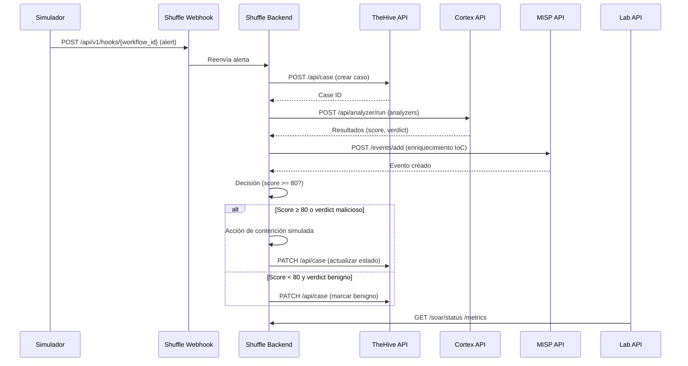

# API e Integraciones — SOAR Ransomware Lab

## Índice

- [1. Resumen](#1-resumen)
 - [1.1 Objetivo](#11-objetivo)
 - [1.2 Contexto](#12-contexto)
- [2. Alcance](#2-alcance)
 - [2.1 Qué cubre](#21-qué-cubre)
 - [2.2 Límites](#22-límites)
 - [2.3 Dependencias](#23-dependencias)
- [3. Contenido principal](#3-contenido-principal)
 - [3.1 Visión general de la API](#31-visión-general-de-la-api)
 - [3.2 Endpoints principales](#32-endpoints-principales)
 - [3.3 Contratos de integración](#33-contratos-de-integración)
 - [3.4 Autenticación y autorización](#34-autenticación-y-autorización)
 - [3.5 Integración con TheHive](#35-integración-con-thehive)
 - [3.6 Integración con Cortex](#36-integración-con-cortex)
 - [3.7 Integración con Shuffle](#37-integración-con-shuffle)
 - [3.8 Referencias técnicas](#38-referencias-técnicas)
- [4. Validación](#4-validación)
 - [4.1 Verificación](#41-verificación)
 - [4.2 Criterios de aceptación](#42-criterios-de-aceptación)
 - [4.3 Evidencias](#43-evidencias)
- [5. Problemas](#5-problemas)
 - [5.1 Limitaciones](#51-limitaciones)
 - [5.2 Riesgos o incidencias](#52-riesgos-o-incidencias)
 - [5.3 Recomendaciones / troubleshooting](#53-recomendaciones-troubleshooting)
- [6. Referencias](#6-referencias)

---

## 1. Resumen

### 1.1 Objetivo

Documentar la API REST del SOAR Lab, sus endpoints, contratos de integración y la conexión con servicios externos.

### 1.2 Contexto

La API FastAPI expone endpoints para gestión de alertas, casos, métricas y tests. Se integra con TheHive, Cortex, Shuffle y MISP mediante adaptadores de infraestructura.

---

## 2. Alcance

### 2.1 Qué cubre

- Endpoints de la API REST
- Contratos de integración con servicios externos
- Autenticación JWT y RBAC
- OpenAPI spec y documentación técnica

### 2.2 Límites

- No cubre instalación (ver 01-getting-started.md)
- No cubre operaciones detalladas (ver 04-operations.md)

### 2.3 Dependencias

- `docs/assets/references/openapi.json` — spec OpenAPI
- `src/soar_lab/interfaces/api/` — código de la API
- `src/soar_lab/infrastructure/integrations/` — adaptadores

---

## 3. Contenido principal

### 3.1 Visión general de la API

La fuente de verdad de los contratos de la API es el archivo `openapi.json`
generado automáticamente por FastAPI.

- **OpenAPI**: [`docs/assets/references/openapi.json`](assets/references/openapi.json)
- **Swagger UI** (en ejecución): `http://localhost:8000/docs` o `https://soar.local/api/docs`
- **ReDoc** (en ejecución): `http://localhost:8000/redoc`

#### Información general

- **Título**: SOAR Lab Management API
- **Versión**: 1.0.0
- **Descripción**: REST API for SOAR Ransomware Lab Management
- **Base URL**: `http://localhost:8000` / `https://soar.local/api/`
- **Autenticación**: JWT Bearer (`Authorization: Bearer <token>`)

#### Autenticación

Obtén un token con el endpoint `POST /auth/login`:

```bash
TOKEN=$(curl -s -X POST http://localhost:8000/auth/login \

 -H "Content-Type: application/json" \

 -d '{"username":"admin","password":"<WEB_UI_PASSWORD>"}' | jq -r '.token')
```

Usa el token en siguientes peticiones:

```bash
curl -H "Authorization: Bearer $TOKEN" http://localhost:8000/health
```

#### Endpoints

| Método | Ruta | Resumen | Tags |
|--------|-------------------------------------------------------------------|-------------------------|------|
| `GET` | `/` | Root |
|  |
| `GET` | `/health` | Health | |
| `POST` | `/auth/login` | Login | |
| `POST` | `/auth/verify` | Verify Auth | |
| `GET` | `/analytics/metrics` | Get Metrics | |
| `GET` | `/analytics/kpis` | Get Kpis | |
| `GET` | `/analytics/kpis/aggregated` | Get Aggregated Kpis | |
| `GET` | `/analytics/node-timings` | Get Node Timings | |
| `POST` | `/api/v1/contain` | Contain | |
| `POST` | `/api/v1/cache/ioc` | Cache Ioc | |
| `POST` | `/backup/create` | Create Backup | |
| `GET` | `/backup/list` | List Backups | |
| `POST` | `/backup/restore` | Restore Backup | |
| `POST` | `/tests/run` | Run Tests | |
| `GET` | `/services/status` | Get Services Status | |
| `GET` | `/soar/thehive/cases` | Thehive List Cases | |
| `GET` | `/soar/thehive/cases/{case_id}` | Thehive Get Case | |
| `GET` | `/soar/thehive/cases/{case_id}/observables` | Thehive Get Observables | |
| `GET` | `/soar/thehive/cases/{case_id}/tasks` | Thehive Get Tasks | |
| `GET` | `/soar/thehive/health` | Thehive Health | |
| `GET` | `/soar/cortex/analyzers` | Cortex List Analyzers | |
| `GET` | `/soar/cortex/jobs` | Cortex List Jobs | |
| `GET` | `/soar/cortex/jobs/{job_id}` | Cortex Get Job | |
| `GET` | `/soar/cortex/jobs/{job_id}/report` | Cortex Get Job Report | |
| `GET` | `/soar/cortex/health` | Cortex Health | |
| `GET` | `/soar/misp/attributes` | Misp Search Attributes | |
| `GET` | `/soar/misp/events` | Misp List Events | |
| `GET` | `/soar/misp/events/{event_id}` | Misp Get Event | |
| `GET` | `/soar/misp/health` | Misp Health | |
| `GET` | `/soar/shuffle/workflows` | Shuffle List Workflows | |
| `GET` | `/soar/shuffle/workflows/{workflow_id}` | Shuffle Get Workflow | |
| `GET` | `/soar/shuffle/workflows/{workflow_id}/executions` | Shuffle Get Executions | |
| `GET` | `/soar/shuffle/workflows/{workflow_id}/executions/{execution_id}` | Shuffle Get Execution | |
| `GET` | `/soar/shuffle/health` | Shuffle Health | |
| `GET` | `/soar/elasticsearch/count` | Es Count | |
| `GET` | `/soar/elasticsearch/latest` | Es Latest | |
| `GET` | `/soar/elasticsearch/health` | Es Health | |
| `GET` | `/soar/status` | Soar Status | |

#### Notas

- Todos los endpoints protegidos requieren `Authorization: Bearer <token>`.
- Las respuestas de error usan el esquema HTTP estándar de FastAPI.
- Para detalles de esquemas de petición/respuesta, consulta `openapi.json` o Swagger UI.
- `WebSocket /ws/logs`: endpoint de streaming de logs en tiempo real. No aparece en `openapi.json` porque FastAPI no genera WebSockets en la especificación OpenAPI de forma automática.

#### Servicios externos

> **Fuente canónica:** Los puertos host se documentan en [`docs/04-operations.md`](04-operations.md).
> La siguiente tabla indica únicamente el **endpoint interno** que usa la API para hablar con cada servicio.

La API del laboratorio actúa como fachada sobre servicios desplegados en Docker:

| Servicio | Contenedor (red `soar_net`) |
|-----------------|-----------------------------|
| TheHive | `thehive:9000` |
| Cortex | `cortex:9001` |
| MISP | `misp:80` |
| Shuffle Backend | `shuffle-backend:5001` |
| Elasticsearch | `elasticsearch:9200` (métricas `soar-metrics`) |
| OpenSearch | `opensearch:9200` (backend de Shuffle) |
| Grafana | `grafana:3000` |

Para la configuración de Nginx, DNS local y certificados, ver
[`docs/04-operations.md`](04-operations.md) y
[`docs/01-getting-started.md`](01-getting-started.md).

#### Alcance

- **Cubre**: endpoints REST de la API SOAR Lab, autenticación JWT, integraciones con servicios externos.
- **Límites**: no cubre la configuración de infraestructura (ver `docs/04-operations.md`), ni los flujos internos de cada integración (ver secciones 3.3 y siguientes de este documento).
- **Dependencias**: FastAPI, Pydantic v2, JWT, servicios Docker (TheHive, Cortex, MISP, Shuffle, Elasticsearch).

#### Validación

- **Verificación**: ejecutar `make health` para verificar que todos los servicios están activos.
- **Criterios de aceptación**: la API responde en `/health` con status 200, todos los endpoints documentados en `openapi.json` responden.
- **Evidencias**: el archivo `docs/assets/references/openapi.json` es generado automáticamente por FastAPI y contiene la especificación completa.

#### Referencias

- [OpenAPI Specification](assets/references/openapi.json)
- [FastAPI Documentation](https://fastapi.tiangolo.com/)
- [Guía de inicio rápido](01-getting-started.md)
- [Guía de infraestructura](04-operations.md)


### 3.2 Endpoints principales

Ver [sección 3.1](#31-visión-general-de-la-api) para la tabla completa de endpoints, autenticación y servicios externos.

### 3.3 Contratos de integración


Este documento detalla las APIs utilizadas en el SOAR Ransomware Lab, especificando cuáles son reales (contenedores
Docker activos) y cuáles son simuladas (scripts/mocks), con endpoints, autenticación por variables de entorno, payloads
de ejemplo y límites de uso.


El SOAR Ransomware Lab integra múltiples APIs para orquestar la respuesta a incidentes de ransomware. Algunas APIs son
servicios reales desplegados como contenedores Docker, mientras que otras se simulan mediante scripts para facilitar el
entorno de laboratorio y el contexto académico (TFM).


Este documento cubre:

- Clasificación de APIs (reales vs simuladas)
- Especificación detallada de endpoints de cada API
- Métodos de autenticación y variables de entorno
- Payloads de ejemplo para cada endpoint
- Límites de uso y configuración de rate limiting
- Scripts de simulación para APIs no HTTP


Este documento no cubre:

- Implementación interna de cada API (ver documentación oficial de cada componente)
- Estrategias de seguridad detalladas (ver docs/02-architecture.md)
- Estrategia de Docker (ver docs/02-architecture.md)
- Planificación del proyecto (ver docs/06-project-management.md)


Este documento depende de:

- Documentación oficial de TheHive API
- Documentación oficial de Cortex API
- Documentación oficial de Shuffle API
- Documentación oficial de FastAPI
- Documentación oficial de MISP API
- Archivo de configuración .env.full


#### 3.3.1 Especificación de APIs

##### 3.3.1.1 Clasificación de APIs

| API | Tipo | Servicio | Puerto host / Proxy |
|-----------------------------|--------------|---------------------------------------|----------------------------------|
| **TheHive** | ✅ Real | Gestión de casos e incidentes | `8100` / `/thehive/` |
| **Cortex** | ✅ Real | Análisis de IoCs (analyzers) | `8101` / `/cortex/` |
| **Shuffle UI** | ✅ Real | Interfaz del orquestador SOAR | `8081` (directo, no Nginx) |
| **Shuffle Backend API** | ✅ Real | API del motor de Shuffle (y webhooks) | `5001` / `/shuffle-api/` |
| **Lab API** | ✅ Real | FastAPI de gestión del laboratorio | `8000` / `/api/` |
| **MISP** | ✅ Real | Inteligencia de amenazas | `8083` (directo, no Nginx) |
| **Elasticsearch** | ✅ Real | Motor de búsqueda / métricas | `8200` (no expuesto) |
| **EDR / Contención** | ⚙️ Simulado* | Contención de endpoints vía scripts | — |
| **Firewall** | 🔲 Simulado | Bloqueo de IPs vía scripts | — |

> *La contención de endpoints (aislamiento de red, bloqueo de cuentas, terminación de procesos) se simula en el
laboratorio. El sistema rastrea estados (`pending`, `executed`, `failed`) pero no ejecuta acciones destructivas reales.
La generación de alertas de prueba se realiza con `src/soar_lab/simulator/simulate_alerts.py`.

##### 3.3.1.2 APIs reales

**TheHive API:**

- Gestión de casos e incidentes
- Autenticación vía API key Bearer token
- Endpoints para creación, actualización y consulta de casos
- Gestión de observables y artefactos

**Cortex API:**

- Análisis de IoCs mediante analyzers
- Ejecución de analyzers offline y online
- Consulta de estado y resultados de jobs
- Configuración de límites de concurrencia

**Shuffle Webhook:**

- Disparo de workflows mediante webhooks
- Autenticación vía Bearer token
- Rate limiting configurado
- Payload de alerta estructurado

**Lab API (FastAPI):**

- Gestión del laboratorio
- Autenticación JWT
- Endpoints para health checks, métricas, tests y backups
- WebSocket para streaming de logs

##### 3.3.1.3 APIs simuladas

**SIEM Simulado :**

- Generación de alertas mediante módulo `src/soar_lab/simulator/simulate_alerts.py`
- POST directo al webhook de Shuffle
- Sin endpoint HTTP externo

**EDR Simulado:**

- Contención de endpoints simulada en código Python
- No hay scripts de shell separados actualmente
- Registro en logs del sistema

**Firewall Simulado:**

- Bloqueo de IPs simulado en código Python
- Integrado en el módulo de contención
- Registro en logs del sistema

##### 3.3.2 Endpoints principales (detalle)

###### 3.3.2.1 TheHive API

**Base URL**: `http://localhost:${THEHIVE_HTTP_PORT:-8100}`
**Autenticación**: `Authorization: Bearer ${THEHIVE_API_KEY}`
**Variable .env**: `THEHIVE_API_KEY=<thehive-api-key>`

**Endpoints utilizados:**

| Método | Endpoint | Descripción |
|---------|----------------------------------|-------------------------------------------|
| `GET` | `/api/status` | Health check del servicio |
| `GET` | `/api/case` | Listar todos los casos |
| `POST` | `/api/case` | Crear nuevo caso |
| `GET` | `/api/case/{case_id}` | Obtener caso por ID |
| `PATCH` | `/api/case/{case_id}` | Actualizar estado del caso |
| `POST` | `/api/case/{case_id}/artifact` | Añadir observable a un caso |
| `GET` | `/api/case/{case_id}/observable` | Listar observables de un caso |
| `POST` | `/api/alert` | Crear alerta (alternativa a caso directo) |

**Payload — Crear caso (`POST /api/case`):**

```json
{
 "title": "Ransomware detectado en WIN-001 [ALERT-2025-001234]",
 "description": "Ransomware activity detected on WIN-001 - suspicious file encryption patterns observed",
 "severity": 3,
 "tlp": 2,
 "tags": ["ransomware", "soar-lab", "tc-01"],
 "status": "Open"
}
```

**Respuesta (201):**

```json
{
 "_id": "~123456789",
 "_type": "case",
 "caseId": 42,
 "title": "Ransomware detectado en WIN-001 [ALERT-2025-001234]",
 "status": "Open",
 "severity": 3,
 "createdAt": 1746295335000
}
```

**Límites de uso:**

| Parámetro | Valor |
|------------------------|-------------------------------|
| Timeout por petición | 30 s |
| Reintentos automáticos | 3 (backoff 5 s) |
| Severidad válida | 1 (Low), 2 (Medium), 3 (High) |
| TLP válido | 0–3 |

###### 3.3.2.2 Cortex API

**Base URL**: `http://localhost:${CORTEX_HTTP_PORT:-8101}`
**Autenticación**: `Authorization: Bearer ${CORTEX_API_KEY}`
**Variable .env**: `CORTEX_API_KEY=<cortex-api-key>`

**Endpoints utilizados:**

| Método | Endpoint | Descripción |
|--------|----------------------------|---------------------------------------|
| `GET` | `/` | Health check (HTTP 200 = disponible) |
| `GET` | `/api/analyzer` | Listar analyzers disponibles |
| `POST` | `/api/analyzer/run` | Ejecutar analyzer sobre un observable |
| `GET` | `/api/job/{job_id}` | Estado de un job de análisis |
| `GET` | `/api/job/{job_id}/report` | Resultado completo del job |

**Payload — Ejecutar analyzer (`POST /api/analyzer/run`):**

```json
{
 "analyzerId": "Hashdd_Status_2_0",
 "dataType": "hash",
 "data": "44d88612fea8a8f36de82e1278abb02f"
}
```

**Analyzers activos en el lab** (ver `scripts/setup/shuffle_workflow/cortex_setup.py`):

| Analyzer ID | Tipo | Modo | Requiere API key externa |
|----------------------------|-----------|---------|---------------------------|
| `Hashdd_Status_2_0` | hash | offline | No |
| `IP-API_1_1` | ip | offline | No |
| `DShield_lookup_1_0` | ip | online | No |
| `Mnemonic_pDNS_Public_3_0` | ip | online | No |
| `GoogleDNS_resolve_1_0_0` | ip/domain | offline | No |
| `ValidateObservable_1_0` | genérico | offline | No |
| `DomainMailSPFDMARC_1_2` | domain | offline | No |

**Límites de uso:**

| Parámetro | Valor |
|----------------------------|----------------------------------|
| `MAX_CONCURRENT_ANALYZERS` | `3` (`.env.full`) |
| `ANALYZER_TIMEOUT` | `30` s (`.env.full`) |
| `ANALYZER_RETRIES` | `1` (`.env.full`) |
| Timeout por job | 60 s (configurable en Cortex UI) |

###### 3.3.2.3 Shuffle webhook

**Base URL**: `http://localhost:${SHUFFLE_API_PORT:-5001}/api/v1/hooks/webhook_{trigger_id}` (URL devuelta por `init_shuffle_webhook.py`)
**Autenticación**: Token de ruta (`trigger_id`); el `Authorization` Bearer no es requerido por el endpoint de hooks.
**Variables .env**: `SHUFFLE_DEFAULT_APIKEY` (para API de backend), `SIEM_WEBHOOK_TOKEN` (token usado por `simulate_alerts.py` cuando no se dispone de `webhook_info.json`)

**Endpoints utilizados:**

| Método | Endpoint | Descripción |
|--------|--------------------------|-----------------------------------------|
| `GET` | `/health` | Health check del backend |
| `POST` | `/api/v1/hooks/{workflow_id}` | Disparar workflow con payload de alerta |

**Payload — Webhook de alerta (`POST /api/v1/hooks/{workflow_id}`):**

```json
{
 "alert_id": "ALERT-2025-001234",
 "hostname": "WIN-001",
 "src_ip": "185.220.101.182",
 "hash": "44d88612fea8a8f36de82e1278abb02f",
 "severity": 3,
 "source": "siem-ransomware-detection",
 "detection_time": "2025-05-03T18:42:15Z",
 "event_type": "ransomware_detection",
 "confidence": 95,
 "process_name": "ransomware.exe",
 "mitre_techniques": ["T1486"]
}
```

**Límites de uso:**

| Parámetro | Valor |
|----------------------------|-----------------------------------|
| `WEBHOOK_RATE_LIMIT` | 60 req/min (`.env.full`) |
| `WEBHOOK_PAYLOAD_MAX_SIZE` | 65536 bytes / 64 KB (`.env.full`) |
| Timeout cliente | 3 s (tests E2E) |

###### 3.3.2.4 Lab API — FastAPI

> **Fuente de verdad**: el contrato de la API del laboratorio se encuentra en `docs/assets/references/openapi.json` (generado automáticamente por FastAPI). Los modelos de datos de entrada/salida se definen en `src/soar_lab/config/schemas/__init__.py` (validaciones Pydantic) y `src/soar_lab/interfaces/api/models.py` (modelos de dominio del API). Puede explorarse en vivo en `http://localhost:8000/docs` / `https://soar.local/api/docs`. En caso de discrepancia entre este documento, `openapi.json` y el código, prevalecen el esquema Pydantic y el `openapi.json` actual.

**Base URL**: `http://localhost:${API_PORT:-8000}` (directo) / `https://soar.local/api` (vía Nginx)
**Autenticación**: JWT Bearer token (obtenido vía `POST /auth/login`)
**Variables .env**: `JWT_SECRET_KEY` (preferente, leído por `AuthService`) o `API_AUTH_SECRET` (legacy fallback) para firmar/validar tokens; `JWT_EXPIRATION_MINUTES` (default 60).
**Swagger UI**: `https://soar.local/api/docs` (Nginx) o `http://localhost:8000/docs` (directo)
**ReDoc**: `https://soar.local/api/redoc` (Nginx) o `http://localhost:8000/redoc` (directo)

**Endpoints:**

| Método | Endpoint | Auth | Descripción |
|--------|----------------------|------|--------------------------------------|
| `GET` | `/health` | No | Health check |
| `GET` | `/` | No | Documentación HTML |
| `POST` | `/auth/login` | No | Obtener JWT token |
| `POST` | `/auth/verify` | JWT | Verificar token |
| `GET` | `/analytics/metrics` | No | CPU, memoria y disco del host |
| `GET` | `/analytics/kpis` | No | KPIs calculados (MTTR, detecciones…) |
| `GET` | `/analytics/kpis/aggregated` | No | KPIs agregados desde Elasticsearch |
| `GET` | `/analytics/node-timings` | No | Timings de nodos del workflow |
| `GET` | `/services/status` | No | Estado de todos los contenedores |
| `POST` | `/api/v1/contain` | No | Contención simulada de endpoints |
| `POST` | `/api/v1/cache/ioc` | No | Cachear IoCs en Redis |
| `POST` | `/tests/run` | No | Ejecutar suite de tests |
| `POST` | `/backup/create` | No | Crear backup |
| `GET` | `/backup/list` | No | Listar backups disponibles |
| `POST` | `/backup/restore` | No | Restaurar backup |
| `WS` | `/ws/logs` | No | Stream de logs en tiempo real |
| `GET` | `/soar/status` | No | Health agregado de todas las integraciones |
| `GET` | `/soar/thehive/cases` | No | Listar casos de TheHive |
| `GET` | `/soar/thehive/cases/{case_id}` | No | Obtener caso de TheHive |
| `GET` | `/soar/thehive/cases/{case_id}/observables` | No | Observables de un caso |
| `GET` | `/soar/thehive/cases/{case_id}/tasks` | No | Tareas de un caso |
| `GET` | `/soar/thehive/health` | No | Health check de TheHive |
| `GET` | `/soar/cortex/analyzers` | No | Listar analyzers de Cortex |
| `GET` | `/soar/cortex/jobs` | No | Listar jobs de Cortex |
| `GET` | `/soar/cortex/jobs/{job_id}` | No | Estado de un job de Cortex |
| `GET` | `/soar/cortex/jobs/{job_id}/report` | No | Reporte de un job de Cortex |
| `GET` | `/soar/cortex/health` | No | Health check de Cortex |
| `GET` | `/soar/misp/attributes` | No | Buscar atributos en MISP |
| `GET` | `/soar/misp/events` | No | Listar eventos de MISP |
| `GET` | `/soar/misp/events/{event_id}` | No | Obtener evento de MISP |
| `GET` | `/soar/misp/health` | No | Health check de MISP |
| `GET` | `/soar/shuffle/workflows` | No | Listar workflows de Shuffle |
| `GET` | `/soar/shuffle/workflows/{workflow_id}` | No | Obtener workflow de Shuffle |
| `GET` | `/soar/shuffle/workflows/{workflow_id}/executions` | No | Ejecuciones de un workflow |
| `GET` | `/soar/shuffle/workflows/{workflow_id}/executions/{execution_id}` | No | Ejecución específica |
| `GET` | `/soar/shuffle/health` | No | Health check de Shuffle |
| `GET` | `/soar/elasticsearch/count` | No | Contar documentos en un índice |
| `GET` | `/soar/elasticsearch/latest` | No | Documentos recientes de un índice |
| `GET` | `/soar/elasticsearch/health` | No | Health de Elasticsearch |
| `GET` | `/soar//agents/{agent_id}/vulnerabilities` | No | CVEs de un agente |

**Payload — Login (`POST /auth/login`):**

```json
{ "username": "admin", "password": "<WEB_UI_PASSWORD>" }
```

**Payload — Ejecutar tests (`POST /tests/run`):**

```json
{ "category": "unit" }
```

Valores válidos para `category`: `unit`, `integration`, `e2e`, `atomic`, `performance`, `security`, `smoke`, `all`.

**Respuesta — `GET /analytics/metrics` (`Metrics`)**

```json
{
 "cpu": 12.5,
 "memory": 45.2,
 "disk": 67.8,
 "timestamp": "2026-07-19T10:30:00Z"
}
```

**Parámetros y respuesta — `GET /analytics/kpis`**

- **Query**: `log_file_path` (opcional). Ruta del archivo de logs para calcular KPIs en modo archivo.
- **Response 200**: Diccionario con métricas calculadas por el servicio de analytics (por ejemplo, MTTR, total de ejecuciones, alertas por tipo). El formato exacto depende del adapter disponible.
- **Errores**: `500` si el servicio de analytics no está disponible.

**Respuesta — `GET /analytics/kpis/aggregated`**

```json
{
 "period_hours": 24,
 "timestamp": "2026-07-19T10:30:00Z",
 "total_alerts": 42,
 "mttr_statistics": {
 "mean": 45.2,
 "median": 38.0,
 "p90": 89.5,
 "min": 12.0,
 "max": 120.0
 },
 "by_alert_type": {
 "malicious": {"count": 30, "mean_mttr": 41.1},
 "benign": {"count": 12, "mean_mttr": 52.3}
 },
 "services": {
 "thehive": {"reachable": true, "alerts_processed": 30},
 "cortex": {"reachable": true, "analyzers_run": 28},
 "misp": {"reachable": true, "attributes_enriched": 15}
 }
}
```

##### 3.3.3 Resumen de variables de entorno por API

| Variable | API | Descripción |
|----------------------------|-------------------|--------------------------------------------|
| `THEHIVE_API_KEY` | TheHive | API key de autenticación |
| `THEHIVE_HTTP_PORT` | TheHive | Puerto host (default 8100) |
| `CORTEX_API_KEY` | Cortex | API key de autenticación |
| `CORTEX_HTTP_PORT` | Cortex | Puerto host (default 8101) |
| `SHUFFLE_API_PORT` | Shuffle | Puerto del backend (default 5001, expuesto 8081) |
| `SHUFFLE_UI_PORT` | Shuffle UI | Puerto host (default 8081) |
| `SIEM_WEBHOOK_TOKEN` | Shuffle webhook | Token Bearer del webhook |
| `API_PORT` | Lab API | Puerto del servidor FastAPI (default 8000) |
| `JWT_SECRET_KEY` | Lab API | Secreto preferente de firma JWT (>=32 chars) |
| `JWT_ALGORITHM` | Lab API | Algoritmo de firma JWT (default `HS256`) |
| `JWT_EXPIRATION_MINUTES` | Lab API | Tiempo de expiración del token (default 60) |
| `API_AUTH_SECRET` | Lab API | Secreto legacy de firma JWT (fallback) |
| `WEB_UI_USER` | Lab API | Usuario para `/auth/login` |
| `WEB_UI_PASSWORD` | Lab API | Contraseña para `/auth/login` |
| `CORS_ORIGINS` | Lab API | Orígenes permitidos para CORS |
| `EDR_SIM_TOKEN` | EDR simulado | Token reservado (simulado) |
| `FIREWALL_SIM_TOKEN` | Firewall simulado | Token reservado (simulado) |
| `MAX_CONCURRENT_ANALYZERS` | Cortex | Máx. analyzers en paralelo |
| `ANALYZER_TIMEOUT` | Cortex | Timeout por job (segundos) |
| `WEBHOOK_RATE_LIMIT` | Shuffle | Máx. peticiones/min al webhook |
| `WEBHOOK_PAYLOAD_MAX_SIZE` | Shuffle | Tamaño máximo del payload (bytes) |
| `DECISION_SCORE_THRESHOLD` | Playbook | Umbral de contención (default 80) |

##### 3.3.4 Modelos de datos

###### 3.3.4.1 Payload de alerta

Modelo canónico: `RansomwareAlert` en `src/soar_lab/config/schemas/__init__.py`. Todos los campos deben cumplir las validaciones Pydantic del esquema.

```json
{
 "alert_id": "ALERT-2025050318-0001",
 "hostname": "WIN-001",
 "src_ip": "185.220.101.182",
 "hash": {
 "sha256": "e3b0c44298fc1c149afbf4c8996fb92427ae41e4649b934ca495991b7852b855",
 "md5": "d41d8cd98f00b204e9800998ecf8427e",
 "sha1": "da39a3ee5e6b4b0d3255bfef95601890afd80709"
 },
 "severity": "3",
 "source": "siem-ransomware-detection",
 "detection_time": "2025-05-03T18:42:15Z",
 "event_type": "ransomware_detection",
 "description": "Ransomware activity detected on WIN-001 - suspicious file encryption patterns observed",
 "affected_files": [
 {
 "path": "C:/Users/victim/Documents/encrypted.docx",
 "name": "encrypted.docx",
 "size": 10240,
 "extension": ".docx",
 "encrypted": true
 }
 ],
 "mitre_tactics": ["TA0010"],
 "mitre_techniques": ["T1486"],
 "network_events": [
 {
 "src_ip": "192.168.1.10",
 "dst_ip": "185.220.101.182",
 "src_port": 49152,
 "dst_port": 443,
 "protocol": "TCP"
 }
 ],
 "user_context": {"user": "alice"},
 "process_info": {"name": "ransomware.exe", "pid": 1234}
}
```

> **Nota:** `severity` es un string del enum `"0"` (Low), `"1"` (Medium), `"2"` (High), `"3"` (Critical). `alert_id` debe cumplir `^ALERT-\d{10}-\d{4}$`. `hash.sha256` es obligatorio y debe ser 64 caracteres hexadecimales. Valores extra como `confidence` o `process_name` no están en `RansomwareAlert`; si se envían al webhook de Shuffle, deben colocarse en `metadata` del `WebhookPayload` para no violar el esquema.

###### 3.3.4.2 Payload de caso

```json
{
 "title": "Ransomware detectado en WIN-001 [ALERT-2025-001234]",
 "description": "Ransomware activity detected on WIN-001 - suspicious file encryption patterns observed",
 "severity": 3,
 "tlp": 2,
 "tags": ["ransomware", "soar-lab", "tc-01"],
 "status": "Open"
}
```

###### 3.3.4.3 Payload de analyzer

```json
{
 "analyzerId": "Hashdd_Status_2_0",
 "dataType": "hash",
 "data": "44d88612fea8a8f36de82e1278abb02f"
}
```

###### 3.3.4.4 Modelos Pydantic de Lab API

**`LoginRequest`**

```json
{
 "username": "admin",
 "password": "..."
}
```

**`LoginResponse`**

```json
{
 "token": "eyJ0...",
 "message": "Login successful",
 "token_type": "Bearer"
}
```

**`RunRequest`**

```json
{
 "category": "unit"
}
```

Valores válidos: `unit`, `integration`, `e2e`, `atomic`, `performance`, `security`, `smoke`, `all`.

**`BackupRequest`**

```json
{
 "backup_name": "manual-backup.tar.gz"
}
```

Validación: no permite `..`, `/`, `\` y requiere extensión `.tar.gz`.

**`Metrics`**

```json
{
 "cpu": 12.5,
 "memory": 45.2,
 "disk": 67.8,
 "timestamp": "2026-07-18T00:00:00Z"
}
```

**`RunResults`**

```json
{
 "category": "unit",
 "passed": 79,
 "failed": 0,
 "skipped": 0,
 "coverage": 85.4,
 "output": "...",
 "duration": 12.3
}
```

###### 3.3.4.5 Modelos avanzados: contención, KPIs y seguridad

Los modelos definidos en `src/soar_lab/config/schemas/__init__.py` extienden las validaciones de payloads y son la fuente de verdad
para los campos que llegan a `init_shuffle_webhook.py` y a la API.

| Modelo | Campos principales | Validaciones |
|---|---|---|
| `RansomwareAlert` | `alert_id`, `hostname`, `src_ip`, `hash`, `severity`, `source`, `detection_time`, `event_type`, `description`, `affected_files`, `mitre_tactics`, `mitre_techniques`, `network_events` | `alert_id`: `^ALERT-\d{10}-\d{4}$`; `hostname`: `[a-zA-Z0-9\-]{1,255}`; `detection_time` no futuro; `hash.sha256` 64 hex. |
| `MITREInfo` | `tactics`, `techniques`, `sub_techniques` | Tácticas limitadas a `TA0001`–`TA0011`, `TA0040`–`TA0043`. |
| `ContainmentAction` | `action_id`, `alert_id`, `hostname`, `action_type`, `status`, `execution_time`, `details`, `error_message` | `action_id`: `^ACTION-\d{10}-\d{4}$`; `action_type` ∈ `{network_isolation, process_termination, account_lockdown}`; `status` ∈ `{pending, executed, failed, completed}`. |
| `KPIReport` | `total_executions`, `mean_mttr`, `median_mttr`, `p50_mttr`, `p90_mttr`, `min_mttr`, `max_mttr`, `std_deviation`, `threshold_p50` (120 s), `threshold_p90` (180 s) | Valores `>= 0`; `p50_within_threshold = p50_mttr <= threshold_p50`; `p90_within_threshold = p90_mttr <= threshold_p90`. |
| `HealthCheck` | `service_name`, `status`, `timestamp`, `response_time_ms`, `error_message`, `metadata` | `status` ∈ `{healthy, unhealthy, degraded}`; `response_time_ms <= 30000`. |
| `BackupReport` | `backup_id`, `timestamp`, `backup_type`, `components`, `total_size_mb`, `compression_ratio`, `success`, `retention_days` | `backup_id`: `^BACKUP-\d{8}_\d{6}$`; `backup_type` ∈ `{manual, scheduled, auto}`; `retention_days >= 1`. |
| `SecurityScan` | `scan_id`, `timestamp`, `scanner`, `target`, `vulnerabilities`, `total_vulnerabilities`, `scan_duration_seconds`, `success`, `recommendations` | `scan_id`: `^SCAN-\d{8}_\d{6}$`; severidades válidas: `critical`, `high`, `medium`, `low`, `info`; counts `>= 0`. |

**Ejemplo `ContainmentAction`:**

```json
{
 "action_id": "ACTION-2025071812-0001",
 "alert_id": "ALERT-2025071812-0001",
 "hostname": "WIN-001",
 "action_type": "network_isolation",
 "status": "executed",
 "execution_time": "2025-07-18T12:05:00Z",
 "details": {"isolated_by": "soar-lab", "rule_id": "drop-ransomware-001"}
}
```

**Ejemplo `KPIReport`:**

```json
{
 "total_executions": 16,
 "mean_mttr": 45.2,
 "median_mttr": 42.0,
 "p50_mttr": 41.0,
 "p90_mttr": 78.5,
 "threshold_p50": 120.0,
 "threshold_p90": 180.0,
 "p50_within_threshold": true,
 "p90_within_threshold": true
}
```

---

### 3.4 Autenticación y autorización

#### 3.4.1 Configuración de autenticación

Todas las APIs requieren configuración de autenticación vía variables de entorno en `.env.full`:

- API keys para servicios externos
- Tokens Bearer para webhooks
- `JWT_SECRET_KEY` (preferente) o `API_AUTH_SECRET` (legacy fallback) para firma/verificación JWT en Lab API
- `JWT_ALGORITHM` (default `HS256`) y `JWT_EXPIRATION_MINUTES` (default 60)
- `WEB_UI_USER` y `WEB_UI_PASSWORD` para `/auth/login`
- Tokens reservados para integraciones futuras (EDR, Firewall)

#### 3.4.2 Resumen de variables de entorno por API

Ver tabla completa en [3.3.3 Resumen de variables de entorno por API](#333-resumen-de-variables-de-entorno-por-api).

#### 3.4.3 Detalle de autenticación JWT de Lab API

**`POST /auth/login`**

- **Body** (`LoginRequest`):
 ```json
 {"username": "admin", "password": "<WEB_UI_PASSWORD>"}
 ```
- **Response 200** (`LoginResponse`):
 ```json
 {"token": "eyJ0...", "message": "Login successful", "token_type": "Bearer"}
 ```
- **Errores**:
 - `401 Unauthorized`: credenciales incorrectas (`WEB_UI_USER` / `WEB_UI_PASSWORD`).
 - `500 Internal Server Error`: `JWT_SECRET_KEY`/`API_AUTH_SECRET` no configurado o error interno.

**`POST /auth/verify`**

- **Auth**: `Authorization: Bearer <token>`
- **Response 200** (`VerifyAuthResponse`):
 ```json
 {"valid": true, "user": {"user": "admin"}}
 ```
- **Errores**:
 - `401 Unauthorized`: token inválido, expirado o ausente.

> **Nota**: El token JWT contiene claims `sub` (usuario), `iat`, `exp` y `scope: access`. Tras rotar `JWT_SECRET_KEY` o `API_AUTH_SECRET`, los tokens emitidos previamente quedan inválidos; los clientes deben renovarlos llamando de nuevo a `/auth/login`.

#### 3.4.4 Ejemplos de uso

##### 3.4.4.1 Flujo de integración de APIs

**Diagrama de Flujo de Integración de APIs:**



**Pasos del flujo:**

1. **Ingestión de Alertas**: detecta actividad sospechosa o el simulador `src/soar_lab/simulator/simulate_alerts.py` genera alertas de prueba.
2. **Disparo de Workflow**: La alerta se envía al webhook de Shuffle configurado en `init_shuffle_webhook.py`.
3. **Creación de Caso**: Shuffle crea caso en TheHive con observables.
4. **Análisis de IoCs**: Cortex ejecuta analyzers sobre los observables.
5. **Enriquecimiento**: MISP recibe y enriquece IoCs cuando corresponde.
6. **Contención**: El playbook registra acciones de contención simuladas con estados `pending`, `executed` o `failed`.
7. **Observabilidad**: Lab API expone métricas, KPIs y estado de integraciones vía REST y WebSocket `/ws/logs`.

##### 3.4.4.2 Procedimientos Específicos de Rotación de API Keys

**Rotación de API Keys para TheHive:**

```bash
# 1. Generar nueva API key desde TheHive UI
# Acceder a http://localhost:8100/#/administration/users
# Seleccionar usuario y generar nueva API key

# 2. Actualizar .env.full
nano .env.full
THEHIVE_API_KEY=<nueva_api_key>

# 3. Reiniciar servicios que usan TheHive
docker compose restart shuffle-backend shuffle-frontend

# 4. Verificar conexión
curl -H "Authorization: Bearer $THEHIVE_API_KEY" http://localhost:8100/api/case
```

**Rotación de API Keys para Cortex:**

```bash
# 1. Generar nueva API key desde Cortex UI
# Acceder a http://localhost:8101/#/management/users
# Seleccionar usuario y generar nueva API key

# 2. Actualizar .env.full
nano .env.full
CORTEX_API_KEY=<nueva_api_key>

# 3. Actualizar TheHive con nueva key de Cortex
# Acceder a http://localhost:8100/#/administration/organizations
# Editar organización y actualizar Cortex API key

# 4. Reiniciar servicios
docker compose restart shuffle-backend

# 5. Verificar conexión
curl -H "Authorization: Bearer $CORTEX_API_KEY" http://localhost:8101/api/analyzer
```

**Rotación de Webhook Token de Shuffle:**

```bash
# 1. Generar nuevo token seguro
python3 -c "import secrets; print(secrets.token_urlsafe(32))"

# 2. Actualizar .env.full
nano .env.full
SIEM_WEBHOOK_TOKEN=<nuevo_token>

# 3. Verificar simulador SIEM
# El simulador lee SHUFFLE_WEBHOOK_URL o SIEM_WEBHOOK_TOKEN desde .env.full/webhook_info.json

# 4. Reiniciar Shuffle
docker compose restart shuffle-backend shuffle-frontend

# 5. Verificar webhook
curl -H "Authorization: Bearer $SIEM_WEBHOOK_TOKEN" http://localhost:5001/api/v1/health
```

**Rotación de JWT Secret para Lab API:**

```bash
# 1. Generar nuevo secret seguro
python3 -c "import secrets; print(secrets.token_urlsafe(64))"

# 2. Actualizar .env.full
nano .env.full
API_AUTH_SECRET=<nuevo_secret>

# 3. Reiniciar Lab API
docker compose restart api

# 4. Regenerar todos los tokens JWT existentes
# Los usuarios deben hacer login nuevamente

# 5. Verificar
curl -X POST http://localhost:8000/auth/login -d '{"username":"admin","password":"<WEB_UI_PASSWORD>"}'
```

##### 3.4.4.3 Ejemplo completo de autenticación JWT

**Swagger / OpenAPI:** La interfaz interactiva de documentación se encuentra en:

- Directo: `http://localhost:8000/docs` y `http://localhost:8000/redoc`
- Vía Nginx: `https://soar.local/api/docs` y `https://soar.local/api/redoc`

**Ejemplo de login y uso con `curl`:**

```bash
# 1. Login y guardar token
TOKEN=$(curl -s -X POST http://localhost:8000/auth/login \
 -H "Content-Type: application/json" \
 -d '{"username":"admin","password":"<WEB_UI_PASSWORD>"}' | \
 python -c "import sys, json; print(json.load(sys.stdin).get('token',''))")

# 2. Verificar token
curl -X POST http://localhost:8000/auth/verify \
 -H "Authorization: Bearer $TOKEN"

# 3. Llamar a un endpoint protegido (ejemplo: health no requiere auth; kpis tampoco requiere auth)
# Para endpoints JWT-protegidos:
curl -X GET http://localhost:8000/<endpoint-protegido> \
 -H "Authorization: Bearer $TOKEN"
```

**Consideraciones:**

- El token incluye claims `sub`, `iat`, `exp` y `scope: access`.
- El algoritmo por defecto es `HS256` y el secreto se lee de `JWT_SECRET_KEY` (preferente) o `API_AUTH_SECRET` (fallback).
- Tras rotar el secreto, los tokens emitidos previamente quedan inválidos.

##### 3.4.4.4 Ejemplos de Error Handling para Cada API

**Error Handling para TheHive API:**

```python
import requests
from requests.exceptions import RequestException

def create_thehive_case(alert_data):
 try:
 response = requests.post(
 f"http://localhost:{THEHIVE_HTTP_PORT}/api/case",
 headers={"Authorization": f"Bearer {THEHIVE_API_KEY}"},
 json=alert_data,
 timeout=30
 )
 response.raise_for_status
 return response.json
 except requests.exceptions.HTTPError as e:
 if response.status_code == 401:
 raise Exception("TheHive API key inválida o expirada")
 elif response.status_code == 403:
 raise Exception("Permisos insuficientes en TheHive")
 elif response.status_code == 409:
 raise Exception("El caso ya existe")
 else:
 raise Exception(f"Error HTTP {response.status_code}: {response.text}")
 except requests.exceptions.Timeout:
 raise Exception("Timeout al conectar con TheHive")
 except requests.exceptions.ConnectionError:
 raise Exception("TheHive no está disponible")
 except RequestException as e:
 raise Exception(f"Error de conexión con TheHive: {str(e)}")
```

**Error Handling para Cortex API:**

```python
def run_cortex_analyzer(analyzer_id, data_type, data):
 try:
 response = requests.post(
 f"http://localhost:{CORTEX_HTTP_PORT}/api/analyzer/run",
 headers={"Authorization": f"Bearer {CORTEX_API_KEY}"},
 json={"analyzerId": analyzer_id, "dataType": data_type, "data": data},
 timeout=60
 )
 response.raise_for_status
 return response.json
 except requests.exceptions.HTTPError as e:
 if response.status_code == 401:
 raise Exception("Cortex API key inválida")
 elif response.status_code == 400:
 raise Exception("Payload inválido para analyzer")
 elif response.status_code == 429:
 raise Exception("Límite de analyzers concurrentes alcanzado")
 else:
 raise Exception(f"Error HTTP {response.status_code}: {response.text}")
 except requests.exceptions.Timeout:
 raise Exception("Timeout en ejecución de analyzer")
 except requests.exceptions.ConnectionError:
 raise Exception("Cortex no está disponible")
```

**Error Handling para Shuffle Webhook:**

```python
def send_alert_to_shuffle(alert_data):
 try:
 response = requests.post(
 f"http://localhost:{SHUFFLE_API_PORT}/api/v1/hooks/{WORKFLOW_ID}",
 headers={"Authorization": f"Bearer {SIEM_WEBHOOK_TOKEN}"},
 json=alert_data,
 timeout=10
 )
 response.raise_for_status
 return response.json
 except requests.exceptions.HTTPError as e:
 if response.status_code == 401:
 raise Exception("Webhook token inválido")
 elif response.status_code == 404:
 raise Exception("Workflow ID no encontrado")
 elif response.status_code == 413:
 raise Exception("Payload excede tamaño máximo (64KB)")
 else:
 raise Exception(f"Error HTTP {response.status_code}: {response.text}")
 except requests.exceptions.Timeout:
 raise Exception("Timeout al enviar alerta a Shuffle")
 except requests.exceptions.ConnectionError:
 raise Exception("Shuffle webhook no está disponible")
```

**Error Handling para Lab API:**

```python
def execute_lab_tests(category):
 try:
 # Primero obtener JWT token
 auth_response = requests.post(
 f"http://localhost:{API_PORT}/auth/login",
 json={"username": "admin", "password": "<WEB_UI_PASSWORD>"},
 timeout=10
 )
 auth_response.raise_for_status
 token = auth_response.json.get("token")

 # Ejecutar tests con token
 response = requests.post(
 f"http://localhost:{API_PORT}/tests/run",
 headers={"Authorization": f"Bearer {token}"},
 json={"category": category},
 timeout=300
 )
 response.raise_for_status
 return response.json
 except requests.exceptions.HTTPError as e:
 if response.status_code == 401:
 raise Exception("Credenciales de Lab API inválidas")
 elif response.status_code == 403:
 raise Exception("Permisos insuficientes para ejecutar tests")
 else:
 raise Exception(f"Error HTTP {response.status_code}: {response.text}")
 except requests.exceptions.Timeout:
 raise Exception("Timeout en ejecución de tests")
 except requests.exceptions.ConnectionError:
 raise Exception("Lab API no está disponible")
```

### 3.5 Integración con TheHive

Este documento ofrece una visión general de las integraciones entre los componentes del SOAR Ransomware Lab.

#### Índice

- [3.5.1 Resumen](#351-resumen)
- [3.5.2 Servicios Integrados](#352-servicios-integrados)
- [3.5.3 Flujo de Datos](#353-flujo-de-datos)
- [3.5.4 Contratos de API](#354-contratos-de-api)
- [3.5.5 Credenciales y Autenticación](#355-credenciales-y-autenticación)
- [3.5.6 Referencias](#356-referencias)
- [3.5.7 Versiones verificadas](#357-versiones-verificadas)

---

#### 3.5.1 Resumen

El laboratorio integra herramientas de orquestación (Shuffle), gestión de casos (TheHive), análisis de IoCs (Cortex),
inteligencia de amenazas (MISP), detección y observabilidad (Grafana, Loki, Promtail) para automatizar la
respuesta ante incidentes de ransomware.

#### 3.5.2 Servicios Integrados


> **Nota:** Los valores por defecto se toman de `.env.example`. En un despliegue real se generan con
> `soar-lab generate-secrets --env`. La interfaz de Shuffle no se sirve por Nginx porque usa rutas absolutas; el
> acceso directo por `http://localhost:8081` es obligatorio.

#### 3.5.3 Flujo de Datos

1. **Detección**: genera alertas y las envía a un webhook de Shuffle (configurado en
 `scripts/setup/init_shuffle_webhook.py`).
2. **Orquestación**: Shuffle recibe la alerta, la normaliza y lanza el workflow de respuesta.
3. **Análisis**: Cortex ejecuta analyzers sobre observables (hash, IP, dominio, etc.). Los analyzers se lanzan en
 contenedores efímeros gestionados por Orborus.
4. **Inteligencia**: MISP enriquece con IoCs y feeds de amenazas.
5. **Gestión**: TheHive crea un caso con observables, resultados de analyzers y métricas.
6. **Contención**: La contención del endpoint se simula en entornos controlados mediante scripts y APIs; la ejecución
 real sobre endpoints de producción queda fuera del alcance del laboratorio.
7. **Métricas**: Los KPIs (MTTR, etc.) se calculan en Shuffle, se indexan en el índice `soar-metrics` de Elasticsearch y se
 visualizan en el dashboard de Grafana.

> **Real vs. simulado:** TheHive, Cortex, MISP, Shuffle, Elasticsearch y Grafana son servicios reales levantados con
> Docker. Las acciones de contención sobre endpoints son simuladas salvo que se configuren agentes reales en la red de
> pruebas.

#### 3.5.3.x Workarounds y limitaciones conocidas

#### Cortex y MISP

- **Cortex** puede devolver `400` en workflows que requieren autenticación adicional o analyzers no inicializados. En `tests/e2e/TC-03/` se omite la verificación de Cortex temporalmente (`TODO`).
- **MISP** puede devolver respuesta vacía por `403` o falta de eventos. El test TC-03 la omite mientras se ajusta la autenticación.

#### Shuffle

- El webhook de Shuffle se crea con `init_shuffle_webhook.py`, que ajusta el workflow y genera `webhook_info.json`.
- Tras `make reset`, el `SHUFFLE_DEFAULT_APIKEY` cambia. `ShuffleClient` se auto-sana (`_fetch_real_apikey`) leyendo la clave de OpenSearch.

#### Elasticsearch / Grafana

- El índice de métricas es `soar-metrics` con mapping `mttr_seconds` como `float`.
- Grafana 10.3.4 incluye el plugin `elasticsearch` nativamente y debe estar en `soar_net` para resolver `elasticsearch:9200`.

#### 3.5.4 Contratos de API

Los contratos detallados, endpoints, ejemplos de payloads y procedimientos de rotación de API keys se encuentran en la [sección 3.3 Contratos de integración](#33-contratos-de-integración) de este documento.

#### 3.5.5 Credenciales y Autenticación

Todas las contraseñas por defecto se definen en `.env.full` y se mantienen sincronizadas con los scripts de
inicialización:

- `init_thehive.py` genera el usuario y API key de TheHive.
- `reset_cortex.py` genera el usuario y API key de Cortex.
- `init_shuffle_webhook.py` configura el workflow y el API key de Shuffle.

Las claves más relevantes de `.env.full` son:

- `THEHIVE_API_KEY`
- `CORTEX_API_KEY`
- `SHUFFLE_DEFAULT_APIKEY`
- `MISP_API_KEY`
- `ELASTIC_PASSWORD`
- `REDIS_PASSWORD`
- `GRAFANA_ADMIN_PASSWORD`
- `WEB_UI_PASSWORD`

#### 3.5.6 Referencias

- [docs/02-architecture.md](02-architecture.md)
- [docs/04-operations.md](04-operations.md)

#### 3.5.7 Versiones verificadas

Las versiones canónicas de los componentes principales se consultan directamente en `infra/docker/compose/docker-compose.core.yml` y en [docs/02-architecture.md](02-architecture.md).

| Componente | Versión verificada | Fuente | Documentación oficial |
|------------|--------------------|--------|-----------------------|
| **Shuffle** | `2.2.1` (`ghcr.io/shuffle/shuffle-frontend/backend/orborus:2.2.1`) | `infra/docker/compose/docker-compose.core.yml` | <https://shuffler.io/docs> |
| **TheHive** | `3.5.2-1` (`thehiveproject/thehive:3.5.2-1`) | `infra/docker/compose/docker-compose.core.yml` | <https://docs.strangebee.com/thehive/> |
| **Cortex** | `3.2.0-1` (imagen compatible con TheHive 3.x) | `infra/docker/compose/docker-compose.core.yml` | <https://docs.strangebee.com/cortex/> |
| **MISP** | `v2.5.44` (`ghcr.io/misp/misp-docker/misp-core:v2.5.44`) | `infra/docker/compose/docker-compose.misp.yml` | <https://www.misp-project.org/documentation/> |
| **Elasticsearch** | `7.10.2` | `infra/docker/compose/docker-compose.yml` | <https://www.elastic.co/guide/en/elasticsearch/reference/7.10/index.html> |
| **OpenSearch** | `2.10.0` | `infra/docker/compose/docker-compose.opensearch.yml` | <https://opensearch.org/docs/latest/> |

> **Nota:** La imagen TheHive `3.5.2-1` es la que se despliega; la documentación de StrangeBee cubre tanto TheHive 3 como TheHive 5. La API y los endpoints principales no cambian para las operaciones usadas en este laboratorio.


### 3.6 Integración con Cortex

> Ver [3.5 Integración con TheHive](#35-integración-con-thehive) para la visión general, flujo de datos,
> workarounds, credenciales y versiones verificadas (común a todos los componentes).
>
> Especificidad de Cortex: analyzers configurados (Hashdd_Status, DShield, Mnemonic_pDNS, GoogleDNS, etc.),
> rotación de API key con `reset_cortex.py`, e integración con TheHive para análisis de observables.


### 3.7 Integración con Shuffle

> La visión general de integraciones y flujo de datos común a todos los componentes está en
> [3.5 Integración con TheHive](#35-integración-con-thehive).
>
> Especificidad de Shuffle: webhook creado con `init_shuffle_webhook.py`, auto-sana de API key
> (`_fetch_real_apikey`), orquestación de workflows con 46 nodos y 61 ramas (ver Anexo B en 04-operations).


### 3.8 Referencias técnicas

> Credenciales, versiones verificadas y workarounds comunes están en
> [3.5 Integración con TheHive](#35-integración-con-thehive).
>
> Detalle de endpoints, modelos de datos y contratos: en [3.3 Contratos de integración](#33-contratos-de-integración) y [3.4 Autenticación y autorización](#34-autenticación-y-autorización).

---

## 4. Validación

### 4.1 Verificación

Las APIs se verifican mediante:

- Health checks de cada servicio (`curl http://localhost:8100/api/status` para TheHive,
 `curl http://localhost:8101/api/status`
 para Cortex, `curl http://localhost:5001/api/v1/health` para Shuffle, `curl http://localhost:8000/health` para Lab
 API)
- Verificación de tokens de autenticación (variables en `.env.full`: `THEHIVE_API_KEY`, `CORTEX_API_KEY`,
 `SHUFFLE_DEFAULT_APIKEY`)
- Ejecución de tests de integración (`pytest tests/integration/ -v`)
- Verificación de rate limiting y límites de uso (`.env.full`: `WEBHOOK_RATE_LIMIT`, `MAX_CONCURRENT_ANALYZERS`)
- Validación de payloads con Pydantic (`src/soar_lab/interfaces/api/models.py`)

### 4.2 Criterios de aceptación

Las APIs se consideran válidas cuando:

- Todos los endpoints responden con códigos HTTP correctos
- La autenticación funciona correctamente para cada servicio
- Los payloads de ejemplo son aceptados por las APIs
- Los límites de uso (rate limiting, timeouts) se respetan
- Los scripts de simulación ejecutan sin errores

### 4.3 Evidencias

Las evidencias de validación incluyen:

- Resultados de health checks de cada API (output de `curl` commands)
- Logs de autenticación exitosa (`docker logs soar_thehive`, `docker logs soar_cortex`,
 `docker logs soar_shuffle-backend`)
- Respuestas HTTP de endpoints de prueba (capturas en `tests/integration/`)
- Resultados de tests de integración (`pytest tests/integration/ -v` output)
- Logs de scripts de simulación (`runtime/logs/soar_lab.log`, `src/soar_lab/simulator/simulate_alerts.py`
 logs)

## 5. Problemas

### 5.1 Limitaciones

- **APIs simuladas**: EDR y Firewall no tienen endpoints HTTP reales
- **Dependencia de servicios externos**: Algunos analyzers requieren API keys externas (VirusTotal)
- **Rate limiting**: Límites configurados pueden ser insuficientes para escenarios de alta carga
- **Single-node**: Configuración actual no soporta clustering para alta disponibilidad

### 5.2 Riesgos o incidencias

- **API keys comprometidas**: Credenciales en `.env.full` pueden ser expuestas si no se protegen adecuadamente
- **Fallo de autenticación**: Tokens expirados o incorrectos pueden bloquear el flujo de trabajo
- **Rate limiting excedido**: Peticiones excesivas pueden ser rechazadas
- **Scripts de simulación fallidos**: Errores en scripts pueden interrumpir el flujo de simulación

### 5.3 Recomendaciones / troubleshooting

**API no responde:**

```bash
# Verificar health check
curl http://localhost:8100/api/status # TheHive
curl http://localhost:8101/api/status # Cortex
curl http://localhost:5001/api/v1/health # Shuffle
curl http://localhost:8000/health # Lab API

# Verificar logs de contenedor
docker logs soar_thehive
docker logs soar_cortex
docker logs soar_shuffle-backend
docker logs soar_api
```

**Error de autenticación:**

```bash
# Verificar variable de entorno
echo $THEHIVE_API_KEY
echo $CORTEX_API_KEY
echo $SIEM_WEBHOOK_TOKEN

# Verificar token JWT
curl -X POST http://localhost:8000/auth/login \
 -H "Content-Type: application/json" \
 -d '{"username": "admin", "password": "<WEB_UI_PASSWORD>"}'
```

**Rate limiting excedido:**

```bash
# Ajustar límites en .env.full
WEBHOOK_RATE_LIMIT=120
MAX_CONCURRENT_ANALYZERS=5

# Reiniciar servicios
make down && make up
```

**Script de simulación fallido:**

```bash
# Verificar script de simulación
PYTHONPATH=src python3 -m soar_lab.simulator.simulate_alerts --count 5 --delay 1 --webhook http://localhost:5001/api/v1/hooks/<workflow_id>

# Verificar logs de simulación
cat runtime/logs/soar_lab.log
```

---

#### Navegación

- [Instalación y guía rápida](01-getting-started.md)
- [Arquitectura hexagonal, Docker, código, seguridad](02-architecture.md)
- [Configuración, infraestructura, backups, troubleshooting](04-operations.md)
- [Estrategia de pruebas y suite](05-testing.md)
- [Objetivos, plan, riesgos, auditorías](06-project-management.md)
- [Glosario central](glossary.md)
- [Índice](index.md)

---

## 6. Referencias

- **Repositorio del Proyecto**: [alesanfe/soar-ransomware-lab](https://github.com/alesanfe/soar-ransomware-lab.git)
- **Documentación de TheHive API**: https://docs.strangebee.com/thehive/api-docs/
- **Documentación de Cortex API**: https://docs.strangebee.com/cortex/api-docs/
- **Documentación de Shuffle API**: https://shuffler.io/docs/api
- **Documentación de FastAPI**: https://fastapi.tiangolo.com/
- **Documentación de MISP API**: https://www.misp-project.org/api/
- **Arquitectura y seguridad**: [docs/02-architecture.md](02-architecture.md)

> ⚠️ **Nunca commitear valores reales** de API keys al repositorio. Usar `.env.full` (incluido en `.gitignore`).
