# Operaciones — SOAR Ransomware Lab

## Índice

- [1. Resumen](#1-resumen)
 - [1.1 Objetivo](#11-objetivo)
 - [1.2 Contexto](#12-contexto)
- [2. Alcance](#2-alcance)
 - [2.1 Qué cubre](#21-qué-cubre)
 - [2.2 Límites](#22-límites)
 - [2.3 Dependencias](#23-dependencias)
- [3. Contenido principal](#3-contenido-principal)
 - [3.1 Configuración](#31-configuración)
 - [3.2 Infraestructura](#32-infraestructura)
 - [3.3 Puertos y URLs](#33-puertos-y-urls)
 - [3.4 Gestión web](#34-gestión-web)
 - [3.5 Manual CLI](#35-manual-cli)
 - [3.6 Backups y restauración](#36-backups-y-restauración)
 - [3.7 Ciclo de vida de certificados](#37-ciclo-de-vida-de-certificados)
 - [3.8 Logging y observabilidad](#38-logging-y-observabilidad)
 - [3.9 Network watcher](#39-network-watcher)
 - [3.10 Migración a OpenSearch](#310-migración-a-opensearch)
 - [3.11 Quality checks](#311-quality-checks)
 - [3.12 Troubleshooting](#312-troubleshooting)
 - [3.13 Playbook ransomware E2E](#313-playbook-ransomware-e2e)
 - [3.14 Addendum forense](#314-addendum-forense)
 - [3.15 Caso de estudio gminst4ll](#315-caso-de-estudio-gminst4ll)
 - [Anexo: Configuración Técnica del Laboratorio](#anexo-configuración-técnica-del-laboratorio)
  - [A.1 a A.6: Docker Compose, scripts, TheHive, monitoreo, troubleshooting](#a1-configuración-completa-de-docker-compose)
 - [Anexo: Workflow SOAR Completo](#anexo-workflow-soar-completo)
  - [B.1 a B.6: 46 nodos, 61 ramas, 25 scripts Python, modelo de scoring](#b1-visión-general-del-workflow)
- [4. Validación](#4-validación)
 - [4.1 Verificación](#41-verificación)
 - [4.2 Criterios de aceptación](#42-criterios-de-aceptación)
 - [4.3 Evidencias](#43-evidencias)
- [5. Problemas](#5-problemas)
 - [5.1 Limitaciones](#51-limitaciones)
 - [5.2 Riesgos o incidencias](#52-riesgos-o-incidencias)
 - [5.3 Recomendaciones / troubleshooting](#53-recomendaciones-troubleshooting)
- [6. Referencias](#6-referencias)

---

## 1. Resumen

### 1.1 Objetivo

Documentar todos los aspectos operativos: configuración, infraestructura, backups, certificados, logging, troubleshooting y playbooks.

### 1.2 Contexto

Guía de referencia para operar y mantener el SOAR Ransomware Lab en producción.

---

## 2. Alcance

### 2.1 Qué cubre

- Configuración manual y variables de entorno
- Guía de infraestructura Docker
- Backups, restauración y certificados TLS
- Logging, observabilidad y troubleshooting
- Playbooks E2E y caso de estudio

### 2.2 Límites

- No cubre arquitectura de código (ver 02-architecture.md)
- No cubre estrategia de pruebas (ver 05-testing.md)

### 2.3 Dependencias

- Docker Compose en `infra/docker/compose/`
- Makefiles (`Makefile.win`, `Makefile.linux`)
- `.env.full` para configuración

---

## 3. Contenido principal

### 3.1 Configuración


Este manual explica paso a paso cómo configurar el laboratorio SOAR completo para respuesta automatizada ante incidentes
de ransomware.


El laboratorio SOAR integra múltiples herramientas (Shuffle, TheHive, Cortex, MISP, Elasticsearch) para orquestar
respuestas automatizadas a incidentes de seguridad. Este manual guía el proceso completo de configuración desde los
requisitos previos hasta las pruebas end-to-end.


Este manual cubre:

- Requisitos previos de hardware y software
- Despliegue del stack core con Docker Compose
- Configuración de Elasticsearch, TheHive, Cortex, Shuffle y MISP
- Registro de apps en Shuffle
- Creación de workflows
- Pruebas end-to-end
- Troubleshooting de problemas comunes
- Referencias y proyectos de investigación


Este manual no cubre:

- Estrategias de seguridad avanzadas (ver docs/02-architecture.md)
- Arquitectura detallada del sistema (ver docs/02-architecture.md)
- Planificación del proyecto (ver docs/06-project-management.md)
- Gestión de riesgos (ver docs/06-project-management.md)
- Detalle del playbook E2E (ver [3.13 Playbook ransomware E2E](#313-playbook-ransomware-e2e))


Este manual depende de:

- Documentación de arquitectura (`docs/02-architecture.md`)
- Estructura del código y mapeo puertos/adaptadores (`docs/02-architecture.md`)
- Composition Root (`docs/02-architecture.md`)
- Documentación de Docker (`docs/02-architecture.md`)
- Guía de usuario (`docs/01-getting-started.md`)
- Especificación de APIs (`docs/03-api-and-integrations.md`)
- Tabla canónica de puertos y URLs ([3.3 Puertos y URLs](#33-puertos-y-urls))
- Manual de la CLI ([3.5 Manual CLI](#35-manual-cli))
- Manual del Network Watcher ([3.9 Network watcher](#39-network-watcher))
- Guía de infraestructura ([3.2 Infraestructura](#32-infraestructura))
- Suite de pruebas (`docs/05-testing.md`)
- Tests unitarios (`docs/05-testing.md`)
- Tests E2E (`docs/05-testing.md`)


#### 3.1 Requisitos previos

#### 3.1.1 Componentes del laboratorio

- **Shuffle**: Plataforma de automatización SOAR.
- **TheHive**: Gestión de casos e incidentes.
- **Cortex**: Motor de análisis de observables.
- **MISP**: Plataforma de threat intelligence.
- **Elasticsearch**: Motor de búsqueda y almacenamiento compartido.
- **Redis**: Cache/cola para Shuffle y API.
- **MariaDB**: Base de datos de MISP.
- **PostgreSQL**: Base de datos de Grafana (`grafana-db`).
- **Nginx**: Reverse proxy y terminación TLS (`https://soar.local`).
- **Loki + Promtail + Grafana**: Stack de observabilidad centralizado.
- **Network Watcher**: Reconexión dinámica de workers de Shuffle.
- **Orborus**: Ejecutor de contenedores de analizadores Cortex/Shuffle.

#### 3.1.2 Fases de configuración

1. **Requisitos Previos**: Verificación de hardware y software
2. **Despliegue del Stack Core**: Inicialización de contenedores
3. **Configuración de Servicios**: Elasticsearch, TheHive, Cortex, Shuffle
4. **Registro de Apps**: Integración de servicios con Shuffle
5. **Creación de Workflows**: Definición de flujos de automatización
6. **Configuración de y MISP**: Integración SIEM y threat intelligence
7. **Pruebas End-to-End**: Validación de integraciones

#### 3.2 Proceso de configuración

Esta sección describe los pasos detallados para configurar el laboratorio SOAR completo.

#### 3.2.1 Paso 1: requisitos previos

**Hardware:**

- **RAM**: 16GB+ (mínimo 8GB)
- **CPU**: 4 cores+ (mínimo 2 cores)
- **Disco**: 50GB+ SSD

**Software:**

- **Docker Engine**: 20.10+
- **Docker Compose**: 2.0+
- **Python**: 3.11+
- **Git**: para clonar el repositorio

**Verificar Instalación:**

```bash
docker --version
docker compose --version
python --version
```

#### 3.2.1.1 Configuración de resolución de nombres (`soar.local`)

Nginx expone la entrada principal en `https://soar.local`. Antes de iniciar el stack, añade la línea
`127.0.0.1 soar.local` al archivo `hosts` del sistema operativo:

- **Windows**: `C:\Windows\System32\drivers\etc\hosts`
- **Linux / macOS**: `/etc/hosts`

En Windows se requieren privilegios de administrador para editar el archivo; elijo un editor con
permisos elevados. Si no se configura el `hosts`, accede directamente a los servicios por `http://localhost:<puerto>`.

#### 3.2.2 Paso 2: despliegue del stack core

**1. Clonar el Repositorio:**

```bash
git clone <repo-url>
cd soar-ransomware-lab
```

**2. Configurar Variables de Entorno:**

El archivo canónico es `.env.full`. Se genera automáticamente a partir de `.env.example` (plantilla saneada con marcadores de relleno) y reemplaza todos los secretos por valores aleatorios. Puedes generarlo de tres formas equivalentes:

```bash
# Opción A: a través del Makefile (recomendado)
make generate-secrets

# Opción B: script Python directo
python scripts/setup/generate_env.py

# Opción C: CLI nativa del proyecto (tras `pip install -e .`)
soar-lab generate-secrets --env > .env.full
```

Todas producen una plantilla `.env` lista para copiar a `.env.full` como archivo canónico de despliegue. `make generate-secrets` es la opción más habitual porque no requiere tener el entorno Python instalado en el host.

Tras generarlo, revisa `.env.full` y ajusta los valores no secretos (puertos, hosts, perfiles) antes del despliegue. Los secretos generados nunca deben versionarse: `.env.full` y `.env` están en `.gitignore`.

> **Nota sobre secretos válidos:**
> - Las contraseñas de las bases de datos (MariaDB/PostgreSQL) **no deben contener `@` ni `!`** para evitar problemas de escaping en URLs de conexión.
> - requiere una contraseña de alta complejidad: mayúsculas, minúsculas, números y un carácter especial permitido como `.` o `-` (p. ej. `MyP4ss.word`). No usar `@` ni `!`.

#### Catálogo de variables de entorno

A continuación se listan las variables del archivo `.env.full` (catálogo derivado de `.env.example`), indicando propósito, obligatoriedad, ejemplo/valor por defecto y consumidor. Todos los valores canónicos residen en `.env.full`; `.env.example` es solo una plantilla.

##### Proyecto y puertos

| Variable | Propósito | Obligatoriedad | Ejemplo / Valor por defecto | Consumidor |
|----------|-----------|----------------|-----------------------------|------------|
| `COMPOSE_PROJECT_NAME` | Nombre del proyecto Docker Compose | Sí (default: `soar`) | `soar` | Docker Compose |
| `THEHIVE_HTTP_PORT` | Puerto HTTP de TheHive | Sí (default: 8100) | `8100` | Docker Compose / TheHive |
| `CORTEX_HTTP_PORT` | Puerto HTTP de Cortex | Sí (default: 8101) | `8101` | Docker Compose / Cortex |
| `SHUFFLE_UI_PORT` | Puerto del frontend de Shuffle | Sí (default: 8081) | `8081` | Docker Compose / Shuffle |
| `SHUFFLE_API_PORT` | Puerto del backend de Shuffle | Sí (default: 5001) | `5001` | Docker Compose / Shuffle |
| `ELASTICSEARCH_PORT` | Puerto de Elasticsearch | Sí (default: 8200) | `8200` | Docker Compose / Elasticsearch |
| `OPENSEARCH_PORT` | Puerto de OpenSearch (migración) | Sí (default: 8201) | `8201` | Docker Compose / OpenSearch |
| `OPENSEARCH_DASHBOARDS_PORT` | Puerto de OpenSearch Dashboards | Sí (default: 8202) | `8202` | Docker Compose / OpenSearch |
| `REDIS_PORT` | Puerto de Redis | Sí (default: 6379) | `6379` | Docker Compose / Redis |
| `HTTP_PORT` | Puerto HTTP de Nginx | Sí (default: 80) | `80` | Docker Compose / Nginx |
| `WEB_UI_PORT` | Puerto del Web Management | Sí (default: 8085) | `8085` | Docker Compose / Web Management |
| `API_PORT` | Puerto de la Lab API | Sí (default: 8000) | `8000` | Docker Compose / Lab API |
| `DOCS_PORT` | Puerto del docs-site de Docusaurus | Sí (default: 8086) | `8086` | Docker Compose / Docs site |
| `MISP_PORT` | Puerto de MISP | Sí (default: 8083) | `8083` | Docker Compose / MISP |
| `GRAFANA_PORT` | Puerto de Grafana | Sí (default: 8084) | `8084` | Docker Compose / Grafana |

##### Elasticsearch y OpenSearch

| Variable | Propósito | Obligatoriedad | Ejemplo / Valor por defecto | Consumidor |
|----------|-----------|----------------|-----------------------------|------------|
| `ELASTIC_USERNAME` | Usuario de Elasticsearch | Sí (default: `elastic`) | `elastic` | Elasticsearch |
| `ELASTIC_PASSWORD` | Contraseña de Elasticsearch | Sí (generado) | `<ELASTIC_PASSWORD>` | Elasticsearch |
| `ELASTIC_SECURITY_ENABLED` | Habilitar seguridad de Elasticsearch | Sí (default: `false`) | `false` | Elasticsearch |
| `ES_JAVA_OPTS` | Opciones de memoria de la JVM de Elasticsearch | Sí (default: `-Xms2g -Xmx2g`) | `-Xms2g -Xmx2g` | Elasticsearch |
| `OPENSEARCH_USERNAME` | Usuario de OpenSearch | Sí (default: `admin`) | `admin` | OpenSearch |
| `OPENSEARCH_PASSWORD` | Contraseña de OpenSearch | Sí (generado) | `<OPENSEARCH_PASSWORD>` | OpenSearch |
| `OPENSEARCH_SECURITY_ENABLED` | Habilitar seguridad de OpenSearch | Sí (default: `false`) | `false` | OpenSearch |

##### TheHive y Cortex

| Variable | Propósito | Obligatoriedad | Ejemplo / Valor por defecto | Consumidor |
|----------|-----------|----------------|-----------------------------|------------|
| `THEHIVE_SECRET` | Secret de TheHive | Sí (generado) | `<THEHIVE_SECRET>` | TheHive |
| `THEHIVE_API_KEY` | API key de TheHive | Sí (generado) | `<THEHIVE_API_KEY>` | TheHive / Lab API |
| `CORTEX_SECRET` | Secret de Cortex | Sí (generado) | `<CORTEX_SECRET>` | Cortex |
| `CORTEX_API_KEY` | API key de Cortex | Sí (generado) | `<CORTEX_API_KEY>` | Cortex / Lab API |

##### Shuffle

| Variable | Propósito | Obligatoriedad | Ejemplo / Valor por defecto | Consumidor |
|----------|-----------|----------------|-----------------------------|------------|
| `SHUFFLE_DEFAULT_USERNAME` | Usuario administrador de Shuffle | Sí (default: `admin`) | `admin` | Shuffle |
| `SHUFFLE_DEFAULT_PASSWORD` | Contraseña admin de Shuffle | Sí (generado) | `<SHUFFLE_DEFAULT_PASSWORD>` | Shuffle |
| `SHUFFLE_DEFAULT_APIKEY` | API key por defecto de Shuffle | Sí (generado; rota en cada despliegue) | `<SHUFFLE_DEFAULT_APIKEY>` | Shuffle / Lab API |
| `SHUFFLE_ORG_ID` | Identificador de organización de Shuffle | Sí (default: `soar-lab-org-default`) | `soar-lab-org-default` | Shuffle |
| `SHUFFLE_ENV_NAME` | Nombre del entorno de Shuffle | Sí (default: `Shuffle`) | `Shuffle` | Shuffle |
| `DOCKER_API_VERSION` | Versión de la API de Docker para Orborus | Sí (default: `1.45`) | `1.45` | Shuffle / Orborus |

##### Bases de datos y caché

| Variable | Propósito | Obligatoriedad | Ejemplo / Valor por defecto | Consumidor |
|----------|-----------|----------------|-----------------------------|------------|
| `POSTGRES_USER` | Usuario de PostgreSQL (TheHive DB) | Sí (default: `thehive`) | `thehive` | PostgreSQL |
| `POSTGRES_PASSWORD` | Contraseña de PostgreSQL | Sí (generado) | `<POSTGRES_PASSWORD>` | PostgreSQL |
| `POSTGRES_DB` | Base de datos de PostgreSQL | Sí (default: `thehive`) | `thehive` | PostgreSQL |
| `REDIS_PASSWORD` | Contraseña de Redis | Sí (generado) | `<REDIS_PASSWORD>` | Redis |

##### MISP

| Variable | Propósito | Obligatoriedad | Ejemplo / Valor por defecto | Consumidor |
|----------|-----------|----------------|-----------------------------|------------|
| `MISP_HOSTNAME` | Hostname de MISP | Sí (default: `localhost`) | `localhost` | MISP |
| `MISP_DB_ROOT_PASSWORD` | Contraseña root de MariaDB de MISP | Sí (generado) | `<MISP_DB_ROOT_PASSWORD>` | MISP DB |
| `MISP_DB_NAME` | Nombre de la BD de MISP | Sí (default: `misp`) | `misp` | MISP DB |
| `MISP_DB_USER` | Usuario de la BD de MISP | Sí (default: `misp`) | `misp` | MISP DB |
| `MISP_DB_PASSWORD` | Contraseña de la BD de MISP | Sí (generado) | `<MISP_DB_PASSWORD>` | MISP DB |
| `MISP_ADMIN_EMAIL` | Email del admin de MISP | Sí (default: `admin@soar.local`) | `admin@soar.local` | MISP |
| `MISP_ADMIN_PASSWORD` | Contraseña del admin de MISP | Sí (generado) | `<MISP_ADMIN_PASSWORD>` | MISP |
| `MISP_ADMIN_ORG` | Organización admin de MISP | Sí (default: `SOAR Lab`) | `SOAR Lab` | MISP |
| `MISP_EMAIL` | Email de contacto de MISP | Sí (default: `noreply@soar.local`) | `noreply@soar.local` | MISP |
| `MISP_CONTACT` | Email de contacto del administrador | Sí (default: `admin@soar.local`) | `admin@soar.local` | MISP |
| `MISP_ENCRYPTION_KEY` | Clave de cifrado de MISP | Sí (generado) | `<MISP_ENCRYPTION_KEY>` | MISP |
| `MISP_SALT` | Salt de MISP | Sí (generado) | `<MISP_SALT>` | MISP |
| `MISP_API_KEY` | API key de MISP | Sí (generado) | `<MISP_API_KEY>` | MISP / Lab API |

##### Grafana

| Variable | Propósito | Obligatoriedad | Ejemplo / Valor por defecto | Consumidor |
|----------|-----------|----------------|-----------------------------|------------|
| `GRAFANA_ADMIN_USER` | Usuario administrador de Grafana | Sí (default: `admin`) | `admin` | Grafana |
| `GRAFANA_ADMIN_PASSWORD` | Contraseña admin de Grafana | Sí (generado) | `<GRAFANA_ADMIN_PASSWORD>` | Grafana |
| `GRAFANA_DATABASE_HOST` | Host de la BD de Grafana | Sí (default: `grafana-db`) | `grafana-db` | Grafana |
| `GRAFANA_DATABASE_NAME` | Nombre de la BD de Grafana | Sí (default: `grafana`) | `grafana` | Grafana |
| `GRAFANA_DATABASE_USER` | Usuario de la BD de Grafana | Sí (default: `grafana`) | `grafana` | Grafana |
| `GRAFANA_DATABASE_PASSWORD` | Contraseña de la BD de Grafana | Sí (generado) | `<GRAFANA_DATABASE_PASSWORD>` | Grafana |

##### Web Management y Lab API

| Variable | Propósito | Obligatoriedad | Ejemplo / Valor por defecto | Consumidor |
|----------|-----------|----------------|-----------------------------|------------|
| `WEB_UI_USER` | Usuario del Web Management | Sí (default: `admin`) | `admin` | Web Management |
| `WEB_UI_PASSWORD` | Contraseña del Web Management | Sí (generado) | `<WEB_UI_PASSWORD>` | Web Management |
| `API_LOG_LEVEL` | Nivel de log de la Lab API | Sí (default: `INFO`) | `INFO` | Lab API |
| `API_AUTH_SECRET` | Secreto legacy de firma de tokens | Sí (generado; **legacy**) | `<API_AUTH_SECRET>` | Lab API (fallback) |
| `JWT_SECRET_KEY` | Secreto preferente de firma de tokens JWT | Sí (generado) | `<JWT_SECRET_KEY>` | Lab API |
| `JWT_EXPIRATION_MINUTES` | Tiempo de expiración del token JWT | Sí (default: 60) | `60` | Lab API |
| `JWT_ALGORITHM` | Algoritmo de firma JWT | Sí (default: `HS256`) | `HS256` | Lab API |
| `CORS_ORIGINS` | Orígenes permitidos para CORS | Sí (default: lista de localhost) | `http://localhost:8085,...` | Lab API |

> **Resolución de nombres duplicados:** La Lab API prioriza `JWT_SECRET_KEY`; `API_AUTH_SECRET` actúa como fallback legacy. No se usan `JWT_SECRET` ni `AUTH_SECRET_KEY`; si aparecen en documentación antigua, deben sustituirse por `JWT_SECRET_KEY` y `API_AUTH_SECRET` respectivamente.

##### Tokens de simulación y notificaciones

| Variable | Propósito | Obligatoriedad | Ejemplo / Valor por defecto | Consumidor |
|----------|-----------|----------------|-----------------------------|------------|
| `SIEM_WEBHOOK_TOKEN` | Token para el webhook de simulación SIEM | Sí (generado) | `<SIEM_WEBHOOK_TOKEN>` | Simulación / Shuffle |
| `EDR_SIM_TOKEN` | Token de simulación EDR | Sí (generado) | `<EDR_SIM_TOKEN>` | Simulación / Lab API |
| `FIREWALL_SIM_TOKEN` | Token de simulación de firewall | Sí (generado) | `<FIREWALL_SIM_TOKEN>` | Simulación / Lab API |
| `SMTP_HOST` | Servidor SMTP para notificaciones | No (default: `localhost`) | `localhost` | Lab API (notificaciones) |
| `SMTP_PORT` | Puerto SMTP | No (default: 25) | `25` | Lab API (notificaciones) |
| `SMTP_USER` | Usuario SMTP | No (default: vacío) | *(vacío)* | Lab API (notificaciones) |
| `SMTP_PASSWORD` | Contraseña SMTP | No (default: vacío) | *(vacío)* | Lab API (notificaciones) |

##### Playbook, analyzers y rate limiting

| Variable | Propósito | Obligatoriedad | Ejemplo / Valor por defecto | Consumidor |
|----------|-----------|----------------|-----------------------------|------------|
| `DECISION_SCORE_THRESHOLD` | Umbral de puntuación para decisiones del playbook | Sí (default: 80) | `80` | Lab API / Playbook |
| `WEBHOOK_RATE_LIMIT` | Límite de peticiones por minuto al webhook | Sí (default: 60) | `60` | Lab API / Shuffle |
| `WEBHOOK_PAYLOAD_MAX_SIZE` | Tamaño máximo del payload del webhook | Sí (default: 65536) | `65536` | Lab API / Shuffle |
| `MAX_CONCURRENT_ANALYZERS` | Analizadores concurrentes de Cortex | Sí (default: 3) | `3` | Cortex / Lab API |
| `ANALYZER_TIMEOUT` | Timeout de analizadores Cortex | Sí (default: 30) | `30` | Cortex |
| `ANALYZER_RETRIES` | Reintentos de analizadores Cortex | Sí (default: 1) | `1` | Cortex |

##### Logging, backups y opciones de desarrollo

| Variable | Propósito | Obligatoriedad | Ejemplo / Valor por defecto | Consumidor |
|----------|-----------|----------------|-----------------------------|------------|
| `LOG_LEVEL` | Nivel de log global | Sí (default: `INFO`) | `INFO` | Logging |
| `LOG_FORMAT` | Formato de log (`json` o `text`) | Sí (default: `json`) | `json` | Logging |
| `LOG_DIR` | Directorio de logs; vacío = consola | No (default: vacío) | *(vacío)* | Logging |
| `BACKUP_ENABLED` | Habilitar backups automáticos | Sí (default: `true`) | `true` | Backup |
| `BACKUP_SCHEDULE` | Cron de backups | Sí (default: `0 2 * * *`) | `0 2 * * *` | Backup |
| `BACKUP_RETENTION_DAYS` | Días de retención de backups | Sí (default: 30) | `30` | Backup |
| `BACKUP_ENCRYPTION` | Cifrar backups | Sí (default: `true`) | `true` | Backup |
| `BACKUP_COMPRESSION` | Comprimir backups | Sí (default: `true`) | `true` | Backup |
| `DEBUG_MODE` | Modo debug de la Lab API | No (default: `false`) | `false` | Lab API |
| `VERBOSE_LOGGING` | Logging verbose | No (default: `false`) | `false` | Logging |
| `HOT_RELOAD` | Recarga en caliente de la Lab API | No (default: `false`) | `false` | Lab API |

##### Límites de recursos de Docker


##### Imágenes y URLs externas

| Variable | Propósito | Obligatoriedad | Ejemplo / Valor por defecto | Consumidor |
|----------|-----------|----------------|-----------------------------|------------|
| `SHUFFLE_FRONTEND_IMAGE` | Imagen del frontend de Shuffle | Sí (default: `ghcr.io/shuffle/shuffle-frontend:2.2.1`) | `ghcr.io/shuffle/shuffle-frontend:2.2.1` | Docker Compose / Shuffle |
| `SHUFFLE_BACKEND_IMAGE` | Imagen del backend de Shuffle | Sí (default: `ghcr.io/shuffle/shuffle-backend:2.2.1`) | `ghcr.io/shuffle/shuffle-backend:2.2.1` | Docker Compose / Shuffle |
| `ORBORUS_IMAGE` | Imagen de Orborus | Sí (default: `ghcr.io/shuffle/shuffle-orborus:2.2.1-patched`) | `ghcr.io/shuffle/shuffle-orborus:2.2.1-patched` | Docker Compose / Orborus |
| `OUTER_HOSTNAME` | Hostname externo para URLs | Sí (default: `localhost`) | `localhost` | Lab API / Shuffle |
| `SHUFFLE_APP_DOWNLOAD_LOCATION` | URL de descarga de apps de Shuffle | Sí (default: URL GitHub) | `https://github.com/shuffle/python-apps` | Shuffle |

> **Nota:** `SOAR_LOCAL_HOST` no aparece en `.env.example`; el host canónico por defecto es `soar.local` y se configura en `infra/docker/config/nginx/nginx.conf`. Si se desea cambiar, edita dicho archivo y el `hosts` del sistema.

> Recuerda: `.env.full` y `.env` están en `.gitignore` y no deben publicarse. Para regenerar secretos, ejecuta `make generate-secrets`, `python scripts/setup/generate_env.py` o `soar-lab generate-secrets --env` según tu preferencia, revisa `.env.full` y vuelve a desplegar.

**3. Desplegar el Stack Completo:**

```bash
make up
```

Este comando despliega: Elasticsearch, Redis, TheHive, Cortex, Shuffle (frontend + backend + orborus), Network-watcher,
Tenzir Node, MISP, API FastAPI, docs-site, web-management, Nginx y el stack de observabilidad (Grafana, Loki,
Promtail, PostgreSQL).

> El orden y la disponibilidad de cada perfil dependen de `COMPOSE_FILE` y los perfiles definidos en `.env.full`.
> El stack mínimo se puede iniciar con `make up` (Makefile / Makefile.win).

**4. Verificar Estado de Servicios:**

```bash
docker ps
```


#### 3.2.3 Paso 3: configuración de Elasticsearch

**1. Verificar Elasticsearch esté Healthy:**

```bash
curl -u elastic:<ELASTIC_PASSWORD> http://localhost:8200/_cluster/health
```

**2. Crear Índices Iniciales:**
Elasticsearch crea automáticamente los índices cuando Shuffle inicia, pero puedes verificar:

```bash
curl -u elastic:<ELASTIC_PASSWORD> http://localhost:8200/_cat/indices?v
```

#### 3.2.4 Paso 4: configuración de TheHive

**1. Acceder a TheHive:**
URL: https://soar.local/thehive/ o http://localhost:8100/


**2. Credenciales de Admin:**

El usuario administrador se crea automáticamente durante el despliegue con `init_thehive.py`:

- Usuario: `admin`
- Contraseña: generada por `init_thehive.py` (consultar los logs del contenedor `soar_api` o `.env.full` si el script la guarda)
- API key: `THEHIVE_API_KEY` en `.env.full`


**3. Crear Organización:**

1. Ir a **Admin** > **Organizations**
2. Click en **New Organization**
3. Nombre: `SOAR Lab`
4. Descripción: `Laboratorio SOAR para ransomware`

**4. Generar API key:**

1. Ir a tu perfil (click en tu nombre)
2. Click en **API keys**
3. Click en **Create a new API key**
4. Copiar la API key (¡solo se muestra una vez!)

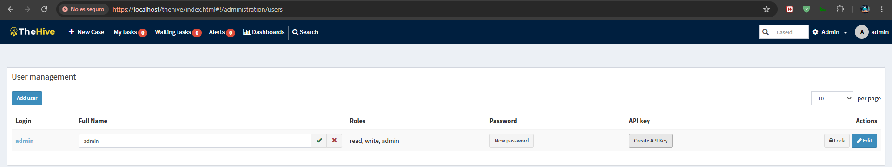

**IMPORTANTE**: Guardar esta API key, se necesitará para configurar Shuffle.

**5. Configurar Webhook en TheHive:**

1. Editar `application.conf` de TheHive:

```bash
docker exec -it soar_thehive bash
vi /etc/thehive/application.conf
```

2. Agregar configuración de webhook:

```hocon
webhook {
 url = "http://shuffle-backend:5001/api/v1/hooks/<workflow_id>"
}
```

3. Configurar notificaciones en TheHive: Ir a **Admin** > **Webhooks**, crear nuevo webhook apuntando a Shuffle,
 seleccionar eventos (Case created, Alert created, Case updated).

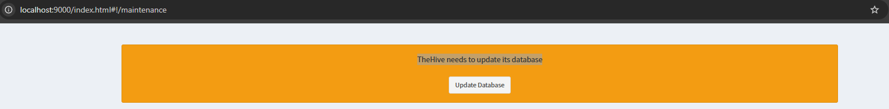

4. Reiniciar TheHive:

```bash
docker restart soar_thehive
```

#### 3.2.5 Paso 5: configuración de Cortex

**Sitio Oficial**: [Cortex Project](https://thehive-project.org/cortex)
**Documentación**: [Cortex Documentation](https://docs.strangebee.com/cortex/)
**GitHub**: [TheHive-Project/Cortex](https://github.com/TheHive-Project/Cortex)

**1. Acceder a Cortex:**
Similar a TheHive, el primer paso es acceder a la interfaz web de Cortex para realizar la configuración inicial.
URL: https://soar.local/cortex/ o http://localhost:8101/

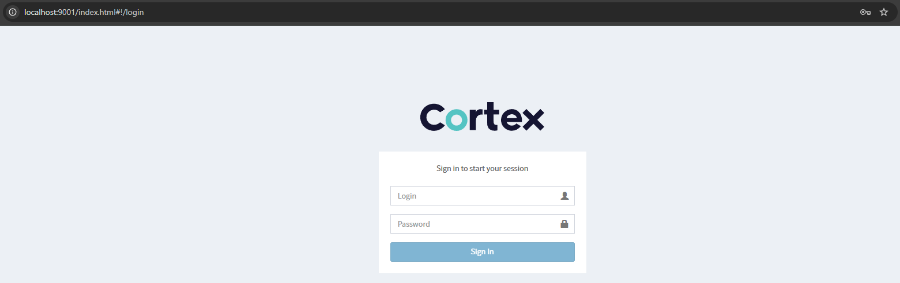

**2. Credenciales de Admin:**

El usuario administrador se crea automáticamente durante el despliegue con `reset_cortex.py`:

- Usuario: `admin`
- Contraseña: generada por `reset_cortex.py` (consultar los logs del contenedor `soar_api` o `.env.full` si el script la guarda)
- API key: `CORTEX_API_KEY` en `.env.full`

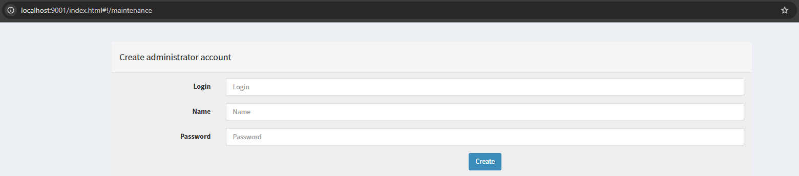

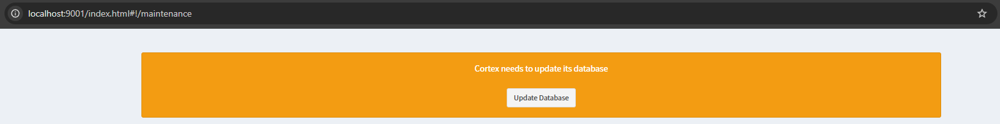

**3. Crear Organización:**

1. Ir a **Organizations**
2. Click en **New Organization**
3. Nombre: `SOAR Lab`
4. Descripción: `Laboratorio SOAR para ransomware`

**4. Configurar Analyzers:**

1. Ir a **Organization** > **Analyzers**
2. Verificar que analyzers como `VirusTotal_3`, `MISP_Search`, `IPInfo` estén habilitados

**5. Generar API key:**

1. Ir a tu perfil
2. Click en **API keys**
3. Click en **Create a new API key**
4. Copiar la API key

**6. Configurar Analyzers Adicionales:**
Analyzers recomendados:

- Shodan (para IPs y puertos abiertos)

- Hybrid Analysis (para análisis de malware)

- AlienVault OTX (para threat intelligence)

- Have I Been Pwned (para credenciales comprometidas)
 - Requiere API key de HIBP
 - Verifica si emails/contraseñas han sido comprometidos
 - Referencia: [Have I Been Pwned](https://haveibeenpwned.com/)

**Configuración de Analyzers:**

1. Ir a **Organization** > **Analyzers**
2. Buscar el analyzer deseado
3. Click en **Enable**
4. Configurar la API key requerida
5. Click en **Test** para verificar conexión

**Referencia**: [Cortex Analyzers Documentation](https://docs.strangebee.com/cortex/analyzer-tutorial/)

#### 3.2.6 Paso 6: configuración de Shuffle

**Sitio Oficial**: [Shuffle SOAR](https://shuffler.io/)
**Documentación**: [Shuffle Documentation](https://shuffler.io/docs)
**GitHub**: [Shuffle/Shuffle](https://github.com/Shuffle/Shuffle)
**Apps**: [Shuffle/openapi-apps](https://github.com/Shuffle/openapi-apps)

Shuffle es la plataforma de automatización de orquestación SOAR del laboratorio. Permite crear workflows que conectan
diferentes servicios y automatizan la respuesta a incidentes. Esta sección configura Shuffle y sus componentes
principales.

**1. Acceder a Shuffle:**
El primer paso es acceder a la interfaz web de Shuffle para realizar la configuración inicial del usuario y
organización.
URL: http://localhost:8081/


**2. Crear Usuario Admin:**
Si es el primer acceso a Shuffle, debes crear un usuario administrador. Las credenciales predeterminadas se pueden
modificar en el archivo `.env.full` antes del despliegue.

Si es el primer acceso:

- Usuario: `admin`
- Contraseña: `<SHUFFLE_DEFAULT_PASSWORD>` (configurado en .env.full)

**CAPTURA:** Screenshot de la página de login de Shuffle con credenciales ingresadas.

**3. Crear Organización:**
Las organizaciones en Shuffle permiten agrupar workflows, apps y configuraciones. Crear una organización específica para
el laboratorio SOAR facilita la gestión de los workflows de ransomware.

1. Ir a **Organizations**
2. Click en **New Organization**
3. Nombre: `SOAR Lab`
4. Descripción: `Laboratorio SOAR para ransomware`

**CAPTURA:** Screenshot del formulario de creación de organización en Shuffle.

**4. Verificar Networking de Workers:**
El network-watcher es un servicio que conecta automáticamente los workers de Shuffle a la red Docker `soar_net`.
Esto es crucial para que los workers puedan comunicarse con otros servicios del laboratorio. Verificar que esté
funcionando correctamente:

```bash
docker network inspect soar_net
```

**CAPTURA:** Screenshot de la salida de
`docker network inspect soar_net` mostrando los contenedores conectados.

**5. Generar API key:**
La API key de Shuffle es necesaria para autenticar requests a la API de Shuffle, especialmente para ejecutar workflows
vía webhook. Esta clave debe guardarse de forma segura.

1. Ir a tu perfil
2. Click en **API keys**
3. Click en **Create new API key**
4. Nombre: `SOAR Lab Key`
5. Copiar la API key

**CAPTURA:** Screenshot de la sección de API keys en Shuffle.

#### 3.2.7 Paso 7: registro de apps en Shuffle

Shuffle utiliza apps para conectarse con diferentes servicios. Esta sección configura las apps de TheHive, Cortex, MISP
y Elasticsearch para que Shuffle pueda interactuar con estos servicios.

**1. Registrar App TheHive:**
TheHive es una de las apps principales que Shuffle utilizará para crear casos y alertas. Debe descargarse y configurarse
con las credenciales generadas anteriormente.

1. Ir a **Apps** en Shuffle
2. Buscar **TheHive** en el buscador
3. Click en **TheHive** app
4. Click en **Download/Install**

**CAPTURA:** Screenshot de la página de TheHive app en Shuffle mostrando el botón Download/Install.

**2. Configurar Autenticación TheHive:**
Una vez descargada la app, debes configurar la autenticación con la API key y URL de TheHive generadas anteriormente.

1. Después de descargar, click en **Authentication**
2. Configurar:
 - **apikey**: [Pegar la API key de TheHive generada anteriormente]
 - **url**: `http://thehive:9000`
3. Click en **Save**
4. Click en **Test** para verificar conexión

**CAPTURA:** Screenshot del formulario de autenticación de TheHive en Shuffle mostrando los campos configurados.

**CAPTURA:** Screenshot del resultado del test de conexión mostrando "Success".

**3. Registrar App Cortex:**
Similar a TheHive, Cortex debe registrarse para que Shuffle pueda ejecutar analyzers y obtener resultados de análisis.

1. Ir a **Apps**
2. Buscar **Cortex**
3. Click en **Download/Install**
4. Click en **Authentication**
5. Configurar:
 - **apikey**: [Pegar la API key de Cortex generada anteriormente]
 - **url**: `http://cortex:9001`
6. Click en **Save**
7. Click en **Test**

**CAPTURA:** Screenshot del formulario de autenticación de Cortex en Shuffle.

**4. Registrar App MISP:**
MISP es la plataforma de threat intelligence del laboratorio. Registrar esta app permite a Shuffle consultar IoCs y
crear eventos en MISP.

1. Ir a **Apps**
2. Buscar **MISP**
3. Click en **Download/Install**
4. Click en **Authentication**
5. Configurar:
 - **apikey**: [API key de MISP]
 - **url**: `http://misp`
6. Click en **Save**
7. Click en **Test**

**CAPTURA:** Screenshot del formulario de autenticación de MISP en Shuffle.

**Integración Adicional MISP - Shuffle:**

**¿Por qué integrar MISP con Shuffle?**

- MISP es una plataforma de threat intelligence para compartir IoCs
- Shuffle puede consultar MISP para enriquecer alertas con información de amenazas
- Permite crear eventos en MISP desde workflows de Shuffle

**Configuración de Synchronization en MISP:**

1. Acceder a MISP: http://localhost:8083
2. Ir a **Event Actions** > **Automation**
3. Crear nuevo automation rule para enviar eventos a Shuffle:
 - **Trigger**: Cuando se crea un evento
 - **Action**: POST a webhook de Shuffle
 - **Format**: JSON con datos del evento

**Acciones MISP disponibles en Shuffle:**

- **search_attributes**: Buscar IoCs en MISP (IPs, dominios, hashes, emails)
- **create_event**: Crear evento en MISP desde Shuffle
- **add_attribute**: Añadir atributo a un evento existente
- **get_event**: Obtener detalles de un evento

**Caso de uso:**

1. detecta una IP sospechosa
2. Shuffle recibe la alerta vía webhook
3. Shuffle consulta MISP con la IP
4. MISP devuelve información de amenazas asociadas
5. Shuffle decide si crear caso en TheHive basándose en la reputación

**Referencia**: [MISP Documentation](https://www.misp-project.org/documentation/)

**5. Registrar App Elasticsearch:**
Elasticsearch se utiliza para indexar datos de incidentes y ejecuciones (índices `soar-alerts` y `soar-metrics`).
Registrar esta app permite a Shuffle indexar alertas y métricas en Elasticsearch. El backend interno de Shuffle
utiliza OpenSearch, no Elasticsearch.

1. Ir a **Apps**
2. Buscar **Elasticsearch**
3. Click en **Download/Install**
4. Click en **Authentication**
5. Configurar:
 - **username**: `elastic`
 - **password**: [Contraseña de Elasticsearch de .env.full]
 - **url**: `http://elasticsearch:9200`
6. Click en **Save**
7. Click en **Test**

**CAPTURA:** Screenshot del formulario de autenticación de Elasticsearch en Shuffle.

#### 3.2.8 Paso 8: creación de workflows

Los workflows en Shuffle definen la lógica de automatización para responder a incidentes. Esta sección crea un workflow
de respuesta a ransomware que integra TheHive, Cortex y Elasticsearch.

**1. Crear Workflow de Respuesta a Ransomware:**
El primer paso es crear un nuevo workflow en Shuffle que orquestará la respuesta automatizada a incidentes de
ransomware.

1. Ir a **Workflows** en Shuffle
2. Click en **New Workflow**
3. Nombre: `Ransomware Response`
4. Descripción: `Workflow automatizado para respuesta a incidentes de ransomware`

**CAPTURA:** Screenshot del formulario de creación de workflow en Shuffle.

**2. Configurar Trigger Webhook:**
El trigger webhook permite que el workflow se inicie cuando se reciba una solicitud HTTP externa, como una alerta de
 o cualquier otro sistema.

1. En el panel izquierdo, buscar **Triggers**
2. Arrastrar **Webhook** al canvas
3. Click en el trigger webhook
4. Nombre: `Ransomware Alert`
5. Guardar

**CAPTURA:** Screenshot del canvas de workflow mostrando el trigger webhook.

**3. Agregar Acción: Crear Caso en TheHive:**
Esta acción crea un caso en TheHive cuando el workflow se ejecuta, permitiendo documentar y gestionar el incidente de
ransomware.

1. En el panel izquierdo, buscar **TheHive** app
2. Arrastrar acción **create_case** al canvas
3. Conectar el webhook a la acción
4. Configurar la acción:
 - **title**: `$exec.alert_id` - Ransomware Detection
 - **description**: `$exec.description`
 - **severity**: `$exec.severity`
 - **tags**: `ransomware,automated`
 - **tlp**: 2 (Amber)
 - **pap**: 2 (Amber)

**CAPTURA:** Screenshot de la configuración de la acción create_case de TheHive.

**4. Agregar Acción: Analizar IoCs con Cortex:**
Esta acción utiliza Cortex para analizar observables (como hashes) con analyzers como VirusTotal, proporcionando
información adicional sobre el malware.

1. Buscar **Cortex** app
2. Arrastrar acción **run_analyzer** al canvas
3. Conectar la acción anterior a esta
4. Configurar:
 - **analyzer**: `VirusTotal_3`
 - **data**: `$exec.hash`
 - **datatype**: `hash`

**CAPTURA:** Screenshot de la configuración de la acción run_analyzer de Cortex.

**5. Agregar Acción: Indexar en Elasticsearch:**
Esta acción indexa los datos del incidente en Elasticsearch para su posterior análisis y consulta.

1. Buscar **Elasticsearch** app
2. Arrastrar acción **create_index** al canvas
3. Conectar la acción anterior a esta
4. Configurar:
 - **index**: `ransomware-alerts`
 - **document**: JSON con todos los datos del incidente

**CAPTURA:** Screenshot de la configuración de la acción create_index de Elasticsearch.

**6. Guardar y Activar Workflow:**
Una vez configuradas todas las acciones, es necesario guardar el workflow y activarlo para que el webhook esté
disponible para recibir solicitudes.

1. Click en **Save** (icono de disquete)
2. Click en **Start** para activar el webhook

**CAPTURA:** Screenshot del workflow completo mostrando todas las acciones conectadas.

**7. Obtener URL del Webhook:**
La URL del webhook es necesaria para que sistemas externos puedan enviar alertas al workflow.

1. Click en el trigger webhook
2. Copiar la **Webhook URL**

**CAPTURA:** Screenshot mostrando la Webhook URL del trigger.

#### 3.2.9 Paso 9: configuración de MISP

**Sitio Oficial**: [MISP Project](https://www.misp-project.org/)
**Documentación**: [MISP Documentation](https://www.misp-project.org/documentation/)
**GitHub**: [MISP/MISP](https://github.com/MISP/MISP)

MISP es la plataforma de threat intelligence del laboratorio. Permite compartir y consultar IoCs para enriquecer la
respuesta a incidentes. Esta sección configura MISP para su integración con Shuffle.

**1. Acceder a MISP:**
El primer paso es acceder a la interfaz web de MISP para realizar la configuración inicial.
URL: http://localhost:8083/

*MISP login no tiene captura disponible*

**2. Credenciales de Admin:**
El usuario administrador se configura durante el despliegue desde `.env.full`:

- Usuario: `admin@soar.local`
- Contraseña: `<MISP_ADMIN_PASSWORD>`
- Cambiar contraseña al primer login

**CAPTURA:** Screenshot del formulario de cambio de contraseña de MISP.

**3. Generar Auth Key:**
La Auth Key es necesaria para que Shuffle pueda autenticarse con MISP y realizar acciones como consultar IoCs y crear
eventos. Esta clave debe guardarse de forma segura.

1. Ir a **Event Actions** > **Automation**
2. Click en **New Auth Key**
3. Copiar el Auth Key

**CAPTURA:** Screenshot de la sección de Auth Keys en MISP.

#### 3.2.10 Paso 10: pruebas end-to-end

Esta sección verifica que toda la integración del laboratorio SOAR esté funcionando correctamente. Se realizan pruebas
para asegurar que los workflows se ejecuten y que los servicios se comuniquen adecuadamente.

**1. Enviar Alerta de Prueba:**
El script Python envía una alerta de prueba al webhook de Shuffle para iniciar el workflow de respuesta a ransomware.

Usar el script Python:

```bash
python src/soar_lab/simulator/simulate_alerts.py --type malicious --single
```

**CAPTURA:** Screenshot de la salida del script mostrando el webhook enviado y el worker creado en soar_net.

**2. Verificar Ejecución en Shuffle:**
Después de enviar la alerta de prueba, es importante verificar que el workflow se haya ejecutado correctamente en
Shuffle.

1. Ir a **Workflows** en Shuffle
2. Click en el workflow `Ransomware Response`
3. Click en **Executions**
4. Ver la ejecución más reciente

**CAPTURA:** Screenshot de la ejecución del workflow mostrando el estado y resultados.

**3. Verificar Caso en TheHive:**
Es importante verificar que el workflow haya creado correctamente el caso en TheHive con los datos de la alerta.

1. Ir a TheHive en http://localhost:8100
2. Verificar que se creó el caso

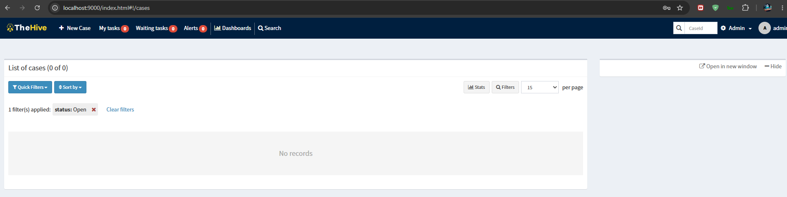

**4. Verificar Análisis en Cortex:**
Verifica que el workflow haya ejecutado el analyzer en Cortex y que los resultados estén disponibles.

1. Ir a Cortex en http://localhost:8101
2. Verificar el análisis del hash


**5. Verificar Datos en Elasticsearch:**
Finalmente, verifica que los datos del incidente se hayan indexado correctamente en Elasticsearch para su posterior
análisis.

```bash
curl -u elastic:<ELASTIC_PASSWORD> http://localhost:8200/ransomware-alerts/_search
```

**CAPTURA:** Screenshot de la respuesta de Elasticsearch mostrando los datos indexados.

#### 3.3 Verificación de configuración

#### 3.3.1 Resumen de URLs de acceso

Esta tabla resume todas las URLs de acceso a los servicios del laboratorio SOAR, incluyendo rutas de navegación
específicas y credenciales.

**Web Management UI**: `http://localhost:8085` (acceso directo) o `https://soar.local` a través de Nginx.

| Servicio | URL directa | Vía Nginx `https://soar.local` | Credenciales | Notas |
|----------|-------------|-------------------------------|--------------|-------|
| **Web Management** | `http://localhost:8085/` | `/` | `WEB_UI_USER` / `WEB_UI_PASSWORD` | SPA principal del panel de operación |
| **SOAR API** | `http://localhost:8000/` | `/api/` | JWT Bearer (`/auth/login`) | `/docs` y `/openapi.json` |
| **Shuffle UI** | `http://localhost:8081/` | No soportado | `SHUFFLE_DEFAULT_USERNAME` / `SHUFFLE_DEFAULT_PASSWORD` | SPA con rutas absolutas; acceso directo obligatorio |
| **Shuffle API** | `http://localhost:5001/` | `/shuffle-api/` | `SHUFFLE_DEFAULT_APIKEY` | Base URL interna: `http://shuffle-backend:5001` |
| **TheHive** | `http://localhost:8100/` | `/thehive/` | admin / contraseña generada por `init_thehive.py` (ver logs) | API key: `THEHIVE_API_KEY` |
| **Cortex** | `http://localhost:8101/` | `/cortex/` | admin / contraseña generada por `reset_cortex.py` (ver logs) | API key: `CORTEX_API_KEY` |
| **MISP** | `http://localhost:8083/` | No soportado | `MISP_ADMIN_EMAIL` / `MISP_ADMIN_PASSWORD` | Acceso directo obligatorio |
| **Grafana** | `http://localhost:8084/` | No soportado | admin / `GRAFANA_ADMIN_PASSWORD` | Datasource Elasticsearch en `soar-metrics` |
| **Docs Site** | `http://localhost:8086/` | No soportado | - | Docusaurus / docs-site |
| **Elasticsearch** | `http://localhost:8200/` | No expuesto | `elastic` / `ELASTIC_PASSWORD` | Interno `http://elasticsearch:9200` |
| **Nginx Health** | - | `/nginx-health` | - | Healthcheck del proxy |

> Los valores `admin`, `elastic` y los nombres de servicio se toman de `.env.example`. Todos los secretos se generan ejecutando
> `make generate-secrets` (`scripts/setup/generate_env.py`). Revisar `.env.full` para las credenciales vigentes.

#### 3.3.2 Archivos de entorno y sincronía de credenciales

| Archivo | Propósito | ¿Se versiona? | Notas |
|---------|-----------|---------------|-------|
| `.env.example` | Plantilla con marcadores y valores por defecto saneados | Sí | No contiene secretos reales; se usa como base para `make generate-secrets`. |
| `.env.full` | Archivo efectivo de configuración del stack | No (`.gitignore`) | Generado con `make generate-secrets`. Los comandos `docker compose` manuales lo cargan con `--env-file .env.full`. |
| `.env` | Copia local generada por `make up` desde `.env.full` | No (`.gitignore`) | El Makefile usa `--env-file .env` (no `.env.full` directamente). Se genera en el paso [3/19] del `make up` con paths absolutos resueltos. |
| `docker/.env` | **No se usa** en el proyecto | Depende | Si existiera, podría ser leído por `docker compose` al ejecutarse sin `--env-file`. Los ejemplos manuales incluyen siempre `--env-file .env.full` para evitar confusiones. |

**Sincronía de la API key de Shuffle:**

- `init_shuffle_webhook.py` crea el usuario admin y la API key de Shuffle y la indexa en OpenSearch (`users_<org>`).
- Tras `make reset` se genera una nueva API key, por lo que `SHUFFLE_DEFAULT_APIKEY` de `.env.full` puede quedar desactualizada.
- El `ShuffleClient` implementa `_fetch_real_apikey` para leer la clave actual desde OpenSearch en runtime (self-heal).
- Para evitar inconsistencias, se recomienda actualizar `SHUFFLE_DEFAULT_APIKEY` en `.env.full` tras cada `make reset` (o verificar que los tests usan el self-heal).
- El archivo `reports/validation/results/webhook_info.json` generado por `init_shuffle_webhook.py` contiene:
 - `webhook_url`: URL interna Docker (`http://shuffle-backend:5001/api/v1/hooks/...`) para uso desde contenedores.
 - `webhook_url_host`: URL accesible desde el host (`http://localhost:5001/api/v1/hooks/...`) para pruebas manuales externas.

#### 3.3.3 Scripts de automatización

Los scripts de inicialización y workflow están en:

- `scripts/setup/` — inicialización de secretos, certificados, servicios y webhooks.
- `scripts/maintenance/` — limpieza y mantenimiento de ejecuciones de Shuffle.

Scripts principales:

- `scripts/setup/generate_secrets.py` — Genera contraseñas y tokens.
- `scripts/setup/init_shuffle_webhook.py` — Crea/actualiza el workflow de ransomware y el webhook.
- `scripts/setup/init_thehive.py` — Inicializa índices y usuario admin de TheHive.
- `scripts/setup/reset_cortex.py` — Reinicia índice y admin de Cortex.
- `scripts/setup/preserve_credentials.py` / `restore_credentials.py` — Guardan/restauran credenciales tras `make reset`.
- `scripts/maintenance/clean_shuffle_executions.py` — Limpia ejecuciones stale de Shuffle.

> Muchos scripts de inicialización se ejecutan automáticamente durante `make up`; solo es necesario ejecutarlos manualmente
> para recuperación o diagnóstico.

#### 3.3.4 Arquitectura de integraciones

**Flujo de Trabajo Típico:**

```
 (SIEM) → Shuffle (SOAR) → TheHive (Case Management)
 ↓
 Cortex (Analysis)
 ↓
 MISP (Threat Intelligence)
 ↓
 Elasticsearch (Logging)
```

**Ejemplo de Workflow de Respuesta a Ransomware:**

```
[Trigger] Webhook
 ↓
[Action] Consultar MISP para verificar reputación de IP/hash
 ↓
[Condition] Si es malicioso:
 ↓
[Action] Analizar con VirusTotal (Cortex)
 ↓
[Action] Crear caso en TheHive
 ↓
[Action] Indexar en Elasticsearch
 ↓
[Action] Notificar analistas por email
```

**Integraciones Configuradas:**

1. ** → Shuffle**: Webhook para alertas de seguridad en tiempo real
2. **Shuffle → MISP**: Consulta de IoCs para enriquecimiento de amenazas
3. **Shuffle → Cortex**: Análisis de malware y observables
4. **Shuffle → TheHive**: Creación de casos y alertas
5. **TheHive → Shuffle**: Notificaciones de eventos vía webhook
6. **Shuffle → Elasticsearch**: Indexación de incidentes para análisis

**Estado Actual de Integraciones:**

| Integración | Componentes | Modo | Estado | Notas |
|---|---|---|---|---|
| Shuffle → TheHive | Shuffle workflow, TheHive API | Creación/actualización de casos | **Implementada** | `THEHIVE_API_KEY` en `.env.full`; app descargada en Shuffle |
| Shuffle → Cortex | Shuffle workflow, Cortex API | Ejecución de analyzers | **Implementada** | `CORTEX_API_KEY`; analyzers con API key externa son opcionales |
| Shuffle → MISP | Shuffle workflow, MISP API | Enriquecimiento y registro de IoCs | **Implementada** | `MISP_API_KEY`; sincronización bidireccional puede requerir ajuste manual |
| Shuffle → Elasticsearch | Shuffle workflow, ES API | Indexado de métricas e incidentes | **Implementada** | Índice `soar-metrics` |
| TheHive → Shuffle | TheHive webhook a Shuffle | Notificación de eventos de caso | **Implementada** | Configurar webhook en `application.conf` / UI |
| Lab API → Elasticsearch / TheHive / Cortex / MISP / | API endpoints, clientes Python | Consulta de estado y KPIs | **Implementada** | Clientes en `src/soar_lab/infrastructure/integrations/` |
| Contención de endpoints | Shuffle workflow, scripts `notify.sh` | Simulada | **Simulada** | No hay agente EDR real; se registran notificaciones y métricas |
| MFA / SSO | — | No operativo | **Planificado** | Autenticación actual: JWT HS256 |
| WAF / mTLS / segmentación real | Nginx | No operativo | **Planificado / No verificado** | Nginx es proxy inverso con certificado autofirmado |
| Alta disponibilidad | Docker Compose | No operativo | **Planificado** | Despliegue single-host |


#### 3.3.5 Validación de tests

**Requisitos:**

- Python `>=3.11` (`pyproject.toml` declara `requires-python = ">=3.11"`).
- pytest con los extras de test (`pip install -e ".[test]"` o `make deps-test`).

**Recolectar casos sin ejecutarlos:**

```bash
python -m pytest --collect-only -q
```

Salida típica (2026-08-21, Windows, Python 3.11.9, pytest 9.0.3):

```text
collected 2233 items / 328 deselected / 1905 selected
```

**Conteos separados:**

- `collected`: total de ítems de prueba encontrados (incluye parametrizaciones).
- `deselected`: ítems filtrados por `-m` (por ejemplo, marcador `slow`).
- `selected`: ítems que finalmente ejecutará pytest.
- `skipped`: pruebas que llaman a `pytest.skip` en runtime por falta de requisitos (Docker, servicios externos, variables no configuradas, ejecución dentro del contenedor).
- `xfail`: fallos esperados; no se usan masivamente en el repo actual pero pueden aparecer en pruebas experimentales.

**Comandos útiles:**

```bash
# Saltar tests lentos
python -m pytest -m "not slow"

# Solo tests que requieren Docker
python -m pytest -m requires_docker

# Solo tests que requieren servicios externos
python -m pytest -m requires_external

# Ejecutar suite completa con cobertura
make test-coverage
```

**Notas sobre plataforma:**

- En Windows ejecutar E2E e integración con Docker Desktop activo y el repo disponible (sin WSL bind mounts problemáticos).
- Algunos tests de Docker se saltan si no se detecta `/var/run/docker.sock` o si se ejecutan dentro del contenedor `soar_api` sin acceso al repo.
- Los conteos exactos dependen del entorno y del estado de `tests/baseline/tests_inventory.json`.

#### 3.3.6 Checklist de verificación post-`make up`

Tras ejecutar `make up` (o el equivalente `docker compose -f ... up -d`), desde la raíz del repositorio:

1. **Estado de los contenedores**
 ```bash
 docker compose ps
 ```
 Todos los servicios deben mostrar `healthy` o `up` (sin `unhealthy`).

2. **Healthcheck de Nginx**
 ```bash
 curl -k -I https://soar.local/nginx-health
 ```
 Debe devolver `HTTP/2 200` o `200 OK`.

3. **Healthcheck de la Lab API**
 ```bash
 curl -sf http://localhost:8000/health | python -m json.tool
 ```

4. **Grafana**
 ```bash
 curl -sf http://localhost:8084/api/health
 ```

5. **Network Watcher**
 ```bash
 curl -sf http://localhost:15130/health
 ```

6. **Logs de inicialización**
 ```bash
 docker logs -f --tail 100 soar_api
 ```
 Buscar mensajes de "Application startup complete" y ausencia de errores de conexión a Elasticsearch o Redis.

7. **Credenciales generadas**
 Verificar que `.env.full` no contiene placeholders `CHANGEME`/`CHANGE_ME` tras `make generate-secrets`:
 ```bash
 grep -iE "CHANGEME|CHANGE_ME|123456|admin/admin" .env.full | | echo "OK"
 ```

8. **Acceso a Shuffle UI**
 - URL: `http://localhost:8081`
 - Usuario: `${SHUFFLE_DEFAULT_USERNAME:-admin}`
 - Contraseña: `${SHUFFLE_DEFAULT_PASSWORD}` (valor de `.env.full`)

9. **Prueba end-to-end mínima**
 ```bash
 python -m pytest tests/e2e/TC-01 -v
 ```
 (requiere Docker y los servicios levantados).

#### 3.3.7 Directorio de trabajo y contexto Docker

- **Raíz del repositorio**: `make up`, `make generate-secrets`, `make test-all` y `docker compose ...` deben ejecutarse desde la raíz del repositorio, donde se encuentran `.env.full`, `Makefile`, `pyproject.toml` y `infra/docker/compose/`.
- **Rutas relativas**: los `Dockerfile` y `docker-compose*.yml` usan rutas relativas a la raíz (por ejemplo `../../../artifacts`, `../config`, `runtime/config/promtail-config.yml`). Si se ejecutan desde otro directorio, los volúmenes y bind mounts fallarán.
- **Renderizado de configs**: `scripts/setup/render_configs.py` lee templates de `infra/docker/config/templates/*.template` y escribe los ficheros renderizados en `runtime/config/` antes de `docker compose up`.
- **Configuración efectiva**: para depurar variables y volúmenes sin levantar contenedores, usar:
 ```bash
 docker compose --env-file .env.full -f infra/docker/compose/docker-compose.yml \
 -f infra/docker/compose/docker-compose.core.yml config | less
 ```

#### 3.3.8 Herramientas de calidad y CI

El entorno de desarrollo usa **Python 3.11+**. Las herramientas y sus versiones se declaran en `pyproject.toml` y se ejecutan en `.github/workflows/ci.yml`:

- **Black** (`>=23.0.0`, `line-length = 100`)
- **isort** (`>=5.12.0`, perfil `black`)
- **flake8** (`>=6.0.0`, dos pasos en CI)
- **mypy** (`>=1.0.0`, `python_version = "3.11"`)
- **pytest** (`>=7.0.0`, con `pytest-asyncio`, `pytest-cov`, `pytest-mock`, `pytest-timeout`)
- **pre-commit** (`>=3.0.0`)

Para ejecutar localmente:

```bash
# Instalar entorno de desarrollo
pip install -e ".[dev]"

# Formatear y ordenar imports
black src/soar_lab
isort src/soar_lab

# Lint
flake8 src/soar_lab --count --select=E9,F63,F7,F82 --show-source --statistics
flake8 src/soar_lab --count --exit-zero --max-complexity=10 --max-line-length=100 --statistics

# Type check
mypy src/soar_lab --ignore-missing-imports

# Tests unitarios con cobertura
pytest tests/unit/ -v --cov=src.soar_lab --cov-report=xml
```

> `make lint` y `make test-all` ejecutan estos pasos agrupados según la plataforma (Linux/macOS/WSL vs Windows).

#### 3.4 Troubleshooting

#### 3.4.1 Workers no se conectan a soar_net

Si los workers de Shuffle no se conectan a la red Docker correcta, las ejecuciones de workflows fallarán. Verificar que
el network-watcher esté funcionando correctamente:

```bash
docker logs soar_network_watcher
```

#### 3.4.2 App TheHive no funciona

Si la app de TheHive no funciona en Shuffle, puede ser un problema de autenticación o configuración. Verificar que la
app esté descargada y autenticada correctamente. Revisar la API key y URL de TheHive.

#### 3.4.3 Workflow se queda en "Step is still running"

Este error indica que un worker no está ejecutando el paso del workflow. Puede ser un problema de networking o de
autenticación de apps. Verificar que el worker esté en la red correcta y que las apps estén autenticadas correctamente.

#### 3.5 Mantenimiento

#### 3.5.1 Backups

El módulo de backups del laboratorio está implementado por tres componentes principales:

- `src/soar_lab/application/use_cases/backup_service.py`: orquesta la creación, listado y restauración de backups.
- `src/soar_lab/infrastructure/filesystem_storage.py`: provee acceso al sistema de archivos, localiza el
 directorio de backups y guarda metadatos.
- `src/soar_lab/infrastructure/tar_backup_driver.py`: encapsula los comandos `tar` para comprimir y extraer.

##### Crear un backup

```bash
make backup
```

Equivalente directo por API:

```bash
curl -sf -X POST http://localhost:8000/backup/create \
 -H "Content-Type: application/json" \
 -d '{"backup_name":"manual-backup.tar.gz"}'
```

El servicio `BackupService.create` genera un archivo `soar_backup_YYYYMMDD_HHMMSS.tar.gz` (el parámetro
`backup_name` se valida, pero el nombre final lleva timestamp). `FilesystemStorage` obtiene la ruta desde la
variable `BACKUP_DIR` (por defecto `runtime/backups` dentro de `BASE_DIR`) y `TarBackupDriver` empaqueta el
contenido de `BASE_DIR` excluyendo:

```text
__pycache__ *.pyc .git node_modules htmlcov .pytest_cache coverage.xml
.coverage artifacts *.tar.gz venv env .env .mypy_cache .tox dist build
.eggs *.egg-info
```

Además, se escribe un archivo `<backup>.metadata.json` con el usuario, timestamp y tamaño.

##### Listar backups

```bash
curl -sf http://localhost:8000/backup/list | python3 -m json.tool
```

`BackupService.list_backups` usa `FilesystemStorage` para leer `BACKUP_DIR` y devuelve nombre, tamaño en MB y
fecha de modificación.

##### Restaurar un backup

```bash
make restore BACKUP=soar_backup_YYYYMMDD_HHMMSS.tar.gz
```

Equivalente directo por API:

```bash
curl -sf -X POST http://localhost:8000/backup/restore \
 -H "Content-Type: application/json" \
 -d '{"backup_name":"soar_backup_YYYYMMDD_HHMMSS.tar.gz"}'
```

`BackupService.restore` localiza el archivo en `BACKUP_DIR`, `TarBackupDriver.extract` lo descomprime en
`BASE_DIR` con `--skip-old-files` para no sobrescriber versiones más recientes, y `FilesystemStorage` registra
la operación en `restore_operations.log`.

##### Consideraciones de persistencia

- `BACKUP_DIR` se configura en `.env.full`; el valor por defecto es `runtime/backups` relativo a `BASE_DIR`.
- El directorio `runtime/backups` debe persistir fuera del contenedor (bind mount de `artifacts` en Compose) o
 sincronizarse con el host para que los backups sobrevivan a `docker compose down -v`.
- El backup de archivos **no** incluye los volúmenes Docker de datos de Elasticsearch, MISP, TheHive,
 Cortex o Grafana. Para esos datos usar snapshots de volumen o los mecanismos nativos de cada servicio.
- `BACKUP_RETENTION_DAYS` define la política de retención; limpiar archivos antiguos periódicamente o programar un
 job externo que use `find runtime/backups -name 'soar_backup_*.tar.gz' -mtime +$BACKUP_RETENTION_DAYS -delete`.
- `.env.full` no se elimina durante `make reset`, pero mantener una copia adicional fuera del repositorio como
 salvaguarda.

#### 3.5.2 Actualizaciones

Mantener las imágenes Docker actualizadas:

```bash
docker compose pull
docker compose up -d
```

#### 3.5.3 Monitoreo

Verificar el estado de servicios regularmente:

```bash
docker ps
docker logs soar_thehive
docker logs soar_cortex
docker logs soar_shuffle_backend
```

### 3.2 Infraestructura

#### 1. Resumen

#### 1.1 Objetivo

Este documento describe la organización de la infraestructura como código del SOAR Ransomware Lab, incluyendo la estructura de `infra/`, el uso de los archivos Docker Compose, la ubicación de configuraciones y scripts.

#### 1.2 Contexto

La infraestructura del laboratorio se gestiona mediante Docker Compose. Tras la refactorización hacia arquitectura hexagonal, la carpeta `infra/` se ha reorganizado para separar claramente configuraciones, imágenes Docker personalizadas y archivos compose.

---

#### 2. Estructura de `infra/`

```
infra/
├── docker/ # Infraestructura Docker
│ ├── compose/ # Archivos Docker Compose
│ │ ├── docker-compose.yml # Orquestador principal (redes, volúmenes, Elasticsearch)
│ │ ├── docker-compose.core.yml # Redis, TheHive, Cortex, Shuffle
│ │ ├── docker-compose.misp.yml # MISP threat intelligence
│ │ ├── docker-compose.opensearch.yml # Stack OpenSearch adicional
│ │ ├── docker-compose.api.yml # API, docs-site, web-management, nginx
│ │ └── logging/ # Loki, Promtail, Grafana
│ │ └── docker-compose.logging.yml
│ ├── config/ # Configuraciones centralizadas
│ │ ├── nginx/ # nginx.conf y certificados SSL
│ │ └── templates/ # Plantillas (.template) de Cortex, TheHive, Grafana, Promtail
│ ├── cortex-analyzers/ # Analyzers personalizados de Cortex
│ └── images/ # Dockerfiles personalizados
│   ├── cortex/
│   │ └── Dockerfile # Imagen de Cortex con dependencias Python
│   └── orborus/
│     └── Dockerfile # Imagen personalizada de Orborus
```

---

#### 3. Archivos Docker Compose

#### 3.1 Comandos de uso

El despliegue recomendado utiliza el `Makefile`:

```bash
# Iniciar todo el stack (incluye logging)
make up

# Detener todo el stack
make down

# Reiniciar
make down && make up
```

Para despliegue manual, los archivos deben especificarse en orden:

```bash
docker compose \
 --env-file .env.full \
 -f infra/docker/compose/docker-compose.yml \
 -f infra/docker/compose/docker-compose.core.yml \
 -f infra/docker/compose/docker-compose.misp.yml \
 -f infra/docker/compose/docker-compose.opensearch.yml \
 -f infra/docker/compose/docker-compose.api.yml \
 -f infra/docker/compose/logging/docker-compose.logging.yml \
 up -d
```

#### 3.2 Perfiles de despliegue

| Compose file | Propósito | Servicios principales |
|---|---|---|
| `infra/docker/compose/docker-compose.yml` | Orquestador base | Redes, volúmenes, `elasticsearch` |
| `infra/docker/compose/docker-compose.core.yml` | Core SOAR | `redis`, `thehive`, `cortex`, `shuffle-frontend`, `shuffle-backend`, `orborus`, `network-watcher`, `tenzir-node` |
| `infra/docker/compose/docker-compose.misp.yml` | Inteligencia de amenazas | `misp-db`, `misp-modules`, `misp` |
| `infra/docker/compose/docker-compose.api.yml` | API y aplicaciones | `api`, `docs-site`, `web-management`, `nginx` |
| `infra/docker/compose/logging/docker-compose.logging.yml` | Observabilidad | `grafana-db`, `grafana`, `loki`, `promtail` |
| `infra/docker/compose/docker-compose.opensearch.yml` | OpenSearch adicional (no se despliega por defecto) | `opensearch`, `opensearch-dashboards` |

---

#### 4. Redes y puertos

##### 4.1 Redes Docker

El laboratorio define varias redes internas para segmentar el tráfico. Aunque el proyecto no usa el campo `profiles:` de Docker Compose, algunas redes y servicios solo se activan si se incluyen los archivos compose correspondientes. `make up` los incluye todos por defecto.

| Red | CIDR | Tipo | Servicios principales | Propósito |
|---|---|---|---|---|
| `soar_net` | `10.100.0.0/16` | bridge | Todos los servicios salvo `grafana-db` | Red principal del laboratorio |
| `logging_net` | `172.23.0.0/16` | bridge | `grafana-db`, `grafana`, `loki`, `promtail`, `nginx` | Observabilidad (declarada en `docker-compose.yml` y referenciada en `logging/docker-compose.logging.yml`) |
| `ti_net` | `172.22.0.0/16` | `internal: true` | `elasticsearch`, `redis`, `api`, `shuffle-backend`, `shuffle-frontend` | Inteligencia de amenazas (sin salida a Internet) |
| `bridge` | — | `external: true` | Ninguno directamente | Red por defecto de Docker; declarada por compatibilidad |

`Promtail` está en `soar_net` y `logging_net` para descubrir todos los contenedores y enviar logs a Loki.
Grafana se conecta a `logging_net` y `soar_net` para poder consultar `elasticsearch:9200` y Loki.

> **Nota sobre `ti_net`:** al ser `internal: true`, los contenedores en esta red no tienen salida a Internet. Solo se comunican entre sí y con `soar_net` a través de contenedores que están en ambas.
> **Nota sobre `logging_net`:** `docker-compose.logging.yml` la declara como `external: true` para permitir ejecuciones parciales, pero en un despliegue completo con `make up` la red se crea en el compose base (`docker-compose.yml`).

##### 4.2 Puertos de acceso

| Servicio | Puerto host | Acceso directo | Vía Nginx (`https://soar.local`) |
|----------|-------------|----------------|-----------------------------------|
| Nginx HTTP→HTTPS | 80 | `http://localhost` | — |
| Nginx HTTPS | 443 | `https://localhost` | — |
| Web Management | 8085 | `http://localhost:8085` | `/` |
| SOAR API | 8000 | `http://localhost:8000` (Swagger en `http://localhost:8000/docs`) | `/api/` — Swagger vía Nginx: `https://soar.local/api/docs` y `https://soar.local/api/openapi.json`. No usar `https://soar.local:8000/docs` (Nginx no escucha en 8000). |
| Shuffle UI | 8081 | `http://localhost:8081` | No soportado (SPA con rutas absolutas) |
| MISP | 8083 | `http://localhost:8083` | No soportado |
| Grafana | 8084 | `http://localhost:8084` | No soportado |
| Docs Site | 8086 | `http://localhost:8086` | No soportado |
| TheHive | 8100 | `http://localhost:8100` | `/thehive/` |
| Cortex | 8101 | `http://localhost:8101` | `/cortex/` |
| Elasticsearch | 8200 | `http://localhost:8200` | No expuesto |
| OpenSearch Dashboards | 8202 | `https://localhost:8202` | No soportado |

##### 4.3 Nginx como gateway SSL

Nginx escucha en `80` y `443` y actúa como proxy inverso. Los certificados SSL se encuentran en
`infra/docker/config/nginx/ssl/`:

- `soar.local.crt` — Certificado autofirmado.
- `soar.local.key` — Clave privada.

Para evitar advertencias de seguridad en el navegador, importar `soar.local.crt` como autoridad de confianza.
Nginx redirige HTTP a HTTPS y, bajo `443`, enruta los siguientes subpaths:

| Subpath | Backend | Notas |
|---|---|---|
| `/` | `web-management:80` | SPA principal del panel de operación |
| `/api/` | `soar_api:8000` | API REST/SOAR; añade headers CORS |
| `/thehive/` | `soar_thehive:9000` | Proxy con reescritura de path |
| `/cortex/` | `soar_cortex:9001` | Proxy con reescritura de path |
| `/shuffle-api/` | `shuffle-backend:5001` | Endpoint de webhooks y API de Shuffle |
| `/nginx-health` | — | Healthcheck de Nginx |

Servicios con SPA o assets absolutos **no se sirven por subpath** y requieren acceso directo: Shuffle UI (`8081`), MISP (`8083`), Grafana (`8084`), Docs Site (`8086`) Dashboard (`8202`).

> Requisito DNS: el dominio `soar.local` debe resolverse a `127.0.0.1`. En Windows, editar `C:\Windows\System32\drivers\etc\hosts` como administrador.

**Configuración clave de Nginx:**

- Archivo canónico: `infra/docker/config/nginx/nginx.conf`.
- `server_name` por defecto: `soar.local`.
- Redirige HTTP (`80`) a HTTPS (`443`).
- Proxing de WebSockets: el bloque de `/api/` incluye `proxy_set_header Upgrade $http_upgrade;` y `proxy_set_header Connection "upgrade";` para `/ws/logs`.

**Validación básica:**

```bash
# Validar sintaxis del nginx.conf dentro del contenedor
docker exec soar_nginx nginx -t

# Verificar que el puerto 443 responde en soar.local
curl -k -I https://soar.local/nginx-health
```

> **Nota:** Nginx es un proxy inverso con terminación TLS, no un WAF completo. Protecciones adicionales (rate limiting avanzado, WAF, mTLS) están fuera del alcance de este despliegue de laboratorio y deben considerarse como trabajo futuro.

#### 4.4 Diagramas de arquitectura

Los siguientes diagramas Mermaid resumen el contexto, los contenedores Docker y el flujo de una alerta.

#### Diagrama de contexto

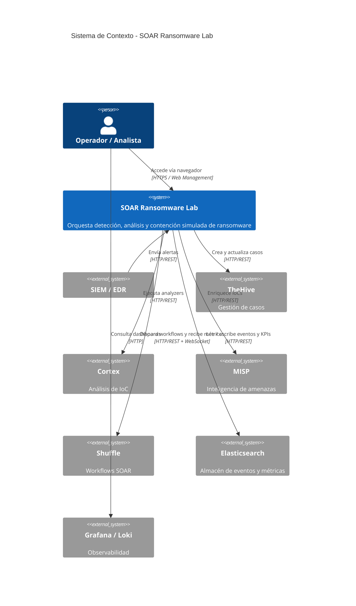

#### Diagrama de contenedores Docker

```mermaid
graph TB
 subgraph host["Host / Docker Desktop"]
 operator["Operador / Navegador"]
 end

 subgraph nginx_net["Nginx / Edge"]
 nginx["nginx\n:80 / :443"]
 end

 subgraph soar_net["soar_net"]
 api["soar_api\nLab API :8000"]
 webmgmt["web-management\n:8085"]
 shuffle_fe["shuffle-frontend\n:8081"]
 shuffle_be["shuffle-backend\n:5001"]
 thehive["soar_thehive\n:9000"]
 cortex["soar_cortex\n:9001"]
 misp["misp\n:8083"]
 redis["redis\n:6379"]
 nw["network-watcher"]
 sim["simulate_alerts"]
 end

 subgraph ti_net["ti_net"]
 es["elasticsearch\n:9200"]
 end

 subgraph logging_net["logging_net"]
 grafana["grafana\n:8084"]
 loki["loki"]
 promtail["promtail"]
 end

 end

 operator -->|"https://soar.local"| nginx
 nginx -->|"/"| webmgmt
 nginx -->|"/api/"| api
 nginx -->|"/thehive/"| thehive
 nginx -->|"/cortex/"| cortex
 nginx -->|"/shuffle-api/"| shuffle_be
 operator -->|":8081 directo"| shuffle_fe
 operator -->|":8083 directo"| misp
 operator -->|":8084 directo"| grafana
 operator -->|":8086 directo"| docs_site
 api --> es
 api --> thehive
 api --> cortex
 api --> misp
 api --> shuffle_be
 shuffle_be --> redis
 sim -->|"webhook"| shuffle_be
 promtail -->|"logs"| loki
 grafana -->|"queries"| loki
 grafana -->|"queries"| es
```

#### Flujo de alerta end-to-end

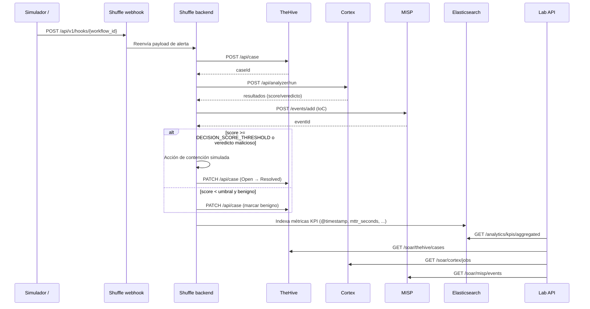

#### 4.5 Volúmenes, healthchecks y DNS interno

#### Volúmenes

El stack usa una combinación de **volúmenes nombrados de Docker** y **bind mounts** bajo `${ARTIFACTS_DIR:-../../../artifacts}`. Los principales son:

| Volumen (named) | Ruta en contenedor | Servicio principal | Notas |
|-----------------|--------------------|--------------------|-------|
| `es_data` | `/usr/share/elasticsearch/data` | `elasticsearch` | Bind mount por defecto |
| `thehive_files` | `/opt/thp/thehive/files` | `thehive` | — |
| `cortex_data` | `/var/lib/cortex` | `cortex` | — |
| `shuffle_apps` | `/shuffle-apps` | `shuffle-backend` | Apps descargadas de la App Exchange |
| `shuffle_files` | `/shuffle-files` | `shuffle-backend` | — |
| `redis_data` | `/data` | `redis` | — |
| `nginx_logs` | `/var/log/nginx` | `nginx` | — |
| `misp_db` | `/var/lib/mysql` | `misp-db` | **Volumen Docker normal** (sin bind mount) para evitar `Permission denied` en Windows |
| `misp_files` | `/var/www/MISP/app/files` | `misp` | — |
| `misp_logs` | `/var/www/MISP/app/tmp/logs` | `misp` | — |
| `grafana_db_data` | `/var/lib/postgresql/data` | `grafana-db` | — |
| `grafana_data` | `/var/lib/grafana` | `grafana` | — |
| `loki_data` | `/var/lib/loki` | `loki` | — |

> `docker compose down -v` elimina los volúmenes Docker normales, **pero no** borra los archivos de un bind mount local. Para una limpieza completa en Windows con `misp_db` antiguo como bind mount, revisar manualmente `runtime/data/misp/db/`.

#### Healthchecks

La mayoría de servicios definen `healthcheck` en Compose. Casos especiales:

- **Loki**: imagen mínima `grafana/loki` sin `curl`/`wget`/`sh`; **no tiene healthcheck** configurado.
- **docs-site**: healthcheck **deshabilitado** temporalmente por un problema de configuración de Docusaurus.
- **shuffle-backend**: usa `healthcheck: disable: true` y expone su propio endpoint de status.
- **shuffle-frontend**: `curl -fsS http://localhost:80`.
- **orborus**: `nc -z shuffle-backend 5001`.
- **network-watcher**: `python -c "import urllib.request; urllib.request.urlopen('http://localhost:8080/health')"`.
- **api**: `python -c "import urllib.request; urllib.request.urlopen('http://localhost:8000/health')"`.
- **thehive/cortex**: `curl` a sus respectivos endpoints de status.

```bash
# Ver estado de salud de todos los contenedores
docker compose ps

# Ver detalle de un healthcheck fallido
docker inspect --format='{{.State.Health.Status}}' soar_<servicio>
```

#### - contraseñas y dependencias

- **Duración del arranque:** tras `make up`, el manager puede requerir 3-5 minutos para aceptar autenticación API.

#### DNS interno y resolución de nombres

- Docker embebido proporciona el resolver `127.0.0.11` dentro de cada contenedor.
- Los servicios en `soar_net` se resuelven directamente por nombre (`elasticsearch`, `redis`, `thehive`, `cortex`, `misp`, `shuffle-backend`, `api`, etc.).
- `network-watcher` inyecta en `/etc/hosts` de los workers las IPs reales de `shuffle-backend`, `elasticsearch`, `thehive` y `misp`.
- Si un contenedor no está en la misma red, no se resolverá por nombre. Ejemplo: `grafana` necesita estar en `soar_net` **y** `logging_net` para consultar `elasticsearch:9200`.

#### 4.6 Orborus, Cortex analyzers y Network Watcher

#### Orborus

- Sin puerto host expuesto; escucha internamente en `5000` dentro de `soar_net`.
- Monta `/var/run/docker.sock` para crear contenedores de workers de Shuffle.
- Variable `SHUFFLE_ORBORUS_EXECUTION_CONCURRENCY: "5"` limita la concurrencia y evita timeouts bajo carga (TC-03).
- Depende de `elasticsearch` y `shuffle-backend` en estado `service_started`.
- Healthcheck: `nc -z shuffle-backend 5001`.

#### Cortex analyzers

- `cortex` se construye desde `infra/docker/images/cortex/Dockerfile` e incluye `cortexutils`.
- Ejecuta analyzers como contenedores Docker adicionales; por ello monta `/var/run/docker.sock`.
- Los analyzers necesitan acceso a `soar_net` y a servicios como `thehive`, `misp`, `elasticsearch`.
- `network-watcher` conecta automáticamente los workers de Shuffle (y por tanto los analyzers invocados desde workflows) a `soar_net` e inyecta hosts.

#### Network Watcher

- Imagen/entrypoint: `src/soar_lab/infrastructure/network_watcher/network_watcher.py`.
- Puerto host `15130` mapeado al contenedor `8080`.
- Funciones principales:
 1. Conectar workers de Shuffle a `soar_net`.
 2. Inyectar `/etc/hosts` con IPs reales de `shuffle-backend`, `elasticsearch`, `thehive`, `misp`.
 3. Reescribir `/etc/resolv.conf` a `127.0.0.11`.
- Operación, logs y recuperación manual en [sección 3.9 Network watcher](#39-network-watcher).

#### 4.7 Verificación post-arranque

Después de `make up` (o el comando `docker compose` equivalente), ejecutar desde la raíz del repositorio:

```bash
# Estado general del stack
make health
# o
docker compose ps

# Healthchecks de borde
curl -k https://soar.local/nginx-health
curl -k https://soar.local/api/health
curl http://localhost:8000/health
curl http://localhost:8084/api/health

# Swagger / OpenAPI de la Lab API
curl -k https://soar.local/api/openapi.json | head -c 200
curl -k https://soar.local/api/docs

# Validar credenciales sincronizadas
make validate-credentials

# Webhook de Shuffle
cat reports/validation/results/webhook_info.json | python -m json.tool

# Comprobar que los logs llegan a Loki
curl http://localhost:8084/api/datasources

# Ver actividad del network-watcher
docker logs -f soar_network_watcher
```

Si `docker compose ps` muestra contenedores `unhealthy`:

1. Consultar logs del servicio: `docker logs <contenedor>`.
2. Revisar dependencias `depends_on` (p. ej. `elasticsearch` debe estar `healthy`).
3. Para workers de Shuffle que no resuelven nombres, reiniciar `soar_network_watcher` y luego el worker.

#### 5. Configuraciones centralizadas

Todas las configuraciones de servicios Docker se han centralizado en `infra/docker/config/`:

- `nginx/` — Configuración de Nginx y certificados SSL (`nginx.conf`, `ssl/`)
- `templates/` — Plantillas de configuración (`cortex.conf.template`, `thehive.conf.template`, `grafana-datasources.yml.template`, `promtail-config.yml.template`)

Los archivos Docker Compose montan estas configuraciones mediante rutas relativas:

```yaml
volumes:
 - ../config/nginx/nginx.conf:/etc/nginx/nginx.conf:ro
 - ../config/cortex.conf:/etc/cortex/application.conf:ro
 - ../config/thehive.conf:/etc/thehive/application.conf:ro
```

---

#### 6. Dockerfiles personalizados

Las imágenes Docker personalizadas se encuentran en varios puntos del repositorio:

- `infra/docker/images/cortex/Dockerfile` — Extiende la imagen oficial de TheHive Cortex (`thehiveproject/cortex:3.2.0-1`) para instalar dependencias Python (`cortexutils`) necesarias para analyzers.
- `src/soar_lab/infrastructure/network_watcher/Dockerfile` — Imagen ligera basada en `python:3.11-alpine` para el `network-watcher`. Instala `socat` y la librería `docker==7.1.0`.
- `apps/api/Dockerfile` — Imagen `python:3.11-slim` que instala el paquete `soar-lab` con dependencias de test, copia `src/`, `tests/` y los documentos estáticos de la aplicación (`api-docs.html` y la carpeta `docs/` desde el componente `apps/api`), y ejecuta la API con `uvicorn` (`soar_lab.interfaces.api.composition:create_app`).
- `apps/docs-site/Dockerfile` — Imagen Node.js basada en `node:lts-alpine` para servir Docusaurus en modo desarrollo (`npm run start`) en el puerto `3000` (mapeado a `8086` en host).
- `apps/web-management/Dockerfile` — Imagen `nginx:1.25-alpine` que sirve los archivos estáticos `index.html`, `styles.css`, `script.js` y `nginx.conf`.

Referencias en compose:

```yaml
services:
 cortex:
 build:
 context: ../images/cortex
 dockerfile: Dockerfile
```

> **Nota:** `network-watcher` se construye desde `src/soar_lab/infrastructure/network_watcher/` (no desde `infra/docker/images/`), ya que su código forma parte del paquete Python. `apps/api` también contiene su propio Dockerfile y se despliega desde `infra/docker/compose/docker-compose.api.yml`.

---

#### 7. Scripts útiles

- `tests/runners/run_e2e_tests.sh` — Ejecuta un test E2E dentro del contenedor `soar_api`.
- `src/soar_lab/infrastructure/network_watcher/` — Código Python para conectar dinámicamente workers de Shuffle a `soar_net`.
- `src/soar_lab/simulator/simulate_alerts.py` — Simulador de alertas SIEM para pruebas.
- `scripts/setup/` — Generación de certificados (`gen_certs.sh`) y secretos (`generate_secrets.py`).
- `scripts/setup/init_shuffle_webhook.py` — Inicialización del webhook de ransomware en Shuffle.
- `scripts/maintenance/` — Limpieza de volúmenes, backups y ejecuciones stale de Shuffle.

---

#### 8. Referencias

- [Arquitectura Docker](02-architecture.md)
- [Arquitectura general](02-architecture.md)
- [Guía de usuario](01-getting-started.md)
- [Manual de configuración](#31-configuración)
- [README principal](../README.md)


### 3.3 Puertos y URLs

#### 1. Resumen

Este documento es la fuente de verdad para los puertos, nombres de contenedor y URLs de acceso del laboratorio. Los valores por defecto se definen en `.env.example` y se pueden sobrescribir en `.env.full`.

Dominio local canónico: `soar.local` → `127.0.0.1` (añadir al archivo hosts, ver [Guía de usuario](01-getting-started.md)).

---

#### 2. Tabla de servicios

| Servicio | Host / Puerto por defecto | Puerto contenedor | Protocolo | URL canónica | Acceso vía Nginx | Nombre de contenedor (`COMPOSE_PROJECT_NAME=soar`) | Notas |
|---------------------------|----------------------------|-------------------|-----------|-------------------------------------------|------------------|----------------------------------------------------|-------|
| Nginx (proxy inverso) | `80` / `443` | `80` / `443` | HTTP/HTTPS| `https://soar.local` | — | `soar_nginx` | Redirige 80→443. Termina TLS con `soar.local.crt`. |
| Web Management | `${WEB_UI_PORT:-8085}` | `80` | HTTP | `http://localhost:8085` | `/` | `soar_web_management` | SPA servida también en raíz por Nginx. |
| Docs Site (Docusaurus) | `${DOCS_PORT:-8086}` | `8080` | HTTP | `http://localhost:8086` | No | `soar_docs_site` | SPA con rutas absolutas; acceso directo. |
| Lab API (FastAPI) | `${API_PORT:-8000}` | `8000` | HTTP | `http://localhost:8000` / `https://soar.local/api/` | `/api/` | `soar_api` | También accesible directo; Nginx añade headers CORS. |
| Shuffle UI | `${SHUFFLE_UI_PORT:-8081}` | `80` | HTTP | `http://localhost:8081` | No | `soar_shuffle_frontend` | React SPA; no soporta subpath. |
| Shuffle Backend | `${SHUFFLE_API_PORT:-5001}`| `5001` | HTTP | `http://localhost:5001` | `/shuffle-api/` | `soar_shuffle_backend` | Webhook de Shuffle apunta al contenedor `shuffle-backend:5001`. |
| Orborus | — | `5000` | HTTP | — | No | `soar_orborus` | Sin puerto host; ejecuta workers dentro de Docker. |
| Network Watcher | `${NETWORK_WATCHER_PORT:-15130}` | `8080` | HTTP | `http://localhost:15130` | No | `soar_network_watcher` | Conecta workers de Shuffle a `soar_net`. |
| Tenzir Node | `15160` / `15140` | `5160` / `1514` | HTTP/Syslog | `http://localhost:15160` | No | `soar_tenzir_node` | `15160` API, `15140` ingest syslog. |
| TheHive | `${THEHIVE_HTTP_PORT:-8100}` | `9000` | HTTP | `http://localhost:8100` | `/thehive/` | `soar_thehive` | Acceso directo recomendado para validación inicial. |
| Cortex | `${CORTEX_HTTP_PORT:-8101}` | `9001` | HTTP | `http://localhost:8101` | `/cortex/` | `soar_cortex` | `/cortex/analyzers` desde Nginx. |
| Elasticsearch | `${ELASTICSEARCH_PORT:-8200}` | `9200` | HTTP | `http://localhost:8200` | No | `soar_elasticsearch` | Usado por TheHive, Cortex, Shuffle, Grafana y . |
| OpenSearch (alternativo) | `${OPENSEARCH_PORT:-8201}` | `9200` | HTTP | `http://localhost:8201` | No | `soar_opensearch` | Compose `docker-compose.opensearch.yml`; no se despliega por defecto. |
| MISP | `${MISP_PORT:-8083}` | `80` | HTTP/HTTPS| `http://localhost:8083` | No | `soar_misp` | MISP no soporta subpath proxy. |
| MISP DB | — | `3306` | SQL | — | No | `soar_misp_db` | MariaDB 10.11; solo red interna. |
| Redis | `${REDIS_PORT:-6379}` | `6379` | Redis | `redis://localhost:6379` | No | `soar_redis` | Requiere `REDIS_PASSWORD` si está configurada. |
| Grafana | `${GRAFANA_PORT:-8084}` | `3000` | HTTP | `http://localhost:8084` | No | `soar_grafana` | Data source Elasticsearch configurado vía provisioning. |
| Grafana DB (PostgreSQL) | — | `5432` | SQL | — | No | `soar_grafana_db` | Solo `logging_net`. |
| Loki | — | `3100` | HTTP | — | No | `soar_loki` | Solo red interna (`logging_net`). |
| Promtail | — | — | HTTP | — | No | `soar_promtail` | Descubre contenedores por socket Docker. |

---

#### 3. Endpoints de la Lab API

La API FastAPI expone los siguientes puertos de entrada principales. Todos se acceden bajo `http://localhost:8000` (directo) o `https://soar.local/api/` (vía Nginx), salvo indicación contraria.

| Método | Ruta | Descripción | Dependencias |
|--------|------|-------------|--------------|
| `POST` | `/auth/login` | Login y generación de JWT | `JWT_SECRET_KEY` |
| `POST` | `/auth/verify` | Verificación de token JWT | `JWT_SECRET_KEY` |
| `GET` | `/health` | Healthcheck de la API | `config_provider` |
| `GET` | `/analytics/metrics` | Métricas del sistema | `SystemMetricsDriver` |
| `GET` | `/analytics/kpis` | KPIs calculados (MTTR, etc.) | `AnalyticsService` / ES |
| `GET` | `/analytics/kpis/aggregated` | KPIs agregados de `soar-metrics` | Elasticsearch |
| `POST` | `/backup/create` | Crear backup `.tar.gz` | `BackupService`, `TarBackupDriver` |
| `POST` | `/backup/restore` | Restaurar backup | `BackupService`, `TarBackupDriver` |
| `GET` | `/backup/list` | Listar backups disponibles | `BackupService` |
| `POST` | `/tests/run` | Ejecutar suite de tests vía `PytestTestRunner` | `pytest`, `.env.full` |
| `GET` | `/services/status` | Estado de todos los servicios SOAR | `HealthService` |
| `GET` | `/soar/thehive/cases` | Listar casos de TheHive | `TheHiveClient` |
| `GET` | `/soar/thehive/health` | Healthcheck de TheHive | `TheHiveClient` |
| `GET` | `/soar/cortex/analyzers` | Listar analyzers de Cortex | `CortexClient` |
| `GET` | `/soar/cortex/health` | Healthcheck de Cortex | `CortexClient` |
| `GET` | `/soar/misp/attributes` | Buscar atributos en MISP | `MISPClient` |
| `GET` | `/soar/misp/health` | Healthcheck de MISP | `MISPClient` |

> **Nota:** La ingestión real de alertas no pasa por la Lab API, sino por el webhook de Shuffle creado por `init_shuffle_webhook.py`.

#### 4. Notas de acceso

- **Nginx** es el punto de entrada recomendado para `https://soar.local`. Expone:
 - `/` → Web Management
 - `/api/` → Lab API
 - `/thehive/` → TheHive
 - `/cortex/` → Cortex
 - `/shuffle-api/` → Shuffle Backend
 - `/nginx-health` → healthcheck de Nginx
- **Swagger / OpenAPI de la Lab API**:
 - Directo (recomendado): `http://localhost:8000/docs` y `http://localhost:8000/openapi.json`.
 - Vía Nginx: `https://soar.local/api/docs` y `https://soar.local/api/openapi.json`.
 - Nota: `https://soar.local:8000/docs` **no es válido** porque Nginx solo escucha en `80` y `443`. El acceso directo usa `localhost:8000`; el acceso por dominio usa `https://soar.local/api/docs`.
 - Si los assets estáticos de Swagger no cargan por subpath, usar la URL directa `http://localhost:8000/docs` o configurar `root_path` en FastAPI.
- **Acceso directo** es necesario para servicios con SPA/assets absolutos o seguridad que no soporta subpath:
 - Shuffle UI (`8081`). Nota: Nginx **no expone** `/shuffle/`; el frontend de Shuffle no soporta subdirectorio sin recompilar. Usa siempre el puerto directo `http://localhost:8081`.
 - MISP (`8083`)
 - Grafana (`8084`)
 - Web Management (`8085`, aunque también está en `/`)
 - Docs Site (`8086`)
 - TheHive (`8100`)
 - Cortex (`8101`)
 - Elasticsearch (`8200`)
- Los **puertos sin mapeo host** solo son alcanzables desde contenedores dentro de `soar_net` o `logging_net`.

---

#### 5. Validación rápida

```bash
# Desde el host
curl -k https://soar.local/nginx-health
curl http://localhost:8000/health
curl http://localhost:8084/api/health

# Desde otro contenedor (por ejemplo, el propio API)
docker exec -it soar_api sh -c 'wget -qO- http://elasticsearch:9200/_cluster/health'
```

---

#### 6. Referencias

- [Guía de instalación](01-getting-started.md)
- [Arquitectura de red y Docker](02-architecture.md)
- [Nginx reverse proxy config](../infra/docker/config/nginx/nginx.conf)
- [`.env.example`](../.env.example)


### 3.4 Gestión web

#### 1. Resumen

`apps/web-management` es el dashboard web central del SOAR Ransomware Lab. Se sirve a través de Nginx en
`https://soar.local` (puertos 80/443) y, de forma directa, en `http://localhost:8085`.

#### 2. Acceso

| Modo | URL | Credenciales |
|---|---|---|
| Via Nginx (recomendado) | `https://soar.local` | `admin` / `WEB_UI_PASSWORD` (`.env.full`) |
| Directo | `http://localhost:${WEB_UI_PORT:-8085}` | `admin` / `WEB_UI_PASSWORD` (`.env.full`) |

> Requisito: tener `soar.local` resuelto a `127.0.0.1` en `/etc/hosts` o `C:\Windows\System32\drivers\etc\hosts`.

El SPA usa rutas relativas (`const API_BASE = '/api'`) para funcionar tanto por puerto directo como detrás de Nginx. Nginx expone el Lab API bajo el subpath `/api/`.

#### 3. Funcionalidades principales

- **Estado de servicios**: tabla con salud de cada contenedor, basada en `GET /services/status` de la API.
- **Métricas del host**: CPU, memoria y disco (`GET /analytics/metrics`).
- **KPIs del laboratorio**: MTTR, detecciones, histogramas (`GET /analytics/kpis` y `GET /analytics/kpis/aggregated`).
- **Tests**: lanzar suites de pruebas desde el navegador (`POST /tests/run`) con categoría `unit`, `integration`, `e2e`, `smoke`, `all`.
- **Backups**: crear (`POST /backup/create`) y restaurar (`POST /backup/restore`) backups con un nombre.
- **Logs en tiempo real**: WebSocket `/ws/logs` que transmite logs del contenedor `soar_api`.
- **Acciones de contención**: registro de acciones simuladas `pending`, `executed`, `failed`.

#### 4. Autenticación y flujo WebSocket

La aplicación web (`apps/web-management/script.js`) implementa un SPA que se autentica contra la Lab API.

#### 4.1 Llamadas a la API

- **Base URL**: `const API_BASE = '/api'` (ruta relativa). Esto funciona cuando el SPA se sirve a través de Nginx (`https://soar.local`), que enruta `/api/` al contenedor `soar_api:8000`.
- **URLs exactas** usadas por el front:
 - Login: `POST /api/auth/login` con `{username, password}`
 - Verificar token: `POST /api/auth/verify` con `Authorization: Bearer <token>`
 - Métricas: `GET /api/analytics/metrics`
 - KPIs: `GET /api/analytics/kpis`
 - Estado de servicios: `GET /api/services/status`
 - Lanzar tests: `POST /api/tests/run`
 - Backups: `POST /api/backup/create`, `POST /api/backup/restore`, `GET /api/backup/list`
- **Acceso directo por `http://localhost:8085`**: Nginx no está en medio, por lo que `/api` no se enruta automáticamente a `soar_api`. Se recomienda acceder a través de `https://soar.local` para que las rutas relativas funcionen correctamente.

#### 4.2 Manejo del token

- Tras un login exitoso, el front almacena `data.token` en `localStorage` como `auth_token`.
- Cada petición a la API incluye la cabecera `Authorization: Bearer <auth_token>` a través de `getAuthHeaders`.
- Al cargar la página, `checkAuthStatus` envía el token a `POST /api/auth/verify`. Si el token es inválido o ha expirado, se elimina de `localStorage` y se vuelve a la pantalla de login.
- `logout` elimina `auth_token` y detiene las actualizaciones periódicas.

#### 4.3 WebSocket de logs (`/ws/logs`)

- **URL construida dinámicamente**:
 ```javascript
 const protocol = window.location.protocol === 'https:' ? 'wss:' : 'ws:';
 const wsUrl = `${protocol}//${window.location.host}/api/ws/logs`;
 ```
- La conexión se abre al pulsar el botón *Start Live Logs* y se cierra al pulsar *Stop Live Logs*.
- `ws.onmessage` recibe entradas JSON del log parser y las añade a la interfaz.
- `ws.onerror` y `ws.onclose` muestran un mensaje de error y resetean el botón a *Start Live Logs*.
- **Reconexión**: actualmente no existe reconexión automática; si el WebSocket se cierra, el usuario debe volver a pulsar *Start Live Logs*. Si se desea reconexión automática, implementar un backoff exponencial en `startWebSocketLogs`.

#### 4.4 Seguridad del front

- El token JWT reside en `localStorage`, por lo que una vulnerabilidad XSS podría comprometer la sesión. El frontend no almacena contraseñas.
- Se recomienda servir siempre la web-management a través de Nginx con HTTPS (`https://soar.local`).

#### 5. Requisitos previos

- Todos los servicios levantados con `make up`.
- La API en `http://localhost:8000` (o por Nginx `https://soar.local/api/`) debe estar saludable.
- Variables `API_AUTH_SECRET`, `WEB_UI_USER` y `WEB_UI_PASSWORD` en `.env.full`.

#### 6. Solución de problemas

| Síntoma | Causa probable | Solución |
|---|---|---|
| `ERR_CONNECTION_REFUSED` en `https://soar.local` | Nginx no arrancó o `soar.local` no está en hosts | `docker compose ps nginx`; añadir `127.0.0.1 soar.local` |
| Login incorrecto | Contraseña distinta a `.env.full` | Actualizar `WEB_UI_PASSWORD` y reiniciar `web-management` |
| Logs vacíos | WebSocket cerrado o API no inyectó `websocket_manager` | Verificar `docker logs soar_api` |
| Tests no devuelven resultado | `test_runner` no disponible o contenedor sin tests | Revisar `pytest` en contenedor `soar_api` |
| Métricas a 0 | `system_metrics` no configurado | Verificar que `psutil` esté instalado y `system_metrics` esté en `CompositionRoot` |

#### 7. Referencias

- [Especificación de APIs](03-api-and-integrations.md)
- [Arquitectura general](02-architecture.md)
- [Composition Root](02-architecture.md)


### 3.5 Manual CLI

#### 1. Resumen

El proyecto expone el comando nativo `soar-lab` como entry point del paquete Python. Permite arrancar la API de gestión,
generar IOCs simulados y generar secretos seguros sin depender de los contenedores Docker.

#### 2. Instalación del comando

Desde el directorio raíz del repositorio con Python 3.11+:

```bash
python -m pip install -e .
```

Esto registra el comando `soar-lab` (definido en `pyproject.toml` como
`soar-lab = "soar_lab.interfaces.api.cli:main"`).

> **Ruta canónica:** La implementación real del CLI está en `src/soar_lab/interfaces/api/cli.py`.
> `src/soar_lab/interfaces/api/cli.py` es un re-export de compatibilidad; `pyproject.toml` apunta a la ruta canónica.
> En la documentación y en dependencias internas se debe referir siempre a `src/soar_lab/interfaces/api/cli.py`.

#### 3. Comandos disponibles

#### 3.1 `soar-lab version`

Muestra la versión del paquete.

```bash
soar-lab version
# 1.4.0
```

#### 3.2 `soar-lab api`

Arranca el servidor de management API con el `CompositionRoot` completo.

```bash
soar-lab api --host 0.0.0.0 --port 8000
```

- Equivalente a `uvicorn soar_lab.interfaces.api.composition:create_app --host 0.0.0.0 --port 8000 --factory`.
- Requiere que las variables de entorno o `.env.full` tengan los valores necesarios.

#### 3.3 `soar-lab generate-iocs`

Genera un paquete de IOCs simulados.

```bash
# Imprimir por pantalla (JSON)
soar-lab generate-iocs --count 10

# Guardar a fichero JSON
soar-lab generate-iocs --count 20 --output runtime/results/iocs.json

# Valores por defecto:
# - count = 5
# - output = stdout si no se especifica
```

**Formatos y destino:**

- El comando imprime un objeto JSON con hashes, IPs, dominios y URLs simulados.
- Se recomienda guardar la salida bajo `runtime/results/` o un directorio temporal para tests.
- El nombre del fichero debe seguir el patrón `iocs_<entorno>_<fecha>.json` en entornos compartidos.

**Limpieza y reproducibilidad:**

- No existe parámetro `--seed` en la CLI actualmente. Las IPs, dominios y URLs se generan con
 `random` no inicializado, por lo que las ejecuciones sucesivas producen resultados distintos.
- Los hashes simulados (benignos/maliciosos) usan un contador interno: `malicious_0`, `benign_0`, etc.
 Si se necesita reproducibilidad, invocar `SimulatedIOCGenerator` directamente con `seed` desde un
 script propio o añadir `random.seed` antes de la llamada.
- Eliminar los IOCs generados cuando finalicen las pruebas para evitar datos obsoletos en `runtime/results/`.

#### 3.4 `soar-lab generate-secrets`

Genera secretos seguros para el laboratorio.

```bash
# Formato JSON legible
soar-lab generate-secrets --output secrets.json

# Formato .env (listo para copiar a .env.full)
# Redirigir a un fichero, NUNCA mostrar en terminal compartida
soar-lab generate-secrets --env > .env.full

# Ejemplo de salida .env
# ELASTIC_PASSWORD=<random>
# SHUFFLE_DEFAULT_PASSWORD=<random>
# SHUFFLE_DEFAULT_APIKEY=<random>
# THEHIVE_SECRET=<random>
# THEHIVE_API_KEY=<random>
# CORTEX_SECRET=<random>
# CORTEX_API_KEY=<random>
# SIEM_WEBHOOK_TOKEN=<random>
# EDR_SIM_TOKEN=<random>
# FIREWALL_SIM_TOKEN=<random>
# POSTGRES_PASSWORD=<random>
# REDIS_PASSWORD=<random>
# JWT_SECRET_KEY=<random>
# JWT_EXPIRATION_MINUTES=60
# JWT_ALGORITHM=HS256
```

#### Uso seguro de `generate-secrets --env`

1. **Destino**: redirigir siempre la salida a un fichero, por ejemplo `.env.full`:
 ```bash
 soar-lab generate-secrets --env > .env.full
 ```
2. **Permisos**: restringir acceso al fichero generado:
 ```bash
 chmod 600 .env.full
 ```
3. **No exponer en terminal**: no ejecutar `soar-lab generate-secrets --env` en logs de CI, capturas de pantalla o sesiones compartidas sin redirección.
4. **Validación posterior**:
 ```bash
 grep -E 'JWT_SECRET_KEY|ELASTIC_PASSWORD|SHUFFLE_DEFAULT_APIKEY' .env.full
 ```
 El fichero debe contener valores aleatorios de 32-64 caracteres y no contener literales como `change-me` o `CHANGE_ME`.
5. **No versionar**: asegurar que `.env.full`, `secrets.json` y cualquier otro artefacto con credenciales estén en `.gitignore`.

> **Atención:** El modo `--env` genera `JWT_SECRET_KEY`, `JWT_EXPIRATION_MINUTES` y `JWT_ALGORITHM`.
> La variable `API_AUTH_SECRET` es un fallback legacy; preferir `JWT_SECRET_KEY`.
> Nunca se deben commitear esos valores.

#### 4. Uso típico

1. Generar credenciales iniciales:

 ```bash
 soar-lab generate-secrets --env > .env.full
 ```

2. Ajustar el resto de variables de entorno (puertos, hosts, nombres de proyecto).

3. Levantar el stack:

 ```bash
 make up
 ```

4. (Opcional) Arrancar la API manualmente para depuración:

 ```bash
 soar-lab api --host 0.0.0.0 --port 8000
 ```

#### 4.1 Simulador de alertas (`simulate_alerts.py`)

El simulador genera alertas de ransomware de prueba y las envía al webhook de Shuffle. No requiere una VM Windows real.

```bash
# Desde dentro del contenedor / red Docker (valor por defecto del script)
PYTHONPATH=src python -m soar_lab.simulator.simulate_alerts --count 5 --delay 2

# Desde el host apuntando al webhook expuesto
PYTHONPATH=src python -m soar_lab.simulator.simulate_alerts \
 --count 10 \
 --delay 1 \
 --webhook http://localhost:5001/api/v1/hooks/<workflow_id>
```

- La URL se resuelve automáticamente desde `SHUFFLE_WEBHOOK_URL`, `SIEM_WEBHOOK_TOKEN` o `webhook_info.json`.
- Internamente usa `http://shuffle-backend:5001/api/v1/hooks/<workflow_id>`.
- Desde el host expuesto se usa el puerto `5001`, **no** `8081` (ese es la UI de Shuffle).

**Payload generado por el simulador (ejemplo):**

```json
{
 "alert_id": "SIM-WIN-0001",
 "timestamp": "2026-07-18T00:00:00Z",
 "severity": "critical",
 "classification": "malicious",
 "src_ip": "185.220.101.42",
 "dst_ip": "192.168.56.10",
 "description": "Ransomware WannaCry detectado",
 "file_hash": "d41d8cd98f00b204e9800998ecf8427e",
 "process_name": "encryptor.exe",
 "host": "victima-windows-sim",
 "source": "windows_defender_sim",
 "MITRE": "T1486"
}
```

> El workflow de Shuffle (`init_shuffle_webhook.py`) normaliza estos campos al modelo `RansomwareAlert` esperado por la API.

#### 5. Referencias

- [Especificación de APIs](03-api-and-integrations.md)
- [Composition Root](02-architecture.md)
- [src/soar_lab/interfaces/api/cli.py](../src/soar_lab/interfaces/api/cli.py)


### 3.6 Backups y restauración

#### 1. Resumen

La funcionalidad de backup crea un archivo comprimido `.tar.gz` del directorio base del proyecto, excluyendo artefactos generados, contenedores y dependencias. Se expone como endpoint REST y se implementa con el adaptador `TarBackupDriver`.

---

#### 2. Arquitectura del backup

| Componente | Archivo | Responsabilidad |
|------------|---------|-----------------|
| Endpoint REST | `src/soar_lab/interfaces/api/main.py` | Recibe peticiones en `/backup/create`, `/backup/list` y `/backup/restore` |
| Servicio de aplicación | `src/soar_lab/application/use_cases/backup_service.py` | Orquesta creación, listado y restauración |
| Adaptador de infraestructura | `src/soar_lab/infrastructure/tar_backup_driver.py` | Ejecuta `tar`, encapsula los flags y valida exclusiones |
| Almacenamiento | `src/soar_lab/infrastructure/filesystem_storage.py` | Persiste metadatos (`backup_metadata.json`), resuelve rutas (`get_backup_directory`) y gestiona listado de backups |

---

#### 3. Crear un backup

#### API

```bash
curl -k -X POST https://soar.local/api/backup/create \
 -H "Authorization: Bearer $TOKEN" \
 -H "Content-Type: application/json" \
 -d '{"backup_name": "manual-backup"}'
```

Respuesta:

```json
{
 "backup_name": "soar_backup_20260101_120000.tar.gz",
 "status": "success",
 "message": "Backup created successfully"
}
```

#### CLI (desde el contenedor o entorno Python)

```bash
python -m soar_lab.interfaces.api.cli api
# o directamente con la API en http://localhost:8000
```

El backup se guarda en el directorio devuelto por `storage.get_backup_directory` (por defecto `runtime/backups/` dentro del proyecto).

---

#### 4. Listar backups

```bash
curl -k -X GET https://soar.local/api/backup/list \
 -H "Authorization: Bearer $TOKEN"
```

Respuesta:

```json
{
 "backups": [
 {
 "name": "soar_backup_20260101_120000.tar.gz",
 "size": "12.34 MB",
 "date": "2026-01-01 12:00"
 }
 ]
}
```

---

#### 5. Restaurar un backup

```bash
curl -k -X POST https://soar.local/api/backup/restore \
 -H "Authorization: Bearer $TOKEN" \
 -H "Content-Type: application/json" \
 -d '{"backup_name": "soar_backup_20260101_120000.tar.gz"}'
```

Respuesta:

```json
{
 "backup_name": "soar_backup_20260101_120000.tar.gz",
 "status": "success",
 "message": "Backup soar_backup_20260101_120000.tar.gz restored successfully"
}
```

> **Atención:** La restauración extrae el contenido sobre el directorio base del proyecto (`tar -xzf ... --skip-old-files`). No sobrescribe archivos más recientes por defecto, pero sí debe ejecutarse con precaución para evitar dejar el stack en un estado incoherente.

---

#### 6. Metadatos y exclusión de archivos

#### Metadatos

Cada backup registra:

- `created_by`: usuario que solicitó el backup
- `created_at`: timestamp ISO
- `size`: tamaño en bytes

Los metadatos se almacenan en `backup_metadata.json` junto al archivo `.tar.gz`.

#### Exclusiones

`TarBackupDriver` excluye automáticamente:

```text
__pycache__, *.pyc, .git, node_modules, htmlcov, .pytest_cache,
coverage.xml, .coverage, artifacts, *.tar.gz, venv, env, .env,
.mypy_cache, .tox, dist, build, .eggs, *.egg-info
```

Esto evita que el backup contenga contenedores, cachés, secretos locales o archivos de cobertura.

---

#### 7. Backups de volúmenes Docker

El backup a nivel de aplicación no incluye volúmenes Docker. Para proteger datos persistentes (Elasticsearch, MISP DB, Grafana, TheHive, Cortex, etc.), realiza un backup de volúmenes adicional:

```bash
# Listar volúmenes del proyecto
docker volume ls | grep soar

# Backup de un volumen específico (ejemplo: datos de Elasticsearch)
docker run --rm -v soar_es_data:/data -v $(pwd)/backups:/backup alpine \
 tar -czf /backup/soar_es_data_$(date +%Y%m%d_%H%M%S).tar.gz -C /data .

# Restaurar el volumen
docker run --rm -v soar_es_data:/data -v $(pwd)/backups:/backup alpine \
 tar -xzf /backup/soar_es_data_20260101_120000.tar.gz -C /data
```

> En Windows con Docker Desktop, los volúmenes que usan bind mounts (por ejemplo `misp_db` en versiones antiguas) pueden dar `Permission denied`. La solución es usar volúmenes Docker normales (ver [logging stack notes](02-architecture.md)).

---

#### 8. Pruebas

El suite de tests incluye pruebas de integración del driver y del servicio:

```bash
python -m pytest tests/unit/infrastructure/test_tar_backup_driver.py -v
python -m pytest tests/unit/services/test_backup_service.py -v
```

---

#### 9. Referencias

- [src/soar_lab/application/use_cases/backup_service.py](../src/soar_lab/application/use_cases/backup_service.py)
- [src/soar_lab/infrastructure/tar_backup_driver.py](../src/soar_lab/infrastructure/tar_backup_driver.py)
- [src/soar_lab/interfaces/api/main.py](../src/soar_lab/interfaces/api/main.py)


### 3.7 Ciclo de vida de certificados

El laboratorio utiliza certificados autofirmados para Nginx (`soar.local`), servicios internos y componentes . Esta guía describe su generación, confianza y renovación.

#### Certificados gestionados

| Certificado | Uso | Ubicación por defecto | Generador |
|-------------|-----|----------------------|-----------|
| `soar.local.crt` / `soar.local.key` | Terminación TLS en Nginx para `https://soar.local` | `infra/docker/config/nginx/ssl/` | `make certs` / `scripts/setup/gen_certs.sh` |
| `misp.crt` / `misp.key` (si aplica) | Servicio MISP con TLS interno | `infra/docker/config/nginx/ssl/` | `gen_certs.sh` con `--host misp` |
| CA local (`ca.crt` / `ca.key`) | Firma de certificados de servicio | `infra/docker/config/nginx/ssl/` | `gen_certs.sh` |

#### Permisos y montajes Docker

- Las claves privadas (`*.key`) deben tener permisos **600** (`-rw-------`); los certificados (`*.crt`) **644** (`-rw-r--r--`).
- Evitar exponer claves privadas en bind mounts accesibles desde contenedores que no las necesiten; montar únicamente el certificado/CA cuando sea posible.
- En `docker-compose*.yml` no mapear el directorio `ssl/` completo como `ro` en servicios que solo necesiten la CA o el certificado: mapear archivos individuales (`soar.local.crt`, `ca.crt`) para minimizar superficie.
- Los certificados generados y claves privadas están incluidos en `.gitignore`; no deben versionarse.

#### Generación

#### Nginx y servicios del laboratorio

Ejecutar desde la raíz del repositorio:

```bash
# Linux / macOS
make certs

# Windows (PowerShell)
make -f Makefile.win certs

# Manual
scripts/setup/gen_certs.sh
```

`gen_certs.sh` realiza los siguientes pasos:

1. Crea el directorio destino (`infra/docker/config/nginx/ssl/` por defecto).
2. Genera una CA local RSA 4096 bits y certificado autofirmado válido 10 años.
3. Genera claves RSA 2048 bits y certificados firmados por la CA para cada hostname solicitado (`soar.local` por defecto).
4. Verifica la cadena con `openssl verify`.

En un despliegue nuevo o tras regenerar certificados :

```bash
bash scripts/setup/gen_certs.sh
```

El generador usa la imagen `/-certs-generator:0.0.2` y produce los certificados necesarios para `.manager`, `.indexer` y `.dashboard`.

#### Confianza en el navegador / sistema operativo

Para evitar advertencias de certificado al acceder a `https://soar.local`:

- **Windows**: importar `infra/docker/config/nginx/ssl/soar.local.crt` (o `soar.local.crt`) en *Certificados* → *Autoridades de certificación raíz de confianza* (`certmgr.msc`).
- **Linux**: copiar `ca.crt` a `/usr/local/share/ca-certificates/` y ejecutar `sudo update-ca-certificates` (nombre Debian/Ubuntu).
- **macOS**: `sudo security add-trusted-cert -d -r trustRoot -k /Library/Keychains/System.keychain ca.crt`.
- **Navegadores**: importar la CA local en el almacén de certificados raíz del navegador.

> **Nota**: Los certificados son autofirmados y solo son válidos para el entorno de laboratorio. No deben usarse en producción sin una CA corporativa o pública.

#### Renovación

Los certificados de servicio tienen una validez de **365 días**; la CA local es válida **10 años**.

#### Verificar fechas de expiración

```bash
openssl x509 -in infra/docker/config/nginx/ssl/soar.local.crt -noout -dates
openssl x509 -in infra/docker/config/nginx/ssl/soar.local.crt -noout -dates
```

#### Renovar certificados de servicio

Antes de la renovación se recomienda hacer un backup del directorio `ssl/`:

```bash
cp -r infra/docker/config/nginx/ssl infra/docker/config/nginx/ssl.bak.$(date +%Y%m%d)
```

Luego regenerar:

```bash
make certs
# o manualmente
scripts/setup/gen_certs.sh -o infra/docker/config/nginx/ssl
```

Finalmente, reiniciar Nginx para cargar los nuevos certificados:

```bash
docker compose -f infra/docker/compose/docker-compose.yml -f infra/docker/compose/docker-compose.api.yml restart nginx
```

#### Renovar certificados

1. Detener los servicios :

 ```bash
 docker compose -f infra/docker/compose/docker-compose.opensearch.yml down
 ```

2. Regenerar certificados:

 ```bash
 bash scripts/setup/gen_certs.sh
 ```

3. Levantar los servicios:

 ```bash
 docker compose -f infra/docker/compose/docker-compose.opensearch.yml up -d
 ```

#### Automatización en CI/CD

Para evitar certificados expirados en despliegues automatizados, se recomienda:

- Incluir un job de CI que verifique las fechas de expiración con `openssl x509 -noout -enddate`.
- Rechazar builds cuyos certificados expiren en menos de 30 días.
- No versionar certificados generados (`infra/docker/config/nginx/ssl/` está en `.gitignore`).

#### Referencias

- `scripts/setup/gen_certs.sh`
- `docs/01-getting-started.md`
- [3.7 Ciclo de vida de certificados](#37-ciclo-de-vida-de-certificados)


### 3.8 Logging y observabilidad

#### 1. Resumen

El laboratorio centraliza logs de todos los contenedores Docker en **Loki** mediante **Promtail**, y los visualiza en **Grafana** (`http://localhost:8084`). Además, la API de gestión expone un endpoint WebSocket (`/ws/logs`) para streaming de logs en tiempo real.

---

#### 2. Stack de logging centralizado

Servicios definidos en `infra/docker/compose/logging/docker-compose.logging.yml`:

| Servicio | Imagen | Puerto host | Redes | Función |
|----------|--------|-------------|-------|---------|
| Promtail | `grafana/promtail:2.9.9` | — | `soar_net`, `logging_net` | Descubre contenedores Docker y envía logs a Loki |
| Loki | `grafana/loki:2.9.10` | — | `logging_net` | Almacena y consulta logs |
| Grafana | `grafana/grafana:10.3.4` | `${GRAFANA_PORT:-8084}:3000` | `logging_net`, `soar_net` | Visualización de logs y KPIs |
| Grafana DB | `postgres:14-alpine` | — | `logging_net` | Base de datos de Grafana |

Levantar el stack:

```bash
make up
# o
docker compose -f infra/docker/compose/logging/docker-compose.logging.yml up -d
```

> **Nota:** Loki es una imagen mínima que no incluye `wget`, `curl` ni `bash`. No se le configura healthcheck ni se monta configuración externa: usa la configuración por defecto de la imagen.

---

#### 3. Configuración de Promtail

Promtail se configura mediante un volume mount desde `runtime/config/promtail-config.yml` (generado por `scripts/setup/render_configs.py` desde `infra/docker/config/templates/promtail-config.yml.template`):

- Template origen: `infra/docker/config/templates/promtail-config.yml.template`
- Destino renderizado: `runtime/config/promtail-config.yml`
- Destino en el contenedor: `/etc/promtail/config.yml`

Promtail monta el socket Docker para descubrir dinámicamente los contenedores:

```yaml
volumes:
 - /var/run/docker.sock:/var/run/docker.sock:ro
```

```bash
# Ver logs de Promtail
docker logs -f soar_promtail
```

---

#### 4. Grafana y dashboards

- URL: `http://localhost:8084`
- Credenciales por defecto: `admin` / `${GRAFANA_ADMIN_PASSWORD}` (sobrescribir en `.env.full`).
- Data source Elasticsearch se provisiona automáticamente en `/etc/grafana/provisioning/datasources/grafana-datasources.yml`.
- Dashboards provisionados desde `/etc/grafana/provisioning/dashboards/grafana-kpi-dashboard.yml`.

La contraseña del data source de Elasticsearch debe coincidir con `ELASTIC_PASSWORD` definido en `.env.full`.

```bash
# Probar datasource
curl -u admin:${GRAFANA_ADMIN_PASSWORD} http://localhost:8084/api/datasources
```

---

#### 5. KPIs y fuente de verdad de métricas

Los indicadores del laboratorio fluyen de los siguientes componentes:

- **Generación**: `src/soar_lab/application/use_cases/analytics_service.py` y `src/soar_lab/domain/services/kpi_analyzer.py` calculan MTTR, detecciones y percentiles P50/P90 a partir de alertas y resultados de tests.
- **Persistencia primaria**: índice `soar-metrics` en Elasticsearch. Mapping:
 - `mttr_seconds` → `float`
 - `@timestamp` → `date`
 - `detected`, `contained`, `severity`, `test_id`, etc.
- **Inicialización**: `scripts/setup/init_shuffle_webhook.py` crea el índice con el mapping correcto si no existe.
- **Exportación CSV**: `runtime/results/kpis.csv` generado por `AnalyticsService`; útil para análisis offline y para el TFM.
- **Visualización**: dashboard de Grafana `kpi-dashboard.json` consulta `soar-metrics` (`${DS_ELASTICSEARCH}`) y muestra MTTR, volumen de alertas y cumplimiento de umbrales.
- **Umbrales actuales**: p50 ≤ 120 s, p90 ≤ 180 s para el playbook E2E.
- **Fuente de verdad**: en caso de discrepancia, prevalece el **índice `soar-metrics` en Elasticsearch** ; el CSV y Grafana son vistas derivadas.

#### 6. WebSockets de la API

```javascript
const socket = new WebSocket('ws://localhost:8000/ws/logs');
socket.onmessage = (event) => {
 const logEntry = JSON.parse(event.data);
 console.log(logEntry);
};
```

Si el `log_reader` no está disponible, el endpoint envía entradas simuladas cada segundo.

#### 6.1 Autenticación, acceso y reconexión

- El endpoint no requiere token en la apertura del socket en la implementación actual; se asume que la API está protegida por la red interna o por Nginx.
- URLs correctas:
 - Directo: `ws://localhost:8000/ws/logs`
 - Vía Nginx: `wss://soar.local/api/ws/logs` (Nginx añade `Upgrade` y `Connection`).
- Si se usa `https://soar.local`, `script.js` cambia a `wss:` y usa `soar.local` como host. Si se accede directo a `http://localhost:8000`, usa `ws:`.
- El SPA `web-management` no implementa reconexión automática. Si el socket se cierra, el usuario debe volver a pulsar *Start Live Logs*; alternativamente se puede recargar la página.
- En producción se recomienda implementar: validación de `Origin`, límite de conexiones por IP, autenticación en el handshake y reconexión con backoff exponencial.

---

#### 7. Visualizaciones reproducibles

Para reproducir las visualizaciones principales sin depender de capturas de pantalla:

#### 7.1 Grafana — dashboard KPI

1. Acceder a `http://localhost:8084`.
2. Seleccionar el dashboard provisionado `SOAR Ransomware KPI`.
3. El panel *MTTR* usa la consulta ES:
 ```json
 {"query":{"match_all":{}},"aggs":{"avg_mttr":{"avg":{"field":"mttr_seconds"}}}}
 ```
4. El panel *Alertas por día* agrupa `@timestamp` y `severity`.
5. Los umbrales visualizados son `P50 ≤ 120 s` y `P90 ≤ 180 s`.

#### 7.2 Grafana — logs con Loki

1. Crear un panel con datasource Loki.
2. Ejemplo de consulta LogQL para ver logs de la API:
 ```logql
 {container_name="/soar_api"}
 ```
3. Filtrar por nivel:
 ```logql
 {container_name="/soar_api"} |= "ERROR"
 ```

#### 7.3 Elasticsearch — verificar métricas directamente

```bash
# Número de documentos en soar-metrics
curl -s -u "elastic:${ELASTIC_PASSWORD}" \
 "http://localhost:8200/soar-metrics/_count"

# Promedio de mttr_seconds
curl -s -u "elastic:${ELASTIC_PASSWORD}" \
 -H "Content-Type: application/json" \
 -X POST "http://localhost:8200/soar-metrics/_search?size=0" \
 -d '{"aggs":{"avg_mttr":{"avg":{"field":"mttr_seconds"}}}}'
```

#### 7.4 CSV offline

El archivo `runtime/results/kpis.csv` se regenera al ejecutar tests de rendimiento o análisis y puede importarse en cualquier hoja de cálculo.

---

#### 8. Diagnóstico

| Síntoma | Causa probable | Solución |
|---------|----------------|----------|
| Grafana no muestra datos de Elasticsearch | Contraseña del data source no coincide con `ELASTIC_PASSWORD` | Revisar `ELASTIC_PASSWORD` en `.env.full`, regenerar con `make generate-secrets` y reiniciar Grafana |
| Grafana no resuelve `elasticsearch` | Grafana solo está en `logging_net` | Verifica que `docker-compose.logging.yml` incluya `soar_net` en el servicio `grafana` |
| Promtail no envía logs | No puede leer el socket Docker | Verifica que el volumen `/var/run/docker.sock` esté montado y Promtail tenga permisos |
| WebSocket se desconecta inmediatamente | `connection_manager` no inyectado en el app state | Reinicia el contenedor `soar_api` |

Comandos útiles:

```bash
# Logs de todos los servicios SOAR filtrados por contenedor en Loki
open http://localhost:8084/explore?orgId=1&left=%7B%22datasource%22:%22loki%22%7D

# Logs de un contenedor específico
docker logs -f soar_shuffle_backend

# Estado del stack de logging
docker compose -f infra/docker/compose/logging/docker-compose.logging.yml ps
```

---

#### 9. Referencias

- [infra/docker/compose/logging/docker-compose.logging.yml](../infra/docker/compose/logging/docker-compose.logging.yml)
- [infra/docker/config/templates/promtail-config.yml.template](../infra/docker/config/templates/promtail-config.yml.template) (template; renderizado a `runtime/config/promtail-config.yml` por `scripts/setup/render_configs.py`)
- [infra/docker/config/templates/grafana-datasources.yml.template](../infra/docker/config/templates/grafana-datasources.yml.template) (template; renderizado a `runtime/config/grafana-datasources.yml` por `scripts/setup/render_configs.py`)
- [src/soar_lab/infrastructure/websocket_manager.py](../src/soar_lab/infrastructure/websocket_manager.py)
- [src/soar_lab/interfaces/api/main.py](../src/soar_lab/interfaces/api/main.py)


### 3.9 Network watcher

#### 1. Resumen

El `network-watcher` es un contenedor auxiliar que conecta automáticamente los workers y contenedores de aplicaciones de Shuffle a la red Docker `soar_net`. Esto permite que los pasos de los workflows resuelvan los nombres internos de los servicios SOAR (`shuffle-backend`, `elasticsearch`, `thehive`, `misp`, etc.).

---

#### 2. Arquitectura y funcionamiento

El watcher escucha eventos Docker `container create` y `container start`, filtra los contenedores cuyo nombre comienza por `worker-`, `HTTP_` o contiene `_act_`, y realiza tres acciones:

1. **Conecta el contenedor a `soar_net`** (salvo que use `network_mode: container:...`).
2. **Inyecta entradas `/etc/hosts`** con las IPs reales de `shuffle-backend`, `elasticsearch`, `thehive` y `misp`.
3. **Reescribe `/etc/resolv.conf`** para usar el resolver embebido de Docker (`127.0.0.11`).
4. (Opcional) **Configura un forward de socket Docker** mediante `socat` para que los workers puedan arrancar contenedores de apps si es necesario.

Código fuente: `src/soar_lab/infrastructure/network_watcher/network_watcher.py`

Definición en Compose: `infra/docker/compose/docker-compose.core.yml`

| Parámetro | Valor por defecto | Descripción |
|-----------|-------------------|-------------|
| Puerto host | `${NETWORK_WATCHER_PORT:-15130}` | Mapeado a `8080` del contenedor |
| Red | `soar_net` | Red objetivo a la que conectar workers |
| `INJECT_HOSTS` | `shuffle-backend,elasticsearch,thehive,misp` | Hosts inyectados en `/etc/hosts` |
| `DOCKER_PROXY_HOST` | `host.docker.internal` | Destino del forward del socket Docker |
| `DOCKER_PROXY_PORT` | `2375` | Puerto del proxy TCP Docker |

---

#### 3. Configuración

El servicio se levanta como parte del stack core:

```bash
make up
# o manualmente
docker compose -f infra/docker/compose/docker-compose.core.yml up -d network-watcher
```

Compose monta el socket Docker en modo solo lectura:

```yaml
volumes:
 - /var/run/docker.sock:/var/run/docker.sock:ro
```

> El watcher no puede ver la red desde fuera del host sin acceso al socket Docker.

---

#### 4. Healthcheck y endpoints

El contenedor expone un servidor HTTP en `0.0.0.0:8080` con dos endpoints:

- `GET /health` → `{"status": "ok", "network": "soar_net"}` (o `503` si la red no existe).
- `GET /api/connections?limit=100&ip=x.x.x.x` → lista de contenedores conectados a `soar_net`.
- `GET /api/connections/<id>` → detalle de una conexión.

Desde el host:

```bash
curl http://localhost:15130/health
curl "http://localhost:15130/api/connections?limit=10"
```

---

#### 5. Logs y diagnóstico

```bash
docker logs -f soar_network_watcher
```

Mensajes esperados:

```text
[watcher] Watching -> soar_net
[watcher] +net worker_... -> soar_net
[watcher] hosts injected into worker_...: ['shuffle-backend', 'elasticsearch', 'thehive', 'misp']
[watcher] resolv.conf fixed in worker_...
```

Síntomas de fallo:

- `docker.errors.NotFound: network soar_net` → no se creó la red; ejecuta `make up` o `docker network create soar_net`.
- `no IPs found for hosts injection` → los contenedores de destino no están en `soar_net`; revisa el estado de `thehive`, `misp`, etc.
- `socat binary not found` → la imagen base del watcher no incluye `socat`; el forward del socket se omite.

---

#### 6. Recuperación manual

Si un worker de Shuffle no puede resolver `shuffle-backend` o `elasticsearch`:

```bash
# 1. Verificar que el watcher está corriendo
docker ps --filter name=soar_network_watcher

# 2. Reiniciar el watcher
docker restart soar_network_watcher

# 3. Forzar reconexión de un worker
WORKER_ID=$(docker ps -q --filter name=worker- | head -1)
docker network connect soar_net $WORKER_ID
docker restart $WORKER_ID

# 4. Inyectar hosts manualmente
docker exec -u root $WORKER_ID sh -c 'echo "$(getent hosts soar_shuffle_backend | awk "{print \$1}") shuffle-backend" >> /etc/hosts'
```

Si la red se ha perdido, recrear el stack completo es la opción más segura:

```bash
make down
make up
```

---

#### 7. Referencias

- [src/soar_lab/infrastructure/network_watcher/network_watcher.py](../src/soar_lab/infrastructure/network_watcher/network_watcher.py)
- [docker-compose.core.yml](../infra/docker/compose/docker-compose.core.yml)
- [Tabla de puertos y URLs](#42-puertos-de-acceso)


### 3.10 Migración a OpenSearch

#### Resumen

Este documento describe el plan para migrar los servicios del SOAR Ransomware Lab (TheHive, Cortex y las métricas
`soar-metrics`) de Elasticsearch 7.10.2 a OpenSearch 2.10.0 en un entorno de producción. Se incluye el estado actual
del stack, la arquitectura objetivo, las fases de migración, los riesgos identificados, el plan de rollback y las
decisiones pendientes relativas a las métricas de Grafana.

#### Alcance

- **Qué cubre**: Plan de migración de Elasticsearch 7.10.2 a OpenSearch 2.10.0 para TheHive, Cortex, la API del
 laboratorio y las métricas `soar-metrics`. Incluye fases de preparación, actualización de componentes, migración de
 datos, validación y ajustes, así como riesgos, recomendaciones, plan de rollback y decisiones sobre los dashboards
 de Grafana.
- **Límites**: No cubre la migración de Shuffle (ya usa OpenSearch 2.10.0) ni de MISP (no depende de Elasticsearch).
 No detalla procedimientos operativos de despliegue en producción fuera del laboratorio ni la configuración detallada
 de OpenSearch Dashboards más allá del reemplazo del dashboard heredado.
- **Dependencias**:
 - `infra/docker/compose/docker-compose.yml` y `infra/docker/compose/docker-compose.core.yml`
 - `.env.full` (variables de entorno del stack)
 - Imágenes `opensearchproject/opensearch:2.10.0`, `opensearchproject/opensearch-dashboards:2.10.0`,
 `strangebee/thehive:5.4.0` (o `thehiveproject/thehive:4.1`) y `strangebee/cortex:3.1.7`
 - Tests de integración y E2E (`tests/integration/test_shuffle_integration.py`, `tests/e2e/`)
 - Dashboards de Grafana (`infra/docker/compose/logging/kpi-dashboard.json`)

#### Objetivo

Migrar TheHive, Cortex y las métricas del SOAR Ransomware Lab de Elasticsearch 7.10.2 a OpenSearch 2.10.0.
Shuffle ya usa OpenSearch; el objetivo es consolidar el resto de servicios que permanecen en Elasticsearch.

#### Estado actual

> **Situación real (julio 2026):** Shuffle ya usa OpenSearch 2.10.0 como backend (`SHUFFLE_OPENSEARCH_URL=http://opensearch:9200`).
> TheHive 3.5.2 y Cortex 3.2.0 permanecen en Elasticsearch 7.10.2 (librería `elastic4play` incompatible con OpenSearch 2.x).
> La API del laboratorio y las métricas `soar-metrics` también usan Elasticsearch 7.10.2.

| Servicio | Imagen actual | Estado |
|---------------|--------------------------------------------------------|-------------------------------------------------------------------------------------------------------------|
| Elasticsearch | `docker.elastic.co/elasticsearch/elasticsearch:7.10.2` | Activo para TheHive, Cortex, API y `soar-metrics`; Shuffle ya migrado a OpenSearch |
| Dashboard heredado de Elasticsearch | Imagen original del dashboard de Elasticsearch 7.10.2 (consultar histórico) | No desplegado en el stack actual; dependiente de ES si se usara |
| TheHive | `thehiveproject/thehive:3.5.2-1` | NO compatible con OpenSearch 2.x |
| Shuffle | `ghcr.io/shuffle/shuffle-backend:2.2.1` | Compatible con OpenSearch; ya apunta a OpenSearch 2.10.0 (`SHUFFLE_OPENSEARCH_URL`) |
| MISP | `ghcr.io/misp/misp-docker/misp-core:v2.5.44` | No depende de ES |

#### Arquitectura objetivo

| Servicio | Imagen objetivo | Notas |
|-----------------------|-----------------------------------------------------------|------------------------------------------|
| OpenSearch | `opensearchproject/opensearch:2.10.0` | Reemplaza Elasticsearch |
| OpenSearch Dashboards | `opensearchproject/opensearch-dashboards:2.10.0` | Reemplaza el dashboard heredado de Elasticsearch |
| TheHive | `strangebee/thehive:5.4.0` o `thehiveproject/thehive:4.1` | TheHive 4/5 es compatible con OpenSearch |
| Cortex | `strangebee/cortex:3.1.7` | Necesita TheHive 4/5 |
| Shuffle | Se mantiene | Apunta a OpenSearch |
| MISP | Se mantiene | - |

#### Pasos de migración

#### Fase 1: Preparación (backup)

1. Detener todos los contenedores
2. Backup de volúmenes (`es_data`, `thehive_files`, `cortex_data`)
3. Snapshot de índices Elasticsearch en path de backup
4. Guardar configuraciones de `.env.full`

#### Fase 2: Actualizar componentes

1. Reemplazar `infra/docker/compose/docker-compose.yml`:
 - `elasticsearch:7.10.2` → `opensearch:2.10.0`
 - Ajustar variables de entorno de OpenSearch
 - Cambiar puerto/paths si es necesario
 - Ajustar healthcheck
2. Reemplazar `infra/docker/compose/docker-compose.core.yml`:
 - `thehive:3.5.2-1` → `thehive:5.4.0` (o 4.1)
 - Añadir configuración de conexión a OpenSearch
 - Añadir Cortex si no existe
3. Reemplazar el dashboard heredado de Elasticsearch 7.10.2 por OpenSearch Dashboards.
4. Shuffle ya está configurado para OpenSearch (`SHUFFLE_OPENSEARCH_URL=http://opensearch:9200`);
 no requiere cambios adicionales en este paso.

#### Fase 3: Migración de datos

Opción A - Snapshot/Restore (recomendada si es viable):

1. Crear snapshot en Elasticsearch 7.10.2
2. Montar snapshot en OpenSearch 2.10.0
3. Restaurar índices

Opción B - Reindexación:

1. Iniciar OpenSearch vacío
2. Usar Logstash con input Elasticsearch y output OpenSearch
3. Reindexar datos relevantes

Opción C - Fresh deploy (para lab nuevo):

1. No migrar datos
2. Reconfigurar Shuffle/TheHive desde cero

#### Fase 4: Validación

1. Health check OpenSearch: `GET /_cluster/health`
2. Health check Shuffle: `GET /api/v1/health`
3. TheHive 4/5 se conecta a OpenSearch
4. Tests de integración: `pytest tests/integration/test_shuffle_integration.py`
5. Tests E2E: `pytest tests/e2e/`

#### Fase 5: Ajustes

1. Actualizar datasources de Grafana (la URL puede seguir siendo `opensearch:9200`)
2. Reemplazar los dashboards heredados por los de OpenSearch Dashboards
3. Documentar nuevas URLs y credenciales
4. Actualizar `nginx` si redirige al dashboard heredado de Elasticsearch

#### Riesgos identificados

| Riesgo | Impacto | Mitigación |
|-----------------------------------------------------------------------------------------|---------|----------------------------------|
| TheHive 3.5.2 → 4/5 requiere migración de base de datos | Alto | Backup + test en staging |
| Cortex con OpenSearch 2.x puede requerir `compatibility.override_main_response_version` | Medio | Probar con TheHive 4/5 |
| Los dashboards heredados no migran automáticamente | Medio | Recrear en OpenSearch Dashboards |
| Elasticsearch 7.10.2 → OpenSearch 2.10.0 snapshot puede fallar | Medio | Usar reindexación como fallback |

#### Decisión pendiente

Para migrar a OpenSearch en producción es necesario:

1. Actualizar TheHive 3.5.2 a TheHive 4/5
2. Reemplazar el dashboard heredado de Elasticsearch por OpenSearch Dashboards
3. Migrar/resetear datos

#### Recomendación

Para un entorno de producción real, la migración a OpenSearch es la solución correcta y gratuita. Sin embargo, requiere
un esfuerzo de migración significativo y no puede hacerse en un solo paso sin validar cada componente.

#### Primer paso sugerido

Realizar una migración por fases, empezando por un entorno de staging donde:

1. Se reemplace Elasticsearch por OpenSearch 2.10.0
2. Se valide que Shuffle funciona correctamente
3. Se integre TheHive 4/5 con OpenSearch

#### Plan de rollback

| Paso | Acción | Comando / Referencia |
|------|-----------------------------------------------------------------------------------|-------------------------------------------------------------------------|
| 1 | Detener stack migrado | `docker compose -f infra/docker/compose/docker-compose.yml -f ... down` |
| 2 | Restaurar volúmenes desde backup (`es_data`, `thehive_files`, `cortex_data`) | `docker volume rm ...` y recrear desde snapshot o `tar` |
| 3 | Restaurar `.env.full` y compose files originales | `git checkout -- .env.full infra/docker/compose/*.yml` |
| 4 | Levantar stack original con Elasticsearch 7.10.2 y TheHive 3.5.2-1 | `make up` |
| 5 | Verificar healthchecks (`GET /_cluster/health`, TheHive `/api/status`, `/health`) | `curl` / `docker ps` |
| 6 | Re-ejecutar `pytest tests/e2e/` y `tests/integration/test_shuffle_integration.py` | `pytest` |

> **Nota:** Conservar siempre los backups de volúmenes y snapshots antes de iniciar la migración. El rollback completo
> es viable si los volúmenes originales no se eliminaron (`docker compose down -v` sin backup implica pérdida de datos).

#### Decisiones sobre métricas de Grafana

- **Datasource actual:** Grafana apunta a `elasticsearch:9200` con índice `soar-metrics` (). En
 OpenSearch, el datasource debe seguir apuntando al mismo nombre de servicio (`opensearch:9200`) tras levantar el
 contenedor reemplazado.
- **Mapping `soar-metrics`:** el mapping vigente (`mttr_seconds` float, `@timestamp` date) se replica en OpenSearch
 mediante `init_shuffle_webhook.py` o script equivalente.
- **Dashboards:** `infra/docker/compose/logging/kpi-dashboard.json` usa consultas Elasticsearch DSL compatibles con
 OpenSearch 2.x; no requieren cambios sintácticos, solo actualizar el datasource UID si se regenera.
- **Decisiones pendientes:**
 1. Si se usa `compatibility.override_main_response_version` en OpenSearch para TheHive/Cortex, documentar el flag en
 `docker-compose.yml`.
 2. Evaluar si se reemplaza Grafana datasource por `grafana-opensearch-datasource` plugin para soportar funciones
 avanzadas; esto es opcional.

#### Referencias

- [OpenSearch Documentation](https://opensearch.org/docs/latest/) — Documentación oficial de OpenSearch 2.x.
- [OpenSearch Dashboards](https://opensearch.org/docs/latest/dashboards/index/) — Guía de OpenSearch Dashboards.
- [TheHive 5.x Documentation](https://docs.thehive.pl/) — Documentación de TheHive 5 (Strangebee).
- [Cortex Documentation](https://docs.thehive.pl/cortex/) — Documentación de Cortex (Strangebee).
- [Shuffle Documentation](https://shuffler.io/docs) — Documentación de Shuffle SOAR.
- `infra/docker/compose/docker-compose.yml` — Definición del stack principal (Elasticsearch/OpenSearch).
- `infra/docker/compose/docker-compose.core.yml` — Definición de TheHive y Cortex.
- `infra/docker/compose/logging/kpi-dashboard.json` — Dashboard de KPIs de Grafana.
- [Elasticsearch to OpenSearch Migration Guide](https://opensearch.org/docs/latest/migrate-data/index/) — Guía
 oficial de migración de Elasticsearch a OpenSearch.


### 3.11 Quality checks

This directory centralizes all code quality checks, metrics, thresholds, and reports
for the SOAR Ransomware Lab project.

#### Quick start

```bash
# Run all quality checks (fast + slow)
python scripts/quality/run_quality_checks.py

# Run only fast checks (skip mutation, pylint, mypy, coverage)
python scripts/quality/run_quality_checks.py --report-only

# Analyze a single file
python scripts/quality/run_quality_checks.py --file src/soar_lab/domain/services/kpi_analyzer.py

# Run only one category
python scripts/quality/run_quality_checks.py --only complexity
python scripts/quality/run_quality_checks.py --only security
python scripts/quality/run_quality_checks.py --only coverage
python scripts/quality/run_quality_checks.py --only typing

# Write reports to a custom directory
python scripts/quality/run_quality_checks.py --output-dir reports/quality
```

#### Generating coverage data

Coverage requires a `coverage.xml` file. Generate it by running the unit tests with coverage:

```bash
# Run unit tests with coverage (generates reports/coverage/coverage.xml)
python -m pytest tests/ -m "unit" --cov=src/soar_lab --cov-report=xml:reports/coverage/coverage.xml

# Then run quality checks — coverage will be picked up automatically
python scripts/quality/run_quality_checks.py
```

Without coverage data, the coverage category shows "Not measured" and does not
contribute to the score (its 20% weight is lost, capping the maximum score at 80).

#### Structure

```
tests/quality/               # pytest test files for each quality dimension
├── test_architecture_rules.py # Hexagonal architecture (AST-based)
├── test_complexity_project.py # Cyclomatic complexity (radon cc)
├── test_coverage_quality.py   # Test coverage (coverage.py XML)
├── test_dead_code.py          # Dead code detection (vulture)
├── test_dependencies.py       # Layer rules + circular imports (AST)
├── test_dependency_security.py # Dependency vulnerabilities (pip-audit)
├── test_docstring_coverage.py # Docstring coverage (interrogate)
├── test_halstead_metrics.py   # Halstead metrics (radon hal)
├── test_maintainability.py    # Maintainability Index (radon mi)
├── test_mutation_quality.py   # Mutation testing (mutmut)
├── test_quality_score.py      # Score calculation unit tests
├── test_security.py           # Security analysis (bandit)
├── test_style_quality.py      # Linting (ruff)
└── test_type_quality.py       # Static typing (mypy)

scripts/quality/              # Parsers and tools for each quality tool
├── parse_radon.py             # cc, mi, hal, raw
├── parse_ruff.py              # linting + format
├── parse_bandit.py            # security
├── parse_vulture.py           # dead code
├── parse_pylint.py            # deep analysis
├── parse_coverage.py          # coverage XML
├── parse_mutmut.py            # mutation testing
├── calculate_quality_score.py # score 0-100 weighted
└── generate_report.py         # JSON + Markdown generation

reports/quality/              # Generated reports (JSON + Markdown, gitignored)
├── quality-summary.md         # Human-readable summary (all 15 categories)
├── quality-summary.json       # Machine-readable JSON with all metrics
├── complexity-report.json     # Detailed complexity data
├── maintainability-report.json # Detailed maintainability data
├── security-report.json       # Bandit security findings
├── dependency-audit.json      # pip-audit vulnerabilities
└── architecture-report.json   # import-linter violations
```

#### Metrics measured

| Category | Tool | What it measures | Scored? |
|----------|------|-----------------|---------|
| Complexity | radon cc | Cyclomatic complexity per function/file/project | Yes (15%) |
| Maintainability | radon mi | Maintainability Index per file | Yes (20%) |
| Coverage | coverage.py | Line and branch coverage | Yes (20%) |
| Linting | ruff | Style, imports, bug prevention | Yes (15%) |
| Typing | mypy | Static type errors | Yes (10%) |
| Security | bandit | Security issues in source code | Yes (10%) |
| Documentation | interrogate | Docstring coverage | Yes (5%) |
| Architecture | import-linter + AST | Layer violations, circular deps | Yes (5%) |
| Halstead | radon hal | Volume, difficulty, effort, estimated bugs | No |
| Raw metrics | radon raw | LOC, LLOC, SLOC, comment ratio | No |
| Mutation | mutmut | Mutation score (test quality) | No |
| Deep analysis | pylint | Code smells, refactors, conventions | No |
| Dead code | vulture | Unused code, unreachable code | No |
| Dependencies | pip-audit | Vulnerable dependencies | No |
| Secrets | detect-secrets | Hardcoded secrets/credentials | No |

> **Note on mutation testing**: mutmut requires Linux (uses `fork`). On Windows,
> run it inside the Docker container with `make mutation` (requires `make up` first).
> Estimated time: 60-180 min. Results are written to `reports/mutmut/`.

#### Quality score

The runner calculates a global score (0-100) from 8 of the 15 measured categories.
The remaining 7 (halstead, raw, mutation, pylint, dead_code, dependency_audit, secrets)
are measured and reported but do not contribute to the weighted score.

The weighting of the 8 scored categories:

| Category | Weight |
|----------|--------|
| Maintainability | 20% |
| Coverage | 20% |
| Complexity | 15% |
| Linting | 15% |
| Typing | 10% |
| Security | 10% |
| Documentation | 5% |
| Architecture | 5% |

Classification:

| Score | Status |
|-------|--------|
| 90-100 | Excellent |
| 80-89 | Good |
| 70-79 | Acceptable |
| 60-69 | Medium risk |
| 50-59 | High risk |
| 0-49 | Critical |

#### Running checks as pytest tests

Each quality dimension has a pytest test file in `tests/quality/`.
The tests provide more granular checks than the runner and can be run individually:

```bash
# Run all quality tests
pytest tests/quality/ -v

# Run only complexity tests
pytest tests/quality/test_complexity_project.py -v

# Run with the quality marker
pytest -m quality -v

# Run a specific test class
pytest tests/quality/test_security.py::TestSecurity -v
```

#### Test descriptions

| Test file | Tests | What it checks |
|-----------|-------|---------------|
| `test_architecture_rules.py` | 1 | Domain layer must not import infrastructure/interfaces |
| `test_complexity_project.py` | 6 | No function > max complexity, no D/E/F grades, avg below threshold, top 10, per-file avg |
| `test_coverage_quality.py` | 4 | XML exists, global coverage >= threshold, worst files, files below 75% |
| `test_dead_code.py` | 2 | No high-confidence dead code, report all items |
| `test_dependencies.py` | 6 | import-linter, domain→infra, domain→interfaces, app→interfaces, app→infra, circular imports |
| `test_dependency_security.py` | 4 | No critical vulns, grouped by package, fix availability, count below threshold |
| `test_docstring_coverage.py` | 3 | Coverage >= 80%, missing docstrings reported, valid summary |
| `test_halstead_metrics.py` | 3 | Metrics collected, totals positive, top 10 by effort |
| `test_maintainability.py` | 3 | Files above min MI, avg above threshold, worst 10 |
| `test_mutation_quality.py` | 4 | mutmut installed, configured, score >= threshold, status report |
| `test_quality_score.py` | 3 | Score with good/bad metrics, weights sum to 1.0 |
| `test_security.py` | 3 | No HIGH severity, issues reported, B105 hardcoded passwords |
| `test_style_quality.py` | 6 | No ruff errors, by rule, by file, format check, no unused imports, no undefined names |
| `test_type_quality.py` | 4 | mypy count below threshold, by type, by file, undefined names |

#### Thresholds

Thresholds are configurable via YAML files in `scripts/quality/thresholds/`:

| File | Key thresholds |
|------|---------------|
| `complexity_thresholds.yaml` | max_complexity_per_function: 20, fail_grades: [D,E,F] |
| `coverage_thresholds.yaml` | min_global_coverage: 85, min_file_coverage: 75, min_critical_module_coverage: 90 |
| `maintainability_thresholds.yaml` | min_mi_per_file: 50, min_mi_global: 65 |
| `mutation_thresholds.yaml` | min_mutation_score_global: 70, min_mutation_score_critical: 80 |
| `security_thresholds.yaml` | fail_bandit_severity: [HIGH], fail_on_secrets: true, allowed_bandit_skips: [B404, B603] |
| `documentation_thresholds.yaml` | min_docstring_coverage_global: 80, min_docstring_coverage_public: 90 |

To tighten or relax a threshold, edit the corresponding YAML file.

#### Reports

After running `run_quality_checks.py`, reports are generated in `reports/quality/`:

| Report | Format | Content |
|--------|--------|---------|
| `quality-summary.md` | Markdown | Human-readable summary with all 15 categories, tables, and recommendations |
| `quality-summary.json` | JSON | Machine-readable with all metrics and score |
| `complexity-report.json` | JSON | Grade distribution, hotspots, per-file data |
| `maintainability-report.json` | JSON | MI per file, worst files, aggregate stats |
| `security-report.json` | JSON | Bandit issues with severity, confidence, location |
| `dependency-audit.json` | JSON | pip-audit vulnerabilities with fix versions |
| `architecture-report.json` | JSON | import-linter violations and output |

The Markdown report includes:
- Global score with status per category (Excellent/Good/Acceptable/Critical)
- Top 10 most complex functions with line numbers and grades
- Top 10 least maintainable files with MI scores
- Coverage with worst files and line counts
- Security issues detail (ID, severity, confidence, file, line)
- Dead code items with confidence levels
- Vulnerable packages grouped by package with fix versions
- Pylint score, top modules, most frequent issue types, top errors/warnings
- Halstead metrics (volume, difficulty, effort, estimated bugs)
- Raw code metrics (LOC, LLOC, SLOC, comment ratio)
- Actionable recommendations derived from actual metrics

#### CI/CD integration

The runner exits with code 0 if score >= 70, 1 otherwise. Add to CI:

```yaml
- name: Run tests with coverage
 run: pytest tests/ -m "unit" --cov=src/soar_lab --cov-report=xml:reports/coverage/coverage.xml

- name: Quality checks
 run: python scripts/quality/run_quality_checks.py
```

For fast checks only (no coverage, mypy, pylint, mutation):

```yaml
- name: Quality checks (fast)
 run: python scripts/quality/run_quality_checks.py --report-only
```

#### Tools used

| Tool | Purpose |
|------|---------|
| [radon](https://radon.readthedocs.io/) | Complexity, MI, Halstead, raw metrics |
| [ruff](https://docs.astral.sh/ruff/) | Linting and formatting |
| [pylint](https://pylint.readthedocs.io/) | Deep code analysis |
| [mypy](https://mypy.readthedocs.io/) | Static type checking |
| [coverage.py](https://coverage.readthedocs.io/) | Test coverage |
| [mutmut](https://mutmut.readthedocs.io/) | Mutation testing |
| [interrogate](https://interrogate.readthedocs.io/) | Docstring coverage |
| [vulture](https://github.com/jendrikseipp/vulture) | Dead code detection |
| [bandit](https://bandit.readthedocs.io/) | Security analysis |
| [pip-audit](https://github.com/pypa/pip-audit) | Dependency vulnerabilities |
| [import-linter](https://import-linter.readthedocs.io/) | Architecture rules |
| [detect-secrets](https://github.com/Yelp/detect-secrets) | Secret detection |


### 3.12 Troubleshooting

#### 1. Resumen

#### 1.1 Objetivo

Esta guía proporciona soluciones a problemas comunes que pueden surgir durante la operación del SOAR Ransomware Lab.

#### 1.2 Contexto

El laboratorio SOAR Ransomware Lab integra múltiples servicios que pueden presentar problemas de configuración,
integración o rendimiento. Esta guía cubre los problemas más frecuentes y sus soluciones.

#### 2. Alcance

#### 2.1 Qué cubre

Esta guía cubre:

- Problemas comunes de Docker y Docker Compose
- Problemas de inicio y configuración de servicios
- Problemas de integración entre servicios
- Problemas de rendimiento y recursos
- Recursos de soporte adicionales

#### 2.2 Límites

Esta guía no cubre:

- Problemas específicos de cada servicio no documentados
- Configuración avanzada de servicios
- Problemas de hardware o red externos
- Problemas de seguridad de producción

#### 2.3 Dependencias

Esta guía depende de:

- [Manual de configuración](#31-configuración) - Manual de configuración completo
- [docker_architecture.md](02-architecture.md) - Arquitectura Docker detallada
- [01-getting-started.md](01-getting-started.md) - Guía de usuario

#### 3. Contenido principal

#### 3.1 Problemas comunes de Docker

#### 3.1.1 Test paths incorrectos en Makefile.win

**Síntoma:**
Error `file or directory not found` al ejecutar `make test-atomic`, `make test-security` o `make test-performance`.

**Diagnóstico:**
Revisar los targets de test en `Makefile.win` y comprobar que los directorios referenciados existen.

**Causa:**
Los targets apuntaban a paths antiguos (`tests/e2e/TC-00/`, etc.) que ya no existen; el repositorio ahora organiza los tests en `tests/atomic`, `tests/security` y `tests/performance`.

**Solución:**
Corregir los paths en `Makefile.win`:

```makefile
# test-atomic: de tests/e2e/TC-00/ a tests/atomic
test-atomic:
	@echo "Running atomic operation tests inside Docker container..."
	docker exec soar_api python3 -m pytest tests/atomic -v

# test-security: de tests/e2e/test_security.py a tests/security
test-security:
	@echo "Running security tests inside Docker container..."
	docker exec soar_api python3 -m pytest tests/security -v

# test-performance: de tests/e2e/test_performance.py a tests/performance
test-performance:
	@echo "Running performance tests inside Docker container..."
	docker exec soar_api python3 -m pytest tests/performance -v
```

**Verificación:**
Ejecutar `make test-atomic`, `make test-security` y `make test-performance` sin errores de path.

#### 3.1.2 Elasticsearch initialization script error

**Síntoma:**
Error de sintaxis en PowerShell al ejecutar `make up` en Windows durante la inicialización de Elasticsearch.

**Diagnóstico:**
Revisar el target de `Makefile.win` que ejecuta la inicialización de Elasticsearch y observar el error de escaping.

**Causa:**
El comando inline de PowerShell en `Makefile.win` tiene problemas de escaping de comillas.

**Solución:**
Reemplazar el comando inline por una llamada al script Python `configure_es.py`:

```bash
# Antes (inline PowerShell con problemas de escaping)
docker exec soar_elasticsearch bash -c "curl -X PUT ..."

# Después (script Python centralizado)
docker exec soar_api python /app/scripts/setup/configure_es.py
```

El script `scripts/setup/configure_es.py` centraliza la configuración de Elasticsearch (templates de índice, configuración de réplicas).

**Verificación:**
`make up` completa la inicialización de Elasticsearch sin errores de sintaxis.

#### 3.1.3 Docker daemon not running

**Síntoma:**
Error al ejecutar comandos de Docker; `docker ps` devuelve un error de conexión.

**Diagnóstico:**
Comprobar que Docker Desktop (Windows) o el servicio Docker (Linux) está activo.

**Causa:**
El daemon de Docker no está en ejecución.

**Solución:**
```bash
# Windows: Iniciar Docker Desktop
# Linux: Iniciar servicio Docker
sudo systemctl start docker

# Verificar estado
docker ps
```

**Verificación:**
`docker ps` lista los contenedores sin mostrar errores de conexión.

#### 3.1.4 Puertos bloqueados

**Síntoma:**
Error al iniciar servicios debido a puertos en uso.

**Diagnóstico:**
Listar los puertos en escucha del host e identificar el proceso que usa el puerto conflictivo.

**Causa:**
Otro proceso ocupa un puerto requerido por algún servicio del laboratorio.

**Solución:**
```bash
# Verificar puertos en uso
netstat -tuln | grep LISTEN

# Cambiar puertos en .env.full si es necesario
# Ejemplo: THEHIVE_HTTP_PORT=9001
```

**Verificación:**
`make up` inicia los contenedores sin errores de puerto duplicado.

#### 3.1.5 Recursos insuficientes

**Síntoma:**
Servicios se cierran o fallan al iniciar.

**Diagnóstico:**
Revisar uso de CPU/RAM del host y los logs de salida de los contenedores.

**Causa:**
El host no dispone de suficientes recursos (RAM, CPU) para ejecutar todos los servicios.

**Solución:**
- Aumentar RAM disponible (mínimo 8GB, recomendado 16GB).
- Ajustar límites de recursos en `infra/docker/compose/docker-compose*.yml`.
- Desactivar servicios no críticos (MISP).

**Verificación:**
Los contenedores permanecen estables tras `make up` y `docker stats` no muestra saturación.

#### 3.1.6 Imágenes no disponibles

**Síntoma:**
Error al descargar imágenes Docker (`Error response from daemon: pull access denied` o timeout).

**Diagnóstico:**
Probar un `docker pull` simple para descartar problemas de red o registro.

**Causa:**
Bloqueo de red (LaLiga/Cloudflare), imágenes no publicadas o autenticación incorrecta.

**Solución:**
```bash
# Verificar conexión a Docker Hub
docker pull hello-world

# Usar VPN si hay bloqueo LaLiga/Cloudflare
# Pre-descargar imágenes cuando no hay bloqueo
docker pull thehiveproject/thehive:latest
docker pull cortexproject/cortex:latest
docker pull shuffler/shuffle:latest
```

**Verificación:**
`docker images` muestra las imágenes necesarias y `make up` no reporta errores de pull.

#### 3.2 Problemas de servicios

#### 3.2.1 Elasticsearch no inicia

**Síntoma:**
Elasticsearch falla al iniciar.

**Diagnóstico:**
Revisar logs y estado del contenedor `soar_elasticsearch` y comprobar recursos del host.

**Causa:**
Configuración de heap o recursos insuficientes, o errores de mapping/initialization.

**Solución:**
```bash
# Verificar logs
docker logs soar_elasticsearch

# Verificar memoria disponible
free -h

# Aumentar heap size en infra/docker/compose/docker-compose*.yml
# ES_JAVA_OPTS=-Xms512m -Xmx512m
```

**Verificación:**
Ejecutar `docker ps` y acceder a `http://localhost:8200/_cluster/health?pretty` (con credenciales de `.env.full`).

#### 3.2.2 Elasticsearch disk watermark assertion failure

**Síntoma:**
Test de integración `test_elasticsearch_disk_watermark` falla con `AssertionError: ES node disk at 86.0% — flood watermark at 95%`.

**Diagnóstico:**
Revisar el uso de disco del nodo Elasticsearch y el resultado del test en `tests/integration/test_smoke.py`.

**Causa:**
El test usaba un umbral demasiado estricto (`<= 85`) para el uso real de disco del host (86%), o el disco supera el 90%.

**Solución:**
Ajustar el umbral de `<= 85` a `<= 90` en `tests/integration/test_smoke.py` para acomodar el uso real de disco (86%), manteniendo advertencia antes del flood watermark al 95%.

Si el uso de disco es superior al 90%:
```bash
# Verificar uso de disco de Elasticsearch
docker exec soar_elasticsearch df -h

# Limpiar índices antiguos si es necesario
curl -u elastic:<ELASTIC_PASSWORD> -X DELETE "http://localhost:8200/*-2024-*"

# Verificar cluster health
curl -u elastic:<ELASTIC_PASSWORD> "http://localhost:8200/_cluster/health?pretty"
```

**Verificación:**
Re-ejecutar `pytest tests/integration/test_smoke.py` y comprobar que `cluster health` pasa a `green`/`yellow` sin advertencias.

**Notas:**
Después de modificar archivos de prueba, el contenedor del servicio `api` debe ser reconstruido para que los cambios surtan efecto, ya que los tests se copian en la imagen durante el build y no se montan como volúmenes:

```bash
docker compose -p soar -f infra/docker/compose/docker-compose.yml -f infra/docker/compose/docker-compose.core.yml -f infra/docker/compose/docker-compose.misp.yml -f infra/docker/compose/docker-compose.opensearch.yml -f infra/docker/compose/docker-compose.api.yml -f infra/docker/compose/logging/docker-compose.logging.yml --env-file .env build api
docker compose -p soar -f infra/docker/compose/docker-compose.yml -f infra/docker/compose/docker-compose.core.yml -f infra/docker/compose/docker-compose.misp.yml -f infra/docker/compose/docker-compose.opensearch.yml -f infra/docker/compose/docker-compose.api.yml -f infra/docker/compose/logging/docker-compose.logging.yml --env-file .env up -d api
```

#### 3.2.3 TheHive no responde

**Síntoma:**
TheHive no es accesible vía web.

**Diagnóstico:**
Verificar logs, estado del contenedor y respuesta HTTP del API.

**Causa:**
TheHive no ha terminado de arrancar, falló la inicialización o las credenciales/admin no se crearon.

**Solución:**
```bash
# Verificar logs
docker logs soar_thehive

# Verificar estado del servicio
docker ps | grep thehive

# Verificar healthcheck funcional (API básica disponible)
curl -s -o /dev/null -w "%{http_code}" http://localhost:8100/api/status

# Reiniciar servicio
docker restart soar_thehive

# Si persisten errores de autenticación, regenerar índice y admin
docker exec soar_api python /app/scripts/setup/init_thehive.py
```

**Verificación:**
El healthcheck devuelve `200` y se puede acceder a la UI de TheHive.

#### 3.2.4 Cortex analyzers fallan

**Síntoma:**
Analyzers de Cortex no se ejecutan o fallan.

**Diagnóstico:**
Revisar logs de Cortex y la configuración de analyzers.

**Causa:**
Cortex no puede autenticarse con TheHive/Elasticsearch o faltan API keys externas (VirusTotal, Shodan, etc.).

**Solución:**
```bash
# Verificar logs de Cortex
docker logs soar_cortex

# Verificar configuración de analyzers
# Acceder a http://localhost:8101/#/organization/analyzer

# Verificar API keys de servicios externos
# (VirusTotal, Shodan, etc.)
```

**Verificación:**
Ejecutar un analyzer desde Cortex y comprobar que finaliza correctamente.

#### 3.2.5 Shuffle workflows fallan

**Síntoma:**
Workflows de Shuffle se quedan en "Step is still running".

**Diagnóstico:**
Revisar logs de Shuffle backend, Orborus y la conectividad de red Docker.

**Causa:**
Problemas de autenticación, apps no descargadas, red incorrecta o Orborus sin conectividad a `soar_net`.

**Solución:**
```bash
# Verificar logs de Shuffle
docker logs soar_shuffle_backend

# Verificar logs de orborus
docker logs soar_orborus

# Verificar conexión a redes Docker
docker network inspect soar_net

# Reiniciar servicios
docker restart soar_shuffle_backend soar_orborus
```

**Verificación:**
Re-ejecutar el workflow y confirmar que pasa de "Step is still running" a completado.

#### 3.2.6 Credenciales desincronizadas tras fresh deploy

**Síntoma:**
Tras ejecutar `make reset` y `make up`, TheHive y Grafana retornan errores de autenticación (`401 Unauthorized`).

**Diagnóstico:**
Revisar logs de TheHive/Grafana y los errores `401` en la UI o API.

**Causa:**
TheHive y Grafana generan nuevas credenciales internas tras un fresh deploy, pero las API keys almacenadas en `.env.full` no se actualizan automáticamente.

**Solución:**
**TheHive:**
```bash
# Ejecutar script de inicialización de TheHive dentro del contenedor API
docker exec soar_api python /app/scripts/setup/init_thehive.py

# Si falla, reiniciar el contenedor TheHive y reintentar
docker restart soar_thehive
# Esperar 30 segundos
docker exec soar_api python /app/scripts/setup/init_thehive.py
```

**Grafana:**
```bash
# Grafana usa credenciales por defecto admin/<GRAFANA_ADMIN_PASSWORD> en primer inicio (ver .env.full)
# Acceder a http://localhost:8084 y cambiar contraseña
# O reiniciar el contenedor para forzar reconfiguración
docker restart soar_grafana
# Esperar 30 segundos
# Acceder a http://localhost:8084 con admin/<GRAFANA_ADMIN_PASSWORD>
```

**Cortex:**
```bash
# Cortex API key se regenera automáticamente en make up
# Ejecutar reset_cortex.py para generar nueva key
docker exec soar_api python /app/scripts/setup/reset_cortex.py
```

**Verificación:**
Acceder a TheHive, Grafana y Cortex con las credenciales correctas sin errores `401`.

**Notas:**
El archivo `.env.full` se preserva tras `make reset`, pero las credenciales internas de los servicios (TheHive, Grafana) se regeneran. Para evitar este problema, se recomienda no ejecutar `make reset` a menos que sea estrictamente necesario, o implementar un mecanismo de persistencia de credenciales (ver sección 3.2.7).

#### 3.2.7 Persistencia de credenciales tras fresh deploy

**Síntoma:**
Se desea preservar credenciales de TheHive, Grafana y otros servicios tras `make reset`.

**Diagnóstico:**
Verificar que los scripts `preserve_credentials.py` y `restore_credentials.py` existen y son accesibles desde el contenedor `soar_api`.

**Causa:**
`make reset` elimina los volúmenes de datos, regenerando credenciales internas de servicios si no se preservan.

**Solución:**
```bash
# Manual: preservar credenciales antes de reset
docker exec soar_api python /app/scripts/setup/preserve_credentials.py

# Ejecutar reset
make reset

# Ejecutar up
make up

# Manual: restaurar credenciales después de up
docker exec soar_api python /app/scripts/setup/restore_credentials.py
```

**Verificación:**
Tras `make up`, comprobar que se puede acceder a TheHive/Grafana con las credenciales previas.

**Notas:**
El `Makefile.win` ya está configurado para ejecutar estos scripts automáticamente en los targets `reset` y `up`. El script `preserve_credentials.py` se ejecuta antes de detener los servicios y `restore_credentials.py` se ejecuta después de levantar los servicios.

#### 3.2.8 Docs Site no inicia

**Síntoma:**
Contenedor `soar_docs_site` se reinicia continuamente.

**Diagnóstico:**
Revisar logs del contenedor y comprobar que `sidebars.js` coincida con los archivos reales en `docs/`.

**Causa:**
IDs de documentos en `sidebars.js` no coinciden con archivos reales o imagen/docs desactualizados.

**Solución:**
```bash
# Verificar logs de docs-site
docker logs soar_docs_site --tail 50

# Error común: IDs de documentos en sidebars.js no coinciden con archivos reales
# Verificar que los archivos en docs/thesis/ coinciden con sidebars.js

# Si hay error de IDs, reconstruir el contenedor
docker compose -f infra/docker/compose/docker-compose.yml -f infra/docker/compose/docker-compose.core.yml -f infra/docker/compose/docker-compose.misp.yml -f infra/docker/compose/docker-compose.opensearch.yml -f infra/docker/compose/docker-compose.api.yml -f infra/docker/compose/logging/docker-compose.logging.yml --env-file .env.full up -d --build docs-site
```

**Verificación:**
El contenedor `soar_docs_site` permanece estable y `http://localhost:8086` muestra la documentación.

#### 3.3 Problemas de integración

#### 3.3.1 Integración Shuffle → TheHive rota

**Síntoma:**
Error al crear casos en TheHive desde Shuffle.

**Diagnóstico:**
Revisar la configuración de TheHive en Shuffle (API key, URL) y los logs de error.

**Causa:**
API key incorrecta, URL mal configurada o esquema de datos incompatible.

**Solución:**
- Verificar API key de TheHive en Shuffle.
- Verificar URL de TheHive en configuración de Shuffle.
- Validar esquema de datos del caso.
- Ejecutar tests de contrato en `tests/integration/`.

**Verificación:**
Crear un caso de prueba desde Shuffle y confirmar que aparece en TheHive.


#### 3.3.2 Integración Shuffle → Cortex rota

**Síntoma:**
Error al ejecutar analyzers desde Shuffle.

**Diagnóstico:**
Revisar la configuración de Cortex en Shuffle y el estado de los analyzers.

**Causa:**
API key o URL de Cortex incorrecta, o analyzers deshabilitados/no instalados.

**Solución:**
- Verificar API key de Cortex en Shuffle.
- Verificar URL de Cortex en configuración de Shuffle.
- Validar que los analyzers estén habilitados en Cortex.
- Verificar que los analyzers necesarios estén instalados.

**Verificación:**
Ejecutar un analyzer desde Shuffle y comprobar que finaliza y devuelve resultados.


#### 3.3.3 Webhooks no funcionan

**Síntoma:**
Webhooks no se reciben o procesan.

**Diagnóstico:**
Revisar configuración del webhook en Shuffle, puerto y logs.

**Causa:**
URL/puerto incorrecto, token inválido, firewall o redirección mal configurada.

**Solución:**
- Verificar configuración de webhooks en Shuffle.
- Verificar que el puerto del webhook esté abierto.
- Validar el token de autenticación.
- Verificar logs de Shuffle para errores de webhook.

**Verificación:**
Enviar un evento al webhook y confirmar que Shuffle lo recibe y procesa.


#### 3.4 Problemas de rendimiento

#### 3.4.1 Tiempo de respuesta excesivo

**Síntoma:**
Playbook E2E tarda más de 180s (p90).

**Diagnóstico:**
Medir tiempos por paso del workflow y revisar uso de recursos.

**Causa:**
Demasiados analyzers activos, analyzers lentos/online, recursos insuficientes o timeout corto.

**Solución:**
- Reducir número de analyzers activos.
- Priorizar analyzers offline (DShield_lookup_1_0, Mnemonic_pDNS_Public_3_0).
- Aumentar timeout en configuración de Cortex.
- Verificar uso de recursos del host.

**Verificación:**
Re-ejecutar el playbook E2E y comprobar que el p90 es menor a 180s.


#### 3.4.2 Alto uso de CPU/Memoria

**Síntoma:**
Host se vuelve lento o inestable.

**Diagnóstico:**
Revisar consumo de recursos por contenedor.

```bash
docker stats
```

**Causa:**
Contenedores sin límites, servicios ineficientes o recursos insuficientes del host.

**Solución:**
- Verificar uso de recursos por contenedor.
- Ajustar límites de recursos en `infra/docker/compose/docker-compose*.yml`.
- Desactivar servicios no críticos.
- Aumentar recursos del host si es posible.

**Verificación:**
El host y los contenedores clave mantienen uso de CPU/memoria dentro de umbrales aceptables.


#### 3.4.3 MISP lento en arranque

**Síntoma:**
MISP tarda más de 3 minutos en iniciar.

**Diagnóstico:**
Revisar logs y estado de salud del contenedor MISP.

**Causa:**
MISP realiza inicializaciones pesadas (base de datos, workers) en el primer arranque.

**Solución:**
- Este comportamiento es conocido y documentado.
- `depends_on: condition: service_healthy` configurado.
- Esperar a que MISP esté healthy antes de ejecutar workflows.
- Documentado en README.md.

**Verificación:**
Comprobar `docker ps` y el healthcheck de MISP; ejecutar workflows una vez esté `healthy`.


#### 3.5 Recursos de soporte

#### 3.5.1 Logs de servicios

```bash
# Ver logs de todos los servicios
docker logs soar_thehive
docker logs soar_cortex
docker logs soar_shuffle_backend
docker logs soar_orborus
docker logs soar_elasticsearch
docker logs soar_misp
```

#### 3.5.2 Comandos de diagnóstico

```bash
# Ver estado de contenedores
docker ps -a

# Ver uso de recursos
docker stats

# Ver redes Docker
docker network ls
docker network inspect soar_net

# Ver volúmenes Docker
docker volume ls
```

#### 3.5.3 Documentación oficial

- **Docker**: https://docs.docker.com/
- **Shuffle**: https://shuffler.io/docs
- **TheHive**: https://docs.strangebee.com/thehive/
- **Cortex**: https://docs.strangebee.com/cortex/
- **MISP**: https://www.misp-project.org/documentation/
- **Elasticsearch**: https://www.elastic.co/guide/en/elasticsearch/reference/current/index.html

#### 3.6 Puerto o URL incorrecto para acceder a un servicio

**Síntoma:**
Al acceder a un servicio se obtiene `404`, `ERR_CONNECTION_REFUSED` o se redirige a una página inesperada; no está claro si usar `http://localhost:<puerto>` o `https://soar.local/<ruta>`.

**Diagnóstico:**
Comprobar en la matriz canónica de puertos la URL y el acceso vía Nginx para el servicio concreto.

**Causa:**
Algunas UIs (Shuffle, MISP, Grafana, Docs Site Dashboard) no soportan subpath y deben accederse directamente por puerto; otras (Web Management, Lab API, TheHive, Cortex, Shuffle Backend) están proxyadas por Nginx bajo `/`, `/api/`, `/thehive/`, `/cortex/` y `/shuffle-api/`.

**Solución:**
Consultar la tabla canónica en [3.3 Puertos y URLs](#33-puertos-y-urls) (fuente de verdad) y las variables de entorno en `.env.full`. Usar:
- `https://soar.local` para Web Management y subpaths proxyados.
- `http://localhost:<puerto>` para servicios que no soportan subpath o para diagnóstico directo.
- Para comunicación entre contenedores, usar el nombre del servicio (`api`, `thehive`, `cortex`, `shuffle-backend`, `elasticsearch`, etc.) en `soar_net`.

**Verificación:**
Desde el host probar cada URL esperada y comprobar que devuelve código `2xx` / login.

---

#### 3.7 Diagnóstico de Nginx, certificados, `hosts`, DNS Docker y WebSockets

**Síntoma:**
- `https://soar.local` no resuelve o muestra `ERR_CERT_AUTHORITY_INVALID` / `NET::ERR_CERT_COMMON_NAME_INVALID`.
- Peticiones a la API desde `http://localhost:8085` devuelven `CORS error`.
- Workflows de Shuffle fallan con `Connection refused` o `No route to host` hacia `shuffle-backend`, `elasticsearch`, `thehive` o `misp`.
- Conexiones WebSocket se cierran inmediatamente.

**Diagnóstico:**
```bash
# Validez de configuración de nginx
docker exec soar_nginx nginx -t

# Logs de nginx
docker logs soar_nginx

# Resolución DNS de los servicios en la red Docker
docker network inspect soar_net

# Resolución desde dentro de un contenedor
docker exec soar_api getent hosts shuffle-backend
docker exec soar_api getent hosts elasticsearch

# Prueba manual HTTPS con certificado autofirmado
curl -k -I https://soar.local

# Prueba WebSocket con Upgrade/Connection
curl -k -i -N \
 -H "Upgrade: websocket" \
 -H "Connection: Upgrade" \
 -H "Sec-WebSocket-Key: dGhlIHNhbXBsZSBub25jZQ==" \
 -H "Sec-WebSocket-Version: 13" \
 https://soar.local/api/v1/health
```

**Causa:**
- `soar.local` no está en el archivo `hosts` del sistema operativo.
- El certificado autofirmado de `infra/docker/config/nginx/ssl/soar.local.crt` no ha sido aceptado por el navegador.
- La configuración de `nginx` no transmite correctamente las cabeceras `Upgrade` y `Connection` para WebSocket.
- Un contenedor no está en `soar_net` o el nombre de servicio no se resuelve.

**Solución:**
1. Añadir a `hosts`:
 ```
 127.0.0.1 soar.local
 ```
 - Windows: `C:\Windows\System32\drivers\etc\hosts`
 - Linux/macOS: `/etc/hosts`
2. Instalar o aceptar el certificado autofirmado. El par de claves se encuentra en `infra/docker/config/nginx/ssl/` (`soar.local.crt` / `soar.local.key`).
3. Validar que `nginx.conf` incluye `proxy_set_header Upgrade $http_upgrade;` y `proxy_set_header Connection "upgrade";` en los bloques que requieren WebSocket.
4. Aumentar timeouts si las conexiones WebSocket son cerradas por inactividad:
 ```nginx
 proxy_read_timeout 300s;
 proxy_connect_timeout 10s;
 proxy_send_timeout 300s;
 ```
5. Para CORS, verificar que la variable `CORS_ORIGINS` del contenedor `api` incluye los orígenes utilizados (`http://localhost:8085`, `http://localhost:8086`, etc.).

**Verificación:**
- `curl -k -I https://soar.local` devuelve `HTTP/2 200` (o `HTTP/1.1 200`) sin errores SSL.
- `docker exec soar_api getent hosts shuffle-backend` devuelve una IP.
- El test de WebSocket llega al backend sin cortes de conexión.

---

#### 3.8 Recuperación de mappings e índices con advertencia de pérdida de datos

**Síntoma:**
- Dashboard de KPI vacío o métricas sin datos.
- Error `mapper_parsing_exception` o campos con tipo erróneo en Elasticsearch/OpenSearch.
- El índice `workflowexecution-000001` o `soar-metrics` tiene un mapping incompatible.

**Diagnóstico:**
```bash
# Listar índices
curl -s http://localhost:8200/_cat/indices?v

# Revisar mapping de soar-metrics
curl -s http://localhost:8200/soar-metrics/_mapping | python3 -m json.tool

# Logs relevantes
docker logs soar_shuffle_backend | grep -i "mapper\|mapping\|error"
```

**Causa:**
El índice se creó automáticamente con un mapping erróneo (p. ej., `mttr_seconds` como `object` en lugar de `float`, falta `@timestamp`) o un alias apunta a una versión antigua. El `auto_create_index` de Elasticsearch/OpenSearch acepta el primer documento recibido como esquema.

**Solución:**

> **ADVERTENCIA**: eliminar un índice borra todos sus documentos. Siempre realizar un backup (`make backup` o copiar los snapshots) antes de reconstruir.

1. Hacer backup:
 ```bash
 make backup
 ```
2. Eliminar el índice/alias conflictivo (ejemplo con `soar-metrics`):
 ```bash
 # En Linux/macOS desde el contenedor api o host
 curl -X DELETE http://localhost:8200/soar-metrics
 ```
3. Recrear el índice con el mapping correcto:
 ```bash
 docker exec soar_api python /app/scripts/setup/init_shuffle_webhook.py
 ```
 O para TheHive/Cortex (índice `the_hive_17` corrupto):
 ```bash
 docker exec soar_api python /app/scripts/setup/init_thehive.py --reset
 ```
4. Si el problema es solo réplicas en un clúster de un nodo, reconfigurar:
 ```bash
 docker exec soar_api python /app/scripts/setup/configure_es.py
 ```

**Verificación:**
- `curl -s http://localhost:8200/_cat/indices` muestra el índice recreado y `health` green/yellow.
- El mapping correcto aparece en `soar-metrics/_mapping` (por ejemplo, `mttr_seconds` tipo `float` y `@timestamp` tipo `date`).
- Grafana/Shuffle muestra datos tras reejecutar los workflows.

---

#### 3.9 Validación de credenciales con `make validate-credentials`

**Síntoma:**
Tras un `make reset` / `make up`, accesos a TheHive, Cortex, Grafana o Shuffle devuelven `401 Unauthorized` o las pruebas E2E fallan por credenciales incorrectas.

**Diagnóstico:**
El target `validate-credentials` compara los valores de `.env.full` con los valores por defecto declarados en los `docker-compose.*.yml` y los scripts Python.

```bash
# Ejecutar desde la raíz del repositorio (Windows)
make validate-credentials
# o, en Linux/macOS:
make validate-credentials
```

**Causa:**
`make reset` borra volúmenes y regenera credenciales internas, pero `.env.full` conserva los valores antiguos. Los scripts y contenedores inician con los valores de `.env.full`, mientras que servicios como TheHive o Grafana crean sus propios secretos internos si el volumen de datos es nuevo.

**Solución:**
1. Ejecutar `make validate-credentials` antes y después de un reset.
2. Si detecta discrepancias:
 - Asegurar que `.env.full` contiene las credenciales actualizadas.
 - Restaurar credenciales previamente preservadas:
 ```bash
 docker exec soar_api python /app/scripts/setup/preserve_credentials.py
 make reset
 make up
 docker exec soar_api python /app/scripts/setup/restore_credentials.py
 ```
3. Regenerar un servicio concreto si es necesario:
 - TheHive: `docker exec soar_api python /app/scripts/setup/init_thehive.py`
 - Cortex: `docker exec soar_api python /app/scripts/setup/reset_cortex.py`

**Verificación:**
`make validate-credentials` finaliza sin errores y se puede acceder a TheHive/Grafana/Shuffle con las credencias definidas en `.env.full`.

---

#### 3.10 Problemas de CI/CD

El workflow `.github/workflows/ci.yml` ejecuta `markdownlint`, `lychee`, `scripts/ci/docs_quality.py`, la validación del contrato OpenAPI y `pytest --collect-only`. `vale.yml` ejecuta Vale con `fail_on_error: false` (arranque progresivo).

**Síntoma:**

- El job `docs-quality` falla en GitHub Actions.
- `make docs-lint` devuelve errores.
- Se reciben reportes de Vale, enlaces rotos o discrepancias en OpenAPI.

**Diagnóstico:**

```bash
# Ejecutar localmente los mismos controles que CI
make docs-lint

# O paso a paso:
npx markdownlint-cli2 "docs/**/*.md" --config .markdownlint.json | | true
lychee --offline docs/ README.md CONTRIBUTING.md
python scripts/ci/terminology_check.py docs/
python -m pytest tests/integration/test_openapi_spec_sync.py -v
python scripts/ci/docs_quality.py
python -m pytest --collect-only -q
vale docs/
```

**Causas comunes:**

- Markdown con líneas excesivamente largas, espacios al final de línea o encabezados desnivelados (`markdownlint`).
- Enlaces relativos rotos por renombrado de archivos (`lychee`).
- Términos no permitidos por el proyecto (`terminology_check.py`).
- `docs/03-api-and-integrations.md` desincronizado respecto a la implementación FastAPI (`test_openapi_spec_sync.py`).
- Bloques Mermaid mal cerrados o patrones prohibidos en documentación (`scripts/ci/docs_quality.py`).
- Errores de import o clases de utilidad sin `__test__ = False` (`pytest --collect-only`).

**Solución:**

1. Corregir advertencias de `markdownlint`; mantener líneas dentro del límite configurado.
2. Actualizar enlaces rotos reportados por `lychee`.
3. Ejecutar `python scripts/ci/docs_quality.py` y corregir bloques Mermaid/patrones prohibidos.
4. Regenerar el contrato OpenAPI y reemplazar `docs/03-api-and-integrations.md`:
 ```bash
 # Linux / macOS
 PYTHONPATH=src python -c "from soar_lab.interfaces.api.composition import create_app; import json; print(json.dumps(create_app.openapi))" > docs/03-api-and-integrations.md
 # PowerShell (Windows)
 $env:PYTHONPATH="src"; python -c "from soar_lab.interfaces.api.composition import create_app; import json; print(json.dumps(create_app.openapi))" | Out-File -Encoding utf8 docs/03-api-and-integrations.md
 ```
5. Si `pytest --collect-only` falla, revisar imports circulares y añadir `__test__ = False` a clases de servicio con nombre `*Test*`.
6. Para Vale, ajustar el estilo o el archivo `.vale.ini`; mantener `fail_on_error: false` hasta que el corpus esté limpio.

**Verificación:**

- `python scripts/ci/docs_quality.py` imprime `Documentation quality checks passed`.
- `python -m pytest --collect-only -q` finaliza y muestra el recuento esperado.
- `lychee --offline docs/ README.md CONTRIBUTING.md` no reporta enlaces rotos internos.

#### 3.11 Tests fallan por servicios no listos, recursos insuficientes o Docker Desktop

**Síntoma:**

- `make test-integration`, `make test-e2e` o `make test-all` reportan `ConnectionRefusedError`, `skipped`, timeouts o `docker.errors.DockerException`.
- Tests E2E alcanzan el timeout (`--timeout=300` o `600`).
- Resultados inconsistentes entre ejecuciones.

**Diagnóstico y solución:**

1. **Servicios aún no listos:**
 - Ejecutar `make health` antes de lanzar tests de integración/E2E. `docker compose ps` solo muestra contenedores en ejecución, no su salud interna.
 - Consultar logs: `docker compose logs -f <servicio>`.
 - Servicios como TheHive, OpenSearch y MISP pueden tardar varios minutos en iniciar; aumentar `HEALTHCHECK` esperas si es necesario.

2. **Recursos insuficientes:**
 - Asignar al menos 8 GB de RAM y 4 vCPU a Docker Desktop / WSL.
 - Revisar `OOMKilled`: `docker inspect <contenedor> --format='{{.State.OOMKilled}}'`.
 - Limitar memoria heap si es preciso: `ES_JAVA_OPTS`, `OPENSEARCH_JAVA_OPTS`.

3. **Docker Desktop / WSL / Windows:**
 - Activar integración WSL2 y file sharing para el directorio del repo.
 - Ejecutar `make` desde WSL2 o PowerShell (no `cmd`) para evitar problemas de interpretación de `$(...)`.
 - Si `make` no está disponible, usar `make -f Makefile.win <target>` o ejecutar WSL.
 - Algunos tests `requires_docker` requieren acceso al socket Docker (`/var/run/docker.sock`); ejecutar desde host o montar el socket correctamente.

4. **Variables de entorno / `.env.full` desactualizadas:**
 - Tras `make reset`, el `SHUFFLE_DEFAULT_APIKEY` cambia. Actualizar `.env.full` o confiar en el self-heal de `ShuffleClient`.
 - Regenerar secretos: `make generate-secrets`.

5. **Uso directo de `pytest` sin el entorno preparado:**
 - `pytest` directo no configura `.env.full`, perfiles de Compose ni servicios. Para tests que requieren Docker, usar los targets `make test-*`.
 - Verificar recolección sin errores: `python -m pytest --collect-only -q`.

**Verificación:**

- `make health` finaliza con todos los checks `OK`.
- `make test-unit` pasa sin servicios levantados.
- `make test-integration` / `make test-e2e` pasan con el stack completo y saludable.

#### 4. Validación

#### 4.1 Verificación

La solución de un problema se considera exitosa cuando:

- El servicio o funcionalidad afectado se restaura
- Los logs no muestran errores críticos
- El playbook E2E se ejecuta sin errores
- Las métricas de rendimiento cumplen los umbrales

#### 4.2 Criterios de aceptación

El troubleshooting se considera aceptado cuando:

- El problema se resuelve sin afectar otros servicios
- La solución se documenta para futuras referencias
- Se identifican las causas raíz del problema
- Se implementan medidas preventivas

#### 4.3 Evidencias

Las evidencias de solución exitosa incluyen:

- Logs de servicios sin errores
- Ejecuciones exitosas de workflows
- Métricas de rendimiento dentro de umbrales
- Documentación de la solución aplicada

#### 5. Problemas

##### 5.1 Validación de servicios Docker (FASE 3)

#### 5.1.1 Elasticsearch mapping error en Shuffle

**Síntoma:**
Shuffle backend logs muestran error: `No mapping found for [started_at]` en índice `workflowexecution-000001`.

**Diagnóstico:**
Verificar logs de Shuffle backend y consultar el mapping del índice.

**Causa:**
El índice no tiene el mapping correcto para el campo `started_at`.

**Solución:**
- Verificar mapping del índice: `curl -u elastic:<ELASTIC_PASSWORD> http://localhost:8200/workflowexecution-000001/_mapping`
- Si el campo no existe, recrear el índice con el mapping correcto o usar Shuffle API para crear workflows.

**Verificación:**
Documentado como limitación conocida; confirmar que el índice tiene el campo `started_at` antes de crear workflows.

#### 5.1.2 TheHive conector Cortex error

**Síntoma:**
TheHive API status muestra: `{"connectors":{"cortex":{"status":"ERROR"}}}`.

**Diagnóstico:**
Consultar el endpoint `/connectors` de TheHive y verificar la integración con Cortex.

**Causa:**
TheHive no tiene configurada la API key de Cortex.

**Solución:**
Configurar la API key de Cortex en TheHive:
```bash
# Editar configuración de TheHive
docker exec soar_thehive vi /etc/thehive/application.conf
# Agregar configuración de Cortex con API key
docker restart soar_thehive
```

**Verificación:**
Requiere configuración manual de API key; confirmar que el estado del conector pasa a `OK`.

#### 5.1.3 Orborus healthcheck endpoint

**Síntoma:**
Orborus no tiene un endpoint de healthcheck estándar expuesto y no responde a peticiones HTTP.

**Diagnóstico:**
Verificar estado del contenedor y logs de Orborus.

**Causa:**
Orborus no expone un endpoint HTTP público; su salud se verifica mediante Docker healthcheck.

**Solución:**
- Verificar estado del contenedor: `docker ps | grep soar_orborus`
- Verificar logs: `docker logs soar_orborus`
- El servicio funciona correctamente sin endpoint HTTP público.

**Verificación:**
Comportamiento esperado: el contenedor aparece `healthy` y los workflows se ejecutan correctamente.

#### 5.1.4 Shuffle frontend y web management connectivity

**Síntoma:**
Desde el contenedor API, Shuffle frontend y web management no responden; desde el host, ambos responden correctamente (HTTP 200).

**Diagnóstico:**
Probar conectividad desde el host con `Invoke-WebRequest`.

**Causa:**
Los servicios están configurados para acceso desde el host, no desde otros contenedores.

**Solución:**
Validar desde el host:
```powershell
Invoke-WebRequest -Uri http://localhost:8081 -UseBasicParsing # Shuffle frontend
Invoke-WebRequest -Uri http://localhost:8085 -UseBasicParsing # Web management
```

**Verificación:**
Resuelto: servicios accesibles desde el host y responden `HTTP 200`.

#### 5.1.5 API autenticación JWT

**Síntoma:**
 API requiere autenticación JWT; sin token responde: `{"title": "Unauthorized", "detail": "No authorization token provided"}`.

**Diagnóstico:**
Intentar acceder sin token y verificar la respuesta `401`.

**Causa:**
Los endpoints protegidos de requieren un JWT válido en el header `Authorization`.

**Solución:**
Obtener token JWT:
```text
 -u -wui:
```
Usar el token en requests posteriores con header: `Authorization: Bearer <token>`.

**Verificación:**
Resuelto: autenticación JWT funciona correctamente.

#### 5.1.6 MISP HTTPS puerto no mapeado

**Síntoma:**
MISP está configurado para HTTPS en puerto 443 del contenedor; el puerto 80 redirige a HTTPS, pero el 443 no está mapeado al host.

**Diagnóstico:**
Verificar mapeo de puertos del contenedor MISP y acceso desde el host.

**Causa:**
Solo el puerto 80 está mapeado al host (8083), por lo que el 443 no es accesible desde fuera.

**Solución:**
- Opción 1: Mapear puerto 443 del contenedor al host en `docker-compose.misp.yml`:
 ```yaml
 ports:
 - "${MISP_PORT:-8083}:80"
 - "${MISP_HTTPS_PORT:-8443}:443"
 ```
- Opción 2: Usar MISP vía HTTP desde el contenedor (no recomendado para producción).

**Verificación:**
Limitación conocida; aplicar la opción 1 y confirmar acceso HTTPS desde el host si es necesario.

#### 5.1.7 Promtail health endpoint

**Síntoma:**
Promtail no tiene un endpoint de healthcheck estándar y no responde a peticiones HTTP en puertos conocidos.

**Diagnóstico:**
Verificar estado del contenedor y logs de Promtail.

**Causa:**
Promtail funciona como agente de recolección de logs; no expone API pública.

**Solución:**
- Verificar estado del contenedor: `docker ps | grep soar_promtail`
- Verificar logs: `docker logs soar_promtail`
- Promtail funciona como agente de recolección de logs, no expone API pública.

**Verificación:**
Comportamiento esperado: el contenedor está `running` y Loki recibe logs.

#### 5.1.8 Shuffle healthcheck deshabilitado

**Síntoma:**
Shuffle backend healthcheck retorna: `{"success": false, "reason": "Healthcheck disabled (not default). Set SHUFFLE_HEALTHCHECK_DISABLED=false to re-enable it."}`.

**Diagnóstico:**
Consultar el endpoint `/api/v1/health` del backend de Shuffle o los logs.

**Causa:**
La variable `SHUFFLE_HEALTHCHECK_DISABLED` está establecida en `true`, deshabilitando el healthcheck.

**Solución:**
Habilitar healthcheck en `docker-compose.core.yml`:
```yaml
environment:
 SHUFFLE_HEALTHCHECK_DISABLED: "false"
```
Reiniciar Shuffle backend: `docker restart soar_shuffle_backend`.

**Verificación:**
Resuelto: el endpoint de healthcheck devuelve `success: true`.


##### 5.2 Limitaciones

**Limitaciones de la Guía:**

- No cubre todos los problemas posibles
- Las soluciones pueden variar según el entorno
- Algunos problemas requieren conocimientos avanzados

#### 5.3 Riesgos o incidencias

**Riesgos de Troubleshooting:**

- Modificaciones de configuración pueden afectar otros servicios
- Reiniciar servicios puede causar pérdida de datos no persistidos
- Cambios en red pueden afectar conectividad

#### 5.4 Recomendaciones / troubleshooting

**Recomendaciones:**

- Documentar todas las modificaciones de configuración
- Realizar backups antes de cambios importantes
- Probar soluciones en entorno de prueba primero
- Mantener actualizada la documentación del problema

#### 5.5 Análisis de archivos obsoletos e incongruencias

El análisis completo está en [`docs/06-project-management.md`](06-project-management.md) y [`docs/06-project-management.md`](06-project-management.md). Puntos clave:

- Los scripts temporales de remediación (`_*.py`, `tmp_*.py`, etc.) se mantienen ignorados en `.gitignore` y no se versionan.
- `.env.full` está en el historial de Git; si el repositorio se publica, rotar todos los secretos y purgar el historial (`git filter-repo` / `git filter-branch`).
- Algunos compose/scripts mantienen valores fallback; `.env.full` debe ser la fuente de verdad y los fallbacks deben ser placeholders, no secretos reales.

#### 5.6 Riesgos y limitaciones remanentes


#### 6. Referencias

- **Repositorio del Proyecto**: [alesanfe/soar-ransomware-lab](https://github.com/alesanfe/soar-ransomware-lab.git)
- **Documentación de Docker**: https://docs.docker.com/
- **Documentación de Docker Compose**: https://docs.docker.com/compose/
- **Documentación de Shuffle**: https://shuffler.io/docs
- **Documentación de TheHive**: https://docs.strangebee.com/thehive/
- **Documentación de Cortex**: https://docs.strangebee.com/cortex/


### 3.13 Playbook ransomware E2E

#### 1. Resumen

#### 1.1 Objetivo

Este documento presenta la documentación completa del flujo automatizado Shuffle para respuesta ante ransomware,
cubriendo entradas/salidas de cada nodo, rutas de error y umbrales de decisión.

#### 1.2 Contexto

El playbook E2E es el componente central del SOAR Ransomware Lab, orquestando la respuesta automatizada desde la
recepción de una alerta del SIEM hasta la contención o clasificación benigna del incidente. El flujo integra TheHive,
Cortex y Shuffle con scripts de contención simulada.

#### 2. Alcance

#### 2.1 Qué cubre

Este documento cubre:

- Resumen del flujo del playbook
- Detalle de cada nodo (N1-N10)
- Entradas, salidas y rutas de error de cada nodo
- Lógica de decisión y umbrales
- Diagrama de decisión visual
- Casos de prueba E2E
- Configuración requerida

#### 2.2 Límites

Este documento no cubre:

- Implementación técnica de Shuffle (ver documentación oficial de Shuffle)
- Configuración detallada de TheHive (ver docs/02-architecture.md)
- Configuración detallada de Cortex (ver docs/02-architecture.md)
- Estrategias de seguridad (ver docs/02-architecture.md)
- Arquitectura del sistema (ver docs/02-architecture.md)

#### 2.3 Dependencias

Este documento depende de:

- Documentación de arquitectura (docs/02-architecture.md)
- Especificación de APIs (docs/03-api-and-integrations.md)
- Esquema de alerta (src/soar_lab/config/schemas/__init__.py)
- Scripts de contención (simulados en código Python)
- Estrategia de pruebas (docs/05-testing.md)

#### 3. Contenido principal

#### 3.1 Diseño del playbook

#### 3.1.1 Resumen del flujo

```
Webhook (/SIEM)
 │
 ▼
[N1] Recepción y validación de alerta
 │
 ▼
[N2] Normalización y extracción de IoCs
 │
 ▼
[N3] Creación de caso en TheHive
 │
 ▼
[N4] Adjuntar observables (hash, IP, hostname)
 │
 ▼
[N5] Ejecución de analyzers en Cortex
 │
 ▼
[N6] Decisión: score ≥ 80 o verdict == "malicious"?
 │
 ├── SÍ ──▶ [N7] Contención simulada
 │ │
 │ ▼
 │ [N8] Actualizar caso TheHive → "In Progress"
 │ │
 │ ▼
 │ [N9] Notificación (email/webhook)
 │ │
 │ ▼
 │ [N10] Registro MTTR → runtime/logs/notify.log
 │
 └── NO ──▶ [N7b] Marcar caso como benigno/falso positivo
 │
 ▼
 [N8b] Actualizar caso TheHive → "FalsePositive"
 │
 ▼
 [N9b] Notificación (observación)
 │
 ▼
 [N10b] Registro MTTR → runtime/logs/notify.log
```

#### 3.1.2 Nodos del playbook

**N1 — Recepción y Validación de Alerta**

- Trigger: HTTP POST al webhook de Shuffle
- Autenticación: Bearer token
- Validación de esquema JSON

**N2 — Normalización y Extracción de IoCs**

- Extracción de hash, IP y hostname
- Mapeo de severidad
- Normalización de IoCs

**N3 — Creación de Caso en TheHive**

- API TheHive
- Creación de caso con IoCs

**N4 — Adjuntar Observables al Caso**

- API TheHive
- Adjuntar hash, IP y hostname

**N5 — Ejecución de Analyzers en Cortex**

- API Cortex
- Ejecución de analyzers offline y online

**N6 — Decisión de Contención**

- Lógica de decisión basada en score y verdict
- Umbral de contención: score ≥ 80 o verdict == "malicious"

**N7/N7b — Contención o Clasificación Benigna**

- Rama maliciosa: ejecutar script de contención
- Rama benigna: marcar como falso positivo

**N8/N8b — Actualización del Caso**

- API TheHive
- Actualizar estado del caso

**N9/N9b — Notificación**

- Email y/o webhook
- Notificación según rama

**N10/N10b — Registro MTTR**

- Cálculo de MTTR
- Registro en logs y KPIs

#### 3.2 Flujo de trabajo

#### 3.2.1 Flujo cronológico

1. **Recepción**: Webhook recibe alerta del SIEM
2. **Validación**: Se valida esquema JSON
3. **Normalización**: Se extraen y normalizan IoCs
4. **Creación de Caso**: Se crea caso en TheHive
5. **Adjuntar Observables**: Se adjuntan IoCs al caso
6. **Análisis**: Se ejecutan analyzers en Cortex
7. **Decisión**: Se decide contención u observación
8. **Contención/Clasificación**: Se ejecuta acción según decisión
9. **Actualización**: Se actualiza estado del caso
10. **Notificación**: Se envía notificación
11. **Registro MTTR**: Se calcula y registra MTTR

#### 3.3 Integraciones

**Leyenda de estado funcional:**

- **\[REAL\]**: Implementado y ejecutado por el workflow de Shuffle en el laboratorio.
- **\[PARCIAL\]**: Funcionalidad operativa con limitaciones o dependencias opcionales (p. ej., analyzers online).
- **\[SIMULADO\]**: Acción ejecutada por el workflow pero sin efecto real sobre endpoints/firewalls.
- **\[PLANIFICADO\]**: Identificado en el diseño pero aún no implementado.

#### 3.3.1 N1 — recepción y validación de alerta \[REAL\]

| Campo | Detalle |
|-------------------------|------------------------------------------------------------------------------------------------|
| **Trigger** | HTTP POST al webhook de Shuffle (`http://localhost:5001/api/v1/hooks/<id>`) |
| **Autenticación** | `Authorization: Bearer <SIEM_WEBHOOK_TOKEN>` |
| **Entrada** | JSON con esquema definido en `src/soar_lab/config/schemas/__init__.py` |
| **Campos obligatorios** | `alert_id`, `hostname`, `src_ip`, `hash`, `severity`, `source`, `detection_time`, `event_type` |
| **Salida (OK)** | Objeto alerta normalizado, `execution_id` de Shuffle |
| **Salida (Error)** | HTTP 400 si schema inválido; HTTP 401 si token incorrecto |
| **Ruta de error** | Abortar ejecución + log en Shuffle; no se crea caso en TheHive |

**Payload de ejemplo (TC-01 malicioso):**

```json
{
 "alert_id": "ALERT-2025-001234",
 "hostname": "WIN-001",
 "src_ip": "185.220.101.182",
 "hash": "44d88612fea8a8f36de82e1278abb02f",
 "severity": 3,
 "source": "siem-ransomware-detection",
 "detection_time": "2025-05-03T18:42:15Z",
 "event_type": "ransomware_detection",
 "confidence": 95
}
```

**Payload de ejemplo (TC-02 benigno):**

```json
{
 "alert_id": "ALERT-2025-001235",
 "hostname": "WIN-002",
 "src_ip": "192.168.1.100",
 "hash": "e3b0c44298fc1c149afbf4c8996fb924",
 "severity": 1,
 "source": "siem-file-monitoring",
 "event_type": "file_monitoring",
 "confidence": 25
}
```

---

#### 3.3.2 N2 — normalización y extracción de IoCs \[REAL\]

| Campo | Detalle |
|--------------------|----------------------------------------------------------------------------------------------------------------|
| **Entrada** | Objeto alerta validado de N1 |
| **Operaciones** | Extraer `hash` (MD5/SHA256), `src_ip`, `hostname`; mapear `severity` a nivel TheHive (1→Low, 2→Medium, 3→High) |
| **Salida (OK)** | Lista de IoCs `[{type: "hash", value: "..."}, {type: "ip", value: "..."}, ...]` |
| **Salida (Error)** | Si `hash` o `src_ip` ausentes → continuar sin ese IoC (no abortar) |
| **Ruta de error** | Log de advertencia en Shuffle; continuar con IoCs disponibles |

---

#### 3.3.3 N3 — creación de caso en TheHive \[REAL\]

| Campo | Detalle |
|---------------------------|----------------------------------------------------------------------------------------|
| **Servicio** | TheHive API `http://thehive:9000/api/case` |
| **Autenticación** | `Authorization: Bearer <THEHIVE_API_KEY>` |
| **Entrada** | IoCs de N2 + campos de alerta original |
| **Cuerpo de la petición** | `title`, `description`, `severity` (1–3), `tags: ["ransomware", "soar-lab"]`, `tlp: 2` |
| **Salida (OK)** | `case_id` (ej. `~123456789`), `case_number`, timestamp de creación |
| **Salida (Error)** | HTTP 4xx/5xx de TheHive |
| **Ruta de error** | Reintentar 3 veces con backoff de 5 s; si persiste → abortar y notificar error crítico |
| **Timeout** | 30 s por intento |

---

#### 3.3.4 N4 — adjuntar observables al caso \[REAL\]

| Campo | Detalle |
|-------------------------|------------------------------------------------------------------------------------------|
| **Servicio** | TheHive API `POST /api/case/<case_id>/artifact` |
| **Entrada** | `case_id` de N3 + lista de IoCs de N2 |
| **Tipos de observable** | `hash` (MD5/SHA256), `ip` (src_ip), `fqdn` (hostname) |
| **Salida (OK)** | Lista de `observable_id` creados en TheHive |
| **Salida (Error)** | Observable duplicado (HTTP 400) → ignorar y continuar; error de red → reintentar 2 veces |
| **Ruta de error** | Continuar al N5 aunque algún observable falle; registrar en log |

---

#### 3.3.5 N5 — ejecución de analyzers en Cortex \[PARCIAL\]

| Campo | Detalle |
|-----------------------|----------------------------------------------------------------------------------------------------------------------------------------------------|
| **Servicio** | Cortex API `POST /api/analyzer/<analyzer_id>/run` |
| **Autenticación** | `Authorization: Bearer <CORTEX_API_KEY>` |
| **Entrada** | `observable_id` + `observable_value` + `observable_type` de N4 |
| **Analyzers activos** | `DShield_lookup_1_0` (IP reputation, offline), `Mnemonic_pDNS_Public_3_0` (passive DNS, offline), `Hashdd_Status_1_0` (hash lookup, offline) |
| **Salida (OK)** | `job_id` por analyzer; resultado con `summary.taxonomies[].level` (info/safe/suspicious/malicious) y `summary.taxonomies[].value` (score numérico) |
| **Salida (Error)** | Analyzer no disponible → skip ese analyzer; job timeout → marcar como inconcluso |
| **Ruta de error** | Si todos los analyzers fallan → continuar con `score = 0`, `verdict = "unknown"` |
| **Timeout por job** | 60 s (configurable en Cortex) |

---

#### 3.3.6 N6 — decisión: ¿contención? \[REAL\]

| Campo | Detalle |
|--------------------------|------------------------------------------------------------------------------------------------------------------------------|
| **Entrada** | Resultados de analyzers de N5 |
| **Lógica de decisión** | Calcular `score_max = max(taxonomy.value for all taxonomies)` y `verdict = "malicious" if any taxonomy.level == "malicious"` |
| **Umbral de contención** | **`score_max ≥ 80`** O **`verdict == "malicious"`** → rama MALICIOSO |
| **Umbral benigno** | `score_max < 80` Y `verdict != "malicious"` → rama BENIGNO |
| **Caso borde** | `verdict == "unknown"` (todos los analyzers fallaron) → tratar como BENIGNO con alerta manual |
| **Salida** | `decision: "contain"` o `decision: "observe"` + `score_max` + `verdict` |

```
score_max ≥ 80 OR verdict == "malicious"
 → decision = "contain" (TC-01: confidence=95 → CONTAIN)

score_max < 80 AND verdict != "malicious"
 → decision = "observe" (TC-02: confidence=25 → OBSERVE)
```

---

#### 3.3.7 N7 — contención simulada \[SIMULADO\]

| Campo | Detalle |
|------------------------|---------------------------------------------------------------------------------------------------------------------------|
| **Script** | Simulado en código Python (módulo de contención) |
| **Modo** | `SIMULATION_MODE=true` (por defecto en lab) |
| **Entrada** | `hostname` y `case_id` de N3 |
| **Acciones simuladas** | Aislamiento de red (iptables DROP), terminación de procesos, bloqueo de cuentas, protección de filesystem, backup forense |
| **Salida (OK)** | `runtime/backups/<case_id>_<hostname>_<ts>/` + reporte JSON + entrada en `runtime/logs/containment.log` |
| **Salida (Error)** | Exit code ≠ 0 del script → log de error; continuar al N8 con flag `containment_failed=true` |
| **Ruta de error** | Notificar operador manualmente; registrar en caso TheHive |

#### 3.3.8 N7b — marcar como benigno \[REAL\]

| Campo | Detalle |
|--------------------|---------------------------------------------------------------------------------------------------|
| **Entrada** | `case_id` + `decision = "observe"` |
| **Operación** | `PATCH /api/case/<case_id>` con `{status: "FalsePositive", resolutionStatus: "FalsePositive"}` |
| **Salida (OK)** | Caso TheHive actualizado; ninguna acción de contención ejecutada |
| **Salida (Error)** | Error de API → log; caso queda en estado `Open` para revisión manual |

---

#### 3.3.9 N8/N8b — actualización del caso \[REAL\]

| Campo | Detalle |
|-------------------------|---------------------------------------------------------------------------------------------|
| **Servicio** | TheHive API `PATCH /api/case/<case_id>` |
| **Rama malicioso (N8)** | `{status: "InProgress", customFields: {containment_executed: true, mttr_end: <timestamp>}}` |
| **Rama benigno (N8b)** | `{status: "Resolved", resolutionStatus: "FalsePositive"}` |
| **Salida (OK)** | Caso actualizado con timestamps y resultado |
| **Ruta de error** | Log de advertencia; no bloquea la notificación |

---

#### 3.3.10 N9/N9b — notificación \[SIMULADO\]

| Campo | Detalle |
|-------------------------|---------------------------------------------------------------------------------------------------------------------|
| **Canal** | Email (SMTP) y/o webhook de notificación externo |
| **Rama malicioso (N9)** | Asunto: `[CRITICAL] Ransomware detected – <hostname> contained`; cuerpo con `case_id`, `score`, acciones ejecutadas |
| **Rama benigno (N9b)** | Asunto: `[INFO] Alert resolved as FalsePositive – <hostname>`; cuerpo con justificación |
| **Salida (OK)** | Entrada `Notification sent` en `runtime/logs/notify.log` |
| **Ruta de error** | Error SMTP → reintentar 1 vez; si falla → log de error, no abortar el flujo |

---

#### 3.3.11 N10/N10b — registro MTTR \[REAL\]

| Campo | Detalle |
|-----------------------|-----------------------------------------------------------------------------------------------------------------------------------|
| **Entrada** | `t_alert = detection_time` del payload; `t_contain = timestamp` de N7/N7b |
| **Cálculo** | `MTTR = t_contain - t_alert` (segundos) |
| **Salida** | Entrada en `runtime/logs/notify.log`; actualización de `runtime/results/kpis.csv` vía `src/soar_lab/domain/services/kpi_analyzer.py` |
| **Umbrales objetivo** | p50 ≤ 120 s; p90 ≤ 180 s |

#### 3.3.12 Diagrama de decisión

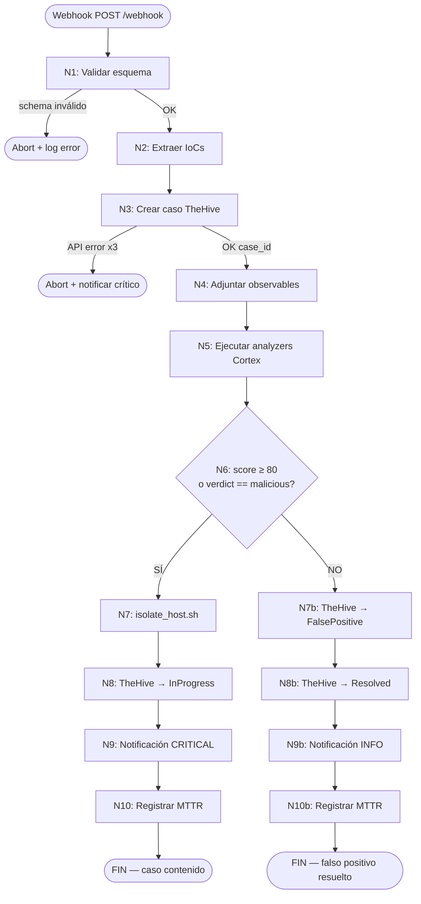

#### 3.3.13 Casos de prueba E2E

| Test | Payload | `confidence` | Decisión esperada | Resultado esperado |
|-------|----------------------|--------------|-------------------|------------------------------------------------------|
| TC-01 | `tests/e2e/TC-01/test_malicious.py` | 95 | CONTAIN | Caso TheHive `InProgress`, `containment.log` escrito |
| TC-02 | `tests/e2e/TC-02/` | 20 | OBSERVE | Caso TheHive `FalsePositive`, sin `containment.log` |
| TC-03 | `tests/e2e/TC-03/` | varios | Varios | Sistema estable, sin excepciones no controladas |

#### 3.3.14 Configuración requerida

| Variable | Descripción | Valor por defecto |
|-------------------------|------------------------------------|----------------------------------|
| `SIEM_WEBHOOK_TOKEN` | Token de autenticación del webhook | `siem-webhook-token-change-this` |
| `THEHIVE_API_KEY` | API key de TheHive | en `.env.full` |
| `CORTEX_API_KEY` | API key de Cortex | en `.env.full` |
| `SIMULATION_MODE` | Modo simulación de contención | `true` |
| `LOG_FILE` | Ruta del log de contención | `runtime/logs/containment.log` |

#### 3.4 Casos de prueba

#### 3.4.1 TC-01: caso malicioso

**Descripción**: Alerta con confidence=95 debe activar contención.

**Entrada**: Payload con `confidence=95`, `event_type="ransomware_detection"`, `mitre_techniques=["T1486"]`

**Salida esperada**:

- Caso creado en TheHive con estado "In Progress"
- Script de contención ejecutado
- Log en `runtime/logs/containment.log`
- MTTR calculado y registrado

#### 3.4.2 TC-02: caso benigno

**Descripción**: Alerta con confidence=25 debe clasificar como falso positivo.

**Entrada**: Payload con `confidence=20`, `event_type="file_monitoring"`

**Salida esperada**:

- Caso creado en TheHive con estado "FalsePositive"
- No se ejecuta contención
- Notificación de observación enviada
- MTTR calculado y registrado

#### 3.4.3 TC-03: edge cases

**Descripción**: Manejo de casos límite y errores.

**Casos**:

- Payload incompleto → Error de validación
- API TheHive no responde → Reintento automático
- Analyzers fallan → Verdict unknown → Observación

#### 3.5 Resultados esperados

#### 3.5.1 Métricas de éxito

| Métrica | Umbral | Método de Medida |
|--------------------------------|---------|----------------------------------|
| **MTTR p50** | ≤ 120 s | Timestamps y cálculo estadístico |
| **MTTR p90** | ≤ 180 s | Timestamps y cálculo estadístico |
| **Tasa de éxito playbook** | 100% | Logs de Shuffle |
| **Tasa de éxito contención** | 100% | Logs de script de contención |
| **Precisión de clasificación** | ≥ 90% | Comparación con casos esperados |

#### 3.5.2 KPIs calculados

Los KPIs se calculan y almacenan en `runtime/results/kpis.csv`:

- MTTR por caso
- Percentiles p50 y p90
- Tasa de éxito de playbook
- Tasa de contención activada
- Tiempo de ejecución por nodo

#### 4. Validación

#### 4.1 Verificación

El playbook se verifica mediante:

- Ejecución de tests E2E (tests/e2e/TC-01/, TC-02/, TC-03/)
- Verificación de logs de ejecución (runtime/logs/)
- Validación de casos creados en TheHive
- Verificación de resultados de analyzers en Cortex
- Confirmación de ejecución de script de contención
- Validación de cálculo de MTTR y KPIs

#### 4.2 Criterios de aceptación

El playbook se considera válido cuando:

- TC-01 ejecuta contención correctamente (confidence=95 → CONTAIN)
- TC-02 clasifica como falso positivo (confidence=25 → OBSERVE)
- TC-03 maneja edge cases sin excepciones no controladas
- MTTR cumple umbrales objetivo (p50 ≤ 120 s; p90 ≤ 180 s)
- Todos los nodos ejecutan sin errores críticos
- Logs de contención y notificación se generan correctamente

#### 4.3 Evidencias

Las evidencias de validación incluyen:

- Logs de ejecución del playbook en Shuffle
- Casos creados en TheHive con estado correcto
- Resultados de analyzers en Cortex
- Archivo runtime/logs/containment.log (rama maliciosa)
- Archivo runtime/logs/notify.log
- Archivo runtime/results/kpis.csv con KPIs calculados
- Capturas de pantalla de ejecución de tests

#### 5. Problemas

#### 5.1 Limitaciones

- **Dependencia de servicios externos**: VirusTotal requiere API key externa
- **Modo simulación**: Contención se simula, no es aislamiento real
- **Single-node**: Configuración no soporta clustering
- **Timeouts**: Analyzers pueden timeout en 60 s
- **Rate limiting**: Webhook tiene límite de 60 req/min

#### 5.2 Riesgos o incidencias

- **Fallo de API**: TheHive o Cortex no responden
- **Schema inválido**: Payload no cumple esquema
- **Analyzers fallidos**: Todos los analyzers fallan → verdict unknown
- **Script de contención fallido**: Exit code ≠ 0
- **MTTR fuera de umbral**: Tiempo de respuesta excede objetivos

#### 5.3 Recomendaciones / troubleshooting

**Fallo de API TheHive/Cortex:**

```bash
# Verificar estado de servicios
docker logs soar_thehive
docker logs soar_cortex

# Verificar API keys
echo $THEHIVE_API_KEY
echo $CORTEX_API_KEY

# Reintentar ejecución del playbook
# Shuffle reintentará automáticamente hasta 3 veces
```

**Schema inválido:**

```bash
# Verificar esquema Pydantic de alertas
python3 -c "from src.soar_lab.config.schemas import RansomwareAlert; print(RansomwareAlert.model_json_schema)"
```

**Analyzers fallidos:**

```bash
# Verificar estado de Cortex
curl http://localhost:8101/api/analyzer

# Verificar logs de Cortex
docker logs soar_cortex

# Si VirusTotal falla, verificar API key
echo $VIRUSTOTAL_API_KEY
```

**Script de contención fallido:**

```bash
# Simular una alerta maliciosa manualmente (genera caso + contención simulada)
PYTHONPATH=src python3 -m soar_lab.simulator.simulate_alerts \
 --count 1 \
 --delay 0 \
 --webhook http://localhost:5001/api/v1/hooks/<workflow_id>

# Verificar logs de ejecución del workflow
docker logs soar_shuffle_backend

# Verificar logs del API Lab
docker logs soar_api
```

**MTTR fuera de umbral:**

```bash
# Revisar archivo de KPIs
cat runtime/results/kpis.csv

# Re-ejecutar tests para recopilar nuevos datos
pytest tests/e2e/ --generate-kpis

# Analizar cuello de botella en logs
cat runtime/logs/notify.log
```

#### 6. Referencias

- **Repositorio del Proyecto**: [alesanfe/soar-ransomware-lab](https://github.com/alesanfe/soar-ransomware-lab.git)
- **Documentación de Shuffle Workflows**: https://shuffler.io/docs/workflows
- **Documentación de TheHive API**: https://docs.strangebee.com/thehive/api-docs/
- **Documentación de Cortex API**: https://docs.strangebee.com/cortex/api-docs/
- **Documentación de MISP API**: https://www.misp-project.org/api/
- **Documentación de Arquitectura**: [docs/02-architecture.md](02-architecture.md)
- **Especificación de APIs**: [docs/03-api-and-integrations.md](03-api-and-integrations.md)
- **Estrategia de Pruebas**: [docs/05-testing.md](05-testing.md)
- **Esquema de alerta**: `src/soar_lab/config/schemas/__init__.py`
- **Script de contención**: Simulado en código Python (módulo de contención)
- Tests E2E: `tests/e2e/TC-01/`, `tests/e2e/TC-02/`, `tests/e2e/TC-03/`
- KPIs: `src/soar_lab/domain/services/kpi_analyzer.py` → `runtime/results/kpis.csv`

---

**Mejoras realizadas:**

- Reestructurado según formato obligatorio con 6 secciones principales
- Índice actualizado para reflejar nueva estructura
- Contenido organizado en subsecciones lógicas
- Sección de Validación añadida con criterios y evidencias
- Sección de Problemas y Consideraciones consolidada
- Tablas, diagramas y ejemplos mantenidos en sección 3.3

**Contradicciones detectadas:**

- Ninguna detectada en este documento

**Información faltante identificada:**

- Sección 2.2 Límites: especificado que no cubre implementación técnica (referencia a documentación oficial)
- Sección 4.2 Criterios de aceptación: criterios específicos definidos para TC-01, TC-02 y TC-03

**Recomendaciones:**

- Considerar añadir capturas de pantalla de ejecución del playbook
- Documentar procedimientos específicos de depuración en Shuffle UI
- Añadir matriz de trazabilidad entre nodos y componentes del sistema


### 3.14 Addendum forense

#### 1. TheHive healthcheck: `/api/status`

TheHive expone el endpoint `GET /api/status` para verificar salud sin autenticación previa. Se usa en el healthcheck de Docker Compose para evitar falsos negativos mientras Elasticsearch prepara los índices de TheHive.

```bash
curl -f http://localhost:8100/api/status
```

Respuesta típica (JSON con `status`):

```json
{ "status": "OK", "version": "3.5.2-1" }
```

#### 2. Orborus y red de analizadores

- **Orborus** (`ghcr.io/shuffle/shuffle-orborus:2.2.1-patched`) ejecuta los contenedores de analizadores que lanza el workflow de Shuffle.
- Requiere acceso al socket Docker del host (`/var/run/docker.sock`) para crear contenedores en la misma red `soar_net`.
- El entorno `SHUFFLE_APP_NETWORK` debe apuntar a `${COMPOSE_PROJECT_NAME}_net` (por defecto `soar_net`) para que los analizadores puedan resolver `api`, `thehive`, `cortex`, `misp` y `elasticsearch` por DNS interno.
- `SHUFFLE_ORBORUS_EXECUTION_CONCURRENCY` se fija a `5` en `docker-compose.core.yml` para evitar timeouts bajo carga concurrente.

#### 3. Campos forenses de la plantilla de caso

La plantilla de caso de TheHive incluye campos personalizados relevantes para la trazabilidad forense:

| Campo | Tipo | Propósito |
|-------|------|-----------|
| `hostname` | string | Endpoint afectado |
| `username` | string | Cuenta de usuario involucrada |
| `file_hash` | string | Hash SHA256 del archivo sospechoso |
| `src_ip` | ip | IP origen del actor de amenaza |
| `detection_time` | date | Timestamp de detección |
| `shuffle_workflow_id` | string | ID de ejecución del workflow en Shuffle |
| `misp_event_id` | string | ID del evento MISP correlacionado |
| `containment_status` | string | Estado de la contención (`pending` / `in_progress` / `completed`) |
| `containment_action_id` | string | Identificador de la acción de contención ejecutada (ej. `network_isolation_001`) |
| `containment_status_history` | string | Historial de transiciones de estado, separado por comas |
| `mitre_tactic_id` | string | Táctica MITRE ATT&CK principal asociada (ej. `TA0040`) |
| `analyzer_score` | number | Puntuación de amenaza de los analyzers de Cortex (0-100) |

#### 3.1 Simulación vs contención real

- El workflow E2E y los campos de la plantilla de caso de TheHive documentan **acciones simuladas o notificadas**.
- `containment_status`, `containment_action_id` y `containment_status_history` reflejan el estado decidido por el workflow, **no modifican directamente endpoints reales**.
- Una contención real requiere una integración con EDR/agente o firewall operativo; en este laboratorio se simula mediante `notify.sh` / llamadas a `api/v1/contain` que registran la acción sin ejecutar cambios reales en hosts de producción.

#### 3.2 Campo `total_time_manual`

- `total_time_manual` no está presente en el código ni en los índices de métricas actuales.
- Fue eliminado del modelo de datos; el MTTR se calcula de forma automatizada (`mttr_seconds` en `soar-metrics`) y se almacena mediante `src/soar_lab/domain/services/kpi_analyzer.py`.
- Si aparece en documentación antigua o en `legacy/`, debe considerarse obsoleto.

#### 4. MTTR y percentiles (P50 / P90)

- **MTTR (Mean Time To Respond)**: tiempo medio desde la detección de la alerta hasta el cierre o contención del incidente.
- **P50**: mediana de los tiempos de respuesta observados.
- **P90**: percentil 90; el 90% de las ejecuciones responden en menos de este valor.

Umbrales definidos en el alcance del proyecto:

| Métrica | Objetivo | Estado |
|---------|----------|--------|
| P50 | ≤ 120 s | Operativo |
| P90 | ≤ 180 s | Operativo |

El cálculo se realiza en `src/soar_lab/domain/services/kpi_analyzer.py` y se indexa en `soar-metrics` con el campo `mttr_seconds` (`float`) y `@timestamp` (`date`) para consultas en Grafana.

#### 5. Definiciones: MTTR, IaC y CORS

- **MTTR**: Mean Time To Respond / Mean Time To Remediate. En este proyecto se mide desde el envío de la alerta al webhook hasta la finalización del workflow, registrado en `runtime/logs/playbook_execution.log` e indexado en `soar-metrics`.
- **IaC (Infrastructure as Code)**: toda la infraestructura del laboratorio está declarada en archivos Docker Compose bajo `infra/docker/compose/`. No se requiere configuración manual de red o volúmenes salvo la generación de secretos y certificados.
- **CORS (Cross-Origin Resource Sharing)**: configurado en `src/soar_lab/interfaces/api/main.py` mediante `CORSMiddleware`, leyendo orígenes desde `CORS_ORIGINS` en `.env.full`. Permite que la SPA `apps/web-management` consuma la API tanto desde `https://soar.local` como desde `http://localhost:8085`.

#### Referencias

- `docs/03-api-and-integrations.md`
- `src/soar_lab/domain/services/kpi_analyzer.py`
- `infra/docker/compose/docker-compose.core.yml`
- `src/soar_lab/interfaces/api/main.py`


### 3.15 Caso de estudio gminst4ll

- [1. Resumen](#1-resumen)
 - [1.1 Objetivo](#11-objetivo)
 - [1.2 Contexto](#12-contexto)
- [2. Alcance](#2-alcance)
 - [2.1 Qué cubre](#21-qué-cubre)
 - [2.2 Límites](#22-límites)
 - [2.3 Dependencias](#23-dependencias)
- [3. Contenido principal](#3-contenido-principal)
 - [3.1 Contexto del malware](#31-contexto-del-malware)
 - [3.2 Capacidades del malware](#32-capacidades-del-malware)
 - [3.3 Mapeo MITRE ATT&CK](#33-mapeo-mitre-attck)
 - [3.4 IoCs principales](#34-iocs-principales)
 - [3.5 Actor de amenaza](#35-actor-de-amenaza)
 - [3.6 Validación en el laboratorio SOAR](#36-validación-en-el-laboratorio-soar)
 - [3.7 Reglas de detección](#37-reglas-de-detección)
- [4. Validación](#4-validación)
 - [4.1 Verificación](#41-verificación)
 - [4.2 Criterios de aceptación](#42-criterios-de-aceptación)
 - [4.3 Evidencias](#43-evidencias)
- [5. Problemas](#5-problemas)
 - [5.1 Limitaciones](#51-limitaciones)
 - [5.2 Riesgos o incidencias](#52-riesgos-o-incidencias)
 - [5.3 Recomendaciones / troubleshooting](#53-recomendaciones-troubleshooting)
- [6. Referencias](#6-referencias)

---

#### 1. Resumen

#### 1.1 Objetivo

Este documento describe cómo el laboratorio SOAR procesa los IoCs reales extraídos del
análisis forense del malware **GMinst4ll 2.03.rar**, un InfoStealer/loader que distribuye
múltiples payloads incluyendo **Pulsar RAT v1.6.6.0**, **SystemSP** (killer AV + persistencia)
y ejecutables Python/Rust desde GitHub como C2.

El test E2E **TC-33** (`tests/e2e/TC-33/test_gminst4ll_real_iocs.py`) valida el pipeline
completo del laboratorio SOAR usando estos IoCs reales, sin necesidad de ejecutar el malware.

#### 1.2 Contexto

El caso de estudio se basa en el análisis forense del malware GMinst4ll 2.03, realizado entre
los días 11 y 13 de junio de 2026. El malware se distribuye mediante engaño en plataformas
legítimas (YouTube, Tumblr, MediaFire, Discord) presentándose como software de minería de
criptomonedas (GMiner). El repositorio forense
[gminst4ll-forensics](https://github.com/alesanfe/gminst4ll-forensics) contiene el informe
completo, los IoCs y las reglas de detección.

---

#### 2. Alcance

#### 2.1 Qué cubre

- Clasificación y contexto del malware GMinst4ll 2.03 / Pulsar RAT
- Vector de infección y flujo de despliegue de payloads
- Capacidades del loader, payload secundario (SystemSP) y RAT (Pulsar)
- Mapeo MITRE ATT&CK de las técnicas observadas
- IoCs principales: hashes SHA256, URLs C2, IPs C2, Telegram, persistencia en registro
- Información del actor de amenaza
- Validación del pipeline SOAR mediante el test E2E TC-33
- Reglas de detección YARA y Sigma

#### 2.2 Límites

- No se ejecuta ni se descomprime el malware en ningún momento
- El test TC-33-01 descarga muestras binarias reales **solo para verificar el hash SHA256** y las elimina inmediatamente
- No se cubre el análisis dinámico (sandbox) del malware
- No se incluye el listado completo de IoCs (ver `tests/e2e/fixtures/gminst4ll_iocs.json`)

#### 2.3 Dependencias

- Repositorio forense: [alesanfe/gminst4ll-forensics](https://github.com/alesanfe/gminst4ll-forensics)
- Test E2E: `tests/e2e/TC-33/test_gminst4ll_real_iocs.py`
- Fixture de IoCs: `tests/e2e/fixtures/gminst4ll_iocs.json`
- Laboratorio SOAR desplegado (Shuffle, TheHive, Cortex, MISP, Elasticsearch)

---

#### 3. Contenido principal

#### 3.1 Contexto del malware

#### 3.1.1 Clasificación

| Atributo | Valor |
|----------|-------|
| **Familia** | GMinst4ll / Pulsar RAT |
| **Tipo** | InfoStealer / Loader / RAT |
| **Sistemas objetivo** | Windows x64 |
| **Nivel de riesgo** | Alto |
| **Sofisticación** | Media-alta |
| **Fecha de análisis** | 11-13 de junio de 2026 |
| **Fuente forense** | [gminst4ll-forensics](https://github.com/alesanfe/gminst4ll-forensics) |

#### 3.1.2 Vector de infección

El malware se distribuye mediante engaño en plataformas legítimas:

1. **YouTube** — Canal "асÑOминог" con vídeos que prometen herramientas de minería
2. **Tumblr** — @tutorialsfrommax con tutoriales falsos
3. **MediaFire** — Descarga del RAR con contraseña
4. **Discord** — sub4unlock.io (scam)

El archivo se presenta como **GMiner** (software legítimo de minería de criptomonedas),
empaquetado en un RAR anidado con contraseña `4204`.

#### 3.1.3 Flujo de infección

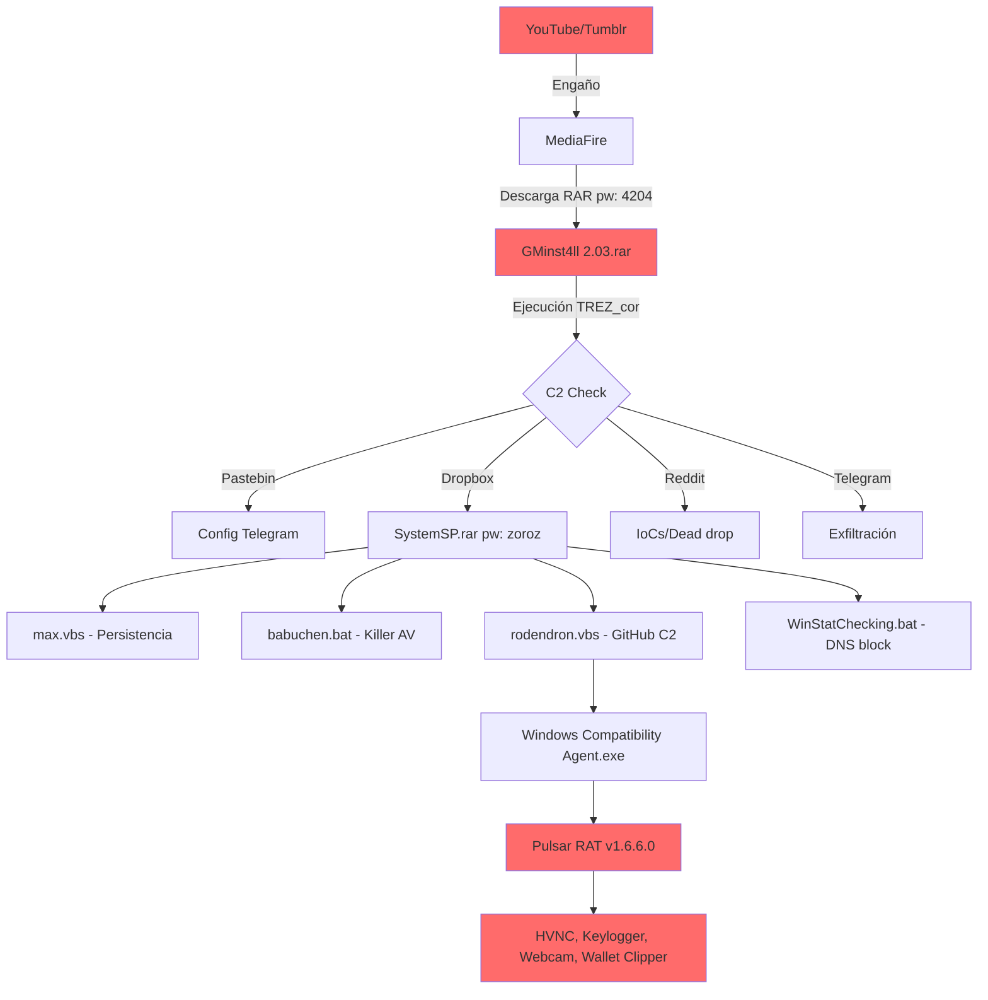

#### 3.2 Capacidades del malware

#### 3.2.1 GMinst4ll (Loader Principal)

- **Persistencia:** Winlogon UserInit, tareas programadas, RunOnce
- **Exfiltración:** Telegram Bot API, Pastebin C2, Dropbox
- **Robo de información:** Navegadores (Chrome, Edge, Brave, Opera, Firefox), wallets
 (Metamask, Trust Wallet, Atomic), tokens de Discord
- **Evasión:** Anti-VM, anti-debugging

#### 3.2.2 SystemSP (Payload Secundario)

- **Killer AV:** Detiene 14 servicios AV, destruye 34 suites de seguridad
- **Persistencia:** Winlogon UserInit, RunOnce, tareas programadas
- **Bloqueo de seguridad:** Modifica hosts file (66 dominios AV), fuerza DNS a 8.8.8.8
- **Deshabilita Windows Update:** Elimina servicios y claves de registro
- **Desactiva UAC:** `EnableLUA = 0`

#### 3.2.3 Pulsar RAT v1.6.6.0

| Capacidad | Librería / Implementación |
|-----------|--------------------------|
| HVNC (Hidden Virtual Desktop) | SharpDX DirectX |
| Keylogger | Gma.System.MouseKeyHook |
| Webcam access | AForge.Video.DirectShow |
| Audio capture | NAudio (Core, Wasapi, WinMM) |
| Clipboard hijacker | — |
| Remote desktop | — |
| Wallet clipper | BTC, LTC, ETH, XMR, SOL, DASH, XRP, TRX, BCH |
| Anti-VM | 14 checks (AnyRun, Triage, Qemu, Parallels, Sandboxie, Cuckoo, etc.) |
| Anti-debug | 10 checks (IsDebuggerPresent, NtGlobalFlag, hardware breakpoints, etc.) |

#### 3.3 Mapeo MITRE ATT&CK

| Táctica | Técnica | Descripción |
|---------|---------|-------------|
| Initial Access | T1566.002 | Spearphishing Link (YouTube/Tumblr/MediaFire) |
| Execution | T1059.001 | Command and Scripting Interpreter (PowerShell) |
| Persistence | T1547.001 | Modify System Binary (Winlogon UserInit) |
| Defense Evasion | T1562.001 | Impair Defenses (Killer AV) |
| Credential Access | T1056.001 | Input Capture (Keylogger) |
| Command and Control | T1102 | Web Service (Pastebin, Reddit, Telegram, Dropbox, GitHub) |
| Exfiltration | T1567.002 | Exfiltration Over Web Service (Telegram) |

#### 3.4 IoCs principales

#### 3.4.1 Hashes SHA256

| Archivo | SHA256 | Descripción |
|---------|--------|-------------|
| GMinst4ll 2.03.rar | `d70c31b02f88ad239507c47c9fbde3353b5b93b6892e48bf5ba25322aa667e77` | Loader principal (844 MiB) |
| TREZ_cor 4.52.3.exe | `a75def5353a7d9cb08949f144bebcdb894650ff75c941d9713eb40433c9d580a` | Ejecutable Rust (~835 MB) |
| SystemSP.rar | `a50e078598a08faa5ec554c36e58cf201f167e5f272b39f5107fffc6c44369f8` | Payload secundario C2 |
| appy.exe (Pulsar RAT) | `5b20cb36abbacc69ee5d0c7008f1ad081db2767625659b4bb8eba6ecc511bd2a` | Pulsar RAT v1.6.6.0 (.NET) |
| max.vbs | `4edbc0f24b9c11875bcbc9dfc628dd47c3f9eea9807750487602d00cdac15707` | Script persistencia |
| babuchen.bat | `e861568c8c88b45ed8f969e31da8fbf0cc6cc4a8466e255ef21c446178463875` | Killer AV |
| rodendron.vbs | `493b1137f016c03f7d0037fa5e190a01aca7dcd05074d36518499b98f706bed4` | Descargador GitHub C2 |

> Lista completa en `tests/e2e/fixtures/gminst4ll_iocs.json`

#### 3.4.2 URLs C2

| URL | Servicio | Propósito |
|-----|----------|-----------|
| `https://pastebin.com/raw/FgUMQ9vE` | Pastebin | Token Telegram + Chat ID |
| `https://pastebin.com/raw/E3s5iTTz` | Pastebin | URL descarga SystemSP.rar |
| `https://www.dropbox.com/scl/fi/5awp2xpk4r65t6dz0bmcu/SystemSP.rar` | Dropbox | Payload secundario |
| `https://www.reddit.com/user/Over_Media6257/comments/1s5bjdo/miks/.json` | Reddit | Dead drop resolver |
| `https://github.com/boycots563/wlt56/raw/main/Windows%20Compatibility%20Agent.exe` | GitHub | Payload Python C2 |
| `https://api.telegram.org/bot7675556882:[TOKEN]/sendDocument` | Telegram | Exfiltración |

#### 3.4.3 IPs C2

| IP | Servicio |
|----|----------|
| 172.66.171.73 | Pastebin |
| 104.20.29.150 | Pastebin |
| 162.125.248.18 | Dropbox |
| 151.101.129.140 | Reddit |
| 149.154.166.110 | Telegram API |

#### 3.4.4 Telegram (Exfiltración)

| Campo | Valor |
|-------|-------|
| Bot ID | `7675556882` |
| Bot username | `buchstys4_bot` |
| Chat ID exfiltración | `6820575341` |
| Operador | `@KJL4999S` |

#### 3.4.5 Persistencia (Registry)

| Clave | Valor malicioso | Técnica |
|-------|-----------------|---------|
| `HKLM\...\Winlogon\UserInit` | `,wscript.exe "...\max.vbs"` | T1547.001 |
| `HKLM\...\Policies\System\EnableLUA` | `0` (desactiva UAC) | T1548.002 |
| `HKLM\...\RunOnceEx\0001\RodendronLoader` | `wscript.exe "...\rodendron.vbs"` | T1547.001 |

#### 3.5 Actor de amenaza

| Atributo | Valor |
|----------|-------|
| Usuario GitHub | `boycots563` |
| Repositorio C2 | `boycots563/wlt56` (251 commits, activo hasta 2026-06-11) |
| Telegram operador | `@KJL4999S` |
| Chat ID | `6820575341` |
| Origen probable | Eslovaquia (subida a MediaFire el 2026-06-10) |
| Plataformas distribución | YouTube, Tumblr, MediaFire, Discord |

#### 3.6 Validación en el laboratorio SOAR

#### 3.6.1 Test E2E TC-33

El test `tests/e2e/TC-33/test_gminst4ll_real_iocs.py` valida el pipeline SOAR con los IoCs
reales del GMinst4ll. Consta de 10 subtests:

| Subtest | Descripción | IoCs enviados |
|---------|-------------|---------------|
| TC-33-01 | Descarga de **8 muestras** reales, verificación SHA256, borrado | 8 archivos binarios |
| TC-33-02 | Hash IoC del loader principal (TREZ_cor) | 1 hash SHA256 |
| TC-33-03 | Hash IoC de Pulsar RAT | 1 hash SHA256 |
| TC-33-04 | URLs C2 (Pastebin, Dropbox, GitHub) | 7 URLs |
| TC-33-05 | Dominios C2 | 6 dominios |
| TC-33-06 | IPs C2 | 6 IPs |
| TC-33-07 | Telegram exfiltration IoC | Bot ID + Chat ID |
| TC-33-08 | Registry persistence IoCs | 3 claves |
| TC-33-09 | MITRE ATT&CK mapping | 7 técnicas |
| TC-33-10 | Multi-IoC (todos en una ejecución) | Todos los IoCs |

#### 3.6.2 Flujo SOAR para IoCs del GMinst4ll

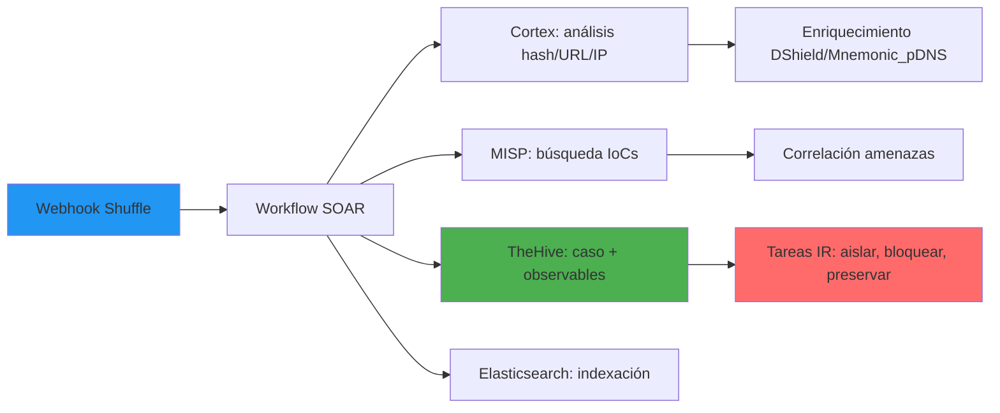

#### 3.6.3 Fixture de IoCs

Los IoCs están consolidados en `tests/e2e/fixtures/gminst4ll_iocs.json` con la siguiente
estructura:

- `hashes_sha256[]` — 13 hashes de archivos maliciosos
- `urls_c2[]` — 7 URLs C2
- `domains_c2[]` — 6 dominios C2
- `ips_c2[]` — 6 IPs con servicio asociado
- `telegram{}` — Bot ID, Chat ID, operador
- `registry_persistence[]` — 3 claves de registro
- `mitre_attack[]` — 7 técnicas MITRE ATT&CK
- `actor{}` — Información del actor de amenaza
- `av_services_killed[]` — 14 servicios AV objetivo
- `pulsar_rat_capabilities[]` — Capacidades del RAT

#### 3.7 Reglas de detección

#### 3.7.1 YARA

Se han desarrollado reglas YARA para detección:

- **GMinst4ll_Stealer** — Detecta loader principal por URLs C2, token Telegram, mutex
- **PulsarRAT_AES_GCM_Config** — Detecta Pulsar RAT por nonces AES-GCM de config C2
- **PulsarRAT_Deobfuscated_Strings** — Detecta Pulsar RAT por strings desofuscados

#### 3.7.2 Sigma

- **Winlogon UserInit Modification** — Detecta persistencia (EventID 13)
- **SystemSP Directory Creation** — Detecta instalación (EventID 11)
- **Suspicious WScript Execution** — Detecta ejecución de scripts (EventID 1)

> Las reglas completas están en el repositorio forense
> [gminst4ll-forensics](https://github.com/alesanfe/gminst4ll-forensics).

---

#### 4. Validación

#### 4.1 Verificación

La validación del caso de estudio se realiza mediante el test E2E TC-33, que verifica:

- Descarga y verificación de hashes SHA256 de 8 muestras reales (TC-33-01)
- Envío de IoCs de tipo hash al pipeline SOAR (TC-33-02, TC-33-03)
- Envío de URLs C2 al pipeline SOAR (TC-33-04)
- Envío de dominios C2 al pipeline SOAR (TC-33-05)
- Envío de IPs C2 al pipeline SOAR (TC-33-06)
- Envío de IoCs de exfiltración Telegram (TC-33-07)
- Envío de IoCs de persistencia en registro (TC-33-08)
- Mapeo MITRE ATT&CK (TC-33-09)
- Envío combinado de todos los IoCs en una sola ejecución (TC-33-10)

#### 4.2 Criterios de aceptación

- Los 10 subtests de TC-33 pasan exitosamente
- Los IoCs se indexan correctamente en Elasticsearch
- Los casos se crean correctamente en TheHive
- Los analyzers de Cortex ejecutan sin errores
- MISP recibe y correlaciona los IoCs

#### 4.3 Evidencias

- Resultados de ejecución de `tests/e2e/TC-33/test_gminst4ll_real_iocs.py`
- Archivo `tests/e2e/fixtures/gminst4ll_iocs.json` con los IoCs consolidados
- Reglas YARA y Sigma en el repositorio forense
- Informe principal: `01_INFORME_PRINCIPAL_GMINST4LL.md` (repo forense externo, no incluido en este repo)
- IoCs y detección: `03_IOCS_Y_DETECCION_GMINST4LL.md` (repo forense externo, no incluido en este repo)

---

#### 5. Problemas

#### 5.1 Limitaciones

- El test TC-33-01 descarga muestras binarias reales solo para verificar el hash SHA256; no se descomprimen ni ejecutan.
- El listado de IoCs en este documento es un resumen; el listado completo está en `tests/e2e/fixtures/gminst4ll_iocs.json`.
- No se realiza análisis dinámico del malware en este caso de estudio.

#### 5.2 Riesgos o incidencias

> **ADVERTENCIA:** Este caso de estudio usa IoCs de malware real. El test TC-33-01
> descarga **8 muestras binarias reales** del repositorio forense (GMinst4ll 2.03.rar,
> SystemSP.rar, beket.rar, appy.exe, Windows_Compatibility_Agent.exe,
> Windows_Compatibility_Agent_Host.exe, kamzat.exe, postevak.exe) **solo para verificar
> el hash SHA256** de cada una y las elimina inmediatamente. No se descomprimen ni
> ejecutan en ningún momento.

> Las muestras de malware están protegidas con contraseñas (`4204` externo, `zoroz`
> interno) y deben analizarse únicamente en entornos aislados (sandbox/VM).

#### 5.3 Recomendaciones / troubleshooting

- Ejecutar el test TC-33 únicamente en entornos de laboratorio aislados.
- Verificar que el laboratorio SOAR esté desplegado y todos los servicios estén healthy antes de ejecutar TC-33.
- Si TC-33-01 falla por conectividad, verificar acceso al repositorio forense en GitHub.
- Si los subtests de IoCs fallan, revisar la conectividad entre Shuffle, Cortex, TheHive, MISP y Elasticsearch.
- Consultar el flujo SOAR (sección 3.6.2) para diagnosticar cuellos de botella en el pipeline.

---

#### 6. Referencias

- **Repositorio forense:** [alesanfe/gminst4ll-forensics](https://github.com/alesanfe/gminst4ll-forensics)
- **Test E2E:** `tests/e2e/TC-33/test_gminst4ll_real_iocs.py`
- **Fixture de IoCs:** `tests/e2e/fixtures/gminst4ll_iocs.json`
- **Informe principal:** `01_INFORME_PRINCIPAL_GMINST4LL.md` (repo forense externo)
- **IoCs y detección:** `03_IOCS_Y_DETECCION_GMINST4LL.md` (repo forense externo)
- **MITRE ATT&CK:** [https://attack.mitre.org/](https://attack.mitre.org/)

---

*Última actualización: junio 2026*


---

#### 4. Validación

#### 4.1 Verificación

La validación se realiza mediante tests automatizados, health checks y verificación manual del stack.

#### 4.2 Criterios de aceptación

- Todos los servicios críticos responden a health checks
- Los tests unitarios y de integración pasan sin errores
- El composition root cablea correctamente las dependencias

#### 4.3 Evidencias

- Resultados de `pytest` en CI
- `docker ps` mostrando servicios healthy
- Reportes de cobertura en `runtime/coverage/`

---

#### 5. Problemas

#### 5.1 Limitaciones

- Algunos componentes requieren Docker-in-Docker para funcionar completamente
- Elasticsearch single-node: estado `yellow` es normal

#### 5.2 Riesgos o incidencias

- Dependencia de imágenes Docker externas para servicios core
- Fragmentación de configuración entre múltiples archivos Compose

#### 5.3 Recomendaciones / troubleshooting

- Usar `make health` tras `make up` para verificar el stack
- Revisar `make logs` si un servicio no responde
- Consultar [la sección de troubleshooting](#8-diagnóstico) para troubleshooting detallado

---

#### 6. Referencias

- [01-getting-started.md](01-getting-started.md)
- [02-architecture.md](02-architecture.md)
- [05-testing.md](05-testing.md)
- [glossary.md](glossary.md)

## 4. Validación

### 4.1 Verificación

La configuración del laboratorio SOAR se considera exitosa cuando:

- Todos los servicios están ejecutándose y reportan estado healthy
- Las apps de Shuffle están descargadas, autenticadas y funcionando correctamente
- El workflow de respuesta a ransomware se ejecuta sin errores
- Las pruebas end-to-end pasan exitosamente
- Los servicios se comunican correctamente entre sí
- Los webhooks están configurados y funcionando

### 4.2 Criterios de Aceptación

La configuración del laboratorio SOAR se considera exitosa cuando se cumplen los criterios de verificación descritos en
la sección 4.1.

### 4.3 Evidencias

Las evidencias de configuración exitosa incluyen:

- Logs de contenedores sin errores críticos
- Ejecuciones de workflows exitosas en Shuffle
- Casos creados en TheHive
- Análisis ejecutados en Cortex
- Datos indexados en Elasticsearch
- Webhooks configurados y funcionando

## 5. Problemas

### 5.1 Limitaciones

**Limitaciones de Integración:**

- Algunos analyzers de Cortex requieren API keys externas (VirusTotal, Shodan, etc.)
- La integración -Shuffle requiere configuración manual de reglas
- MISP requiere configuración adicional para sincronización bidireccional

### 5.2 Riesgos o incidencias

**Riesgos de Seguridad:**

- Las API keys deben guardarse de forma segura
- Las contraseñas predeterminadas deben cambiarse inmediatamente
- Los webhooks deben estar protegidos con autenticación

### 5.3 Recomendaciones / troubleshooting

> El troubleshooting detallado de Docker, Shuffle y TheHive está en la [sección 3.12](#312-troubleshooting).

**Próximos Pasos:**

Una vez configurado el laboratorio SOAR, hay varias mejoras y extensiones que puedes implementar para enriquecer las
capacidades del sistema.

1. **Crear workflows adicionales** para otros tipos de incidentes
2. **Configurar más analyzers** en Cortex
3. **Integrar ** completamente con Shuffle
4. **Crear dashboards** en para visualización
5. **Configurar alertas** automáticas desde a Shuffle

**Soporte:**

Si encuentras problemas o tienes preguntas durante la configuración u operación del laboratorio SOAR, hay varios
recursos disponibles para obtener ayuda.

Para problemas o preguntas:

- Revisar logs: `docker logs <container_name>`
- Documentación oficial: https://shuffler.io/docs
- TheHive docs: https://docs.strangebee.com/thehive/
- Cortex docs: https://docs.strangebee.com/cortex/

---

#### Navegación

- [Instalación y guía rápida](01-getting-started.md)
- [Arquitectura hexagonal, Docker, código, seguridad](02-architecture.md)
- [API REST, endpoints e integraciones](03-api-and-integrations.md)
- [Estrategia de pruebas y suite](05-testing.md)
- [Objetivos, plan, riesgos, auditorías](06-project-management.md)
- [Glosario central](glossary.md)
- [Índice](index.md)
## 6. Referencias

**Referencias y Proyectos de Investigación:**

**Proyectos con Integración Webhook para Shuffle:**

**TheHive + Shuffle + MISP:**

- **Descripción**: Integración real-time entre TheHive, Shuffle y MISP para automatización de IoCs
- **Referencia**: [Real-time executions and IoC's with Shuffle, TheHive and MISP - Medium](https://medium.com/shuffle-automation/indicators-and-webhooks-with-thehive-cortex-and-misp-open-source-soar-part-4-f70cde942e59)
- **Webhook Config**: TheHive envía alertas a Shuffle vía webhook, Shuffle procesa y consulta MISP
- **Caso de uso**: Detección de IoCs desde texto, análisis con MISP, creación de casos en TheHive

**SIEM + Shuffle + TheHive:**

- **Descripción**: SOC automation project integrando SIEM con Shuffle y TheHive
- **Referencia**: [SIEM, TheHive, and Shuffle — SOC Automation Project - Medium](https://medium.com/@jblemard/-thehive-and-shuffle-soc-automation-project-08ff58e0a4c9)
- **Webhook Config**: SIEM envía alertas a Shuffle, Shuffle crea casos en TheHive, analiza con VirusTotal

**Shuffle + VirusTotal + TheHive:**

- **Descripción**: Integración de Shuffle con VirusTotal y TheHive para análisis de malware
- **Referencia
 **: [Integrating Shuffle with Virustotal and TheHive - Medium](https://medium.com/shuffle-automation/integrating-shuffle-with-virustotal-and-thehive-open-source-soar-part-3-8e2e0d3396a9)
- **Webhook Config**: Shuffle analiza archivos con VirusTotal, crea casos en TheHive
- **Caso de uso**: Análisis automatizado de malware, creación de casos en TheHive

**TheHive Webhook Configuration:**

- **Documentación**: [TheHive Webhook Setup](https://docs.strangebee.com/thehive/api-docs/)
- **Config**: Editar `application.conf` para configurar URL de webhook
- **Endpoint**: POST al webhook de Shuffle con datos del caso/alerta

**Repositorios de Apps Shuffle:**

**OpenAPI Apps:**

- **Repositorio**: [Shuffle/openapi-apps](https://github.com/Shuffle/openapi-apps)
- **Descripción**: Apps generadas desde especificaciones OpenAPI de seguridad
- **Apps Relevantes**: TheHive (OpenAPI v5), Cortex, MISP, VirusTotal, Shodan

**Python Apps:**

- **Repositorio**: [Shuffle/python-apps](https://github.com/Shuffle/python-apps)
- **Descripción**: Apps Python personalizadas para Shuffle
- **Apps Relevantes**: TheHive, Cortex, MISP (versión antigua, ahora en OpenAPI)

**Tutoriales en YouTube:**

**Shuffle SOAR Tutorials:**

- **Automate Everything with Shuffle!** - [Video Tutorial](https://www.youtube.com/watch?v=_riaZjLnoXo)
- **Host Your Own SOAR - Shuffle Install** - [Video Tutorial](https://www.youtube.com/watch?v=YDUKZojg0vk)
- **Shuffle: Automated Workflows** - [Video Tutorial](https://www.youtube.com/watch?v=toqzkIN1urA)
- **SOC Open Source, Build own SOAR with Shuffle, ELK-TheHive-Cortex-MISP** - [Video Tutorial](https://www.youtube.com/watch?v=Nb9_ahZMC5U)
- **Shuffle SOAR Home-Lab | Free Security Automation Tool** - [Video Tutorial](https://www.youtube.com/watch?v=i2rRDB2N2w8)

**TheHive Tutorials:**

- **Installing TheHive 4.1.x in 12 minutes** - [Video Tutorial](https://www.youtube.com/watch?v=V_toQk19PuE)
- **TheHive - Build Your Own Security Operations Center (SOC)** - [Video Tutorial](https://www.youtube.com/watch?v=VqIuP0AOCBg)
- **SOC Open Source, ELK- TheHive- Cortex- MISP Complete Setup Guide** - [Video Tutorial](https://www.youtube.com/watch?v=t6PqjLIVgdA)
- **#1 Cyber-SOC - Configurer TheHive et Cortex pour un SOC avec Shuffle** - [Video Tutorial](https://www.youtube.com/watch?v=OiuTbNhMw1A)

**Cortex Tutorials:**

- **How to enable Cortex analyzers** - [Video Tutorial](https://www.youtube.com/watch?v=YuMn02vTe5k)
- **CORTEX - Analyze Observables (IPs, domains, etc.) at Scale!** - [Video Tutorial](https://www.youtube.com/watch?v=qz6xtINwK3I)
- **TheHive and Cortex Integration** - [Video Tutorial](https://www.youtube.com/watch?v=lzsTSDJhAOw)
- **Leveraging TheHive & Cortex for automated IR** - [Video Tutorial](https://www.youtube.com/watch?v=K6K1fNpbf9w)

**MISP Tutorials:**

- **How to Build Your First MISP Instance From Scratch** - [Video Tutorial](https://www.youtube.com/watch?v=fP28LXD8IU8)
- **Cómo Instalar MISP: Configuración Rápida y Sencilla** - [Video Tutorial](https://www.youtube.com/watch?v=koCj1waK9RM)
- **MISP General Usage Training - Part 1 of 2** - [Video Tutorial](https://www.youtube.com/watch?v=-NuODyh1YJE)
- **How to Create MISP Events and Add Threat Intelligence** - [Video Tutorial](https://www.youtube.com/watch?v=sWOa4Ld4CQM)
- **MISP Install and Intro** - [Video Tutorial](https://www.youtube.com/watch?v=nZcTc60YsIs)

**Shuffle Tutorials:**

- **Shuffle SOAR Tutorial** - [Video Tutorial](https://www.youtube.com/watch?v=p2LCsizVMNI)
- **Deploy Your Open Source SOAR Platform in One Command** - [Video Tutorial](https://www.youtube.com/watch?v=NtBy9u1b7MM)
- **Shuffle + SIEM + TheHIVE + Cortex = Automation Bliss** - [Video Tutorial](https://www.youtube.com/watch?v=FBISHA7V15c)

**Issues y Discussions Relevantes:**

**TheHive App Issues:**

- **Issue #205**: [TheHive: update/patch cases](https://github.com/Shuffle/python-apps/issues/205)
- **Descripción**: Feature request para actualizar campos de casos en TheHive desde Shuffle

**TheHive + Shuffle Integration:**

- **Issue #1502**: [Unable to integrate Shuffle with TheHive and Cortex](https://github.com/Shuffle/Shuffle/issues/1502)
- **Descripción**: Problemas de integración entre Shuffle, TheHive y Cortex

**Documentación Oficial de APIs:**

**TheHive API:**

- **Documentación**: [TheHive 5 API Documentation](https://docs.strangebee.com/thehive/api-docs/)
- **Endpoints Relevantes**: `POST /api/case`, `POST /api/alert`, `GET /api/case/{id}`, `PATCH /api/case/{id}`

**Cortex API:**

- **Documentación**: [Cortex API Documentation](https://docs.strangebee.com/cortex/api-docs/)
- **Endpoints Relevantes**: `POST /api/analyzer/run`, `GET /api/analyzer/{id}`

**Docker Templates de Referencia:**

**TheHive + Cortex + MISP + Shuffle:**

- **Repositorio**: [TheHive-Project/Docker-Templates](https://github.com/TheHive-Project/Docker-Templates)
- **Template
 **: [docker/thehive4-cortex3-misp-shuffle/README.md](https://github.com/TheHive-Project/Docker-Templates/blob/main/docker/thehive4-cortex3-misp-shuffle/README.md)
- **Descripción**: Configuración Docker completa para TheHive, Cortex, MISP y Shuffle

**Referencias Generales:**

- **Repositorio del Proyecto**: [alesanfe/soar-ransomware-lab](https://github.com/alesanfe/soar-ransomware-lab.git)
- **Documentación de Shuffle**: https://shuffler.io/docs
- **Documentación de TheHive**: https://docs.strangebee.com/thehive/
- **Documentación de Cortex**: https://docs.strangebee.com/cortex/
- **Documentación de MISP**: https://www.misp-project.org/documentation/
- **Documentación de Elasticsearch**: https://www.elastic.co/guide/en/elasticsearch/reference/current/index.html
- **Documentación de Docker Compose**: https://docs.docker.com/compose/

### Anexo: Métricas, versiones, trazabilidad y glosario

Este apéndice consolida la información necesaria para reproducir las métricas del proyecto, identificar versiones verificadas, entender la trazabilidad del código y enlazar con el glosario de acrónimos.

#### 7.1 Glosario de acrónimos

Los acrónimos técnicos (MTTR, KPI, E2E, CORS, JWT, SSO, MFA, WAF, IaC, etc.) se definen en [docs/glossary.md](glossary.md). Al introducir un acrónimo en cualquier documento nuevo, escribir la expansión completa la primera vez y enlazar al glosario para la definición detallada.

#### 7.2 Métricas observadas, objetivos y umbrales

- **Observada**: valor real obtenido de las ejecuciones del workflow y almacenado en el índice `soar-metrics` .
- **Objetivo**: valor deseado para la mejora continua del laboratorio.
- **Umbral (`threshold_p50`, `threshold_p90`)**: límite que una métrica observada no debería superar.

| Métrica | Definición | Umbral actual | Procedimiento de verificación |
|---------|------------|---------------|-------------------------------|
| **MTTR** | Tiempo medio desde la detección de la alerta hasta la finalización del workflow (segundos) | P50 ≤ 120 s, P90 ≤ 180 s | Ver `soar-metrics` en Elasticsearch o el dashboard de Grafana |
| **P50** | Percentil 50 de los tiempos de respuesta observados | ≤ 120 s | Consulta ES `percentiles` sobre `mttr_seconds` |
| **P90** | Percentil 90 de los tiempos de respuesta observados | ≤ 180 s | Consulta ES `percentiles` sobre `mttr_seconds` |

**Comandos reproducibles para MTTR / percentiles:**

```bash
# Requisito: stack levantado y .env.full cargado
set -a; source .env.full; set +a

# 1. Contar documentos en soar-metrics
curl -s -u "elastic:${ELASTIC_PASSWORD}" \
 "http://localhost:8200/soar-metrics/_count"

# 2. Calcular MTTR promedio y percentiles
curl -s -u "elastic:${ELASTIC_PASSWORD}" \
 -H "Content-Type: application/json" \
 -X POST "http://localhost:8200/soar-metrics/_search?size=0" \
 -d '{
 "aggs": {
 "avg_mttr": {"avg": {"field": "mttr_seconds"}},
 "percentiles_mttr": {"percentiles": {"field": "mttr_seconds", "percents": [50, 90]}}
 }
 }'

# 3. Verificar dashboard de Grafana
# Acceder a http://localhost:8084 y seleccionar "SOAR Ransomware KPI"
```

**Interpretación de las cifras documentadas**:

- Los valores `MTTR 31.85 s` y `P50 17.36 s` son **resultados de ejecuciones de prueba** en el entorno de laboratorio; dependen de la carga, recursos y latencia de red.
- Para validarlas en otro entorno, ejecutar los tests E2E (`pytest tests/e2e/ -m e2e`) y repetir las consultas anteriores.
- La fuente de verdad es el índice `soar-metrics` ; Grafana y `runtime/results/kpis.csv` son vistas derivadas.

#### 7.3 Composition Root

El `CompositionRoot` en `src/soar_lab/interfaces/api/composition.py` ensambla los adaptadores de infraestructura con los puertos del dominio. Los elementos principales son:

| Instancia | Puerto / Rol | Implementación | Uso típico |
|-----------|--------------|----------------|------------|
| `config_provider` | Configuración centralizada | `InfrastructureConfigProvider` (`src/soar_lab/infrastructure/config_provider.py`) | Lee `Settings` y `.env.full`; resuelve JWT secret, CORS, URLs de servicios |
| `storage` | Almacenamiento de archivos | `FilesystemStorage` (`src/soar_lab/infrastructure/filesystem_storage.py`) | Guarda resultados CSV, backups temporales, artefactos |
| `alert_repository` | Repositorio de alertas | `SqliteAlertRepository` / `InMemoryAlertRepository` (`src/soar_lab/infrastructure/persistence/` y `src/soar_lab/infrastructure/`) | Persistencia de alertas durante la ejecución del workflow |
| `http_client` | Cliente HTTP genérico | `AioHTTPClient` (`src/soar_lab/infrastructure/http_client.py`) | Peticiones a TheHive, Cortex, Shuffle, MISP |
| `backup_driver` | Backup comprimido | `TarBackupDriver` (`src/soar_lab/infrastructure/tar_backup_driver.py`) | Genera `soar_backup_*.tar.gz` |
| `test_runner` | Ejecutor de tests | `PytestTestRunner` (`src/soar_lab/infrastructure/pytest_test_runner.py`) | Lanza `pytest` con los marcadores adecuados |
| `health_checker` | Chequeos de salud | `HTTPHealthCheckAdapter` + `HealthService` (`src/soar_lab/infrastructure/monitoring/`) | Verifica servicios externos y expone `/health` |
| `websocket_manager` | WebSocket `/ws/logs` | `ConnectionManager` (`src/soar_lab/infrastructure/websocket_manager.py`) | Streaming de logs a clientes conectados |

Las dependencias se inyectan en `src/soar_lab/interfaces/api/main.py` a través de `lifespan` o de `get_*` helpers definidos en el propio `main.py` y en `src/soar_lab/interfaces/api/route_helpers.py`.

#### 7.4 Estructura hexagonal del código

La organización de `src/soar_lab/` sigue arquitectura hexagonal/ports-and-adapters:

- `domain/`: entidades, value objects, puertos y reglas de negocio puro.
- `application/`: casos de uso (`auth_service`, `backup_service`, `analytics_service`, `health_service`, etc.).
- `infrastructure/`: adaptadores (clientes HTTP, repositorios, drivers, gestores).
- `interfaces/`: puntos de entrada (FastAPI, CLI, WebSocket).
- `config/`: carga centralizada de variables de entorno y validación.
- `scripts/`: scripts de inicialización, setup y mantenimiento.

Ver detalles en:

- `docs/02-architecture.md`
- `docs/02-architecture.md`

#### 7.5 Distinción entre Elasticsearch, OpenSearch y

| Componente | Rol en el laboratorio | Imagen / versión | Puerto host | Notas |
|------------|-----------------------|------------------|-------------|-------|
| **Elasticsearch** | Motor de búsqueda para TheHive, Cortex y métricas SOAR (índices `soar-alerts`, `soar-metrics`) | `docker.elastic.co/elasticsearch/elasticsearch:7.10.2` | `8200` | Usado por TheHive, Cortex, Grafana, KPIs y Lab API |
| **OpenSearch** | Backend interno de Shuffle (almacenamiento de workflows y ejecuciones) | `opensearchproject/opensearch:2.10.0` | `8201` (por defecto en `.env.example`) | Motor principal actual de Shuffle; no es una migración futura |

La documentación operativa debe referirse al nombre completo del servicio (`elasticsearch` para el core del laboratorio, `.indexer` para ) para evitar ambigüedades. No se usa Kibana; Grafana es la herramienta de visualización central.

#### 7.6 Estado de capacidades (implementado / simulado / planificado / no verificado)

Esta tabla complementa la matriz de integraciones de la sección 4. Los estados se extraen del código y de los tests; en caso de discrepancia prevalece el comportamiento verificable.

| Capacidad | Estado | Notas |
|-----------|--------|-------|
| Webhook → Shuffle | Implementado | `scripts/setup/init_shuffle_webhook.py` |
| Creación/actualización de casos en TheHive | Implementado | Cliente y tests de integración |
| Ejecución de analyzers en Cortex | Implementado | Requiere API key y apps descargadas |
| Enriquecimiento MISP y correlación de IoCs | Implementado | Sincronización bidireccional puede requerir ajuste manual |
| Cálculo e indexado de KPIs (MTTR) | Implementado | Índice `soar-metrics` |
| Dashboard de Grafana | Implementado | Datasource y `kpi-dashboard.json` |
| Contención real de endpoints | Simulado | `notify.sh` / `api/v1/contain` registran la acción; no modifican hosts reales sin agente EDR |
| MFA / SSO | Planificado / No verificado | Autenticación actual basada en JWT `HS256` |
| WAF / mTLS avanzado | Planificado / No verificado | Nginx actúa como proxy inverso con certificado autofirmado |
| Alta disponibilidad | Planificado | Despliegue single-host actual |
| Notificaciones por SMS / ticket externo | No implementado | Puede añadirse como workflow futuro |

#### 7.7 Trabajo futuro y límites del alcance

Capacidades que quedan fuera del alcance operativo actual y que deben tratarse como trabajo futuro o investigación:

1. **Contención real de endpoints**: integrar un EDR/agente real ( active-response, GRR, Velociraptor, etc.) o un firewall con API operativa.
2. **MFA/SSO**: evaluar OAuth2 / OIDC para la Lab API y web-management.
3. **WAF**: añadir reglas de seguridad a Nginx o desplegar un WAF dedicado.
4. **mTLS entre servicios**: certificados por servicio y verificación bidireccional.
5. **Alta disponibilidad**: replicación de Elasticsearch, múltiples nodos Shuffle, clustering de .
6. **Integraciones adicionales**: ServiceNow, Jira, Slack, Teams, Telegram.

#### 7.8 Scripts de mantenimiento

Los scripts de mantenimiento se ubican en `scripts/maintenance/`:

- `clean_shuffle_executions.py`: limpia ejecuciones antiguas de Shuffle para liberar espacio en Elasticsearch.

El término "Nivel III" no se utiliza en la documentación operativa actual. Los scripts se clasifican simplemente como **mantenimiento** (modifican artefactos generados) o **diagnóstico** (consultan estado).

#### 7.9 Registro de cambios

Cada modificación sustantiva de configuración, código o documentación debe registrarse con:

- Archivo(s) afectado(s).
- Motivo del cambio.
- Evidencia de validación (comando ejecutado, test superado, diff).
- Fecha y entorno.

---

## Anexo: Configuración Técnica del Laboratorio


Aviso de sincronización: este anexo es una instantánea estática de la configuración Docker Compose y variables de
entorno. La versión canónica y actualizada del stack se encuentra en `infra/docker/compose/` (y `.env.example`/`.env.full`).
En caso de discrepancia, prevalecen los archivos Compose del repositorio.

Este anexo contiene la configuración técnica y código fuente de los componentes principales del laboratorio SOAR para
reproducir el sistema.

### A.1. Configuración Completa de Docker Compose

La configuración Docker Compose define los servicios, redes, volúmenes y dependencias del laboratorio SOAR. La
arquitectura modular permite despliegues desde configuraciones mínimas hasta entornos completos, separando
responsabilidades entre componentes.

#### A.1.1. Archivo docker-compose.yml (orquestador principal)

El archivo `docker-compose.yml` es el orquestador principal: define las redes Docker (`soar_net` 10.100.0.0/16, `ti_net` 172.22.0.0/16 internal, `logging_net` 172.23.0.0/16), los volúmenes bind-mount centralizados en `runtime/` y el servicio Elasticsearch. Los servicios de aplicación (TheHive, Cortex, Shuffle, Nginx, etc.) se definen en `docker-compose.core.yml` y los restantes compose files (ver §A.6.1). `make up` combina automáticamente todos los archivos.

Nota. Los servicios de aplicación (TheHive, Cortex, Shuffle, Orborus, Redis, Nginx, etc.) se definen en `docker-compose.core.yml` y `docker-compose.api.yml`. El contenido completo de cada compose file está en `infra/docker/compose/`. La sección A.6 proporciona el inventario completo.

#### A.1.2. Archivo .env.full

El archivo de entorno `.env.full` contiene todas las variables de configuración necesarias para el despliegue del laboratorio
SOAR. Este archivo permite la personalización del sistema según las necesidades específicas de cada entorno, facilitando
la adaptación a diferentes configuraciones de red, recursos disponibles y requisitos de seguridad. Las variables de
entorno incluyen configuraciones de puertos, credenciales, imágenes Docker y parámetros de red, permitiendo una
configuración modular en el despliegue sin necesidad de modificar los archivos de configuración principales.

```bash
# Project Configuration
COMPOSE_PROJECT_NAME=soar

# Ports — Core SOAR
THEHIVE_HTTP_PORT=8100
CORTEX_HTTP_PORT=8101
SHUFFLE_UI_PORT=8081
SHUFFLE_API_PORT=5001
ELASTICSEARCH_PORT=8200
OPENSEARCH_PORT=8201

# Ports — Management
HTTP_PORT=80
HTTPS_PORT=443
WEB_UI_PORT=8085
API_PORT=8000
DOCS_PORT=8086
MISP_PORT=8083
GRAFANA_PORT=8084

# Elasticsearch
ELASTIC_USERNAME=elastic
ELASTIC_PASSWORD=<ELASTIC_PASSWORD>
ELASTIC_SECURITY_ENABLED=false
ES_JAVA_OPTS=-Xms2g -Xmx2g

# Shuffle
SHUFFLE_FRONTEND_IMAGE=ghcr.io/shuffle/shuffle-frontend:2.2.1
SHUFFLE_BACKEND_IMAGE=ghcr.io/shuffle/shuffle-backend:2.2.1
SHUFFLE_DEFAULT_USERNAME=admin
SHUFFLE_DEFAULT_PASSWORD=<SHUFFLE_DEFAULT_PASSWORD>
SHUFFLE_DEFAULT_APIKEY=<SHUFFLE_DEFAULT_APIKEY>

# Orborus
ORBORUS_IMAGE=ghcr.io/shuffle/shuffle-orborus:2.2.1-patched

# Docker
DOCKER_API_VERSION=1.44

# Network
OUTER_HOSTNAME=localhost
```

La **Tabla 13** resume las variables de entorno Docker más relevantes para la personalización del despliegue.

### Tabla 13: Variables de Entorno Docker

| Variable               | Valor por Defecto | Descripción              | Requerido |
|------------------------|-------------------|--------------------------|-----------|
| `COMPOSE_PROJECT_NAME` | soar              | Nombre del proyecto      | No        |
| `ELASTIC_PASSWORD`     | Ver `.env.full`   | Contraseña Elasticsearch | Sí        |
| `ELASTIC_SECURITY_ENABLED` | false         | Seguridad Elasticsearch  | No        |
| `THEHIVE_HTTP_PORT`    | 8100              | Puerto TheHive           | No        |
| `CORTEX_HTTP_PORT`     | 8101              | Puerto Cortex            | No        |
| `SHUFFLE_UI_PORT`      | 8081              | Puerto Shuffle UI        | No        |
| `SHUFFLE_API_PORT`     | 5001              | Puerto Shuffle API       | No        |
| `ELASTICSEARCH_PORT`   | 8200              | Puerto Elasticsearch     | No        |
| `OPENSEARCH_PORT`      | 8201              | Puerto OpenSearch        | No        |
| `HTTP_PORT`            | 80                | Puerto HTTP público      | No        |
| `HTTPS_PORT`           | 443               | Puerto HTTPS público     | No        |
| `WEB_UI_PORT`          | 8085              | Puerto UI gestión        | No        |
| `API_PORT`             | 8000              | Puerto API FastAPI       | No        |
| `DOCS_PORT`            | 8086              | Puerto Docs Site         | No        |
| `MISP_PORT`            | 8083              | Puerto MISP              | No        |
| `GRAFANA_PORT`         | 8084              | Puerto Grafana           | No        |

### A.2. Scripts de Automatización

Los scripts de automatización desarrollados para el laboratorio SOAR ofrecen las capacidades operativas necesarias para
la simulación de incidentes, el cálculo de métricas y la ejecución de acciones de respuesta. Estos scripts representan
la materialización práctica de la automatización SOAR, permitiendo la validación del sistema mediante simulaciones
controladas y ofreciendo las herramientas necesarias para el análisis de rendimiento. Cada script sigue buenas prácticas
de desarrollo software, incluyendo manejo de errores, logging estructurado y documentación completa.

#### A.2.1. Alert Sender CLI (send_alert.py)

El script `send_alert.py` es el CLI que genera y envía alertas de ransomware con datos realistas al webhook de Shuffle
para su procesamiento. El simulador E2E (`src/soar_lab/simulator/simulate_alerts.py`) usa este mismo mecanismo para
inyectar alertas controladas que representan escenarios realistas de ransomware sin exponer el sistema a amenazas reales.
La implementación incluye la generación de alertas con IoCs conocidos, soporte para alertas maliciosas y benignas,
distribución temporal configurable para pruebas de carga, validación de esquemas JSON y autenticación mediante API token.
Este script se utiliza extensivamente en las pruebas E2E del sistema para validar el flujo completo de respuesta a incidentes.

Métodos principales:

| Función | Descripción |
|---------|-------------|
| `_default_webhook_url(base_dir)` | Resuelve la URL del webhook desde `webhook_info.json` o variable de entorno |
| `main()` | Punto de entrada: parsea argumentos, genera alertas y las envía al webhook |

#### A.2.2. AnalyticsService (KPI Calculator)

El `AnalyticsService` es el servicio de aplicación responsable de calcular métricas MTTR y KPIs desde logs de ejecución del sistema. Sigue la arquitectura hexagonal del proyecto: recibe sus dependencias por inyección (repositories, log_parser, statistical_calculator, kpi_formatter, kpi_analyzer) y delega los cálculos puros a colaboradores especializados. Este componente es la base para la validación cuantitativa de los beneficios de SOAR, permitiendo el análisis estadístico de tiempos de respuesta, el cálculo de percentiles (p50, p90), la exportación de resultados a CSV y la generación de informes de rendimiento.

Métodos principales:

| Método | Descripción |
|--------|-------------|
| `get_comprehensive_system_stats()` | Estadísticas completas (aplicación + hardware + proceso) |
| `get_performance_kpis(hours=24)` | KPIs de rendimiento para un período dado |
| `get_health_score()` | Score de salud del sistema (CPU, memoria, disco, cobertura) |
| `calculate_mttr_metrics(log_file_path)` | Métricas MTTR (p50, p90, media, std_dev) desde logs |
| `parse_execution_logs(log_file_path)` | Parsea logs de ejecución para extraer timestamps |
| `save_kpis_to_csv(metrics, output_path)` | Exporta KPIs a archivo CSV |
| `get_comprehensive_kpis(log_file_path)` | KPIs comprehensivos (MTTR + performance + health) |

El servicio se compone en `src/soar_lab/interfaces/api/composition.py` con sus dependencias concretas (`SqliteAlertRepository`, `SystemMetricsDriver`, `FilesystemStorage`, `ExecutionLogParser`, `StatisticalCalculator`, `CSVKPIFormatter`, `KPIAnalyzer`). El cálculo estadístico puro (percentiles, media, desviación estándar, coeficiente de variación) se delega a `StatisticalCalculator` (puerto `StatisticalCalculatorInterface`), lo que mantiene el dominio independiente de la infraestructura.

### A.3. Configuración de TheHive

La integración con TheHive se realiza mediante el script `scripts/setup/init_thehive.py`, que crea el índice Elasticsearch con el mapping correcto para TheHive 3.5.2 (join field + keyword fix), configura el usuario administrador y genera la API key que se almacena en `.env.full` como `THEHIVE_API_KEY`. Los casos se crean automáticamente desde el workflow de Shuffle durante la ejecución del playbook E2E.

#### A.3.1. Index Template para TheHive (init_thehive.py)

TheHive 3.5.2 requiere un mapping Elasticsearch específico para el campo `relations` (join field) y para evitar conflictos con campos `text` vs `keyword`. El script `init_thehive.py` pre-crea el index template antes del arranque de TheHive. El template define:

- `index_patterns`: `["the_hive_*"]`
- `dynamic_templates`: strings como `text` con subcampo `keyword` (ignore_above 256)
- `relations`: tipo `join` con jerarquía case → case_task → case_task_log, case → case_artifact, más children dummy para alert, user, dashboard, audit, sequence, caseTemplate, dblist
- Campos explícitos: `key`, `password`, `status`, `login` (keyword); `tlp`, `pap`, `severity`, `caseId`, `order` (integer); `startDate`, `endDate`, `createdAt`, `updatedAt`, `date` (date); `flag`, `ioc`, `sighted`, `ignoreSimilarity` (boolean)

Este template se aplica con `PUT _template/thehive_template` antes de que TheHive arranque, evitando el error `mapper_parsing_exception` que ocurre cuando Elasticsearch infiere automáticamente el tipo `text` para campos que TheHive espera como `keyword`.

#### A.3.2. Creación de casos desde el workflow

El workflow E2E de Shuffle crea casos en TheHive mediante la app `TheHive_app` con los siguientes campos:

- `title`: `{alert_type}: {hostname} - {alert_id} | MITRE: {mitre_str}` (ej. `Ransomware: DESKTOP-ABC - ALERT-001 | MITRE: T1486, T1490`)
- `description`: Resumen de la alerta con IoCs (IPs, dominios, hashes, MITRE)
- `severity`: 3 (alto/crítico) para la mayoría de alertas maliciosas; 2 (medio) para troyanos
- `tags`: `ransomware`, `soar-lab`, `automated`, `{alert_type}`, `alert_id:{id}`, `priority:critical` (si severity=3) o `priority:high` (si severity=2)
- `tlp`: 2 (AMBER)

Los observables (IoCs) se añaden al caso como artifacts con `dataType` (`ip`, `domain`, `hash`, `url`) y `message` con el valor del IoC. El estado del caso permanece `Open` durante la contención simulada (TheHive 3.5.2 solo soporta `Open`/`Resolved`/`Deleted`; el script `update_inprogress.py` confirma que el caso se mantiene `Open` en la rama maliciosa). En la rama benigna, el caso se marca como `Resolved` con `resolutionStatus: FalsePositive` vía `mark_false_positive.py`.

### A.4. Configuración de Monitoreo

El laboratorio usa un stack de observabilidad basado en **Loki + Promtail + Grafana** (no Prometheus). Los logs de los contenedores se recogen con Promtail, se agregan en Loki y se visualizan en Grafana mediante el dashboard KPI definido en `infra/docker/compose/logging/kpi-dashboard.json`.

#### A.4.1. Stack de Logging (Loki + Promtail + Grafana)

El servicio `loki` (imagen `grafana/loki:2.9.10`) agrega logs de todos los contenedores. `promtail` (`grafana/promtail:2.9.9`) los recoge vía Docker API y los envía a Loki con labels por servicio. `grafana` (`grafana/grafana:10.3.4`) visualiza los datos y `grafana-renderer` (`grafana/grafana-image-renderer:3.10.4`) renderiza paneles para alertas. `grafana-db` (`postgres:14-alpine`) persiste dashboards y usuarios.

#### A.4.2. Dashboard KPI de Grafana (kpi-dashboard.json)

El dashboard KPI principal está en `infra/docker/compose/logging/kpi-dashboard.json` y consulta el índice `soar-metrics` de Elasticsearch (datasource `Elasticsearch`, uid `${DS_ELASTICSEARCH}`). Contiene 15 paneles:

| Panel | Título | Tipo |
|-------|--------|------|
| 1 | Total Alerts Processed | stat |
| 2 | MTTR Medio (s) | stat |
| 3 | Alertas Críticas (severity=3) | stat |
| 4 | MTTR p50 (Mediana) | stat |
| 5 | MTTR p90 | stat |
| 6 | Análisis de Percentiles MTTR (distribución completa) | timeseries |
| 7 | Evolución MTTR (tendencia diaria) | timeseries |
| 8 | Tasa de Éxito por Tipo de Alerta | piechart |
| 9 | Alertas por Severidad (distribución SOAR) | barchart |
| 10 | Tasa de Éxito Servicios (TheHive / Cortex / MISP) | timeseries |
| 11 | MTTR Max / Min (rango de variabilidad) | stat |
| 12 | Alertas procesadas por hora (throughput SOAR) | timeseries |
| 13 | MTTR por Tipo de Alerta | barchart |
| 14 | Tasa de Éxito por Severidad | barchart |
| 15 | Evolución de Alertas por Tipo | timeseries |

Las consultas usan Lucene/Elasticsearch Query DSL sobre el índice `soar-metrics`, que se pobla desde el workflow de Shuffle tras cada ejecución del playbook. El campo `mttr_seconds` (float) almacena el MTTR por ejecución, `verdict.keyword` el veredicto (malicious/suspicious) y `decision.keyword` la decisión (contain/observe).

#### A.4.3. Configuración de Promtail

Promtail recoge logs de todos los contenedores Docker vía el socket `/var/run/docker.sock` y los envía a Loki. La configuración se define en `infra/docker/config/templates/promtail-config.yml.template` y etiqueta cada línea de log con `container` (nombre del contenedor), `container_id` (ID del contenedor), `service` (nombre del servicio sin sufijo de réplica), `network` (nombre de la red Docker), `compose_service` (label Docker Compose) y `compose_project` (nombre del proyecto), permitiendo filtrar en Grafana por servicio, red o proyecto.

### A.5. Troubleshooting Común

#### A.5.1. Problemas Frecuentes

A continuación se recogen los problemas más frecuentes detectados durante el despliegue y operación del laboratorio, junto con pasos operativos concretos, criterios de verificación y casos de error asociados.

#### 1. Contenedores no inician

Causas típicas.

- Docker daemon no está en ejecución.
- Falta de espacio en disco o memoria insuficiente.
- Límites de recursos (`deploy.resources`) superan los disponibles en el host.
- Volúmenes huérfanos de una ejecución anterior en estado inconsistente.

Pasos operativos.

```bash
# 1. Verificar el daemon de Docker
sudo systemctl status docker

# 2. Comprobar espacio en disco y memoria libre
df -h
free -h

# 3. Listar contenedores y volúmenes detenidos/huérfanos
docker ps -a
docker volume ls

# 4. Limpiar (solo en desarrollo; conservar .env.full)
docker system prune -f

# 5. Reiniciar Docker si es necesario
sudo systemctl restart docker
```

Criterio de verificación.

- `docker ps` muestra el contenedor en estado `Up` o `healthy` tras `make up`.
- `docker compose ps` no reporta `Exit` o `unhealthy` persistentes.

---

#### 2. Elasticsearch/OpenSearch falla o se reinicia continuamente

Causas típicas.

- `vm.max_map_count` insuficiente en Linux.
- Permisos incorrectos en los volúmenes de datos.
- Configuración de memoria JVM inadecuada para el host.
- Volcado de heap por falta de RAM.

Pasos operativos.

```bash
# 1. Verificar opciones JVM
docker exec soar_elasticsearch env | grep ES_JAVA_OPTS

# 2. Verificar permisos del volumen
ls -la runtime/data/elasticsearch/

# 3. Aumentar el límite de map_count en Linux
sudo sysctl -w vm.max_map_count=262144

# 4. Para Windows/WSL
wsl -d docker-desktop sysctl -w vm.max_map_count=262144
```

Criterio de verificación.

- `docker logs soar_elasticsearch` termina con `"Cluster health status changed from [YELLOW] to [GREEN]"`.
- `curl -f http://localhost:8200/_cluster/health` devuelve `status` `green` o `yellow`.

---

#### 3. Conexión entre servicios (DNS/red)

Causas típicas.

- Un servicio no se conectó a `soar_net`.
- El `network-watcher` no inyectó entradas `/etc/hosts` en los workers de Shuffle.
- Un servicio arrancó antes de que sus dependencias estuvieran realmente listas.

Pasos operativos.

```bash
# 1. Listar redes
docker network ls

# 2. Inspeccionar la red principal
docker network inspect soar_net

# 3. Probar resolución DNS entre contenedores
docker exec soar_thehive nslookup elasticsearch
docker exec soar_shuffle_backend nslookup redis

# 4. Verificar logs del network-watcher
docker logs -f soar_network_watcher

# 5. Reconectar manualmente un worker si falla
WORKER_ID=$(docker ps -q --filter name=worker- | head -1)
docker network connect soar_net $WORKER_ID
docker restart $WORKER_ID
```

Criterio de verificación.

- Los `healthcheck` de los servicios afectados pasan.
- `docker exec <contenedor> getent hosts <servicio>` resuelve correctamente.

---

#### 4. Errores E2E en `soar_shuffle_backend`

Causas típicas.

- Workflow no creado o trigger no activado.
- `SHUFFLE_DEFAULT_APIKEY` desactualizada tras `make reset && make up`.
- Timeouts por concurrencia insuficiente (`SHUFFLE_ORBORUS_EXECUTION_CONCURRENCY`).

Pasos operativos.

```bash
# 1. Verificar estado de Shuffle
docker logs -f soar_shuffle_backend

# 2. Comprobar que el workflow existe y su ID
cat reports/validation/results/webhook_info.json

# 3. Actualizar SHUFFLE_DEFAULT_APIKEY si es necesario
docker exec soar_api cat /app/.env.full | grep SHUFFLE_DEFAULT_APIKEY

# 4. Verificar ejecuciones del workflow desde Shuffle UI o ES
curl http://localhost:8200/soar-alerts/_count -u elastic:$ELASTIC_PASSWORD
```

Criterio de verificación.

- La ejecución del workflow finaliza con estado `SUCCESS`.
- `make test-e2e` pasa sin fallos (ver `reports/e2e/` para el total actual de TCs).

---

#### 5. Grafana no muestra métricas (`soar-metrics` vacío)

Causas típicas.

- Plugin Elasticsearch no instalado en Grafana 10.3.4.
- Grafana no puede resolver `elasticsearch`.
- Mapping incorrecto del índice (`mttr_seconds` como `object` en lugar de `float`).
- Falta `@timestamp` en los documentos.

Pasos operativos.

```bash
# 1. Verificar que Grafana tiene el plugin
docker exec soar_grafana grafana-cli plugins ls | grep elasticsearch

# 2. Comprobar redes de Grafana
docker network inspect logging_net
docker network inspect soar_net

# 3. Verificar mapping del índice
curl http://localhost:8200/soar-metrics/_mapping -u elastic:$ELASTIC_PASSWORD

# 4. Reindexar si es necesario (ver sección 3.8 Logging y observabilidad)
```

Criterio de verificación.

- `curl http://localhost:8200/soar-metrics/_count` devuelve documentos.
- Grafana muestra datos en el dashboard KPI.

---

#### 6. MISP DB: error `Permission denied` en operaciones de MariaDB

Causas típicas.

- `misp_db` se configura como bind mount en Windows/Docker Desktop.
- Permisos de `rename` sobre bind mounts NTFS.

Pasos operativos.

```bash
# 1. Comprobar que misp_db es volumen Docker normal
docker volume ls | grep misp_db

# 2. Si existía un bind mount antiguo, eliminarlo manualmente (Windows)
Remove-Item -Recurse -Force runtime/data/misp/db   # PowerShell

# 3. Recrear volumen
make down -v
make up
```

Criterio de verificación.

- `docker inspect soar_misp_db` muestra `"Type": "volume"`.
- `docker compose ps` marca `misp-db` como `healthy`.

---

#### 7. Autenticación JWT / Lab API (`401 Unauthorized`)

Causas típicas.

- `API_AUTH_SECRET` / `JWT_SECRET_KEY` no definidos o desfasados.
- Ejemplos con contraseñas por defecto no actualizadas.

Pasos operativos.

```bash
# 1. Verificar secretos en .env.full
grep -E 'JWT_SECRET_KEY|API_AUTH_SECRET|WEB_UI_PASSWORD' .env.full

# 2. Probar login
curl -X POST http://localhost:8000/auth/login \
  -H "Content-Type: application/json" \
  -d '{"username":"admin","password":"<WEB_UI_PASSWORD>"}'

# 3. Verificar token
export TOKEN=<token>
curl -H "Authorization: Bearer $TOKEN" http://localhost:8000/auth/verify
```

Criterio de verificación.

- `POST /auth/login` devuelve `200` con `token`.
- `POST /auth/verify` devuelve `{"valid": true, ...}`.

---

#### 8. Certificado SSL de `soar.local` no es confiado

Causas típicas.

- Certificado autofirmado no instalado en el almacén de confianza del host.
- Nginx expira el certificado.

Pasos operativos.

```bash
# 1. Comprobar validez del certificado
openssl x509 -in infra/docker/config/nginx/ssl/soar.local.crt -noout -dates -subject

# 2. Verificar nginx -t
docker exec soar_nginx nginx -t

# 3. Instalar certificado en Windows
Import-Certificate -FilePath "infra\docker\config\nginx\ssl\soar.local.crt" -CertStoreLocation Cert:\LocalMachine\Root
```

Criterio de verificación.

- `nginx -t` devuelve `syntax is ok` / `test is successful`.
- `curl -k https://soar.local` devuelve la página correspondiente.

---

### A.6. Inventario Completo de Archivos Docker Compose

El laboratorio SOAR usa **6 archivos Docker Compose** principales
que se combinan automáticamente con `make up`, totalizando 23 servicios.
La sección A.1.1 muestra el archivo principal (`docker-compose.yml`); los restantes se documentan aquí
como referencia. La versión canónica está en `infra/docker/compose/`.

#### A.6.1. Mapa de Archivos Compose

| Archivo | Ubicación | Servicios | Propósito |
|---------|-----------|-----------|-----------|
| `docker-compose.yml` | `infra/docker/compose/` | elasticsearch | Orquestador: redes, volúmenes, Elasticsearch (ver A.1.1) |
| `docker-compose.core.yml` | `infra/docker/compose/` | redis, thehive, cortex, shuffle-frontend, shuffle-backend, network-watcher, tenzir-node, orborus | Servicios SOAR principales |
| `docker-compose.misp.yml` | `infra/docker/compose/` | misp, misp-db, misp-modules | Threat intelligence (MISP) |
| `docker-compose.api.yml` | `infra/docker/compose/` | api, web-management, docs-site, nginx | API FastAPI + UI + docs + proxy |
| `docker-compose.opensearch.yml` | `infra/docker/compose/` | opensearch, opensearch-dashboards | OpenSearch para Shuffle |
| `docker-compose.logging.yml` | `infra/docker/compose/logging/` | loki, promtail, grafana, grafana-db, grafana-renderer | Observabilidad (subdirectorio) |

#### A.6.2. Servicios Adicionales (no en A.1.1)

Los siguientes servicios se definen en los compose files adicionales y no aparecen en la
sección A.1.1:

| Servicio | Imagen | Compose File | Función |
|----------|--------|--------------|---------|
| `redis` | `redis:7-alpine` | core | Cache/cola con autenticación |
| `thehive` | `thehiveproject/thehive:3.5.2-1` | core | Gestión de casos |
| `cortex` | build (local) | core | Análisis de IoCs |
| `shuffle-frontend` | `ghcr.io/shuffle/shuffle-frontend:2.2.1` | core | UI Shuffle |
| `shuffle-backend` | `ghcr.io/shuffle/shuffle-backend:2.2.1` | core | Backend Shuffle |
| `network-watcher` | build (local) | core | Diagnóstico/recuperación de red |
| `tenzir-node` | `tenzir/tenzir:v6.8.1` | core | Nodo Tenzir (modo dev) |
| `orborus` | `ghcr.io/shuffle/shuffle-orborus:2.2.1-patched` | core | Orquestador de workers Shuffle |
| `misp` | `ghcr.io/misp/misp-docker/misp-core:v2.5.44` | misp | Threat intelligence |
| `misp-db` | `mariadb:10.11` | misp | BD MISP |
| `misp-modules` | `ghcr.io/misp/misp-docker/misp-modules:v3.0.9` | misp | Módulos MISP |
| `api` | build `apps/api/Dockerfile` | api | API FastAPI (Lab API) |
| `web-management` | build `apps/web-management/Dockerfile` | api | UI de gestión web |
| `docs-site` | build `apps/docs-site/Dockerfile` | api | Docusaurus (docs) |
| `nginx` | `nginx:1.25-alpine` | api | Proxy inverso + TLS |
| `opensearch` | `opensearchproject/opensearch:2.10.0` | opensearch | Motor de búsqueda Shuffle |
| `opensearch-dashboards` | `opensearchproject/opensearch-dashboards:2.10.0` | opensearch | Dashboard OpenSearch |
| `loki` | `grafana/loki:2.9.10` | logging | Agregación de logs |
| `promtail` | `grafana/promtail:2.9.9` | logging | Shipper de logs |
| `grafana` | `grafana/grafana:10.3.4` | logging | Visualización |
| `grafana-db` | `postgres:14-alpine` | logging | BD Grafana |
| `grafana-renderer` | `grafana/grafana-image-renderer:3.10.4` | logging | Renderizado de imágenes para alertas |

#### A.6.3. Redes Docker

| Red | CIDR | Tipo | Propósito |
|-----|------|------|-----------|
| `soar_net` | `10.100.0.0/16` | bridge | Red principal del laboratorio |
| `ti_net` | `172.22.0.0/16` | internal | Threat intelligence (sin acceso externo) |
| `logging_net` | `172.23.0.0/16` | bridge | Observabilidad (Loki, Grafana) |
| `bridge` | — | external | Red por defecto Docker (compatibilidad) |

#### A.6.4. Resumen del Stack Completo

| Métrica | Valor |
|---------|-------|
| Archivos compose | 6 |
| Servicios totales | 23 |
| Redes | 4 (soar_net, ti_net, logging_net + bridge) |
| Volúmenes persistentes | 15 |
| Imágenes Docker | 23 (6 builds locales + 17 pulls) |
| Versiones pinned | 100% (todas las imágenes tienen tag fijo) |

Nota. Para el contenido completo de cada compose file, ver `infra/docker/compose/`.

---

## Anexo: Workflow SOAR Completo


Aviso de sincronización: este anexo es una instantánea estática del workflow de Shuffle.
La versión canónica y actualizada se encuentra en `scripts/setup/shuffle_workflow/`
(`workflow_definition.py`, `workflow_actions.py`, y 25 scripts embebidos en `scripts/`).
En caso de discrepancia, prevalece el código del repositorio.

---

### B.1. Visión General del Workflow

El workflow SOAR se ejecuta en Shuffle 2.2.1 (Shuffle Tools, 2024) y orquesta la respuesta completa ante alertas
de ransomware. Recibe alertas vía webhook, las enriquece con TheHive (TheHive Project, 2024), Cortex (Cortex Project, 2024), MISP (MISP Project, 2024) y fuentes
de logging, calcula un score de riesgo, toma una decisión automatizada (contener u observar),
y registra métricas MTTR en Elasticsearch (Elastic, 2024).

| Parámetro | Valor |
|-----------|-------|
| **Nombre** | `SOAR-Ransomware-Response` |
| **Trigger** | Webhook (Shuffle Triggers) |
| **Acciones totales** | 45 nodos de acción + 1 trigger = 46 nodos definidos (49 ejecutados) |
| **Ramas (edges)** | 61 (59 base + 2 dinámicas) |
| **Apps usadas** | HTTP, Shuffle Tools (Python embebido) |
| **Timeout por acción** | 30-180s según nodo |
| **Concurrencia** | Análisis paralelo tras creación de caso |

---

### B.2. Arquitectura del Workflow

El workflow sigue un patrón fan-out/fan-in: tras la creación del caso en TheHive, 10 ramas paralelas ejecutan enriquecimiento (Cortex, MISP, Tenzir, Network Watcher, Redis, Loki, ES index) y registro de observables (hash, IP, tarea). Todas las señales convergen en `act_calc_decision`, que calcula el score y dispatcha a contención (score ≥ 80 OR verdict=malicious) o falso positivo (score < 80). El flujo cierra con cálculo de MTTR, enriquecimiento del caso y indexación de métricas en `soar-metrics`.

El diagrama canónico del flujo end-to-end está en el Anexo F, sección F.5 (Flujo End-to-End de Alertas) y F.7 (Respuesta Automatizada).

---

### B.3. Catálogo de Nodos del Workflow

El workflow tiene 46 nodos definidos (45 acciones + 1 trigger). Se agrupan por tipo:

#### B.3.1. Nodos HTTP (integraciones externas)

| ID | Nombre | Tipo | Descripción |
|----|--------|------|-------------|
| `webhook_trigger` | Webhook | Trigger | Recibe alerta SIEM vía POST |
| `act_thehive_create_case` | Create Case | HTTP POST | `POST /api/case` — crea caso con título, descripción, severidad, TLP, tags |
| `act_thehive_add_task` | Add Task | HTTP POST | `POST /api/case/{id}/task` — añade tarea de investigación |
| `act_thehive_obs_hash` | Observable Hash | HTTP POST | `POST /api/case/{id}/artifact` — registra hash como IoC |
| `act_thehive_obs_ip` | Observable IP | HTTP POST | `POST /api/case/{id}/artifact` — registra IP como IoC |
| `act_enrich_case` | Enrich Case | HTTP PATCH | `PATCH /api/case/{id}` — actualiza descripción con resumen y tags |
| `act_cortex_hash` | Cortex Hash | HTTP POST | `analyzer/run` — analiza hash (Hashdd_Status) |
| `act_cortex_ip` | Cortex IP | HTTP POST | `analyzer/run` — geolocaliza IP (IP-API) |
| `act_cortex_ip_dshield` | DShield | HTTP POST | Reputa IP en DShield (dinámico) |
| `act_cortex_ip_mnemonic_pdns` | Mnemonic pDNS | HTTP POST | Passive DNS lookup (dinámico) |
| `act_cortex_ip_googledns` | GoogleDNS | HTTP POST | DNS resolution (dinámico) |
| `act_cortex_ip_ipapi` | IP-API (sec) | HTTP POST | Info adicional de IP (dinámico) |
| `act_misp_create_event` | MISP Create | HTTP POST | `POST /events` — crea evento con hash e IP |
| `act_misp_search` | MISP Search | HTTP POST | `POST /attributes/restSearch` — busca hash en base MISP |
| `act_tenzir_analyze` | Tenzir Analyze | HTTP POST | `POST /api/v0/pipeline/create` — pipeline de análisis de red |
| `act_tenzir_serve` | Tenzir Serve | HTTP POST | `POST /api/v0/serve` — obtiene resultados del pipeline |
| `act_network_watch` | Network Watch | HTTP GET | `GET /api/connections?ip=...` — conexiones sospechosas |
| `act_redis_cache` | Redis Cache | HTTP POST | `POST /api/v1/cache/ioc` — cachea IoC con TTL 3600s |
| `act_loki_search` | Loki Search | HTTP GET | `GET /loki/api/v1/query_range` — busca logs relacionados |
| `act_es` | ES Index Alert | HTTP POST | `POST /soar-alerts/_doc/{alert_id}` — indexa alerta |
| `act_index_metrics` | Index Metrics | HTTP POST | `POST /soar-metrics/_doc/{alert_id}` — indexa métricas |

Nota: Los analyzers secundarios (DShield, Mnemonic pDNS, GoogleDNS, IP-API secundario)
se incluyen dinámicamente solo si están instalados en Cortex. El workflow detecta
automáticamente qué analyzers están disponibles. Adicionalmente, cualquier analyzer
instalado no listado arriba se cablea dinámicamente como `act_cortex_dyn_*` (ej.
`DomainMailSPFDMARC_1_2` para análisis de dominios SPF/DMARC, 12 jobs en la ejecución
experimental). `Virusshare_2_0` está en `_SKIP_DYNAMIC_NAMES` (fallo persistente) y no
se cablea.

#### B.3.2. Nodos Python (lógica embebida)

| ID | Nombre | Descripción |
|----|--------|-------------|
| `act_normalize_inputs` | Normalize Inputs | Valida campos obligatorios, normaliza severidad, extrae hash/IP/hostname |
| `act_build_case_json` | Build Case JSON | Construye payload JSON para crear caso en TheHive |
| `act_calc_task_title` | Calc Task Title | Genera título dinámico para tarea de investigación |
| `act_verify_task` | Verify Task | Confirma que la tarea se creó correctamente |
| `act_verify_obs_hash` | Verify Obs Hash | Confirma que el observable hash se registró |
| `act_verify_obs_ip` | Verify Obs IP | Confirma que el observable IP se registró |
| `act_verify_cortex_hash` | Verify Cortex Hash | Extrae taxonomías del job de Cortex (hash) |
| `act_verify_cortex_ip` | Verify Cortex IP | Extrae taxonomías del job de Cortex (IP) |
| `act_verify_misp` | Verify MISP | Procesa resultados de búsqueda MISP |
| `act_verify_es` | Verify ES | Confirma indexación en Elasticsearch |
| `act_verify_tenzir` | Verify Tenzir | Procesa eventos de red de Tenzir |
| `act_verify_network` | Verify Network | Procesa conexiones del Network Watcher |
| `act_verify_redis` | Verify Redis | Confirma caching de IoC en Redis |
| `act_verify_loki` | Verify Loki | Procesa logs relevantes de Loki |
| `act_build_es_json` | Build ES JSON | Construye documento para indexar alerta en ES |
| `act_calc_decision` | Calc Decision | **Núcleo del workflow**: calcula score (0-100) y verdict |
| `act_containment` | Containment | Contención vía Lab API (`POST /api/v1/contain`) |
| `act_mark_false_positive` | Mark FP | Marca caso como falso positivo en TheHive |
| `act_update_inprogress` | Update InProgress | Confirma caso permanece `Open` (TheHive 3.5.2 solo soporta Open/Resolved/Deleted) |
| `act_notify_critical` | Notify Critical | Envía notificación crítica (email) |
| `act_notify_info` | Notify Info | Envía notificación informativa (email) |
| `act_calc_mttr` | Calc MTTR | Calcula tiempo total de respuesta (MTTR) |
| `act_build_hive_summary` | Build Hive Summary | Construye resumen ejecutivo para enriquecer caso |
| `act_build_metrics_json` | Build Metrics JSON | Construye documento de métricas (score, verdict, MTTR) |

Los 25 scripts Python embebidos viven como archivos `.py` independientes en `scripts/setup/shuffle_workflow/scripts/`, con nombres coincidentes a los IDs de nodo (ej. `calc_decision.py`, `containment.py`, `notify_critical.py`).

---

### B.4. Modelo de Scoring (calc_decision)

El nodo `calc_decision` es el núcleo del workflow. Calcula un score de 0 a 100 y un verdict
(malicious, suspicious, safe, unknown) agregando señales de todas las fuentes de enriquecimiento.

#### B.4.1. Componentes del Score

| Fuente | Contribución | Descripción |
|--------|-------------|-------------|
| **Cortex taxonomies** | max(level value) | Score máximo entre todos los analyzers de Cortex |
| **MISP IoCs** | +15 si hay matches | Suma fija si MISP encuentra coincidencias |
| **Webhook confidence** | base score | Confianza declarada por el SIEM en la alerta |
| **Severidad** | 1->20, 2->40, 3->60 | Mapeo directo de severidad (Low/Medium/High) |
| **Tipo de alerta** | ransomware +25, malware/phishing/intrusion +15 | Bonus según tipo de alerta |
| **Event type** | +10 si contiene "ransomware" | Bonus adicional para eventos de ransomware |
| **MITRE high-risk** | +10 por técnica | Técnicas de alto riesgo (T1486, T1485, T1490, etc.) |
| **Tenzir** | +5 a +25 | Patrones de red sospechosos |
| **Network Watcher** | +5 a +20 | Conexiones sospechosas detectadas |
| **Loki** | +3 a +30 | Indicadores de ransomware en logs (fórmula: `min(30, matches*3 + critical*10)`) |

#### B.4.2. Umbral de Decisión

| Condición | Verdict | Decision | Acción |
|-----------|---------|----------|--------|
| `score ≥ 80` OR `verdict == "malicious"` | malicious | **contain** | Contención vía Lab API (`POST /api/v1/contain`), caso permanece `Open`, notify critical |
| `score < 80` AND `verdict != "malicious"` | suspicious/safe | **observe** | Marcar caso como `Resolved`/`FalsePositive` en TheHive, notify info |

Nota: La condición de contención es `score >= 80 OR verdict == "malicious"`, no solo `score >= 80`.
Esto permite que un verdict "malicious" de Cortex (independientemente del score) dispare contención.

#### B.4.3. Técnicas MITRE de Alto Riesgo

Las técnicas de alto riesgo se basan en el framework MITRE ATT&CK (MITRE, 2025):

```python
HIGH_RISK_TECHNIQUES = {
    "T1486": "Data Encrypted for Impact",
    "T1485": "Data Destroyed",
    "T1490": "Inhibit System Recovery",
    "T1059": "Command and Scripting Interpreter",
    "T1218": "System Binary Proxy Execution",
    "T1071": "Application Layer Protocol",
    "T1571": "Non-Standard Port",
    "T1572": "Protocol Tunneling",
    "T1573": "Encrypted Channel",
}
```

Cada técnica de alto riesgo detectada suma **+10 puntos** al score.

---

### B.5. Ramas (Edges) del Workflow

El workflow tiene **61 ramas** (59 base + 2 dinámicas) que conectan los nodos en un patrón fan-out/fan-in:

| Flujo | Descripción |
|-------|-------------|
| Principal | webhook → normalize → build_case → thehive_create_case → fan-out a 10 ramas paralelas (Cortex hash/IP, MISP, Tenzir, Network Watcher, Redis, Loki, ES index, obs hash/IP, task) |
| Decisión | Todas las verificaciones convergen en `act_calc_decision` → dispatch a `act_containment` (score ≥ 80 OR verdict=malicious) o `act_mark_false_positive` (score < 80 AND verdict≠malicious) |
| Cierre | notify → calc_mttr → build_hive_summary → enrich_case → build_metrics_json → index_metrics |

Nota técnica: Shuffle 2.2.1 no evalúa condiciones en las ramas nativamente.
Ambas ramas (contain y observe) se ejecutan incondicionalmente, pero cada nodo
downstream verifica internamente `$calc_decision.message.decision` y ejecuta
su lógica solo si el verdict corresponde.

---

### B.6. Resultados Experimentales del Workflow

Datos medidos en ejecución experimental (n=50 alertas, 2026-08-24, fuente: `docs/thesis/reports/e2e_report.json`):

| Métrica | Valor |
|---------|-------|
| Workflows completados | 50/50 (100%) |
| MTTR medio | 277.15s |
| MTTR P50 | 193.19s |
| MTTR P90 | 621.83s |
| MTTR min/max | 65.38s / 652.92s |
| Tasa de contención (score ≥ 80) | 92.0% (46/50) |
| Tasa de observación (score < 80) | 8.0% (4/50) |
| Nodos por ejecución | 49 (reportado por Shuffle; 46 definidos + 3 dinámicos) |
| Ramas definidas | 61 (59 base + 2 dinámicas) |
| Jobs de Cortex | 257 (255 success, 2 failure) |
| Casos TheHive | 50 (46 Open, 4 Resolved) |
| Tasa de automatización | 100% (sin intervención humana) |

