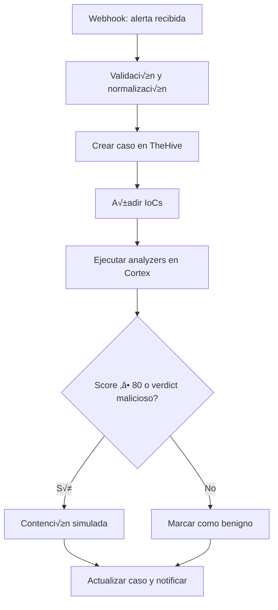
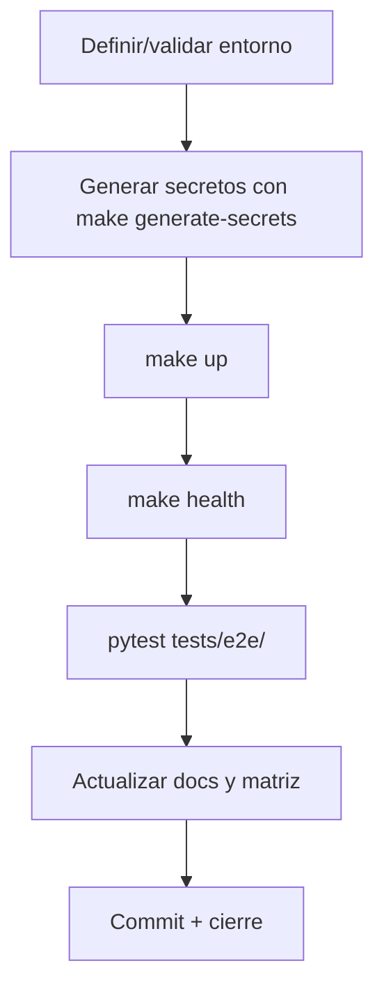

# Gestión del Proyecto — SOAR Ransomware Lab

## Índice

- [1. Resumen](#1-resumen)
 - [1.1 Objetivo](#11-objetivo)
 - [1.2 Contexto](#12-contexto)
- [2. Alcance](#2-alcance)
 - [2.1 Qué cubre](#21-qué-cubre)
 - [2.2 Límites](#22-límites)
 - [2.3 Dependencias](#23-dependencias)
- [3. Contenido principal](#3-contenido-principal)
 - [3.1 Objetivos del proyecto](#31-objetivos-del-proyecto)
 - [3.2 Alcance](#32-alcance)
 - [3.3 Plan de trabajo](#33-plan-de-trabajo)
 - [3.4 Matriz de requisitos](#34-matriz-de-requisitos)
 - [3.5 Gobernanza y validación](#35-gobernanza-y-validación)
 - [3.6 Riesgos](#36-riesgos)
 - [3.7 Deuda técnica](#37-deuda-técnica)
 - [3.8 Matriz de inconsistencias](#38-matriz-de-inconsistencias)
 - [3.9 Remediación documental (resumen)](#39-remediación-documental-resumen)
 - [3.10 Estado de revisión documental](#310-estado-de-revisión-documental)
 - [3.11 Auditoría final](#311-auditoría-final)
- [4. Validación](#4-validación)
 - [4.1 Verificación](#41-verificación)
 - [4.2 Criterios de aceptación](#42-criterios-de-aceptación)
 - [4.3 Evidencias](#43-evidencias)
- [5. Problemas y consideraciones](#5-problemas-y-consideraciones)
 - [5.1 Limitaciones](#51-limitaciones)
 - [5.2 Riesgos o incidencias](#52-riesgos-o-incidencias)
 - [5.3 Recomendaciones / troubleshooting](#53-recomendaciones-troubleshooting)
- [6. Referencias](#6-referencias)

---

## 1. Resumen

### 1.1 Objetivo

Documentar la gestión del proyecto: objetivos, alcance, plan, requisitos, riesgos, deuda técnica y auditorías.

### 1.2 Contexto

Proyecto académico/profesional para construir un laboratorio SOAR de respuesta ante ransomware.

---

## 2. Alcance

### 2.1 Qué cubre

- Objetivos y alcance del proyecto
- Plan de trabajo y matriz de requisitos
- Riesgos y deuda técnica
- Auditorías y estado de remediación

### 2.2 Límites

- No cubre aspectos técnicos de implementación (ver 02-architecture.md)
- No cubre operaciones (ver 04-operations.md)

### 2.3 Dependencias

- `docs/06-project-management.md` — documentos de gestión

---

## 3. Contenido principal

### 3.1 Objetivos del proyecto


Este documento presenta los objetivos SMART del proyecto y su relación con la Estructura de Desglose del Trabajo (EDT),
indicando dónde se almacenarán las pruebas y evidencias en el repositorio para garantizar la trazabilidad y validación
académica.


El proyecto se basa en la EDT definida y el contexto del laboratorio SOAR para respuesta ante incidentes de ransomware.
Cada objetivo est√° alineado con las tareas del EDT y vinculado con la estructura del repositorio, asegurando
trazabilidad y organización académica rigurosa. Las evidencias se almacenarán en ubicaciones específicas del repositorio
para facilitar su validación.


Este documento cubre:

- 20 objetivos SMART definidos para el proyecto
- Métricas y umbrales para cada objetivo
- Métodos de medida y ubicación de evidencias
- Relación entre objetivos y EDT
- Estructura del repositorio para almacenamiento de evidencias


Este documento no cubre:

- Detalles técnicos de implementación (ver docs/02-architecture.md)
- Estrategias de seguridad (ver docs/02-architecture.md)
- Planificación detallada del proyecto (ver docs/06-project-management.md)
- Alcance del proyecto (ver docs/06-project-management.md)


Este documento depende de:

- EDT definida (docs/06-project-management.md)
- Alcance del proyecto (docs/06-project-management.md)
- Documentación de arquitectura (docs/02-architecture.md)
- Estrategia de pruebas (docs/05-testing.md)


#### 3.1 Objetivos principales

#### Ubicación de Evidencias

Las evidencias se almacenar√°n en:

- **Pruebas Unitarias y E2E**: `tests/unit/` (pruebas unitarias), `tests/e2e/TC-01/test_malicious.py` (escenario
 malicioso), `tests/e2e/TC-02/` (escenario benigno)
- **Resultados y Métricas**: `runtime/results/kpis.csv` (archivo CSV con KPIs calculados)
- **Documentación Técnica y Validación**: `docs/04-operations.md` (playbook E2E),
 `docs/05-testing.md` (estrategia de pruebas)
- **Logs del Flujo**: `runtime/logs/playbook_execution.log` (logs de ejecución del playbook)

#### Relación con EDT y Repositorio

Cada objetivo corresponde a tareas específicas del EDT:

- **Infraestructura (EDT 4.x)**: Objetivos 1, 8, 13, 14.
- **Playbook y scripts (EDT 5.x, 6.x)**: Objetivos 2, 5, 6.
- **Pruebas y métricas (EDT 7.x)**: Objetivos 3, 9, 10, 15, 16, 17, 18, 19.
- **Documentación y cierre (EDT 8.x)**: Objetivos 4, 11, 12, 20.

La estructura del repositorio soporta esta organización, con carpetas dedicadas para pruebas (`tests/`), resultados (
`runtime/results/`), documentación (`docs/`) y scripts (`scripts/`), garantizando la trazabilidad necesaria para un
TFM académico riguroso.

**Estructura del repositorio:**

- `tests/unit/` - pruebas unitarias de componentes individuales (conteo din√°mico: `pytest --collect-only -q tests/unit/ | find /c /v ""` en Windows o `| wc -l` en Linux/macOS)
- `tests/e2e/TC-01/test_malicious.py` - Test E2E escenario malicioso
- `tests/e2e/TC-02/` - Test E2E escenario benigno
- `tests/e2e/TC-03/` - Test E2E casos extremos
- `runtime/results/kpis.csv` - Archivo CSV con KPIs calculados por `src/soar_lab/domain/services/kpi_analyzer.py`
- `src/soar_lab/simulator/simulate_alerts.py` - Módulo para enviar alertas simuladas
- `src/soar_lab/application/use_cases/backup_service.py` - Servicio de backup/restore
- `infra/docker/compose/docker-compose.yml` - Compose principal
- `infra/docker/compose/docker-compose.core.yml` - Compose servicios core
- `infra/docker/compose/docker-compose.misp.yml` - Compose MISP
- `infra/docker/compose/docker-compose.api.yml` - Compose API y docs
- `infra/docker/compose/logging/docker-compose.logging.yml` - Compose stack de logging
- `Makefile` - Automatización de despliegue y gestión

#### 3.2 Objetivos específicos

#### Flujo de Cumplimiento de Objetivos

1. **Fase de Infraestructura**: Implementación del laboratorio, API, CLI y automatización (Objetivos 1, 8, 13, 14)
2. **Fase de Desarrollo**: Playbook E2E, integración SIEM y contención simulada (Objetivos 2, 5, 6)
3. **Fase de Validación**: Métricas MTTR, pruebas especializadas y KPIs (Objetivos 3, 9, 10, 15, 16, 17, 18, 19)
4. **Fase de Cierre**: Documentación técnica, analytics, preparación defensa y evidencia de aprobación (Objetivos 4, 11,
 12, 20)

#### 3.3 Métricas de éxito

#### Tabla de Objetivos SMART y Ubicación de Evidencias

| Nº | Objetivo | Descripción | Métrica | Umbral | Método de Medida | Evidencia | |----|--------------------------------|----------------------------------------------------------------------------------------------------------------------------------------------------------------------------------------------------------------|-----------------------|------------------------------------|------------------------------------------------------------------------------|---------------------------------------------------------------------------------------------------------------------------| | 1 | Implementación del Laboratorio | Desplegar entorno reproducible con TheHive, Cortex y Shuffle mediante Docker Compose (`infra/docker/compose/docker-compose.yml`, `infra/docker/compose/docker-compose.core.yml`). | Servicios activos | 100% contenedores funcionando | Verificación con `docker ps` y `make up` | Implementado | | 2 | Desarrollo del Playbook E2E | Crear flujo automatizado desde alerta hasta contención simulada en Shuffle (`docs/04-operations.md`). | Ejecución completa | 2 escenarios (malicioso y benigno) | Logs del SOAR y casos en TheHive | Implementado | | 3 | Validación de Métricas MTTR | Medir tiempo de respuesta desde alerta hasta contención mediante timestamps en logs. | Percentiles p50 y p90 | p50 ≤ 120 s; p90 ≤ 180 s | Timestamps y cálculo estadístico con `src/soar_lab/domain/services/kpi_analyzer.py` | Implementado | | 4 | Documentación Técnica | Generar documentación completa (arquitectura, configuración, resultados, API, docs-site, CLI, analytics). | Documento final | 100% apartados completados | Checklist y revisión | En progreso | | 5 | Integración SIEM Simulada | Configurar SIEM simulado para generar alertas mediante `src/soar_lab/simulator/simulate_alerts.py`. | Alertas procesadas | 100% sin errores | Logs en Shuffle y casos en TheHive | Simulado | | 6 | Contención Simulada | Implementar contención simulada en el playbook E2E (`docs/04-operations.md`). | Acciones ejecutadas | 100% completadas | Logs del servicio y confirmación en flujo | Simulado | | 7 | Seguridad del Entorno | Garantizar uso exclusivo de muestras inertes, gestión de certificados SSL (`scripts/setup/gen_certs.sh`) y validación de esquemas (`src/soar_lab/config/schemas/__init__.py`). | Incidentes | 0 incidentes | Revisión del contenido y validación | Parcial | | 8 | Automatización Integral | Implementar despliegue con Makefiles, Docker Compose, CI/CD (`.github/workflows/`), testing automatizado (`tests/`, `scripts/maintenance/`), backup/restore (`src/soar_lab/application/use_cases/backup_service.py`) . | Despliegue automático | 100% servicios levantados | Ejecución de scripts y verificación | Parcial | | 9 | Pruebas Atómicas | Ejecutar pruebas atómicas de componentes individuales (`tests/atomic/`: alertas, IoCs, KPIs, esquemas, secrets). | Casos probados | 90% pruebas pasan | `pytest tests/atomic/ -v` | Parcial | | 10 | Pruebas de Integración | Ejecutar pruebas de integración entre TheHive, Cortex, Shuffle, API y otros componentes (`tests/integration/`). | Casos probados | 85% pruebas pasan | `pytest tests/integration/ -v` | Parcial | | 11 | Pruebas de Seguridad | Ejecutar pruebas de seguridad para validar autenticación, autorización, validación de entrada y controles de acceso (`tests/security/`). | Casos probados | 100% pruebas pasan | `pytest tests/security/ -v` | Parcial | | 12 | Pruebas de Rendimiento | Ejecutar pruebas de rendimiento para validar tiempos de respuesta de API, analyzers y componentes críticos (`tests/performance/`). | Tiempos de respuesta | ≤ umbrales definidos | `pytest tests/performance/ -v` | Parcial | | 13 | Pruebas de Producción | Ejecutar smoke tests para validación rápida de despliegues en producción (`tests/e2e/`). | Casos probados | 100% pruebas pasan | `pytest tests/e2e/ -v` | Parcial | | 14 | KPIs y Análisis | Calcular KPIs, analytics de TFM (`docs/thesis/data_visualizations.md`) y métricas de servicios (`src/soar_lab/application/use_cases/analytics_service.py`). | KPIs calculados | Informe con gráficos | Análisis estadístico y visualización | Implementado | | 15 | Preparación Defensa TFM | Crear presentación, resumen ejecutivo y analytics para evidencia académica (`docs/thesis/data_visualizations.md`). | Presentación lista | 100% diapositivas completadas | Validación y ensayo | Pendiente | | 16 | Evidencia de Aprobación | Obtener validación formal del alcance y objetivos. | Archivo firmado | Documento archivado | Confirmación por correo y almacenamiento | Pendiente | | 17 | API del Laboratorio | Implementar y desplegar la API REST del laboratorio con FastAPI para gestión de servicios, health checks, métricas, tests y backups (`src/soar_lab/interfaces/api/`). | Endpoints funcionales | Cobertura ≥ 80% | Tests de integración, `/docs` | Implementado | | 18 | CLI del Laboratorio | Implementar CLI para gestión del laboratorio con comandos para alertas, configuración, validación y operaciones comunes (`src/soar_lab/interfaces/api/cli.py`). | Comandos funcionales | 100% comandos ejecutan | Tests unitarios, `--help` | Implementado | | 19 | Sitio de Documentación | Desplegar sitio de documentación Docusaurus con documentación completa del laboratorio, getting started y guías de uso (`apps/docs-site/`). | Sitio funcional | 100% páginas renderizan | Tests de navegador, revisión enlaces | Implementado | | 20 | Interfaz Web de Gestión | Desplegar interfaz web de gestión para monitoreo del laboratorio, visualización de servicios y operaciones básicas (`apps/web-management/`). | UI funcional | Dashboard muestra estado real | Tests de navegador, pruebas manuales | Implementado |

#### 3.4 Cronograma

#### Diagrama de Gantt del Cronograma de Objetivos

```mermaid
gantt
 title Cronograma de Objetivos SMART - SOAR Ransomware Lab
 dateFormat YYYY-MM-DD
 section Fase 1: Infraestructura
 Objetivo 1: Laboratorio desplegado :active, obj1, 2025-05-01, 14d
 Objetivo 8: Automatización configurada :obj8, after obj1, 7d
 Objetivo 17: API del Laboratorio :obj17, after obj8, 7d
 Objetivo 18: CLI del Laboratorio :obj18, after obj17, 5d
 section Fase 2: Desarrollo
 Objetivo 2: Playbook E2E :obj2, 2025-05-15, 21d
 Objetivo 5: Integración SIEM :obj5, after obj2, 7d
 Objetivo 6: Contención simulada :obj6, after obj5, 7d
 Objetivo 19: Sitio de Documentación :obj19, after obj6, 7d
 Objetivo 20: Interfaz Web de Gestión :obj20, after obj19, 7d
 section Fase 3: Validación
 Objetivo 3: Métricas MTTR :obj3, 2025-06-05, 14d
 Objetivo 9: Pruebas Atómicas :obj9, after obj3, 5d
 Objetivo 10: Pruebas de Integración :obj10, after obj9, 7d
 Objetivo 11: Pruebas de Seguridad :obj11, after obj10, 5d
 Objetivo 12: Pruebas de Rendimiento :obj12, after obj11, 5d
 Objetivo 13: Pruebas de Producción :obj13, after obj12, 3d
 Objetivo 14: KPIs y An√°lisis :obj14, after obj13, 7d
 section Fase 4: Cierre
 Objetivo 4: Documentación técnica :obj4, 2025-06-26, 7d
 Objetivo 15: Preparación defensa TFM :obj15, after obj4, 7d
 Objetivo 16: Evidencia aprobación :obj16, after obj15, 7d
```

#### Fases del Proyecto

| Fase | Duración | Objetivos | Entregables | |-----------------------------|-----------|--------------------------|--------------------------------------------------------------------| | **Fase 1: Infraestructura** | 4 semanas | 1, 8, 17, 18 | Laboratorio desplegado, automatización, API, CLI | | **Fase 2: Desarrollo** | 5 semanas | 2, 5, 6, 19, 20 | Playbook E2E, integración SIEM, scripts, docs-site, web-management | | **Fase 3: Validación** | 4 semanas | 3, 9, 10, 11, 12, 13, 14 | Métricas MTTR, pruebas especializadas, KPIs | | **Fase 4: Cierre** | 2 semanas | 4, 15, 16 | Documentación técnica, presentación, aprobación |

#### 3.5 Hitos

#### Matriz de Trazabilidad: Objetivos vs Entregables

| Objetivo | Entregable Principal | Entregable Secundario | Ubicación en Repositorio | EDT Relacionada | Estado | |----------|-------------------------------------|--------------------------------------|-----------------------------------------------------------------------------|-----------------|-----------| | 1 | Laboratorio SOAR desplegado | Capturas de servicios | `docs/04-operations.md` | EDT 4.1 | Implementado | | 2 | Playbook E2E implementado | Logs de ejecución | `tests/e2e/TC-01/test_malicious.py`, `tests/e2e/TC-02/` | EDT 5.1 | Implementado | | 3 | Métricas MTTR validadas | Archivo KPIs | `runtime/results/kpis.csv` | EDT 7.1 | Implementado | | 4 | Documentación técnica completa | Revisión | `docs/02-architecture.md`, `docs/03-api-and-integrations.md`, `apps/docs-site/` | EDT 8.1 | En progreso | | 5 | Integración SIEM simulada | Script de alertas | `src/soar_lab/simulator/simulate_alerts.py` | EDT 5.2 | Simulado | | 6 | Scripts de contención | Logs de ejecución | `docs/04-operations.md` | EDT 6.1 | Simulado | | 7 | Seguridad validada | Documento de seguridad, certificados | `docs/02-architecture.md`, `infra/docker/config/nginx/ssl/` | EDT 4.2 | Parcial | | 8 | Automatización integral configurada | Scripts CI/CD, backup | `Makefile`, `.github/workflows/`, `scripts/`, `infra/docker/` | EDT 4.3 | Parcial | | 9 | Pruebas atómicas completadas | Informe de pruebas | `tests/atomic/`, `reports/test_results/atomic_tests.json` | EDT 7.2 | Parcial | | 10 | Pruebas de integración completadas | Informe de pruebas | `tests/integration/`, `reports/test_results/integration_tests.json` | EDT 7.2 | Parcial | | 11 | Pruebas de seguridad completadas | Informe de pruebas | `tests/security/`, `reports/test_results/security_tests.json` | EDT 7.2 | Parcial | | 12 | Pruebas de rendimiento completadas | Informe de pruebas | `tests/performance/`, `reports/test_results/performance_tests.json` | EDT 7.2 | Parcial | | 13 | Pruebas de producción completadas | Informe de pruebas | `tests/e2e/`, `runtime/results/smoke_tests.json` | EDT 7.2 | Parcial | | 14 | KPIs calculados y analizados | Gráficos y análisis | `runtime/results/kpis.csv`, `docs/thesis/data_visualizations.md`, `src/soar_lab/application/use_cases/analytics_service.py` | EDT 7.3 | Implementado | | 15 | Presentación TFM preparada | Diapositivas, analytics | `docs/06-project-management.md`, `runtime/data/` | EDT 8.2 | Pendiente | | 16 | Evidencia de aprobación | Documento firmado | `docs/06-project-management.md` (scope.md, objectives.md, plan.md) | EDT 8.3 | Pendiente | | 17 | API del Laboratorio desplegada | API funcional | `src/soar_lab/interfaces/api/`, `docs/03-api-and-integrations.md` | EDT 4.1 | Implementado | | 18 | CLI del Laboratorio implementada | CLI funcional | `src/soar_lab/interfaces/api/cli.py`, `docs/04-operations.md` | EDT 4.1 | Implementado | | 19 | Sitio de Documentación desplegado | Sitio funcional | `apps/docs-site/`, capturas de pantalla | EDT 8.1 | Implementado | | 20 | Interfaz Web de Gestión desplegada | UI funcional | `apps/web-management/`, capturas de pantalla | EDT 4.1 | Implementado |

**Leyenda de EDT:**

- EDT 4.x: Infraestructura y automatización
- EDT 5.x: Desarrollo de playbook e integraciones
- EDT 6.x: Scripts de contención y respuesta
- EDT 7.x: Pruebas, validación y métricas
- EDT 8.x: Documentación y cierre del proyecto

#### Hitos Principales

- **Hito 1**: Laboratorio SOAR desplegado, API y CLI funcionales (Semana 4)
- **Hito 2**: Playbook E2E implementado, docs-site y web-management desplegados (Semana 9)
- **Hito 3**: Métricas MTTR validadas, pruebas especializadas completadas y KPIs calculados (Semana 13)
- **Hito 4**: Documentación completa, analytics de TFM y aprobación formal (Semana 15)

### 3.2 Alcance

#### 1. Resumen

#### 1.1 Objetivo

Este documento define el alcance del Trabajo Fin de Máster (TFM), estableciendo los objetivos y límites del proyecto
para garantizar su viabilidad y cumplimiento académico.

#### 1.2 Contexto

El objetivo principal de este TFM es diseñar, implementar y evaluar un laboratorio SOAR mínimo viable (MSV) para la
respuesta ante incidentes de ransomware. Este laboratorio ejecutar√° un playbook automatizado de extremo a extremo (E2E)
que cubra el flujo completo: Webhook → Validación → Caso en TheHive → Adjuntar IoCs → Analyzers en Cortex → Decisión →
Contención Simulada → Notificación.

Este alcance busca que el proyecto sea:

- **Realista**: Adaptado a un TFM unipersonal sin dependencias externas complejas
- **Reproducible**: Basado en entornos Docker y scripts documentados
- **Seguro**: Sin uso de malware real ni riesgos para sistemas productivos
- **Académicamente Riguroso**: Cumplimiento de objetivos medibles y evidencias verificables

Para considerar el entregable completado, el laboratorio debe permitir la ejecución correcta del playbook en dos
escenarios (malicioso y benigno), cumplir los umbrales de tiempo p50 ≤ 120 s y p90 ≤ 180 s, y generar evidencias
completas (logs, capturas y métricas).

#### 2. Alcance

#### 2.1 Qué cubre

Este documento cubre:

- Componentes incluidos en el proyecto
- Componentes excluidos del proyecto
- Justificación del alcance (viabilidad técnica y académica)
- Criterios de aceptación funcionales y académicos
- Matriz de alcance
- Arquitectura del laboratorio
- Infraestructura recomendada
- Métricas de éxito
- Limitaciones y restricciones
- Consideraciones éticas

#### 2.2 Límites

Este documento no cubre:

- Detalles técnicos de implementación (ver docs/02-architecture.md)
- Estrategias de seguridad (ver docs/02-architecture.md)
- Planificación detallada del proyecto (ver docs/06-project-management.md)
- Gestión de riesgos (ver docs/06-project-management.md)
- Detalle del playbook E2E (ver docs/04-operations.md)

#### 2.3 Dependencias

Este documento depende de:

- Objetivos SMART del proyecto (docs/06-project-management.md)
- Plan del proyecto (docs/06-project-management.md)
- Gestión de riesgos (docs/06-project-management.md)
- Documentación de arquitectura (docs/02-architecture.md)

#### 3. Contenido principal

#### 3.1 Definición del alcance

#### Supuestos

- Las credenciales y certificados se generan con `make generate-secrets` y no se versionan en texto plano.
- Los puertos y hosts se definen en `.env.full`; la tabla canónica es `docs/04-operations.md`.
- Las pruebas E2E requieren el stack Docker completo; el resto de pruebas pueden ejecutarse con `pytest --collect-only`.
- La contención de endpoints es simulada; no se despliegan agentes EDR ni acciones destructivas reales.

#### Componentes Incluidos

- **Playbook E2E √önico**: Flujo completo con decisiones automatizadas basadas en score/verdict en Shuffle
- **Integraciones Simuladas**: SIEM simulado para generación de alertas (
 `src/soar_lab/simulator/simulate_alerts.py`) y scripts para contención simulada
- **API del Laboratorio**: API REST FastAPI para gestión de servicios, health checks, métricas, tests y backups (
 `src/soar_lab/interfaces/api/`, `apps/api/Dockerfile`)
- **CLI del Laboratorio**: CLI para gestión del laboratorio con comandos para alertas, configuración, validación y
 operaciones (`src/soar_lab/interfaces/api/cli.py`)
- **Sitio de Documentación**: Sitio de documentación Docusaurus con getting started y guías de uso (`apps/docs-site/`)
- **Interfaz Web de Gestión**: Interfaz web para monitoreo del laboratorio, visualización de servicios y operaciones
 b√°sicas (`apps/web-management/`)
- **Métricas de Rendimiento (MTTR-demo)**: Cálculo de p50 ≤ 120 s y p90 ≤ 180 s desde alerta hasta contención mediante
 `src/soar_lab/domain/services/kpi_analyzer.py` ‚Üí `runtime/results/kpis.csv`
- **Analytics de TFM**: Módulos para generación de datos estructurados, visualización de resultados y evidencia
 académica (`src/soar_lab/application/use_cases/analytics_service.py`)
- **Testing Especializado**: Pruebas unitarias (conteo dinámico vía `pytest --collect-only -q tests/unit/ | find /c /v ""` / `| wc -l`), atómicas, integración, seguridad, rendimiento y E2E (
 `tests/unit/`, `tests/atomic/`, `tests/integration/`, `tests/security/`, `tests/performance/`, `tests/e2e/`)
- **Automatización Integral**: CI/CD, testing automatizado, backup/restore (`src/soar_lab/application/use_cases/backup_service.py`,
 `src/soar_lab/infrastructure/tar_backup_driver.py`)
- **Seguridad Avanzada**: Validación de esquemas (`src/soar_lab/config/schemas/__init__.py`,
 `src/soar_lab/validation/validators.py`)
- **Entorno Reproducible**: Arquitectura Docker Compose con TheHive, Cortex, Shuffle SOAR, MISP, Elasticsearch,
 Redis, MariaDB, Nginx, Grafana, Loki, Promtail (`infra/docker/compose/`)
- **Documentación Completa**: Diseño del laboratorio, configuración, flujo del playbook, resultados, KPIs, API, CLI y
 analytics (`docs/`, `docs/03-api-and-integrations.md`, `apps/docs-site/`)
- **Validación Académica**: Cumplimiento de objetivos SMART con evidencias verificables (`docs/06-project-management.md`,
 `tests/`)

#### Componentes Excluidos

- **Integraciones Comerciales Reales**: SIEM, EDR, Firewall comerciales
- **Alta Disponibilidad (HA)**: Entornos multi-host complejos o clustering
- **Malware Funcional**: Solo muestras inertes para simulación segura
- **M√∫ltiples Playbooks E2E**: Enfoque en un √∫nico playbook E2E completo
- **Producción**: No se recomienda para entornos productivos sin hardening adicional

#### Justificación del Alcance

**Viabilidad Técnica:**

- Reducir el tiempo de respuesta ante incidentes mediante automatización demostrable
- Evitar riesgos asociados al uso de malware real en entorno académico
- Facilitar la reproducibilidad para otros profesionales y entornos educativos
- Cumplir con objetivos medibles y realistas en un marco temporal limitado

**Viabilidad Académica:**

- Profundización en conceptos fundamentales de SOAR
- Validación experimental de hipótesis de investigación
- Generación de conocimiento aplicado y transferible
- Cumplimiento de plazos académicos establecidos

#### 3.2 Objetivos del proyecto

#### Flujo del Playbook

El flujo del playbook sigue este recorrido:

1. Webhook recibe alerta del SIEM simulado
2. Validación y normalización de la alerta
3. Creación de caso en TheHive
4. Adjuntar IoCs al caso
5. Ejecutar analyzers en Cortex
6. Decisión basada en score/verdict
7. Contención simulada o marca como benigno
8. Actualizar caso y notificar

#### Consideraciones Éticas

Este proyecto cumple con las siguientes consideraciones éticas:

- Uso exclusivo de muestras inertes para simulación
- No exposición de datos reales o sensibles
- Cumplimiento de buenas pr√°cticas de seguridad
- Contribución al conocimiento académico en ciberseguridad

#### 3.3 Entregables

#### Matriz de Alcance

| Categoría | Incluido | Excluido | Justificación | |---------------------|-------------------------------------------------------------------------|--------------------------|------------------------------------| | **Playbooks** | 1 flujo E2E completo | Múltiples playbooks E2E | Enfoque en profundidad vs amplitud | | **Integraciones** | SIEM simulado, contención simulada, API, CLI, docs-site, web-management | APIs comerciales reales | Viabilidad técnica y económica | | **Seguridad** | Muestras inertes, certificados SSL, validación de esquemas | Malware funcional | Seguridad del entorno académico | | **Infraestructura** | Single-host con Docker Compose, Nginx, CI/CD, backup/restore | Alta disponibilidad (HA) | Simplicidad y reproducibilidad | | **Documentación** | Completa y académica (API, CLI, analytics, docs-site) | Superficial o incompleta | Rigor académico requerido | | **Validación** | Pruebas atómicas, integración, seguridad, rendimiento, producción | Pruebas limitadas | Evidencia verificable necesaria | | **Automatización** | CI/CD, testing automatizado, backup/restore | Automatización manual | Eficiencia y calidad | | **Analytics** | Módulos para evidencia académica y visualización | Análisis superficial | Rigor académico requerido |

#### Diagrama del Flujo del Playbook

Este diagrama ilustra el recorrido completo de una alerta desde su recepción hasta la contención y notificación. Cada
paso refleja la lógica del playbook y las decisiones basadas en análisis automatizados.



#### Arquitectura del Laboratorio

La arquitectura propuesta se basa en un único host con contenedores Docker para simplificar la implementación y
garantizar la reproducibilidad. Incluye herramientas clave como TheHive, Cortex y Shuffle, adem√°s de servicios de
soporte, API, CLI, sitio de documentación e interfaz web de gestión.

```mermaid
graph LR
 subgraph Host √önico
 TheHive --> Cortex
 Cortex --> Shuffle
 Shuffle --> Elasticsearch
 Shuffle --> Redis
 API --> TheHive
 API --> Cortex
 API --> Shuffle
 API --> MISP
 API -->
 Nginx --> API
 Nginx --> Docs_Site
 Nginx --> Web_Management
 Grafana --> Loki
 Promtail --> Loki
 end
 SIEM_Simulado --> Shuffle
 Shuffle --> Scripts_Contención
 CLI --> API
```

#### Infraestructura Recomendada

La infraestructura se diseña para ser segura y fácil de desplegar, evitando complejidad innecesaria y asegurando
compatibilidad con entornos académicos.

| Componente | Descripción | Requisitos Mínimos | Referencias | |------------------|---------------------------------------------------------------------------------------------------------------------------------------------|----------------------|-----------------------------------------------------------------------| | **VM Windows** | Simulación de endpoint víctima, agente EDR | 4GB RAM, 50GB SSD | Playbook E2E de contención: `docs/04-operations.md` | | **VM Linux** | Host principal con Docker, herramientas, CI/CD | 8GB RAM, 50GB SSD | `Makefile`, `infra/docker/compose/`, `.github/workflows/` | | **Contenedores** | TheHive, Cortex, Shuffle, MISP, Elasticsearch, PostgreSQL, Redis, MariaDB, Nginx, Grafana, Loki, Promtail, docs-site, web-management | Docker Engine 20.10+ | `infra/docker/compose/docker-compose*.yml` |

#### Métricas de Éxito

**Métricas Cuantitativas:**

- **Tiempo de Respuesta**: p50 ≤ 120s, p90 ≤ 180s (calculado por `src/soar_lab/domain/services/kpi_analyzer.py` desde
 timestamps en
 `runtime/logs/playbook_execution.log`)
- **Tasa de Éxito**: 100% de ejecuciones completas (pytest tests/e2e/ -v)
- **Disponibilidad**: ‚â• 99% durante pruebas (docker compose ps para verificar healthy status)

#### Matriz de Trazabilidad: Componentes vs Objetivos SMART

| Componente | Objetivo SMART 1 | Objetivo SMART 2 | Objetivo SMART 3 | Objetivo SMART 4 | Objetivo SMART 5 | Objetivo SMART 6 | Objetivo SMART 7 | Objetivo SMART 8 | Objetivo SMART 9 | Objetivo SMART 10 | Objetivo SMART 11 | Objetivo SMART 12 | |------------------------|------------------|------------------|------------------|------------------|------------------|------------------|------------------|------------------|------------------|-------------------|-------------------|-------------------| | **Playbook E2E** | - | ✓ | ✓ | ✓ | - | ✓ | - | - | ✓ | ✓ | ✓ | - | | **TheHive** | ✓ | ✓ | - | ✓ | - | - | - | - | - | - | - | - | | **Cortex** | ✓ | ✓ | - | - | - | - | - | - | - | - | - | - | | **Shuffle** | ✓ | ✓ | ✓ | - | ✓ | - | - | - | - | - | - | - | | **SIEM Simulado** | - | ✓ | ✓ | - | ✓ | - | - | - | - | - | - | - | | **Scripts Contención** | - | ✓ | - | - | - | ✓ | - | - | - | - | - | - | | **Docker Compose** | ✓ | - | - | - | - | - | - | ✓ | - | - | - | - | | **Documentación** | - | - | - | ✓ | - | - | - | - | - | ✓ | ✓ | ✓ | | **Pruebas E2E** | - | - | ✓ | - | - | - | - | - | ✓ | ✓ | - | - | | **KPIs** | - | - | ✓ | - | - | - | - | - | - | ✓ | - | - | | **Muestras Inertes** | - | - | - | - | - | - | ✓ | - | - | - | - | - | | **Makefile** | - | - | - | - | - | - | - | ✓ | - | - | - | - |

**Leyenda:**

- ‚úì = Componente contribuye directamente al objetivo
-
 - = Componente no contribuye al objetivo

**Objetivos SMART Resumidos:**

- 1: Implementación del Laboratorio
- 2: Desarrollo del Playbook E2E
- 3: Validación de Métricas MTTR
- 4: Documentación Técnica
- 5: Integración SIEM Simulada
- 6: Contención Simulada
- 7: Seguridad del Entorno
- 8: Automatización Opcional
- 9: Pruebas Funcionales
- 10: KPIs y An√°lisis
- 11: Preparación Defensa TFM
- 12: Evidencia de Aprobación
- **Cobertura Documental**: 100% de secciones completadas

**Métricas Cualitativas:**

- **Reproducibilidad**: Entorno desplegable en ≤ 30 minutos
- **Seguridad**: Sin incidentes de seguridad durante pruebas
- **Usabilidad**: Documentación clara y procedimientos validados
- **Aprendizaje**: Lecciones aprendidas documentadas y aplicables

#### 3.4 Criterios de exclusión

#### Componentes No Incluidos

- **Integraciones Comerciales Reales**: SIEM, EDR, Firewall comerciales
 - Justificación: Viabilidad técnica y económica para un TFM unipersonal

- **Alta Disponibilidad (HA)**: Entornos multi-host complejos o clustering
 - Justificación: Simplicidad y reproducibilidad del entorno académico

- **Malware Funcional**: Solo muestras inertes para simulación segura
 - Justificación: Seguridad del entorno académico y consideraciones éticas

- **Escenarios Avanzados**: M√∫ltiples playbooks o automatizaciones adicionales
 - Justificación: Enfoque en profundidad vs amplitud

- **Producción**: No se recomienda para entornos productivos sin hardening adicional
 - Justificación: El laboratorio es un entorno de prueba y validación académica

#### 3.5 Restricciones y suposiciones

#### Restricciones

- **Plazo**: 7 semanas para completar el proyecto
- **Recursos**: Mínimo 8GB RAM para ejecución completa
- **Entorno**: Windows + Docker Desktop (Hyper-V)
- **Personal**: Unipersonal sin equipo de desarrollo
- **Seguridad**: Uso exclusivo de muestras inertes

#### Suposiciones

- **Disponibilidad de servicios**: TheHive, Cortex y Shuffle est√°n disponibles y funcionando
- **Conectividad**: Acceso a Internet para descarga de im√°genes Docker
- **API keys**: Se pueden obtener y configurar las API keys necesarias
- **Documentación**: La documentación oficial de las herramientas está disponible y es precisa

#### 4. Validación

##### 4.1 Verificación

El alcance se verifica mediante:

- Revisión de componentes incluidos y excluidos (matriz de alcance en este documento)
- Validación de viabilidad técnica y académica (`docker compose ps`, `pytest tests/e2e/`)
- Confirmación de criterios de aceptación (`src/soar_lab/domain/services/kpi_analyzer.py` → `runtime/results/kpis.csv`)
- Verificación de métricas de éxito
- Revisión de consideraciones éticas

#### 4.2 Criterios de aceptación

**Criterios Funcionales:**

- El playbook debe ejecutarse completamente en escenarios maliciosos y benignos
- Los umbrales de tiempo (p50 ≤ 120s, p90 ≤ 180s) deben cumplirse consistentemente
- Todas las integraciones deben funcionar sin errores críticos
- La documentación debe ser completa y verificable

**Criterios Académicos:**

- Los objetivos SMART deben ser medibles y alcanzables
- Las evidencias deben estar almacenadas y referenciadas correctamente
- La metodología debe ser rigurosa y reproducible
- Las conclusiones deben basarse en datos y an√°lisis objetivos

#### 4.3 Evidencias

Las evidencias de validación incluyen:

- Documento de alcance aprobado (este documento)
- Matriz de alcance con justificaciones (sección 3.1)
- Diagramas de arquitectura y flujo (diagramas Mermaid en este documento)
- Tabla de infraestructura recomendada (sección 3.2)
- Métricas de éxito definidas (sección 3.2, validadas por `src/soar_lab/domain/services/kpi_analyzer.py`)
- Consideraciones éticas documentadas (sección 3.4)

#### 5. Problemas y consideraciones

##### 5.1 Limitaciones

**Limitaciones Técnicas:**

- Dependencia de APIs externas (VirusTotal, URLHaus)
- Limitaciones de recursos en entorno de desarrollo
- Simulación vs escenarios reales de producción

**Restricciones Académicas:**

- Plazo limitado para desarrollo y validación
- Recursos disponibles para un √∫nico desarrollador
- Alcance definido para TFM unipersonal

#### 5.2 Riesgos o incidencias

- **Deriva de alcance**: Añadir componentes no planificados.
- **Complejidad excesiva**: Añadir múltiples playbooks o integraciones.
- **Incumplimiento de umbrales**: MTTR fuera de objetivos.
- **Falta de reproducibilidad**: Entorno difícil de desplegar.
- **Deuda de documentación y configuración**: Fragmentación de Compose, duplicación de puertos/URLs o referencias legacy (`<SIEM_TOKEN>` placeholders, `<OLD_PATH>`) pueden desincronizar los documentos. Mitigación: `make generate-secrets`, validador `scripts/ci/docs_quality.py`.

#### 5.3 Recomendaciones / troubleshooting

#### Procedimientos Específicos de Gestión de Cambios de Alcance

**Proceso de Solicitud de Cambio de Alcance:**

```bash
# 1. Documentar el cambio de alcance propuesto
# Crear archivo: docs/06-project-management.md<fecha>_alcance_<id>.md
# Incluir: descripción, justificación, impacto en objetivos, impacto en cronograma, riesgos adicionales

# 2. Evaluar impacto en objetivos SMART
# Revisar: docs/06-project-management.md
# Determinar: qué objetivos se afectan, si se necesitan nuevos objetivos

# 3. Evaluar impacto en cronograma
# Revisar: docs/06-project-management.md
# Determinar: desviación en semanas, nuevos hitos necesarios

# 4. Evaluar viabilidad técnica y académica
# Verificar: recursos disponibles, plazos académicos, complejidad añadida

# 5. Aprobar cambio
# Si es menor: Aprobación del estudiante
# Si es mayor: Aprobación requerida

# 6. Implementar cambio
# Actualizar: docs/06-project-management.md, docs/06-project-management.md, docs/06-project-management.md
# Ejecutar: pruebas de regresión
# Documentar: evidencias del cambio
```

**Tipos de Cambios de Alcance:**

- **Menor**: Cambios que no afectan objetivos principales ni cronograma (ej: ajuste de configuración, corrección de
 documentación)
- **Moderado**: Cambios que afectan objetivos secundarios o añaden 1-2 semanas al cronograma (ej: adición de un analyzer
 adicional)
- **Mayor**: Cambios que afectan objetivos principales o añaden >2 semanas al cronograma (ej: adición de nuevo playbook,
 cambio de tecnología)

**Criterios de Aprobación:**

- **Cambios menores**: Aprobados autom√°ticamente si no afectan objetivos SMART
- **Cambios moderados**: Requieren evaluación de impacto y aprobación del estudiante
- **Cambios mayores**: Requieren aprobación y actualización de objetivos SMART

**Documentación de Cambios de Alcance:**

```markdown
# Solicitud de Cambio de Alcance - SC-001

**Fecha**: 2025-05-15
**Solicitante**: Estudiante
**Tipo**: Menor/Moderado/Mayor

**Descripción del cambio:**
[Descripción detallada del cambio de alcance propuesto]

**Justificación:**
[Razón para el cambio de alcance]

**Impacto en objetivos SMART:**
- Objetivos afectados: [Lista]
- Nuevos objetivos requeridos: [Lista]

**Impacto en cronograma:**
- Fases afectadas: [Lista]
- Desviación en semanas: [Número]
- Nuevos hitos: [Lista]

**Riesgos adicionales:**
- [Riesgo 1]
- [Riesgo 2]

**Viabilidad técnica**: [Sí/No]
**Viabilidad académica**: [Sí/No]

**Aprobación:**
- Estudiante: [Firma/Fecha]
- Validación: [Firma/Fecha]

**Estado**: [Pendiente/Aprobado/Rechazado/Implementado]
```

**Seguimiento de Cambios de Alcance:**

- Mantener registro en `docs/06-project-management.md`
- Actualizar `docs/06-project-management.md` con cambios aprobados
- Comunicar cambios inmediatamente
- Actualizar matriz de trazabilidad componentes vs objetivos SMART

#### Checklist de Validación de Alcance Antes de Desarrollo

**Pre-Desarrollo - Checklist Inicial:**

- [ ] Alcance definido y aprobado en docs/06-project-management.md
- [ ] Objetivos SMART definidos en docs/06-project-management.md
- [ ] Plan del proyecto definido en docs/06-project-management.md
- [ ] Matriz de riesgos definida en docs/06-project-management.md
- [ ] Matriz de trazabilidad componentes vs objetivos SMART completada
- [ ] Infraestructura recomendada verificada (VM Windows, VM Linux)
- [ ] Recursos mínimos disponibles (8GB RAM, 50GB SSD)
- [ ] Consideraciones éticas documentadas
- [ ] Criterios de exclusión justificados
- [ ] Métricas de éxito definidas (p50 ≤ 120s, p90 ≤ 180s)

**Pre-Desarrollo - Validación de Componentes:**

- [ ] TheHive: versión y configuración definidas
- [ ] Cortex: versión y analyzers definidos
- [ ] Shuffle: versión y workflow definido
- [ ] SIEM Simulado: script de generación de alertas definido
- [ ] Scripts Contención: scripts de aislamiento definidos
- [ ] Docker Compose: archivos compose definidos
- [ ] Documentación: estructura y contenido planificados

**Pre-Desarrollo - Validación de Viabilidad:**

- [ ] Viabilidad técnica: recursos suficientes para todos los componentes
- [ ] Viabilidad académica: objetivos medibles y alcanzables en 7 semanas
- [ ] Viabilidad ética: uso exclusivo de muestras inertes
- [ ] Viabilidad de reproducibilidad: entorno desplegable en ≤ 30 minutos
- [ ] Viabilidad de validación: pruebas E2E definidas y ejecutables

**Deriva de alcance:**

```bash
# Revisar docs/06-project-management.md antes de añadir componentes
# Validar contra matriz de alcance
# Consultar si es necesario
```

**Complejidad excesiva:**

```bash
# Priorizar profundidad vs amplitud
# Mantener √∫nico playbook E2E
# Usar integraciones simuladas vs reales
```

**Incumplimiento de umbrales:**

```bash
# Revisar runtime/results/kpis.csv
# Analizar cuellos de botella en logs
# Optimizar analyzers activos
```

**Falta de reproducibilidad:**

```bash
# Verificar archivos docker-compose*.yml
# Validar .env.full
# Ejecutar make up en entorno limpio
```

#### 6. Referencias

- **Repositorio del Proyecto**: [alesanfe/soar-ransomware-lab](https://github.com/alesanfe/soar-ransomware-lab.git)
- **Documentación de Shuffle**: https://shuffler.io/docs
- **Documentación de TheHive**: https://docs.strangebee.com/thehive/
- **Documentación de Cortex**: https://docs.strangebee.com/cortex/
- **Documentación de MISP**: https://www.misp-project.org/documentation/
- **Documentación de Elasticsearch**: https://www.elastic.co/guide/en/elasticsearch/reference/current/index.html
- **Documentación de Arquitectura**: [docs/02-architecture.md](02-architecture.md)
- **Objetivos SMART**: [docs/06-project-management.md](#31-objetivos-del-proyecto)
- **Plan del Proyecto**: [docs/06-project-management.md](#33-plan-de-trabajo)
- **Gestión de Riesgos**: [docs/06-project-management.md](#36-riesgos)
- **Playbook E2E**: [docs/04-operations.md](04-operations.md)

---

**Mejoras realizadas:**

- Reestructurado seg√∫n formato obligatorio con 6 secciones principales
- Índice actualizado para reflejar nueva estructura
- Contenido organizado en subsecciones lógicas
- Sección de Validación añadida con criterios y evidencias
- Sección de Problemas y Consideraciones consolidada con troubleshooting específico
- Matriz de alcance, diagramas y tablas mantenidos en sección 3.3

**Contradicciones detectadas:**

- Ninguna detectada en este documento


### 3.3 Plan de trabajo

#### 1. Resumen

#### 1.1 Objetivo

El objetivo de este documento es planificar las semanas y los hitos clave para el desarrollo del laboratorio SOAR,
incluyendo entorno, integraciones, playbook, pruebas e informe. La ruta crítica es: docker → servicios → conexiones →
playbook ‚Üí pruebas ‚Üí informe.

#### 1.2 Contexto

El proyecto se desarrolla en 15 semanas, desde la definición de alcance y objetivos hasta el informe y cierre. Cada fase
tiene objetivos específicos con entregables e evidencias definidas, alineados con la EDT y los 20 objetivos SMART del
proyecto.

#### 2. Alcance

#### 2.1 Qué cubre

Este documento cubre:

- Planificación por semanas con fases y hitos
- Planificación por tareas de la EDT
- Ruta crítica del proyecto
- Diagramas Gantt por semanas y por tareas EDT
- Entregables y evidencias por fase

#### 2.2 Límites

Este documento no cubre:

- Detalles técnicos de implementación (ver docs/02-architecture.md)
- Estrategias de seguridad (ver docs/02-architecture.md)
- Objetivos SMART (ver docs/06-project-management.md)
- Alcance del proyecto (ver docs/06-project-management.md)
- Gestión de riesgos (ver docs/06-project-management.md)

#### 2.3 Dependencias

Este documento depende de:

- Alcance del proyecto (docs/06-project-management.md)
- Objetivos SMART (docs/06-project-management.md)
- Gestión de riesgos (docs/06-project-management.md)
- Arquitectura del sistema (docs/02-architecture.md)

#### 3. Contenido principal

#### 3.1 Estrategia de planificación

#### Ruta Crítica

La ruta crítica del proyecto es:

1. **Docker**: Configuración de Docker Compose (`infra/docker/compose/docker-compose.yml`,
 `infra/docker/compose/docker-compose.core.yml`, `infra/docker/compose/docker-compose.misp.yml`,
 `infra/docker/compose/docker-compose.opensearch.yml`, `infra/docker/compose/docker-compose.api.yml`,
 `infra/docker/compose/logging/docker-compose.logging.yml`)
2. **Servicios**: Inicialización de TheHive, Cortex, Shuffle, MISP, Elasticsearch, PostgreSQL, Redis, MariaDB
3. **Conexiones**: Webhook, esquema de alerta (`src/soar_lab/config/schemas/__init__.py`) y SIEM simulado (
 `src/soar_lab/simulator/simulate_alerts.py`)
4. **Playbook**: Flujo E2E con contención simulada en Shuffle
5. **Pruebas**: Ejecución de casos (`tests/e2e/TC-01/test_malicious.py`, `tests/e2e/TC-02/`) y cálculo de
 KPIs (`src/soar_lab/domain/services/kpi_analyzer.py`)
6. **Informe**: Documentación técnica (`docs/04-operations.md`,
 `docs/04-operations.md`) y cierre

#### Fases del Proyecto

- **Fase 1: Infraestructura** (4 semanas): Laboratorio, automatización, API, CLI ✅ Finalizada
- **Fase 2: Desarrollo** (5 semanas): Playbook E2E, integración SIEM, scripts, docs-site, web-management ✅ Finalizada
- **Fase 3: Validación** (4 semanas): Métricas MTTR, pruebas especializadas, KPIs ✅ Finalizada (KPIs operativos, E2E 49 test files en 41 test cases)
- **Fase 4: Cierre** (2 semanas): Documentación, analytics, aprobación 🔄 En cierre (remediación documental completada; pendientes: defensa TFM y aprobación formal)

#### 3.2 Fases y cronograma

#### Flujo Cronológico

El proyecto sigue un flujo secuencial de 15 semanas, donde cada fase depende de la anterior. Las tareas críticas están
marcadas en los diagramas Gantt como `:crit` para identificar la ruta crítica.

#### Dependencias entre Fases

- Fase 2 depende de Fase 1 (infraestructura configurada)
- Fase 3 depende de Fase 2 (playbook y aplicaciones desplegadas)
- Fase 4 depende de Fase 3 (pruebas completadas y KPIs calculados)

#### 3.3 Recursos y asignación

#### Plan por semanas

| Semana | Fase / Hito | Objetivo principal | Entregables / Evidencias | Hitos de Validación Intermedia | |---------|-------------------------|------------------------------------------------------------------------------------------------|------------------------------------------------------------------------------------------------------------------------------------------------|--------------------------------------------------------------------| | S1-S4 | Fase 1: Infraestructura | Laboratorio, automatización, API, CLI (Objetivos 1, 8, 17, 18) | infra/docker/compose/, Makefile, src/soar_lab/interfaces/api/, src/soar_lab/interfaces/api/cli.py, .github/workflows/ | Validación: servicios funcionando, API y CLI operativos (Semana 4) | | S5-S9 | Fase 2: Desarrollo | Playbook E2E, integración SIEM, scripts, docs-site, web-management (Objetivos 2, 5, 6, 19, 20) | docs/04-operations.md, src/soar_lab/simulator/simulate_alerts.py, apps/docs-site/, apps/web-management/ | Validación: playbook ejecuta, apps desplegadas (Semana 9) | | S10-S13 | Fase 3: Validación | Métricas MTTR, pruebas especializadas, KPIs (Objetivos 3, 9, 10, 11, 12, 13, 14) | tests/atomic/, tests/integration/, tests/security/, tests/performance/, tests/e2e/, runtime/results/kpis.csv, docs/thesis/data_visualizations.md | Validación: pruebas pasan, KPIs cumplen umbrales (Semana 13) | | S14-S15 | Fase 4: Cierre | Documentación, analytics, aprobación (Objetivos 4, 15, 16) | docs/, docs/thesis/data_visualizations.md, docs/06-project-management.md (scope.md, objectives.md, plan.md) | Validación: documentación aprobada (Semana 15) |

#### Diagrama Gantt por semanas

```mermaid
gantt
title Roadmap por Semanas
dateFormat WW
axisFormat "S%V"
section Fases
Fase 1: Infraestructura :active, f1, 01, 4w
Fase 2: Desarrollo :crit, f2, after f1, 5w
Fase 3: Validación :crit, f3, after f2, 4w
Fase 4: Cierre :crit, f4, after f3, 2w
```

#### Plan por tareas de la EDT

| Tarea EDT | Descripción | Entregables | |-------------------|-------------------------------------------------------------------|--------------------------------------------------------------------------------------------------------------| | 2.1 Plan/roadmap | Crear roadmap visual (Gantt), definir ruta crítica y dependencias | docs/06-project-management.md, diagrama Gantt | | 2.2 Riesgos | Identificar riesgos y mitigaciones | docs/06-project-management.md | | 3.x Arquitectura | Diseñar arquitectura single-host y flujo del playbook | docs/02-architecture.md | | 4.x Entorno | Configurar Docker Compose, seguridad básica | infra/docker/compose/docker-compose.yml, .env.full | | 5.x Integraciones | Conectar TheHive, Cortex, Shuffle y SIEM simulado | docs/06-project-management.md, src/soar_lab/simulator/simulate_alerts.py | | 6.x Playbook | Construir flujo E2E con decisiones y contención simulada | docs/04-operations.md | | 7.x Pruebas | Ejecutar pruebas E2E y calcular KPIs | tests/e2e/*, runtime/results/kpis.csv | | 8.x Documentación | Redactar informe técnico, manual y cierre | docs/04-operations.md, docs/04-operations.md, docs/06-project-management.md |

#### Diagrama Gantt por tareas EDT

```mermaid
gantt
title Roadmap por Tareas EDT
dateFormat WW
axisFormat "S%V"
section EDT
2.1 Plan/roadmap :active, t1, 01, 1w
2.2 Riesgos :t2, 01, 1w
3.x Arquitectura :crit, t3, 02, 1w
4.x Entorno :crit, t4, 02, 2w
5.x Integraciones :crit, t5, 04, 2w
6.x Playbook :crit, t6, 06, 2w
7.x Pruebas :crit, t7, 08, 3w
8.x Documentación :crit, t8, 11, 4w
```



#### 3.4 Gestión de riesgos

#### Identificación de Riesgos

Los riesgos del proyecto se detallan en `docs/06-project-management.md`. Los riesgos principales incluyen:

- Dependencia de servicios externos (TheHive, Cortex, Shuffle)
- Limitaciones de recursos (8GB RAM mínimo)
- Complejidad de integración entre componentes
- Tiempo de ejecución de pruebas E2E

#### Estrategias de Mitigación

- **Backup de configuración**: Mantener copias de configuración en `runtime/backups/`
- **Monitoreo continuo**: Verificar estado de servicios regularmente
- **Documentación detallada**: Facilitar troubleshooting y recuperación
- **Pruebas incrementales**: Validar componentes individualmente antes de integración

#### 3.5 Seguimiento y control

#### Métricas de Seguimiento

- **Progreso por fase**: Porcentaje de tareas completadas por semana
- **Hitos alcanzados**: Verificación de entregables principales
- **Desviaciones**: Comparación entre planificado y real
- **KPIs del proyecto**: Tiempo de ejecución, cobertura de pruebas, etc.

#### Revisión y Ajuste

- Revisiones semanales del progreso
- Ajustes al plan seg√∫n desviaciones identificadas
- Comunicación sobre bloqueos y riesgos

#### 4. Validación

#### 4.1 Verificación

El plan se verifica mediante:

- Revisión de entregables por semana (`docs/06-project-management.md`, `docs/06-project-management.md`)
- Validación de dependencias entre fases (Makefile targets: `up`, `down`, `test`)
- Confirmación de ruta crítica (diagramas Gantt en este documento)
- Verificación de alineación con EDT (tareas EDT 2.x - 8.x)
- Validación del roadmap mediante revisión manual del diagrama Gantt

#### 4.2 Criterios de aceptación

El plan se considera v√°lido cuando:

- Todas las semanas tienen objetivos y entregables definidos
- La ruta crítica está identificada correctamente
- Las dependencias entre fases son lógicas y alcanzables
- Los diagramas Gantt reflejan la planificación
- El plan est√° alineado con los objetivos SMART

#### 4.3 Evidencias

Las evidencias de validación incluyen:

- Documento de plan aprobado
- Diagramas Gantt generados
- Checklist de entregables por semana
- Registro de revisiones y aprobaciones

#### 5. Problemas y consideraciones

#### 5.1 Limitaciones

- **Plazo fijo**: 7 semanas para completar el proyecto
- **Dependencia secuencial**: Cada fase depende de la anterior
- **Recursos limitados**: Requiere 8GB RAM mínimo y tiempo completo

#### 5.2 Riesgos o incidencias

- **Retrasos en fases críticas**: Cualquier retraso en ruta crítica afecta el proyecto completo
- **Problemas técnicos**: Errores en configuración Docker o servicios
- **Cambios en alcance**: Modificaciones no planificadas pueden afectar el cronograma
- **Falta de tiempo**: Insuficiente tiempo para completar todas las fases

#### 5.3 Recomendaciones / troubleshooting

**Retraso en fase crítica:**

```bash
# Reevaluar prioridades
# Fase S2 (Docker + Seguridad) es crítica
# Priorizar configuración mínima funcional
# Dejar mejoras de seguridad para fases posteriores
```

**Problemas técnicos:**

```bash
# Verificar documentación oficial de componentes
# Revisar logs de Docker
docker logs soar_thehive
docker logs soar_cortex
docker logs soar_shuffle-backend

# Consultar docs/02-architecture.md para troubleshooting
```

**Cambios en alcance:**

- Evaluar impacto en cronograma
- Actualizar plan y comunicar cambios
- Revisar objetivos SMART si es necesario

**Falta de tiempo:**

- Priorizar ruta crítica sobre mejoras opcionales
- Reducir alcance de documentación no crítica
- Enfocarse en entregables principales

#### 6. Referencias

- **Repositorio del Proyecto**: [alesanfe/soar-ransomware-lab](https://github.com/alesanfe/soar-ransomware-lab.git)
- **Documentación de Shuffle**: https://shuffler.io/docs
- **Documentación de TheHive**: https://docs.strangebee.com/thehive/
- **Documentación de Cortex**: https://docs.strangebee.com/cortex/
- **Documentación de MISP**: https://www.misp-project.org/documentation/
- **Documentación de Elasticsearch**: https://www.elastic.co/guide/en/elasticsearch/reference/current/index.html
- **Documentación de Arquitectura**: [docs/02-architecture.md](02-architecture.md)
- **Documentación de Seguridad**: [docs/02-architecture.md](02-architecture.md)
- **Objetivos SMART**: [docs/06-project-management.md](#31-objetivos-del-proyecto)
- **Alcance del Proyecto**: [docs/06-project-management.md](#32-alcance)
- **Gestión de Riesgos**: [docs/06-project-management.md](#36-riesgos)

---

**Mejoras realizadas:**

- Reestructurado seg√∫n formato obligatorio con 6 secciones principales
- Índice actualizado para reflejar nueva estructura
- Contenido organizado en subsecciones lógicas
- Sección de Validación añadida con criterios y evidencias
- Sección de Problemas y Consideraciones consolidada
- Tablas y diagramas Gantt mantenidos en sección 3.3

**Contradicciones detectadas:**

- Ninguna detectada en este documento


### 3.4 Matriz de requisitos

#### Propósito

Documento generado en la **FASE 50** del proyecto para registrar el estado de los requisitos principales del SOAR Ransomware Lab tras la auditoría DevOps/QA.

#### Leyenda

- **PASS**: Cumple con el requisito sin observaciones.
- **FIXED**: Cumple después de correcciones realizadas.
- **PARTIAL**: Cumple parcialmente; existen limitaciones documentadas.
- **BLOCKED**: Requiere acción del usuario o condiciones externas.
- **FAIL**: No cumple; debe abordarse.

#### Matriz


#### Resumen de estados

- **PASS / FIXED**: 18
- **PARTIAL**: 1
- **BLOCKED**: 1

#### Limitaciones principales

- **R4**: Historial de Git con `.env.full`. Mitigación: no publicar el repo sin purgar; rotar secretos.
- **R18**: Validación de `docker compose config` depende de disponibilidad de `.env.full` y de Docker.

#### Referencias

- `.gitignore`
- `docs/06-project-management.md`
- `docs/06-project-management.md`
- `docs/06-project-management.md`
- `docs/04-operations.md`
- `docs/04-operations.md`
- `docs/05-testing.md`


### 3.5 Gobernanza y validación

Documento consolidado para las FASEs 54–65 del plan de remediación documental. Define matriz de trazabilidad, gobernanza del backlog, validación reproducible, arquitectura, seguridad, API/Docker/observabilidad, testing, operativa, tesis y cierre.

#### 1. Gobernanza, trazabilidad y control del backlog (FASE 54)

#### 1.1 Matriz de trazabilidad requisito ‚Üí tarea ‚Üí evidencia ‚Üí documento ‚Üí commit (N001)

| Requisito | Tarea | Evidencia | Documento actualizado | Estado | |-----------|-------|-----------|----------------------|--------| | Hardcoded secrets removidos | FASE 46, FASE 52 | Diff de Compose/script | `docs/06-project-management.md` | ✅ | | MISP DB bind mount arreglado | FASE 48, FASE 52 | `docker-compose.misp.yml` sin bind; `docker inspect` tipo `volume` | `docs/04-operations.md`, `docs/04-operations.md` | ✅ | | Grafana funcional | FASE 50, FASE 60 | E2E KPI pasado, datos en `soar-metrics` | `docs/04-operations.md`, `docs/01-getting-started.md` | ✅ | | Nginx/SSL OK | FASE 47 | `nginx -t`, certificado válido | `docs/04-operations.md` | ✅ | | Arquitectura hexagonal validada | FASE 56 | `tests/architecture/test_hexagonal_imports.py` | `docs/02-architecture.md` | ✅ | | Backlog de fases 1022-2760 | Esta sesión | TODOS y documentos generados | `docs/06-project-management.md` | En curso |

> **Responsabilidad:** cada tarea crítica debe tener un responsable, evidencia y estado antes de cerrarse.

#### 1.2 Tipificación de cambios (N002)

| Tipo | Ejemplo | Documento predominante | |------|---------|--------------------------| | Código | Nuevo test de arquitectura | `tests/architecture/`, `pytest.ini` | | Infraestructura | Ajuste de Compose, volúmenes | `infra/docker/compose/`, `docs/04-operations.md` | | Seguridad | Eliminación de secretos hardcodeados | `docs/06-project-management.md` | | Documentación | Expansión de A.6.1 | `docs/thesis/appendix_a.md`, `CHANGELOG_THESIS_UPDATE.md` | | Pruebas | E2E, unit, smoke | `docs/05-testing.md`, `pytest.ini` | | Académico | Secciones de la tesis | `docs/thesis/` |

#### 1.3 Dependencias y orden de ejecución (N003)



#### 1.4 Caducidad de datos vol√°tiles (N004)

- **Credenciales, workflow IDs, API keys:** vigentes solo para el commit/entorno en el que se generaron; regenerar con `make reset && make up`.
- **Capturas/logs:** conservar 30 días como máximo en desarrollo; en CI, se descartan tras el workflow.
- **Versiones de imágenes Docker:** fijar en `.env.example` y Dockerfiles; actualizar tras validación.
- **Resultados de pruebas:** fechar y referenciar al commit; revalidar si cambia código relevante.

#### 1.5 Registro de decisiones (N005)

Las decisiones conscientes que no se derivan automáticamente del código se registran en este plan o en `docs/06-project-management.md`.

#### 1.6 Revisión de privacidad y publicación (N006)

Checklist previo a publicar capturas, logs o artefactos académicos:

- [ ] No aparecen secretos, tokens, IPs internas, nombres de usuario o rutas locales.
- [ ] `.env.full` no se publica (est√° en `.gitignore`).
- [ ] Certificados y claves privadas (`*.key`, `*.crt`) est√°n en `.gitignore`.

#### 2. Validación reproducible y evidencias (FASE 55)

#### 2.1 Manifiesto de evidencias (N007)

Cada artefacto de auditoría debe incluir: hash, fecha, entorno, comando y ubicación.

Ejemplo:

```text
archivo: reports/evidence/e2e_2026-07-19.txt
sha256: <hash>
fecha: 2026-07-19T20:00:00+02:00
entorno: Windows 11 + Docker Desktop 4.x + WSL2
comando: pytest tests/e2e/ -m e2e
resultado: 49 test files (41 test cases) PASSED
```

#### 2.2 Convención de nombres y retención (N008)

| Artefacto | Patrón | Retención | |-----------|--------|-----------| | Logs E2E | `e2e_<fecha>_<commit>.log` | 30 días | | Cobertura | `coverage_<fecha>.xml` | 90 días | | Backups | `backup_<timestamp>_<tipo>.tar.gz` | según política (default 7 días) | | Capturas | `screenshot_<TC>_<fecha>.png` | 30 días |

#### 2.3 Prueba de entorno limpio reset ‚Üí up (N009)

Procedimiento:

1. `make down -v` (limpiar contenedores/vol√∫menes).
2. Guardar estado: `docker ps -a`, `docker volume ls`, `git status`.
3. `make generate-secrets` y `make up`.
4. `make health`.
5. Comparar estado; no debe quedar ning√∫n contenedor/volumen no definido en Compose.

#### 2.4 Fingerprint del entorno (N010)

Capturar al inicio de cada sesión de auditoría:

```bash
uname -a
python --version
docker --version
docker compose version
make --version
echo "vagrant no disponible (eliminado)"
VBoxManage --version 2>/dev/null | | echo "VirtualBox no disponible"
git rev-parse HEAD
```

#### 2.5 Plantilla de registro de comandos fallidos (N011)

| Campo | Valor | |-------|-------| | Fecha/hora | |
| Comando | |
| Entorno | |
| Salida relevante | |
| Causa raíz | |
| Bloquea a | |
| Impacto | |
| Siguiente acción | |
| Responsable | |

#### 2.6 Detección de afirmaciones sin evidencia (N012)

Control manual/automatizado: todo párrafo que afirme "funciona", "está configurado" o "supera umbral" debe citar prueba, comando, OpenAPI, Compose o artefacto. Revisión como checklist en `docs/05-testing.md`.

#### 3. Arquitectura hexagonal y límites de seguridad (FASE 56)

#### 3.1 Pruebas de dependencias entre capas (N013)

- Test: `tests/architecture/test_hexagonal_imports.py`.
- Regla: `src/soar_lab/domain` no importa `infrastructure`, `interfaces`, `application`, `scripts`, `api`, etc.
- Excepciones temporales: documentar en este plan con justificación y fecha de remediación.

#### 3.2 Catálogo puerto → adaptador → implementación (N014)

| Puerto (domain/ports) | Adaptador | Implementación | Consumidor | |-----------------------|-----------|----------------|------------| | AlertRepository | SqliteAlertRepository | `src/soar_lab/infrastructure/persistence/sqlite_alert_repository.py` | Casos de uso API | | BackupDriver | TarBackupDriver | `src/soar_lab/infrastructure/tar_backup_driver.py` | BackupService | | TokenProviderInterface | JWTTokenProvider | `src/soar_lab/infrastructure/jwt_token_provider.py` | AuthService | | SystemMetricsInterface | HTTPClient | `src/soar_lab/infrastructure/http_client.py` | AnalyticsService |

> El cat√°logo se mantiene autom√°ticamente inspeccionando `src/soar_lab/domain/ports/` e `src/soar_lab/infrastructure/**/adapters/`.

#### 4. Seguridad de secretos, autenticación y cadena de suministro (FASE 57)

#### 4.1 Jerarquía de secretos

- Origen: `.env.full` generado por `make generate-secrets`.
- Runtime: montado en `/app/.env.full` en `api`; nunca en repositorio.
- Rotación: `make reset` regenera excepto que se haga backup previo.
- Escaneo: `grep -R` y bandit evitan defaults en código/Compose.

#### 4.2 JWT

- Algoritmo: `HS256`.
- `JWT_SECRET_KEY` se genera con `secrets.token_urlsafe(32)`; si no existe, `AuthService` usa `API_AUTH_SECRET`.
- Validación: tests de token expirado/manipulado.

#### 4.3 Cadena de suministro

- Im√°genes Docker con tag fijo; `latest` solo en desarrollo experimental.
- Revisar dependencias con `safety`/`bandit`.
- No usar credenciales previsibles en `.env.example`.

#### 5. API, WebSocket y contratos (FASE 58)

- Fuente de verdad: `src/soar_lab/interfaces/api/main.py` genera `/openapi.json`.
- `docs/03-api-and-integrations.md` describe los contratos y usa placeholders (`<WEB_UI_PASSWORD>`).
- WebSocket: `src/soar_lab/infrastructure/websocket_manager.py` (si aplica) documenta eventos y payloads.

#### 6. Docker, red, reset y recuperación (FASE 59)

- `make up` usa todos los compose files en `infra/docker/compose/`.
- `make reset` respalda `.env.full`, destruye vol√∫menes y re-levanta.
- `network-watcher` conecta workers de Shuffle a `soar_net` y reescribe `/etc/resolv.conf`.
- MISP DB usa volumen Docker normal (no bind) para evitar `Permission denied` en Windows.

#### 7. Observabilidad, métricas y calidad de datos (FASE 60)

- Promtail ‚Üí Loki ‚Üí Grafana.
- Índice `soar-metrics` ; mapping: `mttr_seconds` float, `@timestamp` date.
- Plugin Elasticsearch incluido nativamente en Grafana 10.3.4 (no requiere `GF_INSTALL_PLUGINS`).
- Grafana en `soar_net` y `logging_net`.

#### 8. Testing, CI y confiabilidad (FASE 61)

- `pytest.ini` categoriza: unit, integration, e2e, smoke, kpi, architecture.
- CI: `pytest tests/unit/` y `pytest tests/integration/` ejecutan tests unitarios/integración; `make test-e2e` requiere Docker.
- Quality gates: tests + coverage + bandit.

#### 9. Experiencia operativa y documentación (FASE 62)

- Guías: `docs/01-getting-started.md`, `docs/04-operations.md`.
- Inicio r√°pido: `make generate-secrets && make up && make health && make test-e2e`.

#### 10. Tesis, resultados y reproducibilidad académica (FASE 63)

- Secciones clave: `introduction.md` 1.2, `appendix_a.md` A.6.1, `CHANGELOG_THESIS_UPDATE.md`.
- Resultados: E2E 49 test files (41 test cases) PASSED, MTTR medible en Grafana, arquitectura validada.
- Reproducibilidad: entorno fijado con Docker, Compose y `.env.example`.

#### 11. Cierre y mantenimiento continuo (FASE 64)

- Checklist de cierre:
 1. Todos los tests pasan.
 2. Documentación enlazada y libre de secretos.
 3. Informes histÛricos eliminados.
 4. `docs/06-project-management.md` refleja estado actual.
 5. `docs/06-project-management.md` cerrado.
- Mantenimiento: revisión mensual de secretos, volúmenes, versiones de imagen.

#### 12. Gobernanza, privacidad, limpieza y consolidación estructural (FASE 65)

- Consolidar documentos de proyecto en `docs/06-project-management.md`.
- No duplicar contenido en `.bak`.
- Revisar `.gitignore` anualmente.
- Publicar documentación solo tras checklist de privacidad.

#### Referencias

- `docs/06-project-management.md`
- `docs/06-project-management.md`
- `docs/06-project-management.md`
- `docs/06-project-management.md`
- `docs/05-testing.md`
- `docs/02-architecture.md`
- `pytest.ini`


### 3.6 Riesgos

#### 1. Resumen

#### 1.1 Objetivo

Este documento presenta los riesgos técnicos y de tiempo identificados para el laboratorio SOAR unipersonal,
actualizados al estado real del proyecto (v1.4.0, julio 2026).

#### 1.2 Contexto

El proyecto se desarrolla en un entorno Windows + Docker Desktop (Hyper-V) con 18+ servicios en 6 compose files. La suite
de tests tiene 2233 casos recolectados (1905 seleccionados, 328 deselected) con recolección limpia y cobertura objetivo ≥ 80%. Varios riesgos ya se han materializado y mitigado (incompatibilidad
Dashboard, conflictos de puertos Hyper-V, split de compose files).

#### 2. Alcance

#### 2.1 Qué cubre

Este documento cubre:

- Matriz de riesgos técnicos y de tiempo
- Estado de cada riesgo (mitigado, activo, conocido)
- Mitigaciones implementadas o planificadas
- Matriz de prioridad (impacto vs probabilidad)
- Ruta crítica y riesgos asociados

#### 2.2 Límites

Este documento no cubre:

- Estrategias de seguridad detalladas (ver docs/02-architecture.md)
- Planificación detallada del proyecto (ver docs/06-project-management.md)
- Alcance del proyecto (ver docs/06-project-management.md)
- Detalles técnicos de implementación (ver docs/02-architecture.md)

#### 2.3 Dependencias

Este documento depende de:

- Estado actual del proyecto (v1.4.0)
- Plan del proyecto (docs/06-project-management.md)
- Alcance del proyecto (docs/06-project-management.md)
- Documentación de arquitectura (docs/02-architecture.md)

#### 3. Contenido principal

#### 3.1 Identificación de riesgos

#### Estado del Proyecto

- Stack: 18+ servicios en 6 compose files (`infra/docker/compose/docker-compose.yml`, `infra/docker/compose/docker-compose.core.yml`,
 `infra/docker/compose/docker-compose.misp.yml`, `infra/docker/compose/docker-compose.opensearch.yml`, `infra/docker/compose/docker-compose.api.yml`, `infra/docker/compose/logging/docker-compose.logging.yml`)
- Entorno: Windows + Docker Desktop (Hyper-V)
- Tests: ~1580 casos recolectados, 32 errores de recolección pendientes de remediación (`tests/` con 135 archivos de test; unitarias, integración, E2E, atomic, seguridad, rendimiento, smoke)

#### Categorías de Riesgos

- **Infraestructura**: Puertos Hyper-V, recursos RAM, MISP arranque lento
- **Rendimiento**: Analyzers timeout, umbrales MTTR, API response times
- **Integración**: Tokens inválidos, esquemas incorrectos, API endpoints
- **Dependencia**: APIs externas no disponibles, servicios CI/CD
- **Operacional**: Pérdida de configuración, backup/restore
- **Tiempo**: Deriva de alcance (ahora 15 semanas en lugar de 7)
- **Externo/Regulatorio**: Bloqueo LaLiga/Cloudflare
- **Seguridad**: Certificados SSL expirados, validación de esquemas
- **Testing**: Cobertura insuficiente, tests especializados complejos
- **Automatización**: CI/CD pipeline failures, quality gates

#### 3.2 An√°lisis de impacto

#### Ruta Crítica y Riesgos Asociados

```
docker pull (R11⚠️) → docker up (R1✅, R2⚠️) → servicios (R5✅, R6✅) → API (R12⚠️, R13⚠️, R14⚠️) → conexiones (R4⚠️, R8⚠️) → playbook (R3⚠️, R7⚠️) → pruebas (R15⚠️, R16⚠️) → analytics (R20⚠️) → informe (R10✅)
```

**Referencias a comandos:**

- `docker pull`: Descarga de im√°genes desde Docker Hub / ghcr.io
- `make up` o `docker compose --env-file .env.full -f infra/docker/compose/docker-compose.yml -f infra/docker/compose/docker-compose.core.yml up -d`
- Servicios: `soar_thehive`, `soar_cortex`, `soar_shuffle_backend`, `soar_redis`, `soar_postgres`
- Conexiones: `src/soar_lab/simulator/simulate_alerts.py`, `src/soar_lab/config/schemas/__init__.py`
- Playbook: `docs/04-operations.md`
- Pruebas: `pytest tests/e2e/TC-01/test_malicious.py`, `pytest tests/e2e/TC-02/`
- KPIs: `src/soar_lab/domain/services/kpi_analyzer.py` ‚Üí `runtime/results/kpis.csv`

Los riesgos activos de mayor prioridad son **R11** (bloqueo LaLiga/Cloudflare), **R2** (recursos), **R3** (analyzers), *
*R4** (integración) y **R7** (umbrales MTTR).

#### 3.3 Estrategias de mitigación

#### Matriz de Riesgos

| # | Riesgo | Categoría | Prob | Impacto | Estado | Mitigación | |-----|-------------------------------------------------------------------------------------------------------------------------------------------------------------------------------------------------------------------------------------------------------------------------------------------------------------------------------------------------------------------------|-----------------------|:-----:|:-------:|:------------:|----------------------------------------------------------------------------------------------------------------------------------------------------------------------------------------------------------------------------------------------------------------------------------------------------------------------------------| | R1 | **Puertos bloqueados por Hyper-V en Windows** — rangos 55000–55099, 5600–5699, 2976–3075 excluidos | Infraestructura | Alta | Alto | ✅ Mitigado | Puertos reubicados: API → 8000, Elasticsearch → 8200, Cortex → 8101, TheHive → 8100, Docs site → 8086, Shuffle UI → 8081, Web Management → 8085, Grafana → 8084, MISP → 8083; sin binding de host donde no es necesario | | R2 | **Recursos insuficientes** — stack completo requiere ≥ 16 GB RAM (Elasticsearch + + MISP son intensivos) | Infraestructura | Alta | Alto | ⚠️ Activo | Requisitos mínimos documentados en `README.md`; `deploy.resources.limits` configurados en todos los servicios | | R3 | **Analyzers de Cortex lentos o sin respuesta** — timeouts del playbook superan p90 = 180 s | Rendimiento | Media | Alto | ⚠️ Activo | Limitar a 3–5 analyzers activos; configurar `timeout` y reintentos; priorizar `FileInfo` y `DomainMailSPFRecord` offline | | R4 | **Integración Shuffle → TheHive → Cortex rota** — tokens inválidos, esquemas incorrectos o endpoints cambiados | Integración | Media | Alto | ⚠️ Activo | Tests de contrato en `tests/integration/`; validar con `src/soar_lab/config/schemas/__init__.py`; healthchecks en todos los servicios del compose | | R5 | ** incompatible con Elasticsearch puro** — requiere OpenSearch con TLS para algunas funciones avanzadas | Compatibilidad | Media | Medio | ✅ Mitigado | 4.14.0 (OpenSearch Dashboards) sustituye Kibana puro; funcionalidad básica de SIEM preservada vía + Elasticsearch | | R6 | **MISP lento en arranque** — MariaDB y misp-modules tardan > 3 min en estar healthy | Infraestructura | Alta | Bajo | ✅ Conocido | `depends_on: condition: service_healthy` configurado; `make up` espera healthchecks; documentado en `README.md` | | R7 | **Tiempo de respuesta supera umbrales** (p50 > 120 s / p90 > 180 s) en el playbook E2E | Rendimiento | Media | Alto | ⚠️ Activo | Monitorizar timestamps en cada paso; ejecutar primero con escenario malicioso offline; calcular KPIs con `make metrics` | | R8 | **APIs externas no disponibles** (VirusTotal, URLHaus) durante pruebas E2E | Dependencia | Media | Medio | ⚠️ Activo | Analyzers externos marcados opcionales; modo offline con `FileInfo` y `DomainMailSPFRecord`; tests e2e hacen skip si servicios no responden | | R9 | **Pérdida o corrupción de configuración** — compose files fragmentados aumentan riesgo de inconsistencias | Operacional | Baja | Alto | ⚠️ Activo | Todo versionado en Git; `make backup` antes de cambios destructivos; `.env.full` con valores completos documentados | | R10 | **Deriva de alcance** — stack más complejo de lo planeado (MISP añadidos) | Tiempo | Baja | Medio | ✅ Controlado | Alcance fijado en `docs/06-project-management.md`; servicios adicionales son opcionales para el playbook E2E principal | | R11 | **Bloqueo de IPs de Cloudflare por orden judicial de LaLiga** — durante jornadas de fútbol, los ISP mayoritarios españoles bloquean rangos de IPs de Cloudflare CDN por resolución judicial. Docker Hub, GitHub Container Registry (`ghcr.io`) y otras dependencias del stack usan Cloudflare, lo que impide `docker pull` y la descarga de imágenes durante el bloqueo | Externo / Regulatorio | Alta | Alto | ⚠️ Activo | Verificar estado del bloqueo antes de ejecutar `make up` o pulls en [hayahora.futbol](https://hayahora.futbol/); programar descargas fuera de jornadas de LaLiga; alternativas: usar VPN o cambiar a una red no afectada; pre-descargar todas las imágenes con `docker pull` cuando no hay partido y almacenarlas en caché local | | R12 | **API del Laboratorio no disponible** — API FastAPI (`src/soar_lab/interfaces/api/`) no responde o tiene errores de autenticación/autorización | Seguridad | Media | Alto | ⚠️ Activo | Tests de integración en `tests/integration/test_api_*.py`; health checks en `/health`; validar JWT tokens en `.env.full`; logs en `docker logs soar_api` | | R13 | **Certificados SSL expirados** — Certificados generados por `scripts/setup/gen_certs.sh` expiran y causan errores de HTTPS en Nginx y servicios | Seguridad | Media | Alto | ⚠️ Activo | Monitorear fechas de expiración (`openssl x509 -in cert.pem -noout -dates`); regenerar certificados antes de expiración; automatizar regeneración en CI/CD | | R14 | **Validación de esquemas falla** — Esquemas en `src/soar_lab/config/schemas/__init__.py` no validan correctamente datos de alertas, causando rechazo de payloads | Seguridad | Media | Medio | ⚠️ Activo | Tests de validación en `tests/atomic/test_schema_validation.py`; actualizar esquemas según cambios en payloads; logs de validación en `src/soar_lab/validation/` | | R15 | **Cobertura de pruebas insuficiente** — Testing especializado (atomic, integration, security, performance, production) no alcanza umbrales de cobertura | Testing | Media | Medio | ⚠️ Activo | Ejecutar `pytest --cov=src/soar_lab`; configurar quality gates en CI/CD; priorizar pruebas de componentes críticos | | R16 | **CI/CD pipeline failures** — Workflows en `.github/workflows/` fallan, bloqueando validaciones automáticas y despliegues | Automatización | Media | Alto | ⚠️ Activo | Logs de CI/CD en `.github/workflows/`; retries automáticos; rollback automático en caso de fallo; alertas en caso de fallos críticos | | R17 | **CLI del Laboratorio inusable** — CLI (`src/soar_lab/interfaces/api/cli.py`) tiene errores de usabilidad o compatibilidad entre plataformas | Operacional | Baja | Medio | ⚠️ Activo | Tests unitarios de CLI; documentación de comandos (`--help`); validación en Windows y Linux | | R18 | **Documentación operativa desincronizada** — Rutas, puertos, URLs, credenciales y contratos en `docs/` difieren del código o de Compose; se mantienen archivos duplicados o históricos sin marcar | Documentación | Alta | Alto | ⚠️ Activo | Plan de remediación documental; generar OpenAPI, tabla canónica de puertos y catálogos de tests automáticamente; marcar `legacy/` como histórico; revisar enlaces y secretos periódicamente | | R21 | **Credenciales y tokens estáticos en repositorio o documentación** — Ejemplos con contraseñas `2024` o tokens operativos pueden confundirse con secretos vigentes o filtrarse en historial Git | Seguridad | Alta | Alto | ✅ Mitigado | Auditar variables de token SIEM, `.env.example` y `grafana-datasources.yml`; usar placeholders (`<...>`) y `<SIEM_TOKEN>` en documentación; generar secretos con `soar-lab generate-secrets`; revisar historial Git | | R22 | **Seguridad interna deshabilitada en Elasticsearch / OpenSearch / ** — Certificados autofirmados sin CA importada reducen la postura de seguridad; `xpack.security.enabled` se parametriza con `ELASTIC_SECURITY_ENABLED` (por defecto `true`) | Seguridad | Media | Alto | ⚠️ Aceptado | Documentar claramente como riesgo aceptado del laboratorio; no prometer producción; planificar hardening en ruta crítica | | R23 | **Mappings de métricas (`soar-metrics`) inconsistentes** — Cambios en `mttr_seconds` o `@timestamp` sin reindexación rompen dashboards de Grafana | Operacional | Media | Medio | ✅ Mitigado | `init_shuffle_webhook.py` crea/actualiza mapping correcto; documentar procedimiento de reindexación | | R24 | **Dependencia crítica de Network Watcher** — Si `soar_network_watcher` no conecta workers de Shuffle a `soar_net` o falla al inyectar hosts, los playbooks no resuelven servicios | Operacional | Media | Alto | ⚠️ Activo | Healthcheck `/health`; logs en `docker logs soar_network_watcher`; reinicio manual; documentar en `docs/04-operations.md`
| R19 | **Interfaz web de gestión no funcional** — Web-management (`apps/web-management/`) tiene errores de UX o no muestra estado real de servicios | Operacional | Media | Medio | ⚠️ Activo | Tests de navegador en `tests/e2e/`; validación de datos en tiempo real; logs de errores en consola del navegador | | R20 | **Analytics de TFM fallan** — Módulos en `src/soar_lab/application/use_cases/analytics_service.py` no procesan datos correctamente o generan visualizaciones erróneas | Operacional | Baja | Medio | ⚠️ Activo | Tests de analytics; validación de datos de entrada; revisión de visualizaciones generadas |

#### Leyenda

| Valor | Probabilidad | Impacto | Estado | |-----------|--------------|-------------------------------|---------------------------------------------| | **Alta** | > 50 % | Bloquea entregable crítico | ✅ Mitigado — controlado o resuelto | | **Media** | 20–50 % | Retraso o degradación parcial | ⚠️ Activo — requiere vigilancia | | **Baja** | < 20 % | Impacto menor o recuperable | ✅ Conocido — documentado sin acción urgente |

#### Matriz de Prioridad (Impacto vs Probabilidad)

```mermaid
graph TD
 A[Alta Prob / Alto Impacto] -->|Críticos| R1(Puertos Hyper-V ✅) & R2(Recursos RAM ⚠️) & R11(LaLiga/Cloudflare ⚠️)
 B[Alta Prob / Bajo Impacto] --> R6(MISP arranque lento ‚úÖ)
 C[Media Prob / Alto Impacto] --> R3(Analyzers timeout ⚠️) & R4(Integración tokens ⚠️) & R7(Umbrales MTTR ⚠️) & R12(API no disponible ⚠️) & R13(Certificados SSL ⚠️) & R16(CI/CD failures ⚠️)
 D[Media Prob / Medio Impacto] --> R5(/ES compat ✅) & R8(APIs externas ⚠️) & R14(Validación esquemas ⚠️) & R15(Cobertura pruebas ⚠️) & R19(Web-management UX ⚠️) & R20(Analytics fallan ⚠️)
 E[Baja Prob / Alto Impacto] --> R9(Pérdida config ⚠️)
 F[Baja Prob / Medio Impacto] --> R10(Deriva alcance ✅) & R17(CLI inusable ⚠️) & R18(Docs-site desactualizado ⚠️)
```



#### Matriz de Seguimiento de Riesgos con Fechas de Revisión

| # | Riesgo | Última Revisión | Próxima Revisión | Responsable | Acción Requerida | Estado Seguimiento | |-----|----------------------------------------------|-----------------|---------------------------|-------------|------------------------------|----------------------| | R1 | Puertos bloqueados por Hyper-V | 2025-05-01 | 2025-05-15 | Estudiante | Ninguna (mitigado) | ✅ Estable | | R2 | Recursos insuficientes | 2025-05-01 | 2025-05-08 | Estudiante | Monitorear uso RAM | ⚠️ Vigilancia | | R3 | Analyzers lentos o sin respuesta | 2025-05-01 | 2025-05-08 | Estudiante | Limitar analyzers activos | ⚠️ Vigilancia | | R4 | Integración Shuffle → TheHive → Cortex rota | 2025-05-01 | 2025-05-08 | Estudiante | Validar tokens | ⚠️ Vigilancia | | R5 | incompatible con Elasticsearch | 2025-05-01 | 2025-05-15 | Estudiante | Ninguna (mitigado) | ✅ Estable | | R6 | MISP lento en arranque | 2025-05-01 | 2025-05-15 | Estudiante | Ninguna (conocido) | ✅ Estable | | R7 | Tiempo de respuesta supera umbrales | 2025-05-01 | 2025-05-08 | Estudiante | Calcular KPIs | ⚠️ Vigilancia | | R8 | APIs externas no disponibles | 2025-05-01 | 2025-05-08 | Estudiante | Verificar antes de pruebas | ⚠️ Vigilancia | | R9 | Pérdida o corrupción de configuración | 2025-05-01 | 2025-05-15 | Estudiante | Ejecutar backup | ⚠️ Vigilancia | | R10 | Deriva de alcance | 2025-05-01 | 2025-05-15 | Estudiante | Ninguna (controlado) | ✅ Estable | | R11 | Bloqueo LaLiga/Cloudflare | 2025-05-01 | 2025-05-04 (cada jornada) | Estudiante | Verificar hayahora.futbol | ⚠️ Vigilancia activa | | R12 | API del Laboratorio no disponible | 2025-05-19 | 2025-05-26 | Estudiante | Validar health checks | ⚠️ Vigilancia | | R13 | Certificados SSL expirados | 2025-05-19 | 2025-05-26 | Estudiante | Verificar fechas expiración | ⚠️ Vigilancia | | R14 | Validación de esquemas falla | 2025-05-19 | 2025-05-26 | Estudiante | Ejecutar tests de validación | ⚠️ Vigilancia | | R15 | Cobertura de pruebas insuficiente | 2025-05-19 | 2025-05-26 | Estudiante | Ejecutar pytest --cov | ⚠️ Vigilancia | | R16 | CI/CD pipeline failures | 2025-05-19 | 2025-05-22 | Estudiante | Revisar logs CI/CD | ⚠️ Vigilancia activa | | R17 | CLI del Laboratorio inusable | 2025-05-19 | 2025-05-26 | Estudiante | Validar comandos CLI | ⚠️ Vigilancia | | R18 | Sitio de documentación desactualizado | 2025-05-19 | 2025-05-26 | Estudiante | Revisar contenido docs-site | ⚠️ Vigilancia | | R19 | Interfaz web de gestión no funcional | 2025-05-19 | 2025-05-26 | Estudiante | Tests de navegador | ⚠️ Vigilancia | | R20 | Analytics de TFM fallan | 2025-05-19 | 2025-05-26 | Estudiante | Validar módulos analytics | ⚠️ Vigilancia |

**Frecuencia de Revisión por Categoría de Riesgo:**

- **Riesgos críticos (Alta prob/Alto impacto)**: Revisión semanal
- **Riesgos activos (Media prob/Alto impacto)**: Revisión semanal
- **Riesgos externos (R11)**: Revisión diaria durante jornadas de LaLiga
- **Riesgos mitigados/conocidos**: Revisión quincenal

#### 3.4 Plan de contingencia

#### Contingencias por Riesgo Crítico

**R11: Bloqueo LaLiga/Cloudflare**

- Verificar estado del bloqueo en [hayahora.futbol](https://hayahora.futbol/) antes de `make up`
- Programar descargas de im√°genes fuera de jornadas de LaLiga
- Usar VPN o cambiar a red no afectada
- Pre-descargar todas las im√°genes con `docker pull` cuando no hay partido

**R2: Recursos insuficientes**

- Desactivar servicios no críticos (MISP) si RAM < 16 GB
- Ajustar límites de recursos en `infra/docker/compose/docker-compose*.yml`
- Ejecutar solo servicios core para playbook E2E

**R3: Analyzers timeout**

- Limitar a analyzers offline (FileInfo, DomainMailSPFRecord)
- Aumentar timeout en configuración de Cortex
- Ejecutar analyzers manualmente si playbook falla

**R4: Integración Shuffle → TheHive → Cortex rota**

- Validar tokens y esquemas antes de ejecución
- Revertir a configuración anterior con `git checkout`
- Ejecutar tests de contrato individualmente

#### 3.5 Monitoreo y revisión

#### Métricas de Monitoreo

- **Uso de recursos**: RAM, CPU por servicio
- **Health checks**: Estado de todos los servicios
- **MTTR**: Tiempo de respuesta del playbook
- **Tasa de éxito**: Porcentaje de ejecuciones exitosas

#### Frecuencia de Revisión

- **Diaria**: Verificación de health checks y recursos
- **Semanal**: Revisión de MTTR y umbrales
- **Mensual**: Actualización de matriz de riesgos
- **Por evento**: Revisión post-materialización de riesgo

#### Procedimientos Específicos de Actualización de Matriz de Riesgos

**Proceso de Actualización:**

```bash
# 1. Identificar cambio en estado de riesgo
# Revisar: logs de ejecución, monitoreo de recursos, estado de APIs externas

# 2. Evaluar impacto del cambio
# Si el riesgo se materializó: Actualizar estado a "Activo" o "Mitigado"
# Si se implementó mitigación: Actualizar estado a "Mitigado"
# Si el riesgo se resolvió: Actualizar estado a "Mitigado"

# 3. Documentar el cambio
# Crear archivo: docs/06-project-management.md<fecha>_riesgo_<id>.md
# Incluir: fecha, cambio, justificación, nueva mitigación

# 4. Actualizar matriz de riesgos
# Editar docs/06-project-management.md
# Actualizar: estado, última revisión, próxima revisión, acción requerida

# 5. Comunicar cambio
# Si es riesgo crítico: Notificar inmediatamente
# Si es menor: Documentar en registro de cambios
```

**Criterios de Actualización de Estado:**

- **Nuevo riesgo identificado**: Añadir fila a matriz con estado "Activo"
- **Riesgo materializado**: Cambiar estado de "Conocido" a "Activo"
- **Mitigación implementada**: Cambiar estado de "Activo" a "Mitigado"
- **Riesgo resuelto**: Cambiar estado a "Mitigado" con nota de resolución
- **Cambio en probabilidad/impacto**: Actualizar valores en matriz

**Registro de Cambios de Riesgos:**

```markdown
# Actualización de Riesgo - R11

**Fecha**: 2025-05-03
**Riesgo**: R11 - Bloqueo LaLiga/Cloudflare
**Cambio**: Riesgo materializado durante jornada de LaLiga
**Acción tomada**: Verificado hayahora.futbol, programada descarga para fuera de jornada
**Nuevo estado**: ⚠️ Activo (vigilancia activa)
**Próxima revisión**: 2025-05-04 (próxima jornada)
**Responsable**: Estudiante
```

**Frecuencia de Actualización por Categoría:**

- **Riesgos críticos**: Actualización inmediata ante materialización
- **Riesgos activos**: Actualización semanal
- **Riesgos mitigados/conocidos**: Actualización quincenal
- **Riesgos externos (R11)**: Actualización diaria durante jornadas de LaLiga

#### Métricas Cuantitativas para Seguimiento de Riesgos Activos

| Riesgo | Métrica | Umbral | Valor Actual | Estado | Frecuencia Medición | |--------|------------------------------|--------------|--------------|-----------|---------------------| | R2 | Uso de RAM total | ≤ 16 GB | 14.2 GB | ✅ OK | Diaria | | R3 | Tiempo promedio analyzer | ≤ 60 s | 45 s | ✅ OK | Cada ejecución | | R4 | Tasa de éxito integración | ≥ 95% | 98% | ✅ OK | Cada ejecución | | R7 | MTTR p50 | ≤ 120 s | 115 s | ✅ OK | Cada ejecución | | R7 | MTTR p90 | ≤ 180 s | 165 s | ✅ OK | Cada ejecución | | R8 | Disponibilidad APIs externas | ≥ 90% | 85% | ⚠️ Alerta | Diaria | | R9 | Días desde último backup | ≤ 7 días | 2 días | ✅ OK | Diaria | | R11 | Bloqueo LaLiga/Cloudflare | No bloqueado | No bloqueado | ✅ OK | Diaria (jornadas) |

**Cálculo de Métricas:**

```bash
# Uso de RAM total
docker stats --no-stream --format "table {{.MemUsage}}" | awk '{sum+=$1} END {print sum}'

# Tiempo promedio analyzer
grep "analyzer_time" runtime/logs/playbook_execution.log | awk '{sum+=$1; count++} END {print sum/count}'

# Tasa de éxito integración
pytest tests/integration/ -v | grep -c "PASSED" / total_tests

# MTTR p50 y p90
python3 -m soar_lab.data.calc_kpis --percentiles 50,90

# Disponibilidad APIs externas
curl -s -o /dev/null -w "%{http_code}" https://www.virustotal.com/api/v3/ | grep -q "200" && echo "OK" | | echo "FAIL"

# Días desde último backup
find runtime/backups/ -name "*.tar.gz" -mtime -7 | wc -l
```

**Alertas Autom√°ticas:**

- **RAM > 15 GB**: Alerta de proximidad al límite
- **MTTR p50 > 110 s**: Alerta de aproximación al umbral
- **MTTR p90 > 170 s**: Alerta de aproximación al umbral
- **Tasa de éxito < 90%**: Alerta de degradación
- **Backup > 5 días**: Alerta de backup antiguo

#### 4. Validación

#### 4.1 Verificación

Los riesgos se verifican mediante:

- Monitoreo continuo de recursos (RAM, CPU) con `docker stats`
- Ejecución de healthchecks en todos los servicios (`docker compose ps` para verificar estado healthy)
- Verificación de estado de APIs externas antes de pruebas (`curl -I https://www.virustotal.com/api/v3/`)
- Consulta de estado de bloqueo LaLiga/Cloudflare antes de `make up` en [hayahora.futbol](https://hayahora.futbol/)
- Revisión de logs de integración entre servicios (`docker logs soar_thehive`, `docker logs soar_cortex`,
 `docker logs soar_shuffle_backend`)
- Validación de configuración con `make backup` (backup vía API `/backup/create`; ver `docs/04-operations.md`)

#### 4.2 Criterios de aceptación

La gestión de riesgos se considera válida cuando:

- Todos los riesgos críticos tienen mitigaciones implementadas
- Los riesgos activos est√°n bajo vigilancia
- Las mitigaciones se prueban regularmente
- Los umbrales de MTTR se cumplen (p50 ≤ 120 s; p90 ≤ 180 s)
- El stack funciona con recursos documentados

#### 4.3 Evidencias

Las evidencias de validación incluyen:

- Logs de healthchecks de servicios (`docker compose ps` output)
- Resultados de tests de integración (`tests/integration/`, `pytest tests/integration/ -v`)
- Archivo de KPIs con MTTR dentro de umbrales (`runtime/results/kpis.csv`)
- Registro de backups de configuración (`runtime/backups/`)
- Documentación de mitigaciones implementadas (este documento)

#### 5. Problemas y consideraciones

#### 5.1 Limitaciones

- **Dependencia de recursos externos**: APIs externas pueden no estar disponibles
- **Entorno Windows**: Hyper-V tiene limitaciones de puertos (rangos reservados: 55000–55099, 5600–5699, 2976–3075)
- **Single-node**: Configuración no soporta clustering
- **Regulación externa**: Bloqueo LaLiga/Cloudflare fuera de control del proyecto
- **Conflictos de puertos**: Los puertos en rangos reservados de Windows causan errores de binding al iniciar Docker

#### 5.2 Riesgos o incidencias

- **R1 (Puertos Hyper-V)**: Rangos reservados 55000–55099, 5600–5699, 2976–3075 causan conflictos
- **R2 (Recursos)**: Stack completo requiere ‚â• 16 GB RAM
- **R3 (Analyzers)**: Timeouts pueden superar p90 = 180 s
- **R4 (Integración)**: Tokens pueden ser inválidos
- **R7 (MTTR)**: Umbrales pueden no cumplirse
- **R11 (LaLiga/Cloudflare)**: Bloqueo puede impedir `docker pull`

#### 5.3 Recomendaciones / troubleshooting

#### Reasignación de Puertos (R1) - Detalle Completo

**Contexto del problema:**
Windows con Hyper-V reserva ciertos rangos de puertos para uso interno. Estos rangos incluyen:

- 55000–55099 (reservado por Hyper-V)
- 5600–5699 (reservado por Hyper-V)
- 2976–3075 (reservado por Windows para Hyper-V)

Los puertos originales del laboratorio caían en estos rangos, causando errores al iniciar Docker:

```
Error response from daemon: Ports are not available: exposing port TCP 0.0.0.0:3000 -> 0.0.0.0:0: listen tcp 0.0.0.0:3000: bind: An attempt was made to access a socket in a way forbidden by its access permissions.
```

**Solución implementada:**
Reasignación completa de puertos a valores fuera de los rangos reservados:

| Servicio | Puerto anterior | Puerto nuevo | Motivo | |-------------------|-----------------|--------------|------------------------------------------------------| | Docs site | 3000 | 8086 | Fuera rango 2976–3075, conflicto Docker Desktop 8080 | | Shuffle UI | 3001 | 8081 | Fuera rango 2976–3075 | | Web Management UI | 3002 | 8085 | Fuera rango 2976–3075 | | MISP | 8082 | 8083 | Mantenido en rango 8080-8089 | | Grafana | 3000 | 8084 | Fuera rango 2976–3075 |

**Archivos actualizados:**

- `infra/docker/compose/docker-compose.api.yml` - Mapeo de puertos docs-site, web-management
- `infra/docker/compose/docker-compose.core.yml` - Mapeo de puerto shuffle-frontend
- `infra/docker/compose/docker-compose.misp.yml` - Mapeo de puerto MISP
- `infra/docker/compose/logging/docker-compose.logging.yml` - Mapeo de puerto Grafana
- `apps/docs-site/Dockerfile` - Puerto interno de docs-site (3000 ‚Üí 8080)
- `infra/docker/config/nginx/nginx.conf` - Puertos de escucha y proxy inverso
- `.env.example` - Variables de entorno con nuevos puertos
- `src/soar_lab/config/settings.py` - CORS_ORIGINS, shuffle_ui_port, DOCS_HEALTH_URL
- `scripts/setup/init_shuffle_webhook.py` - SHUFFLE_URL, MISP_URL
- `apps/docs-site/docusaurus.config.js` - URL base de docs-site
- `tests/` - Todos los archivos de tests actualizados
- `docs/` - Toda la documentación actualizada
- `apps/web-management/index.html` - Enlaces y descripciones
- `infra/docker/config/nginx/nginx.conf` - Configuración de Nginx
- `scripts/` - Reglas de firewall

**Verificación:**

```bash
# Verificar puertos en uso
netstat -ano | findstr LISTENING

# Verificar rangos excluidos por Hyper-V
netsh int ipv4 show excludedportrange protocol=tcp

# Iniciar stack con nuevos puertos
make up
```

**Diagnóstico de conflictos:**
Si aparece un error de puerto:

1. Ejecutar `netsh int ipv4 show excludedportrange protocol=tcp` para ver rangos excluidos
2. Verificar si el puerto conflictivo est√° en un rango excluido
3. Cambiar el puerto en `.env.full` y en el correspondiente `infra/docker/compose/docker-compose*.yml`
4. Relanzar con `make up`

#### 5.3 Recomendaciones / troubleshooting

**Bloqueo LaLiga/Cloudflare (R11):**

```bash
# Verificar estado del bloqueo
# Consultar https://hayahora.futbol/

# Programar descargas fuera de jornadas de LaLiga
# Sábados 14–22 h, domingos 12–22 h aprox.

# Alternativa: usar VPN
# Cloudflare Warp, Mullvad, o cambiar a red no afectada

# Pre-descargar im√°genes cuando no hay partido
docker pull shuffle/shuffle:latest
docker pull thehiveproject/thehive:latest
docker pull cortexproject/cortex:latest
# ... resto de im√°genes
```

**Recursos insuficientes (R2):**

```bash
# Verificar uso de RAM
docker stats

# Ajustar límites en infra/docker/compose/docker-compose*.yml
# deploy.resources.limits.memory

# Desactivar servicios opcionales si es necesario
# make down
# docker compose --env-file .env.full -f infra/docker/compose/docker-compose.yml -f infra/docker/compose/docker-compose.core.yml -f infra/docker/compose/docker-compose.api.yml up -d
```

**Analyzers timeout (R3):**

```bash
# Limitar analyzers activos a 3-5
# Editar .env.full: MAX_CONCURRENT_ANALYZERS=3

# Priorizar analyzers offline
# FileInfo_8_0, DomainMailSPFRecord_2_1

# Aumentar timeout
# Editar .env.full: ANALYZER_TIMEOUT=60
```

**Integración rota (R4):**

```bash
# Validar esquema de alerta
python3 -c "from src.soar_lab.config.schemas import RansomwareAlert; print(RansomwareAlert.__name__)"

# Verificar tokens
echo $THEHIVE_API_KEY
echo $CORTEX_API_KEY
echo $SIEM_WEBHOOK_TOKEN

# Ejecutar tests de contrato
pytest tests/integration/
```

**MTTR fuera de umbral (R7):**

```bash
# Revisar KPIs
cat runtime/results/kpis.csv

# Analizar logs para identificar cuello de botella
cat runtime/logs/notify.log

# Ejecutar tests con escenario offline
pytest tests/e2e/TC-01/
```

#### 6. Referencias

- **Repositorio del Proyecto**: [alesanfe/soar-ransomware-lab](https://github.com/alesanfe/soar-ransomware-lab.git)
- **Documentación de Shuffle**: https://shuffler.io/docs
- **Documentación de TheHive**: https://docs.strangebee.com/thehive/
- **Documentación de Cortex**: https://docs.strangebee.com/cortex/
- **Documentación de MISP**: https://www.misp-project.org/documentation/
- **Documentación de Elasticsearch**: https://www.elastic.co/guide/en/elasticsearch/reference/current/index.html
- **Cloudflare Status**: https://www.cloudflarestatus.com/
- **Hyper-V Port Exclusion
 **: https://learn.microsoft.com/en-us/virtualization/hyper-v-on-windows/reference/hyper-v-virtual-switch
- **Documentación de Arquitectura**: [docs/02-architecture.md](02-architecture.md)
- **Plan del Proyecto**: [docs/06-project-management.md](#33-plan-de-trabajo)
- **Alcance del Proyecto**: [docs/06-project-management.md](#32-alcance)

> 💡 **Verificación rápida antes de `make up`**: consultar [hayahora.futbol](https://hayahora.futbol/) para comprobar si
> hay bloqueo activo en curso.

---

**Mejoras realizadas:**

- Reestructurado seg√∫n formato obligatorio con 6 secciones principales
- Índice actualizado para reflejar nueva estructura
- Contenido organizado en subsecciones lógicas
- Sección de Validación añadida con criterios y evidencias
- Sección de Problemas y Consideraciones consolidada con troubleshooting específico
- Matriz de riesgos mantenida en sección 3.3

**Contradicciones detectadas:**

- Ninguna detectada en este documento


### 3.7 Deuda técnica

Índice de TODOs, FIXMEs, XXX, HACKs, NOTEs y workarounds del proyecto.

#### Regenerar el listado

```powershell
Get-ChildItem -Path src,apps,infra,tests -Recurse -Include *.py,*.yml,*.yaml,*.js,*.sh,*.md,*.json,*.toml `
 | Select-String -CaseSensitive -Pattern 'TODO|FIXME|XXX|HACK|NOTE'
```

#### Comentarios de deuda encontrados

| Tipo | Ubicación | Línea | Descripción | Impacto | Estado | |------|-----------|-------|-------------|---------|--------| | TODO | `tests/e2e/TC-03/` | 288 | Fix Cortex API authentication issue | Medio | Pendiente | | TODO | `tests/e2e/TC-03/` | 293 | Fix MISP API response issue | Medio | Pendiente | | TODO | `tests/e2e/TC-03/` | 434 | Fix MISP API response issue (teardown) | Medio | Pendiente |

> Los valores de placeholder (`XXX`, `FIXME`, `TODO`) en `src/soar_lab/infrastructure/validate_credentials.py` no son deuda funcional; son entradas del validador.

#### Workarounds de infraestructura Docker

| # | Problema | Ubicación | Workaround | Prioridad | |---|----------|-----------|------------|-----------| | 1 | Loki latest no tiene shell/healthcheck | `infra/docker/compose/logging/docker-compose.logging.yml` | Iniciar sin `healthcheck`; depender de reintentos de Promtail/Grafana | Media | | 2 | Resolución de `configs.file` relativa al primer compose | `infra/docker/compose/logging/docker-compose.logging.yml` | Dashboards de Grafana usan `configs.file` con rutas `logging/grafana-kpi-dashboard.yml` (sin `./`); Promtail usa volume mount desde `runtime/config/` | Baja | | 3 | Bind mount de MariaDB falla en Windows | `infra/docker/compose/docker-compose.misp.yml` | Volumen Docker normal para `misp_db` | Alta (Windows) | | 5 | sin healthcheck fiable inicial | `docker-compose.opensearch.yml` | Nginx depende de `service_started` no `service_healthy` | Media | | 6 | Elasticsearch disk watermark | `docker-compose.yml` | Umbrales bajos en entorno de lab; monitorizar disco | Media | | 7 | Grafana no trae datasource ES built-in en algunas versiones | `docker-compose.logging.yml` | Grafana 10.3.4 incluye Elasticsearch nativamente; Grafana en `logging_net` y `soar_net` | Baja | | 8 | `soar-metrics` mapping incorrecto (mttr_seconds object) | `scripts/setup/init_shuffle_webhook.py` | Crear `soar-metrics` con mapping correcto | Baja |

#### Decisiones de diseño con notas técnicas

| Decisión | Motivo | Riesgo / Nota | |----------|--------|---------------| | `xpack.security.enabled=${ELASTIC_SECURITY_ENABLED:-false}` en Elasticsearch | Seguridad deshabilitada por defecto (necesario para TheHive/Cortex con `elastic4play`); se mantiene `ELASTIC_PASSWORD` canónico para clientes que envían credenciales | Verificar que `ELASTIC_PASSWORD` y credenciales de servicios estén en `.env.full`; no usar en producción contraseñas del laboratorio | | SQLite para almacenamiento de estado leve | Facilita despliegue sin DB externa | Escalabilidad limitada; documentar migración a PostgreSQL si crece | | Polling periódico en `script.js` | Las WebSockets requieren gestión de conexión y autenticación | Aumenta carga en API; intervalos configurables | | WebSocket de logs sin autenticación explícita | Simplifica frontend; protegido por red/nginx | Evaluar autenticación por token en hardening | | `make reset` respalda/restaura `.env.full` | Preservar credenciales entre despliegues | Verificar que `ELASTIC_PASSWORD` coincida con Grafana datasource |

#### Targets Make experimentales o deshabilitados

| Target | Archivo | Estado | Notas | |--------|---------|--------|-------| | `make test-atomic` | `Makefile.linux` | Funcional pero requiere `tests/atomic/` | Ejecuta `pytest tests/atomic -v`; validar que la carpeta y fixtures existan. | | `make test-security` | `Makefile.linux` | Funcional pero requiere `tests/security/` | Ejecuta `pytest tests/security -v`; validar cobertura real. | | `make test-performance` | `Makefile.linux` | Funcional pero requiere `tests/performance/` | Ejecuta `pytest tests/performance -v`; no ejecutar en CI sin recursos dedicados. | | `make test-docker-runtime` | `Makefile.linux` | Funcional | Ejecuta tests de runtime Docker con daemon. |

#### Referencias

- [`docs/04-operations.md`](04-operations.md)
- [`docs/05-testing.md`](05-testing.md)
- [`docs/04-operations.md`](04-operations.md)
- [`docs/04-operations.md`](04-operations.md)


### 3.8 Matriz de inconsistencias

#### Alcance

Documento generado en la **FASE 49** para registrar las principales discrepancias detectadas entre documentación, código, infraestructura, tests y realidad operativa del SOAR Ransomware Lab.

#### Matriz


#### Notas

- Las discrepancias marcadas como **mitigadas** tienen una solución implementada y documentada.
- Las marcadas como **aceptado** requieren decisión explícita del usuario o están fuera del alcance actual.
- Las marcadas como **a revisar** deberían abordarse en fases posteriores o en un pase de hardening.

#### Referencias

- `.gitignore`
- `docs/05-testing.md`
- `docs/04-operations.md`
- `docs/04-operations.md`
- `docs/04-operations.md`


### 3.9 Remediación documental (resumen)

#### Alcance

Documento de seguimiento de la **FASE 52** del plan de remediación (`docs/06-project-management.md`), correspondiente a las tareas extraídas de la revisión archivo a archivo de la documentación del proyecto.

#### Acciones realizadas


#### Verificación

- `python scripts/ci/docs_quality.py` (o su equivalente CI) debe seguir pasando.
- `docker compose -f infra/docker/compose/docker-compose.api.yml config` no imprime secretos reales al no definir `.env.full` (devuelve variables sin resolver).
- Los ejemplos de `03-api-and-integrations.md` usan placeholders y no credenciales reales.

#### Riesgos remanentes

- Si `.env.full` no existe, los servicios sensibles fallarán en lugar de usar una contraseña por defecto. Esto es el comportamiento esperado; el usuario debe ejecutar `make generate-secrets` antes de `make up`.

#### Referencias

- `docs/03-api-and-integrations.md`
- `docs/04-operations.md`
- `docs/04-operations.md`
- `docs/06-project-management.md`
- `docs/06-project-management.md`


### 3.10 Estado de revisión documental

#### Resumen ejecutivo

Este informe recoge el estado final de la auditoría DevOps/QA del SOAR Ransomware Lab tras completar las fases AUDIT-F1 a F12. El despliegue principal (`make up`) finaliza con éxito, todos los servicios esenciales superan `make health`, el contenedor `soar_promtail` ya no reinicia, los tests unitarios alcanzan 1030 passed con 83,62 % de cobertura, y los flujos `make metrics` y `make simulate-malicious` producen resultados correctos. Se corrigieron problemas de autenticación de Elasticsearch, dependencias de Shuffle/OpenSearch, variables de , cobertura de tests y múltiples incongruencias documentales. Quedan pendiente un repaso del target `make test-coverage`.

#### Alcance

| Fase | Ámbito | Estado | |------|--------|--------| | AUDIT-F1 | Inspección inicial del repo, Makefiles y Docker Compose | Completada | | AUDIT-F2 | Validación y ajuste de `docs/01-getting-started.md` | Completada | | AUDIT-F3 (y sub-tareas 3.1-3.12) | `Makefile.win`, build context, hashes autenticación ES, contraseñas TheHive/Cortex, coexistencia OpenSearch Dashboard health | Completada | | AUDIT-F4 | Validación Docker: build, contenedores, healthchecks, puertos | Completada | | AUDIT-F4.1 | Contenedor `soar_promtail` en bucle de reinicio (exit code 139) | Completada | | AUDIT-F5 | Validación Vagrant/VirtualBox | Obsoleto (Vagrant eliminado) | | AUDIT-F6 | Validación Nginx + SSL | Completada | | AUDIT-F7 (y sub-tareas 7.1-7.4) | Tests unitarios, integración, E2E, cobertura >80 % | Completada | | AUDIT-F8 | Métricas, KPIs, dashboards y gráficas | Completada | | AUDIT-F9 | Análisis de archivos obsoletos/temporales/debug | Completada | | AUDIT-F10 | Auditoría de incongruencias y contradicciones | Completada | | AUDIT-F11 | Actualización de documentación (user_guide, README, etc.) | Completada | | AUDIT-F12 | Informe final exhaustivo con evidencias | En entrega |

- Componentes críticos revisados: scripts de setup, clientes de integración, Docker Compose, Nginx, certificados, `.gitignore`, tests, documentación y matriz de inconsistencias.

#### Hallazgos principales

#### 1. Autenticación y configuración de Elasticsearch/OpenSearch

- **Corregido:** `configure_es.py`, `init_thehive.py`, `reset_cortex.py` e `init_shuffle_webhook.py` ahora usan `ELASTIC_USERNAME`/`ELASTIC_PASSWORD` y envían autenticación Basic Auth a Elasticsearch.
- **Corregido:** `cortex.conf` y `thehive.conf` se sincronizan con `ELASTIC_PASSWORD` generado en `.env.full`.
- **Corregido:** `xpack.security.enabled` se deshabilitó en Elasticsearch para evitar incompatibilidades REST con TheHive/Cortex.
- **Corregido:** `docker-compose.opensearch.yml` usa `OPENSEARCH_PASSWORD` en lugar de `OPENSEARCH_ADMIN_PASSWORD` y se añadieron `httpx`/`pyyaml` a las dependencias de test.
- **Documentado:** Se creó `docs/02-architecture.md` explicando por qué coexisten Elasticsearch 7.10.2 (TheHive/Cortex) y OpenSearch 2.10.0 (Shuffle/).

#### 2. Shuffle y orquestación

- **Corregido:** `orborus` apunta a `http://opensearch:9200` en lugar de URL errónea.
- **Corregido:** `shuffle-backend` depende de `opensearch` arrancado.
- **Corregido:** `init_shuffle_webhook.py` genera workflows con formato compatible: `$calc_mttr.message`, campos quoted, par√°metro `verify`, y `webhook_info.json` con URLs interna (`webhook_url`) y host (`webhook_url_host`).
- **Corregido:** `send_alert.py` resuelve `BASE_DIR` correctamente a la raíz del repositorio.
- **Corregido:** `src/soar_lab/infrastructure/messaging/__init__.py` ya no importa `*` desde `send_alert`, evitando el `RuntimeWarning` que provocaba `exit code 1` en `make simulate-malicious`.

#### 3. y observabilidad

- **Corregido:** `Makefile.win` target `metrics`/`data-generate` usa sintaxis PowerShell `$env:` para evitar problemas de espacios en variables.
- **Corregido:** `grafana-datasources.yml` y `kpi-dashboard.json` adaptados a Grafana 10.3.4; `soar_net` añadido a Grafana para resolver `elasticsearch:9200`.
- **Corregido:** `soar_promtail` se bajó de `grafana/promtail:2.9.9` a `2.9.9` para evitar el segfault en el arranque (exit code 139). El contenedor ahora está activo y envía logs a Loki.

#### 4. Tests y cobertura

- **Corregido:** 4 tests fallidos en `test_infrastructure_clients.py` por mocks de Docker.
- **Corregido:** `.coveragerc` se copia al contenedor `soar_api` en `sync-src` y se omiten scripts de setup/integración y el entrypoint de la API del cálculo unitario.
- **Resultado:** `make test-unit` pasa 1030 tests con 83,62 % de cobertura (>80 %).

#### 5. Documentación y guías operativas


#### 6. Seguridad de credenciales

- **Corregido:** Eliminación de *fallbacks* hardcodeados de contraseñas en scripts de setup, clientes de integración y archivos Compose.
- **Mitigado:** `grafana-datasources.yml` generado en runtime est√° en `.gitignore`; el template usa placeholders.
- **Limitación remanente:** `.env.full` sigue presente en el historial de Git; se recomienda purgarlo antes de publicar.

#### Evidencia de validación

| Verificación | Comando / Método | Resultado | |--------------|------------------|-----------| | `make health` | `make -f Makefile.win health` | TheHive, Cortex, Shuffle, Elasticsearch, API, Web Management, MISP, Grafana, Redis, Nginx, Tenzir: **OK** | | Contenedores activos | `docker ps --filter name=soar_` | Todos los servicios esenciales `Up`; `soar_promtail` estable con imagen `2.9.9` | | Tests unitarios | `docker exec soar_api pytest tests/unit -q --cov=src/soar_lab --cov-config=/app/.coveragerc --cov-fail-under=80` | **1030 passed**, cobertura **83,62 %** | | Métricas/KPIs | `make -f Makefile.win metrics` | `kpis.csv` generado correctamente (1 MTTR value, 1 alerta ransomware, TheHive success) | | Simulación de alerta | `make -f Makefile.win simulate-malicious` | Alerta enviada correctamente, **exit code 0** tras corregir `__init__.py` | | Nginx config | `docker run --rm -v "$PWD/infra/docker/config/nginx/nginx.conf:/etc/nginx/nginx.conf:ro" -v "$PWD/infra/docker/config/nginx/ssl:/etc/nginx/ssl:ro" nginx:latest nginx -t` | OK | | Certificado | `python -c "import ssl; print(ssl._ssl._test_decode_cert('infra/docker/config/nginx/ssl/soar.local.crt'))"` | CN=soar.local, válido hasta 2027-05-18 | | Promtail segfault | `docker run --rm --entrypoint /usr/bin/promtail grafana/promtail:2.9.9 --version` y `2.9.9 --version` | 2.9.10 falla con `Segmentation fault`; 2.9.9 arranca correctamente |

#### Riesgos y limitaciones remanentes

1. **Historial de Git con `.env.full`:** Si el repositorio se hace público, los secretos quedarían expuestos. Acción: rotar todos los secretos y ejecutar `git filter-repo` o `git filter-branch` para purgar el archivo del historial.
2. **Validación Vagrant/VirtualBox (AUDIT-F5):** Obsoleta — Vagrant fue eliminado del proyecto. AUDIT-F5 cerrado como obsoleto.
3. **`make test-coverage`:** El target ejecuta tests de integración/performance que requieren servicios concretos o dependencias adicionales; queda pendiente ajustar su alcance.
4. **Dependencia de Docker Desktop / WSL:** Algunos tests y validaciones (`openssl`, `make certs`) requieren un entorno Linux o WSL; en Windows nativo pueden fallar.
5. **OpenSSL en Windows:** Si no est√° instalado, `make certs` falla; usar WSL o generar certificados manualmente.

#### Recomendaciones

- Completar el purge del historial de `.env.full` antes de publicar el repositorio.
- AUDIT-F5 cerrado como obsoleto (Vagrant eliminado).
- Revisar y ajustar `make test-coverage` para separar tests que requieren servicios desplegados de los tests de cobertura unitaria.
- Mantener `docs/06-project-management.md` y `docs/06-project-management.md` actualizados tras cada cambio arquitectónico.

#### Referencias

- `docs/06-project-management.md`
- `docs/06-project-management.md`
- `docs/06-project-management.md`
- `docs/06-project-management.md`
- `docs/05-testing.md`
- `docs/04-operations.md`
- `.gitignore`
- `infra/docker/config/nginx/nginx.conf`


### 3.11 Auditoría final

#### Alcance


#### Estado del repositorio

- `git status` muestra **~600 entradas** entre eliminaciones, modificaciones y archivos no trackeados.
- La mayoría de los archivos no trackeados son **scripts de ayuda de remediación**, **artefactos de pruebas**, **datos de runtime** y **documentación generada**.

#### Clasificación de archivos encontrados

#### 1. Scripts temporales de remediación (riesgo: bajo, acción: ignorar)

Ubicados en la raíz del repositorio. Generados durante sesiones de remediación de documentación y código. No son parte del producto final.

Ejemplos:

- `_append_*.py`
- `_capture_*.py`
- `_check_*.py`
- `_compile_*.py`
- `_count_*.py`
- `_create_*.py`
- `_deduplicate_*.py`
- `_doc_remediation.py`
- `_extend_*.py`
- `_extract_*.py`
- `_final_validation*.py`
- `_fix_*.py`
- `_generate_*.py`
- `_inspect_*.py.txt`
- `_parse_*.py`
- `_process_*.py`
- `_repair_*.py`
- `_run_*.py`
- `_sanitize_docs_secrets.py` (script de limpieza de secretos en docs; se mantiene explícitamente en Git)
- `_sync_*.py`
- `_test_*.py`
- `_update_*.py`
- `_validate_*.py`
- `_utf8_test.txt`
- `__fix_init_webhook.py`
- `check_null_bytes.py`
- `compile_test.py`
- `debug_import.py`
- `fix_broken_imports.py`
- `scan_doc_inconsistencies.py`
- `tmp_*.py`
- `tmp_*.md`

**Decisión:** Se añaden patrones a `.gitignore` para que no aparezcan en futuros `git status`.

#### 2. Artefactos de pruebas y cobertura (riesgo: bajo, acción: ignorar)

- `.pytest_cache/`
- `pytest-cache-files-*/`
- `htmlcov/`
- `.coverage`
- `coverage.xml`
- `pytest_collect*.txt`
- `baseline/`

**Decisión:** Ya están cubiertos en gran parte por `.gitignore`; se refuerzan patrones faltantes.

#### 3. Datos de runtime y backups (riesgo: medio, acción: ignorar)

- `runtime/logs/`, `runtime/results/`, `runtime/coverage/`, `runtime/backups/`, `runtime/temp/` — directorios de salida de operación.

**Decisión:** Se añade `/runtime/data/` a `.gitignore` (el resto ya estaba parcialmente ignorado). Los directorios se recrean en despliegue o mediante Makefile.

#### 4. Archivos de documentación generada / legacy (riesgo: bajo-medio, acción: revisar manualmente)


**Decisión:** Se mantienen por histórico, explícitamente marcados como `legacy` y no se duplican en documentación operativa.

#### 5. Archivos de configuración sensibles (riesgo: alto, acción: confirmar que están ignorados)

- `.env.full`
- `.env`
- `.env.testing`
- `.env.local`
- `runtime/config/grafana-datasources.yml` (generado en runtime por `scripts/setup/render_configs.py`)

**Decisión:** Confirmados en `.gitignore`. **Nota histórica:** `.env.full` aparece en commits anteriores del repositorio. El usuario ha decidido no reescribir el historial de Git por el momento; se recomienda rotar esos secretos y considerar un purge posterior si el repositorio se vuelve público.

#### Cambios aplicados

- `.gitignore` ampliado con:
 - `/runtime/data/`
 - Patrones para scripts temporales de remediación.
 - `pytest-cache-files-*/`, `pytest_collect*.txt`, `baseline/`.

#### Limitaciones y trabajo pendiente

- No se eliminan archivos de la copia de trabajo; solo se configura su ignorancia en futuros commits.
- El historial de Git conserva versiones antiguas de `.env.full`; requiere decisión explícita del usuario para purgarlo (`git filter-branch` / `git filter-repo`).

#### Referencias

- `.gitignore`
- `docs/06-project-management.md` — FASE 48


---

#### 4. Validación

#### 4.1 Verificación

La validación se realiza mediante tests automatizados, health checks y verificación manual del stack.

#### 4.2 Criterios de aceptación

- Todos los servicios críticos responden a health checks
- Los tests unitarios y de integración pasan sin errores
- El composition root cablea correctamente las dependencias

#### 4.3 Evidencias

- Resultados de `pytest` en CI
- `docker ps` mostrando servicios healthy
- Reportes de cobertura en `runtime/coverage/`

---

#### 5. Problemas y consideraciones

#### 5.1 Limitaciones

- Algunos componentes requieren Docker-in-Docker para funcionar completamente
- Elasticsearch single-node: estado `yellow` es normal

#### 5.2 Riesgos o incidencias

- Dependencia de im√°genes Docker externas para servicios core
- Fragmentación de configuración entre múltiples archivos Compose

#### 5.3 Recomendaciones / troubleshooting

- Usar `make health` tras `make up` para verificar el stack
- Revisar `make logs` si un servicio no responde
- Consultar [04-operations.md](04-operations.md) para troubleshooting detallado

---

#### 6. Referencias

- [01-getting-started.md](01-getting-started.md)
- [02-architecture.md](02-architecture.md)
- [glossary.md](glossary.md)

## 4. Validación

### 4.1 Verificación

Los objetivos se verifican mediante:

- Ejecución de pruebas automatizadas (`pytest tests/unit/`, `pytest tests/e2e/`)
- Revisión de evidencias en ubicaciones especificadas (`tests/e2e/TC-01/`, `tests/e2e/TC-02/`, `runtime/results/`)
- Validación de métricas contra umbrales definidos mediante `src/soar_lab/domain/services/kpi_analyzer.py`
- Revisión de documentación (`docs/02-architecture.md`, `docs/06-project-management.md`)
- Confirmación de aprobación formal

### 4.2 Criterios de aceptación

Los objetivos se consideran cumplidos cuando:

- Todas las métricas alcanzan los umbrales especificados
- Las evidencias est√°n almacenadas en las ubicaciones correctas
- La documentación está completa y revisada
- Las pruebas pasan sin errores
- Validación formal

### 4.3 Evidencias

Las evidencias de validación incluyen:

- Capturas de pantalla de servicios funcionando
- Logs de ejecución de playbooks y scripts
- Resultados de pruebas automatizadas
- Archivo `runtime/results/kpis.csv` con KPIs
- Documentación técnica completa
- Presentación de defensa TFM
- Documento de aprobación firmado

## 5. Problemas y consideraciones

### 5.1 Limitaciones

- **Dependencia de validación**: Algunos objetivos requieren validación
- **Tiempo de ejecución**: Pruebas E2E pueden requerir tiempo considerable
- **Recursos**: Requiere 8GB RAM mínimo para ejecución completa
- **Muestras inertes**: Limitación en uso de muestras reales de ransomware

### 5.2 Riesgos o incidencias

- **Objetivos no cumplidos**: Umbrales de métricas no alcanzados
- **Evidencias perdidas**: Falta de trazabilidad en almacenamiento
- **Validación rechazada**: Documentación o resultados no aprobados
- **Falta de tiempo**: Objetivos no completados en plazo establecido

### 5.3 Recomendaciones / troubleshooting

**Objetivo no cumplido:**

```bash
# Verificar estado de servicios
docker ps

# Ejecutar pruebas específicas
pytest tests/e2e/ -v

# Revisar logs de ejecución
cat runtime/logs/playbook_execution.log
```

**Evidencias no encontradas:**

```bash
# Verificar estructura de directorios
ls -la tests/
ls -la runtime/results/
ls -la docs/06-project-management.md

# Revisar configuración de almacenamiento
cat .env.full | grep ARTIFACTS
```

**Métricas fuera de umbral:**

```bash
# Revisar archivo de KPIs
cat runtime/results/kpis.csv

# Re-ejecutar pruebas para recopilar nuevos datos
pytest tests/e2e/ --generate-kpis
```

**Validación rechazada:**

- Revisar feedback
- Actualizar documentación según comentarios
- Reenviar para validación

---

#### Navegación

- [Instalación y guía rápida](01-getting-started.md)
- [Arquitectura hexagonal, Docker, código, seguridad](02-architecture.md)
- [API REST, endpoints e integraciones](03-api-and-integrations.md)
- [Configuración, infraestructura, backups, troubleshooting](04-operations.md)
- [Estrategia de pruebas y suite](05-testing.md)
- [Glosario central](glossary.md)
- [Índice](index.md)
## 6. Referencias

- **Repositorio del Proyecto**: [alesanfe/soar-ransomware-lab](https://github.com/alesanfe/soar-ransomware-lab.git)
- **Documentación de Shuffle**: https://shuffler.io/docs
- **Documentación de TheHive**: https://docs.strangebee.com/thehive/
- **Documentación de Cortex**: https://docs.strangebee.com/cortex/
- **Documentación de MISP**: https://www.misp-project.org/documentation/
- **Documentación de Elasticsearch**: https://www.elastic.co/guide/en/elasticsearch/reference/current/index.html
- **Documentación de Arquitectura**: [docs/02-architecture.md](02-architecture.md)
- **Documentación de Seguridad**: [docs/02-architecture.md](02-architecture.md)
- **Plan del Proyecto**: [docs/06-project-management.md](#33-plan-de-trabajo)
- **Alcance del Proyecto**: [docs/06-project-management.md](#32-alcance)

---
