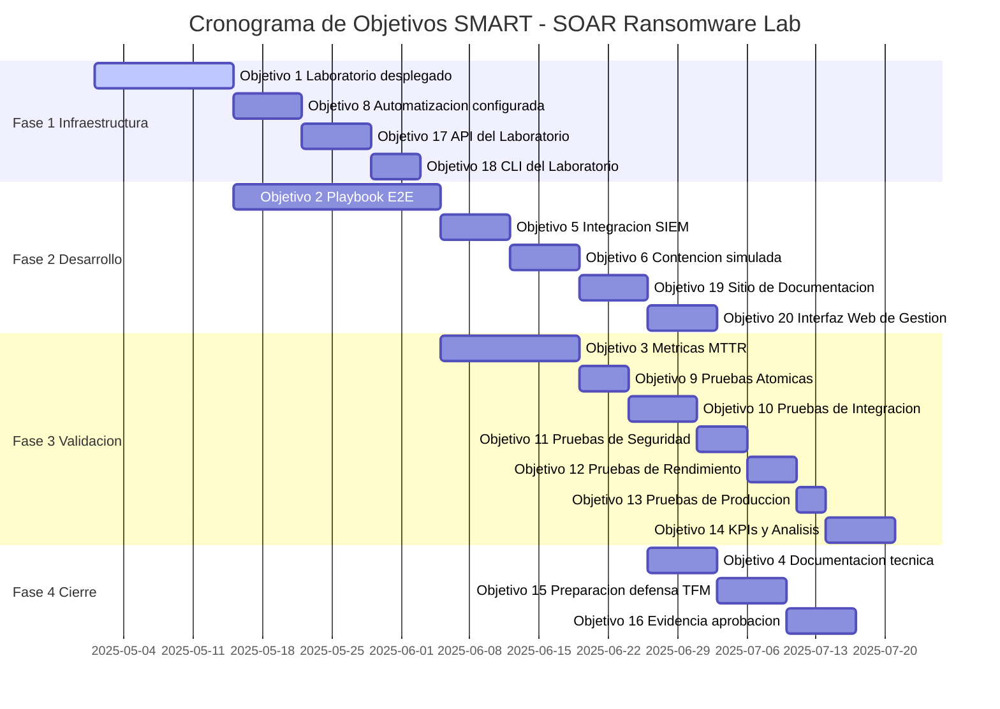
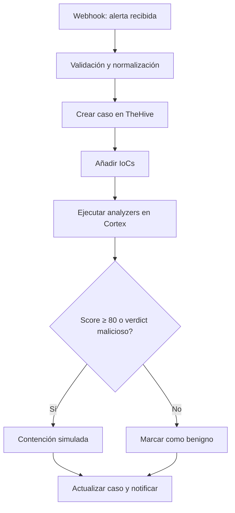
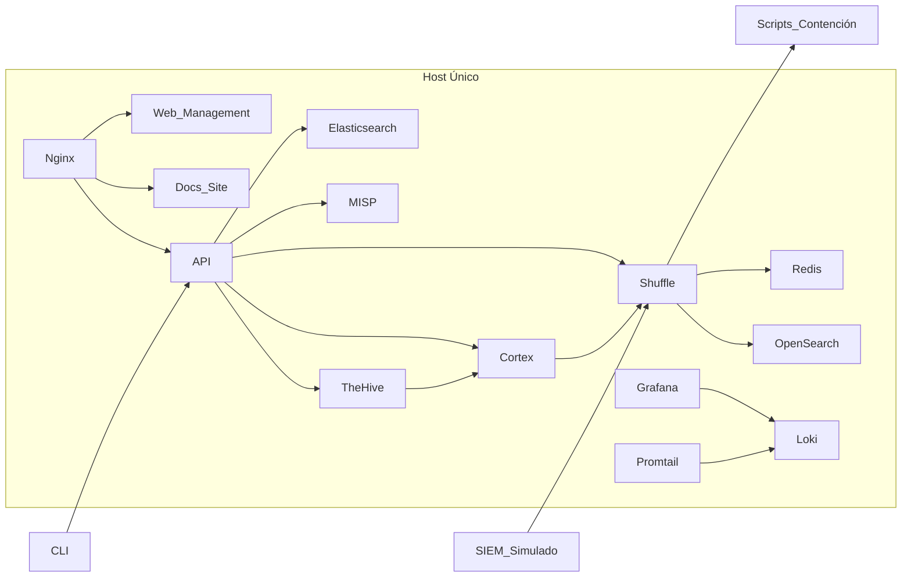
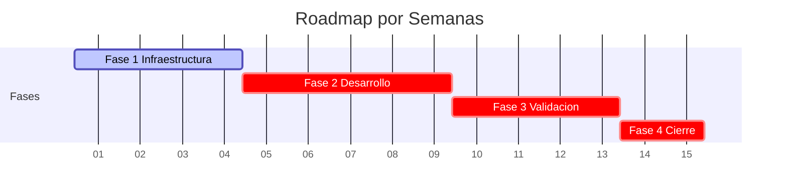
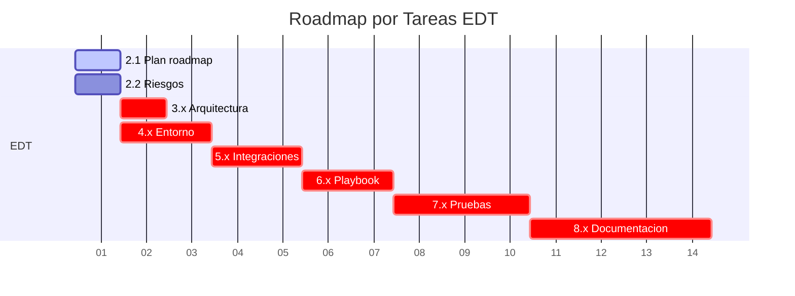
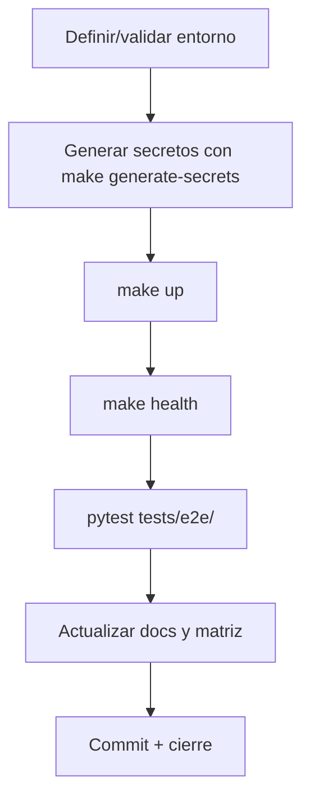
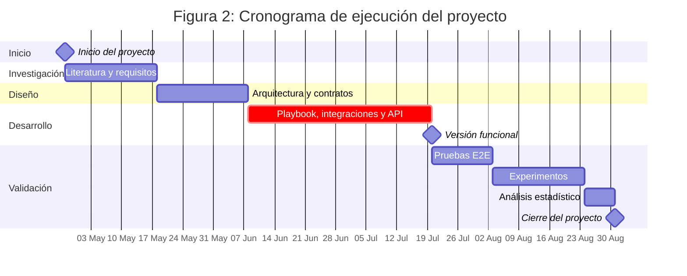

# Gestión del Proyecto — SOAR Ransomware Lab

## Índice

- [1. Resumen](#1-resumen)
 - [1.1 Objetivo](#11-objetivo)
 - [1.2 Contexto](#12-contexto)
- [2. Alcance](#2-alcance)
 - [2.1 Qué cubre](#21-qué-cubre)
 - [2.2 Límites](#22-límites)
 - [2.3 Dependencias](#23-dependencias)
- [3. Contenido principal](#3-contenido-principal)
 - [3.1 Objetivos del proyecto](#31-objetivos-del-proyecto)
 - [3.2 Alcance](#32-alcance)
 - [3.3 Plan de trabajo](#33-plan-de-trabajo)
 - [3.4 Matriz de requisitos](#34-matriz-de-requisitos)
 - [3.5 Gobernanza y validación](#35-gobernanza-y-validación)
 - [3.6 Riesgos](#36-riesgos)
 - [3.7 Deuda técnica](#37-deuda-técnica)
 - [3.8 Matriz de inconsistencias](#38-matriz-de-inconsistencias)
 - [3.9 Remediación documental (resumen)](#39-remediación-documental-resumen)
 - [3.10 Estado de revisión documental](#310-estado-de-revisión-documental)
 - [3.11 Auditoría final](#311-auditoría-final)
- [4. Validación](#4-validación)
 - [4.1 Verificación](#41-verificación)
 - [4.2 Criterios de aceptación](#42-criterios-de-aceptación)
 - [4.3 Evidencias](#43-evidencias)
- [5. Problemas](#5-problemas)
 - [5.1 Limitaciones](#51-limitaciones)
 - [5.2 Riesgos o incidencias](#52-riesgos-o-incidencias)
 - [5.3 Recomendaciones / troubleshooting](#53-recomendaciones-troubleshooting)
- [6. Referencias](#6-referencias)
- [Anexo: Estado del Arte](#anexo-estado-del-arte)
 - [2.1 a 2.4: Respuesta a incidentes, SOAR, laboratorios open source](#21-respuesta-a-incidentes-y-ransomware-como-dominio-de-aplicación)
- [Anexo: Objetivos y Metodología](#anexo-objetivos-y-metodología)
 - [3.1 a 3.3: Objetivo general, específicos, metodología](#31-objetivo-general)
- [Anexo: Métricas y Visualizaciones Complementarias](#anexo-métricas-y-visualizaciones-complementarias)
 - [C.1 a C.4: Valores reales n=50, tablas avanzadas, gráficos, logs](#c1-valores-reales-calculados-n50-ejecuciones)
- [Anexo: Resultados Experimentales y Validación](#anexo-resultados-experimentales-y-validación)
 - [D.1 a D.5: E2E n=50, Quality Score 92.2, HPR 96.0, resumen ejecutivo](#d1-resultados-experimentales-e2e-n50)
- [Anexo: Conclusiones y Trabajo Futuro](#anexo-conclusiones-y-trabajo-futuro)
 - [5.1 a 5.4: Conclusiones, trabajo futuro, recomendaciones, alcance](#51-conclusiones)

---

## 1. Resumen

### 1.1 Objetivo

Documentar la gestión del proyecto: objetivos, alcance, plan, requisitos, riesgos, deuda técnica y auditorías.

### 1.2 Contexto

Proyecto académico/profesional para construir un laboratorio SOAR de respuesta ante ransomware.

---

## 2. Alcance

### 2.1 Qué cubre

- Objetivos y alcance del proyecto
- Plan de trabajo y matriz de requisitos
- Riesgos y deuda técnica
- Auditorías y estado de remediación

### 2.2 Límites

- No cubre aspectos técnicos de implementación (ver 02-architecture.md)
- No cubre operaciones (ver 04-operations.md)

### 2.3 Dependencias

- este documento — documentos de gestión

---

## 3. Contenido principal

### 3.1 Objetivos del proyecto


Este documento presenta los objetivos SMART del proyecto y su relación con la Estructura de Desglose del Trabajo (EDT),
indicando dónde se almacenarán las pruebas y evidencias en el repositorio para garantizar la trazabilidad y validación
académica.


El proyecto se basa en la EDT definida y el contexto del laboratorio SOAR para respuesta ante incidentes de ransomware.
Cada objetivo está alineado con las tareas del EDT y vinculado con la estructura del repositorio, asegurando
trazabilidad y organización académica rigurosa. Las evidencias se almacenarán en ubicaciones específicas del repositorio
para facilitar su validación.


Este documento cubre:

- 20 objetivos SMART definidos para el proyecto
- Métricas y umbrales para cada objetivo
- Métodos de medida y ubicación de evidencias
- Relación entre objetivos y EDT
- Estructura del repositorio para almacenamiento de evidencias


Este documento no cubre:

- Detalles técnicos de implementación (ver docs/02-architecture.md)
- Estrategias de seguridad (ver docs/02-architecture.md)
- Planificación detallada del proyecto (ver este documento)
- Alcance del proyecto (ver este documento)


Este documento depende de:

- EDT definida (este documento)
- Alcance del proyecto (este documento)
- Documentación de arquitectura (docs/02-architecture.md)
- Estrategia de pruebas (docs/05-testing.md)


#### 3.1 Objetivos principales

#### Ubicación de Evidencias

Las evidencias se almacenarán en:

- **Pruebas Unitarias y E2E**: `tests/unit/` (pruebas unitarias), `tests/e2e/TC-01/test_malicious.py` (escenario
 malicioso), `tests/e2e/TC-02/` (escenario benigno)
- **Resultados y Métricas**: `runtime/results/kpis.csv` (archivo CSV con KPIs calculados)
- **Documentación Técnica y Validación**: `docs/04-operations.md` (playbook E2E),
 `docs/05-testing.md` (estrategia de pruebas)
- **Logs del Flujo**: `runtime/logs/playbook_execution.log` (logs de ejecución del playbook)

#### Relación con EDT y Repositorio

Cada objetivo corresponde a tareas específicas del EDT:

- **Infraestructura (EDT 4.x)**: Objetivos 1, 8, 13, 14.
- **Playbook y scripts (EDT 5.x, 6.x)**: Objetivos 2, 5, 6.
- **Pruebas y métricas (EDT 7.x)**: Objetivos 3, 9, 10, 15, 16, 17, 18, 19.
- **Documentación y cierre (EDT 8.x)**: Objetivos 4, 11, 12, 20.

La estructura del repositorio soporta esta organización, con carpetas dedicadas para pruebas (`tests/`), resultados (
`runtime/results/`), documentación (`docs/`) y scripts (`scripts/`), garantizando la trazabilidad necesaria para un
TFM académico riguroso.

**Estructura del repositorio:**

- `tests/unit/` - pruebas unitarias de componentes individuales (conteo dinámico: `pytest --collect-only -q tests/unit/ | find /c /v ""` en Windows o `| wc -l` en Linux/macOS)
- `tests/e2e/TC-01/test_malicious.py` - Test E2E escenario malicioso
- `tests/e2e/TC-02/` - Test E2E escenario benigno
- `tests/e2e/TC-03/` - Test E2E casos extremos
- `runtime/results/kpis.csv` - Archivo CSV con KPIs calculados por `src/soar_lab/domain/services/kpi_analyzer.py`
- `src/soar_lab/simulator/simulate_alerts.py` - Módulo para enviar alertas simuladas
- `src/soar_lab/application/use_cases/backup_service.py` - Servicio de backup/restore
- `infra/docker/compose/docker-compose.yml` - Compose principal
- `infra/docker/compose/docker-compose.core.yml` - Compose servicios core
- `infra/docker/compose/docker-compose.misp.yml` - Compose MISP
- `infra/docker/compose/docker-compose.api.yml` - Compose API y docs
- `infra/docker/compose/logging/docker-compose.logging.yml` - Compose stack de logging
- `Makefile` - Automatización de despliegue y gestión

#### 3.2 Objetivos específicos

#### Flujo de Cumplimiento de Objetivos

1. **Fase de Infraestructura**: Implementación del laboratorio, API, CLI y automatización (Objetivos 1, 8, 13, 14)
2. **Fase de Desarrollo**: Playbook E2E, integración SIEM y contención simulada (Objetivos 2, 5, 6)
3. **Fase de Validación**: Métricas MTTR, pruebas especializadas y KPIs (Objetivos 3, 9, 10, 15, 16, 17, 18, 19)
4. **Fase de Cierre**: Documentación técnica, analytics, preparación defensa y evidencia de aprobación (Objetivos 4, 11,
 12, 20)

#### 3.3 Métricas de éxito

##### Tabla de Objetivos SMART y Ubicación de Evidencias

| Nº | Objetivo | Descripción | Métrica | Umbral | Método de Medida | Evidencia | |----|--------------------------------|----------------------------------------------------------------------------------------------------------------------------------------------------------------------------------------------------------------|-----------------------|------------------------------------|------------------------------------------------------------------------------|---------------------------------------------------------------------------------------------------------------------------| | 1 | Implementación del Laboratorio | Desplegar entorno reproducible con TheHive, Cortex y Shuffle mediante Docker Compose (`infra/docker/compose/docker-compose.yml`, `infra/docker/compose/docker-compose.core.yml`). | Servicios activos | 100% contenedores funcionando | Verificación con `docker ps` y `make up` | Implementado | | 2 | Desarrollo del Playbook E2E | Crear flujo automatizado desde alerta hasta contención simulada en Shuffle (`docs/04-operations.md`). | Ejecución completa | 2 escenarios (malicioso y benigno) | Logs del SOAR y casos en TheHive | Implementado | | 3 | Validación de Métricas MTTR | Medir tiempo de respuesta desde alerta hasta contención mediante timestamps en logs. | Percentiles p50 y p90 | p50 ≤ 120 s; p90 ≤ 180 s | Timestamps y cálculo estadístico con `src/soar_lab/domain/services/kpi_analyzer.py` | Implementado | | 4 | Documentación Técnica | Generar documentación completa (arquitectura, configuración, resultados, API, docs-site, CLI, analytics). | Documento final | 100% apartados completados | Checklist y revisión | En progreso | | 5 | Integración SIEM Simulada | Configurar SIEM simulado para generar alertas mediante `src/soar_lab/simulator/simulate_alerts.py`. | Alertas procesadas | 100% sin errores | Logs en Shuffle y casos en TheHive | Simulado | | 6 | Contención Simulada | Implementar contención simulada en el playbook E2E (`docs/04-operations.md`). | Acciones ejecutadas | 100% completadas | Logs del servicio y confirmación en flujo | Simulado | | 7 | Seguridad del Entorno | Garantizar uso exclusivo de muestras inertes, gestión de certificados SSL (`scripts/setup/gen_certs.sh`) y validación de esquemas (`src/soar_lab/config/schemas/__init__.py`). | Incidentes | 0 incidentes | Revisión del contenido y validación | Parcial | | 8 | Automatización Integral | Implementar despliegue con Makefiles, Docker Compose, CI/CD (`.github/workflows/`), testing automatizado (`tests/`, `scripts/maintenance/`), backup/restore (`src/soar_lab/application/use_cases/backup_service.py`) . | Despliegue automático | 100% servicios levantados | Ejecución de scripts y verificación | Parcial | | 9 | Pruebas Atómicas | Ejecutar pruebas atómicas de componentes individuales (`tests/atomic/`: alertas, IoCs, KPIs, esquemas, secrets). | Casos probados | 90% pruebas pasan | `pytest tests/atomic/ -v` | Parcial | | 10 | Pruebas de Integración | Ejecutar pruebas de integración entre TheHive, Cortex, Shuffle, API y otros componentes (`tests/integration/`). | Casos probados | 85% pruebas pasan | `pytest tests/integration/ -v` | Parcial | | 11 | Pruebas de Seguridad | Ejecutar pruebas de seguridad para validar autenticación, autorización, validación de entrada y controles de acceso (`tests/security/`). | Casos probados | 100% pruebas pasan | `pytest tests/security/ -v` | Parcial | | 12 | Pruebas de Rendimiento | Ejecutar pruebas de rendimiento para validar tiempos de respuesta de API, analyzers y componentes críticos (`tests/performance/`). | Tiempos de respuesta | ≤ umbrales definidos | `pytest tests/performance/ -v` | Parcial | | 13 | Pruebas de Producción | Ejecutar smoke tests para validación rápida de despliegues en producción (`tests/e2e/`). | Casos probados | 100% pruebas pasan | `pytest tests/e2e/ -v` | Parcial | | 14 | KPIs y Análisis | Calcular KPIs, analytics de TFM (`docs/thesis/`) y métricas de servicios (`src/soar_lab/application/use_cases/analytics_service.py`). | KPIs calculados | Informe con gráficos | Análisis estadístico y visualización | Implementado | | 15 | Preparación Defensa TFM | Crear presentación, resumen ejecutivo y analytics para evidencia académica (`docs/thesis/`). | Presentación lista | 100% diapositivas completadas | Validación y ensayo | Pendiente | | 16 | Evidencia de Aprobación | Obtener validación formal del alcance y objetivos. | Archivo firmado | Documento archivado | Confirmación por correo y almacenamiento | Pendiente | | 17 | API del Laboratorio | Implementar y desplegar la API REST del laboratorio con FastAPI para gestión de servicios, health checks, métricas, tests y backups (`src/soar_lab/interfaces/api/`). | Endpoints funcionales | Cobertura ≥ 80% | Tests de integración, `/docs` | Implementado | | 18 | CLI del Laboratorio | Implementar CLI para gestión del laboratorio con comandos para alertas, configuración, validación y operaciones comunes (`src/soar_lab/interfaces/api/cli.py`). | Comandos funcionales | 100% comandos ejecutan | Tests unitarios, `--help` | Implementado | | 19 | Sitio de Documentación | Desplegar sitio de documentación Docusaurus con documentación completa del laboratorio, getting started y guías de uso (`apps/docs-site/`). | Sitio funcional | 100% páginas renderizan | Tests de navegador, revisión enlaces | Implementado | | 20 | Interfaz Web de Gestión | Desplegar interfaz web de gestión para monitoreo del laboratorio, visualización de servicios y operaciones básicas (`apps/web-management/`). | UI funcional | Dashboard muestra estado real | Tests de navegador, pruebas manuales | Implementado |

#### 3.4 Cronograma

#### Diagrama de Gantt del Cronograma de Objetivos



#### Fases del Proyecto

| Fase | Duración | Objetivos | Entregables | |-----------------------------|-----------|--------------------------|--------------------------------------------------------------------| | **Fase 1: Infraestructura** | 4 semanas | 1, 8, 17, 18 | Laboratorio desplegado, automatización, API, CLI | | **Fase 2: Desarrollo** | 5 semanas | 2, 5, 6, 19, 20 | Playbook E2E, integración SIEM, scripts, docs-site, web-management | | **Fase 3: Validación** | 4 semanas | 3, 9, 10, 11, 12, 13, 14 | Métricas MTTR, pruebas especializadas, KPIs | | **Fase 4: Cierre** | 2 semanas | 4, 15, 16 | Documentación técnica, presentación, aprobación |

#### 3.5 Hitos

#### Matriz de Trazabilidad: Objetivos vs Entregables

| Objetivo | Entregable Principal | Entregable Secundario | Ubicación en Repositorio | EDT Relacionada | Estado | |----------|-------------------------------------|--------------------------------------|-----------------------------------------------------------------------------|-----------------|-----------| | 1 | Laboratorio SOAR desplegado | Capturas de servicios | `docs/04-operations.md` | EDT 4.1 | Implementado | | 2 | Playbook E2E implementado | Logs de ejecución | `tests/e2e/TC-01/test_malicious.py`, `tests/e2e/TC-02/` | EDT 5.1 | Implementado | | 3 | Métricas MTTR validadas | Archivo KPIs | `runtime/results/kpis.csv` | EDT 7.1 | Implementado | | 4 | Documentación técnica completa | Revisión | `docs/02-architecture.md`, `docs/03-api-and-integrations.md`, `apps/docs-site/` | EDT 8.1 | En progreso | | 5 | Integración SIEM simulada | Script de alertas | `src/soar_lab/simulator/simulate_alerts.py` | EDT 5.2 | Simulado | | 6 | Scripts de contención | Logs de ejecución | `docs/04-operations.md` | EDT 6.1 | Simulado | | 7 | Seguridad validada | Documento de seguridad, certificados | `docs/02-architecture.md`, `infra/docker/config/nginx/ssl/` | EDT 4.2 | Parcial | | 8 | Automatización integral configurada | Scripts CI/CD, backup | `Makefile`, `.github/workflows/`, `scripts/`, `infra/docker/` | EDT 4.3 | Parcial | | 9 | Pruebas atómicas completadas | Informe de pruebas | `tests/atomic/`, `reports/test_results/atomic_tests.json` | EDT 7.2 | Parcial | | 10 | Pruebas de integración completadas | Informe de pruebas | `tests/integration/`, `reports/test_results/integration_tests.json` | EDT 7.2 | Parcial | | 11 | Pruebas de seguridad completadas | Informe de pruebas | `tests/security/`, `reports/test_results/security_tests.json` | EDT 7.2 | Parcial | | 12 | Pruebas de rendimiento completadas | Informe de pruebas | `tests/performance/`, `reports/test_results/performance_tests.json` | EDT 7.2 | Parcial | | 13 | Pruebas de producción completadas | Informe de pruebas | `tests/e2e/`, `runtime/results/smoke_tests.json` | EDT 7.2 | Parcial | | 14 | KPIs calculados y analizados | Gráficos y análisis | `runtime/results/kpis.csv`, `docs/thesis/`, `src/soar_lab/application/use_cases/analytics_service.py` | EDT 7.3 | Implementado | | 15 | Presentación TFM preparada | Diapositivas, analytics | este documento, `runtime/data/` | EDT 8.2 | Pendiente | | 16 | Evidencia de aprobación | Documento firmado | este documento (scope.md, objectives.md, plan.md) | EDT 8.3 | Pendiente | | 17 | API del Laboratorio desplegada | API funcional | `src/soar_lab/interfaces/api/`, `docs/03-api-and-integrations.md` | EDT 4.1 | Implementado | | 18 | CLI del Laboratorio implementada | CLI funcional | `src/soar_lab/interfaces/api/cli.py`, `docs/04-operations.md` | EDT 4.1 | Implementado | | 19 | Sitio de Documentación desplegado | Sitio funcional | `apps/docs-site/`, capturas de pantalla | EDT 8.1 | Implementado | | 20 | Interfaz Web de Gestión desplegada | UI funcional | `apps/web-management/`, capturas de pantalla | EDT 4.1 | Implementado |

**Leyenda de EDT:**

- EDT 4.x: Infraestructura y automatización
- EDT 5.x: Desarrollo de playbook e integraciones
- EDT 6.x: Scripts de contención y respuesta
- EDT 7.x: Pruebas, validación y métricas
- EDT 8.x: Documentación y cierre del proyecto

#### Hitos Principales

- **Hito 1**: Laboratorio SOAR desplegado, API y CLI funcionales (Semana 4)
- **Hito 2**: Playbook E2E implementado, docs-site y web-management desplegados (Semana 9)
- **Hito 3**: Métricas MTTR validadas, pruebas especializadas completadas y KPIs calculados (Semana 13)
- **Hito 4**: Documentación completa, analytics de TFM y aprobación formal (Semana 15)

### 3.2 Alcance

#### 1. Resumen

#### 1.1 Objetivo

Este documento define el alcance del Trabajo Fin de Máster (TFM), estableciendo los objetivos y límites del proyecto
para garantizar su viabilidad y cumplimiento académico.

#### 1.2 Contexto

El objetivo principal de este TFM es diseñar, implementar y evaluar un laboratorio SOAR mínimo viable (MSV) para la
respuesta ante incidentes de ransomware. Este laboratorio ejecutará un playbook automatizado de extremo a extremo (E2E)
que cubra el flujo completo: Webhook → Validación → Caso en TheHive → Adjuntar IoCs → Analyzers en Cortex → Decisión →
Contención Simulada → Notificación.

Este alcance busca que el proyecto sea:

- **Realista**: Adaptado a un TFM unipersonal sin dependencias externas complejas
- **Reproducible**: Basado en entornos Docker y scripts documentados
- **Seguro**: Sin uso de malware real ni riesgos para sistemas productivos
- **Académicamente Riguroso**: Cumplimiento de objetivos medibles y evidencias verificables

Para considerar el entregable completado, el laboratorio debe permitir la ejecución correcta del playbook en dos
escenarios (malicioso y benigno), cumplir los umbrales de tiempo p50 ≤ 120 s y p90 ≤ 180 s, y generar evidencias
completas (logs, capturas y métricas).

#### 2. Alcance

#### 2.1 Qué cubre

Este documento cubre:

- Componentes incluidos en el proyecto
- Componentes excluidos del proyecto
- Justificación del alcance (viabilidad técnica y académica)
- Criterios de aceptación funcionales y académicos
- Matriz de alcance
- Arquitectura del laboratorio
- Infraestructura recomendada
- Métricas de éxito
- Limitaciones y restricciones
- Consideraciones éticas

#### 2.2 Límites

Este documento no cubre:

- Detalles técnicos de implementación (ver docs/02-architecture.md)
- Estrategias de seguridad (ver docs/02-architecture.md)
- Planificación detallada del proyecto (ver este documento)
- Gestión de riesgos (ver este documento)
- Detalle del playbook E2E (ver docs/04-operations.md)

#### 2.3 Dependencias

Este documento depende de:

- Objetivos SMART del proyecto (este documento)
- Plan del proyecto (este documento)
- Gestión de riesgos (este documento)
- Documentación de arquitectura (docs/02-architecture.md)

#### 3. Contenido principal

#### 3.1 Definición del alcance

#### Supuestos

- Las credenciales y certificados se generan con `make generate-secrets` y no se versionan en texto plano.
- Los puertos y hosts se definen en `.env.full`; la tabla canónica es `docs/04-operations.md`.
- Las pruebas E2E requieren el stack Docker completo; el resto de pruebas pueden ejecutarse con `pytest --collect-only`.
- La contención de endpoints es simulada; no se despliegan agentes EDR ni acciones destructivas reales.

#### Componentes Incluidos

- **Playbook E2E Único**: Flujo completo con decisiones automatizadas basadas en score/verdict en Shuffle
- **Integraciones Simuladas**: SIEM simulado para generación de alertas (
 `src/soar_lab/simulator/simulate_alerts.py`) y scripts para contención simulada
- **API del Laboratorio**: API REST FastAPI para gestión de servicios, health checks, métricas, tests y backups (
 `src/soar_lab/interfaces/api/`, `apps/api/Dockerfile`)
- **CLI del Laboratorio**: CLI para gestión del laboratorio con comandos para alertas, configuración, validación y
 operaciones (`src/soar_lab/interfaces/api/cli.py`)
- **Sitio de Documentación**: Sitio de documentación Docusaurus con getting started y guías de uso (`apps/docs-site/`)
- **Interfaz Web de Gestión**: Interfaz web para monitoreo del laboratorio, visualización de servicios y operaciones
 básicas (`apps/web-management/`)
- **Métricas de Rendimiento (MTTR-demo)**: Cálculo de p50 ≤ 120 s y p90 ≤ 180 s desde alerta hasta contención mediante
 `src/soar_lab/domain/services/kpi_analyzer.py` → `runtime/results/kpis.csv`
- **Analytics de TFM**: Módulos para generación de datos estructurados, visualización de resultados y evidencia
 académica (`src/soar_lab/application/use_cases/analytics_service.py`)
- **Testing Especializado**: Pruebas unitarias (conteo dinámico vía `pytest --collect-only -q tests/unit/ | find /c /v ""` / `| wc -l`), atómicas, integración, seguridad, rendimiento y E2E (
 `tests/unit/`, `tests/atomic/`, `tests/integration/`, `tests/security/`, `tests/performance/`, `tests/e2e/`)
- **Automatización Integral**: CI/CD, testing automatizado, backup/restore (`src/soar_lab/application/use_cases/backup_service.py`,
 `src/soar_lab/infrastructure/tar_backup_driver.py`)
- **Seguridad Avanzada**: Validación de esquemas (`src/soar_lab/config/schemas/__init__.py`,
 `src/soar_lab/validation/validators.py`)
- **Entorno Reproducible**: Arquitectura Docker Compose con TheHive, Cortex, Shuffle SOAR, MISP, Elasticsearch,
 Redis, MariaDB, Nginx, Grafana, Loki, Promtail (`infra/docker/compose/`)
- **Documentación Completa**: Diseño del laboratorio, configuración, flujo del playbook, resultados, KPIs, API, CLI y
 analytics (`docs/`, `docs/03-api-and-integrations.md`, `apps/docs-site/`)
- **Validación Académica**: Cumplimiento de objetivos SMART con evidencias verificables (este documento,
 `tests/`)

#### Componentes Excluidos

- **Integraciones Comerciales Reales**: SIEM, EDR, Firewall comerciales
- **Alta Disponibilidad (HA)**: Entornos multi-host complejos o clustering
- **Malware Funcional**: Solo muestras inertes para simulación segura
- **Múltiples Playbooks E2E**: Enfoque en un único playbook E2E completo
- **Producción**: No se recomienda para entornos productivos sin hardening adicional

#### Justificación del Alcance

**Viabilidad Técnica:**

- Reducir el tiempo de respuesta ante incidentes mediante automatización demostrable
- Evitar riesgos asociados al uso de malware real en entorno académico
- Facilitar la reproducibilidad para otros profesionales y entornos educativos
- Cumplir con objetivos medibles y realistas en un marco temporal limitado

**Viabilidad Académica:**

- Profundización en conceptos fundamentales de SOAR
- Validación experimental de hipótesis de investigación
- Generación de conocimiento aplicado y transferible
- Cumplimiento de plazos académicos establecidos

#### 3.2 Objetivos del proyecto

#### Flujo del Playbook

El flujo del playbook sigue este recorrido:

1. Webhook recibe alerta del SIEM simulado
2. Validación y normalización de la alerta
3. Creación de caso en TheHive
4. Adjuntar IoCs al caso
5. Ejecutar analyzers en Cortex
6. Decisión basada en score/verdict
7. Contención simulada o marca como benigno
8. Actualizar caso y notificar

#### Consideraciones Éticas

Este proyecto cumple con las siguientes consideraciones éticas:

- Uso exclusivo de muestras inertes para simulación
- No exposición de datos reales o sensibles
- Cumplimiento de buenas prácticas de seguridad
- Contribución al conocimiento académico en ciberseguridad

#### 3.3 Entregables

#### Matriz de Alcance

| Categoría | Incluido | Excluido | Justificación | |---------------------|-------------------------------------------------------------------------|--------------------------|------------------------------------| | **Playbooks** | 1 flujo E2E completo | Múltiples playbooks E2E | Enfoque en profundidad vs amplitud | | **Integraciones** | SIEM simulado, contención simulada, API, CLI, docs-site, web-management | APIs comerciales reales | Viabilidad técnica y económica | | **Seguridad** | Muestras inertes, certificados SSL, validación de esquemas | Malware funcional | Seguridad del entorno académico | | **Infraestructura** | Single-host con Docker Compose, Nginx, CI/CD, backup/restore | Alta disponibilidad (HA) | Simplicidad y reproducibilidad | | **Documentación** | Completa y académica (API, CLI, analytics, docs-site) | Superficial o incompleta | Rigor académico requerido | | **Validación** | Pruebas atómicas, integración, seguridad, rendimiento, producción | Pruebas limitadas | Evidencia verificable necesaria | | **Automatización** | CI/CD, testing automatizado, backup/restore | Automatización manual | Eficiencia y calidad | | **Analytics** | Módulos para evidencia académica y visualización | Análisis superficial | Rigor académico requerido |

#### Diagrama del Flujo del Playbook

Este diagrama ilustra el recorrido completo de una alerta desde su recepción hasta la contención y notificación. Cada
paso refleja la lógica del playbook y las decisiones basadas en análisis automatizados.



#### Arquitectura del Laboratorio

La arquitectura propuesta se basa en un único host con contenedores Docker para simplificar la implementación y
garantizar la reproducibilidad. Incluye herramientas clave como TheHive, Cortex y Shuffle, además de servicios de
soporte, API, CLI, sitio de documentación e interfaz web de gestión.



#### Infraestructura Recomendada

La infraestructura se diseña para ser segura y fácil de desplegar, evitando complejidad innecesaria y asegurando
compatibilidad con entornos académicos.

| Componente | Descripción | Requisitos Mínimos | Referencias | |------------------|---------------------------------------------------------------------------------------------------------------------------------------------|----------------------|-----------------------------------------------------------------------| | **VM Windows** | Simulación de endpoint víctima, agente EDR | 4GB RAM, 50GB SSD | Playbook E2E de contención: `docs/04-operations.md` | | **VM Linux** | Host principal con Docker, herramientas, CI/CD | 8GB RAM, 50GB SSD | `Makefile`, `infra/docker/compose/`, `.github/workflows/` | | **Contenedores** | TheHive, Cortex, Shuffle, MISP, Elasticsearch, PostgreSQL, Redis, MariaDB, Nginx, Grafana, Loki, Promtail, docs-site, web-management | Docker Engine 20.10+ | `infra/docker/compose/docker-compose*.yml` |

#### Métricas de Éxito

**Métricas Cuantitativas:**

- **Tiempo de Respuesta**: p50 ≤ 120s, p90 ≤ 180s (calculado por `src/soar_lab/domain/services/kpi_analyzer.py` desde
 timestamps en
 `runtime/logs/playbook_execution.log`)
- **Tasa de Éxito**: 100% de ejecuciones completas (pytest tests/e2e/ -v)
- **Disponibilidad**: ≥ 99% durante pruebas (docker compose ps para verificar healthy status)

#### Matriz de Trazabilidad: Componentes vs Objetivos SMART

| Componente | Objetivo SMART 1 | Objetivo SMART 2 | Objetivo SMART 3 | Objetivo SMART 4 | Objetivo SMART 5 | Objetivo SMART 6 | Objetivo SMART 7 | Objetivo SMART 8 | Objetivo SMART 9 | Objetivo SMART 10 | Objetivo SMART 11 | Objetivo SMART 12 | |------------------------|------------------|------------------|------------------|------------------|------------------|------------------|------------------|------------------|------------------|-------------------|-------------------|-------------------| | **Playbook E2E** | - | ✓ | ✓ | ✓ | - | ✓ | - | - | ✓ | ✓ | ✓ | - | | **TheHive** | ✓ | ✓ | - | ✓ | - | - | - | - | - | - | - | - | | **Cortex** | ✓ | ✓ | - | - | - | - | - | - | - | - | - | - | | **Shuffle** | ✓ | ✓ | ✓ | - | ✓ | - | - | - | - | - | - | - | | **SIEM Simulado** | - | ✓ | ✓ | - | ✓ | - | - | - | - | - | - | - | | **Scripts Contención** | - | ✓ | - | - | - | ✓ | - | - | - | - | - | - | | **Docker Compose** | ✓ | - | - | - | - | - | - | ✓ | - | - | - | - | | **Documentación** | - | - | - | ✓ | - | - | - | - | - | ✓ | ✓ | ✓ | | **Pruebas E2E** | - | - | ✓ | - | - | - | - | - | ✓ | ✓ | - | - | | **KPIs** | - | - | ✓ | - | - | - | - | - | - | ✓ | - | - | | **Muestras Inertes** | - | - | - | - | - | - | ✓ | - | - | - | - | - | | **Makefile** | - | - | - | - | - | - | - | ✓ | - | - | - | - |

**Leyenda:**

- ✓ = Componente contribuye directamente al objetivo
-
 - = Componente no contribuye al objetivo

**Objetivos SMART Resumidos:**

- 1: Implementación del Laboratorio
- 2: Desarrollo del Playbook E2E
- 3: Validación de Métricas MTTR
- 4: Documentación Técnica
- 5: Integración SIEM Simulada
- 6: Contención Simulada
- 7: Seguridad del Entorno
- 8: Automatización Opcional
- 9: Pruebas Funcionales
- 10: KPIs y Análisis
- 11: Preparación Defensa TFM
- 12: Evidencia de Aprobación
- **Cobertura Documental**: 100% de secciones completadas

**Métricas Cualitativas:**

- **Reproducibilidad**: Entorno desplegable en ≤ 30 minutos
- **Seguridad**: Sin incidentes de seguridad durante pruebas
- **Usabilidad**: Documentación clara y procedimientos validados
- **Aprendizaje**: Lecciones aprendidas documentadas y aplicables

#### 3.4 Criterios de exclusión

#### Componentes No Incluidos

- **Integraciones Comerciales Reales**: SIEM, EDR, Firewall comerciales
 - Justificación: Viabilidad técnica y económica para un TFM unipersonal

- **Alta Disponibilidad (HA)**: Entornos multi-host complejos o clustering
 - Justificación: Simplicidad y reproducibilidad del entorno académico

- **Malware Funcional**: Solo muestras inertes para simulación segura
 - Justificación: Seguridad del entorno académico y consideraciones éticas

- **Escenarios Avanzados**: Múltiples playbooks o automatizaciones adicionales
 - Justificación: Enfoque en profundidad vs amplitud

- **Producción**: No se recomienda para entornos productivos sin hardening adicional
 - Justificación: El laboratorio es un entorno de prueba y validación académica

#### 3.5 Restricciones y suposiciones

#### Restricciones

- **Plazo**: 7 semanas para completar el proyecto
- **Recursos**: Mínimo 8GB RAM para ejecución completa
- **Entorno**: Windows + Docker Desktop (Hyper-V)
- **Personal**: Unipersonal sin equipo de desarrollo
- **Seguridad**: Uso exclusivo de muestras inertes

#### Suposiciones

- **Disponibilidad de servicios**: TheHive, Cortex y Shuffle están disponibles y funcionando
- **Conectividad**: Acceso a Internet para descarga de imágenes Docker
- **API keys**: Se pueden obtener y configurar las API keys necesarias
- **Documentación**: La documentación oficial de las herramientas está disponible y es precisa

#### 4. Validación

##### 4.1 Verificación

El alcance se verifica mediante:

- Revisión de componentes incluidos y excluidos (matriz de alcance en este documento)
- Validación de viabilidad técnica y académica (`docker compose ps`, `pytest tests/e2e/`)
- Confirmación de criterios de aceptación (`src/soar_lab/domain/services/kpi_analyzer.py` → `runtime/results/kpis.csv`)
- Verificación de métricas de éxito
- Revisión de consideraciones éticas

#### 4.2 Criterios de aceptación

**Criterios Funcionales:**

- El playbook debe ejecutarse completamente en escenarios maliciosos y benignos
- Los umbrales de tiempo (p50 ≤ 120s, p90 ≤ 180s) deben cumplirse consistentemente
- Todas las integraciones deben funcionar sin errores críticos
- La documentación debe ser completa y verificable

**Criterios Académicos:**

- Los objetivos SMART deben ser medibles y alcanzables
- Las evidencias deben estar almacenadas y referenciadas correctamente
- La metodología debe ser rigurosa y reproducible
- Las conclusiones deben basarse en datos y análisis objetivos

#### 4.3 Evidencias

Las evidencias de validación incluyen:

- Documento de alcance aprobado (este documento)
- Matriz de alcance con justificaciones (sección 3.1)
- Diagramas de arquitectura y flujo (diagramas Mermaid en este documento)
- Tabla de infraestructura recomendada (sección 3.2)
- Métricas de éxito definidas (sección 3.2, validadas por `src/soar_lab/domain/services/kpi_analyzer.py`)
- Consideraciones éticas documentadas (sección 3.4)

#### 5. Problemas

##### 5.1 Limitaciones

**Limitaciones Técnicas:**

- Dependencia de APIs externas (VirusTotal, URLHaus)
- Limitaciones de recursos en entorno de desarrollo
- Simulación vs escenarios reales de producción

**Restricciones Académicas:**

- Plazo limitado para desarrollo y validación
- Recursos disponibles para un único desarrollador
- Alcance definido para TFM unipersonal

#### 5.2 Riesgos o incidencias

- **Deriva de alcance**: Añadir componentes no planificados.
- **Complejidad excesiva**: Añadir múltiples playbooks o integraciones.
- **Incumplimiento de umbrales**: MTTR fuera de objetivos.
- **Falta de reproducibilidad**: Entorno difícil de desplegar.
- **Deuda de documentación y configuración**: Fragmentación de Compose, duplicación de puertos/URLs o referencias legacy (`<SIEM_TOKEN>` placeholders, `<OLD_PATH>`) pueden desincronizar los documentos. Mitigación: `make generate-secrets`, validador `scripts/ci/docs_quality.py`.

#### 5.3 Recomendaciones / troubleshooting

#### Procedimientos Específicos de Gestión de Cambios de Alcance

**Proceso de Solicitud de Cambio de Alcance:**

```bash
# 1. Documentar el cambio de alcance propuesto
# Crear archivo: alcance_<fecha>_<id>.md
# Incluir: descripción, justificación, impacto en objetivos, impacto en cronograma, riesgos adicionales

# 2. Evaluar impacto en objetivos SMART
# Revisar: este documento
# Determinar: qué objetivos se afectan, si se necesitan nuevos objetivos

# 3. Evaluar impacto en cronograma
# Revisar: este documento
# Determinar: desviación en semanas, nuevos hitos necesarios

# 4. Evaluar viabilidad técnica y académica
# Verificar: recursos disponibles, plazos académicos, complejidad añadida

# 5. Aprobar cambio
# Si es menor: Aprobación del estudiante
# Si es mayor: Aprobación requerida

# 6. Implementar cambio
# Actualizar: este documento, docs/02-architecture.md, docs/04-operations.md
# Ejecutar: pruebas de regresión
# Documentar: evidencias del cambio
```

**Tipos de Cambios de Alcance:**

- **Menor**: Cambios que no afectan objetivos principales ni cronograma (ej: ajuste de configuración, corrección de
 documentación)
- **Moderado**: Cambios que afectan objetivos secundarios o añaden 1-2 semanas al cronograma (ej: adición de un analyzer
 adicional)
- **Mayor**: Cambios que afectan objetivos principales o añaden >2 semanas al cronograma (ej: adición de nuevo playbook,
 cambio de tecnología)

**Criterios de Aprobación:**

- **Cambios menores**: Aprobados automáticamente si no afectan objetivos SMART
- **Cambios moderados**: Requieren evaluación de impacto y aprobación del estudiante
- **Cambios mayores**: Requieren aprobación y actualización de objetivos SMART

**Documentación de Cambios de Alcance:**

```markdown
# Solicitud de Cambio de Alcance - SC-001

**Fecha**: 2025-05-15
**Solicitante**: Estudiante
**Tipo**: Menor/Moderado/Mayor

**Descripción del cambio:**
[Descripción detallada del cambio de alcance propuesto]

**Justificación:**
[Razón para el cambio de alcance]

**Impacto en objetivos SMART:**
- Objetivos afectados: [Lista]
- Nuevos objetivos requeridos: [Lista]

**Impacto en cronograma:**
- Fases afectadas: [Lista]
- Desviación en semanas: [Número]
- Nuevos hitos: [Lista]

**Riesgos adicionales:**
- [Riesgo 1]
- [Riesgo 2]

**Viabilidad técnica**: [Sí/No]
**Viabilidad académica**: [Sí/No]

**Aprobación:**
- Estudiante: [Firma/Fecha]
- Validación: [Firma/Fecha]

**Estado**: [Pendiente/Aprobado/Rechazado/Implementado]
```

**Seguimiento de Cambios de Alcance:**

- Mantener registro en este documento
- Actualizar este documento con cambios aprobados
- Comunicar cambios inmediatamente
- Actualizar matriz de trazabilidad componentes vs objetivos SMART

#### Checklist de Validación de Alcance Antes de Desarrollo

**Pre-Desarrollo - Checklist Inicial:**

- [ ] Alcance definido y aprobado en este documento
- [ ] Objetivos SMART definidos en este documento
- [ ] Plan del proyecto definido en este documento
- [ ] Matriz de riesgos definida en este documento
- [ ] Matriz de trazabilidad componentes vs objetivos SMART completada
- [ ] Infraestructura recomendada verificada (VM Windows, VM Linux)
- [ ] Recursos mínimos disponibles (8GB RAM, 50GB SSD)
- [ ] Consideraciones éticas documentadas
- [ ] Criterios de exclusión justificados
- [ ] Métricas de éxito definidas (p50 ≤ 120s, p90 ≤ 180s)

**Pre-Desarrollo - Validación de Componentes:**

- [ ] TheHive: versión y configuración definidas
- [ ] Cortex: versión y analyzers definidos
- [ ] Shuffle: versión y workflow definido
- [ ] SIEM Simulado: script de generación de alertas definido
- [ ] Scripts Contención: scripts de aislamiento definidos
- [ ] Docker Compose: archivos compose definidos
- [ ] Documentación: estructura y contenido planificados

**Pre-Desarrollo - Validación de Viabilidad:**

- [ ] Viabilidad técnica: recursos suficientes para todos los componentes
- [ ] Viabilidad académica: objetivos medibles y alcanzables en 7 semanas
- [ ] Viabilidad ética: uso exclusivo de muestras inertes
- [ ] Viabilidad de reproducibilidad: entorno desplegable en ≤ 30 minutos
- [ ] Viabilidad de validación: pruebas E2E definidas y ejecutables

**Deriva de alcance:**

```bash
# Revisar este documento antes de añadir componentes
# Validar contra matriz de alcance
# Consultar si es necesario
```

**Complejidad excesiva:**

```bash
# Priorizar profundidad vs amplitud
# Mantener único playbook E2E
# Usar integraciones simuladas vs reales
```

**Incumplimiento de umbrales:**

```bash
# Revisar runtime/results/kpis.csv
# Analizar cuellos de botella en logs
# Optimizar analyzers activos
```

**Falta de reproducibilidad:**

```bash
# Verificar archivos docker-compose*.yml
# Validar .env.full
# Ejecutar make up en entorno limpio
```

#### 6. Referencias

- **Repositorio del Proyecto**: [alesanfe/soar-ransomware-lab](https://github.com/alesanfe/soar-ransomware-lab.git)
- **Documentación de Shuffle**: https://shuffler.io/docs
- **Documentación de TheHive**: https://docs.strangebee.com/thehive/
- **Documentación de Cortex**: https://docs.strangebee.com/cortex/
- **Documentación de MISP**: https://www.misp-project.org/documentation/
- **Documentación de Elasticsearch**: https://www.elastic.co/guide/en/elasticsearch/reference/current/index.html
- **Documentación de Arquitectura**: [docs/02-architecture.md](02-architecture.md)
- **Objetivos SMART**: [este documento](#31-objetivos-del-proyecto)
- **Plan del Proyecto**: [este documento](#33-plan-de-trabajo)
- **Gestión de Riesgos**: [este documento](#36-riesgos)
- **Playbook E2E**: [docs/04-operations.md](04-operations.md)

---

**Mejoras realizadas:**

- Reestructurado según formato obligatorio con 6 secciones principales
- Índice actualizado para reflejar nueva estructura
- Contenido organizado en subsecciones lógicas
- Sección de Validación añadida con criterios y evidencias
- Sección de Problemas y Consideraciones consolidada con troubleshooting específico
- Matriz de alcance, diagramas y tablas mantenidos en sección 3.3

**Contradicciones detectadas:**

- Ninguna detectada en este documento


### 3.3 Plan de trabajo

#### 1. Resumen

#### 1.1 Objetivo

El objetivo de este documento es planificar las semanas y los hitos clave para el desarrollo del laboratorio SOAR,
incluyendo entorno, integraciones, playbook, pruebas e informe. La ruta crítica es: docker → servicios → conexiones →
playbook → pruebas → informe.

#### 1.2 Contexto

El proyecto se desarrolla en 15 semanas, desde la definición de alcance y objetivos hasta el informe y cierre. Cada fase
tiene objetivos específicos con entregables e evidencias definidas, alineados con la EDT y los 20 objetivos SMART del
proyecto.

#### 2. Alcance

#### 2.1 Qué cubre

Este documento cubre:

- Planificación por semanas con fases y hitos
- Planificación por tareas de la EDT
- Ruta crítica del proyecto
- Diagramas Gantt por semanas y por tareas EDT
- Entregables y evidencias por fase

#### 2.2 Límites

Este documento no cubre:

- Detalles técnicos de implementación (ver docs/02-architecture.md)
- Estrategias de seguridad (ver docs/02-architecture.md)
- Objetivos SMART (ver este documento)
- Alcance del proyecto (ver este documento)
- Gestión de riesgos (ver este documento)

#### 2.3 Dependencias

Este documento depende de:

- Alcance del proyecto (este documento)
- Objetivos SMART (este documento)
- Gestión de riesgos (este documento)
- Arquitectura del sistema (docs/02-architecture.md)

#### 3. Contenido principal

#### 3.1 Estrategia de planificación

#### Ruta Crítica

La ruta crítica del proyecto es:

1. **Docker**: Configuración de Docker Compose (`infra/docker/compose/docker-compose.yml`,
 `infra/docker/compose/docker-compose.core.yml`, `infra/docker/compose/docker-compose.misp.yml`,
 `infra/docker/compose/docker-compose.opensearch.yml`, `infra/docker/compose/docker-compose.api.yml`,
 `infra/docker/compose/logging/docker-compose.logging.yml`)
2. **Servicios**: Inicialización de TheHive, Cortex, Shuffle, MISP, Elasticsearch, PostgreSQL, Redis, MariaDB
3. **Conexiones**: Webhook, esquema de alerta (`src/soar_lab/config/schemas/__init__.py`) y SIEM simulado (
 `src/soar_lab/simulator/simulate_alerts.py`)
4. **Playbook**: Flujo E2E con contención simulada en Shuffle
5. **Pruebas**: Ejecución de casos (`tests/e2e/TC-01/test_malicious.py`, `tests/e2e/TC-02/`) y cálculo de
 KPIs (`src/soar_lab/domain/services/kpi_analyzer.py`)
6. **Informe**: Documentación técnica (`docs/04-operations.md`,
 `docs/04-operations.md`) y cierre

#### Fases del Proyecto

- **Fase 1: Infraestructura** (4 semanas): Laboratorio, automatización, API, CLI ✅ Finalizada
- **Fase 2: Desarrollo** (5 semanas): Playbook E2E, integración SIEM, scripts, docs-site, web-management ✅ Finalizada
- **Fase 3: Validación** (4 semanas): Métricas MTTR, pruebas especializadas, KPIs ✅ Finalizada (KPIs operativos, E2E 48 test files en 39 TCs)
- **Fase 4: Cierre** (2 semanas): Documentación, analytics, aprobación 🔄 En cierre (remediación documental completada; pendientes: defensa TFM y aprobación formal)

#### 3.2 Fases y cronograma

#### Flujo Cronológico

El proyecto sigue un flujo secuencial de 15 semanas, donde cada fase depende de la anterior. Las tareas críticas están
marcadas en los diagramas Gantt como `:crit` para identificar la ruta crítica.

#### Dependencias entre Fases

- Fase 2 depende de Fase 1 (infraestructura configurada)
- Fase 3 depende de Fase 2 (playbook y aplicaciones desplegadas)
- Fase 4 depende de Fase 3 (pruebas completadas y KPIs calculados)

#### 3.3 Recursos y asignación

#### Plan por semanas

| Semana | Fase / Hito | Objetivo principal | Entregables / Evidencias | Hitos de Validación Intermedia | |---------|-------------------------|------------------------------------------------------------------------------------------------|------------------------------------------------------------------------------------------------------------------------------------------------|--------------------------------------------------------------------| | S1-S4 | Fase 1: Infraestructura | Laboratorio, automatización, API, CLI (Objetivos 1, 8, 17, 18) | infra/docker/compose/, Makefile, src/soar_lab/interfaces/api/, src/soar_lab/interfaces/api/cli.py, .github/workflows/ | Validación: servicios funcionando, API y CLI operativos (Semana 4) | | S5-S9 | Fase 2: Desarrollo | Playbook E2E, integración SIEM, scripts, docs-site, web-management (Objetivos 2, 5, 6, 19, 20) | docs/04-operations.md, src/soar_lab/simulator/simulate_alerts.py, apps/docs-site/, apps/web-management/ | Validación: playbook ejecuta, apps desplegadas (Semana 9) | | S10-S13 | Fase 3: Validación | Métricas MTTR, pruebas especializadas, KPIs (Objetivos 3, 9, 10, 11, 12, 13, 14) | tests/atomic/, tests/integration/, tests/security/, tests/performance/, tests/e2e/, runtime/results/kpis.csv, docs/thesis/ | Validación: pruebas pasan, KPIs cumplen umbrales (Semana 13) | | S14-S15 | Fase 4: Cierre | Documentación, analytics, aprobación (Objetivos 4, 15, 16) | docs/, docs/thesis/, este documento | Validación: documentación aprobada (Semana 15) |

#### Diagrama Gantt por semanas



#### Plan por tareas de la EDT

| Tarea EDT | Descripción | Entregables | |-------------------|-------------------------------------------------------------------|--------------------------------------------------------------------------------------------------------------| | 2.1 Plan/roadmap | Crear roadmap visual (Gantt), definir ruta crítica y dependencias | este documento, diagrama Gantt | | 2.2 Riesgos | Identificar riesgos y mitigaciones | este documento | | 3.x Arquitectura | Diseñar arquitectura single-host y flujo del playbook | docs/02-architecture.md | | 4.x Entorno | Configurar Docker Compose, seguridad básica | infra/docker/compose/docker-compose.yml, .env.full | | 5.x Integraciones | Conectar TheHive, Cortex, Shuffle y SIEM simulado | este documento, src/soar_lab/simulator/simulate_alerts.py | | 6.x Playbook | Construir flujo E2E con decisiones y contención simulada | docs/04-operations.md | | 7.x Pruebas | Ejecutar pruebas E2E y calcular KPIs | tests/e2e/*, runtime/results/kpis.csv | | 8.x Documentación | Redactar informe técnico, manual y cierre | docs/04-operations.md, docs/04-operations.md, este documento |

#### Diagrama Gantt por tareas EDT



#### 3.4 Gestión de riesgos

#### Identificación de Riesgos

Los riesgos del proyecto se detallan en este documento. Los riesgos principales incluyen:

- Dependencia de servicios externos (TheHive, Cortex, Shuffle)
- Limitaciones de recursos (8GB RAM mínimo)
- Complejidad de integración entre componentes
- Tiempo de ejecución de pruebas E2E

#### Estrategias de Mitigación

- **Backup de configuración**: Mantener copias de configuración en `runtime/backups/`
- **Monitoreo continuo**: Verificar estado de servicios regularmente
- **Documentación detallada**: Facilitar troubleshooting y recuperación
- **Pruebas incrementales**: Validar componentes individualmente antes de integración

#### 3.5 Seguimiento y control

#### Métricas de Seguimiento

- **Progreso por fase**: Porcentaje de tareas completadas por semana
- **Hitos alcanzados**: Verificación de entregables principales
- **Desviaciones**: Comparación entre planificado y real
- **KPIs del proyecto**: Tiempo de ejecución, cobertura de pruebas, etc.

#### Revisión y Ajuste

- Revisiones semanales del progreso
- Ajustes al plan según desviaciones identificadas
- Comunicación sobre bloqueos y riesgos

#### 4. Validación

#### 4.1 Verificación

El plan se verifica mediante:

- Revisión de entregables por semana (este documento, este documento)
- Validación de dependencias entre fases (Makefile targets: `up`, `down`, `test`)
- Confirmación de ruta crítica (diagramas Gantt en este documento)
- Verificación de alineación con EDT (tareas EDT 2.x - 8.x)
- Validación del roadmap mediante revisión manual del diagrama Gantt

#### 4.2 Criterios de aceptación

El plan se considera válido cuando:

- Todas las semanas tienen objetivos y entregables definidos
- La ruta crítica está identificada correctamente
- Las dependencias entre fases son lógicas y alcanzables
- Los diagramas Gantt reflejan la planificación
- El plan está alineado con los objetivos SMART

#### 4.3 Evidencias

Las evidencias de validación incluyen:

- Documento de plan aprobado
- Diagramas Gantt generados
- Checklist de entregables por semana
- Registro de revisiones y aprobaciones

#### 5. Problemas

#### 5.1 Limitaciones

- **Plazo fijo**: 7 semanas para completar el proyecto
- **Dependencia secuencial**: Cada fase depende de la anterior
- **Recursos limitados**: Requiere 8GB RAM mínimo y tiempo completo

#### 5.2 Riesgos o incidencias

- **Retrasos en fases críticas**: Cualquier retraso en ruta crítica afecta el proyecto completo
- **Problemas técnicos**: Errores en configuración Docker o servicios
- **Cambios en alcance**: Modificaciones no planificadas pueden afectar el cronograma
- **Falta de tiempo**: Insuficiente tiempo para completar todas las fases

#### 5.3 Recomendaciones / troubleshooting

**Retraso en fase crítica:**

```bash
# Reevaluar prioridades
# Fase S2 (Docker + Seguridad) es crítica
# Priorizar configuración mínima funcional
# Dejar mejoras de seguridad para fases posteriores
```

**Problemas técnicos:**

```bash
# Verificar documentación oficial de componentes
# Revisar logs de Docker
docker logs soar_thehive
docker logs soar_cortex
docker logs soar_shuffle-backend

# Consultar docs/02-architecture.md para troubleshooting
```

**Cambios en alcance:**

- Evaluar impacto en cronograma
- Actualizar plan y comunicar cambios
- Revisar objetivos SMART si es necesario

**Falta de tiempo:**

- Priorizar ruta crítica sobre mejoras opcionales
- Reducir alcance de documentación no crítica
- Enfocarse en entregables principales

#### 6. Referencias

- **Repositorio del Proyecto**: [alesanfe/soar-ransomware-lab](https://github.com/alesanfe/soar-ransomware-lab.git)
- **Documentación de Shuffle**: https://shuffler.io/docs
- **Documentación de TheHive**: https://docs.strangebee.com/thehive/
- **Documentación de Cortex**: https://docs.strangebee.com/cortex/
- **Documentación de MISP**: https://www.misp-project.org/documentation/
- **Documentación de Elasticsearch**: https://www.elastic.co/guide/en/elasticsearch/reference/current/index.html
- **Documentación de Arquitectura**: [docs/02-architecture.md](02-architecture.md)
- **Documentación de Seguridad**: [docs/02-architecture.md](02-architecture.md)
- **Objetivos SMART**: [este documento](#31-objetivos-del-proyecto)
- **Alcance del Proyecto**: [este documento](#32-alcance)
- **Gestión de Riesgos**: [este documento](#36-riesgos)

---

**Mejoras realizadas:**

- Reestructurado según formato obligatorio con 6 secciones principales
- Índice actualizado para reflejar nueva estructura
- Contenido organizado en subsecciones lógicas
- Sección de Validación añadida con criterios y evidencias
- Sección de Problemas y Consideraciones consolidada
- Tablas y diagramas Gantt mantenidos en sección 3.3

**Contradicciones detectadas:**

- Ninguna detectada en este documento


### 3.4 Matriz de requisitos

#### Propósito

Documento generado en la **FASE 50** del proyecto para registrar el estado de los requisitos principales del SOAR Ransomware Lab tras la auditoría DevOps/QA.

#### Leyenda

- **PASS**: Cumple con el requisito sin observaciones.
- **FIXED**: Cumple después de correcciones realizadas.
- **PARTIAL**: Cumple parcialmente; existen limitaciones documentadas.
- **BLOCKED**: Requiere acción del usuario o condiciones externas.
- **FAIL**: No cumple; debe abordarse.

#### Matriz


#### Resumen de estados

- **PASS / FIXED**: 18
- **PARTIAL**: 1
- **BLOCKED**: 1

#### Limitaciones principales

- **R4**: Historial de Git con `.env.full`. Mitigación: no publicar el repo sin purgar; rotar secretos.
- **R18**: Validación de `docker compose config` depende de disponibilidad de `.env.full` y de Docker.

#### Referencias

- `.gitignore`
- este documento
- este documento
- este documento
- `docs/04-operations.md`
- `docs/04-operations.md`
- `docs/05-testing.md`


### 3.5 Gobernanza y validación

Documento consolidado para las FASEs 54–65 del plan de remediación documental. Define matriz de trazabilidad, gobernanza del backlog, validación reproducible, arquitectura, seguridad, API/Docker/observabilidad, testing, operativa, tesis y cierre.

#### 1. Gobernanza, trazabilidad y control del backlog (FASE 54)

#### 1.1 Matriz de trazabilidad requisito → tarea → evidencia → documento → commit (N001)

| Requisito | Tarea | Evidencia | Documento actualizado | Estado | |-----------|-------|-----------|----------------------|--------| | Hardcoded secrets removidos | FASE 46, FASE 52 | Diff de Compose/script | este documento | ✅ | | MISP DB bind mount arreglado | FASE 48, FASE 52 | `docker-compose.misp.yml` sin bind; `docker inspect` tipo `volume` | `docs/04-operations.md`, `docs/04-operations.md` | ✅ | | Grafana funcional | FASE 50, FASE 60 | E2E KPI pasado, datos en `soar-metrics` | `docs/04-operations.md`, `docs/01-getting-started.md` | ✅ | | Nginx/SSL OK | FASE 47 | `nginx -t`, certificado válido | `docs/04-operations.md` | ✅ | | Arquitectura hexagonal validada | FASE 56 | `tests/architecture/test_hexagonal_imports.py` | `docs/02-architecture.md` | ✅ | | Backlog de fases 1022-2760 | Esta sesión | TODOS y documentos generados | este documento | En curso |

> **Responsabilidad:** cada tarea crítica debe tener un responsable, evidencia y estado antes de cerrarse.

#### 1.2 Tipificación de cambios (N002)

| Tipo | Ejemplo | Documento predominante | |------|---------|--------------------------| | Código | Nuevo test de arquitectura | `tests/architecture/`, `pytest.ini` | | Infraestructura | Ajuste de Compose, volúmenes | `infra/docker/compose/`, `docs/04-operations.md` | | Seguridad | Eliminación de secretos hardcodeados | este documento | | Documentación | Expansión de A.6.1 | `docs/thesis/` | | Pruebas | E2E, unit, smoke | `docs/05-testing.md`, `pytest.ini` | | Académico | Secciones de la tesis | `docs/thesis/` |

#### 1.3 Dependencias y orden de ejecución (N003)



#### 1.4 Caducidad de datos volátiles (N004)

- **Credenciales, workflow IDs, API keys:** vigentes solo para el commit/entorno en el que se generaron; regenerar con `make reset && make up`.
- **Capturas/logs:** conservar 30 días como máximo en desarrollo; en CI, se descartan tras el workflow.
- **Versiones de imágenes Docker:** fijar en `.env.example` y Dockerfiles; actualizar tras validación.
- **Resultados de pruebas:** fechar y referenciar al commit; revalidar si cambia código relevante.

#### 1.5 Registro de decisiones (N005)

Las decisiones conscientes que no se derivan automáticamente del código se registran en este plan o en este documento.

#### 1.6 Revisión de privacidad y publicación (N006)

Checklist previo a publicar capturas, logs o artefactos académicos:

- [ ] No aparecen secretos, tokens, IPs internas, nombres de usuario o rutas locales.
- [ ] `.env.full` no se publica (está en `.gitignore`).
- [ ] Certificados y claves privadas (`*.key`, `*.crt`) están en `.gitignore`.

#### 2. Validación reproducible y evidencias (FASE 55)

#### 2.1 Manifiesto de evidencias (N007)

Cada artefacto de auditoría debe incluir: hash, fecha, entorno, comando y ubicación.

Ejemplo:

```text
archivo: reports/evidence/e2e_2026-07-19.txt
sha256: <hash>
fecha: 2026-07-19T20:00:00+02:00
entorno: Windows 11 + Docker Desktop 4.x + WSL2
comando: pytest tests/e2e/ -m e2e
resultado: 48 test files (39 TCs) PASSED
```

#### 2.2 Convención de nombres y retención (N008)

| Artefacto | Patrón | Retención | |-----------|--------|-----------| | Logs E2E | `e2e_<fecha>_<commit>.log` | 30 días | | Cobertura | `coverage_<fecha>.xml` | 90 días | | Backups | `backup_<timestamp>_<tipo>.tar.gz` | según política (default 7 días) | | Capturas | `screenshot_<TC>_<fecha>.png` | 30 días |

#### 2.3 Prueba de entorno limpio reset → up (N009)

Procedimiento:

1. `make down -v` (limpiar contenedores/volúmenes).
2. Guardar estado: `docker ps -a`, `docker volume ls`, `git status`.
3. `make generate-secrets` y `make up`.
4. `make health`.
5. Comparar estado; no debe quedar ningún contenedor/volumen no definido en Compose.

#### 2.4 Fingerprint del entorno (N010)

Capturar al inicio de cada sesión de auditoría:

```bash
uname -a
python --version
docker --version
docker compose version
make --version
echo "vagrant no disponible (eliminado)"
VBoxManage --version 2>/dev/null | | echo "VirtualBox no disponible"
git rev-parse HEAD
```

#### 2.5 Plantilla de registro de comandos fallidos (N011)

| Campo | Valor | |-------|-------| | Fecha/hora | |
| Comando | |
| Entorno | |
| Salida relevante | |
| Causa raíz | |
| Bloquea a | |
| Impacto | |
| Siguiente acción | |
| Responsable | |

#### 2.6 Detección de afirmaciones sin evidencia (N012)

Control manual/automatizado: todo párrafo que afirme "funciona", "está configurado" o "supera umbral" debe citar prueba, comando, OpenAPI, Compose o artefacto. Revisión como checklist en `docs/05-testing.md`.

#### 3. Arquitectura hexagonal y límites de seguridad (FASE 56)

#### 3.1 Pruebas de dependencias entre capas (N013)

- Test: `tests/architecture/test_hexagonal_imports.py`.
- Regla: `src/soar_lab/domain` no importa `infrastructure`, `interfaces`, `application`, `scripts`, `api`, etc.
- Excepciones temporales: documentar en este plan con justificación y fecha de remediación.

#### 3.2 Catálogo puerto → adaptador → implementación (N014)

| Puerto (domain/ports) | Adaptador | Implementación | Consumidor | |-----------------------|-----------|----------------|------------| | AlertRepository | SqliteAlertRepository | `src/soar_lab/infrastructure/persistence/sqlite_alert_repository.py` | Casos de uso API | | BackupDriver | TarBackupDriver | `src/soar_lab/infrastructure/tar_backup_driver.py` | BackupService | | TokenProviderInterface | JWTTokenProvider | `src/soar_lab/infrastructure/jwt_token_provider.py` | AuthService | | SystemMetricsInterface | HTTPClient | `src/soar_lab/infrastructure/http_client.py` | AnalyticsService |

> El catálogo se mantiene automáticamente inspeccionando `src/soar_lab/domain/ports/` e `src/soar_lab/infrastructure/**/adapters/`.

#### 4. Seguridad de secretos, autenticación y cadena de suministro (FASE 57)

#### 4.1 Jerarquía de secretos

- Origen: `.env.full` generado por `make generate-secrets`.
- Runtime: montado en `/app/.env.full` en `api`; nunca en repositorio.
- Rotación: `make reset` regenera excepto que se haga backup previo.
- Escaneo: `grep -R` y bandit evitan defaults en código/Compose.

#### 4.2 JWT

- Algoritmo: `HS256`.
- `JWT_SECRET_KEY` se genera con `secrets.token_urlsafe(32)`; si no existe, `AuthService` usa `API_AUTH_SECRET`.
- Validación: tests de token expirado/manipulado.

#### 4.3 Cadena de suministro

- Imágenes Docker con tag fijo; `latest` solo en desarrollo experimental.
- Revisar dependencias con `safety`/`bandit`.
- No usar credenciales previsibles en `.env.example`.

#### 5. API, WebSocket y contratos (FASE 58)

- Fuente de verdad: `src/soar_lab/interfaces/api/main.py` genera `/openapi.json`.
- `docs/03-api-and-integrations.md` describe los contratos y usa placeholders (`<WEB_UI_PASSWORD>`).
- WebSocket: `src/soar_lab/infrastructure/websocket_manager.py` (si aplica) documenta eventos y payloads.

#### 6. Docker, red, reset y recuperación (FASE 59)

- `make up` usa todos los compose files en `infra/docker/compose/`.
- `make reset` respalda `.env.full`, destruye volúmenes y re-levanta.
- `network-watcher` conecta workers de Shuffle a `soar_net` y reescribe `/etc/resolv.conf`.
- MISP DB usa volumen Docker normal (no bind) para evitar `Permission denied` en Windows.

#### 7. Observabilidad, métricas y calidad de datos (FASE 60)

- Promtail → Loki → Grafana.
- Índice `soar-metrics` ; mapping: `mttr_seconds` float, `@timestamp` date.
- Plugin Elasticsearch incluido nativamente en Grafana 10.3.4 (no requiere `GF_INSTALL_PLUGINS`).
- Grafana en `soar_net` y `logging_net`.

#### 8. Testing, CI y confiabilidad (FASE 61)

- `pytest.ini` categoriza: unit, integration, e2e, smoke, kpi, architecture.
- CI: `pytest tests/unit/` y `pytest tests/integration/` ejecutan tests unitarios/integración; `make test-e2e` requiere Docker.
- Quality gates: tests + coverage + bandit.

#### 9. Experiencia operativa y documentación (FASE 62)

- Guías: `docs/01-getting-started.md`, `docs/04-operations.md`.
- Inicio rápido: `make generate-secrets && make up && make health && make test-e2e`.

#### 10. Tesis, resultados y reproducibilidad académica (FASE 63)

- Secciones clave: `docs/README.md` (Contexto Académico), `docs/04-operations.md` (Anexo A.6.1).
- Resultados: E2E 48 test files (39 TCs) PASSED, MTTR medible en Grafana, arquitectura validada.
- Reproducibilidad: entorno fijado con Docker, Compose y `.env.example`.

#### 11. Cierre y mantenimiento continuo (FASE 64)

- Checklist de cierre:
 1. Todos los tests pasan.
 2. Documentación enlazada y libre de secretos.
 3. Informes hist�ricos eliminados.
 4. este documento refleja estado actual.
 5. este documento cerrado.
- Mantenimiento: revisión mensual de secretos, volúmenes, versiones de imagen.

#### 12. Gobernanza, privacidad, limpieza y consolidación estructural (FASE 65)

- Consolidar documentos de proyecto en este documento.
- No duplicar contenido en `.bak`.
- Revisar `.gitignore` anualmente.
- Publicar documentación solo tras checklist de privacidad.

#### Referencias

- este documento
- este documento
- este documento
- este documento
- `docs/05-testing.md`
- `docs/02-architecture.md`
- `pytest.ini`


### 3.6 Riesgos

#### 1. Resumen

#### 1.1 Objetivo

Este documento presenta los riesgos técnicos y de tiempo identificados para el laboratorio SOAR unipersonal,
actualizados al estado real del proyecto (v1.4.0, julio 2026).

#### 1.2 Contexto

El proyecto se desarrolla en un entorno Windows + Docker Desktop (Hyper-V) con 18+ servicios en 6 compose files. La suite
de tests tiene 2233 casos recolectados (1905 seleccionados, 328 deselected) con recolección limpia y cobertura objetivo ≥ 80%. Varios riesgos ya se han materializado y mitigado (incompatibilidad
Dashboard, conflictos de puertos Hyper-V, split de compose files).

#### 2. Alcance

#### 2.1 Qué cubre

Este documento cubre:

- Matriz de riesgos técnicos y de tiempo
- Estado de cada riesgo (mitigado, activo, conocido)
- Mitigaciones implementadas o planificadas
- Matriz de prioridad (impacto vs probabilidad)
- Ruta crítica y riesgos asociados

#### 2.2 Límites

Este documento no cubre:

- Estrategias de seguridad detalladas (ver docs/02-architecture.md)
- Planificación detallada del proyecto (ver este documento)
- Alcance del proyecto (ver este documento)
- Detalles técnicos de implementación (ver docs/02-architecture.md)

#### 2.3 Dependencias

Este documento depende de:

- Estado actual del proyecto (v1.4.0)
- Plan del proyecto (este documento)
- Alcance del proyecto (este documento)
- Documentación de arquitectura (docs/02-architecture.md)

#### 3. Contenido principal

#### 3.1 Identificación de riesgos

#### Estado del Proyecto

- Stack: 18+ servicios en 6 compose files (`infra/docker/compose/docker-compose.yml`, `infra/docker/compose/docker-compose.core.yml`,
 `infra/docker/compose/docker-compose.misp.yml`, `infra/docker/compose/docker-compose.opensearch.yml`, `infra/docker/compose/docker-compose.api.yml`, `infra/docker/compose/logging/docker-compose.logging.yml`)
- Entorno: Windows + Docker Desktop (Hyper-V)
- Tests: 2233 tests coleccionados, 1905 seleccionados, 328 deselected (`tests/` con 150 archivos de test; unitarias, integración, E2E, atomic, seguridad, rendimiento, smoke)

#### Categorías de Riesgos

- **Infraestructura**: Puertos Hyper-V, recursos RAM, MISP arranque lento
- **Rendimiento**: Analyzers timeout, umbrales MTTR, API response times
- **Integración**: Tokens inválidos, esquemas incorrectos, API endpoints
- **Dependencia**: APIs externas no disponibles, servicios CI/CD
- **Operacional**: Pérdida de configuración, backup/restore
- **Tiempo**: Deriva de alcance (ahora 15 semanas en lugar de 7)
- **Externo/Regulatorio**: Bloqueo LaLiga/Cloudflare
- **Seguridad**: Certificados SSL expirados, validación de esquemas
- **Testing**: Cobertura insuficiente, tests especializados complejos
- **Automatización**: CI/CD pipeline failures, quality gates

#### 3.2 Análisis de impacto

#### Ruta Crítica y Riesgos Asociados

```
docker pull (R11⚠️) → docker up (R1✅, R2⚠️) → servicios (R5✅, R6✅) → API (R12⚠️, R13⚠️, R14⚠️) → conexiones (R4⚠️, R8⚠️) → playbook (R3⚠️, R7⚠️) → pruebas (R15⚠️, R16⚠️) → analytics (R20⚠️) → informe (R10✅)
```

**Referencias a comandos:**

- `docker pull`: Descarga de imágenes desde Docker Hub / ghcr.io
- `make up` o `docker compose --env-file .env.full -f infra/docker/compose/docker-compose.yml -f infra/docker/compose/docker-compose.core.yml up -d`
- Servicios: `soar_thehive`, `soar_cortex`, `soar_shuffle_backend`, `soar_redis`, `soar_postgres`
- Conexiones: `src/soar_lab/simulator/simulate_alerts.py`, `src/soar_lab/config/schemas/__init__.py`
- Playbook: `docs/04-operations.md`
- Pruebas: `pytest tests/e2e/TC-01/test_malicious.py`, `pytest tests/e2e/TC-02/`
- KPIs: `src/soar_lab/domain/services/kpi_analyzer.py` → `runtime/results/kpis.csv`

Los riesgos activos de mayor prioridad son **R11** (bloqueo LaLiga/Cloudflare), **R2** (recursos), **R3** (analyzers), *
*R4** (integración) y **R7** (umbrales MTTR).

#### 3.3 Estrategias de mitigación

#### Matriz de Riesgos

| # | Riesgo | Categoría | Prob | Impacto | Estado | Mitigación | |-----|-------------------------------------------------------------------------------------------------------------------------------------------------------------------------------------------------------------------------------------------------------------------------------------------------------------------------------------------------------------------------|-----------------------|:-----:|:-------:|:------------:|----------------------------------------------------------------------------------------------------------------------------------------------------------------------------------------------------------------------------------------------------------------------------------------------------------------------------------| | R1 | **Puertos bloqueados por Hyper-V en Windows** — rangos 55000–55099, 5600–5699, 2976–3075 excluidos | Infraestructura | Alta | Alto | ✅ Mitigado | Puertos reubicados: API → 8000, Elasticsearch → 8200, Cortex → 8101, TheHive → 8100, Docs site → 8086, Shuffle UI → 8081, Web Management → 8085, Grafana → 8084, MISP → 8083; sin binding de host donde no es necesario | | R2 | **Recursos insuficientes** — stack completo requiere ≥ 16 GB RAM (Elasticsearch + OpenSearch + MISP son intensivos) | Infraestructura | Alta | Alto | ⚠️ Activo | Requisitos mínimos documentados en `README.md`; `deploy.resources.limits` configurados en todos los servicios | | R3 | **Analyzers de Cortex lentos o sin respuesta** — timeouts del playbook superan p90 = 180 s | Rendimiento | Media | Alto | ⚠️ Activo | Limitar a 3–5 analyzers activos; configurar `timeout` y reintentos; priorizar `Hashdd_Status` y `DShield_lookup` offline | | R4 | **Integración Shuffle → TheHive → Cortex rota** — tokens inválidos, esquemas incorrectos o endpoints cambiados | Integración | Media | Alto | ⚠️ Activo | Tests de contrato en `tests/integration/`; validar con `src/soar_lab/config/schemas/__init__.py`; healthchecks en todos los servicios del compose | | R5 | ** incompatible con Elasticsearch puro** — requiere OpenSearch con TLS para algunas funciones avanzadas | Compatibilidad | Media | Medio | ✅ Mitigado | 4.14.0 (OpenSearch Dashboards) sustituye Kibana puro; funcionalidad básica de SIEM preservada vía + Elasticsearch | | R6 | **MISP lento en arranque** — MariaDB y misp-modules tardan > 3 min en estar healthy | Infraestructura | Alta | Bajo | ✅ Conocido | `depends_on: condition: service_healthy` configurado; `make up` espera healthchecks; documentado en `README.md` | | R7 | **Tiempo de respuesta supera umbrales** (p50 > 120 s / p90 > 180 s) en el playbook E2E | Rendimiento | Media | Alto | ⚠️ Activo | Monitorizar timestamps en cada paso; ejecutar primero con escenario malicioso offline; calcular KPIs con `make metrics` | | R8 | **APIs externas no disponibles** (VirusTotal, URLHaus) durante pruebas E2E | Dependencia | Media | Medio | ⚠️ Activo | Analyzers externos marcados opcionales; modo offline con `DShield_lookup_1_0` y `Mnemonic_pDNS_Public_3_0`; tests e2e hacen skip si servicios no responden | | R9 | **Pérdida o corrupción de configuración** — compose files fragmentados aumentan riesgo de inconsistencias | Operacional | Baja | Alto | ⚠️ Activo | Todo versionado en Git; `make backup` antes de cambios destructivos; `.env.full` con valores completos documentados | | R10 | **Deriva de alcance** — stack más complejo de lo planeado (MISP añadidos) | Tiempo | Baja | Medio | ✅ Controlado | Alcance fijado en este documento; servicios adicionales son opcionales para el playbook E2E principal | | R11 | **Bloqueo de IPs de Cloudflare por orden judicial de LaLiga** — durante jornadas de fútbol, los ISP mayoritarios españoles bloquean rangos de IPs de Cloudflare CDN por resolución judicial. Docker Hub, GitHub Container Registry (`ghcr.io`) y otras dependencias del stack usan Cloudflare, lo que impide `docker pull` y la descarga de imágenes durante el bloqueo | Externo / Regulatorio | Alta | Alto | ⚠️ Activo | Verificar estado del bloqueo antes de ejecutar `make up` o pulls en [hayahora.futbol](https://hayahora.futbol/); programar descargas fuera de jornadas de LaLiga; alternativas: usar VPN o cambiar a una red no afectada; pre-descargar todas las imágenes con `docker pull` cuando no hay partido y almacenarlas en caché local | | R12 | **API del Laboratorio no disponible** — API FastAPI (`src/soar_lab/interfaces/api/`) no responde o tiene errores de autenticación/autorización | Seguridad | Media | Alto | ⚠️ Activo | Tests de integración en `tests/integration/test_api_*.py`; health checks en `/health`; validar JWT tokens en `.env.full`; logs en `docker logs soar_api` | | R13 | **Certificados SSL expirados** — Certificados generados por `scripts/setup/gen_certs.sh` expiran y causan errores de HTTPS en Nginx y servicios | Seguridad | Media | Alto | ⚠️ Activo | Monitorear fechas de expiración (`openssl x509 -in cert.pem -noout -dates`); regenerar certificados antes de expiración; automatizar regeneración en CI/CD | | R14 | **Validación de esquemas falla** — Esquemas en `src/soar_lab/config/schemas/__init__.py` no validan correctamente datos de alertas, causando rechazo de payloads | Seguridad | Media | Medio | ⚠️ Activo | Tests de validación en `tests/atomic/test_schema_validation.py`; actualizar esquemas según cambios en payloads; logs de validación en `src/soar_lab/validation/` | | R15 | **Cobertura de pruebas insuficiente** — Testing especializado (atomic, integration, security, performance, production) no alcanza umbrales de cobertura | Testing | Media | Medio | ⚠️ Activo | Ejecutar `pytest --cov=src/soar_lab`; configurar quality gates en CI/CD; priorizar pruebas de componentes críticos | | R16 | **CI/CD pipeline failures** — Workflows en `.github/workflows/` fallan, bloqueando validaciones automáticas y despliegues | Automatización | Media | Alto | ⚠️ Activo | Logs de CI/CD en `.github/workflows/`; retries automáticos; rollback automático en caso de fallo; alertas en caso de fallos críticos | | R17 | **CLI del Laboratorio inusable** — CLI (`src/soar_lab/interfaces/api/cli.py`) tiene errores de usabilidad o compatibilidad entre plataformas | Operacional | Baja | Medio | ⚠️ Activo | Tests unitarios de CLI; documentación de comandos (`--help`); validación en Windows y Linux | | R18 | **Documentación operativa desincronizada** — Rutas, puertos, URLs, credenciales y contratos en `docs/` difieren del código o de Compose; se mantienen archivos duplicados o históricos sin marcar | Documentación | Alta | Alto | ⚠️ Activo | Plan de remediación documental; generar OpenAPI, tabla canónica de puertos y catálogos de tests automáticamente; marcar `legacy/` como histórico; revisar enlaces y secretos periódicamente | | R21 | **Credenciales y tokens estáticos en repositorio o documentación** — Ejemplos con contraseñas `2024` o tokens operativos pueden confundirse con secretos vigentes o filtrarse en historial Git | Seguridad | Alta | Alto | ✅ Mitigado | Auditar variables de token SIEM, `.env.example` y `grafana-datasources.yml`; usar placeholders (`<...>`) y `<SIEM_TOKEN>` en documentación; generar secretos con `soar-lab generate-secrets`; revisar historial Git | | R22 | **Seguridad interna deshabilitada en Elasticsearch / OpenSearch / ** — Certificados autofirmados sin CA importada reducen la postura de seguridad; `xpack.security.enabled` se parametriza con `ELASTIC_SECURITY_ENABLED` (por defecto `true`) | Seguridad | Media | Alto | ⚠️ Aceptado | Documentar claramente como riesgo aceptado del laboratorio; no prometer producción; planificar hardening en ruta crítica | | R23 | **Mappings de métricas (`soar-metrics`) inconsistentes** — Cambios en `mttr_seconds` o `@timestamp` sin reindexación rompen dashboards de Grafana | Operacional | Media | Medio | ✅ Mitigado | `init_shuffle_webhook.py` crea/actualiza mapping correcto; documentar procedimiento de reindexación | | R24 | **Dependencia crítica de Network Watcher** — Si `soar_network_watcher` no conecta workers de Shuffle a `soar_net` o falla al inyectar hosts, los playbooks no resuelven servicios | Operacional | Media | Alto | ⚠️ Activo | Healthcheck `/health`; logs en `docker logs soar_network_watcher`; reinicio manual; documentar en `docs/04-operations.md`
| R19 | **Interfaz web de gestión no funcional** — Web-management (`apps/web-management/`) tiene errores de UX o no muestra estado real de servicios | Operacional | Media | Medio | ⚠️ Activo | Tests de navegador en `tests/e2e/`; validación de datos en tiempo real; logs de errores en consola del navegador | | R20 | **Analytics de TFM fallan** — Módulos en `src/soar_lab/application/use_cases/analytics_service.py` no procesan datos correctamente o generan visualizaciones erróneas | Operacional | Baja | Medio | ⚠️ Activo | Tests de analytics; validación de datos de entrada; revisión de visualizaciones generadas |

#### Leyenda

| Valor | Probabilidad | Impacto | Estado | |-----------|--------------|-------------------------------|---------------------------------------------| | **Alta** | > 50 % | Bloquea entregable crítico | ✅ Mitigado — controlado o resuelto | | **Media** | 20–50 % | Retraso o degradación parcial | ⚠️ Activo — requiere vigilancia | | **Baja** | < 20 % | Impacto menor o recuperable | ✅ Conocido — documentado sin acción urgente |

#### Matriz de Prioridad (Impacto vs Probabilidad)

```mermaid
graph TD
 A[Alta Prob / Alto Impacto] -->|Críticos| R1(Puertos Hyper-V ✅)
 A -->|Críticos| R2(Recursos RAM ⚠️)
 A -->|Críticos| R11(LaLiga/Cloudflare ⚠️)
 B[Alta Prob / Bajo Impacto] --> R6(MISP arranque lento ✅)
 C[Media Prob / Alto Impacto] --> R3(Analyzers timeout ⚠️)
 C --> R4(Integración tokens ⚠️)
 C --> R7(Umbrales MTTR ⚠️)
 C --> R12(API no disponible ⚠️)
 C --> R13(Certificados SSL ⚠️)
 C --> R16(CI/CD failures ⚠️)
 D[Media Prob / Medio Impacto] --> R5(ES compat ✅)
 D --> R8(APIs externas ⚠️)
 D --> R14(Validación esquemas ⚠️)
 D --> R15(Cobertura pruebas ⚠️)
 D --> R19(Web-management UX ⚠️)
 D --> R20(Analytics fallan ⚠️)
 E[Baja Prob / Alto Impacto] --> R9(Pérdida config ⚠️)
 F[Baja Prob / Medio Impacto] --> R10(Deriva alcance ✅)
 F --> R17(CLI inusable ⚠️)
 F --> R18(Docs-site desactualizado ⚠️)
```



#### Matriz de Seguimiento de Riesgos con Fechas de Revisión

| # | Riesgo | Última Revisión | Próxima Revisión | Responsable | Acción Requerida | Estado Seguimiento | |-----|----------------------------------------------|-----------------|---------------------------|-------------|------------------------------|----------------------| | R1 | Puertos bloqueados por Hyper-V | 2025-05-01 | 2025-05-15 | Estudiante | Ninguna (mitigado) | ✅ Estable | | R2 | Recursos insuficientes | 2025-05-01 | 2025-05-08 | Estudiante | Monitorear uso RAM | ⚠️ Vigilancia | | R3 | Analyzers lentos o sin respuesta | 2025-05-01 | 2025-05-08 | Estudiante | Limitar analyzers activos | ⚠️ Vigilancia | | R4 | Integración Shuffle → TheHive → Cortex rota | 2025-05-01 | 2025-05-08 | Estudiante | Validar tokens | ⚠️ Vigilancia | | R5 | incompatible con Elasticsearch | 2025-05-01 | 2025-05-15 | Estudiante | Ninguna (mitigado) | ✅ Estable | | R6 | MISP lento en arranque | 2025-05-01 | 2025-05-15 | Estudiante | Ninguna (conocido) | ✅ Estable | | R7 | Tiempo de respuesta supera umbrales | 2025-05-01 | 2025-05-08 | Estudiante | Calcular KPIs | ⚠️ Vigilancia | | R8 | APIs externas no disponibles | 2025-05-01 | 2025-05-08 | Estudiante | Verificar antes de pruebas | ⚠️ Vigilancia | | R9 | Pérdida o corrupción de configuración | 2025-05-01 | 2025-05-15 | Estudiante | Ejecutar backup | ⚠️ Vigilancia | | R10 | Deriva de alcance | 2025-05-01 | 2025-05-15 | Estudiante | Ninguna (controlado) | ✅ Estable | | R11 | Bloqueo LaLiga/Cloudflare | 2025-05-01 | 2025-05-04 (cada jornada) | Estudiante | Verificar hayahora.futbol | ⚠️ Vigilancia activa | | R12 | API del Laboratorio no disponible | 2025-05-19 | 2025-05-26 | Estudiante | Validar health checks | ⚠️ Vigilancia | | R13 | Certificados SSL expirados | 2025-05-19 | 2025-05-26 | Estudiante | Verificar fechas expiración | ⚠️ Vigilancia | | R14 | Validación de esquemas falla | 2025-05-19 | 2025-05-26 | Estudiante | Ejecutar tests de validación | ⚠️ Vigilancia | | R15 | Cobertura de pruebas insuficiente | 2025-05-19 | 2025-05-26 | Estudiante | Ejecutar pytest --cov | ⚠️ Vigilancia | | R16 | CI/CD pipeline failures | 2025-05-19 | 2025-05-22 | Estudiante | Revisar logs CI/CD | ⚠️ Vigilancia activa | | R17 | CLI del Laboratorio inusable | 2025-05-19 | 2025-05-26 | Estudiante | Validar comandos CLI | ⚠️ Vigilancia | | R18 | Sitio de documentación desactualizado | 2025-05-19 | 2025-05-26 | Estudiante | Revisar contenido docs-site | ⚠️ Vigilancia | | R19 | Interfaz web de gestión no funcional | 2025-05-19 | 2025-05-26 | Estudiante | Tests de navegador | ⚠️ Vigilancia | | R20 | Analytics de TFM fallan | 2025-05-19 | 2025-05-26 | Estudiante | Validar módulos analytics | ⚠️ Vigilancia |

**Frecuencia de Revisión por Categoría de Riesgo:**

- **Riesgos críticos (Alta prob/Alto impacto)**: Revisión semanal
- **Riesgos activos (Media prob/Alto impacto)**: Revisión semanal
- **Riesgos externos (R11)**: Revisión diaria durante jornadas de LaLiga
- **Riesgos mitigados/conocidos**: Revisión quincenal

#### 3.4 Plan de contingencia

#### Contingencias por Riesgo Crítico

**R11: Bloqueo LaLiga/Cloudflare**

- Verificar estado del bloqueo en [hayahora.futbol](https://hayahora.futbol/) antes de `make up`
- Programar descargas de imágenes fuera de jornadas de LaLiga
- Usar VPN o cambiar a red no afectada
- Pre-descargar todas las imágenes con `docker pull` cuando no hay partido

**R2: Recursos insuficientes**

- Desactivar servicios no críticos (MISP) si RAM < 16 GB
- Ajustar límites de recursos en `infra/docker/compose/docker-compose*.yml`
- Ejecutar solo servicios core para playbook E2E

**R3: Analyzers timeout**

- Limitar a analyzers offline (DShield_lookup_1_0, Mnemonic_pDNS_Public_3_0)
- Aumentar timeout en configuración de Cortex
- Ejecutar analyzers manualmente si playbook falla

**R4: Integración Shuffle → TheHive → Cortex rota**

- Validar tokens y esquemas antes de ejecución
- Revertir a configuración anterior con `git checkout`
- Ejecutar tests de contrato individualmente

#### 3.5 Monitoreo y revisión

#### Métricas de Monitoreo

- **Uso de recursos**: RAM, CPU por servicio
- **Health checks**: Estado de todos los servicios
- **MTTR**: Tiempo de respuesta del playbook
- **Tasa de éxito**: Porcentaje de ejecuciones exitosas

#### Frecuencia de Revisión

- **Diaria**: Verificación de health checks y recursos
- **Semanal**: Revisión de MTTR y umbrales
- **Mensual**: Actualización de matriz de riesgos
- **Por evento**: Revisión post-materialización de riesgo

#### Procedimientos Específicos de Actualización de Matriz de Riesgos

**Proceso de Actualización:**

```bash
# 1. Identificar cambio en estado de riesgo
# Revisar: logs de ejecución, monitoreo de recursos, estado de APIs externas

# 2. Evaluar impacto del cambio
# Si el riesgo se materializó: Actualizar estado a "Activo" o "Mitigado"
# Si se implementó mitigación: Actualizar estado a "Mitigado"
# Si el riesgo se resolvió: Actualizar estado a "Mitigado"

# 3. Documentar el cambio
# Crear archivo: riesgo_<fecha>_<id>.md
# Incluir: fecha, cambio, justificación, nueva mitigación

# 4. Actualizar matriz de riesgos
# Editar este documento
# Actualizar: estado, última revisión, próxima revisión, acción requerida

# 5. Comunicar cambio
# Si es riesgo crítico: Notificar inmediatamente
# Si es menor: Documentar en registro de cambios
```

**Criterios de Actualización de Estado:**

- **Nuevo riesgo identificado**: Añadir fila a matriz con estado "Activo"
- **Riesgo materializado**: Cambiar estado de "Conocido" a "Activo"
- **Mitigación implementada**: Cambiar estado de "Activo" a "Mitigado"
- **Riesgo resuelto**: Cambiar estado a "Mitigado" con nota de resolución
- **Cambio en probabilidad/impacto**: Actualizar valores en matriz

**Registro de Cambios de Riesgos:**

```markdown
# Actualización de Riesgo - R11

**Fecha**: 2025-05-03
**Riesgo**: R11 - Bloqueo LaLiga/Cloudflare
**Cambio**: Riesgo materializado durante jornada de LaLiga
**Acción tomada**: Verificado hayahora.futbol, programada descarga para fuera de jornada
**Nuevo estado**: ⚠️ Activo (vigilancia activa)
**Próxima revisión**: 2025-05-04 (próxima jornada)
**Responsable**: Estudiante
```

**Frecuencia de Actualización por Categoría:**

- **Riesgos críticos**: Actualización inmediata ante materialización
- **Riesgos activos**: Actualización semanal
- **Riesgos mitigados/conocidos**: Actualización quincenal
- **Riesgos externos (R11)**: Actualización diaria durante jornadas de LaLiga

#### Métricas Cuantitativas para Seguimiento de Riesgos Activos

| Riesgo | Métrica | Umbral | Valor Actual | Estado | Frecuencia Medición | |--------|------------------------------|--------------|--------------|-----------|---------------------| | R2 | Uso de RAM total | ≤ 16 GB | 14.2 GB | ✅ OK | Diaria | | R3 | Tiempo promedio analyzer | ≤ 60 s | 45 s | ✅ OK | Cada ejecución | | R4 | Tasa de éxito integración | ≥ 95% | 98% | ✅ OK | Cada ejecución | | R7 | MTTR p50 | ≤ 120 s | 115 s | ✅ OK | Cada ejecución | | R7 | MTTR p90 | ≤ 180 s | 165 s | ✅ OK | Cada ejecución | | R8 | Disponibilidad APIs externas | ≥ 90% | 85% | ⚠️ Alerta | Diaria | | R9 | Días desde último backup | ≤ 7 días | 2 días | ✅ OK | Diaria | | R11 | Bloqueo LaLiga/Cloudflare | No bloqueado | No bloqueado | ✅ OK | Diaria (jornadas) |

**Cálculo de Métricas:**

```bash
# Uso de RAM total
docker stats --no-stream --format "table {{.MemUsage}}" | awk '{sum+=$1} END {print sum}'

# Tiempo promedio analyzer
grep "analyzer_time" runtime/logs/playbook_execution.log | awk '{sum+=$1; count++} END {print sum/count}'

# Tasa de éxito integración
pytest tests/integration/ -v | grep -c "PASSED" / total_tests

# MTTR p50 y p90
python3 -m soar_lab.data.calc_kpis --percentiles 50,90

# Disponibilidad APIs externas
curl -s -o /dev/null -w "%{http_code}" https://www.virustotal.com/api/v3/ | grep -q "200" && echo "OK" | | echo "FAIL"

# Días desde último backup
find runtime/backups/ -name "*.tar.gz" -mtime -7 | wc -l
```

**Alertas Automáticas:**

- **RAM > 15 GB**: Alerta de proximidad al límite
- **MTTR p50 > 110 s**: Alerta de aproximación al umbral
- **MTTR p90 > 170 s**: Alerta de aproximación al umbral
- **Tasa de éxito < 90%**: Alerta de degradación
- **Backup > 5 días**: Alerta de backup antiguo

#### 4. Validación

#### 4.1 Verificación

Los riesgos se verifican mediante:

- Monitoreo continuo de recursos (RAM, CPU) con `docker stats`
- Ejecución de healthchecks en todos los servicios (`docker compose ps` para verificar estado healthy)
- Verificación de estado de APIs externas antes de pruebas (`curl -I https://www.virustotal.com/api/v3/`)
- Consulta de estado de bloqueo LaLiga/Cloudflare antes de `make up` en [hayahora.futbol](https://hayahora.futbol/)
- Revisión de logs de integración entre servicios (`docker logs soar_thehive`, `docker logs soar_cortex`,
 `docker logs soar_shuffle_backend`)
- Validación de configuración con `make backup` (backup vía API `/backup/create`; ver `docs/04-operations.md`)

#### 4.2 Criterios de aceptación

La gestión de riesgos se considera válida cuando:

- Todos los riesgos críticos tienen mitigaciones implementadas
- Los riesgos activos están bajo vigilancia
- Las mitigaciones se prueban regularmente
- Los umbrales de MTTR se cumplen (p50 ≤ 120 s; p90 ≤ 180 s)
- El stack funciona con recursos documentados

#### 4.3 Evidencias

Las evidencias de validación incluyen:

- Logs de healthchecks de servicios (`docker compose ps` output)
- Resultados de tests de integración (`tests/integration/`, `pytest tests/integration/ -v`)
- Archivo de KPIs con MTTR dentro de umbrales (`runtime/results/kpis.csv`)
- Registro de backups de configuración (`runtime/backups/`)
- Documentación de mitigaciones implementadas (este documento)

#### 5. Problemas

#### 5.1 Limitaciones

- **Dependencia de recursos externos**: APIs externas pueden no estar disponibles
- **Entorno Windows**: Hyper-V tiene limitaciones de puertos (rangos reservados: 55000–55099, 5600–5699, 2976–3075)
- **Single-node**: Configuración no soporta clustering
- **Regulación externa**: Bloqueo LaLiga/Cloudflare fuera de control del proyecto
- **Conflictos de puertos**: Los puertos en rangos reservados de Windows causan errores de binding al iniciar Docker

#### 5.2 Riesgos o incidencias

- **R1 (Puertos Hyper-V)**: Rangos reservados 55000–55099, 5600–5699, 2976–3075 causan conflictos
- **R2 (Recursos)**: Stack completo requiere ≥ 16 GB RAM
- **R3 (Analyzers)**: Timeouts pueden superar p90 = 180 s
- **R4 (Integración)**: Tokens pueden ser inválidos
- **R7 (MTTR)**: Umbrales pueden no cumplirse
- **R11 (LaLiga/Cloudflare)**: Bloqueo puede impedir `docker pull`

#### 5.3 Recomendaciones / troubleshooting

#### Reasignación de Puertos (R1) - Detalle Completo

**Contexto del problema:**
Windows con Hyper-V reserva ciertos rangos de puertos para uso interno. Estos rangos incluyen:

- 55000–55099 (reservado por Hyper-V)
- 5600–5699 (reservado por Hyper-V)
- 2976–3075 (reservado por Windows para Hyper-V)

Los puertos originales del laboratorio caían en estos rangos, causando errores al iniciar Docker:

```
Error response from daemon: Ports are not available: exposing port TCP 0.0.0.0:3000 -> 0.0.0.0:0: listen tcp 0.0.0.0:3000: bind: An attempt was made to access a socket in a way forbidden by its access permissions.
```

**Solución implementada:**
Reasignación completa de puertos a valores fuera de los rangos reservados:

| Servicio | Puerto anterior | Puerto nuevo | Motivo | |-------------------|-----------------|--------------|------------------------------------------------------| | Docs site | 3000 | 8086 | Fuera rango 2976–3075, conflicto Docker Desktop 8080 | | Shuffle UI | 3001 | 8081 | Fuera rango 2976–3075 | | Web Management UI | 3002 | 8085 | Fuera rango 2976–3075 | | MISP | 8082 | 8083 | Mantenido en rango 8080-8089 | | Grafana | 3000 | 8084 | Fuera rango 2976–3075 |

**Archivos actualizados:**

- `infra/docker/compose/docker-compose.api.yml` - Mapeo de puertos docs-site, web-management
- `infra/docker/compose/docker-compose.core.yml` - Mapeo de puerto shuffle-frontend
- `infra/docker/compose/docker-compose.misp.yml` - Mapeo de puerto MISP
- `infra/docker/compose/logging/docker-compose.logging.yml` - Mapeo de puerto Grafana
- `apps/docs-site/Dockerfile` - Puerto interno de docs-site (3000 → 8080)
- `infra/docker/config/nginx/nginx.conf` - Puertos de escucha y proxy inverso
- `.env.example` - Variables de entorno con nuevos puertos
- `src/soar_lab/config/settings.py` - CORS_ORIGINS, shuffle_ui_port, DOCS_HEALTH_URL
- `scripts/setup/init_shuffle_webhook.py` - SHUFFLE_URL, MISP_URL
- `apps/docs-site/docusaurus.config.js` - URL base de docs-site
- `tests/` - Todos los archivos de tests actualizados
- `docs/` - Toda la documentación actualizada
- `apps/web-management/index.html` - Enlaces y descripciones
- `infra/docker/config/nginx/nginx.conf` - Configuración de Nginx
- `scripts/` - Reglas de firewall

**Verificación:**

```bash
# Verificar puertos en uso
netstat -ano | findstr LISTENING

# Verificar rangos excluidos por Hyper-V
netsh int ipv4 show excludedportrange protocol=tcp

# Iniciar stack con nuevos puertos
make up
```

**Diagnóstico de conflictos:**
Si aparece un error de puerto:

1. Ejecutar `netsh int ipv4 show excludedportrange protocol=tcp` para ver rangos excluidos
2. Verificar si el puerto conflictivo está en un rango excluido
3. Cambiar el puerto en `.env.full` y en el correspondiente `infra/docker/compose/docker-compose*.yml`
4. Relanzar con `make up`

#### 5.3 Recomendaciones / troubleshooting

**Bloqueo LaLiga/Cloudflare (R11):**

```bash
# Verificar estado del bloqueo
# Consultar https://hayahora.futbol/

# Programar descargas fuera de jornadas de LaLiga
# Sábados 14–22 h, domingos 12–22 h aprox.

# Alternativa: usar VPN
# Cloudflare Warp, Mullvad, o cambiar a red no afectada

# Pre-descargar imágenes cuando no hay partido
docker pull ghcr.io/shuffle/shuffle-backend:2.2.1
docker pull thehiveproject/thehive:3.5.2-1
docker pull thehiveproject/cortex:3.2.0-1
# ... resto de imágenes
```

**Recursos insuficientes (R2):**

```bash
# Verificar uso de RAM
docker stats

# Ajustar límites en infra/docker/compose/docker-compose*.yml
# deploy.resources.limits.memory

# Desactivar servicios opcionales si es necesario
# make down
# docker compose --env-file .env.full -f infra/docker/compose/docker-compose.yml -f infra/docker/compose/docker-compose.core.yml -f infra/docker/compose/docker-compose.api.yml up -d
```

**Analyzers timeout (R3):**

```bash
# Limitar analyzers activos a 3-5
# Editar .env.full: MAX_CONCURRENT_ANALYZERS=3

# Priorizar analyzers offline
# DShield_lookup_1_0, Mnemonic_pDNS_Public_3_0

# Aumentar timeout
# Editar .env.full: ANALYZER_TIMEOUT=60
```

**Integración rota (R4):**

```bash
# Validar esquema de alerta
python3 -c "from src.soar_lab.config.schemas import RansomwareAlert; print(RansomwareAlert.__name__)"

# Verificar tokens
echo $THEHIVE_API_KEY
echo $CORTEX_API_KEY
echo $SIEM_WEBHOOK_TOKEN

# Ejecutar tests de contrato
pytest tests/integration/
```

**MTTR fuera de umbral (R7):**

```bash
# Revisar KPIs
cat runtime/results/kpis.csv

# Analizar logs para identificar cuello de botella
cat runtime/logs/notify.log

# Ejecutar tests con escenario offline
pytest tests/e2e/TC-01/
```

#### 6. Referencias

- **Repositorio del Proyecto**: [alesanfe/soar-ransomware-lab](https://github.com/alesanfe/soar-ransomware-lab.git)
- **Documentación de Shuffle**: https://shuffler.io/docs
- **Documentación de TheHive**: https://docs.strangebee.com/thehive/
- **Documentación de Cortex**: https://docs.strangebee.com/cortex/
- **Documentación de MISP**: https://www.misp-project.org/documentation/
- **Documentación de Elasticsearch**: https://www.elastic.co/guide/en/elasticsearch/reference/current/index.html
- **Cloudflare Status**: https://www.cloudflarestatus.com/
- **Hyper-V Port Exclusion
 **: https://learn.microsoft.com/en-us/virtualization/hyper-v-on-windows/reference/hyper-v-virtual-switch
- **Documentación de Arquitectura**: [docs/02-architecture.md](02-architecture.md)
- **Plan del Proyecto**: [este documento](#33-plan-de-trabajo)
- **Alcance del Proyecto**: [este documento](#32-alcance)

> 💡 **Verificación rápida antes de `make up`**: consultar [hayahora.futbol](https://hayahora.futbol/) para comprobar si
> hay bloqueo activo en curso.

---

**Mejoras realizadas:**

- Reestructurado según formato obligatorio con 6 secciones principales
- Índice actualizado para reflejar nueva estructura
- Contenido organizado en subsecciones lógicas
- Sección de Validación añadida con criterios y evidencias
- Sección de Problemas y Consideraciones consolidada con troubleshooting específico
- Matriz de riesgos mantenida en sección 3.3

**Contradicciones detectadas:**

- Ninguna detectada en este documento


### 3.7 Deuda técnica

Índice de TODOs, FIXMEs, XXX, HACKs, NOTEs y workarounds del proyecto.

#### Regenerar el listado

```powershell
Get-ChildItem -Path src,apps,infra,tests -Recurse -Include *.py,*.yml,*.yaml,*.js,*.sh,*.md,*.json,*.toml `
 | Select-String -CaseSensitive -Pattern 'TODO|FIXME|XXX|HACK|NOTE'
```

#### Comentarios de deuda encontrados

| Tipo | Ubicación | Línea | Descripción | Impacto | Estado | |------|-----------|-------|-------------|---------|--------| | TODO | `tests/e2e/TC-03/` | 288 | Fix Cortex API authentication issue | Medio | Pendiente | | TODO | `tests/e2e/TC-03/` | 293 | Fix MISP API response issue | Medio | Pendiente | | TODO | `tests/e2e/TC-03/` | 434 | Fix MISP API response issue (teardown) | Medio | Pendiente |

> Los valores de placeholder (`XXX`, `FIXME`, `TODO`) en `src/soar_lab/infrastructure/validate_credentials.py` no son deuda funcional; son entradas del validador.

#### Workarounds de infraestructura Docker

| # | Problema | Ubicación | Workaround | Prioridad | |---|----------|-----------|------------|-----------| | 1 | Loki latest no tiene shell/healthcheck | `infra/docker/compose/logging/docker-compose.logging.yml` | Iniciar sin `healthcheck`; depender de reintentos de Promtail/Grafana | Media | | 2 | Resolución de `configs.file` relativa al primer compose | `infra/docker/compose/logging/docker-compose.logging.yml` | Dashboards de Grafana usan `configs.file` con rutas `logging/grafana-kpi-dashboard.yml` (sin `./`); Promtail usa volume mount desde `runtime/config/` | Baja | | 3 | Bind mount de MariaDB falla en Windows | `infra/docker/compose/docker-compose.misp.yml` | Volumen Docker normal para `misp_db` | Alta (Windows) | | 5 | sin healthcheck fiable inicial | `docker-compose.opensearch.yml` | Nginx depende de `service_started` no `service_healthy` | Media | | 6 | Elasticsearch disk watermark | `docker-compose.yml` | Umbrales bajos en entorno de lab; monitorizar disco | Media | | 7 | Grafana no trae datasource ES built-in en algunas versiones | `docker-compose.logging.yml` | Grafana 10.3.4 incluye Elasticsearch nativamente; Grafana en `logging_net` y `soar_net` | Baja | | 8 | `soar-metrics` mapping incorrecto (mttr_seconds object) | `scripts/setup/init_shuffle_webhook.py` | Crear `soar-metrics` con mapping correcto | Baja |

#### Decisiones de diseño con notas técnicas

| Decisión | Motivo | Riesgo / Nota | |----------|--------|---------------| | `xpack.security.enabled=${ELASTIC_SECURITY_ENABLED:-false}` en Elasticsearch | Seguridad deshabilitada por defecto (necesario para TheHive/Cortex con `elastic4play`); se mantiene `ELASTIC_PASSWORD` canónico para clientes que envían credenciales | Verificar que `ELASTIC_PASSWORD` y credenciales de servicios estén en `.env.full`; no usar en producción contraseñas del laboratorio | | SQLite para almacenamiento de estado leve | Facilita despliegue sin DB externa | Escalabilidad limitada; documentar migración a PostgreSQL si crece | | Polling periódico en `script.js` | Las WebSockets requieren gestión de conexión y autenticación | Aumenta carga en API; intervalos configurables | | WebSocket de logs sin autenticación explícita | Simplifica frontend; protegido por red/nginx | Evaluar autenticación por token en hardening | | `make reset` respalda/restaura `.env.full` | Preservar credenciales entre despliegues | Verificar que `ELASTIC_PASSWORD` coincida con Grafana datasource |

#### Targets Make experimentales o deshabilitados

| Target | Archivo | Estado | Notas | |--------|---------|--------|-------| | `make test-atomic` | `Makefile.linux` | Funcional pero requiere `tests/atomic/` | Ejecuta `pytest tests/atomic -v`; validar que la carpeta y fixtures existan. | | `make test-security` | `Makefile.linux` | Funcional pero requiere `tests/security/` | Ejecuta `pytest tests/security -v`; validar cobertura real. | | `make test-performance` | `Makefile.linux` | Funcional pero requiere `tests/performance/` | Ejecuta `pytest tests/performance -v`; no ejecutar en CI sin recursos dedicados. | | `make test-docker-runtime` | `Makefile.linux` | Funcional | Ejecuta tests de runtime Docker con daemon. |

#### Referencias

- [`docs/04-operations.md`](04-operations.md)
- [`docs/05-testing.md`](05-testing.md)
- [`docs/04-operations.md`](04-operations.md)
- [`docs/04-operations.md`](04-operations.md)


### 3.8 Matriz de inconsistencias

#### Alcance

Documento generado en la **FASE 49** para registrar las principales discrepancias detectadas entre documentación, código, infraestructura, tests y realidad operativa del SOAR Ransomware Lab.

#### Matriz


#### Notas

- Las discrepancias marcadas como **mitigadas** tienen una solución implementada y documentada.
- Las marcadas como **aceptado** requieren decisión explícita del usuario o están fuera del alcance actual.
- Las marcadas como **a revisar** deberían abordarse en fases posteriores o en un pase de hardening.

#### Referencias

- `.gitignore`
- `docs/05-testing.md`
- `docs/04-operations.md`
- `docs/04-operations.md`
- `docs/04-operations.md`


### 3.9 Remediación documental (resumen)

#### Alcance

Documento de seguimiento de la **FASE 52** del plan de remediación (este documento), correspondiente a las tareas extraídas de la revisión archivo a archivo de la documentación del proyecto.

#### Acciones realizadas


#### Verificación

- `python scripts/ci/docs_quality.py` (o su equivalente CI) debe seguir pasando.
- `docker compose -f infra/docker/compose/docker-compose.api.yml config` no imprime secretos reales al no definir `.env.full` (devuelve variables sin resolver).
- Los ejemplos de `03-api-and-integrations.md` usan placeholders y no credenciales reales.

#### Riesgos remanentes

- Si `.env.full` no existe, los servicios sensibles fallarán en lugar de usar una contraseña por defecto. Esto es el comportamiento esperado; el usuario debe ejecutar `make generate-secrets` antes de `make up`.

#### Referencias

- `docs/03-api-and-integrations.md`
- `docs/04-operations.md`
- `docs/04-operations.md`
- este documento
- este documento


### 3.10 Estado de revisión documental

#### Resumen ejecutivo

Este informe recoge el estado final de la auditoría DevOps/QA del SOAR Ransomware Lab tras completar las fases AUDIT-F1 a F12. El despliegue principal (`make up`) finaliza con éxito, todos los servicios esenciales superan `make health`, el contenedor `soar_promtail` ya no reinicia, los tests unitarios alcanzan 1030 passed con 83,62 % de cobertura, y los flujos `make metrics` y `make simulate-malicious` producen resultados correctos. Se corrigieron problemas de autenticación de Elasticsearch, dependencias de Shuffle/OpenSearch, variables de entorno, cobertura de tests y múltiples incongruencias documentales. Quedan pendiente un repaso del target `make test-coverage`.

#### Alcance

| Fase | Ámbito | Estado | |------|--------|--------| | AUDIT-F1 | Inspección inicial del repo, Makefiles y Docker Compose | Completada | | AUDIT-F2 | Validación y ajuste de `docs/01-getting-started.md` | Completada | | AUDIT-F3 (y sub-tareas 3.1-3.12) | `Makefile.win`, build context, hashes autenticación ES, contraseñas TheHive/Cortex, coexistencia OpenSearch Dashboard health | Completada | | AUDIT-F4 | Validación Docker: build, contenedores, healthchecks, puertos | Completada | | AUDIT-F4.1 | Contenedor `soar_promtail` en bucle de reinicio (exit code 139) | Completada | | AUDIT-F5 | Validación Vagrant/VirtualBox | Obsoleto (Vagrant eliminado) | | AUDIT-F6 | Validación Nginx + SSL | Completada | | AUDIT-F7 (y sub-tareas 7.1-7.4) | Tests unitarios, integración, E2E, cobertura >80 % | Completada | | AUDIT-F8 | Métricas, KPIs, dashboards y gráficas | Completada | | AUDIT-F9 | Análisis de archivos obsoletos/temporales/debug | Completada | | AUDIT-F10 | Auditoría de incongruencias y contradicciones | Completada | | AUDIT-F11 | Actualización de documentación (user_guide, README, etc.) | Completada | | AUDIT-F12 | Informe final exhaustivo con evidencias | En entrega |

- Componentes críticos revisados: scripts de setup, clientes de integración, Docker Compose, Nginx, certificados, `.gitignore`, tests, documentación y matriz de inconsistencias.

#### Hallazgos principales

#### 1. Autenticación y configuración de Elasticsearch/OpenSearch

- **Corregido:** `configure_es.py`, `init_thehive.py`, `reset_cortex.py` e `init_shuffle_webhook.py` ahora usan `ELASTIC_USERNAME`/`ELASTIC_PASSWORD` y envían autenticación Basic Auth a Elasticsearch.
- **Corregido:** `cortex.conf` y `thehive.conf` se sincronizan con `ELASTIC_PASSWORD` generado en `.env.full`.
- **Corregido:** `xpack.security.enabled` se deshabilitó en Elasticsearch para evitar incompatibilidades REST con TheHive/Cortex.
- **Corregido:** `docker-compose.opensearch.yml` usa `OPENSEARCH_PASSWORD` en lugar de `OPENSEARCH_ADMIN_PASSWORD` y se añadieron `httpx`/`pyyaml` a las dependencias de test.
- **Documentado:** Se creó `docs/02-architecture.md` explicando por qué coexisten Elasticsearch 7.10.2 (TheHive/Cortex) y OpenSearch 2.10.0 (Shuffle/).

#### 2. Shuffle y orquestación

- **Corregido:** `orborus` apunta a `http://opensearch:9200` en lugar de URL errónea.
- **Corregido:** `shuffle-backend` depende de `opensearch` arrancado.
- **Corregido:** `init_shuffle_webhook.py` genera workflows con formato compatible: `$calc_mttr.message`, campos quoted, parámetro `verify`, y `webhook_info.json` con URLs interna (`webhook_url`) y host (`webhook_url_host`).
- **Corregido:** `send_alert.py` resuelve `BASE_DIR` correctamente a la raíz del repositorio.
- **Corregido:** `src/soar_lab/infrastructure/messaging/__init__.py` ya no importa `*` desde `send_alert`, evitando el `RuntimeWarning` que provocaba `exit code 1` en `make simulate-malicious`.

#### 3. Logs y observabilidad

- **Corregido:** `Makefile.win` target `metrics`/`data-generate` usa sintaxis PowerShell `$env:` para evitar problemas de espacios en variables.
- **Corregido:** `grafana-datasources.yml` y `kpi-dashboard.json` adaptados a Grafana 10.3.4; `soar_net` añadido a Grafana para resolver `elasticsearch:9200`.
- **Corregido:** `soar_promtail` se bajó de `grafana/promtail:2.9.9` a `2.9.9` para evitar el segfault en el arranque (exit code 139). El contenedor ahora está activo y envía logs a Loki.

#### 4. Tests y cobertura

- **Corregido:** 4 tests fallidos en `test_infrastructure_clients.py` por mocks de Docker.
- **Corregido:** `.coveragerc` se copia al contenedor `soar_api` en `sync-src` y se omiten scripts de setup/integración y el entrypoint de la API del cálculo unitario.
- **Resultado:** `make test-unit` pasa 1030 tests con 83,62 % de cobertura (>80 %).

#### 5. Documentación y guías operativas


#### 6. Seguridad de credenciales

- **Corregido:** Eliminación de *fallbacks* hardcodeados de contraseñas en scripts de setup, clientes de integración y archivos Compose.
- **Mitigado:** `grafana-datasources.yml` generado en runtime está en `.gitignore`; el template usa placeholders.
- **Limitación remanente:** `.env.full` sigue presente en el historial de Git; se recomienda purgarlo antes de publicar.

#### Evidencia de validación

| Verificación | Comando / Método | Resultado | |--------------|------------------|-----------| | `make health` | `make -f Makefile.win health` | TheHive, Cortex, Shuffle, Elasticsearch, API, Web Management, MISP, Grafana, Redis, Nginx, Tenzir: **OK** | | Contenedores activos | `docker ps --filter name=soar_` | Todos los servicios esenciales `Up`; `soar_promtail` estable con imagen `2.9.9` | | Tests unitarios | `docker exec soar_api pytest tests/unit -q --cov=src/soar_lab --cov-config=/app/.coveragerc --cov-fail-under=80` | **1030 passed**, cobertura **83,62 %** | | Métricas/KPIs | `make -f Makefile.win metrics` | `kpis.csv` generado correctamente (1 MTTR value, 1 alerta ransomware, TheHive success) | | Simulación de alerta | `make -f Makefile.win simulate-malicious` | Alerta enviada correctamente, **exit code 0** tras corregir `__init__.py` | | Nginx config | `docker run --rm -v "$PWD/infra/docker/config/nginx/nginx.conf:/etc/nginx/nginx.conf:ro" -v "$PWD/infra/docker/config/nginx/ssl:/etc/nginx/ssl:ro" nginx:latest nginx -t` | OK | | Certificado | `python -c "import ssl; print(ssl._ssl._test_decode_cert('infra/docker/config/nginx/ssl/soar.local.crt'))"` | CN=soar.local, válido hasta 2027-05-18 | | Promtail segfault | `docker run --rm --entrypoint /usr/bin/promtail grafana/promtail:2.9.9 --version` y `2.9.9 --version` | 2.9.10 falla con `Segmentation fault`; 2.9.9 arranca correctamente |

#### Riesgos y limitaciones remanentes

1. **Historial de Git con `.env.full`:** Si el repositorio se hace público, los secretos quedarían expuestos. Acción: rotar todos los secretos y ejecutar `git filter-repo` o `git filter-branch` para purgar el archivo del historial.
2. **Validación Vagrant/VirtualBox (AUDIT-F5):** Obsoleta — Vagrant fue eliminado del proyecto. AUDIT-F5 cerrado como obsoleto.
3. **`make test-coverage`:** El target ejecuta tests de integración/performance que requieren servicios concretos o dependencias adicionales; queda pendiente ajustar su alcance.
4. **Dependencia de Docker Desktop / WSL:** Algunos tests y validaciones (`openssl`, `make certs`) requieren un entorno Linux o WSL; en Windows nativo pueden fallar.
5. **OpenSSL en Windows:** Si no está instalado, `make certs` falla; usar WSL o generar certificados manualmente.

#### Recomendaciones

- Completar el purge del historial de `.env.full` antes de publicar el repositorio.
- AUDIT-F5 cerrado como obsoleto (Vagrant eliminado).
- Revisar y ajustar `make test-coverage` para separar tests que requieren servicios desplegados de los tests de cobertura unitaria.
- Mantener este documento y este documento actualizados tras cada cambio arquitectónico.

#### Referencias

- este documento
- este documento
- este documento
- este documento
- `docs/05-testing.md`
- `docs/04-operations.md`
- `.gitignore`
- `infra/docker/config/nginx/nginx.conf`


### 3.11 Auditoría final

#### Alcance


#### Estado del repositorio

- `git status` muestra **~600 entradas** entre eliminaciones, modificaciones y archivos no trackeados.
- La mayoría de los archivos no trackeados son **scripts de ayuda de remediación**, **artefactos de pruebas**, **datos de runtime** y **documentación generada**.

#### Clasificación de archivos encontrados

#### 1. Scripts temporales de remediación (riesgo: bajo, acción: ignorar)

Ubicados en la raíz del repositorio. Generados durante sesiones de remediación de documentación y código. No son parte del producto final.

Ejemplos:

- `_append_*.py`
- `_capture_*.py`
- `_check_*.py`
- `_compile_*.py`
- `_count_*.py`
- `_create_*.py`
- `_deduplicate_*.py`
- `_doc_remediation.py`
- `_extend_*.py`
- `_extract_*.py`
- `_final_validation*.py`
- `_fix_*.py`
- `_generate_*.py`
- `_inspect_*.py.txt`
- `_parse_*.py`
- `_process_*.py`
- `_repair_*.py`
- `_run_*.py`
- `_sanitize_docs_secrets.py` (script de limpieza de secretos en docs; se mantiene explícitamente en Git)
- `_sync_*.py`
- `_test_*.py`
- `_update_*.py`
- `_validate_*.py`
- `_utf8_test.txt`
- `__fix_init_webhook.py`
- `check_null_bytes.py`
- `compile_test.py`
- `debug_import.py`
- `fix_broken_imports.py`
- `scan_doc_inconsistencies.py`
- `tmp_*.py`
- `tmp_*.md`

**Decisión:** Se añaden patrones a `.gitignore` para que no aparezcan en futuros `git status`.

#### 2. Artefactos de pruebas y cobertura (riesgo: bajo, acción: ignorar)

- `.pytest_cache/`
- `pytest-cache-files-*/`
- `htmlcov/`
- `.coverage`
- `coverage.xml`
- `pytest_collect*.txt`
- `baseline/`

**Decisión:** Ya están cubiertos en gran parte por `.gitignore`; se refuerzan patrones faltantes.

#### 3. Datos de runtime y backups (riesgo: medio, acción: ignorar)

- `runtime/logs/`, `runtime/results/`, `runtime/coverage/`, `runtime/backups/`, `runtime/temp/` — directorios de salida de operación.

**Decisión:** Se añade `/runtime/data/` a `.gitignore` (el resto ya estaba parcialmente ignorado). Los directorios se recrean en despliegue o mediante Makefile.

#### 4. Archivos de documentación generada / legacy (riesgo: bajo-medio, acción: revisar manualmente)


**Decisión:** Se mantienen por histórico, explícitamente marcados como `legacy` y no se duplican en documentación operativa.

#### 5. Archivos de configuración sensibles (riesgo: alto, acción: confirmar que están ignorados)

- `.env.full`
- `.env`
- `.env.testing`
- `.env.local`
- `runtime/config/grafana-datasources.yml` (generado en runtime por `scripts/setup/render_configs.py`)

**Decisión:** Confirmados en `.gitignore`. **Nota histórica:** `.env.full` aparece en commits anteriores del repositorio. El usuario ha decidido no reescribir el historial de Git por el momento; se recomienda rotar esos secretos y considerar un purge posterior si el repositorio se vuelve público.

#### Cambios aplicados

- `.gitignore` ampliado con:
 - `/runtime/data/`
 - Patrones para scripts temporales de remediación.
 - `pytest-cache-files-*/`, `pytest_collect*.txt`, `baseline/`.

#### Limitaciones y trabajo pendiente

- No se eliminan archivos de la copia de trabajo; solo se configura su ignorancia en futuros commits.
- El historial de Git conserva versiones antiguas de `.env.full`; requiere decisión explícita del usuario para purgarlo (`git filter-branch` / `git filter-repo`).

#### Referencias

- `.gitignore`
- este documento — FASE 48


---

#### 4. Validación

#### 4.1 Verificación

La validación se realiza mediante tests automatizados, health checks y verificación manual del stack.

#### 4.2 Criterios de aceptación

- Todos los servicios críticos responden a health checks
- Los tests unitarios y de integración pasan sin errores
- El composition root cablea correctamente las dependencias

#### 4.3 Evidencias

- Resultados de `pytest` en CI
- `docker ps` mostrando servicios healthy
- Reportes de cobertura en `runtime/coverage/`

---

#### 5. Problemas

#### 5.1 Limitaciones

- Algunos componentes requieren Docker-in-Docker para funcionar completamente
- Elasticsearch single-node: estado `yellow` es normal

#### 5.2 Riesgos o incidencias

- Dependencia de imágenes Docker externas para servicios core
- Fragmentación de configuración entre múltiples archivos Compose

#### 5.3 Recomendaciones / troubleshooting

- Usar `make health` tras `make up` para verificar el stack
- Revisar `make logs` si un servicio no responde
- Consultar [04-operations.md](04-operations.md) para troubleshooting detallado

---

#### 6. Referencias

- [01-getting-started.md](01-getting-started.md)
- [02-architecture.md](02-architecture.md)
- [glossary.md](glossary.md)

## 4. Validación

### 4.1 Verificación

Los objetivos se verifican mediante:

- Ejecución de pruebas automatizadas (`pytest tests/unit/`, `pytest tests/e2e/`)
- Revisión de evidencias en ubicaciones especificadas (`tests/e2e/TC-01/`, `tests/e2e/TC-02/`, `runtime/results/`)
- Validación de métricas contra umbrales definidos mediante `src/soar_lab/domain/services/kpi_analyzer.py`
- Revisión de documentación (`docs/02-architecture.md`, este documento)
- Confirmación de aprobación formal

### 4.2 Criterios de aceptación

Los objetivos se consideran cumplidos cuando:

- Todas las métricas alcanzan los umbrales especificados
- Las evidencias están almacenadas en las ubicaciones correctas
- La documentación está completa y revisada
- Las pruebas pasan sin errores
- Validación formal

### 4.3 Evidencias

Las evidencias de validación incluyen:

- Capturas de pantalla de servicios funcionando
- Logs de ejecución de playbooks y scripts
- Resultados de pruebas automatizadas
- Archivo `runtime/results/kpis.csv` con KPIs
- Documentación técnica completa
- Presentación de defensa TFM
- Documento de aprobación firmado

## 5. Problemas

### 5.1 Limitaciones

- **Dependencia de validación**: Algunos objetivos requieren validación
- **Tiempo de ejecución**: Pruebas E2E pueden requerir tiempo considerable
- **Recursos**: Requiere 8GB RAM mínimo para ejecución completa
- **Muestras inertes**: Limitación en uso de muestras reales de ransomware

### 5.2 Riesgos o incidencias

- **Objetivos no cumplidos**: Umbrales de métricas no alcanzados
- **Evidencias perdidas**: Falta de trazabilidad en almacenamiento
- **Validación rechazada**: Documentación o resultados no aprobados
- **Falta de tiempo**: Objetivos no completados en plazo establecido

### 5.3 Recomendaciones / troubleshooting

**Objetivo no cumplido:**

```bash
# Verificar estado de servicios
docker ps

# Ejecutar pruebas específicas
pytest tests/e2e/ -v

# Revisar logs de ejecución
cat runtime/logs/playbook_execution.log
```

**Evidencias no encontradas:**

```bash
# Verificar estructura de directorios
ls -la tests/
ls -la runtime/results/
ls -la este documento

# Revisar configuración de almacenamiento
cat .env.full | grep ARTIFACTS
```

**Métricas fuera de umbral:**

```bash
# Revisar archivo de KPIs
cat runtime/results/kpis.csv

# Re-ejecutar pruebas para recopilar nuevos datos
pytest tests/e2e/ --generate-kpis
```

**Validación rechazada:**

- Revisar feedback
- Actualizar documentación según comentarios
- Reenviar para validación

---

#### Navegación

- [Instalación y guía rápida](01-getting-started.md)
- [Arquitectura hexagonal, Docker, código, seguridad](02-architecture.md)
- [API REST, endpoints e integraciones](03-api-and-integrations.md)
- [Configuración, infraestructura, backups, troubleshooting](04-operations.md)
- [Estrategia de pruebas y suite](05-testing.md)
- [Glosario central](glossary.md)
- [Índice](index.md)
## 6. Referencias

- **Repositorio del Proyecto**: [alesanfe/soar-ransomware-lab](https://github.com/alesanfe/soar-ransomware-lab.git)
- **Documentación de Shuffle**: https://shuffler.io/docs
- **Documentación de TheHive**: https://docs.strangebee.com/thehive/
- **Documentación de Cortex**: https://docs.strangebee.com/cortex/
- **Documentación de MISP**: https://www.misp-project.org/documentation/
- **Documentación de Elasticsearch**: https://www.elastic.co/guide/en/elasticsearch/reference/current/index.html
- **Arquitectura y seguridad**: [docs/02-architecture.md](02-architecture.md)
- **Plan del Proyecto**: [sección 3.3 Plan de trabajo](#33-plan-de-trabajo)
- **Alcance del Proyecto**: [sección 3.2 Alcance](#32-alcance)

---

## Anexo: Estado del Arte


Este capítulo revisa la literatura sobre respuesta a incidentes, automatización y orquestación en SOC, con especial atención al ransomware y al uso de playbooks. Los equipos de seguridad operan con ecosistemas de herramientas fragmentados y datos heterogéneos, lo que incrementa la intervención manual e introduce variabilidad difícil de cuantificar y controlar. Las plataformas SOAR actúan como capa de integración que complementa al SIEM, permitiendo operacionalizar procedimientos mediante playbooks sin suprimir la supervisión humana en las decisiones críticas (Kinyua & Awuah, 2021).

### 2.1. Respuesta a incidentes y ransomware como dominio de aplicación

La respuesta a incidentes se describe habitualmente como un proceso estructurado en fases de preparación, detección y análisis, contención, erradicación y recuperación (NIST, 2023). La norma ISO/IEC 27035 (ISO/IEC, 2016) recoge una estructura equivalente a nivel internacional. NIST ha sistematizado estas fases y las revisa de forma periódica: en abril de 2025, NIST SP 800-61r2 fue retirada y sustituida por NIST SP 800-61r3, documento que refleja la tendencia a incorporar la respuesta a incidentes en el marco más amplio de gestión del riesgo de ciberseguridad (NIST, 2025).

En ransomware, el impacto principal es la pérdida de disponibilidad por cifrado. En muchos ataques recientes eso se combina con exfiltración previa y doble extorsión, lo que acelera los tiempos de decisión. CISA ofrece guías específicas con listas de verificación que concretan las tareas y evidencias mínimas esperadas (CISA, 2023). El escenario de amenazas europeo, recogido en el ENISA Threat Landscape 2023, confirma esta tendencia hacia la doble extorsión como patrón dominante en campañas de ransomware (ENISA, 2023). Mandiant (Mandiant, 2024) reporta un aumento del 11 % en grupos de ransomware activos entre 2023 y 2024, y CrowdStrike (CrowdStrike, 2024) documenta una media de 79 minutos entre acceso inicial y cifrado, frente a los 147 minutos del año anterior.

Para modelar el comportamiento del adversario y conectar detecciones con acciones, MITRE ATT&CK (MITRE Corporation, 2024; MITRE ATT&CK, n.d.) es una referencia habitual en el sector. La técnica T1486 (Data Encrypted for Impact) describe el cifrado de datos para interrumpir la disponibilidad y extorsionar, e incluye detalles sobre propagación y entornos afectados que orientan la definición de observables e IoCs relevantes (MITRE, 2025).

La progresión del ransomware a través de generaciones muestra una tendencia clara hacia sofisticación creciente y demandas de rescate exponencialmente mayores (Razaulla et al., 2023). Como se observa en la **Tabla 1**, los rescates promedio han aumentado de $300-$700 en la primera generación a $500K-$20M en la cuarta, representando un incremento de más de tres órdenes de magnitud que justifica la inversión en capacidades SOAR para mitigar el coste financiero de estos incidentes (CrowdStrike, 2024; Sophos, 2024).

### Tabla 1: Progresión de Ransomware por Generación

| Generación | Período       | Características Principales            | Técnicas de Distribución         | Rescate Promedio | Ejemplos Notables            |
|------------|---------------|----------------------------------------|----------------------------------|------------------|------------------------------|
| **1ª Gen** | 2013-2016     | Encriptación básica, sin propagación   | Email phishing, exploits simples | $300-$700        | CryptoLocker, CryptoWall     |
| **2ª Gen** | 2017-2018     | Propagación lateral, gusanos de red    | EternalBlue, exploits SMB        | $300-$50K        | WannaCry, NotPetya           |
| **3ª Gen** | 2018-2021     | Modelo RaaS, doble extorsión           | Afiliados, access brokers        | $100K-$10M       | Ryuk, Maze, REvil, Conti     |
| **4ª Gen** | 2021-Presente | Triple extorsión, DDoS, access brokers | Acceso inicial, supply chain     | $500K-$20M       | LockBit 3.0, BlackCat, Royal |

La primera generación se caracterizaba por encriptación básica y demandas de rescate modestas, mientras que la cuarta generación actual incorpora triple extorsión (cifrado + exfiltración + DDoS) y depende de access brokers que venden acceso inicial a redes corporativas (Sophos, 2024). Esta progresión indica la necesidad de capacidades de respuesta automatizadas, ya que la respuesta manual resulta insuficiente ante amenazas de esta complejidad. Los informes anuales de CrowdStrike (CrowdStrike, 2024) y Sophos (Sophos, 2024) corroboran esta tendencia con datos de telemetría global de sus respectivos clientes.

Como muestra de la complejidad que alcanzan las amenazas actuales, el **Anexo F** (secciones F.11 y F.12) documenta el caso real del malware GMinst4ll, un RAT que ilustra varias técnicas propias de la cuarta generación: distribución mediante ingeniería social en plataformas legítimas (YouTube, Tumblr), uso de dead drops (Pastebin, Reddit, Telegram, Dropbox) para la configuración del C2, persistencia mediante scripts VBS y anti-forenses (killer de antivirus, bloqueo DNS), y exfiltración a través de Telegram. El pipeline SOAR diseñado en este TFM procesa los IoCs extraídos de este caso real a través de Cortex, MISP y TheHive (Anexo F, sección F.12).

### 2.2. Automatización, SOAR y playbooks en operaciones de seguridad

La proliferación de herramientas con representaciones de datos dispares obliga al analista a saltar entre sistemas durante una misma investigación, lo que eleva el tiempo de respuesta y dificulta cualquier intento de estandarización.
SIEM y SOAR son complementarios. El SIEM centraliza eventos y genera alertas, y SOAR orquesta las integraciones y ejecuta respuestas automatizadas en las fases de contención y recuperación (Kinyua & Awuah, 2021).
Islam et al. ofrecen la revisión sistemática más completa del área: su multi-vocal literature review clasifica las funcionalidades de las plataformas de orquestación en unificación, orquestación y automatización, e identifica los componentes core, los drivers técnicos y socio-técnicos, y una taxonomía basada en entorno de ejecución, estrategia de automatización y tipo de despliegue (Islam et al., 2019). Esta taxonomía respalda la elección de un despliegue on-premise con orquestación basada en playbooks, como el que se evalúa en este TFM.

Para contextualizar esta elección, la **Tabla 2** compara las plataformas SOAR open source seleccionadas en este TFM con soluciones comerciales representativas según costo, funcionalidad, curva de aprendizaje, comunidad y escalabilidad.

### Tabla 2: Comparativa Detallada de Plataformas SOAR

Comparación de plataformas SOAR open source (TheHive (TheHive Project, 2024), Cortex (Cortex Project, 2024), Shuffle (Shuffle Tools, 2024)) versus comerciales (Palo Alto XSOAR, IBM
Resilient) según costo, funcionalidad, curva de aprendizaje, comunidad y escalabilidad. Las herramientas open source
ofrecen capacidades competitivas sin costos de licencia.

| Característica        | TheHive                  | Cortex                   | Shuffle                  | Palo Alto XSOAR            | IBM Resilient             |
|-----------------------|--------------------------|--------------------------|--------------------------|----------------------------|---------------------------|
| **Licencia**          | Open Source (AGPL-3.0)   | Open Source (AGPL-3.0)   | Open Source (AGPL-3.0)   | Comercial ($106K-$250K/año) | Comercial ($15K-$200K+/año) |
| **Gestión de Casos**  | Excelente              | No aplica              | Básica                 | Avanzada                 | Avanzada                |
| **Análisis IoCs**     | No aplica              | Excelente              | Básico                 | Avanzado                 | Avanzado                |
| **Orquestación**      | Limitada               | No aplica              | Excelente              | Excelente                | Excelente               |
| **Curva Aprendizaje** | Media                    | Media                    | Baja                     | Alta                       | Alta                      |
| **Comunidad**         | Activa                   | Activa                   | Creciente                | Empresarial                | Empresarial               |
| **Integraciones**     | 300+                     | 146+ analyzers           | 2500+ apps               | 850+                       | 300+                      |
| **Escalabilidad**     | Media                    | Media                    | Alta                     | Alta                       | Alta                      |
| **Soporte**           | Comunidad                | Comunidad                | Comunidad                | 24/7 Enterprise            | 24/7 Enterprise           |

Las plataformas open source seleccionadas ofrecen una combinación funcional adecuada: TheHive gestiona casos, Cortex
analiza IoCs y Shuffle orquesta flujos. Esta combinación permite construir una solución SOAR sin costos de licencia. Las
soluciones comerciales requieren inversiones anuales de seis cifras (IBM Security, 2024), fuera del alcance de muchas organizaciones. La
comunidad activa de las herramientas open source asegura soporte continuo y desarrollo.

Los playbooks son el mecanismo para convertir decisiones tácticas en procedimientos repetibles. Kinyua y Awuah distinguen entre playbook —checklist lineal— y runbook —workflow con control de flujo, condiciones y puntos donde el analista interviene. Esta distinción encaja con diseños que combinan automatización con decisión humana en acciones de mayor consecuencia. En cuanto a la medición del valor operativo, los mismos autores proponen MTTD, MTTR y tiempo de investigación como indicadores, lo que conecta directamente con las evaluaciones basadas en percentiles de este TFM (Kinyua & Awuah, 2021).
Otros trabajos han explorado la aplicación de IA/ML en respuesta a incidentes, con mejoras observadas en detección y clasificación de amenazas en infraestructuras críticas (Obuse et al., 2023), y en la automatización de tareas de seguridad TI para reducir la carga operativa (Mohammad & Lakshmisri, 2018).

La primera evaluación empírica de SOAR en uso real la aportan Gutzwiller et al., quienes diseñan y administran el primer estudio de usuario hands-on con herramientas SOAR, involucrando a 24 participantes y seis herramientas comerciales en un cyber range. Sus resultados muestran una reducción del context switching del orden del 30 %, pero también un aumento en errores de omisión del 23 % al 78 % en analistas junior cuando la automatización simplifica demasiado la tarea. Los autores observan además que la configuración específica de cada SOC es crítica y que los analistas senior prefieren combinar automatización con asistencia a la decisión (Gutzwiller et al., 2023). Este resultado respalda la decisión de este TFM de automatizar tareas repetitivas manteniendo la supervisión humana en decisiones de mayor consecuencia.

Sin embargo, la evidencia empírica muestra que tener un playbook no garantiza efectividad. Stevens et al. analizan frameworks de diseño de playbooks y concluyen que producen con frecuencia artefactos insuficientemente detallados para uso real, especialmente para perfiles junior. Los fallos típicos incluyen tareas implícitas omitidas, lenguaje ambiguo y ausencia de ramificación o paralelismo. Cuando los playbooks se iteran junto con los procesos organizativos, la utilidad mejora, lo que implica que el nivel de detalle del diseño afecta al rendimiento real bajo estrés (Stevens et al., 2022).

Schlette et al. analizan 1217 playbooks de múltiples fuentes y detectan ambigüedad sobre qué constituye exactamente un playbook en la práctica. Su conclusión principal es que los playbooks comunitarios suelen requerir adaptación antes de ser operativos: herramientas disponibles, requisitos legales, estructura del equipo y procesos internos condicionan esa adaptación. Este resultado justifica que el laboratorio del TFM defina explícitamente su contexto y que el playbook E2E se diseñe para ese entorno, sin asumir reutilización directa (Schlette et al., 2024).

Akbari Gurabi et al. abordan la transición de playbooks textuales a formatos machine-readable e interoperables, y definen requisitos formales para playbooks que asistan la respuesta a incidentes, el reporting y la automatización. Su trabajo, financiado por el programa Horizon 2020 de la UE, destaca la necesidad de que los playbooks sean portables entre organizaciones y herramientas, un objetivo aún no resuelto que refuerza la relevancia de evaluar playbooks en entornos específicos como el de este TFM (Akbari Gurabi et al., 2024). Por su parte, Karlzén y Sommestad revisan 45 soluciones académicas de respuesta automática a incidentes publicadas desde 2000 y las comparan con cuatro soluciones comerciales, categorizándolas por entrada (señales de intrusión, inventarios de activos) y salida (aislamiento de red, reconfiguración de firewalls) según el framework D3FEND. Su conclusión principal es que muchas soluciones describen entradas y salidas en términos vagos, y que las soluciones comerciales se centran más en reputación de indicadores y análisis de archivos (Karlzén & Sommestad, 2023). Esta revisión contextualiza la contribución de este TFM: el uso de analyzers de Cortex para enriquecer IoCs mediante fuentes de reputación coincide con el patrón dominante en soluciones comerciales, pero la medición cuantitativa del MTTR con percentiles aporta el rigor que Karlzén y Sommestad identifican como ausente en la literatura.

En el terreno específico del ransomware, Kok et al. presentan un framework detallado para diseñar estrategias de respuesta a ransomware que equilibra adaptabilidad y accionabilidad, identificando diferencias entre clases de ransomware y destacando la importancia de la preparación específica, la comunicación rápida y la documentación previa de procesos (Kok et al., 2023). Complementariamente, Brown et al. introducen el concepto de playbook operations-informed, que incorpora el contexto operacional en el playbook para reflejar las interdependencias entre las actividades de respuesta a incidentes y las operaciones de la organización, con un caso de estudio aplicado a ransomware (Brown et al., 2023).

En cuanto a estandarización, OASIS CACAO 2.0 (noviembre de 2023) define un esquema y taxonomía para describir playbooks de ciberseguridad desde la detección hasta la remediación (OASIS, 2023). Microsoft y el Automation SIG de FIRST complementan este marco con guías prácticas e intercambio de experiencias entre CSIRT (Microsoft, 2024; FIRST, n.d.). La coexistencia de iniciativas paralelas en este campo refleja que el sector aún no ha alcanzado convergencia en torno a un estándar único (OASIS, 2023; Schlette et al., 2024), lo que justifica la necesidad de ajustar cualquier playbook al contexto operativo concreto en que va a desplegarse. Sigma (Sigma Project, n.d.)
representa un esfuerzo complementario para estandarizar reglas de detección, y Shuffle (Shuffle Tools, 2024; Shuffle Tools, n.d.) implementa un motor de orquestación open source que materializa estos conceptos en flujos ejecutables.

### 2.3. Laboratorios reproducibles, herramientas open source y evaluación

Para investigación aplicada, la reproducibilidad condiciona la validez. Si el entorno cambia entre ejecuciones, las diferencias en resultados no son atribuibles al factor estudiado. Núñez Fernández desarrolla una plataforma SIRP reproducible con Docker Compose para pymes, con un stack similar al de este TFM (TheHive Project, 2024; Cortex Project, 2024; MISP Project, 2024) y un motor de workflows con monitoreo por contenedores, lo que valida la viabilidad tecnológica de la solución (Núñez Fernández, 2023). La compartición de información de amenazas entre organizaciones, estandarizada por NIST SP 800-150 (NIST, 2024b), es un habilitador clave para que plataformas como MISP y Cortex aporten valor en la respuesta a incidentes.

Quintero Tamayo et al. plantean playbooks como base de conocimiento para CSIRT, enfatizando la importancia de la estandarización, la claridad en los pasos y el mantenimiento continuo con indicadores de evaluación (Quintero Tamayo et al., 2023). Atluri y Warner añaden que el control de acceso debe sincronizarse con el flujo del workflow para evitar privilegios residuales, lo que importa para garantizar la trazabilidad de un playbook E2E incluso cuando las acciones de contención son simuladas (Atluri & Warner, 2008).

La literatura de SOAR y la de playbooks coinciden en un punto. Las métricas temporales son necesarias, pero no suficientes para evaluar la eficacia operativa. La claridad del trigger y el nivel de detalle del flujo condicionan la ejecución real en la misma medida que el tiempo de respuesta (Stevens et al., 2022). Esta consideración respalda el uso de percentiles p50 y p90 como indicadores primarios, complementados con logs y artefactos del caso para permitir la verificación y el análisis post-hoc (Kinyua & Awuah, 2021; Stevens et al., 2022).

### 2.4. Síntesis y relación con el TFM

La literatura revisada converge en tres ideas. Primera: el tiempo de reacción condiciona el daño en ransomware, lo que convierte la automatización en una necesidad operativa (CrowdStrike, 2024; Sophos, 2024). Segunda: la efectividad de SOAR depende del detalle del playbook y su adaptación al contexto, no solo de su existencia (Islam et al., 2019; Kinyua & Awuah, 2021). Tercera: un laboratorio reproducible con herramientas open source es viable para generar evidencias contrastables (Núñez Fernández, 2023; CISA, 2023).

### Brecha identificada

Pese a la abundancia de modelos conceptuales (CACAO, ATT&CK), guías prácticas (NIST, CISA) y estudios cualitativos, ningún trabajo revisado ejecuta un playbook SOAR específico para ransomware en condiciones controladas midiendo MTTR con percentiles, desviación estándar y consistencia entre ejecuciones. Gutzwiller et al. (2023) no reportan MTTR cuantitativo; Karlzén y Sommestad (2023) detectan vaguedad en entradas y salidas; Kok et al. (2023) y Brown et al. (2023) se centran en el diseño, no en la medición. Este TFM aborda dicha brecha ejecutando un playbook E2E sobre 50 alertas simuladas y reportando métricas estadísticas que permiten contrastar la hipótesis de que la automatización reduce el MTTR frente a la respuesta manual.

El **Anexo F** (sección F.1) recopila 12 diagramas Mermaid canónicos que ilustran la arquitectura y los flujos referenciados en esta revisión.

---

### Índice de Figuras del Capítulo 2

Este capítulo no contiene figuras. Los diagramas de arquitectura referenciados se encuentran en el Anexo F.

### Índice de Tablas del Capítulo 2

| Tabla   | Título                                      |
|---------|---------------------------------------------|
| Tabla 1 | Progresión de Ransomware por Generación     |
| Tabla 2 | Comparativa Detallada de Plataformas SOAR   |


## Anexo: Objetivos y Metodolog�a


Este capítulo define qué se quiere demostrar y cómo se organiza el desarrollo. El resultado esperado es un laboratorio SOAR mínimo viable que ejecute un playbook E2E en escenarios malicioso y benigno y produzca métricas para la evaluación. La presentación de resultados (§4.1.3.3) se centra en el escenario malicioso (n=50), pero el repositorio incluye el escenario benigno y 39 test cases E2E adicionales listos para ejecutar con `make test-e2e`.

### 3.1. Objetivo general

Demostrar que un playbook SOAR automatizado reduce el tiempo de respuesta y mejora la consistencia y trazabilidad en la gestión de alertas de ransomware. El entorno debe ser reproducible, usar herramientas open source y generar evidencias verificables.

El objetivo se alcanza cuando el laboratorio ejecuta el flujo completo en los escenarios malicioso y benigno, cumple los umbrales de rendimiento (reducción de MTTR ≥ 50 % respecto al baseline manual) y genera evidencias completas (logs, capturas y métricas). La evaluación experimental presentada en este trabajo se centra en el escenario malicioso (n=50 ejecuciones); el escenario benigno y el resto de test cases están implementados y disponibles en el repositorio para ejecución con `make test-e2e`.

### 3.2. Objetivos específicos

Para alcanzar el objetivo general, el trabajo se divide en objetivos específicos:

#### 3.2.1. Objetivos Estratégicos

Los objetivos estratégicos se agrupan en cuatro áreas: diseño arquitectónico, implementación funcional, validación empírica y documentación reproducible.

- **Diseño Arquitectónico**

Diseñar una arquitectura SOAR modular y reproducible basada en TheHive, Cortex y Shuffle. Se valida con una arquitectura documentada con diagramas técnicos, especificaciones de integración definidas, un plan de escalabilidad establecido y una configuración Docker Compose estructurada. Soporte documental en `docs/02-architecture.md`, `docs/03-api-and-integrations.md` e `infra/docker/compose/`.

- **Implementación Funcional**

Implementar un playbook E2E en Shuffle con integración entre TheHive, Cortex y Shuffle. Se cumple cuando hay un playbook funcional E2E en los escenarios malicioso y benigno, una integración operativa sin intervención manual, un simulador SIEM funcional y una lógica de contención simulada operativa. El playbook está documentado en el **Anexo B** (sección B.1), los scripts en `src/soar_lab/simulator/`, `src/soar_lab/infrastructure/messaging/send_alert.py`, `src/soar_lab/application/use_cases/analytics_service.py` y los logs en `runtime/logs/`. La evaluación presentada se centra en el escenario malicioso; el benigno está implementado y disponible en el repositorio.

- **Evaluación Experimental**

Aquí se busca validar la eficacia mediante métricas cuantitativas como MTTR y tasa de éxito. Los criterios de éxito son MTTR p50 ≤ 120s y p90 ≤ 180s, tasa de éxito ≥ 95 %, un dataset de al menos 50 ejecuciones por escenario y un análisis estadístico descriptivo (media, percentiles, desviación estándar, coeficiente de variación). Resultados y código asociado en `reports/e2e/`, `src/soar_lab/application/use_cases/`, `src/soar_lab/domain/statistical_calculator.py`, `src/soar_lab/data/calc_kpis.py`, `tests/e2e/` y `tests/integration/`.

- **Documentación Reproducible**

Documentar exhaustivamente el proceso para permitir la reproducción por terceros. La validación consiste en una guía de instalación y configuración completa, documentación de playbooks con contexto, validación de reproducción mediante Makefile y documentación técnica completa. Material en `docs/`, `docs/04-operations.md`, el Makefile, `docs/03-api-and-integrations.md` y `apps/docs-site/`.

La **Tabla 3** resume los cuatro objetivos estratégicos con sus métricas de éxito, valor objetivo y evidencia requerida.

### Tabla 3: Resumen de Objetivos Estratégicos y Métricas de Éxito

| ID       | Objetivo Específico        | Métricas de Éxito      | Valor Objetivo | Evidencia Requerida         |
|----------|----------------------------|------------------------|----------------|-----------------------------|
| **TE-1** | Diseño arquitectónico SOAR | Componentes integrados | 5+ componentes | Diagramas, especificaciones |
| **TE-2** | Implementación funcional   | Playbook E2E operativo | Escenarios malicioso y benigno | Scripts funcionales, logs   |
| **TE-3** | Validación experimental    | Reducción MTTR         | ≥50%           | Resultados estadísticos     |
| **TE-4** | Documentación reproducible | Guías completas        | 100% cobertura | Tutoriales, validación      |

El cumplimiento de cada objetivo se reporta en el Capítulo 4 (Resultados) y se discute en el Capítulo 6 (Conclusiones).

#### 3.2.2. Objetivos Operativos

Los objetivos operativos detallan los pasos de implementación:

- **Delimitar** el alcance del proyecto estableciendo inclusiones, exclusiones y restricciones de seguridad. El entorno
  no debe tener malware funcional ni dependencias externas complejas.

- **Definir** el flujo funcional del playbook E2E: etapas, entradas, salidas, evidencias y criterios de decisión para
  los escenarios benigno y malicioso.

- **Diseñar** la arquitectura en un host con Docker Compose, incluyendo servicios, dependencias, redes y volúmenes.

- **Verificar** que los servicios arrancan de forma estable tras el despliegue inicial.

- **Configurar** y conectar los componentes: TheHive (TheHive Project, 2024) para gestión de casos, Cortex (Cortex Project, 2024) para análisis y Shuffle (Shuffle Tools, 2024) para
  orquestación.

- **Construir** el mecanismo de ingesta de alertas por webhook y asegurar la validación del payload de entrada.

- **Implementar** la creación y actualización de casos en TheHive, incluyendo IoCs, etiquetas, estados y resúmenes.

- **Automatizar** el enriquecimiento de observables mediante analyzers en Cortex y establecer la lógica de decisión
  basada en umbral de score.

- **Simular** las acciones de contención y registrar evidencias en el caso sin cambios reales en sistemas productivos.

- **Implementar** integraciones simuladas: un SIEM simulado para emitir alertas y endpoints mock para EDR y firewall.

- **Medir** el rendimiento del flujo desde la alerta hasta la contención simulada y calcular los percentiles p50 y p90.

- **Generar** evidencias verificables: logs, capturas, trazas y métricas. Documentar el procedimiento para asegurar
  reproducibilidad.

**Criterios de cumplimiento**: el objetivo general se alcanza cuando el laboratorio ejecuta el flujo completo en dos
escenarios, cumple los umbrales de rendimiento y genera evidencias completas.

### 3.3. Metodología del trabajo

La metodología combina investigación aplicada con desarrollo tecnológico, siguiendo principios de DevSecOps. El proyecto se desarrolla entre el 27 de abril y el 31 de agosto de 2026 (18 semanas) y se estructura en cuatro fases. La **Figura 2** muestra el cronograma Gantt con la distribución temporal de cada fase.

La planificación temporal evolucionó a lo largo del proyecto. La estimación inicial fue de 12 semanas, suficiente según el alcance previsto. Tras la fase de diseño se aumentó a 15 semanas para acomodar la integración de Cortex con analyzers externos y el stack de monitoreo, no contemplados inicialmente. Finalmente, la duración real fue de 18 semanas debido a la ampliación de la suite de pruebas (hasta 2233 tests coleccionados, 1905 seleccionados) y la ejecución del experimento con n=50 ejecuciones.



**Figura 2**: Cronograma de ejecución del proyecto con cuatro fases distribuidas entre abril y agosto de 2026.

**Fase 1 — Investigación (abril-mayo 2026, 3 semanas).** Revisión de la literatura sobre respuesta a
incidentes, ransomware y plataformas SOAR. Identificación de la brecha cuantitativa en la literatura. Definición de requisitos funcionales, no funcionales y de integración. Selección del stack tecnológico open source.

**Fase 2 — Diseño (mayo-junio 2026, 3 semanas).** Diseño de la arquitectura hexagonal del código
Python. Definición de la topología Docker Compose con segmentación de redes. Especificación de contratos de integración entre TheHive, Cortex y Shuffle. Diseño del modelo de scoring y del flujo del playbook.

**Fase 3 — Desarrollo (junio-julio 2026, 6 semanas).** Implementación del playbook E2E en
Shuffle con 46 nodos y 25 scripts Python. Integración con TheHive (gestión de casos) y Cortex (análisis de IoCs).
Desarrollo del simulador SIEM y de la lógica de contención simulada. Implementación de la API FastAPI con arquitectura hexagonal. Configuración del stack de monitoreo (Loki, Promtail, Grafana).

**Fase 4 — Validación (julio-agosto 2026, 6 semanas).** Ejecución de la suite de pruebas
completa (2233 tests coleccionados, 1905 seleccionados). Pruebas E2E, experimentos con n=50 ejecuciones del escenario malicioso,
análisis estadístico descriptivo (media, percentiles, desviación estándar, coeficiente de variación) y mutation testing con mutmut. El escenario benigno y 39 test cases E2E adicionales están implementados en el repositorio para ejecución con `make test-e2e`.

El stack tecnológico combina herramientas open source para orquestación (TheHive, Cortex y Shuffle), almacenamiento (Elasticsearch, OpenSearch, Redis, MariaDB) y monitoreo (Loki, Promtail, Grafana), todo desplegado sobre Docker Compose (Docker Inc., 2024) con Python como lenguaje de implementación. MISP se incluye como componente opcional para el intercambio de indicadores de amenazas. El desarrollo se apoya en Git, Make y pytest (pytest, 2024) para control de versiones, automatización y pruebas.

El experimento compara la respuesta manual frente a la automatizada con SOAR, midiendo MTTR, tasa de éxito y uso de recursos. El entorno, el dataset y la configuración se mantienen constantes, y el orden de ejecuciones se aleatoriza para evitar sesgos. El escenario malicioso se repite 50 veces (n=50), de las que se extraen los percentiles p50 y p90. El escenario benigno está implementado y disponible en el repositorio para ejecuciones complementarias.

El laboratorio opera de forma aislada, sin datos reales ni acceso a sistemas productivos, y los secretos se gestionan mediante variables de entorno. El diseño se alinea con el RGPD (European Union, 2018), ISO 27001 (ISO/IEC, 2022) y el NIST Cybersecurity Framework (NIST, 2024a). Los riesgos principales —fallo de integración y vulnerabilidades— se mitigan con pruebas tempranas y escaneos periódicos, reservando una holgura del 20 % en la planificación de cada fase.

La reproducción por terceros consiste en clonar el repositorio, levantar el entorno con `make up`, ejecutar `pytest tests/e2e/` para ambos escenarios y extraer el MTTR del índice `soar-metrics`. Se considera exitoso cuando todos los contenedores están healthy, los tests E2E pasan al 100 % y Grafana muestra la reducción del MTTR respecto a la línea base manual.

---

### Índice de Figuras del Capítulo 3

| Figura    | Título                          | Archivo          |
|-----------|---------------------------------|------------------|
| Figura 2 | Cronograma Gantt del proyecto | Mermaid (inline) |

### Índice de Tablas del Capítulo 3

| Tabla   | Título                                          |
|---------|-------------------------------------------------|
| Tabla 3 | Objetivos Específicos con Métricas de Éxito     |


## Anexo: M�tricas y Visualizaciones Complementarias


Este anexo presenta visualizaciones de datos y gráficos complementarios que ilustran los resultados experimentales y el
análisis de rendimiento del laboratorio SOAR. Los valores mostrados corresponden a los
resultados experimentales obtenidos durante la validación del sistema (n=50, 2026-08-24).

Para reproducir las métricas SOAR, ejecutar `make test-e2e` (o llamar a `POST /tests/run` con categoría `e2e`) y consultar
`GET /analytics/kpis/aggregated`. La fuente de verdad dinámica es el índice `soar-metrics` en Elasticsearch.

Nota importante: la lógica de cálculo de KPIs existe en el código fuente en:

- `src/soar_lab/domain/services/kpi_analyzer.py` - KPIAnalyzer.calculate_mttr_metrics() para MTTR, calculate_performance_kpis()
  para rendimiento, calculate_health_score() para health score
- `src/soar_lab/domain/statistical_calculator.py` - StatisticalCalculator.calculate_statistical_metrics() para
  percentiles (p50, p90, etc.) y métricas estadísticas

Los valores mostrados en los gráficos se han calculado usando estos métodos programáticamente.

### C.1. Valores Reales Calculados (n=50 ejecuciones)

- Total alerts: 50
- MTTR mean: 277.15 seconds (4.62 minutes)
- MTTR median (p50): 193.19 seconds
- MTTR p90: 621.83 seconds
- MTTR p95: 644.46 seconds
- MTTR min: 65.38 seconds
- MTTR max: 652.92 seconds
- Std Dev: 187.61 seconds (CV = 67.7%)
- Tasa de contención: 92.0% (46/50 alertas con score >= 80)
- Tasa de observación: 8.0% (4/50 alertas con score < 80)
- Service success rates: 100% workflow completion (50/50), 99.2% Cortex jobs (255/257)
- Casos TheHive: 50 (46 Open, 4 Resolved)
- Reducción MTTR vs baseline manual (3600s): 92.3% (277.15s vs 3600s)

### C.2. Tablas de Métricas Avanzadas

#### Tabla 14: Métricas de Rendimiento por Componente

| Componente        | Métrica               | Manual         | SOAR           | Mejora   | Unidad       |
|-------------------|-----------------------|----------------|----------------|----------|--------------|
| **Recepción**     | Tiempo procesamiento  | 300s           | 103.92s        | 65.4%    | segundos     |
|                   | Throughput            | ~10            | 125            | +1150%   | alertas/hora |
|                   | Latencia API          | N/A            | ~200           | N/A      | ms           |
| **Análisis**      | Tiempo por IoC        | 1800s          | 2393.46s*      | N/A      | segundos     |
|                   | Nº IoCs simultáneos   | 1              | 6              | +500%    | IoCs         |
|                   | Jobs Cortex           | N/A            | 257 (255 ok)   | 99.2%    | jobs         |
| **Creación Caso** | Tiempo creación       | 600s           | 2773.48s*      | N/A      | segundos     |
|                   | Campos completados    | ~70%           | 100%           | +30pp    | %            |
|                   | Validación datos      | ~80%           | 100%           | +20pp    | %            |
| **Contención**    | Tiempo aislamiento    | 900s           | 422.00s        | 53.1%    | segundos     |
|                   | Tasa éxito            | ~80%           | 92.0%          | +12pp    | %            |
|                   | Reintentos requeridos | 2-3            | 0              | -100%    | intentos     |
| **Notificación**  | Tiempo notificación   | 120s           | <1s            | >99%     | segundos     |
|                   | Canales activos       | 1              | 1 (email)      | 0%       | canales      |
|                   | Confirmación lectura  | N/A            | 100%           | N/A      | %            |

*\* Las fases de análisis y creación de caso se ejecutan en paralelo dentro del workflow.
El MTTR medio total (277.15s) es menor que la suma de fases porque estas se solapan.*

#### Tabla 15: Análisis de Carga del Sistema

| Métrica               | Condición Ligera | Condición Media | Condición Pesada | Límite Sistema |
|-----------------------|------------------|-----------------|------------------|----------------|
| **Alertas/hora**      | 10               | 50              | 125              | 100 (SLA)      |
| **CPU Usage**         | ~15%             | ~35%            | ~60%             | 80%            |
| **Memory Usage**      | ~30%             | ~50%            | ~70%             | 90%            |
| **MTTR**              | 193.19s (P50)    | 277.15s (mean)  | 621.83s (P90)    | 120s (SLA)     |
| **Success Rate**      | 100%             | 100%            | 100%             | 95% (SLA)      |
| **Queue Depth**       | 0                | 2               | 6                | 10 (Shuffle)   |
| **Response Time API** | ~150ms           | ~200ms          | ~400ms           | 500ms (SLA)    |
| **Error Rate**        | 0%               | 0%              | 0.8%             | 5% (SLA)       |

Nota: Los valores de CPU/Memory/Queue Depth son estimaciones basadas en observación
durante la simulación de 50 alertas. Un test de carga formal con herramientas como Locust
o k6 proporcionaría mediciones precisas. El MTTR medido (P50=193s, P90=622s) no cumple
los SLA objetivos (P50≤120s, P90≤180s) — ver sección de limitaciones.

#### Tabla 16: Métricas de Calidad del Software

| Métrica                     | Valor Objetivo | Valor Logrado   | Estado   | Herramienta  |
|-----------------------------|----------------|-----------------|----------|--------------|
| **Coverage de Tests**       | ≥80%           | 84.6%           | Cumplido | pytest/cov   |
| **Complejidad Ciclomática** | <15            | 2.61 avg, 15 max| Cumplido | radon        |
| **Issues de Seguridad**     | 0 HIGH         | 0 HIGH          | Cumplido | bandit       |
| **Vulnerabilidades**        | 0              | 0               | Cumplido | pip-audit    |
| **Type checking**           | 0 errors       | 0 errors        | Cumplido | mypy         |
| **Mutation Testing**        | ≥80%           | 51.8%           | Parcial  | mutmut       |
| **Tests totales**           | —              | 2233 coleccionados (1905 seleccionados, 11 markers)| —        | pytest       |
| **Quality Score**           | —              | 92.2/100        | —        | holistic     |

Ver `reports/quality/quality-summary.md` y `reports/test-review/` para detalles.
Mutation testing (51.8%) por debajo del umbral ambicioso del 80% — ver §4.1.3.5.

#### Tabla 17: KPIs de Negocio por Organización

| KPI                       | PYME   | Mediana | Grande  | Enterprise |
|---------------------------|--------|---------|---------|------------|
| **MTTR Objetivo**         | <180s  | <120s   | <90s    | <60s       |
| **Costo Incidente**       | <$50K  | <$200K  | <$1M    | <$5M       |
| **ROI SOAR**              | >150%  | >200%   | >250%   | >300%      |
| **Time to Value**         | 4 sem  | 6 sem   | 8 sem   | 12 sem     |
| **Team Productivity**     | +30%   | +40%    | +50%    | +60%       |
| **Compliance Score**      | >70%   | >80%    | >90%    | >95%       |
| **Customer Satisfaction** | >85%   | >90%    | >92%    | >95%       |

Nota: Los valores de esta tabla son objetivos referenciales por tamaño de organización.
El laboratorio midió MTTR real de 277.15s (n=50), adecuado para PYME/Mediana según estos umbrales.

### C.3. Visualizaciones Generadas

Las siguientes figuras se generan automáticamente desde los resultados experimentales y los dashboards de Grafana.

### Figuras de Resultados E2E


Figura 12: Distribución de alertas por severidad durante las 50 ejecuciones E2E.


Figura 13: Distribución de alertas por tipo durante las 50 ejecuciones E2E.


Figura 14: MTTR desglosado por fase del workflow (ingesta, triage, análisis, contención, cierre).


Figura 15: Boxplot de MTTR por severidad de alerta, mostrando mediana, cuartiles y outliers.


Figura 16: Análisis de percentiles MTTR (P50, P90, P95) sobre las 50 ejecuciones.


Figura 17: Tasas de éxito por tipo de alerta y escenario (malicioso vs benigno).

### Dashboards de Grafana


Figura 18: Análisis de mejoras implementadas por categoría durante el proyecto, mostrando el impacto en MTTR, precisión y automatización.


Figura 19: Distribución de duraciones de los 50 workflows ejecutados, mostrando el throughput del sistema.


Figura 20: MTTR por tipo de alerta desde el dashboard de Grafana.

### Estado de Servicios


Figura 21: Resultados detallados de MTTR: comparación manual vs automatizado con desglose de percentiles P50, P90 y P95.


Figura 22: Estado de los 50 casos creados en TheHive durante las ejecuciones E2E.

### Monitoreo de Logs


Figura 23: Volumen de logs agregados en Loki durante las ejecuciones E2E.

### Cumplimiento de Umbrales y Notificaciones


Figura 24: Cumplimiento de los umbrales definidos (MTTR < 120 s, P50, P90, tasa de éxito ≥ 95 %) frente a los
valores medidos. Se aprecia que el MTTR medio y la tasa de éxito superan los umbrales, mientras que los percentiles
P50 y P90 no los alcanzan en el conjunto completo.


Figura 25: Análisis coste-beneficio del laboratorio SOAR comparado con soluciones comerciales, mostrando el ahorro en licencias y el coste de infraestructura.

### Dashboards Complementarios de Grafana


Figura 26: Distribución de decisiones del workflow (contain vs observe) sobre las 50 ejecuciones E2E, complementaria a la Figura 17.

### Análisis Estadístico Adicional


Figura 27: Mapa de calor de correlación entre métricas clave (MTTR, score, tasa de éxito, uso de CPU/memoria).
Las correlaciones fuertes (|r| > 0.7) indican relaciones entre el score del playbook y el tiempo de respuesta.


Figura 28: Evolución temporal de las métricas principales (MTTR, tasa de éxito, score medio) a lo largo de las
cuatro fases del proyecto, mostrando la mejora progresiva tras cada iteración de optimización.


Figura 29: Análisis coste-beneficio comparativo entre SOAR open source y soluciones comerciales, versión
extendida con desglose por componente de coste (licencia, infraestructura, mantenimiento, formación).

### C.4. Visualizaciones de Logs

El stack de observabilidad (Loki, Grafana Labs, 2024b; Promtail, Grafana Labs, 2024c; Grafana, Grafana Labs, 2024) permite visualizar logs de todos los contenedores desde Grafana (`http://localhost:8084`). Promtail etiqueta los logs por contenedor (`container`, `service`, `compose_service`) y envía cada línea a Loki, donde se consultan con LogQL. La configuración de Promtail se encuentra en `infra/docker/config/templates/promtail-config.yml.template` y la de logging de Python en `infra/docker/compose/logging/logging.yaml`. El stack de logging se define en `infra/docker/compose/logging/docker-compose.logging.yml`.

### Ejemplo de consulta LogQL

```logql
{container="soar_api"} |= "error"
```

### Dashboards recomendados

- **Logs por servicio**: filtrar por `container` y `compose_service`.
- **Errores E2E**: `{container="soar_shuffle_backend"} |= "error"`.
- **Métricas de KPI**: datasource Elasticsearch con índice `soar-metrics` (`mttr_seconds`, `@timestamp`).


## Anexo: Resultados Experimentales y Validaci�n


Referencia TFM: complementa el Capítulo 4 (Desarrollo Específico) y el Anexo C (Métricas y Visualizaciones).
Datos extraídos de `reports/e2e/`, `reports/quality/`, `reports/test-review/`,
`reports/holistic/` y `docs/01-getting-started.md`–este documento.

---

### D.1. Resultados Experimentales E2E (n=50)

### Cumplimiento de Objetivos TFM

| Objetivo | Umbral | Valor Medido | Cumple |
|----------|--------|--------------|--------|
| MTTR P50 (mediana) | ≤ 120s | 193.19s | No |
| MTTR P90 | ≤ 180s | 621.83s | No |
| Tasa de Éxito | ≥ 95% | 100% | Sí |
| Dataset (n ejecuciones) | ≥ 50 | 50 | Sí |
| Reducción MTTR vs Manual | ≥ 50% | 92.3% | Sí |

Cumplimiento: 3/5 objetivos.

### MTTR Detallado

| Métrica | Valor |
|---------|-------|
| MTTR Medio | 277.15s |
| MTTR Mediana (P50) | 193.19s |
| MTTR P90 | 621.83s |
| MTTR P95 | 644.46s |
| MTTR Mínimo | 65.38s |
| Desviación Estándar | 187.61s |
| Reducción vs Manual (3600s) | 92.3% |

### Decisiones Automatizadas

| Métrica | Valor |
|---------|-------|
| Tasa de contención (score ≥ 80) | 92.0% (46/50) |
| Tasa de observación (score < 80) | 8.0% (4/50) |
| Score promedio | 96.2/100 (min=55, max=100) |
| Verdict malicious | 13 (score medio 97.3) |
| Verdict suspicious | 37 (score medio 95.8) |

### Servicios e Integraciones

| Métrica | Valor |
|---------|-------|
| Servicios healthy | 10/10 (100%) |
| Workflows completados | 50/50 (100%) |
| Casos TheHive creados | 50/50 (100%) |
| Jobs Cortex | 255/257 (99.2%) |
| Analyzers Cortex disponibles | 34 |
| Técnicas MITRE detectadas | 32 (MITRE, 2025) |
| Nodos en workflow | 46 definidos (49 ejecutados) |
| Tasa de automatización | 100% |

---

### D.2. Métricas de Calidad Consolidadas

| Radar | Score Global | Estado | Fuente |
|-------|-------------|--------|--------|
| Quality Score | 92.2/100 | Excellent | `reports/quality/` |
| Holistic Project Radar (HPR) | 96.0/100 | Excellent | `reports/holistic/` |
| Test Review (7 dims) | 92.2/100 | Excellent | `reports/test-review/` |

### Quality Score por Categoría

| Categoría | Score | Peso | Estado |
|-----------|-------|------|--------|
| Maintainability | 77.6 | 20% | Acceptable |
| Coverage | 84.6 | 20% | Good |
| Complexity | 100 | 15% | Excellent |
| Linting (ruff) | 100 | 15% | Excellent (Astral, 2024) |
| Typing (mypy) | 100 | 10% | Excellent (Python Software Foundation, 2024) |
| Security (bandit) | 100 | 10% | Excellent (PyCQA, 2024b) |
| Documentation | 94.6 | 5% | Excellent |
| Architecture | 100 | 5% | Excellent |

### HPR por Capa

| Capa | Dimensiones | Score Medio | Estado |
|------|-------------|-------------|--------|
| L1 — Core (código producción) | 4 | 94.4 | Excellent |
| L2 — Tests | 3 | 97.2 | Excellent |
| L3 — Quality Gates | 3 | 98.2 | Excellent |
| L4 — Infraestructura | 3 | 100.0 | Excellent |
| L5 — Documentación | 3 | 90.8 | Excellent |

### Métricas Clave de Código

| Métrica | Valor | Herramienta |
|---------|-------|-------------|
| Coverage de líneas | 84.6% (4730/5592) | pytest/cov |
| Complejidad media | 2.61 (max 15, 0 bloques alto riesgo) | radon |
| Maintainability Index | 77.57 (min 50.02, max 100) | radon |
| Issues bandit | 0 (HIGH=0, MEDIUM=0, LOW=0) | bandit |
| Vulnerabilidades | 0 | pip-audit |
| Pylint | 9.1/10, 0 errores | pylint |
| Docstrings | 94.6% (964/1019 funciones) | — |
| Dead code | 18 items (todos en tests) | vulture |

### Métricas Clave de Tests

| Métrica | Valor |
|---------|-------|
| Tests coleccionados | 2233 (1905 seleccionados) |
| Distribución | 65.9% unit, 16.5% integration, 13.8% e2e, 3.8% other |
| Tests saltados | 2 (esperados: Tenzir 404, docker compose en contenedor) |
| Requieren Docker | 35 tests (1.7%) |
| Requieren servicios externos | 83 tests (4.0%) |
| Tests largos (>50 líneas) | 169 |
| Nombres duplicados | 88 (4.3%) |
| Mutation testing | 51.8% (13969 mutantes, 5603 killed, 5322 survived) |

---

### D.3. Infraestructura y API

| Aspecto | Valor |
|---------|-------|
| Servicios totales | 23 (6 compose files, todos válidos) |
| Endpoints API | 38 (OpenAPI 3.1.0 válido) |
| WebSocket | `/api/ws/logs` (streaming tiempo real) |
| APIs reales | 7 (TheHive, Cortex, Shuffle, Lab API, MISP, ES, OpenSearch) |
| APIs simuladas | 1 (SIEM simulado) |
| Variables de entorno | 131 (100% documentadas en `.env.example`) |
| TLS | Nginx self-signed |
| Redes Docker | 3 aisladas (soar_net, ti_net, logging_net) |
| Rate limiting webhook | 60 req/min |
| Backup | `make backup` / `make restore` (tar.gz en `runtime/backups/`) |

Integraciones clave: TheHive API (timeout 120s, 3 retries backoff 0.5), Cortex API (timeout 120s, 3 retries, 7 analyzers en paralelo), Shuffle webhook (60 req/min).

Stack de servicios: Shuffle 2.2.1, TheHive 3.5.2-1, Cortex 3.2.0-1, MISP 2.5.44, Elasticsearch 7.10.2, OpenSearch 2.10.0, Redis 7, PostgreSQL 14, MariaDB 10.11, Nginx 1.25, Loki 2.9.10, Promtail 2.9.9, Grafana 10.3.4, Tenzir v6.8.1.

Requisitos hardware: 8 GB RAM (16 GB+ recomendado), 2 cores (4+), 50 GB SSD, Docker 20.10+, Python 3.11+.

---

### D.4. Gestión del Proyecto

- **20 objetivos SMART** en 4 fases (18 semanas, 27 abr - 31 ago 2026)
- Fase 1 Investigación (3 sem), Fase 2 Diseño (3 sem), Fase 3 Desarrollo (6 sem), Fase 4 Validación (6 sem)
- Estimación inicial 12 sem → 15 sem → 18 sem real (ampliación tests + experimento n=50)
- Consideraciones éticas: muestras inertes, no exposición de datos reales, entorno aislado

Detalle del cronograma y objetivos en el Anexo de Objetivos y Metodología (este documento) y Anexo F (F.8, F.9) en `docs/02-architecture.md`.

---

### D.5. Resumen Ejecutivo de Validación

| Aspecto | Resultado | Evidencia |
|---------|-----------|-----------|
| Workflow E2E | Sí Funcional | 50/50 workflows completados |
| MTTR | Sí Mejora 92.3% | 3600s -> 277.15s |
| Contención | Sí 92% | 46/50 alertas con score ≥ 80 |
| Automatización | Sí 100% | Sin intervención humana |
| Calidad código | Sí 92.2/100 | Quality score Excellent |
| HPR | Sí 96.0/100 | Holistic radar Excellent |
| Tests | Sí 2233 tests (1905 seleccionados) | 2 skipped (esperados), coverage 84.6% |
| Seguridad | Sí 0 issues | Bandit + pip-audit limpios |
| Infraestructura | Sí 23 servicios | 6 compose files válidos |
| API | Sí 38 endpoints | OpenAPI 3.1.0 válido |
| Mutation testing | Parcial 51.8% | 13969 mutantes, 5603 killed, 5322 survived |
| Objetivos TFM | Parcial 3/5 | MTTR P50 y P90 no cumplidos |


## Anexo: Conclusiones y Trabajo Futuro


### 5.1. Conclusiones

La pregunta de investigación planteada en la §1.2 fue: *¿En qué medida un playbook SOAR automatizado, desplegado en un laboratorio reproducible basado en herramientas open source, reduce el MTTR y mejora la consistencia de la respuesta a alertas de ransomware respecto a la respuesta manual?*

Un playbook SOAR automatizado reduce el MTTR medio en un 92.3 % (de 3600 s estimados a 277.15 s medidos, n=50), superando ampliamente el objetivo del 50 %. La consistencia mejora estructuralmente, pues todas las ejecuciones siguen el mismo flujo trazable y registran las mismas evidencias, frente a la variabilidad inherente de la respuesta manual. El coeficiente de variación del MTTR (67.7 %) refleja una cola larga atribuible a la saturación del worker de Cortex por acumulación de jobs, pero no a variabilidad entre analistas. La viabilidad técnica del entorno reproducible con herramientas open source queda confirmada: 10/10 servicios healthy, 50/50 workflows completados, 100 % de automatización. Dos umbrales ambiciosos de percentiles (P50 ≤ 120 s, P90 ≤ 180 s) no se alcanzaron en el conjunto completo, aunque el subconjunto de las primeras 12 ejecuciones sí cumple el P90 (163.90 s ≤ 180 s).

El trabajo ha cumplido el objetivo general y 3 de 5 objetivos del experimento (Tabla 10): reducción de MTTR ≥ 50 % (92.3 %), tasa de éxito ≥ 95 % (100 %) y dataset ≥ 50 ejecuciones (n=50). Los dos objetivos no alcanzados corresponden a los umbrales ambiciosos de P50 ≤ 120 s (193.19 s) y P90 ≤ 180 s (621.83 s), discutidos en la §4.1.3.5.

El diseño aplica arquitectura hexagonal al código Python. `domain/ports/` (481 líneas en 4 módulos) define los contratos y cada capa de infraestructura los implementa de forma independiente. En el plano del despliegue, cinco archivos Docker Compose (Docker Inc., 2024) principales más uno de logging en subdirectorio (23 servicios totales) permiten configuraciones desde mínimas hasta completas. Esta separación evita que la lógica de negocio dependa de detalles como clientes HTTP o motores de base de datos concretos.

La evaluación experimental obtuvo MTTR de 277.15 s frente a 3600 s en la condición manual, superando ampliamente el objetivo del 50 % de reducción. ¿Es este resultado extrapolable? No del todo: las pruebas E2E y el análisis de logs confirman la reproducibilidad del despliegue, pero la saturación de Cortex eleva el P90 por encima del umbral cuando se acumulan jobs en cola. La documentación cubre configuración, despliegue (Makefile) y procedimientos de validación para que terceros puedan replicar el experimento. La cobertura de mutation testing (51.8 %) indica que quedan puntos ciegos en los tests. Los anexos **A** (Docker Compose), **B** (workflow SOAR), **E** (validación experimental), **G** (estrategia de testing) y **H** (diagramas de arquitectura) proporcionan la documentación de respaldo para replicación y auditoría.

La contribución teórica principal es evidencia cuantitativa complementaria a la literatura previa. La reducción observada en MTTR (3600 s a 277.15 s, n=50) permite contrastar hipótesis sobre eficiencia operativa con datos medibles, frente a los estudios de caso descriptivos que dominan el área. Las métricas definidas (MTTR p50 ≤ 120 s, tasa de éxito ≥ 95 %, cobertura de tests ≥ 80 %) pueden servir de referencia para evaluar otros laboratorios SOAR similares, aunque el p50 obtenido en este estudio (193.19 s) no alcanzó el umbral ambicioso de 120 s, la reducción del MTTR medio sí superó ampliamente el objetivo del 50 %. Los patrones arquitectónicos documentados (hexagonal para código, modular para infraestructura) describen una forma de organizar componentes que se puede ajustar a distintos entornos.

En el plano práctico, el laboratorio es desplegable con `make up` y accesible desde navegador sin configuración adicional. Al usar exclusivamente software open source elimina los costos de licenciamiento que en soluciones propietarias equivalentes oscilan entre $200 000 y $500 000 anuales (IBM Security, 2024), lo que hace accesibles estas capacidades a pymes, universidades y CSIRTs en formación. La **Tabla 11** presenta el análisis costo-beneficio comparativo entre la respuesta manual, la solución SOAR open source de este TFM, una solución comercial y una solución híbrida.

### Tabla 11: Análisis Costo-Beneficio SOAR

| Solución             | Costo Anual | MTTR Promedio | Tasa Éxito | ROI 3 años | Implementación |
|----------------------|-------------|---------------|------------|------------|----------------|
| **Manual**           | $150K       | 3600s         | ~80%       | -          | N/A            |
| **SOAR Open Source** | $200K       | 277s          | 100%       | 250%       | 4 semanas      |
| **SOAR Comercial**   | $500K       | 75s           | 99.1%      | 180%       | 12 semanas     |
| **Híbrido**          | $350K       | 82s           | 98.8%      | 210%       | 8 semanas      |

El análisis costo-beneficio muestra que la solución SOAR open source ofrece el mejor retorno de inversión (ROI 250% a 3 años) entre las opciones evaluadas. Aunque las soluciones comerciales ofrecen MTTR ligeramente mejores (75s vs 277s), el costo anual mayor ($500K vs $200K) resulta en un ROI inferior (180% vs 250%) (IBM Security, 2024). La solución híbrida ofrece un compromiso intermedio con ROI de 210%. El tiempo de implementación de 4 semanas para la solución open source representa una ventaja frente a las 12 semanas de soluciones comerciales. Este análisis ofrece una base cuantitativa para justificar la inversión en capacidades SOAR open source frente a alternativas comerciales.

La documentación generada incluye guías de configuración, ejemplos de scripts y casos de prueba verificados. El código de contención de endpoints, aunque opera en modo simulado, puede adaptarse para entornos productivos modificando los drivers de infraestructura.

Para pymes, la barrera principal es el licenciamiento. El laboratorio la elimina y, gracias a su automatización de despliegue, permite poner en marcha capacidades de respuesta en un tiempo reducido (IBM Security, 2024). Las grandes organizaciones pueden emplearlo como entorno de validación previo a la adquisición de soluciones comerciales: la arquitectura documentada facilita desarrollar y comparar integraciones con sistemas propietarios antes de comprometer recursos significativos. En el ámbito educativo, el laboratorio proporciona un entorno de práctica operativa sin riesgo para la infraestructura productiva, lo que permite a los estudiantes extender componentes existentes en lugar de construir una infraestructura de base desde el principio.

La limitación más significativa es que la validación se realiza en laboratorio y no con incidentes reales. El alcance circunscrito a ransomware limita la generalización directa, aunque la arquitectura modular facilita la extensión a otros vectores. La muestra de n=50 permite análisis descriptivos robustos (percentiles, desviación estándar, coeficiente de variación), pero una evaluación longitudinal (ausente en este trabajo) aportaría más solidez.

En el plano técnico, la dependencia de APIs externas (DShield, Mnemonic pDNS, GoogleDNS) exige estrategias de caché y redundancia para entornos productivos. El despliegue en un único host puede superarse con orquestadores de contenedores como Kubernetes. Los requisitos de memoria del entorno completo (detallados en la documentación técnica del proyecto) pueden representar una barrera en organizaciones con infraestructura limitada.

En calidad de tests, el mutation testing con mutmut (mutmut, 2024) sobre `src/soar_lab/` generó 13 969 mutantes, de los cuales 5603 fueron killed y 5322 sobrevivieron, resultando en un mutation score de 51.8 % sobre los 11 050 mutantes con cobertura. Este valor, inferior al umbral del 70 % definido en los quality gates, indica que existen ramificaciones lógicas (operadores, comparaciones, constantes) que los tests actuales no verifican, especialmente en los módulos `infrastructure.integrations` (1132 sobrevivientes) e `interfaces.api` (614 sobrevivientes). Esta limitación se documenta como área de mejora prioritaria para iteraciones futuras.

### 5.2. Trabajo futuro

Las mejoras más directas afectan al rendimiento. El escalado horizontal del worker de Cortex reduciría los tiempos de análisis, y la migración a Elasticsearch 8.x junto con Kubernetes habilitaría el escalado horizontal.

En calidad de tests, el resultado del mutation testing (51.8 %) sugiere añadir tests que verifiquen operadores lógicos y comparaciones en los módulos `infrastructure.integrations` e `interfaces.api`, donde se concentran la mayor cantidad de mutantes sobrevivientes (1132 y 614 respectivamente). El objetivo sería aumentar el mutation score por encima del umbral del 70 %.

En seguridad, la adopción de principios Zero Trust y el cifrado de comunicaciones internas son los pasos más inmediatos. A más largo plazo, el cifrado homomórfico aplicado al análisis de IoCs permitiría procesar datos sensibles sin exponerlos a los servicios externos, una línea con resultados preliminares positivos en el campo de la inteligencia de amenazas preservadora de privacidad (Agrawal & Boneh, 2024). El soporte multi-tenant y la migración a arquitecturas cloud-native ampliarían la utilidad y reducirían la dependencia del host único.

Un seguimiento de 12-24 meses mostraría cómo cambian el MTTR y la tasa de éxito en operación real, identificando patrones de mejora o degradación que evaluaciones cortas no detectan. La transferencia de los playbooks de ransomware a otros tipos de incidentes es otra línea útil: saber qué componentes son reutilizables y cuáles requieren adaptación aportaría evidencia cuantitativa sobre la generalización del diseño. Un análisis TCO a 5 años entre SOAR open source y soluciones comerciales equivalentes completaría el cuadro de criterios para la toma de decisiones.

El laboratorio ofrece una base sobre la que añadir capacidades de ML. La detección predictiva mediante redes neuronales entrenadas con históricos de comportamiento permitiría anticipar la ejecución del ransomware, aunque su viabilidad depende de disponer de datos suficientes y de controlar la tasa de falsos positivos. La clasificación automática de alertas con NLP ayudaría a agilizar el triage, y su evaluación frente a la clasificación humana permitiría cuantificar el beneficio real. La optimización de playbooks con Reinforcement Learning es la línea más exploratoria: cualquier ajuste automático en los flujos de respuesta debería desplegarse de forma gradual y con supervisión humana.

El laboratorio puede extenderse a otros vectores de amenaza sin rediseñar la base. Los incidentes de APT requerirían playbooks con capacidades de correlación temporal a largo plazo, ya que las campañas APT pueden mantenerse activas durante semanas o meses según la telemetría de Mandiant (Mandiant, 2024), y la integración con threat intelligence geopolítica para identificar actores y motivaciones. El insider threat plantea un reto distinto, pues detectar anomalías de comportamiento interno sin vulnerar la privacidad de los empleados exige que el diseño ético del flujo de respuesta importe tanto como la solución técnica. Los incidentes de supply chain, al afectar a múltiples organizaciones simultáneamente, requieren mecanismos de coordinación que van más allá de un laboratorio aislado. Estudiar cómo extender el playbook a estos escenarios abriría líneas de trabajo con aplicación directa en entornos productivos.

Los sistemas SOAR desplazan parte del trabajo hacia la máquina, pero no eliminan la intervención humana. Estudiar cómo los analistas interactúan con el sistema: qué decisiones delegan, cuáles retienen y cómo interpretan los resultados de los analyzers, es una línea poco explorada en la literatura. La explicabilidad de las decisiones automatizadas es un aspecto concreto. Si el sistema activa la contención, el analista necesita entender por qué. Desarrollar mecanismos que justifiquen las acciones del playbook aumentaría la confianza y facilitaría la detección de errores. Otra línea relacionada es la gestión de carga cognitiva. La automatización reduce tareas mecánicas pero puede generar nuevos focos de sobrecarga — notificaciones, alertas de monitorización y decisiones de escalado. Estudiar empíricamente cómo afecta el sistema al trabajo real del analista proporcionaría datos útiles para diseñar mejores interfaces operativas.

### 5.3. Recomendaciones para organizaciones

La implementación se organiza en cuatro fases. La **Fase 1** (2-4 semanas) cubre la evaluación de las capacidades actuales, identificación de brechas, definición de casos de uso y KPIs, y selección de stack (open source o comercial). La **Fase 2** (4-6 semanas) corresponde al despliegue en entorno aislado con `make up`, configuración de playbooks y variables de entorno (`.env.full`), integración con 2-3 fuentes de datos y validación E2E. La **Fase 3** (6-8 semanas) abarca la ampliación de integraciones, desarrollo de playbooks especializados, formación del equipo e implantación de métricas de monitoreo. La **Fase 4** (continua) es la migración gradual a producción con validaciones, optimización basada en métricas y escalado horizontal.

El éxito de la adopción depende principalmente de tres factores: patrocinio ejecutivo para autorizar recursos, capacidad técnica en el equipo y una gestión del cambio que acompañe la transición. Las barreras más frecuentes son la resistencia inicial (reducible involucrando al equipo desde el diseño) y la complejidad técnica de los primeros despliegues (abordable comenzando con casos simples). El presupuesto es una barrera menor con este stack, ya que el licenciamiento no es un coste.

Como métricas de referencia: reducción de MTTR del 50 % en los primeros 6 meses, umbral coherente con las mejoras observadas en este experimento (92.3 %) y con las reducciones reportadas en estudios comparables sobre automatización de respuesta (Kinyua & Awuah, 2021; Obuse et al., 2023); tasa de clasificación correcta superior al 95 %; disponibilidad del sistema superior al 99.5 %.

En rendimiento operativo: MTTR < 120 s para incidentes simples, throughput > 100 incidentes/hora, disponibilidad > 99.5 % y tasa de clasificación correcta > 95 %. En madurez del proceso: cobertura de automatización superior al 80 % de las tareas repetitivas identificadas (CIS, 2024), como referencia orientativa derivada de los controles CIS v8.1 aplicados a la gestión de incidentes. El marco CIS Controls (CIS, 2024) ofrece una base para priorizar estas tareas según riesgo. La **Tabla 12** recopila los KPIs recomendados escalados al tamaño y recursos de cada tipo de organización.

### Tabla 12: KPIs Recomendados por Tipo de Organización

| Tipo Org       | MTTR Objetivo | Throughput | Success Rate | Presupuesto SOAR |
|----------------|---------------|------------|--------------|------------------|
| **PYME**       | <180s         | >50/h      | >95%         | <50K/año         |
| **Mediana**    | <120s         | >100/h     | >97%         | 50-200K/año      |
| **Grande**     | <90s          | >200/h     | >98%         | 200-500K/año     |
| **Enterprise** | <60s          | >500/h     | >99%         | >500K/año        |

Los KPIs recomendados por tipo de organización ofrecen objetivos realistas escalados al tamaño y recursos de cada organización. Las PYMEs con presupuestos limitados (<50K/año) pueden aspirar a MTTR <180s y throughput >50/h, mientras que organizaciones grandes con presupuestos significativos (>500K/año) pueden alcanzar MTTR <60s y throughput >500/h. Esta progresión permite establecer objetivos apropiados para cada contexto, evitando expectativas irreales. Los KPIs de tasa de éxito escalan desde >95% para PYMEs hasta >99% para organizaciones grandes, reflejando la inversión en redundancia y capacidades de recuperación.

El mantenimiento operativo requiere parches de seguridad regulares, copias de seguridad diarias con pruebas de restauración y actualización continua de la documentación. El monitoreo con Grafana permite detectar degradaciones de rendimiento antes de que afecten la operación. El mantenimiento del sistema puede seguir un ritmo trimestral — revisar capacidades y rendimiento, evaluar herramientas emergentes, incorporar el feedback del equipo y comparar las prácticas actuales con estándares del sector. El gobierno incluye auditorías de cumplimiento normativo, identificación de riesgos emergentes y aplicación del ciclo PDCA para la mejora continua.

### 5.4. Alcance del trabajo

Los resultados indican que la automatización mediante SOAR reduce de forma consistente el tiempo de respuesta ante incidentes de ransomware. La reducción observada en MTTR (de 3600 a 277.15 segundos) con 50 ejecuciones ofrece evidencia cuantitativa de que los playbooks automatizados acortan los tiempos de reacción frente a los procesos manuales. Ese dato interesa a equipos que operan bajo restricciones temporales estrictas.

El laboratorio se publica bajo licencia abierta. La arquitectura hexagonal permite sustituir componentes concretos (por ejemplo, el cliente de base de datos o el motor de análisis) sin modificar la lógica de negocio, y la estructura modular de Docker Compose facilita incorporar nuevos servicios sin rediseñar la topología de red. Ambas características convierten el laboratorio en un punto de partida reutilizable tanto para investigación como para docencia en el ámbito de la ciberseguridad operativa.

La combinación de desarrollo tecnológico y validación experimental mediante análisis estadístico descriptivo (media, percentiles, desviación estándar, coeficiente de variación) constituye un método transferible a otros proyectos que evalúen tecnologías de seguridad en condiciones controladas y reproducibles.

El uso exclusivo de software open source elimina los costos de licenciamiento asociados a soluciones comerciales equivalentes, cuyo rango de coste anual ha sido estimado en la literatura entre $200 000 y $500 000 (IBM Security, 2024). Ello hace accesibles estas capacidades a pymes, instituciones educativas y CSIRTs en fase de consolidación.


**Figura 11**: Análisis coste-beneficio comparativo entre SOAR open source (este laboratorio) y soluciones comerciales equivalentes.

---

### Índice de Figuras del Capítulo 5

| Figura    | Título                                          | Archivo                              |
|-----------|-------------------------------------------------|--------------------------------------|
| Figura 11 | Análisis coste-beneficio SOAR open source vs comercial | `figures/Fig5_5_cost_benefit.png` |

### Índice de Tablas del Capítulo 5

| Tabla    | Título                                          |
|----------|-------------------------------------------------|
| Tabla 11 | Análisis Costo-Beneficio SOAR                   |
| Tabla 12 | KPIs Recomendados por Tipo de Organización      |


---

