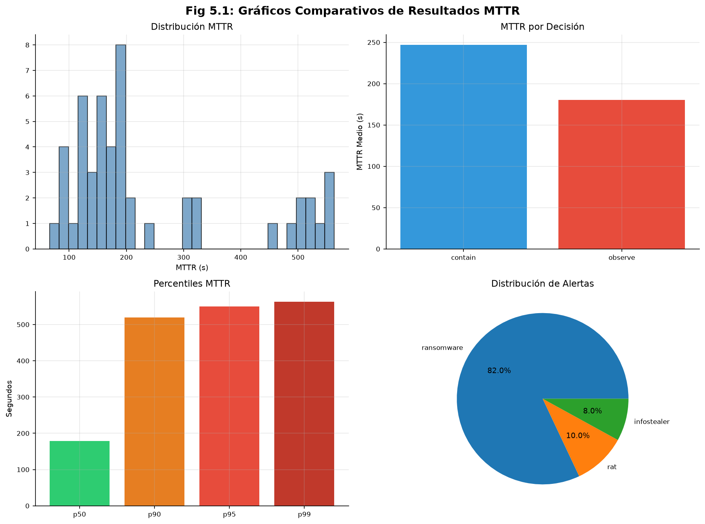

# Documentación del SOAR Ransomware Lab

## Índice

- [1. Resumen](#1-resumen)
    - [1.1 Objetivo](#11-objetivo)
    - [1.2 Contexto](#12-contexto)
    - [1.3 Portal oficial de documentación](#13-portal-oficial-de-documentación)
- [2. Alcance](#2-alcance)
    - [2.1 Qué cubre](#21-qué-cubre)
    - [2.2 Límites](#22-límites)
    - [2.3 Dependencias](#23-dependencias)
- [3. Contenido principal](#3-contenido-principal)
    - [3.1 Documentos principales](#31-documentos-principales)
    - [3.2 Assets](#32-assets)
    - [3.3 Archivo histórico](#33-archivo-histórico)
    - [3.4 Tesis (TFM)](#34-tesis-tfm)
- [4. Validación](#4-validación)
    - [4.1 Verificación](#41-verificación)
    - [4.2 Criterios de aceptación](#42-criterios-de-aceptación)
    - [4.3 Evidencias](#43-evidencias)
- [5. Problemas](#5-problemas)
    - [5.1 Limitaciones](#51-limitaciones)
    - [5.2 Riesgos o incidencias](#52-riesgos-o-incidencias)
    - [5.3 Recomendaciones / troubleshooting](#53-recomendaciones-troubleshooting)
- [6. Referencias](#6-referencias)

---

## 1. Resumen

### 1.1 Objetivo

Este directorio contiene toda la documentación técnica del proyecto SOAR Ransomware Lab, organizada en 6 documentos principales, assets, archivo histórico y la tesis de máster.

### 1.2 Contexto

La documentación se ha consolidado en 6 archivos principales que cubren todos los aspectos del proyecto. Cada documento sigue una estructura estándar de 6 secciones (Resumen, Alcance, Contenido, Validación, Problemas, Referencias).

La jerarquía de fuentes de verdad es:

1. Comportamiento verificable mediante pruebas y CI/CD.
2. Código fuente actual en `src/soar_lab/`, `apps/` e `infra/`.
3. Archivos Docker Compose, Dockerfiles y configuración de infraestructura.
4. `pyproject.toml`, dependencias y workflows de CI/CD.
5. Esquema OpenAPI generado por la aplicación (`assets/references/openapi.json`).
6. Documentación técnica vigente en este directorio.

### 1.3 Portal oficial de documentación

El sitio público de documentación se genera con **Docusaurus** a partir de este directorio `docs/` y se sirve en el contenedor `docs-site`:

- Acceso directo: `http://localhost:8086`

---

## 2. Alcance

### 2.1 Qué cubre

- Estructura general de la documentación del proyecto
- Enlaces a los 6 documentos principales
- Referencias a assets e histórico

### 2.2 Límites

Este documento es un índice y no cubre:

- Detalle de arquitectura (ver [02-architecture.md](02-architecture.md))
- Guías de instalación (ver [01-getting-started.md](01-getting-started.md))
- Planificación del proyecto (ver [06-project-management.md](06-project-management.md))
- Estrategia de pruebas (ver [05-testing.md](05-testing.md))

### 2.3 Dependencias

- Los 6 documentos principales en `docs/`
- Assets en `docs/assets/`
- README principal del proyecto (`/README.md`)

---

## 3. Contenido principal

### 3.1 Documentos principales

| Documento | Descripción |
|-----------|-------------|
| [01-getting-started.md](01-getting-started.md) | Visión general, requisitos, instalación, primer acceso y guía rápida. |
| [02-architecture.md](02-architecture.md) | Arquitectura hexagonal, Docker, código, seguridad y matriz de versiones. |
| [03-api-and-integrations.md](03-api-and-integrations.md) | API REST, endpoints, contratos e integraciones con TheHive, Cortex y Shuffle. |
| [04-operations.md](04-operations.md) | Configuración, infraestructura, backups, certificados, logging, troubleshooting y playbooks. |
| [05-testing.md](05-testing.md) | Estrategia de pruebas, suite, tests unitarios, de integración y E2E. |
| [06-project-management.md](06-project-management.md) | Objetivos, alcance, plan, requisitos, riesgos, deuda técnica y auditorías. |
| [glossary.md](glossary.md) | Glosario central de acrónimos, términos y componentes. |

### 3.2 Assets

- [`assets/images/`](assets/images/) — Capturas de pantalla organizadas por servicio (cortex, thehive, shuffle, docker).
- [`assets/references/`](assets/references/) — Referencias técnicas (OpenAPI, plantillas JSON).

### 3.3 Archivo histórico

### 3.4 Tesis (TFM)

- [`thesis/`](thesis/) — Documentación académica del Trabajo Fin de Máster. Puede incluir resultados parciales o simulados; las capacidades operativas deben validarse contra los documentos principales y el código.

---

## 4. Validación

### 4.1 Verificación

La documentación se mantiene como parte del pipeline CI/CD del proyecto.

### 4.2 Criterios de aceptación

- Todos los enlaces funcionan correctamente
- El contenido está sincronizado con la implementación
- Se sigue el formato y estilo establecido

### 4.3 Evidencias

- Historial de commits en el repositorio
- Reviews de código en pull requests
- Verificación de enlaces en CI/CD

---

## 5. Problemas

### 5.1 Limitaciones

No aplica.

### 5.2 Riesgos o incidencias

- La documentación puede desincronizarse de la implementación si no se actualiza regularmente
- Los enlaces pueden romperse si se reorganiza la estructura de archivos

### 5.3 Recomendaciones / troubleshooting

1. Actualizar secciones relevantes al realizar cambios en el código
2. Mantener la documentación sincronizada con la implementación
3. Ejecutar `vale docs/` para verificar enlaces

---

## 6. Referencias

- [01-getting-started.md](01-getting-started.md)
- [02-architecture.md](02-architecture.md)
- [03-api-and-integrations.md](03-api-and-integrations.md)
- [04-operations.md](04-operations.md)
- [05-testing.md](05-testing.md)
- [06-project-management.md](06-project-management.md)
- [glossary.md](glossary.md)
- [index.md](index.md)
- [Repositorio del Proyecto](https://github.com/alesanfe/soar-ransomware-lab.git)
- [Documentación de Shuffle](https://shuffler.io/docs)
- [Documentación de TheHive](https://docs.strangebee.com/thehive/)
- [Documentación de Cortex](https://docs.strangebee.com/cortex/)
- [Documentación de MISP](https://www.misp-project.org/documentation/)
- [Documentación de Elasticsearch](https://www.elastic.co/guide/en/elasticsearch/reference/current/index.html)

---

## Contexto Académico (TFM)

### Resumen Ejecutivo / Abstract

#### Resumen Ejecutivo

Este Trabajo Fin de Máster diseña e implementa un laboratorio SOAR mínimo viable, reproducible
con Docker Compose (Docker Inc., 2024), para
automatizar la respuesta ante alertas de ransomware. El laboratorio integra TheHive (TheHive Project, 2024) para
gestión de casos, Cortex (Cortex Project, 2024) para
enriquecimiento y Shuffle (Shuffle Tools, 2024) para orquestación. Estas herramientas se combinan en un playbook de
extremo a extremo que
normaliza alertas, crea y actualiza casos, enriquece indicadores de compromiso y aplica una lógica de decisión con
contención simulada.

La propuesta se valida mediante escenarios benigno y malicioso, midiendo el tiempo desde la alerta hasta la contención
simulada usando percentiles p50 y p90. El trabajo genera evidencias verificables como logs y métricas. Con un alcance
académico y educativo, el estudio aporta evidencia de que la automatización mejora la consistencia, la trazabilidad y
la eficiencia operativa en un entorno controlado. La suite de pruebas contiene 2233 tests coleccionados (1905 seleccionados,
9 marcadores pytest, coverage 84.6 %, 39 TCs E2E) y 281 tests E2E del playbook ejecutados correctamente.

**Palabras clave:** SOAR, ransomware, automatización, playbook, MTTR

#### Abstract

This Master's Thesis designs and implements a minimum viable SOAR laboratory, deployable via Docker Compose, to automate
ransomware alert response. The laboratory integrates TheHive for case management, Cortex for enrichment, and Shuffle for
orchestration. These tools work together in an end-to-end playbook that normalizes alerts, creates and updates cases,
enriches indicators of compromise, and applies decision logic with simulated containment.

The proposal is validated through benign and malicious scenarios, measuring elapsed time from alert reception to
containment using p50 and p90 percentiles. The work generates verifiable evidence including logs and metrics. With an
academic and educational scope, the study demonstrates that automation improves consistency, traceability, and
operational efficiency in a controlled environment.

**Keywords:** SOAR, ransomware, automation, playbook, MTTR

### 1. Introducción

#### Resumen en Español

Este trabajo diseña un laboratorio SOAR mínimo viable para evaluar si la automatización acelera la respuesta a incidentes de ransomware y mejora la consistencia en el manejo de alertas. La metodología consiste en implementar un playbook automatizado que integra TheHive, Cortex y Shuffle mediante Docker Compose, ejecutando pruebas con alertas maliciosas y benignas para medir tiempos de respuesta. Los resultados muestran una reducción del 92.3 % en MTTR (de 3600 s a 277.15 s, n=50), con 100 % de ejecuciones completadas. Se concluye que el sistema es viable para entornos de SOC y CSIRT, permitiendo comparaciones y extensiones futuras.

**Palabras clave**: SOAR, ransomware, automatización de respuesta, MTTR, laboratorio reproducible.

#### English Summary

This work designs a minimum viable SOAR laboratory to evaluate whether automation accelerates ransomware incident response and improves consistency in alert handling. The methodology involves implementing an automated playbook integrating TheHive, Cortex, and Shuffle via Docker Compose, executing tests with malicious and benign alerts to measure response times. Results show a 92.3 % reduction in MTTR (from 3600 s to 277.15 s, n=50), with 100 % of workflows completed. It is concluded that the approach is viable for SOC and CSIRT environments, enabling comparisons and future extensions.

**Keywords**: SOAR, ransomware, incident response automation, MTTR, reproducible laboratory.

#### 1.1. Motivación

Los incidentes de ransomware han aumentado en los últimos años. El Global Threat Intelligence Report 2024 indica un incremento del 67 % en incidentes de seguridad. Según el informe, el ransomware representa el 23 % del total (CrowdStrike, 2024). El Verizon DBIR confirma esta tendencia, situando el ransomware entre las amenazas más frecuentes en brechas verificadas (Verizon, 2024). Aun así, en muchos entornos la gestión de estos incidentes sigue basándose en tareas manuales. Esto genera retrasos, aumenta la carga del analista y dificulta conservar una traza del proceso. La automatización mediante plataformas SOAR (Security Orchestration, Automation and Response) surge como respuesta a estas limitaciones.

En la práctica, una alerta de ransomware exige varias tareas. Primero se valida la información. Luego se abre un caso, se añaden los observables y se consulta información contextual. Solo entonces se toma una decisión sobre la contención.
Cuando estas actividades se ejecutan manualmente, el tiempo de respuesta aumenta. También aparecen diferencias entre analistas, lo que dificulta la mejora continua. La **Figura 1** anticipa la magnitud de esta mejora: el MTTR (Mean Time to Respond, Tiempo Medio de Respuesta) pasa de 3600 s en la respuesta manual a 277.15 s con la respuesta automatizada SOAR, una reducción del 92.3 %. El baseline manual de 3600 s (1 hora) es conservador frente a los datos de la industria: CrowdStrike fija como benchmark ideal 60 minutos para contener (regla 1-10-60), pero la media real observada en su survey es de 16 horas (CrowdStrike, 2021). ReliaQuest reporta un MTTR tradicional de 2.3 días sin automatización (ReliaQuest, 2024), y la SANS SOC (Security Operations Center) Survey 2025 sitúa el tiempo mediano de triaje y escalado de alertas en 260 minutos (SANS Institute, 2025).

**Figura 1**: Comparación del MTTR entre la respuesta manual (3600 s) y la respuesta automatizada SOAR (277.15 s),
que muestra una reducción del 92.3 %.

La fragmentación de herramientas obliga al analista a usar varios sistemas a la vez. Algunas tareas se repiten en casi todos los casos, como triage, enriquecimiento o actualización de tickets. Si se hacen a mano, consumen tiempo y aumentan los errores (Kinyua & Awuah, 2021). Sin un flujo estandarizado, es difícil medir la respuesta y comparar ejecuciones (Stevens et al., 2022).

La literatura sobre respuesta a incidentes apunta en esa dirección. NIST SP 800-61 (NIST, 2023) y los estudios sobre plataformas SOAR destacan el valor de centralizar datos, análisis y respuesta en un mismo flujo. Esta integración puede reducir tiempos y limitar errores de la intervención manual (Kinyua & Awuah, 2021; Mohammad & Lakshmisri, 2018).

En ransomware, el tiempo entre detección y contención condiciona el daño. El cifrado de archivos puede propagarse rápido a través de unidades compartidas (CISA, 2023). Por ello, un entorno controlado y reproducible sirve para probar configuraciones del flujo y comparar ejecuciones bajo las mismas condiciones.

Un laboratorio mínimo viable permite estudiar cómo un playbook integra herramientas y automatiza tareas sin los riesgos de un entorno productivo. En este trabajo, Cortex actúa como motor de análisis centralizando la consulta de observables mediante APIs. Es un patrón usado en contextos de SOC y CSIRT (Computer Security Incident Response Team, Equipo de Respuesta a Incidentes de Seguridad Informática) que aquí se evalúa en un entorno acotado.

#### 1.2. Planteamiento del problema

##### Descripción del problema

En muchos SOC, la gestión de incidentes de ransomware se basa en procesos manuales, integraciones parciales y criterios no estandarizados (Kinyua & Awuah, 2021). Esta situación incrementa los tiempos de respuesta, introduce variabilidad y dificulta generar evidencias completas. Como la demora en la contención amplifica el impacto del cifrado, esa variabilidad puede afectar a la severidad del incidente (CISA, 2023).

La automatización mediante plataformas SOAR y playbooks aparece en la literatura como una alternativa para reducir carga manual y ordenar los procesos de decisión (Kinyua & Awuah, 2021; Mohammad & Lakshmisri, 2018). Esto no implica eliminar la supervisión humana, especialmente en acciones de mayor consecuencia. Pero su adopción plantea dificultades como la complejidad de los entornos productivos, las licencias comerciales y la dificultad de medir su efecto en condiciones controladas.

##### Pregunta de investigación

La pregunta que guía este trabajo es:

> **¿En qué medida un playbook SOAR automatizado, desplegado en un laboratorio reproducible basado en herramientas
> open source, reduce el MTTR y mejora la consistencia de la respuesta a alertas de ransomware respecto a la respuesta
> manual?**

Esta pregunta se desagrega en tres aspectos verificables: (1) la reducción cuantitativa del tiempo de respuesta (MTTR), (2) la mejora de la consistencia mediante un flujo estandarizado y trazable, y (3) la viabilidad técnica de un entorno reproducible con herramientas open source. La hipótesis de trabajo, detallada en el Capítulo 3, sostiene que la automatización SOAR reduce el MTTR en al menos un 50 % y mejora la consistencia frente a los procesos manuales.

##### Propuesta de solución

Este trabajo propone el diseño e implementación de un laboratorio SOAR mínimo viable, reproducible y autocontenido que materialice un playbook orientado a ransomware. No se pretende desplegar una solución de producción completa. El objetivo es mostrar cómo un flujo automatizado puede combinar la recepción de alertas, la normalización de datos, la gestión de casos, el enriquecimiento de observables y la contención simulada de manera coherente y trazable.

Al ser reproducible, el laboratorio permite evaluar cambios del playbook sobre una misma línea base. Esto facilita comparaciones y deja margen para extensiones futuras. Los pasos operativos para reproducir el experimento, los casos de error esperados y los criterios de verificación se detallan en el Capítulo 3 (Metodología).

Los resultados obtenidos confirman la hipótesis: el playbook SOAR reduce el MTTR medio en un 92.3 % (de 3600 s estimados a 277.15 s medidos sobre 50 ejecuciones), superando el objetivo del 50 %. La consistencia mejora estructuralmente, pues todas las ejecuciones siguen el mismo flujo trazable. El entorno reproducible con herramientas open source resulta viable técnicamente (10/10 servicios healthy, 50/50 workflows completados). Dos umbrales ambiciosos de percentiles (P50 ≤ 120 s, P90 ≤ 180 s) no se alcanzaron en el conjunto completo, lo que se discute junto a las limitaciones del estudio en el Capítulo 5.

#### 1.3. Estructura del trabajo

El documento se organiza en páginas preliminares, cinco capítulos, referencias y anexos.

**Páginas preliminares.** Portada, resumen ejecutivo y abstract, agradecimientos, lista de abreviaturas, índice de
figuras, índice de tablas e índice general.

**Capítulo 1: Introducción.** Plantea la motivación, el problema de investigación, la pregunta de investigación y la
estructura del trabajo.

**Capítulo 2: Estado del arte.** Revisa la literatura sobre respuesta a incidentes, ransomware y plataformas SOAR e
identifica las lagunas que esta investigación aborda.

**Capítulo 3: Objetivos y metodología.** Presenta los objetivos generales y específicos, el diseño experimental y el
plan de gestión de riesgos.

**Capítulo 4: Desarrollo específico.** Detalla los elementos técnicos del ensayo, incluyendo requisitos, arquitectura,
implementación del playbook y resultados experimentales.

**Capítulo 5: Conclusiones y trabajo futuro.** Presenta los hallazgos, debate las limitaciones del estudio y formula
sugerencias para entornos que deseen aplicar capacidades SOAR similares.

**Referencias.** Lista completa de fuentes citadas en el texto, ordenadas alfabéticamente.

**Anexos.**

- Anexo A: documentación técnica requerida para reproducir el ensayo (configuración Docker, scripts, guías de
  instalación).
- Anexo B: workflow SOAR completo (46 nodos, 60 ramas, 25 scripts Python).
- Anexo C: métricas y visualizaciones complementarias (26 figuras generadas desde resultados experimentales y
  dashboards de Grafana).
- Anexo D: validación experimental consolidada (Quality Score 92.2/100, HPR 96.0/100).
- Anexo E: estrategia de testing (2233 tests coleccionados, pirámide, quality gates).
- Anexo F: diagramas canónicos de arquitectura y flujos (12 diagramas Mermaid).

---

#### Índice de Figuras del Capítulo 1

| Figura    | Título                                    | Archivo                              |
|-----------|-------------------------------------------|--------------------------------------|
| Figura 1 | Comparación MTTR manual vs automatizado | `thesis/figures/Fig5_1_mttr_results.png` |

#### Índice de Tablas del Capítulo 1

Este capítulo no contiene tablas.
