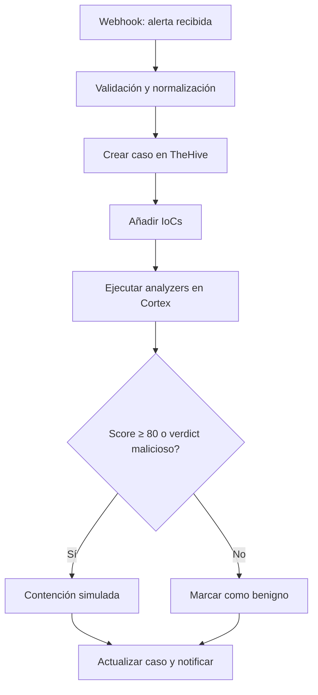
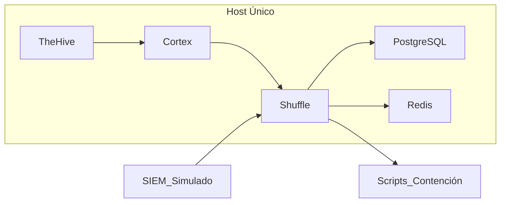

# ALCANCE
> El documento sirve para definir el alcance del TFM, estableciendo los objetivos y límites del proyecto.

## **Visión general**
El objetivo del TFM es **diseñar, implementar y evaluar un laboratorio SOAR mínimo viable (MSV)** para respuesta ante incidentes de ransomware. Este laboratorio ejecutará un **playbook automatizado de extremo a extremo (E2E)** que cubra el flujo completo:
**Webhook → Validación → Caso en TheHive → Adjuntar IoCs → Analyzers en Cortex → Decisión → Contención simulada → Notificación.**

Este alcance busca que el proyecto sea:
- **Realista:** Adaptado a un TFM unipersonal, sin dependencias externas complejas.
- **Reproducible:** Basado en entornos Docker y scripts documentados.
- **Seguro:** Sin uso de malware real ni riesgos para sistemas productivos.

Para considerar el entregable completado, el laboratorio debe permitir la ejecución correcta del playbook en dos escenarios (malicioso y benigno), cumplir los umbrales de tiempo **p50 ≤ 120 s** y **p90 ≤ 180 s**, y generar evidencias completas (logs, capturas y métricas).

---

## **¿Qué incluye?**
- **Playbook E2E único:** Flujo completo con decisiones basadas en score/verdict.
- **Integraciones simuladas:** SIEM simulado para generar alertas y scripts para contención simulada.
- **Métricas de rendimiento (MTTR-demo):** Cálculo de **p50 ≤ 120 s** y **p90 ≤ 180 s** desde alerta hasta contención.
- **Entorno reproducible:** Arquitectura **Docker Compose** con TheHive, Cortex, Shuffle SOAR, PostgreSQL y Redis.
- **Documentación completa:** Diseño del laboratorio, configuración, flujo del playbook, resultados y KPIs.

---

## **¿Qué queda fuera?**
- Integraciones comerciales reales (SIEM, EDR, Firewall).
- Alta disponibilidad (HA) o entornos multi-host complejos.
- Uso de malware funcional (solo muestras inertes para simulación).
- Escenarios avanzados con múltiples playbooks o automatizaciones adicionales.

---

## **Justificación del alcance**
Este enfoque permite:
- Reducir el tiempo de respuesta ante incidentes mediante automatización.
- Evitar riesgos asociados al uso de malware real.
- Facilitar la reproducibilidad para otros profesionales y entornos académicos.
- Cumplir con objetivos medibles y realistas en un marco temporal limitado.

Además, delimitar el alcance evita sobrecarga de tareas y asegura que los recursos se concentren en los objetivos críticos del TFM.

---

## **Tabla de Inclusiones y Exclusiones**
| Categoría      | Incluye                                   | Excluye                          |
|---------------|-------------------------------------------|----------------------------------|
| Playbooks     | 1 flujo E2E completo                     | Múltiples playbooks avanzados   |
| Integraciones | SIEM simulado, contención simulada       | APIs comerciales reales          |
| Seguridad     | Muestras inertes                         | Malware funcional                |
| Infraestructura| Single-host con Docker Compose          | Alta disponibilidad (HA)         |

---

## **Diagrama del flujo del playbook**
Este diagrama ilustra el recorrido completo de una alerta desde su recepción hasta la contención y notificación. Cada paso refleja la lógica del playbook y las decisiones basadas en análisis automatizados.

---

## **Arquitectura del laboratorio**
La arquitectura propuesta se basa en un único host con contenedores Docker para simplificar la implementación y garantizar la reproducibilidad. Incluye herramientas clave como TheHive, Cortex y Shuffle, además de servicios de soporte.

---

## **Infraestructura recomendada**
La infraestructura se diseña para ser segura y fácil de desplegar, evitando complejidad innecesaria y asegurando compatibilidad con entornos académicos.

| Componente    | Descripción                               |
|--------------|-------------------------------------------|
| **VM Windows**| Simulación de endpoint víctima, agente EDR|
| **VM Linux**  | Host principal con Docker y herramientas |
| **Contenedores**| TheHive, Cortex, Shuffle, PostgreSQL, Redis|
