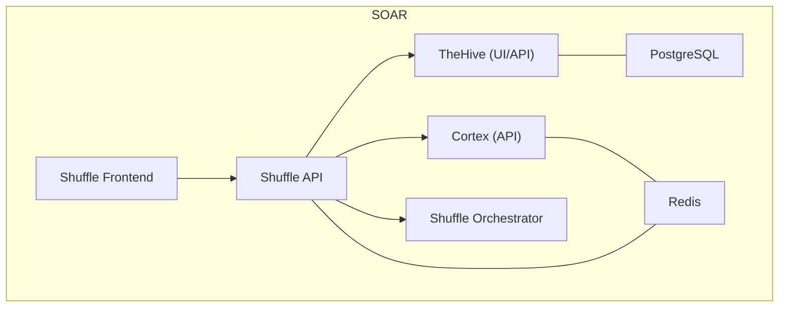
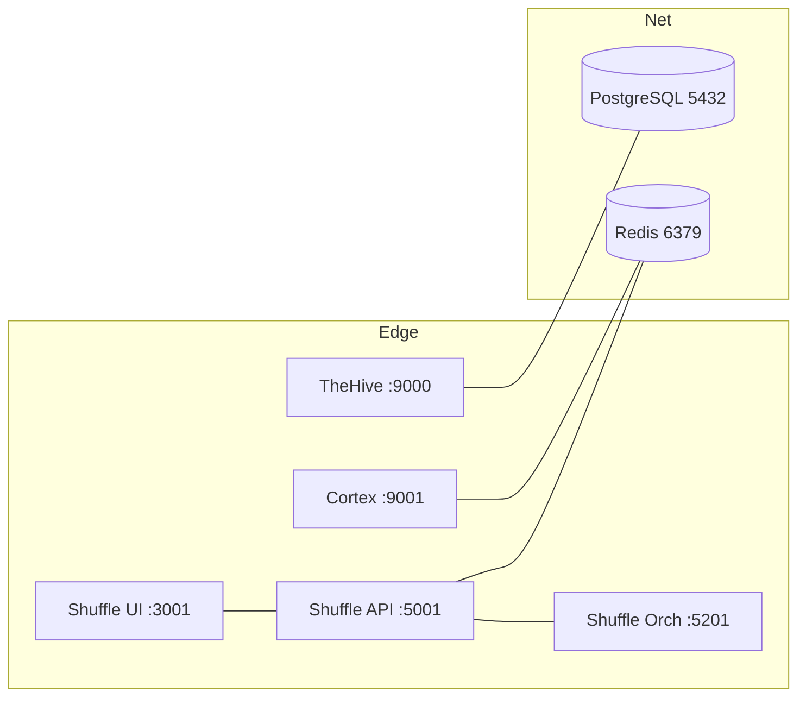
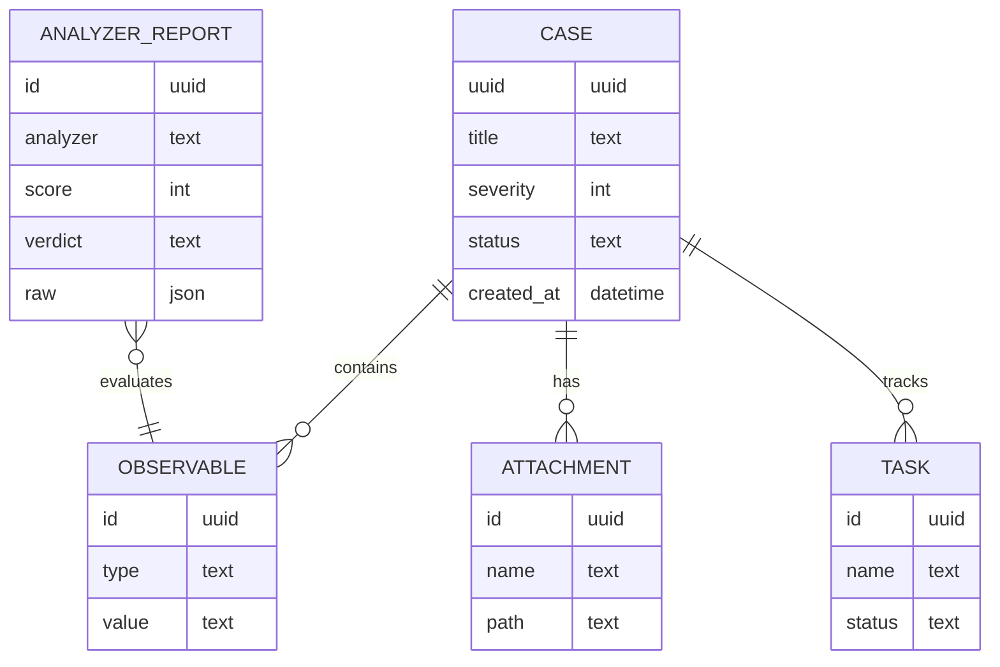
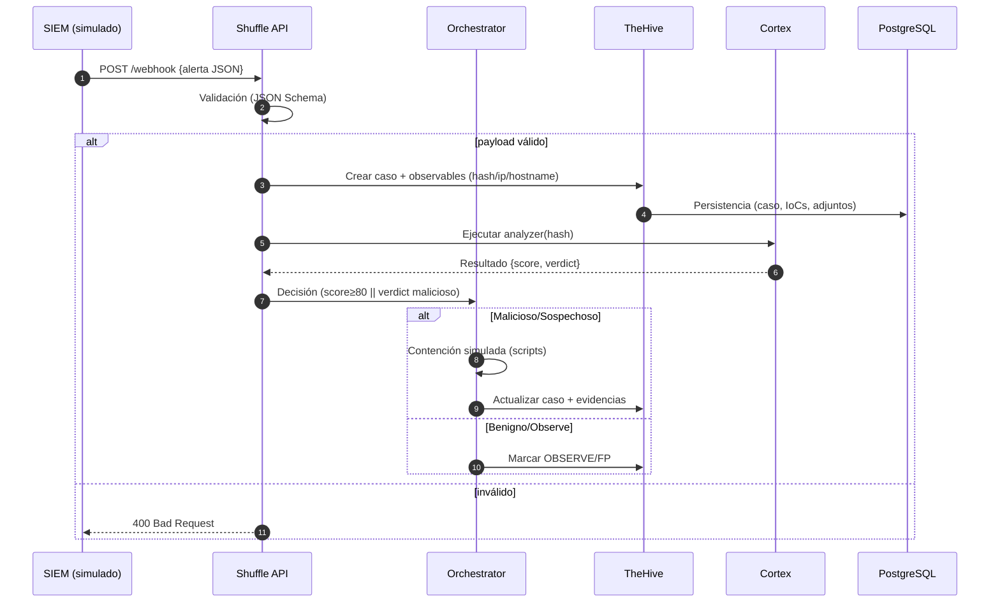
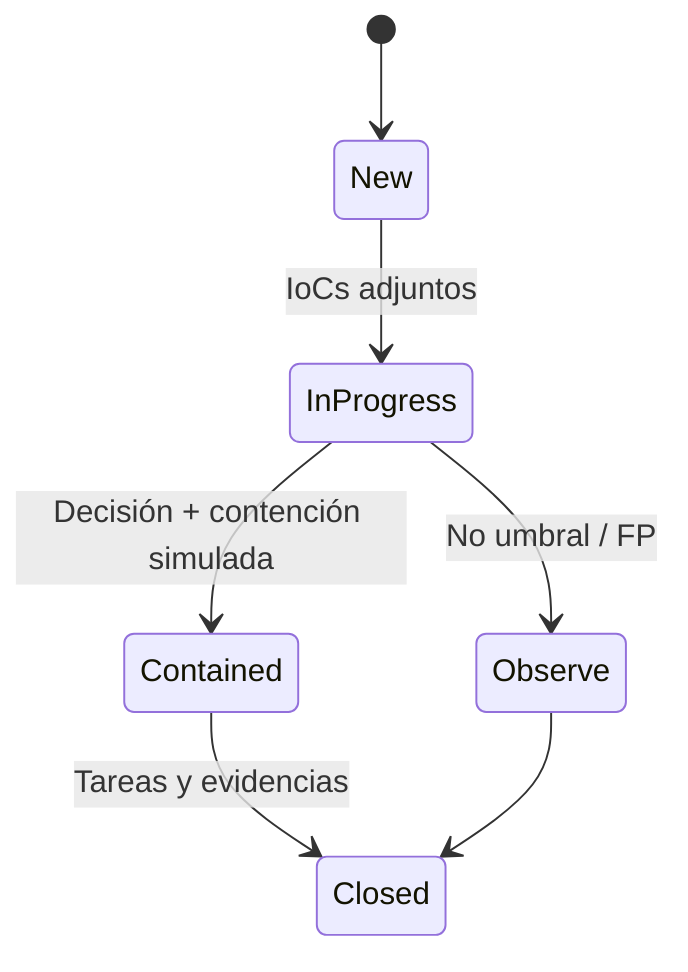

# Arquitectura SOAR single‑host 

> Este documento describe la arquitectura del laboratorio SOAR en un único host con Docker Compose. Incluye puertos, redes, volúmenes, seguridad, operación, rendimiento y diagramas Mermaid. Al final se incluyen `.env.example` y `docker/docker-compose.yml` listos para usar.


## Componentes y responsabilidades

Separar roles reduce acoplamiento y facilita el diagnóstico:

- **TheHive (UI/API):** gestión de casos, observables, tareas y adjuntos.
- **Cortex (API):** ejecución de *analyzers/responders* sobre IoCs; retorna `score/verdict`.
- **Shuffle SOAR (UI/API/Orchestrator):** recibe alertas (webhook), valida, orquesta TheHive/Cortex, decide y ejecuta contención **simulada**.
- **PostgreSQL:** base de datos transaccional para TheHive.
- **Redis:** caché/colas para Cortex y, opcionalmente, para mecanismos en Shuffle.




## Redes/puertos
Segmentación en dos redes: externa (UIs/APIs) y interna (este‑oeste). Regla: exponer lo mínimo y mantener datos sensibles en tránsito interno.


### Redes Docker
- **soar_edge** (expuesta): frontera de entrada para TheHive, Cortex y Shuffle (UI/API/Orch).
- **soar_net** (interna, internal: true): comunicación inter‑servicios; aloja PostgreSQL y Redis; no enrutable desde el host.

### Mapa de puertos (host → contenedor)
- **TheHive:** ${THEHIVE_HTTP_PORT:-9000} → 9000/tcp
- **Cortex:** ${CORTEX_HTTP_PORT:-9001} → 9001/tcp
- **Shuffle UI:** ${SHUFFLE_UI_PORT:-3001} → 3001/tcp
- **Shuffle API:** ${SHUFFLE_API_PORT:-5001} → 5001/tcp
- **Shuffle Orchestrator:** ${SHUFFLE_ORCH_PORT:-5201} → 5201/tcp
- **PostgreSQL:** no expuesto (5432 interno en soar_net)
- **Redis:** no expuesto (6379 interno en soar_net)

## Persistencia de datos y modelo conceptual
Volúmenes nombrados → reconstrucción sin pérdidas y auditoría de acciones. Adjuntos y resultados de analyzers aportan evidencias para defensa del TFM.
- postgres_data → /var/lib/postgresql/data (BD TheHive)
- thehive_data → /data (config, adjuntos, estado de TheHive)
- cortex_data → /var/lib/cortex (jobs, cachés, resultados)
- cortex_analyzers → /opt/Cortex-Analyzers (árbol de analyzers si se monta)
- shuffle_data → /shuffle (workflows, apps, ejecuciones)
- redis_data → /data (opcional para durabilidad)

Esquema conceptual para razonar sobre trazabilidad; no refleja el schema físico de TheHive.


### Flujo E2E del playbook
Este diagrama describe el flujo completo desde la recepción de una alerta hasta la actualización del caso en TheHive, incluyendo la interacción con Cortex para análisis.
- Secuecnia principal

- Estados del caso



### Diagrama físico/lógico
Este diagrama muestra la disposición física y lógica: el host, los contenedores, sus volúmenes, redes y las interacciones con bases de datos.
```mermaid
graph TD
Host[Host Ubuntu/Debian]
subgraph DockerCompose
TheHive[Container: TheHive]
Cortex[Container: Cortex]
ShuffleFE[Container: Shuffle FE]
ShuffleAPI[Container: Shuffle API]
ShuffleORCH[Container: Shuffle Orchestrator]
Postgres[Container: PostgreSQL]
Redis[Container: Redis]
end
Host --> DockerCompose

    %% Volúmenes
    TheHive --> Vol_thehive[(Volume: thehive_data)]
    Cortex --> Vol_cortex[(Volume: cortex_data)]
    Postgres --> Vol_pg[(Volume: postgres_data)]
    ShuffleAPI --> Vol_shuffle[(Volume: shuffle_data)]
    Redis --> Vol_redis[(Volume: redis_data)]

    %% Redes
    TheHive --> Net_edge{Network: soar_edge}
    Cortex --> Net_edge
    ShuffleFE --> Net_edge
    ShuffleAPI --> Net_edge
    ShuffleORCH --> Net_edge
    Postgres --> Net_internal{Network: soar_net}
    Redis --> Net_internal

    %% Interacciones con DB
    TheHive --> Postgres
    Cortex --> Redis
    ShuffleAPI --> Redis
``````

## Seguridad
Reducir superficie y validar entradas. Controles proporcionales a MSV:

- Expuestas: TheHive(9000), Cortex(9001), Shuffle(3001/5001/5201).
- Internas: PostgreSQL(5432), Redis(6379).
- Controles mínimos: TLS frontal (Traefik/Nginx), allowlist IP, .env/secrets, no-new-privileges, tmpfs:/tmp, read_only (si no bloquea), rate‑limit del webhook, timeout + retry en analyzers.
- Validación estricta: JSON Schema (rechazo 400 con detalle).
