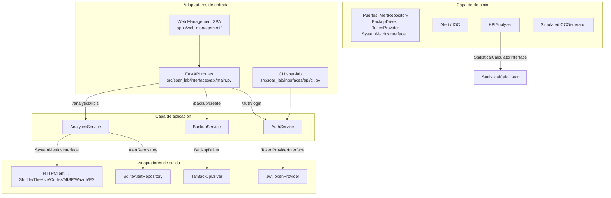

# Arquitectura hexagonal (Ports & Adapters)

El paquete `soar_lab` sigue una arquitectura hexagonal: el dominio define puertos, la aplicación orquesta casos de uso,
y la infraestructura e interfaces implementan los adaptadores.

## Capas principales

| Capa | Ubicación | Responsabilidad |
|------|-----------|----------------|
| **Dominio** | `src/soar_lab/domain/` | Entidades, value objects, reglas puras y contratos de puertos (`ports.py`) |
| **Aplicación** | `src/soar_lab/application/` | Casos de uso, coordinación de adaptadores y DTOs |
| **Infraestructura** | `src/soar_lab/infrastructure/` | Implementaciones de puertos: clientes externos, persistencia, mensajería, monitoreo |
| **Interfaces** | `src/soar_lab/interfaces/` | Puntos de entrada: API REST FastAPI y CLI |
| **Scripts** | `src/soar_lab/scripts/` | Setup, mantenimiento y depuración (no son runtime) |
| **Soporte / utilidades** | `src/soar_lab/{api,analytics,auth,common,config,data,db,logging,resilience,security,validation,simulator}` | Paquetes de conveniencia y soporte: re-exports (`api`), métricas, autenticación, logging, resiliencia, validaciones, transacciones, sanitización y simulador. La lógica de negocio pura permanece en `domain/`. |

> **Nota:** `src/soar_lab/api/` es un paquete de conveniencia que re-exporta `create_app`, `CompositionRoot` y `main` desde `interfaces/api/` para el entrypoint `soar-lab` y la imagen Docker. No contiene lógica de negocio adicional.

## Diagrama de arquitectura hexagonal



## Dominio

Entidades y value objects (`src/soar_lab/domain/models.py`):

- `Alert`: entidad principal de alerta de seguridad (`alert_id`, `hostname`, `src_ip`, `severity`, `iocs`, ...).
- `IOC`: indicador de compromiso con tipo, valor, confianza y tags.
- `AlertSeverity` / `AlertStatus`: enumeraciones de severidad y estado.

Servicios de dominio puros (`src/soar_lab/domain/services/`):

- `KPIAnalyzer`: cálculo de MTTR, percentiles, health score y KPIs agregados.
- `SimulatedIOCGenerator`: generación de IOCs sintéticos (hash, IP, dominio, URL).
- `StatisticalCalculator`: operaciones estadísticas usadas por `KPIAnalyzer`.

Puertos (`src/soar_lab/domain/ports.py`): `AlertRepository`, `IocRepository`, `MetricRepository`, `CaseRepository`, `BackupRepository`, `TestResultRepository`, `ChecksumService`, `StorageProvider`, `BackupDriver`, `TokenProviderInterface`, `SystemMetricsInterface`, `FileSystemInterface`, `LogReader`, `LogParser`, `KPIFormatter`, `StatisticalCalculatorInterface`.

## Aplicación

Casos de uso (`src/soar_lab/application/use_cases/`):

- `AuthService`: autenticación, verificación de credenciales (`WEB_UI_USER`/`WEB_UI_PASSWORD`) y creación/validación de JWT a través de `TokenProviderInterface`.
- `BackupService`: creación, listado y restauración de backups `.tar.gz` usando `BackupDriver` y `BackupStorageProvider`.
- `AnalyticsService`: recopilación de métricas del sistema, KPIs y estadísticas, orquestando `KPIAnalyzer`, repositorios y lectores de logs.

## Puerto → adaptador → implementación

| Puerto (dominio) | Adaptador (infraestructura) | Implementación real |
|------------------|----------------------------|---------------------|
| Envío de alertas | `messaging/send_alert.py` | `HttpAlertSender` (POST al webhook de Shuffle) |
| Simulación de alertas | `simulator/simulate_alerts.py` | Genera alertas Pydantic y las envía vía `send_alert` |
| Persistencia de alertas | `persistence/` | `SqliteAlertRepository`, `InMemoryAlertRepository` |
| Backup | `tar_backup_driver.py`, `backup_service` (application) | `TarBackupDriver` crea `.tar.gz`; `BackupService` orquesta |
| KPI y métricas | `domain/services/kpi_analyzer.py` | `KpiAnalyzer` calcula MTTR y percentiles |
| Autenticación | `jwt_token_provider.py` | `JwtTokenProvider` genera/valida JWT HS256 |
| Ejecución remota de tests | `pytest_test_runner.py` | `PytestTestRunner` lanza `pytest` y devuelve JSON |
| Health check y métricas | `monitoring/health_service.py` | `HealthService` consulta endpoints y recursos |
| Clientes externos | `external/` | `ShuffleClient`, `TheHiveClient`, `CortexClient`, `MISPClient`, `WazuhClient`, `ElasticsearchClient` |
| Configuración | `config_provider.py` | Lee variables `.env` y `settings` para inyección |

## Ejemplo real de flujo: recepción y contención de una alerta

> **Nota**: el ingreso de alertas no pasa por la Lab API. El `main.py` de FastAPI expone métricas, estado y orquestación de casos; la ingestión real ocurre a través del webhook de Shuffle generado por `init_shuffle_webhook.py`.

```text
[src/soar_lab/simulator/simulate_alerts.py] genera alerta Pydantic
        │
        ▼
[infrastructure/messaging/send_alert.py] POST al webhook de Shuffle
        │
        ▼
[Shuffle workflow] recibe la alerta y la reenvía al backend de Shuffle
        │
        ▼
[application/use_cases/analytics_service.py] valida y normaliza el DTO
        │
        ▼
[domain/services/kpi_analyzer.py] registra timestamp inicial
        │
        ▼
[infrastructure/external/integrations/thehive_client.py] crea caso en TheHive
        │
        ▼
[infrastructure/external/integrations/cortex_client.py] ejecuta analyzers
        │
        ▼
[infrastructure/external/integrations/misp_client.py] enriquece IoCs
        │
        ▼
[Shuffle workflow] ejecuta lógica de decisión y contención simulada
        │
        ▼
[infrastructure/external/integrations/thehive_client.py] actualiza caso con resultado
        │
        ▼
[domain/services/kpi_analyzer.py] calcula y registra MTTR
        │
        ▼
[infrastructure/external/integrations/elasticsearch_client.py] almacena métricas KPI
```

## Convenciones de importación

```python
# Lógica pura de dominio
from soar_lab.domain.services.ioc_generator import IOCGenerator
from soar_lab.domain.services.kpi_analyzer import KpiAnalyzer

# Puertos e interfaces del dominio
from soar_lab.domain.ports import BackupDriver, AlertRepository

# Adaptadores de infraestructura
from soar_lab.infrastructure.external.integrations.shuffle_client import ShuffleClient
from soar_lab.infrastructure.messaging.send_alert import HttpAlertSender
from soar_lab.infrastructure.jwt_token_provider import JWTTokenProvider
from soar_lab.infrastructure.persistence.sqlite_alert_repository import SqliteAlertRepository

# Casos de uso
from soar_lab.application.use_cases.backup_service import BackupService

# Interfaces (API/CLI)
from soar_lab.interfaces.api.composition import create_app
```

## Notas de migración

- `api/` quedó en `src/soar_lab/interfaces/api/`.
- `integrations/` se reubicó en `src/soar_lab/infrastructure/external/`.
- `services/` se dividió en `application/use_cases/` (orquestación) y `domain/services/` (lógica pura).
- `infrastructure/setup/` se movió a `src/soar_lab/scripts/setup/`; la carpeta `infrastructure/scripts/` se
  considera legacy y no forma parte del runtime.
- `exceptions.py` centralizado en `src/soar_lab/common/exceptions.py`.
