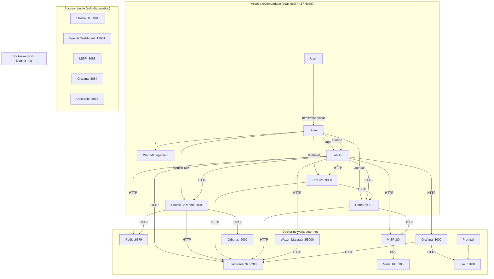
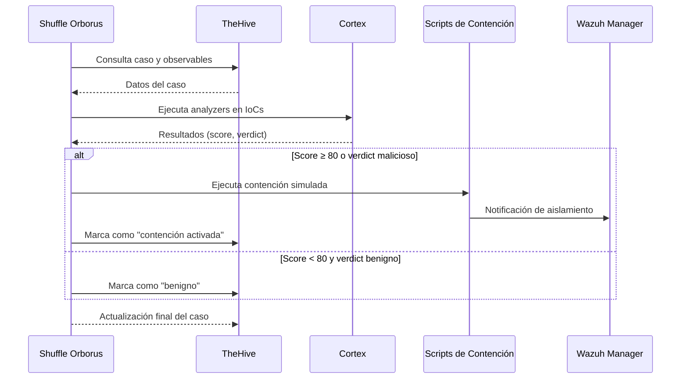

# Arquitectura del SOAR Ransomware Lab

## Índice

- [1. Resumen](#1-resumen)
    - [1.1 Objetivo](#11-objetivo)
    - [1.2 Contexto](#12-contexto)
- [2. Alcance](#2-alcance)
    - [2.1 Qué cubre](#21-qué-cubre)
    - [2.2 Límites](#22-límites)
    - [2.3 Dependencias](#23-dependencias)
- [3. Contenido principal](#3-contenido-principal)
    - [3.1 Arquitectura general](#31-arquitectura-general)
    - [3.2 Componentes y servicios](#32-componentes-y-servicios)
    - [3.3 Redes, puertos y dependencias](#33-redes-puertos-y-dependencias)
    - [3.4 Flujos principales](#34-flujos-principales)
    - [3.5 Diagramas y tablas de apoyo](#35-diagramas-y-tablas-de-apoyo)
- [4. Validación](#4-validación)
    - [4.1 Verificación](#41-verificación)
    - [4.2 Criterios de aceptación](#42-criterios-de-aceptación)
    - [4.3 Evidencias](#43-evidencias)
- [5. Problemas y consideraciones](#5-problemas-y-consideraciones)
    - [5.1 Limitaciones](#51-limitaciones)
    - [5.2 Riesgos o incidencias](#52-riesgos-o-incidencias)
    - [5.3 Recomendaciones / troubleshooting](#53-recomendaciones--troubleshooting)
- [6. Referencias](#6-referencias)

---

## 1. Resumen

### 1.1 Objetivo

Este documento describe la arquitectura del sistema, componentes y principios de diseño del SOAR Ransomware Lab. Su
objetivo es proporcionar una visión integral de la plataforma para comprender su estructura, flujo de datos, seguridad y
despliegue.

### 1.2 Contexto

El SOAR Ransomware Lab es una plataforma de orquestación de seguridad integral diseñada específicamente para la
respuesta ante incidentes de ransomware. Integra múltiples herramientas de seguridad (Shuffle, TheHive, Cortex, MISP,
Wazuh, Wazuh Dashboard) en un entorno Docker Compose unificado para proporcionar capacidades de detección, análisis y
respuesta
automatizada.

## 2. Alcance

### 2.1 Qué cubre

Este documento cubre:

- Arquitectura de alto nivel del sistema
- Componentes principales y sus interacciones
- Flujo de datos y procesamiento de alertas
- Arquitectura de seguridad y defensa en profundidad
- Estrategias de escalabilidad y rendimiento
- Arquitectura de integración y patrones
- Configuración de despliegue (Docker Compose)
- Stack tecnológico y herramientas de desarrollo
- Consideraciones de arquitectura futura

### 2.2 Límites

Este documento no cubre:

- Detalles de configuración específicos de cada herramienta (ver documentación individual)
- Procedimientos operativos paso a paso (ver user_guide.md)
- Estrategias de pruebas específicas (ver testing/)
- Planificación del proyecto (ver docs/project/)
- Contratos de API detallados (ver docs/integrations/api_contracts.md)

### 2.3 Dependencias

Este documento depende de:

- Documentación oficial de cada componente (Shuffle, TheHive, Cortex, MISP, Wazuh)
- Archivos de configuración Docker Compose en `infra/docker/compose/`
- Documentación de seguridad (docs/architecture/security.md)
- Guía de usuario (docs/getting_started/user_guide.md)
- Estrategia de Docker (docs/architecture/docker_architecture.md)
- Estructura del paquete Python (docs/architecture/hexagonal-structure.md)
- Estructura del código fuente (docs/architecture/code_structure.md)

## 3. Contenido principal

### 3.1 Arquitectura general

#### Arquitectura de Código (Python)

El código Python sigue una **arquitectura hexagonal (Ports and Adapters)**. Las dependencias apuntan siempre hacia el
interior; el dominio no conoce detalles de infraestructura ni de interfaces de usuario.

```
src/soar_lab/
├── application/              # Capa de aplicación
│   ├── dto/                  # Objetos de transferencia (DTOs)
│   └── use_cases/            # analytics_service, auth_service, backup_service, etc.
├── common/                   # Excepciones y utilidades compartidas
├── config/                   # Configuración, esquemas y logging
├── data/                     # Esquemas y utilidades de datos
├── domain/                   # Capa de dominio
│   ├── models.py             # Entidades: IOC, Alert, Case
│   ├── ports/                # Protocolos (repositories, integrations, infrastructure)
│   ├── ports.py              # Protocolos alternativos/concentrados
│   ├── services/             # kpi_analyzer, ioc_generator
│   ├── statistical_calculator.py  # Cálculos estadísticos puros
│   └── value_objects/
├── infrastructure/           # Capa de infraestructura
│   ├── artifacts/            # Artefactos generados en runtime
│   ├── external/             # Clientes externos (Shuffle, TheHive, Cortex, MISP, Wazuh)
│   ├── messaging/            # Envío de alertas
│   ├── monitoring/           # Health checks, HealthService, SystemMetricsDriver, KPIAlertManager
│   ├── network_watcher/      # Conectividad dinámica de workers Shuffle
│   ├── persistence/          # Repositorios (SQLite, InMemory)
│   ├── persistence_backup/   # Respaldo de datos de persistencia
│   ├── scripts/              # Scripts auxiliares (patch, edge cases, performance)
│   ├── security/             # Scripts de hardening
│   ├── templates/            # Plantillas de configuración
│   ├── utils/                # Utilidades de archivos
│   ├── jwt_token_provider.py # Generación y validación de tokens JWT
│   ├── pytest_test_runner.py # Ejecución remota de pruebas
│   ├── tar_backup_driver.py  # Driver de backups en tar
│   └── validate_credentials.py # Validación de credenciales de servicios
├── interfaces/               # Capa de interfaces
│   └── api/                  # FastAPI: main.py, auth.py, models.py, cli.py, composition.py
├── scripts/                  # Scripts del laboratorio
│   ├── debug/                # Scripts de depuración
│   ├── maintenance/          # Scripts de mantenimiento
│   ├── setup/                # Scripts de inicialización y despliegue
│   ├── generate_kpi_data.py
│   ├── send_to_both_workflows.py
│   ├── send_wazuh_alert.py
│   └── test_service.py
├── simulator/                # Simulador de alertas SIEM
└── validation/               # Validadores reutilizables
```

**Composition Root:** `src/soar_lab/interfaces/api/composition.py` centraliza el cableado de dependencias. Es el único
lugar donde se instancian adaptadores de infraestructura y se inyectan en los servicios de aplicación y dominio.
Nuevos adaptadores o servicios deben registrarse aquí para mantener la separación de capas.

> **Matrices de referencia**: versiones en [`version_matrix.md`](version_matrix.md) y mapeo de puertos/URLs en
> [`operations/ports_and_urls.md`](../operations/ports_and_urls.md).

#### Arquitectura de Despliegue (Docker)



> **Nota sobre accesos directos:** Shuffle UI, Wazuh Dashboard, MISP, Grafana y Docs Site usan SPA/assets absolutos y no funcionan correctamente bajo subpath en Nginx. Se acceden por sus puertos de host (`8081`, `15601`, `8083`, `8084`, `8086`).

#### Servicios SOAR Core

1. **Shuffle** (`:8081` UI host / `:15001` API host)
    - Orquestador SOAR principal
    - Constructor de workflows drag-and-drop
    - Recibe alertas de Wazuh vía webhook
    - Ejecuta playbooks de respuesta automatizada
    - Orborus ejecuta contenedores de apps como workers

2. **TheHive** (`:19000` host → `:9000` container)
    - Plataforma de gestión de casos de incidentes
    - Seguimiento de evidencias y observables
    - Asignación de tareas y línea de tiempo
    - Se integra con Cortex para enriquecimiento

3. **Cortex** (`:19001` host → `:9001` container)
    - Motor de análisis de IoCs
    - Ejecuta analyzers y responders
    - Se integra con MISP, VirusTotal, etc.
    - Soporte para analyzers personalizados en Python

#### SIEM / Detección

4. **Wazuh Manager** (`:55100` host → `:55000` API, `:15141` host → `:1514` eventos)
    - Detección basada en agentes SIEM/XDR
    - Monitoreo de integridad de archivos
    - Recolección y correlación de logs
    - Envía alertas a Shuffle vía webhook

5. **Wazuh Dashboard** (`:15601` host → `:5601` container)
    - Frontend de visualización para Wazuh Indexer (OpenSearch)
    - Dashboards para datos de eventos de Wazuh
    - Exploración de logs vía Discover
    - Imagen: `wazuh/wazuh-dashboard:4.14.0` (basado en OpenSearch Dashboards)

#### Inteligencia de Amenazas

6. **MISP** (`:8083`)
    - Plataforma de inteligencia de amenazas open-source
    - Compartición y gestión de IoCs
    - Integración de feeds
    - Conectado a analyzers de Cortex

#### Capa de Datos

7. **Elasticsearch** (red Docker interna)
    - `docker.elastic.co/elasticsearch/elasticsearch:7.10.2`
    - Backend para TheHive, Cortex, métricas del Lab API (`soar-metrics`) y datasource de Grafana
    - Agregación de logs y búsqueda full-text
    - Configuración single-node con `xpack.security.enabled=false`; se mantiene un password canónico `ELASTIC_PASSWORD=ElasticLab2024SecurePass` en `.env.full` y en las aplicaciones para compatibilidad con clientes que sí envían credenciales.
    - **No es redundancia**: OpenSearch 2.10.0 se despliega en paralelo porque Shuffle requiere un motor OpenSearch nativo, mientras que TheHive/Cortex dependen de `elastic4play` / ES 7.x (ver [Motores de búsqueda: coexistencia de Elasticsearch y OpenSearch](search_engine_coexistence.md)).

8. **Redis** (interno)
    - Almacenamiento de sesiones y caché para Shuffle
    - Cola de mensajes

9. **MariaDB** (interno)
    - Backend de base de datos para MISP

10. **Tenzir** (nodo de desarrollo, opcional)
    - Imagen: `tenzir/tenzir:main`
    - Puertos host: `15160` → `5160`, `15140` → `1514/udp`
    - Estado: desplegado en `docker-compose.core.yml` pero su pipeline de ingestión no está integrado en los playbooks activos del laboratorio.

#### Acceso y Gestión

10. **Nginx** (`:80`, `:443`)
    - Terminación TLS y proxy inverso en `:443`; `:80` redirige a HTTPS
    - Expone `/` → Web Management, `/thehive/` → TheHive, `/cortex/` → Cortex, `/shuffle-api/` → Shuffle Backend
    - Shuffle UI (`:8081`), Web Management (`:8085`), Docs Site (`:8086`) y Grafana (`:8084`) se acceden directamente por sus puertos
    - **Shuffle UI no soporta subpath en Nginx** (`/shuffle` no funciona por rutas SPA absolutas); usar siempre `http://localhost:8081`

11. **Lab API** (`:8000`)
    - Aplicación FastAPI (`src/soar_lab/interfaces/api/main.py`)
    - Endpoints de gestión y automatización del laboratorio
    - Health check en `/health`
    - WebSocket `/api/ws/logs` para streaming de logs en vivo

12. **Docs Site** (`:8086`)
    - Sitio estático Docusaurus
    - Servido directamente en puerto 8086

#### Zonas de Seguridad

```
┌─────────────────────────────────────────────────────────────┐
│                    Zona DMZ                                   │
│  Web UI  │  API Gateway  │  Load Balancer                    │
├─────────────────────────────────────────────────────────────┤
│                    Zona de Aplicación                           │
│  FastAPI  │  Lógica de Negocio  │  Autenticación               │
├─────────────────────────────────────────────────────────────┤
│                    Zona de Datos                                  │
│  TheHive  │  Cortex  │  OpenSearch  │  PostgreSQL         │
├─────────────────────────────────────────────────────────────┤
│                    Zona de Gestión                             │
│  Docker  │  Monitoreo  │  Logging  │  Backup                 │
└─────────────────────────────────────────────────────────────┘
```

### 3.2 Componentes y servicios

#### Estado Actual de la Arquitectura Hexagonal

El proyecto organiza el código en capas con dirección de dependencias hacia el interior:

- **`src/soar_lab/domain/`**: modelos (`models.py`), puertos (`ports/`, `ports.py`) y servicios de dominio (`services/`).
- **`src/soar_lab/application/`**: casos de uso (`use_cases/`) que dependen de los puertos del dominio.
- **`src/soar_lab/infrastructure/`**: adaptadores concretos (`external/integrations/*_client`, `persistence/*`, `monitoring/`, `messaging/`, `jwt_token_provider.py`, etc.).
- **`src/soar_lab/interfaces/api/composition.py`**: Composition Root que crea los adaptadores, repositorios y servicios y los inyecta en la aplicación FastAPI.

**Deuda Técnica:**

- `domain/ports.py` es extenso; su adopción parcial hace que algunos scripts y helpers aún usen implementaciones concretas.
- Los clientes externos (`infrastructure/external/integrations/`) se usan mayoritariamente vía la fachada de la API y tests; parte del wiring legacy queda por migrar al CompositionRoot.
- La trayectoria es seguir consolidando el CompositionRoot como único punto de creación de instancias.

#### Lógica de Negocio / Servicios (Python)

**Servicios Actuales:**

- **`src/soar_lab/application/use_cases/analytics_service.py`**: Servicio de análisis de alertas y métricas. Depende de domain/ports (AlertRepository,
  MetricRepository, IocRepository, IOCGenerator, StatisticalCalculatorInterface)
- **`src/soar_lab/application/use_cases/auth_service.py`**: Servicio de autenticación y autorización. Depende de domain/ports (TokenProviderInterface)
- **`src/soar_lab/application/use_cases/backup_service.py`**: Servicio de backup y restauración. Depende de domain/ports (BackupDriver,
  BackupStorageProvider)
- **`src/soar_lab/infrastructure/monitoring/health_service.py`**: Servicio de health checks. Depende de domain/ports (HealthCheckInterface,
  SystemMetricsInterface)
- **`src/soar_lab/domain/services/kpi_analyzer.py`**: Analizador de KPIs y métricas. Depende de domain/ports (StatisticalCalculatorInterface)
- **`src/soar_lab/scripts/test_service.py`**: Servicio de ejecución de pruebas. Depende de domain/ports (CacheInterface, TestRunner,
  TestResultParserInterface)
- **`src/soar_lab/scripts/setup/generate_secrets.py`**: Generador de secretos y claves. Depende de domain/ports (FileSystemInterface)

**Dependencias:**

- Los servicios dependen correctamente de domain/ports.py para interfaces (no de infrastructure directamente)
- Esto es consistente con el patrón hexagonal
- Sin embargo, la inyección de dependencias no está completamente implementada en toda la aplicación

#### Servicios SOAR Core

1. **Shuffle** (`:8081` UI host / `:15001` API host)
    - Orquestador SOAR principal
    - Constructor de workflows drag-and-drop
    - Recibe alertas de Wazuh vía webhook
    - Ejecuta playbooks de respuesta automatizada
    - Orborus ejecuta contenedores de apps como workers

2. **TheHive** (`:19000` host → `:9000` container)
    - Plataforma de gestión de casos de incidentes
    - Seguimiento de evidencias y observables
    - Asignación de tareas y línea de tiempo
    - Se integra con Cortex para enriquecimiento

3. **Cortex** (`:19001` host → `:9001` container)
    - Motor de análisis de IoCs
    - Ejecuta analyzers y responders
    - Se integra con MISP, VirusTotal, etc.
    - Soporte para analyzers personalizados en Python

#### SIEM / Detección

4. **Wazuh Manager** (`:55100` host → `:55000` API, `:15141` host → `:1514` eventos)
    - Detección basada en agentes SIEM/XDR
    - Monitoreo de integridad de archivos
    - Recolección y correlación de logs
    - Envía alertas a Shuffle vía webhook

5. **Wazuh Dashboard** (`:15601` host → `:5601` container)
    - Frontend de visualización para Wazuh Indexer (OpenSearch)
    - Dashboards para datos de eventos de Wazuh
    - Exploración de logs vía Discover
    - Imagen: `wazuh/wazuh-dashboard:4.14.0` (basado en OpenSearch Dashboards)

#### Inteligencia de Amenazas

6. **MISP** (`:8083`)
    - Plataforma de inteligencia de amenazas open-source
    - Compartición y gestión de IoCs
    - Integración de feeds
    - Conectado a analyzers de Cortex

#### Capa de Datos

7. **Elasticsearch** (red Docker interna)
    - `docker.elastic.co/elasticsearch/elasticsearch:7.10.2`
    - Backend para TheHive, Cortex, métricas del Lab API (`soar-metrics`) y datasource de Grafana
    - Agregación de logs y búsqueda full-text
    - Configuración single-node con `xpack.security.enabled=false`; se mantiene un password canónico `ELASTIC_PASSWORD=ElasticLab2024SecurePass` en `.env.full` y en las aplicaciones para compatibilidad con clientes que sí envían credenciales.
    - **No es redundancia**: OpenSearch 2.10.0 se despliega en paralelo porque Shuffle requiere un motor OpenSearch nativo, mientras que TheHive/Cortex dependen de `elastic4play` / ES 7.x (ver [Motores de búsqueda: coexistencia de Elasticsearch y OpenSearch](search_engine_coexistence.md)).

8. **Redis** (interno)
    - Almacenamiento de sesiones y caché para Shuffle
    - Cola de mensajes

9. **MariaDB** (interno)
    - Backend de base de datos para MISP

10. **Tenzir** (nodo de desarrollo, opcional)
    - Imagen: `tenzir/tenzir:main`
    - Puertos host: `15160` → `5160`, `15140` → `1514/udp`
    - Estado: desplegado en `docker-compose.core.yml` pero su pipeline de ingestión no está integrado en los playbooks activos del laboratorio.

#### Acceso y Gestión

10. **Nginx** (`:80`, `:443`)
    - Terminación TLS y proxy inverso en `:443`; `:80` redirige a HTTPS
    - Expone `/` → Web Management, `/thehive/` → TheHive, `/cortex/` → Cortex, `/shuffle-api/` → Shuffle Backend
    - Shuffle UI (`:8081`), Web Management (`:8085`), Docs Site (`:8086`) y Grafana (`:8084`) se acceden directamente por sus puertos

11. **Lab API** (`:8000`)
    - Aplicación FastAPI (`src/soar_lab/interfaces/api/main.py`)
    - Endpoints de gestión y automatización del laboratorio
    - Health check en `/health`
    - WebSocket `/api/ws/logs` para streaming de logs en vivo

12. **Docs Site** (`:8086`)
    - Sitio estático Docusaurus
    - Servido directamente en puerto 8086

### 3.4 Flujos principales

#### Pipeline de Procesamiento de Alertas

```
Fuentes de Alertas → API de Ingestión → Validación → Enriquecimiento → Scoring → Almacenamiento → Análisis → Respuesta
```

1. **Ingestión**: Múltiples fuentes de alertas (SIEM, EDR, APIs personalizadas)
2. **Validación**: Validación de esquema y normalización de datos
3. **Enriquecimiento**: Extracción de IoCs, búsqueda de inteligencia de amenazas
4. **Scoring**: Evaluación automatizada de severidad
5. **Almacenamiento**: Almacenamiento persistente en TheHive/OpenSearch
6. **Análisis**: Reconocimiento de patrones y detección de anomalías
7. **Respuesta**: Ejecución automatizada de playbooks

#### Flujo de Respuesta

```
Detección de Alerta → Triage → Investigación → Contención → Erradicación → Recuperación → Reporte
```

#### Real vs. Simulado en la Respuesta

| Fase | Estado | Evidencia / Notas |
|------|--------|-------------------|
| Detección (Wazuh) | Real | Agentes y manager levantados en Docker; alertas generadas por simulador o agente real |
| Ingesta Webhook (Shuffle) | Real | `init_shuffle_webhook.py` crea workflow y webhook en Shuffle |
| Triage (Shuffle) | Real | Reglas del workflow evalúan severidad y contexto |
| Enriquecimiento (Cortex/MISP) | Real | Analyzers y búsquedas en MISP ejecutados en contenedores |
| Creación de caso (TheHive) | Real | Caso, observables y tareas creados por API |
| Contención de endpoint | Simulado | `notify.sh` / acciones de contención notifican pero no aíslan la red real; requiere agente EDR real para acción real |
| Erradicación/Recuperación | Simulado | Scripts de notificación y métricas; no se eliminan amenazas reales |
| Métricas (MTTR/KPIs) | Real | Cálculo e indexación en `soar-metrics` y Grafana |

> Ver también [`docs/architecture/security.md`](security.md#estado-de-implementación-de-controles-clave) para la matriz de controles de seguridad.

#### Integraciones Externas

1. **Herramientas de Seguridad**
    - Sistemas SIEM (Splunk, ELK)
    - Soluciones EDR (CrowdStrike, SentinelOne)
    - Plataformas de inteligencia de amenazas
    - Escáners de vulnerabilidades

2. **Sistemas de Comunicación**
    - Notificaciones por email
    - Integración Slack/Teams
    - Alertas SMS
    - Callbacks de webhook

3. **Infraestructura**
    - Proveedores cloud (AWS, Azure, GCP)
    - Orquestación de contenedores (Kubernetes)
    - Plataformas de logging (Splunk, ELK)

#### Patrones de Integración

1. **Integración basada en API**
    - APIs RESTful
    - Interfaces GraphQL
    - Suscripciones de webhook
    - Arquitectura event-driven

2. **Integración basada en Mensajes**
    - Colas RabbitMQ
    - Streams Apache Kafka
    - Redis pub/sub
    - Event sourcing

3. **Integración basada en Archivos**
    - Importaciones CSV/JSON
    - Parsing de archivos de log
    - Sincronización de configuración
    - Operaciones de backup/restore

#### Diagramas de Secuencia de Integración

**Flujo de Alerta SIEM → Shuffle → TheHive → Cortex:**


**Flujo de Respuesta Automatizada:**



### 3.3 Redes, puertos y dependencias

#### Servicios, Puertos y Redes

| Servicio           | Imagen                                                | Puerto host→contenedor                | Redes                 |
|--------------------|-------------------------------------------------------|---------------------------------------|-----------------------|
| `nginx`            | nginx:1.25-alpine                                     | `80:80`, `443:443`                    | soar_net, logging_net |
| `thehive`          | thehiveproject/thehive:3.5.2-1                        | `${THEHIVE_HTTP_PORT:-9000}:9000`    | soar_net              |
| `cortex`           | thehiveproject/cortex:3.1.4-1                         | `${CORTEX_HTTP_PORT:-19001}:9001`     | soar_net              |
| `shuffle-backend`  | ghcr.io/shuffle/shuffle-backend:2.2.1*                | `${SHUFFLE_API_PORT:-15001}:5001`     | soar_net              |
| `shuffle-frontend` | ghcr.io/shuffle/shuffle-frontend:2.2.1*               | `${SHUFFLE_UI_PORT:-8081}:80`         | soar_net              |
| `orborus`          | ghcr.io/shuffle/shuffle-orborus:2.2.1*                | — (interno)                           | soar_net              |
| `elasticsearch`    | docker.elastic.co/elasticsearch/elasticsearch:7.10.2    | `${ELASTICSEARCH_PORT:-19200}:9200`   | soar_net, ti_net      |
| `redis`            | redis:7-alpine                                        | `${REDIS_PORT:-6379}:6379`            | soar_net, ti_net      |
| `wazuh.dashboard`  | wazuh/wazuh-dashboard:4.14.0                          | `${WAZUH_DASHBOARD_PORT:-15601}:5601` | soar_net              |
| `wazuh-manager`    | wazuh/wazuh-manager:4.14.0                            | `${WAZUH_API_PORT:-55100}:55000`      | soar_net              |
| `misp`             | ghcr.io/misp/misp-docker/misp-core:2.4.177*           | `${MISP_PORT:-8083}:80`               | soar_net              |
| `misp-db`          | mariadb:10.11                                         | — (interno)                           | soar_net              |
| `misp-modules`     | ghcr.io/misp/misp-docker/misp-modules:2.4.177*        | — (interno)                           | soar_net              |
| `api`              | build: apps/api/Dockerfile                            | `${API_PORT:-8000}:8000`              | soar_net, ti_net      |
| `web-management`   | build: apps/web-management/Dockerfile                 | `8085:80`                             | soar_net              |
| `docs-site`        | build: apps/docs-site/Dockerfile                      | `${DOCS_PORT:-8086}:3000`             | soar_net              |
| `loki`             | grafana/loki:2.9.10                                   | — (interno)                           | logging_net           |
| `promtail`         | grafana/promtail:2.9.10                               | — (interno)                           | logging_net           |
| `grafana`          | grafana/grafana:10.3.4                                | `${GRAFANA_PORT:-8084}:3000`          | logging_net, soar_net |
| `grafana-db`       | postgres:14-alpine                                    | — (interno)                           | logging_net           |

#### Redes Docker

| Red           | Driver            | Subred          | Propósito                                                                         |
|---------------|-------------------|-----------------|-----------------------------------------------------------------------------------|
| `soar_net`    | bridge            | `10.100.0.0/16` | Red interna principal — todos los servicios SOAR                                  |
| `ti_net`      | bridge (internal) | `172.22.0.0/16` | Red de Threat Intelligence — Elasticsearch, Redis, API, MISP (sin acceso externo) |
| `logging_net` | bridge            | `172.23.0.0/16` | Red de logging — Loki, Promtail, Grafana                                          |
| `soar_edge`   | bridge            | —               | Definida en compose, reservada para acceso externo futuro                         |

> ⚠️ **Windows/Hyper-V**: rangos de puertos 55000–55099 y 5600–5699 están excluidos por reservas de Hyper-V. Los puertos
> del stack están configurados fuera de esos rangos (ver `.env.full`).

#### Volúmenes Persistentes

| Volumen                   | Servicio        | Contenido persistido                                             |
|---------------------------|-----------------|------------------------------------------------------------------|
| `thehive_files`           | thehive         | Ficheros adjuntos a casos e incidentes                           |
| `cortex_data`             | cortex          | Configuración y datos de analyzers                               |
| `es_data`                 | elasticsearch   | Índices y datos de búsqueda (TheHive, Shuffle, métricas del Lab API) |
| `redis_data`              | redis           | Persistencia de sesiones y caché de Shuffle                      |
| `wazuh-dashboard-config`  | wazuh.dashboard | Configuración y personalización de Wazuh Dashboard               |
| `shuffle_apps`            | shuffle-backend | Apps y workflows de Shuffle                                      |
| `shuffle_files`           | shuffle-backend | Ficheros subidos al orquestador                                  |
| `misp_files`              | misp            | Eventos e IoCs de MISP                                           |
| `misp_db`                 | misp-db         | Base de datos MariaDB de MISP                                    |
| `misp_configs`            | misp            | Configuración de MISP                                            |
| `misp_logs`               | misp            | Logs de aplicación de MISP                                       |
| `nginx_logs`              | nginx           | Logs de acceso y error del proxy                                 |
| `wazuh_config`            | wazuh-manager   | Configuración del agente Wazuh                                   |
| `wazuh_etc`               | wazuh-manager   | Configuración de ossec                                           |
| `wazuh_logs`              | wazuh-manager   | Logs de alertas y eventos                                        |
| `wazuh_queue`             | wazuh-manager   | Cola de eventos pendientes                                       |
| `wazuh_api_config`        | wazuh-manager   | Credenciales de la API Wazuh                                     |
| `wazuh_active_response`   | wazuh-manager   | Scripts de respuesta activa                                      |
| `wazuh_wodles`            | wazuh-manager   | Módulos de integración Wazuh                                     |
| `wazuh_var_multigroups`   | wazuh-manager   | Grupos de agentes                                                |
| `wazuh_integration_files` | wazuh-manager   | Integraciones externas de Wazuh                                  |
| `loki_data`               | loki            | Logs almacenados en Loki                                         |
| `grafana_data`            | grafana         | Configuración y dashboards de Grafana                            |
| `grafana_db_data`         | grafana-db      | Base de datos PostgreSQL de Grafana                              |

#### Stack Tecnológico

**Tecnologías principales**

- **Backend**: Python 3.11, FastAPI (`src/soar_lab/interfaces/api/main.py`)
- **Frontend**: HTML/JS estático (Web Management), React (Shuffle)
- **SIEM**: Wazuh Manager 4.14.0
- **Visualización**: Wazuh Dashboard 4.14.0 (OpenSearch Dashboards) en `:15601`
- **Orquestación SOAR**: Shuffle (`ghcr.io/shuffle/shuffle-backend`, `-frontend`, `-orborus` 2.2.1)
- **Gestión de casos**: TheHive 3.5.2-1 + Cortex 3.1.4-1
- **Inteligencia de amenazas**: MISP 2.4.177 (`ghcr.io/misp/misp-docker/misp-core`)
- **Búsqueda e índices**: Elasticsearch 7.10.2
- **Caché**: Redis 7
- **Proxy inverso / TLS**: Nginx 1.25
- **Documentación**: Docusaurus 3 (`apps/docs-site`)
- **Contenerización**: Docker Compose 2

**Tecnologías de seguridad**

- **Autenticación**: JWT con `python-jose`, algoritmo `HS256`
- **Cifrado en tránsito**: TLS 1.2/1.3 vía Nginx con certificados autofirmados
- **Escaneo de vulnerabilidades**: Script `scan_vulnerabilities.sh` (Trivy a verificar en CI)
- **Gestión de secretos**: Variables de entorno `.env.full`; generación mediante `soar-lab generate-secrets`

**Herramientas de desarrollo**

- **Control de versiones**: Git, GitHub
- **CI/CD**: GitHub Actions
- **Pruebas**: pytest, Playwright/Selenium para UI
- **Documentación**: Docusaurus (portal oficial); Swagger/OpenAPI como fuente de contratos HTTP

### 3.5 Diagramas y tablas de apoyo

#### Diagrama de Arquitectura de Capas

El diagrama de arquitectura de alto nivel presentado en la sección 3.1 muestra la organización en capas del sistema,
desde la capa de acceso hasta la capa de datos e infraestructura.

#### Zonas de Seguridad

El diagrama de zonas de seguridad presentado en la sección 3.1 muestra la segmentación de red en cuatro zonas
principales: DMZ, Aplicación, Datos y Gestión.

#### Matriz de estado funcional por componente

| Componente / Capacidad | Estado | Evidencia / Notas |
|------------------------|--------|---------------------|
| Nginx (proxy inverso + TLS) | Parcial | Termina TLS en `https://soar.local`; no incluye WAF ni rate limiting avanzado |
| Lab API (FastAPI) | Implementado | Endpoints de auth, analytics, backups, tests y proxy SOAR en `src/soar_lab/interfaces/api/main.py` |
| Shuffle (workflows + webhook) | Implementado | Contenedores `shuffle-frontend`, `shuffle-backend`, `orborus`; workflow creado por `init_shuffle_webhook.py` |
| TheHive | Implementado | Gestión de casos vía API en `soar_thehive:9000`; conexión con Cortex |
| Cortex | Implementado | Analyzers ejecutados en contenedor; conexión con TheHive y MISP |
| MISP | Implementado | Servicio `misp` en Docker; enriquecimiento de IoCs |
| Wazuh (manager/indexer/dashboard) | Implementado | Stack Wazuh 4.14.0 levantado; alertas vía webhook o agente |
| Elasticsearch | Implementado | `elasticsearch:9200`; backend para Shuffle, TheHive, métricas `soar-metrics` |
| Redis | Implementado | Sesiones/caché de Shuffle |
| Grafana + Loki + Promtail | Implementado | Dashboards en `:8084`; logs centralizados; plugin ES instalado |
| Web Management | Implementado | SPA en `:8085` |
| Network Watcher | Implementado | Reconecta workers de Shuffle a `soar_net` |
| Tenzir Node | Parcial / No verificado | Desplegado en `docker-compose.core.yml` pero pipeline no integrado en playbooks activos |
| Autenticación JWT | Implementado | Firma `HS256`; secret en `.env.full`; endpoints `/auth/login` y `/auth/verify` |
| Autenticación MFA | Planificado | No hay implementación operativa |
| Single Sign-On (SSO/SAML/OIDC) | Planificado | No implementado |
| WAF | No verificado / Planificado | Nginx no está configurado como WAF |
| DMZ / segmentación de red real | Simulado | Diagramas conceptuales; contenedores comparten Docker networks |
| Contención de endpoints | Simulado | Acciones de contención son notificaciones/logs; no aísla endpoints reales sin agente EDR |
| Erradicación / recuperación automatizada | Simulado | Backups y métricas reales; la erradicación real no se ejecuta |
| Cifrado en tránsito (TLS) | Parcial | TLS en Nginx y Wazuh; tráfico interno Docker mayoritariamente HTTP |
| Cifrado en reposo | Parcial / No verificado | Depende de configuración de Elasticsearch/OpenSearch/Wazuh Indexer |

## 4. Validación

### 4.1 Verificación

La arquitectura se verifica mediante:

- Pruebas de configuración Docker (`tests/unit/test_docker_services_validation.py`)
- Pruebas de runtime Docker (`tests/integration/test_docker_runtime_validation.py`)
- Pruebas de navegador (`tests/browser/test_live_web_services_validation.py`)
- Health checks de cada servicio
- Verificación de conectividad entre redes Docker

### 4.2 Criterios de aceptación

La arquitectura se considera válida cuando:

- Todos los servicios inician correctamente
- Los puertos configurados son accesibles
- Las redes Docker permiten la comunicación requerida
- Los volúmenes persistentes montan correctamente
- Los servicios de logging y monitoreo funcionan
- Los health checks pasan para todos los servicios

### 4.3 Evidencias

Las evidencias de validación incluyen:

- Logs de Docker Compose (`docker compose up`)
- Salida de `docker ps` mostrando contenedores en ejecución
- Logs de health checks
- Resultados de pruebas automatizadas
- Capturas de pantalla de interfaces web accesibles

## 5. Problemas y consideraciones

### 5.1 Limitaciones

- **Single-node Elasticsearch**: Configuración actual no soporta clustering
- **Requisitos de recursos**: Mínimo 8GB RAM requerido para stack completo
- **Windows/Hyper-V**: Restricciones en rangos de puertos debido a reservas de Hyper-V
- **Escalabilidad**: Diseño actual no soporta alta disponibilidad nativa
- **Persistencia**: Los volúmenes Docker requieren backup manual

### 5.2 Riesgos o incidencias

- **Pérdida de datos**: Si los volúmenes Docker no se respaldan regularmente
- **Conflictos de puertos**: Puertos ya en uso en el host pueden causar fallos
- **Dependencias de red**: Requiere conectividad a internet para pulls de imágenes
- **Versiones de componentes**: Actualizaciones pueden romper compatibilidad
- **Seguridad**: Configuración por defecto puede no ser adecuada para producción

### 5.3 Recomendaciones / troubleshooting

- **Backup**: Implementar backup automatizado de volúmenes persistentes
  ```bash
  # Crear backup vía API
  curl -X POST http://localhost:8000/api/backup/create \
    -H "Authorization: Bearer $TOKEN" \
    -H "Content-Type: application/json" \
    -d '{"name": "manual-backup"}'
  ```
- **Procedimiento de Backup de Volúmenes**:
    - Los volúmenes Docker usan bind mounts a `artifacts/data/`
    - Backup manual: Copiar directorio `artifacts/data/` a ubicación segura
    - Backup automatizado: Llamar al endpoint `/api/backup/create` o programar tarea con `curl`
    - Restauración: Llamar al endpoint `/api/backup/restore` con el nombre del backup
- **Monitoreo**: Configurar alertas para health checks y métricas de recursos
- **Seguridad**: Revisar y hardening de configuración antes de despliegue en producción
- **Documentación**: Mantener documentación actualizada con cambios de configuración
- **Testing**: Ejecutar pruebas de configuración antes de cambios en Docker Compose

## 6. Referencias

- **Repositorio del Proyecto**: [alesanfe/soar-ransomware-lab](https://github.com/alesanfe/soar-ransomware-lab.git)
- **Documentación de Shuffle**: https://shuffler.io/docs
- **Documentación de TheHive**: https://docs.strangebee.com/thehive/
- **Documentación de Cortex**: https://docs.strangebee.com/cortex/
- **Documentación de MISP**: https://www.misp-project.org/documentation/
- **Documentación de Wazuh**: https://documentation.wazuh.com/
- **Documentación de Elasticsearch**: https://www.elastic.co/guide/en/elasticsearch/reference/current/index.html
- **Documentación de Docker Compose**: https://docs.docker.com/compose/
- **Documentación de FastAPI**: https://fastapi.tiangolo.com/
- **Documentación de Nginx**: https://nginx.org/en/docs/
- **Documentación de Seguridad**: [docs/architecture/security.md](security.md)
- **Guía de Usuario**: [docs/getting_started/user_guide.md](../getting_started/user_guide.md)
- **Estrategia de Docker**: [docs/architecture/docker_architecture.md](docker_architecture.md)

---

**Mejoras implementadas:**

- Corregidas referencias a docs/core/ a rutas correctas (docs/architecture/)
- Documentados procedimientos de backup de volúmenes en sección 5.3
- Añadidos diagramas de secuencia Mermaid para flujos de integración en sección 3.4

