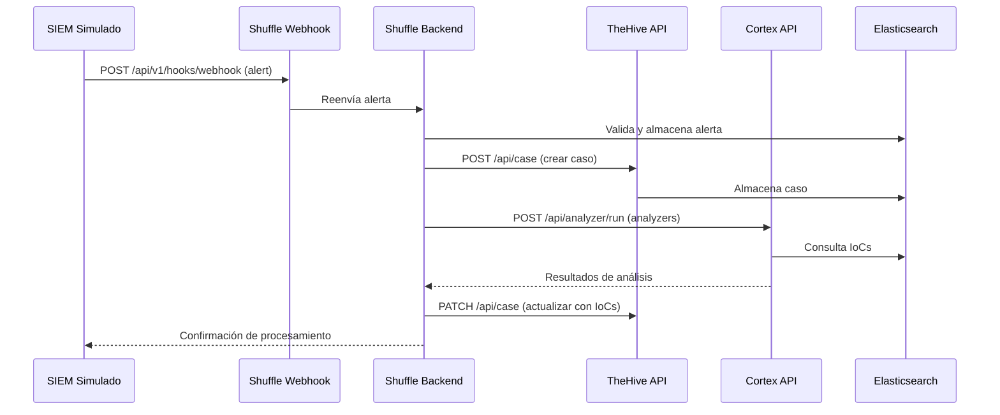
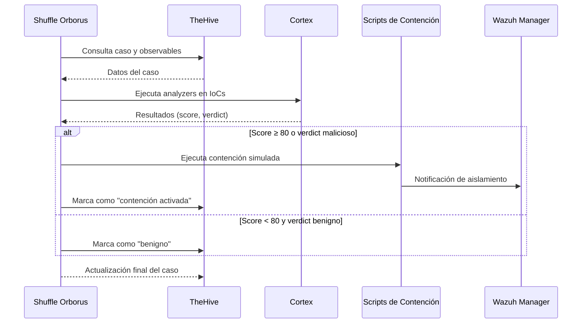

# Arquitectura del SOAR Ransomware Lab

## Índice

- [1. Resumen](#1-resumen)
    - [1.1 Objetivo](#11-objetivo)
    - [1.2 Contexto](#12-contexto)
- [2. Alcance](#2-alcance)
    - [2.1 Qué cubre](#21-qué-cubre)
    - [2.2 Límites](#22-límites)
    - [2.3 Dependencias](#23-dependencias)
- [3. Contenido principal](#3-contenido-principal)
    - [3.1 Arquitectura general](#31-arquitectura-general)
    - [3.2 Componentes y servicios](#32-componentes-y-servicios)
    - [3.3 Redes, puertos y dependencias](#33-redes-puertos-y-dependencias)
    - [3.4 Flujos principales](#34-flujos-principales)
    - [3.5 Diagramas y tablas de apoyo](#35-diagramas-y-tablas-de-apoyo)
- [4. Validación](#4-validación)
    - [4.1 Verificación](#41-verificación)
    - [4.2 Criterios de aceptación](#42-criterios-de-aceptación)
    - [4.3 Evidencias](#43-evidencias)
- [5. Problemas y consideraciones](#5-problemas-y-consideraciones)
    - [5.1 Limitaciones](#51-limitaciones)
    - [5.2 Riesgos o incidencias](#52-riesgos-o-incidencias)
    - [5.3 Recomendaciones / troubleshooting](#53-recomendaciones--troubleshooting)
- [6. Referencias](#6-referencias)

---

## 1. Resumen

### 1.1 Objetivo

Este documento describe la arquitectura del sistema, componentes y principios de diseño del SOAR Ransomware Lab. Su
objetivo es proporcionar una visión integral de la plataforma para comprender su estructura, flujo de datos, seguridad y
despliegue.

### 1.2 Contexto

El SOAR Ransomware Lab es una plataforma de orquestación de seguridad integral diseñada específicamente para la
respuesta ante incidentes de ransomware. Integra múltiples herramientas de seguridad (Shuffle, TheHive, Cortex, MISP,
Wazuh, Kibana) en un entorno Docker Compose unificado para proporcionar capacidades de detección, análisis y respuesta
automatizada.

## 2. Alcance

### 2.1 Qué cubre

Este documento cubre:

- Arquitectura de alto nivel del sistema
- Componentes principales y sus interacciones
- Flujo de datos y procesamiento de alertas
- Arquitectura de seguridad y defensa en profundidad
- Estrategias de escalabilidad y rendimiento
- Arquitectura de integración y patrones
- Configuración de despliegue (Docker Compose)
- Stack tecnológico y herramientas de desarrollo
- Consideraciones de arquitectura futura

### 2.2 Límites

Este documento no cubre:

- Detalles de configuración específicos de cada herramienta (ver documentación individual)
- Procedimientos operativos paso a paso (ver user_guide.md)
- Estrategias de pruebas específicas (ver testing/)
- Planificación del proyecto (ver docs/project/)
- Contratos de API detallados (ver docs/integrations/api_contracts.md)

### 2.3 Dependencias

Este documento depende de:

- Documentación oficial de cada componente (Shuffle, TheHive, Cortex, MISP, Wazuh)
- Archivos de configuración Docker Compose en `infra/docker/compose/`
- Documentación de seguridad (docs/architecture/security.md)
- Guía de usuario (docs/getting_started/user_guide.md)
- Estrategia de Docker (docs/architecture/docker_architecture.md)

## 3. Contenido principal

### 3.1 Arquitectura general

#### Arquitectura de Código (Python)

El código Python sigue una arquitectura en capas con influencia del patrón hexagonal:

```
src/soar_lab/
├── api/                    # Capa de presentación (FastAPI)
│   ├── main.py            # FastAPI application
│   ├── composition.py     # Dependency injection
│   ├── dependencies.py   # FastAPI dependencies
│   ├── auth.py           # Authentication endpoints
│   ├── models.py         # Pydantic models
│   └── cli.py            # CLI commands
├── domain/                # Capa de dominio (business logic)
│   ├── models.py         # Domain entities (Alert, Case, IOC)
│   ├── ports.py          # Domain ports/interfaces (433 líneas de protocolos)
│   ├── ports/            # Port definitions
│   ├── alert_generator.py # Alert generation logic
│   ├── ioc_generator.py  # IOC generation logic
│   └── statistical_calculator.py # Statistical calculations
├── services/              # Capa de servicios (application logic)
│   ├── analytics_service.py
│   ├── auth_service.py
│   ├── backup_service.py
│   ├── health_service.py
│   ├── kpi_analyzer.py
│   ├── test_service.py
│   └── generate_secrets.py
├── infrastructure/        # Capa de infraestructura (adapters)
│   ├── persistence/      # Data persistence
│   ├── clients.py        # Integration clients factory
│   ├── http_client.py    # HTTP client
│   ├── file_log_reader.py
│   ├── path_service.py
│   ├── cleanup_service.py
│   ├── health_check_adapter.py
│   ├── http_alert_sender.py
│   ├── in_memory_alert_repository.py
│   ├── in_memory_storage.py
│   ├── jwt_token_provider.py
│   ├── kpi_formatter.py
│   ├── log_parser.py
│   ├── pytest_output_parser.py
│   ├── pytest_test_runner.py
│   ├── subprocess_runner.py
│   ├── system_metrics_driver.py
│   ├── tar_backup_driver.py
│   ├── websocket_manager.py
│   ├── checksum_utils.py
│   ├── config_provider.py
│   ├── filesystem_storage.py
│   └── security/         # Security-related infrastructure
├── integrations/          # External integrations
│   ├── base_client.py
│   ├── cortex_client.py
│   ├── misp_client.py
│   ├── shuffle_client.py
│   ├── thehive_client.py
│   └── shuffle/          # Shuffle-specific integration code
├── config/                # Configuration
│   ├── settings.py
│   ├── schemas.py
│   └── logging.py
├── validation/            # Validation logic
│   └── validators.py
└── exceptions.py         # Custom exceptions
```

**Nota:** La estructura actual incluye directorios adicionales como `infrastructure/security/` e `integrations/shuffle/`
que no estaban documentados anteriormente.

#### Arquitectura de Despliegue (Docker)

```
┌────────────────────────────────────────────────────────────────────────┐
│                         Capa de Acceso (Nginx)                            │
│  :80 Web UI (redirect to HTTPS)  │  :443 HTTPS                           │
├────────────────────────────────────────────────────────────────────────┤
│                         Capa de Orquestación SOAR                         │
│  Shuffle UI :8081  │  Shuffle API :5001  │  Orborus (ejecutor worker)  │
├────────────────────────────────────────────────────────────────────────┤
│                         Capa de Respuesta a Incidentes                   │
│  TheHive :9000 (casos)  │  Cortex :9001 (analyzers)                    │
├────────────────────────────────────────────────────────────────────────┤
│                         Capa de SIEM / Detección                          │
│  Wazuh Manager :1514-1516 (eventos)  │  Kibana :15601 (dashboards)      │
├────────────────────────────────────────────────────────────────────────┤
│                         Capa de Inteligencia de Amenazas                  │
│  MISP :8083 (plataforma TI)                                               │
├────────────────────────────────────────────────────────────────────────┤
│                         Capa de Gestión y API                           │
│  Lab API :8000 (FastAPI)  │  Docs Site :8086                           │
├────────────────────────────────────────────────────────────────────────┤
│                         Capa de Datos e Infraestructura                 │
│  Elasticsearch (interno)  │  Redis (interno)  │  MariaDB (MISP)      │
└────────────────────────────────────────────────────────────────────────┘
```

#### Servicios SOAR Core

1. **Shuffle** (`:8081` UI / `:5001` API`)
    - Orquestador SOAR principal
    - Constructor de workflows drag-and-drop
    - Recibe alertas de Wazuh vía webhook
    - Ejecuta playbooks de respuesta automatizada
    - Orborus ejecuta contenedores de apps como workers

2. **TheHive** (`:9000`)
    - Plataforma de gestión de casos de incidentes
    - Seguimiento de evidencias y observables
    - Asignación de tareas y línea de tiempo
    - Se integra con Cortex para enriquecimiento

3. **Cortex** (`:9001`)
    - Motor de análisis de IoCs
    - Ejecuta analyzers y responders
    - Se integra con MISP, VirusTotal, etc.
    - Soporte para analyzers personalizados en Python

#### SIEM / Detección

4. **Wazuh Manager** (`:1514-1516` eventos, `:55100` API interno)
    - Detección basada en agentes SIEM/XDR
    - Monitoreo de integridad de archivos
    - Recolección y correlación de logs
    - Envía alertas a Shuffle vía webhook

5. **Kibana** (`:15601`)
    - Frontend de visualización para Elasticsearch
    - Dashboards para datos de eventos de Wazuh
    - Exploración de logs vía Discover
    - Imagen: `docker.elastic.co/kibana/kibana:7.17.29`

#### Inteligencia de Amenazas

6. **MISP** (`:8082`)
    - Plataforma de inteligencia de amenazas open-source
    - Compartición y gestión de IoCs
    - Integración de feeds
    - Conectado a analyzers de Cortex

#### Capa de Datos

7. **Elasticsearch** (red Docker interna)
    - `docker.elastic.co/elasticsearch/elasticsearch:7.17.29`
    - Backend compartido para Shuffle, TheHive y Kibana
    - Agregación de logs y búsqueda full-text
    - Configuración single-node con xpack.security habilitado

8. **Redis** (interno)
    - Almacenamiento de sesiones y caché para Shuffle
    - Cola de mensajes

9. **MariaDB** (interno)
    - Backend de base de datos para MISP

#### Acceso y Gestión

10. **Nginx** (`:80`, `:443`)
    - Proxy inverso para todos los servicios
    - Sirve UI de gestión web estática en `:80` (redirect to HTTPS)
    - Proxy inverso HTTPS en `:443`

11. **Lab API** (`:8000`)
    - Aplicación FastAPI (`apps/api/entrypoint.py`)
    - Endpoints de gestión y automatización del laboratorio
    - Health check en `/health`

12. **Docs Site** (`:8086`)
    - Sitio estático Docusaurus
    - Servido directamente en puerto 8086

#### Zonas de Seguridad

```
┌─────────────────────────────────────────────────────────────┐
│                    Zona DMZ                                   │
│  Web UI  │  API Gateway  │  Load Balancer                    │
├─────────────────────────────────────────────────────────────┤
│                    Zona de Aplicación                           │
│  FastAPI  │  Lógica de Negocio  │  Autenticación               │
├─────────────────────────────────────────────────────────────┤
│                    Zona de Datos                                  │
│  TheHive  │  Cortex  │  Elasticsearch  │  PostgreSQL         │
├─────────────────────────────────────────────────────────────┤
│                    Zona de Gestión                             │
│  Docker  │  Monitoreo  │  Logging  │  Backup                 │
└─────────────────────────────────────────────────────────────┘
```

### 3.2 Componentes y servicios

#### Estado Actual de la Arquitectura Hexagonal

**Nota Importante:** La implementación actual no sigue estrictamente el patrón hexagonal. Aunque el código está
organizado en capas (domain, services, infrastructure), existen acoplamientos y desviaciones:

- **domain/ports.py**: Contiene 433 líneas definiendo múltiples protocolos (AlertRepository, IocRepository,
  StorageProvider, BackupDriver, TestRunner, etc.) pero su uso es limitado
- **services/**: Tiene dependencias directas a domain/ports.py (no a infrastructure directamente), lo cual es correcto
  según el patrón
- **infrastructure/**: Contiene implementaciones concretas de los protocolos definidos en domain/ports.py
- **integrations/**: Los clientes de integración (Cortex, MISP, Shuffle, TheHive) están implementados pero su uso es
  limitado en la aplicación actual

**Deuda Técnica:**

- Los ports definidos en domain/ports.py no se utilizan consistentemente en toda la aplicación
- Algunos servicios tienen dependencias directas a implementaciones de infrastructure en lugar de depender solo de
  interfaces
- La inyección de dependencias no está completamente implementada

#### Lógica de Negocio / Servicios (Python)

**Servicios Actuales (src/soar_lab/services/):**

- **analytics_service.py**: Servicio de análisis de alertas y métricas. Depende de domain/ports (AlertRepository,
  MetricRepository, IocRepository, IOCGenerator, StatisticalCalculatorInterface)
- **auth_service.py**: Servicio de autenticación y autorización. Depende de domain/ports (TokenProviderInterface)
- **backup_service.py**: Servicio de backup y restauración. Depende de domain/ports (BackupDriver,
  BackupStorageProvider)
- **health_service.py**: Servicio de health checks. Depende de domain/ports (HealthCheckInterface,
  SystemMetricsInterface)
- **kpi_analyzer.py**: Analizador de KPIs y métricas. Depende de domain/ports (StatisticalCalculatorInterface)
- **test_service.py**: Servicio de ejecución de pruebas. Depende de domain/ports (CacheInterface, TestRunner,
  TestResultParserInterface)
- **generate_secrets.py**: Generador de secretos y claves. Depende de domain/ports (FileSystemInterface)

**Dependencias:**

- Los servicios dependen correctamente de domain/ports.py para interfaces (no de infrastructure directamente)
- Esto es consistente con el patrón hexagonal
- Sin embargo, la inyección de dependencias no está completamente implementada en toda la aplicación

#### Servicios SOAR Core

1. **Shuffle** (`:8081` UI / `:5001` API`)
    - Orquestador SOAR principal
    - Constructor de workflows drag-and-drop
    - Recibe alertas de Wazuh vía webhook
    - Ejecuta playbooks de respuesta automatizada
    - Orborus ejecuta contenedores de apps como workers

2. **TheHive** (`:9000`)
    - Plataforma de gestión de casos de incidentes
    - Seguimiento de evidencias y observables
    - Asignación de tareas y línea de tiempo
    - Se integra con Cortex para enriquecimiento

3. **Cortex** (`:9001`)
    - Motor de análisis de IoCs
    - Ejecuta analyzers y responders
    - Se integra con MISP, VirusTotal, etc.
    - Soporte para analyzers personalizados en Python

#### SIEM / Detección

4. **Wazuh Manager** (`:1514-1516` eventos, `:55100` API interno)
    - Detección basada en agentes SIEM/XDR
    - Monitoreo de integridad de archivos
    - Recolección y correlación de logs
    - Envía alertas a Shuffle vía webhook

5. **Kibana** (`:15601`)
    - Frontend de visualización para Elasticsearch
    - Dashboards para datos de eventos de Wazuh
    - Exploración de logs vía Discover
    - Imagen: `docker.elastic.co/kibana/kibana:7.17.29`

#### Inteligencia de Amenazas

6. **MISP** (`:8082`)
    - Plataforma de inteligencia de amenazas open-source
    - Compartición y gestión de IoCs
    - Integración de feeds
    - Conectado a analyzers de Cortex

#### Capa de Datos

7. **Elasticsearch** (red Docker interna)
    - `docker.elastic.co/elasticsearch/elasticsearch:7.17.29`
    - Backend compartido para Shuffle, TheHive y Kibana
    - Agregación de logs y búsqueda full-text
    - Configuración single-node con xpack.security habilitado

8. **Redis** (interno)
    - Almacenamiento de sesiones y caché para Shuffle
    - Cola de mensajes

9. **MariaDB** (interno)
    - Backend de base de datos para MISP

#### Acceso y Gestión

10. **Nginx** (`:80`, `:443`)
    - Proxy inverso para todos los servicios
    - Sirve UI de gestión web estática en `:80` (redirect to HTTPS)
    - Proxy inverso HTTPS en `:443`

11. **Lab API** (`:8000`)
    - Aplicación FastAPI (`apps/api/entrypoint.py`)
    - Endpoints de gestión y automatización del laboratorio
    - Health check en `/health`

12. **Docs Site** (`:8086`)
    - Sitio estático Docusaurus
    - Servido directamente en puerto 8086

### 3.4 Flujos principales

#### Pipeline de Procesamiento de Alertas

```
Fuentes de Alertas → API de Ingestión → Validación → Enriquecimiento → Scoring → Almacenamiento → Análisis → Respuesta
```

1. **Ingestión**: Múltiples fuentes de alertas (SIEM, EDR, APIs personalizadas)
2. **Validación**: Validación de esquema y normalización de datos
3. **Enriquecimiento**: Extracción de IoCs, búsqueda de inteligencia de amenazas
4. **Scoring**: Evaluación automatizada de severidad
5. **Almacenamiento**: Almacenamiento persistente en TheHive/Elasticsearch
6. **Análisis**: Reconocimiento de patrones y detección de anomalías
7. **Respuesta**: Ejecución automatizada de playbooks

#### Flujo de Respuesta

```
Detección de Alerta → Triage → Investigación → Contención → Erradicación → Recuperación → Reporte
```

#### Integraciones Externas

1. **Herramientas de Seguridad**
    - Sistemas SIEM (Splunk, ELK)
    - Soluciones EDR (CrowdStrike, SentinelOne)
    - Plataformas de inteligencia de amenazas
    - Escáners de vulnerabilidades

2. **Sistemas de Comunicación**
    - Notificaciones por email
    - Integración Slack/Teams
    - Alertas SMS
    - Callbacks de webhook

3. **Infraestructura**
    - Proveedores cloud (AWS, Azure, GCP)
    - Orquestación de contenedores (Kubernetes)
    - Plataformas de logging (Splunk, ELK)

#### Patrones de Integración

1. **Integración basada en API**
    - APIs RESTful
    - Interfaces GraphQL
    - Suscripciones de webhook
    - Arquitectura event-driven

2. **Integración basada en Mensajes**
    - Colas RabbitMQ
    - Streams Apache Kafka
    - Redis pub/sub
    - Event sourcing

3. **Integración basada en Archivos**
    - Importaciones CSV/JSON
    - Parsing de archivos de log
    - Sincronización de configuración
    - Operaciones de backup/restore

#### Diagramas de Secuencia de Integración

**Flujo de Alerta SIEM → Shuffle → TheHive → Cortex:**



**Flujo de Respuesta Automatizada:**



### 3.3 Redes, puertos y dependencias

#### Servicios, Puertos y Redes

| Servicio           | Imagen                                                | Puerto host→contenedor                                       | Redes                 |
|--------------------|-------------------------------------------------------|--------------------------------------------------------------|-----------------------|
| `nginx`            | nginx:1.25-alpine                                     | `80:80`, `8085:80`*                                          | soar_net, logging_net |
| `thehive`          | thehiveproject/thehive:3.5.2-1                        | `${THEHIVE_HTTP_PORT:-9000}:9000`                            | soar_net              |
| `cortex`           | thehiveproject/cortex:3.1.4-1                         | `${CORTEX_HTTP_PORT:-9001}:9001`                             | soar_net              |
| `shuffle-backend`  | ghcr.io/shuffle/shuffle-backend:2.2.1*               | `${SHUFFLE_API_PORT:-5001}:5001`                             | soar_net              |
| `shuffle-frontend` | ghcr.io/shuffle/shuffle-frontend:2.2.1*              | `${SHUFFLE_UI_PORT:-8081}:80`                                | soar_net              |
| `orborus`          | ghcr.io/shuffle/shuffle-orborus:2.2.1*               | — (interno)                                                  | soar_net              |
| `elasticsearch`    | docker.elastic.co/elasticsearch/elasticsearch:7.17.29 | `${ELASTICSEARCH_PORT:-9201}:9200`                           | soar_net, ti_net      |
| `redis`            | redis:7-alpine                                        | `${REDIS_PORT:-6379}:6379`                                   | soar_net, ti_net      |
| `kibana`           | docker.elastic.co/kibana/kibana:7.17.29               | `${WAZUH_DASHBOARD_PORT:-15601}:5601`                        | soar_net              |
| `wazuh-manager`    | wazuh/wazuh-manager:4.14.0                            | `${WAZUH_EVENTS_PORT:-15141}:1514`, `1515:1515`, `1516:1516` | soar_net              |
| `misp`             | ghcr.io/misp/misp-docker/misp-core:2.4.177*           | `${MISP_PORT:-8083}:80`                                      | soar_net              |
| `misp-db`          | mariadb:10.11                                         | — (interno)                                                  | soar_net              |
| `misp-modules`     | ghcr.io/misp/misp-docker/misp-modules:2.4.177*         | — (interno)                                                  | soar_net              |
| `api`              | build: apps/api/Dockerfile                            | `${API_PORT:-8000}:8000`                                     | soar_net, ti_net      |
| `web-management`   | build: apps/web-management/Dockerfile                 | `8085:80`                                                    | soar_net              |
| `docs-site`        | build: apps/docs-site/Dockerfile                      | `${DOCS_PORT:-8086}:3000`                                    | soar_net              |
| `loki`             | grafana/loki:2.9.10                                   | — (interno)                                                  | logging_net           |
| `promtail`         | grafana/promtail:2.9.10                               | — (interno)                                                  | logging_net           |
| `grafana`          | grafana/grafana:10.3.4                                | `${GRAFANA_PORT:-8084}:3000`                                 | logging_net, soar_net |
| `grafana-db`       | postgres:15-alpine                                    | — (interno)                                                  | logging_net           |

#### Redes Docker

| Red           | Driver            | Subred          | Propósito                                                                         |
|---------------|-------------------|-----------------|-----------------------------------------------------------------------------------|
| `soar_net`    | bridge            | `10.100.0.0/16` | Red interna principal — todos los servicios SOAR                                  |
| `ti_net`      | bridge (internal) | `172.22.0.0/16` | Red de Threat Intelligence — Elasticsearch, Redis, API, MISP (sin acceso externo) |
| `logging_net` | bridge            | `172.23.0.0/16` | Red de logging — Loki, Promtail, Grafana                                          |
| `soar_edge`   | bridge            | —               | Definida en compose, reservada para acceso externo futuro                         |

> ⚠️ **Windows/Hyper-V**: rangos de puertos 55000–55099 y 5600–5699 están excluidos por reservas de Hyper-V. Los puertos
> del stack están configurados fuera de esos rangos (ver `.env.full`).

#### Volúmenes Persistentes

| Volumen                   | Servicio        | Contenido persistido                                   |
|---------------------------|-----------------|--------------------------------------------------------|
| `thehive_files`           | thehive         | Ficheros adjuntos a casos e incidentes                 |
| `cortex_data`             | cortex          | Configuración y datos de analyzers                     |
| `es_data`                 | elasticsearch   | Índices y datos de búsqueda (TheHive, Shuffle, Kibana) |
| `redis_data`              | redis           | Persistencia de sesiones y caché de Shuffle            |
| `kibana_data`             | kibana          | Configuración de dashboards y visualizaciones          |
| `shuffle_apps`            | shuffle-backend | Apps y workflows de Shuffle                            |
| `shuffle_files`           | shuffle-backend | Ficheros subidos al orquestador                        |
| `misp_files`              | misp            | Eventos e IoCs de MISP                                 |
| `misp_db`                 | misp-db         | Base de datos MariaDB de MISP                          |
| `misp_configs`            | misp            | Configuración de MISP                                  |
| `misp_logs`               | misp            | Logs de aplicación de MISP                             |
| `nginx_logs`              | nginx           | Logs de acceso y error del proxy                       |
| `wazuh_config`            | wazuh-manager   | Configuración del agente Wazuh                         |
| `wazuh_etc`               | wazuh-manager   | Configuración de ossec                                 |
| `wazuh_logs`              | wazuh-manager   | Logs de alertas y eventos                              |
| `wazuh_queue`             | wazuh-manager   | Cola de eventos pendientes                             |
| `wazuh_api_config`        | wazuh-manager   | Credenciales de la API Wazuh                           |
| `wazuh_active_response`   | wazuh-manager   | Scripts de respuesta activa                            |
| `wazuh_wodles`            | wazuh-manager   | Módulos de integración Wazuh                           |
| `wazuh_var_multigroups`   | wazuh-manager   | Grupos de agentes                                      |
| `wazuh_integration_files` | wazuh-manager   | Integraciones externas de Wazuh                        |
| `loki_data`               | loki            | Logs almacenados en Loki                               |
| `grafana_data`            | grafana         | Configuración y dashboards de Grafana                  |
| `grafana_db_data`         | grafana-db      | Base de datos PostgreSQL de Grafana                    |

#### Stack Tecnológico

**Core Technologies**

- **Backend**: Python 3.11, FastAPI (`apps/api/entrypoint.py`)
- **Frontend**: Static HTML/JS (web-management), React (Shuffle)
- **SIEM**: Wazuh Manager 4.14.0
- **Visualization**: Kibana 7.17.29
- **SOAR**: Shuffle (backend + frontend + orborus)
- **Case Management**: TheHive 5 + Cortex
- **Threat Intel**: MISP
- **Search**: Elasticsearch 7.17.29
- **Cache**: Redis 7
- **Proxy**: Nginx 1.25
- **Docs**: Docusaurus 3
- **Containerization**: Docker Compose 2

**Security Technologies**

- **Authentication**: JWT, OAuth 2.0
- **Encryption**: TLS 1.3, AES-256
- **Vulnerability Scanning**: OWASP ZAP, Snyk
- **Secret Management**: HashiCorp Vault

**Development Tools**

- **Version Control**: Git, GitHub
- **CI/CD**: GitHub Actions, Jenkins
- **Testing**: pytest, Selenium, Playwright
- **Documentation**: MkDocs, Swagger

### 3.5 Diagramas y tablas de apoyo

#### Diagrama de Arquitectura de Capas

El diagrama de arquitectura de alto nivel presentado en la sección 3.1 muestra la organización en capas del sistema,
desde la capa de acceso hasta la capa de datos e infraestructura.

#### Zonas de Seguridad

El diagrama de zonas de seguridad presentado en la sección 3.1 muestra la segmentación de red en cuatro zonas
principales: DMZ, Aplicación, Datos y Gestión.

## 4. Validación

### 4.1 Verificación

La arquitectura se verifica mediante:

- Pruebas de configuración Docker (`tests/unit/test_docker_services_validation.py`)
- Pruebas de runtime Docker (`tests/integration/test_docker_runtime_validation.py`)
- Pruebas de navegador (`tests/browser/test_live_web_services_validation.py`)
- Health checks de cada servicio
- Verificación de conectividad entre redes Docker

### 4.2 Criterios de aceptación

La arquitectura se considera válida cuando:

- Todos los servicios inician correctamente
- Los puertos configurados son accesibles
- Las redes Docker permiten la comunicación requerida
- Los volúmenes persistentes montan correctamente
- Los servicios de logging y monitoreo funcionan
- Los health checks pasan para todos los servicios

### 4.3 Evidencias

Las evidencias de validación incluyen:

- Logs de Docker Compose (`docker-compose up`)
- Salida de `docker ps` mostrando contenedores en ejecución
- Logs de health checks
- Resultados de pruebas automatizadas
- Capturas de pantalla de interfaces web accesibles

## 5. Problemas y consideraciones

### 5.1 Limitaciones

- **Single-node Elasticsearch**: Configuración actual no soporta clustering
- **Requisitos de recursos**: Mínimo 8GB RAM requerido para stack completo
- **Windows/Hyper-V**: Restricciones en rangos de puertos debido a reservas de Hyper-V
- **Escalabilidad**: Diseño actual no soporta alta disponibilidad nativa
- **Persistencia**: Los volúmenes Docker requieren backup manual

### 5.2 Riesgos o incidencias

- **Pérdida de datos**: Si los volúmenes Docker no se respaldan regularmente
- **Conflictos de puertos**: Puertos ya en uso en el host pueden causar fallos
- **Dependencias de red**: Requiere conectividad a internet para pulls de imágenes
- **Versiones de componentes**: Actualizaciones pueden romper compatibilidad
- **Seguridad**: Configuración por defecto puede no ser adecuada para producción

### 5.3 Recomendaciones / troubleshooting

- **Backup**: Implementar backup automatizado de volúmenes persistentes
  ```bash
  # Script de backup disponible en scripts/infra/backup.sh
  make backup
  ```
- **Procedimiento de Backup de Volúmenes**:
    - Los volúmenes Docker usan bind mounts a `artifacts/data/`
    - Backup manual: Copiar directorio `artifacts/data/` a ubicación segura
    - Backup automatizado: Usar `scripts/infra/backup.sh` o configurar crontab
    - Restauración: Usar `scripts/infra/restore.sh` con el backup deseado
- **Monitoreo**: Configurar alertas para health checks y métricas de recursos
- **Seguridad**: Revisar y hardening de configuración antes de despliegue en producción
- **Documentación**: Mantener documentación actualizada con cambios de configuración
- **Testing**: Ejecutar pruebas de configuración antes de cambios en Docker Compose

## 6. Referencias

- **Repositorio del Proyecto**: [alesanfe/soar-ransomware-lab](https://github.com/alesanfe/soar-ransomware-lab.git)
- **Documentación de Shuffle**: https://shuffler.io/docs
- **Documentación de TheHive**: https://docs.strangebee.com/thehive/
- **Documentación de Cortex**: https://docs.strangebee.com/cortex/
- **Documentación de MISP**: https://www.misp-project.org/documentation/
- **Documentación de Wazuh**: https://documentation.wazuh.com/
- **Documentación de Elasticsearch**: https://www.elastic.co/guide/en/elasticsearch/reference/current/index.html
- **Documentación de Docker Compose**: https://docs.docker.com/compose/
- **Documentación de FastAPI**: https://fastapi.tiangolo.com/
- **Documentación de Nginx**: https://nginx.org/en/docs/
- **Documentación de Seguridad**: [docs/architecture/security.md](security.md)
- **Guía de Usuario**: [docs/getting_started/user_guide.md](../getting_started/user_guide.md)
- **Estrategia de Docker**: [docs/architecture/docker_architecture.md](docker_architecture.md)

---

**Mejoras implementadas:**

- Corregidas referencias a docs/core/ a rutas correctas (docs/architecture/)
- Documentados procedimientos de backup de volúmenes en sección 5.3
- Añadidos diagramas de secuencia Mermaid para flujos de integración en sección 3.4

