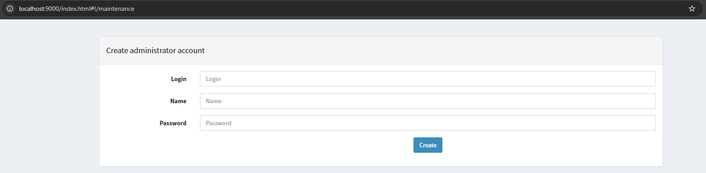
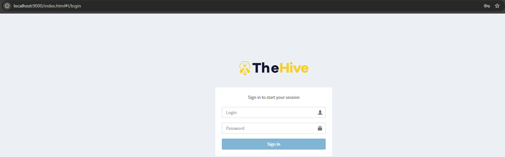
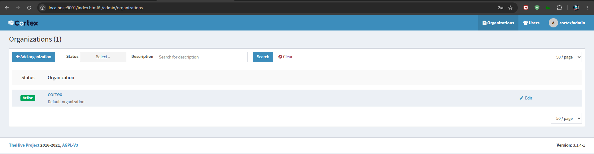
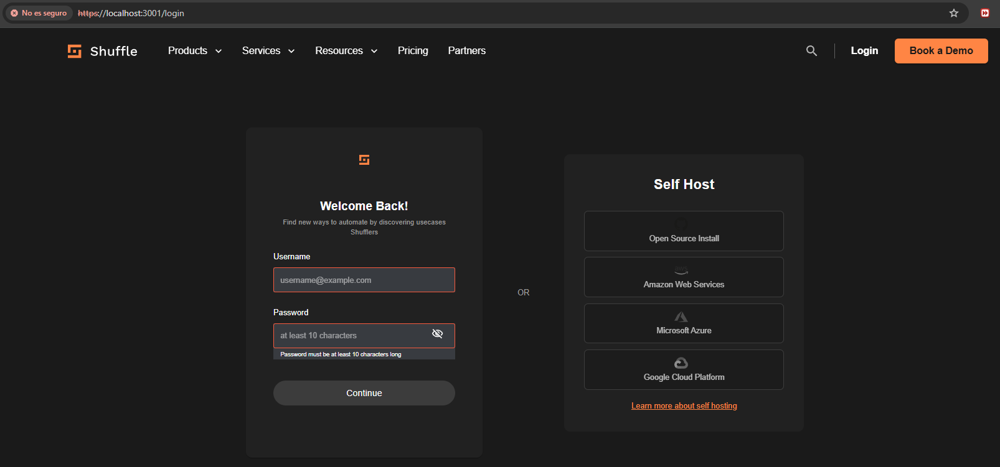
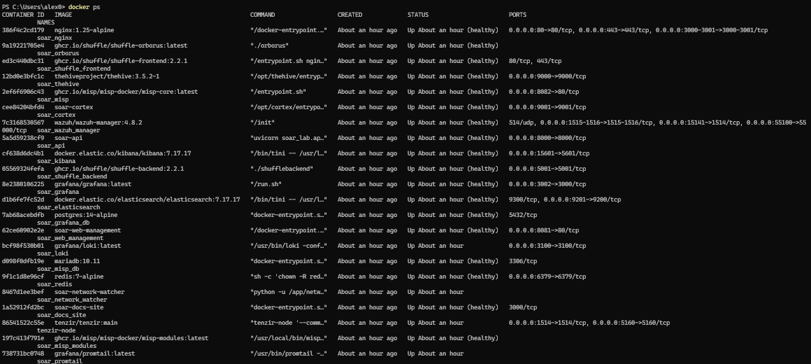

# Guía de Usuario — SOAR Ransomware Lab

## Acceso a Servicios

> Fuente de verdad: [Tabla canónica de puertos y URLs](../operations/ports_and_urls.md).

| Servicio        | Acceso directo (host)            | Acceso vía Nginx (`https://soar.local`)         | Credenciales                                                          |
|-----------------|-----------------------------------|---------------------------------------------------|-----------------------------------------------------------------------|
| Nginx / Proxy   | `http://localhost`, `https://localhost` | `/`                                               | —                                                                     |
| Web Management  | `http://localhost:8085`           | `/`                                               | Ver `.env.full` → `WEB_UI_USER` / `WEB_UI_PASSWORD`                   |
| SOAR API        | `http://localhost:8000`           | `/api/`                                           | Token JWT en `Authorization: Bearer <token>`                        |
| Shuffle UI      | `http://localhost:8081`           | No soportado (SPA con rutas absolutas)            | `SHUFFLE_DEFAULT_USERNAME` / `SHUFFLE_DEFAULT_PASSWORD`               |
| MISP            | `http://localhost:8083`           | No soportado                                      | `MISP_ADMIN_EMAIL` / `MISP_ADMIN_PASSWORD`                            |
| Grafana         | `http://localhost:8084`           | No soportado                                      | `admin` / `${GRAFANA_ADMIN_PASSWORD}`                                 |
| Docs Site       | `http://localhost:8086`           | No soportado                                      | Sin autenticación                                                     |
| TheHive         | `http://localhost:19000`          | `/thehive/`                                       | `admin` / contraseña generada por `init_thehive.py` (ver `.env.full`) |
| Cortex          | `http://localhost:19001`          | `/cortex/`                                        | `admin` / contraseña generada por `reset_cortex.py` (ver `.env.full`) |
| Wazuh Dashboard | `https://localhost:15601`         | No soportado                                      | `kibanaserver` / `WAZUH_DASHBOARD_PASSWORD` (según `.env.full`)                    |
| Elasticsearch   | `http://localhost:19200`          | No expuesto                                       | `elastic` / `ELASTIC_PASSWORD`                                        |

> Notas:
> - El acceso recomendado para usuarios es `https://soar.local` (requiere `127.0.0.1 soar.local` en el archivo `hosts` y confianza en `soar.local.crt`).
> - Los puertos directos son principalmente para diagnóstico y validación inicial.
> - El despliegue incluye **Elasticsearch 7.10.2** para TheHive/Cortex/KPI y **OpenSearch 2.10.0** para Shuffle; el Wazuh Indexer es otro clúster OpenSearch interno para Wazuh. Ver [Coexistencia de Elasticsearch y OpenSearch](../architecture/search_engine_coexistence.md).

## Comandos principales

**Nota para Windows:** En Windows, usar `make -f Makefile.win` o simplemente `make` si está configurado en PATH.

```bash
# Levantar el entorno
make up

# Parar el entorno
make down

# Reset completo (destruye y recrea)
make reset && make up

# Ver estado de contenedores
make ps

# Simular alerta de ransomware
make simulate

# Calcular KPIs
make metrics

# Ejecutar tests E2E
make test-all
```

## Flujo de uso básico

1. `make up` — levanta todos los servicios (~5-10 min en primer arranque)
2. Acceder a http://localhost:8085 (Web Management) para verificar estado
3. `make simulate` — envía alertas de prueba al SOAR
4. Verificar en TheHive (http://localhost:19000) que se han creado casos
5. Verificar en Grafana (http://localhost:8084) los KPI dashboards
6. `make metrics` — genera `artifacts/results/kpis.csv` con métricas

## Interfaces del Sistema

### Web Management

**URLs:**
- Directa: `http://localhost:8085`
- Por Nginx: `https://soar.local/` (raíz del proxy)

**Credenciales:** Ver `.env.full` → `WEB_UI_USER` / `WEB_UI_PASSWORD`  
**Descripción:** Interfaz web principal para gestión del entorno SOAR. Permite verificar el estado de los servicios,
ver logs en tiempo real, ejecutar tests, crear/restaurar backups y consultar KPIs. Está implementada como SPA
HTML/JS en `apps/web-management/`.

**Características principales:**

- Dashboard con estado de todos los servicios (online/offline).
- Visualización de métricas de CPU, RAM y disco (`/analytics/metrics`).
- KPIs (`/analytics/kpis`) y resumen de tests (`/tests/run`).
- Logs en vivo mediante WebSocket (`/api/ws/logs` vía Nginx, `/ws/logs` en acceso directo a la API).
- Creación, listado y restauración de backups (`/backup/create`, `/backup/list`, `/backup/restore`).

**Comportamiento de `apps/web-management/script.js`:**

- `API_BASE = '/api'` permite que la SPA funcione tanto detrás de Nginx como por acceso directo a `http://localhost:8000` (cuando `CORS_ORIGINS` lo permite).
- El login se realiza contra `POST /api/auth/login`; el token JWT se almacena en `localStorage` bajo `auth_token`.
- Al cargar, `checkAuthStatus()` verifica el token con `POST /api/auth/verify`; si es inválido, lo elimina.
- Actualizaciones periódicas: métricas cada 5 s, servicios cada 10 s, KPIs cada 30 s.
- El WebSocket se abre con `wss://` o `ws://` según el protocolo de la página y la ruta `/api/ws/logs`.
- La ejecución remota de tests invoca `POST /api/tests/run` con `{category}` y muestra `passed`, `failed`, `skipped` y `coverage`.
- Los backups se gestionan con `POST /api/backup/create`, `GET /api/backup/list` y `POST /api/backup/restore`.

> **Seguridad:** El token JWT se guarda en `localStorage`; para evitar robo por XSS, el panel debe ejecutarse en
> un origen de confianza y no debe almacenarse en cookies sin `HttpOnly` sin otras contramedidas.


### SOAR API

**URL:** http://localhost:8000  
**Credenciales:** Token en cabecera `Authorization: Bearer <token>`  
**Descripción:** API REST principal del sistema. Proporciona endpoints programáticos para envío de alertas, consulta de
métricas, gestión de casos, integración con servicios externos y más. Permite la automatización de operaciones SOAR
mediante llamadas HTTP.

**Endpoints principales:**

- `POST /auth/login` - Autenticación y obtención de token JWT.
- `POST /auth/verify` - Verificación de token JWT.
- `GET /health` - Verificación de salud del servicio API.
- `GET /analytics/metrics` - Métricas de CPU, RAM y disco del host Docker.
- `GET /analytics/kpis` - KPIs de alertas procesadas (MTTR, detección, benignas/maliciosas).
- `GET /services/status` - Estado online/offline de los servicios principales.
- `POST /backup/create` - Creación de backups.
- `GET /backup/list` - Listado de backups disponibles.
- `POST /backup/restore` - Restauración de backups.
- `POST /tests/run` - Ejecución remota de tests Pytest (requiere token).
- `GET /docs` / `GET /openapi.json` - Documentación Swagger/OpenAPI.

> Fuente de verdad de contratos: [API Documentation](../API_DOCUMENTATION.md) y `/openapi.json` expuesto por la propia API.

### TheHive

**URL:** http://localhost:19000  
**Credenciales:** `admin` / contraseña generada por `init_thehive.py` (ver `.env.full`)  
**Descripción:** Plataforma de gestión de casos de seguridad (SIRP - Security Incident Response Platform). Permite
crear, investigar, asignar y cerrar casos de incidentes de seguridad. Integra automáticamente alertas del sistema SOAR y
proporciona herramientas para la colaboración entre equipos de respuesta a incidentes.

**Características principales:**

- Gestión de casos de seguridad con estados (Open, In Progress, Resolved, Closed)
- Asignación de casos a usuarios y equipos
- Observables (IOCs) enlazados a casos
- Integración con Cortex para análisis de amenazas
- Timeline de actividades en cada caso
- Alertas automáticas desde Shuffle workflows
- Búsqueda avanzada de casos y observables

**Configuración inicial:**

1. Crear usuario administrador  
   
2. Iniciar sesión  
   
3. Actualizar base de datos (si es necesario)  
   
4. Generar API key  
   
5. Dashboard principal  
   

### Cortex

**URL:** http://localhost:19001  
**Credenciales:** `admin` / contraseña generada por `reset_cortex.py` (ver `.env.full`)  
**Descripción:** Plataforma de análisis de amenazas (TIAM - Threat Intelligence Analysis Module). Permite ejecutar
analizadores sobre IOCs (Indicators of Compromise) para obtener información de inteligencia de amenazas. Integra
automáticamente con TheHive para enriquecer casos con análisis de observables.

**Características principales:**

- Ejecución de analizadores sobre diferentes tipos de IOCs (IP, dominio, hash, URL, email)
- Integración con servicios de inteligencia de amenazas (VirusTotal, AlienVault, etc.)
- Resultados de análisis enlazados a casos en TheHive
- Gestión de analizadores y configuración de API keys externas
- Historial de análisis realizados
- Soporte para analizadores personalizados

**Configuración inicial:**

1. Crear usuario administrador  
   
2. Iniciar sesión  
   
3. Actualizar base de datos (si es necesario)  
   
4. Dashboard principal  
   

### Shuffle

**URL:** http://localhost:8081  
**Credenciales:** `SHUFFLE_DEFAULT_USERNAME` / `SHUFFLE_DEFAULT_PASSWORD`  
**Descripción:** Plataforma de automatización de seguridad (SOAR - Security Orchestration, Automation and Response).
Permite crear workflows de respuesta automatizada a incidentes de seguridad mediante una interfaz visual drag-and-drop.
Integra automáticamente con TheHive, Cortex, MISP, Wazuh y otros servicios del ecosistema SOAR.

**Características principales:**

- Editor visual de workflows drag-and-drop
- Integración con múltiples servicios (TheHive, Cortex, MISP, Wazuh, Elasticsearch, etc.)
- Ejecución de workflows basada en triggers (webhooks, alertas, schedules)
- Apps predefinidas para operaciones comunes (HTTP, Python, Email, Slack, etc.)
- Variables y condiciones para lógica compleja
- Historial de ejecuciones de workflows
- Workflows preconfigurados para respuesta a ransomware

**Configuración inicial:**

1. Iniciar sesión  
   

### MISP

**URL:** http://localhost:8083  
**Credenciales:** `MISP_ADMIN_EMAIL` / `MISP_ADMIN_PASSWORD`  
**Descripción:** Plataforma de inteligencia de amenazas (Threat Intelligence Platform). Permite compartir y consultar
IOCs (Indicators of Compromise) con la comunidad de seguridad. Integra automáticamente con Shuffle workflows para
enriquecer alertas con inteligencia de amenazas y verificar IOCs contra bases de datos de amenazas conocidas.

**Características principales:**

- Gestión de eventos de amenazas con IOCs
- Sincronización con feeds de inteligencia de amenazas externos
- Enrichment automático de IOCs con información de múltiples fuentes
- Integración con Shuffle para verificación de IOCs en workflows
- API para consulta de IOCs desde otros servicios
- Gestión de organizaciones y permisos de compartición
- Soporte para diferentes tipos de IOCs (IP, dominio, hash, email, URL, etc.)

### Grafana

**URL:** http://localhost:8084  
**Credenciales:** `admin` / `${GRAFANA_ADMIN_PASSWORD}`  
**Descripción:** Plataforma de visualización de métricas. Permite crear dashboards con KPIs del sistema SOAR. Integra
automáticamente con Elasticsearch para visualizar métricas de alertas procesadas, tiempos de respuesta, tasas de éxito y
más. Proporciona visualizaciones en tiempo real del rendimiento y salud del sistema SOAR.

**Características principales:**

- Dashboard SOAR KPI con métricas clave del sistema
- Visualización de alertas procesadas por tipo y severidad
- Gráficas de MTTR (Mean Time To Respond) por tipo de alerta
- Tasa de éxito por severidad de alerta
- Evolución temporal de alertas por tipo
- Integración con Elasticsearch como datasource
- Alertas y notificaciones basadas en umbrales
- Exportación de dashboards y configuraciones

### Wazuh Dashboard

**URL:** https://localhost:15601  
**Credenciales:** `admin` / `WAZUH_INDEXER_PASSWORD` (según `.env.full`)  
**Descripción:** Plataforma de análisis de logs y seguridad. Wazuh Dashboard proporciona una interfaz para visualizar y
analizar logs de todos los servicios del sistema SOAR. Wazuh es una plataforma de seguridad que integra detección de
amenazas, respuesta a incidentes y monitoreo de integridad de archivos.

**Características principales:**

- Visualización de logs de todos los servicios SOAR en tiempo real
- Dashboards preconfigurados de Wazuh para seguridad
- Reglas de detección de amenazas y alertas
- Monitoreo de integrididad de archivos (FIM)
- Detección de intrusiones y vulnerabilidades
- Integración con Elasticsearch para almacenamiento de logs
- Búsqueda avanzada y filtrado de logs
- Alertas y notificaciones de seguridad

### Verificación de Contenedores Docker

**Comando:** `make ps` o `docker ps --filter name=soar_`  
**Descripción:** Verificación del estado de todos los contenedores Docker del proyecto.



## Uso del Sistema con Comandos Makefile

### Inicio y Parada del Entorno

```bash
# Levantar todos los servicios
make up

# Verificar estado de contenedores
make ps

# Verificar health de servicios core
make health

# Ver logs de servicios en tiempo real
make logs

# Reiniciar todos los servicios
make restart

# Parar servicios y eliminar volúmenes
make down

# Reset completo (destruye y recrea)
make reset && make up
```

### Simulación de Alertas

```bash
# Simular 5 alertas de ransomware (por defecto)
make simulate

# Enviar 1 alerta maliciosa
make simulate-malicious

# Enviar 1 alerta benigna
make simulate-benign

# Enviar N alertas (ejemplo: 10)
make simulate-batch N=10
```

### Gestión de Métricas

```bash
# Calcular KPIs desde logs
make metrics

# Ver resultados en artifacts/results/kpis.csv
```

### Ejecución de Tests

```bash
# Ejecutar tests unitarios
make test-unit

# Ejecutar tests de integración
make test-integration

# Ejecutar tests E2E
make test-e2e

# Ejecutar TODOS los tests
make test-all

# Ejecutar tests con coverage report
make test-coverage
```

### Mantenimiento

```bash
# Limpiar archivos temporales
make clean

# Limpiar todos los artifacts
make clean-full

# Limpiar artifacts + recursos Docker
make clean-all

# Crear backup de artifacts
make backup

# Restaurar desde backup
make restore BACKUP=<nombre_del_backup>

# Validar sincronización de credenciales
make validate-credentials

# Generar certificados TLS para Nginx
make certs

# Generar contraseñas/tokens seguros
make generate-secrets
```

### Inicialización de Webhook

```bash
# Inicializar Shuffle webhook para alertas
make init-webhook
```

## Vagrant (entorno alternativo)

> **Nota:** El stack Docker es el entorno principal y validado. Vagrant es una alternativa documentada pero **no ha sido
desplegada en esta sesión**; los targets `make vagrant-*` dependen de una VM Ubuntu con `infra/vagrant/` que no se ha
> validado actualmente.

```bash
# Levantar VM Ubuntu con el stack completo
make vagrant-up

# Simular alertas desde la VM
make vagrant-simulate

# Destruir la VM
make vagrant-down
```

Los puertos Vagrant se mapean en rango 9000-9443 para evitar conflictos con el stack Docker:

- https://localhost:9443 — Web Management / Nginx
- http://localhost:9081 — Shuffle UI
- http://localhost:9001 — Shuffle API

## Notas sobre Tests E2E y el entorno

- Los tests E2E (`tests/e2e/TC-10` a `TC-14`) detectan automáticamente si se ejecutan dentro del contenedor Docker (
  `soar_api`) o en el host y usan las URLs correctas de Tenzir, Network Watcher, Redis y Loki gracias a
  `tests/e2e/conftest.py`.
- El test de disk watermark de Elasticsearch salta (`skip`) cuando el porcentaje reportado proviene del disco del
  host (>90%) en lugar del volumen del contenedor, ya que `_cat/allocation` puede reflejar el filesystem del host en
  Docker Desktop.
- El test `test_concurrent_execution_with_new_features` se salta si el entorno no puede ejecutar webhooks concurrentes
  bajo carga; no indica una falla funcional del workflow.
- Para ejecutar la suite completa:
  ```bash
  make test-all
  ```
- Última recolección: **1944 items / 33 deselected / 1911 seleccionados** (158 archivos `test_*.py`, ~1884 funciones definidas). Ver `docs/testing/test_suite.md` y `baseline/tests_inventory.json`.

## Estado operativo final (FASE 50)

- **Credenciales:** Todos los scripts de setup e integración leen de `.env.full`; no hay contraseñas hardcodeadas en los archivos revisados.
- **Nginx / SSL:** Configuración validada con `nginx -t`; certificado `soar.local.crt` válido hasta 2027-05-18.
- **Redes Docker:** `soar_net`, `logging_net`, `ti_net` y `misp_net` correctamente definidas; `nginx` en `soar_net` y `logging_net`.
- **Logging stack:** Grafana accede a Elasticsearch `soar-metrics` y Loki recoge logs de todos los contenedores; plugin ES incluido en `docker-compose.logging.yml`.
- **Tests E2E:** Última ejecución documentada: 16/16 passed (con credenciales de `.env.full`).
- **Limpieza de archivos:** `.gitignore` ignora `artifacts/data/`, scripts temporales de remediación y artefactos de pruebas; `git status` reducido de ~600 a ~520 entradas.
- **Limitación remanente:** `.env.full` permanece en el historial de Git. Rotar secretos y purgar el historial si se publica el repositorio.
- **Documentos clave generados:**
  - `docs/project/final_audit_report.md`
  - `docs/project/requirements_matrix.md`
  - `docs/project/inconsistency_matrix.md`
  - `docs/project/obsolete_files_analysis.md`
