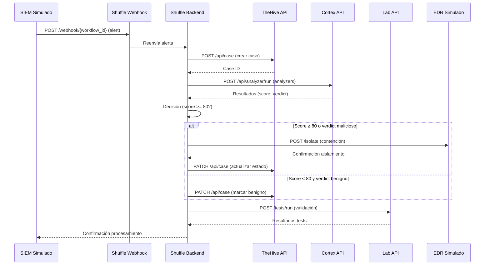

# Especificación de APIs — SOAR Ransomware Lab

## Índice

- [1. Resumen](#1-resumen)
    - [1.1 Objetivo](#11-objetivo)
    - [1.2 Contexto](#12-contexto)
- [2. Alcance](#2-alcance)
    - [2.1 Qué cubre](#21-qué-cubre)
    - [2.2 Límites](#22-límites)
    - [2.3 Dependencias](#23-dependencias)
- [3. Contenido principal](#3-contenido-principal)
    - [3.1 Especificación de APIs](#31-especificación-de-apis)
        - [3.1.1 Clasificación de APIs](#311-clasificación-de-apis)
        - [3.1.2 APIs reales](#312-apis-reales)
        - [3.1.3 APIs simuladas](#313-apis-simuladas)
    - [3.2 Endpoints principales](#32-endpoints-principales)
        - [3.2.1 TheHive API](#321-thehive-api)
        - [3.2.2 Cortex API](#322-cortex-api)
        - [3.2.3 Shuffle webhook](#323-shuffle-webhook)
        - [3.2.4 Lab API — FastAPI](#324-lab-api--fastapi)
        - [3.2.5 Resumen de variables de entorno por API](#325-resumen-de-variables-de-entorno-por-api)
    - [3.3 Modelos de datos](#33-modelos-de-datos)
        - [3.3.1 Payload de alerta](#331-payload-de-alerta)
        - [3.3.2 Payload de caso](#332-payload-de-caso)
        - [3.3.3 Payload de analyzer](#333-payload-de-analyzer)
    - [3.4 Autenticación y autorización](#34-autenticación-y-autorización)
        - [3.4.1 Configuración de autenticación](#341-configuración-de-autenticación)
        - [3.4.2 Resumen de variables de entorno por API](#342-resumen-de-variables-de-entorno-por-api)
    - [3.5 Ejemplos de uso](#35-ejemplos-de-uso)
        - [3.5.1 Flujo de integración de APIs](#351-flujo-de-integración-de-apis)
- [4. Validación](#4-validación)
    - [4.1 Verificación](#41-verificación)
    - [4.2 Criterios de aceptación](#42-criterios-de-aceptación)
    - [4.3 Evidencias](#43-evidencias)
- [5. Problemas y consideraciones](#5-problemas-y-consideraciones)
    - [5.1 Limitaciones](#51-limitaciones)
    - [5.2 Riesgos o incidencias](#52-riesgos-o-incidencias)
    - [5.3 Recomendaciones / troubleshooting](#53-recomendaciones--troubleshooting)
- [6. Referencias](#6-referencias)

---

## 1. Resumen

### 1.1 Objetivo

Este documento detalla las APIs utilizadas en el SOAR Ransomware Lab, especificando cuáles son reales (contenedores
Docker activos) y cuáles son simuladas (scripts/mocks), con endpoints, autenticación por variables de entorno, payloads
de ejemplo y límites de uso.

### 1.2 Contexto

El SOAR Ransomware Lab integra múltiples APIs para orquestar la respuesta a incidentes de ransomware. Algunas APIs son
servicios reales desplegados como contenedores Docker, mientras que otras se simulan mediante scripts para facilitar el
entorno de laboratorio y el contexto académico (TFM).

## 2. Alcance

### 2.1 Qué cubre

Este documento cubre:

- Clasificación de APIs (reales vs simuladas)
- Especificación detallada de endpoints de cada API
- Métodos de autenticación y variables de entorno
- Payloads de ejemplo para cada endpoint
- Límites de uso y configuración de rate limiting
- Scripts de simulación para APIs no HTTP

### 2.2 Límites

Este documento no cubre:

- Implementación interna de cada API (ver documentación oficial de cada componente)
- Estrategias de seguridad detalladas (ver docs/architecture/security.md)
- Estrategia de Docker (ver docs/architecture/docker_architecture.md)
- Planificación del proyecto (ver docs/project/plan.md)

### 2.3 Dependencias

Este documento depende de:

- Documentación oficial de TheHive API
- Documentación oficial de Cortex API
- Documentación oficial de Shuffle API
- Documentación oficial de FastAPI
- Documentación oficial de Wazuh API
- Documentación oficial de MISP API
- Archivo de configuración .env.full

## 3. Contenido principal

### 3.1 Especificación de APIs

#### 3.1.1 Clasificación de APIs

| API              | Tipo         | Servicio                           | Puerto |
|------------------|--------------|------------------------------------|--------|
| **TheHive**      | ✅ Real       | Gestión de casos e incidentes      | `9000` |
| **Cortex**       | ✅ Real       | Análisis de IoCs (analyzers)       | `9001` |
| **Shuffle**      | ✅ Real       | Orquestador SOAR (webhook + API)   | `5001` |
| **Lab API**      | ✅ Real       | FastAPI de gestión del laboratorio | `8000` |
| **SIEM (Wazuh)** | ⚙️ Simulado* | Generación de alertas vía script   | —      |
| **EDR**          | 🔲 Simulado  | Contención de endpoints vía script | —      |
| **Firewall**     | 🔲 Simulado  | Bloqueo de IPs vía script          | —      |

> *Wazuh Manager está desplegado como contenedor real pero la **generación de alertas** hacia Shuffle se simula con
`src/soar_lab/infrastructure/http_alert_sender.py` en el contexto del TFM.

#### 3.1.2 APIs reales

**TheHive API:**

- Gestión de casos e incidentes
- Autenticación vía API key Bearer token
- Endpoints para creación, actualización y consulta de casos
- Gestión de observables y artefactos

**Cortex API:**

- Análisis de IoCs mediante analyzers
- Ejecución de analyzers offline y online
- Consulta de estado y resultados de jobs
- Configuración de límites de concurrencia

**Shuffle Webhook:**

- Disparo de workflows mediante webhooks
- Autenticación vía Bearer token
- Rate limiting configurado
- Payload de alerta estructurado

**Lab API (FastAPI):**

- Gestión del laboratorio
- Autenticación JWT
- Endpoints para health checks, métricas, tests y backups
- WebSocket para streaming de logs

#### 3.1.3 APIs simuladas

**SIEM Simulado (Wazuh):**

- Generación de alertas mediante módulo `src/soar_lab/infrastructure/http_alert_sender.py`
- POST directo al webhook de Shuffle
- Sin endpoint HTTP externo

**EDR Simulado:**

- Contención de endpoints simulada en código Python
- No hay scripts de shell separados actualmente
- Registro en logs del sistema

**Firewall Simulado:**

- Bloqueo de IPs simulado en código Python
- Integrado en el módulo de contención
- Registro en logs del sistema

### 3.2 Endpoints principales

#### 3.2.1 TheHive API

**Base URL**: `http://localhost:${THEHIVE_HTTP_PORT:-9000}`  
**Autenticación**: `Authorization: Bearer ${THEHIVE_API_KEY}`  
**Variable .env**: `THEHIVE_API_KEY=thehive-api-key-456-secure`

**Endpoints utilizados:**

| Método  | Endpoint                         | Descripción                               |
|---------|----------------------------------|-------------------------------------------|
| `GET`   | `/api/health`                    | Health check del servicio                 |
| `GET`   | `/api/case`                      | Listar todos los casos                    |
| `POST`  | `/api/case`                      | Crear nuevo caso                          |
| `GET`   | `/api/case/{case_id}`            | Obtener caso por ID                       |
| `PATCH` | `/api/case/{case_id}`            | Actualizar estado del caso                |
| `POST`  | `/api/case/{case_id}/artifact`   | Añadir observable a un caso               |
| `GET`   | `/api/case/{case_id}/observable` | Listar observables de un caso             |
| `POST`  | `/api/alert`                     | Crear alerta (alternativa a caso directo) |

**Payload — Crear caso (`POST /api/case`):**

```json
{
  "title": "Ransomware detectado en WIN-001 [ALERT-2025-001234]",
  "description": "Ransomware activity detected on WIN-001 - suspicious file encryption patterns observed",
  "severity": 3,
  "tlp": 2,
  "tags": ["ransomware", "soar-lab", "tc-01"],
  "status": "Open"
}
```

**Respuesta (201):**

```json
{
  "_id": "~123456789",
  "_type": "case",
  "caseId": 42,
  "title": "Ransomware detectado en WIN-001 [ALERT-2025-001234]",
  "status": "Open",
  "severity": 3,
  "createdAt": 1746295335000
}
```

**Límites de uso:**

| Parámetro              | Valor                         |
|------------------------|-------------------------------|
| Timeout por petición   | 30 s                          |
| Reintentos automáticos | 3 (backoff 5 s)               |
| Severidad válida       | 1 (Low), 2 (Medium), 3 (High) |
| TLP válido             | 0–3                           |

#### 3.2.2 Cortex API

**Base URL**: `http://localhost:${CORTEX_HTTP_PORT:-9001}`  
**Autenticación**: `Authorization: Bearer ${CORTEX_API_KEY}`  
**Variable .env**: `CORTEX_API_KEY=cortex-api-key-012-secure`

**Endpoints utilizados:**

| Método | Endpoint                   | Descripción                           |
|--------|----------------------------|---------------------------------------|
| `GET`  | `/`                        | Health check (HTTP 200 = disponible)  |
| `GET`  | `/api/analyzer`            | Listar analyzers disponibles          |
| `POST` | `/api/analyzer/run`        | Ejecutar analyzer sobre un observable |
| `GET`  | `/api/job/{job_id}`        | Estado de un job de análisis          |
| `GET`  | `/api/job/{job_id}/report` | Resultado completo del job            |

**Payload — Ejecutar analyzer (`POST /api/analyzer/run`):**

```json
{
  "analyzerId": "FileInfo_8_0",
  "dataType": "hash",
  "data": "44d88612fea8a8f36de82e1278abb02f"
}
```

**Analyzers activos en el lab:**

| Analyzer ID                | Tipo      | Modo    | Requiere API key externa  |
|----------------------------|-----------|---------|---------------------------|
| `FileInfo_8_0`             | hash      | offline | No                        |
| `DomainMailSPFRecord_2_1`  | domain/ip | offline | No                        |
| `VirusTotal_GetReport_3_1` | hash      | online  | Sí (`VIRUSTOTAL_API_KEY`) |

**Límites de uso:**

| Parámetro                  | Valor                            |
|----------------------------|----------------------------------|
| `MAX_CONCURRENT_ANALYZERS` | `3` (`.env.full`)                |
| `ANALYZER_TIMEOUT`         | `30` s (`.env.full`)             |
| `ANALYZER_RETRIES`         | `1` (`.env.full`)                |
| Timeout por job            | 60 s (configurable en Cortex UI) |

#### 3.2.3 Shuffle webhook

**Base URL**: `http://localhost:${SHUFFLE_API_PORT:-5001}`  
**Autenticación**: `Authorization: Bearer ${SIEM_WEBHOOK_TOKEN}`  
**Variable .env**: `SIEM_WEBHOOK_TOKEN=SiemToken123!@#`

**Endpoints utilizados:**

| Método | Endpoint                 | Descripción                             |
|--------|--------------------------|-----------------------------------------|
| `GET`  | `/health`                | Health check del backend                |
| `POST` | `/webhook/{workflow_id}` | Disparar workflow con payload de alerta |

**Payload — Webhook de alerta (`POST /webhook/{workflow_id}`):**

```json
{
  "alert_id": "ALERT-2025-001234",
  "hostname": "WIN-001",
  "src_ip": "185.220.101.182",
  "hash": "44d88612fea8a8f36de82e1278abb02f",
  "severity": 3,
  "source": "siem-ransomware-detection",
  "detection_time": "2025-05-03T18:42:15Z",
  "event_type": "ransomware_detection",
  "confidence": 95,
  "process_name": "ransomware.exe",
  "mitre_techniques": ["T1486"]
}
```

**Límites de uso:**

| Parámetro                  | Valor                             |
|----------------------------|-----------------------------------|
| `WEBHOOK_RATE_LIMIT`       | 60 req/min (`.env.full`)          |
| `WEBHOOK_PAYLOAD_MAX_SIZE` | 65536 bytes / 64 KB (`.env.full`) |
| Timeout cliente            | 3 s (tests E2E)                   |

#### 3.2.4 Lab API — FastAPI

**Base URL**: `http://localhost:${API_PORT:-8000}`  
**Autenticación**: JWT Bearer token (obtenido vía `POST /auth/login`)  
**Variable .env**: `API_AUTH_SECRET=ApiAuthSecretKey456!@#7890123456`  
**Swagger UI**: `http://localhost:8000/docs`

**Endpoints:**

| Método | Endpoint             | Auth | Descripción                          |
|--------|----------------------|------|--------------------------------------|
| `GET`  | `/health`            | No   | Health check                         |
| `GET`  | `/`                  | No   | Documentación HTML                   |
| `POST` | `/auth/login`        | No   | Obtener JWT token                    |
| `POST` | `/auth/verify`       | JWT  | Verificar token                      |
| `GET`  | `/analytics/metrics` | No   | CPU, memoria y disco del host        |
| `GET`  | `/analytics/kpis`    | No   | KPIs calculados (MTTR, detecciones…) |
| `GET`  | `/services/status`   | No   | Estado de todos los contenedores     |
| `POST` | `/tests/run`         | No   | Ejecutar suite de tests              |
| `POST` | `/backup/create`     | No   | Crear backup                         |
| `GET`  | `/backup/list`       | No   | Listar backups disponibles           |
| `POST` | `/backup/restore`    | No   | Restaurar backup                     |
| `WS`   | `/ws/logs`           | No   | Stream de logs en tiempo real        |

**Payload — Login (`POST /auth/login`):**

```json
{ "username": "admin", "password": "X9e#5mP3$vL7@nQ4tW8!zY2&hF6sD1" }
```

**Payload — Ejecutar tests (`POST /tests/run`):**

```json
{ "category": "unit" }
```

Valores válidos para `category`: `unit`, `integration`, `e2e`, `atomic`, `performance`, `security`, `smoke`, `all`.

#### 3.2.5 Resumen de variables de entorno por API

| Variable                   | API               | Descripción                                |
|----------------------------|-------------------|--------------------------------------------|
| `THEHIVE_API_KEY`          | TheHive           | API key de autenticación                   |
| `THEHIVE_HTTP_PORT`        | TheHive           | Puerto host (default 9000)                 |
| `CORTEX_API_KEY`           | Cortex            | API key de autenticación                   |
| `CORTEX_HTTP_PORT`         | Cortex            | Puerto host (default 9001)                 |
| `SHUFFLE_API_PORT`         | Shuffle           | Puerto del backend (default 5001)          |
| `SIEM_WEBHOOK_TOKEN`       | Shuffle webhook   | Token Bearer del webhook                   |
| `API_PORT`                 | Lab API           | Puerto del servidor FastAPI (default 8000) |
| `API_AUTH_SECRET`          | Lab API           | Clave para firmar JWT                      |
| `EDR_SIM_TOKEN`            | EDR simulado      | Token reservado                            |
| `FIREWALL_SIM_TOKEN`       | Firewall simulado | Token reservado                            |
| `MAX_CONCURRENT_ANALYZERS` | Cortex            | Máx. analyzers en paralelo                 |
| `ANALYZER_TIMEOUT`         | Cortex            | Timeout por job (segundos)                 |
| `WEBHOOK_RATE_LIMIT`       | Shuffle           | Máx. peticiones/min al webhook             |
| `WEBHOOK_PAYLOAD_MAX_SIZE` | Shuffle           | Tamaño máximo del payload (bytes)          |
| `DECISION_SCORE_THRESHOLD` | Playbook          | Umbral de contención (default 80)          |

### 3.3 Modelos de datos

#### 3.3.1 Payload de alerta

```json
{
  "alert_id": "ALERT-2025-001234",
  "hostname": "WIN-001",
  "src_ip": "185.220.101.182",
  "hash": "44d88612fea8a8f36de82e1278abb02f",
  "severity": 3,
  "source": "siem-ransomware-detection",
  "detection_time": "2025-05-03T18:42:15Z",
  "event_type": "ransomware_detection",
  "confidence": 95,
  "process_name": "ransomware.exe",
  "mitre_techniques": ["T1486"]
}
```

#### 3.3.2 Payload de caso

```json
{
  "title": "Ransomware detectado en WIN-001 [ALERT-2025-001234]",
  "description": "Ransomware activity detected on WIN-001 - suspicious file encryption patterns observed",
  "severity": 3,
  "tlp": 2,
  "tags": ["ransomware", "soar-lab", "tc-01"],
  "status": "Open"
}
```

#### 3.3.3 Payload de analyzer

```json
{
  "analyzerId": "FileInfo_8_0",
  "dataType": "hash",
  "data": "44d88612fea8a8f36de82e1278abb02f"
}
```

### 3.4 Autenticación y autorización

#### 3.4.1 Configuración de autenticación

Todas las APIs requieren configuración de autenticación vía variables de entorno en `.env.full`:

- API keys para servicios externos
- Tokens Bearer para webhooks
- Secret para firma JWT en Lab API
- Tokens reservados para integraciones futuras (EDR, Firewall)

#### 3.4.2 Resumen de variables de entorno por API

| Variable             | API               | Descripción                                |
|----------------------|-------------------|--------------------------------------------|
| `THEHIVE_API_KEY`    | TheHive           | API key de autenticación                   |
| `THEHIVE_HTTP_PORT`  | TheHive           | Puerto host (default 9000)                 |
| `CORTEX_API_KEY`     | Cortex            | API key de autenticación                   |
| `CORTEX_HTTP_PORT`   | Cortex            | Puerto host (default 9001)                 |
| `SHUFFLE_API_PORT`   | Shuffle           | Puerto del backend (default 5001)          |
| `SIEM_WEBHOOK_TOKEN` | Shuffle webhook   | Token Bearer del webhook                   |
| `API_PORT`           | Lab API           | Puerto del servidor FastAPI (default 8000) |
| `API_AUTH_SECRET`    | Lab API           | Clave para firmar JWT                      |
| `EDR_SIM_TOKEN`      | EDR simulado      | Token reservado                            |
| `FIREWALL_SIM_TOKEN` | Firewall simulado | Token reservado                            |

### 3.5 Ejemplos de uso

#### 3.5.1 Flujo de integración de APIs

**Diagrama de Flujo de Integración de APIs:**



**Pasos del flujo:**

1. **Ingestión de Alertas**: SIEM simulado genera alerta vía script
2. **Disparo de Workflow**: Alerta enviada a Shuffle webhook
3. **Creación de Caso**: Shuffle crea caso en TheHive
4. **Análisis de IoCs**: Cortex ejecuta analyzers sobre observables
5. **Contención**: EDR simulado aísla endpoint si es necesario
6. **Gestión**: Lab API monitorea y gestiona el sistema

#### 3.5.2 Procedimientos Específicos de Rotación de API Keys

**Rotación de API Keys para TheHive:**

```bash
# 1. Generar nueva API key desde TheHive UI
# Acceder a http://localhost:9000/#/administration/users
# Seleccionar usuario y generar nueva API key

# 2. Actualizar .env.full
nano .env.full
THEHIVE_API_KEY=<nueva_api_key>

# 3. Reiniciar servicios que usan TheHive
docker-compose restart shuffle-backend shuffle-frontend

# 4. Verificar conexión
curl -H "Authorization: Bearer $THEHIVE_API_KEY" http://localhost:9000/api/case
```

**Rotación de API Keys para Cortex:**

```bash
# 1. Generar nueva API key desde Cortex UI
# Acceder a http://localhost:9001/#/management/users
# Seleccionar usuario y generar nueva API key

# 2. Actualizar .env.full
nano .env.full
CORTEX_API_KEY=<nueva_api_key>

# 3. Actualizar TheHive con nueva key de Cortex
# Acceder a http://localhost:9000/#/administration/organizations
# Editar organización y actualizar Cortex API key

# 4. Reiniciar servicios
docker-compose restart shuffle-backend

# 5. Verificar conexión
curl -H "Authorization: Bearer $CORTEX_API_KEY" http://localhost:9001/api/analyzer
```

**Rotación de Webhook Token de Shuffle:**

```bash
# 1. Generar nuevo token seguro
python3 -c "import secrets; print(secrets.token_urlsafe(32))"

# 2. Actualizar .env.full
nano .env.full
SIEM_WEBHOOK_TOKEN=<nuevo_token>

# 3. Actualizar script de simulación SIEM
nano scripts/simulate.py
# Actualizar SIMULATE_TOKEN con nuevo valor

# 4. Reiniciar Shuffle
docker-compose restart shuffle-backend shuffle-frontend

# 5. Verificar webhook
curl -H "Authorization: Bearer $SIEM_WEBHOOK_TOKEN" http://localhost:5001/health
```

**Rotación de JWT Secret para Lab API:**

```bash
# 1. Generar nuevo secret seguro
python3 -c "import secrets; print(secrets.token_urlsafe(64))"

# 2. Actualizar .env.full
nano .env.full
API_AUTH_SECRET=<nuevo_secret>

# 3. Reiniciar Lab API
docker-compose restart api

# 4. Regenerar todos los tokens JWT existentes
# Los usuarios deben hacer login nuevamente

# 5. Verificar
curl -X POST http://localhost:8000/auth/login -d '{"username":"admin","password":"X9e#5mP3$vL7@nQ4tW8!zY2&hF6sD1"}'
```

#### 3.5.3 Ejemplos de Error Handling para Cada API

**Error Handling para TheHive API:**

```python
import requests
from requests.exceptions import RequestException

def create_thehive_case(alert_data):
    try:
        response = requests.post(
            f"http://localhost:{THEHIVE_HTTP_PORT}/api/case",
            headers={"Authorization": f"Bearer {THEHIVE_API_KEY}"},
            json=alert_data,
            timeout=30
        )
        response.raise_for_status()
        return response.json()
    except requests.exceptions.HTTPError as e:
        if response.status_code == 401:
            raise Exception("TheHive API key inválida o expirada")
        elif response.status_code == 403:
            raise Exception("Permisos insuficientes en TheHive")
        elif response.status_code == 409:
            raise Exception("El caso ya existe")
        else:
            raise Exception(f"Error HTTP {response.status_code}: {response.text}")
    except requests.exceptions.Timeout:
        raise Exception("Timeout al conectar con TheHive")
    except requests.exceptions.ConnectionError:
        raise Exception("TheHive no está disponible")
    except RequestException as e:
        raise Exception(f"Error de conexión con TheHive: {str(e)}")
```

**Error Handling para Cortex API:**

```python
def run_cortex_analyzer(analyzer_id, data_type, data):
    try:
        response = requests.post(
            f"http://localhost:{CORTEX_HTTP_PORT}/api/analyzer/run",
            headers={"Authorization": f"Bearer {CORTEX_API_KEY}"},
            json={"analyzerId": analyzer_id, "dataType": data_type, "data": data},
            timeout=60
        )
        response.raise_for_status()
        return response.json()
    except requests.exceptions.HTTPError as e:
        if response.status_code == 401:
            raise Exception("Cortex API key inválida")
        elif response.status_code == 400:
            raise Exception("Payload inválido para analyzer")
        elif response.status_code == 429:
            raise Exception("Límite de analyzers concurrentes alcanzado")
        else:
            raise Exception(f"Error HTTP {response.status_code}: {response.text}")
    except requests.exceptions.Timeout:
        raise Exception("Timeout en ejecución de analyzer")
    except requests.exceptions.ConnectionError:
        raise Exception("Cortex no está disponible")
```

**Error Handling para Shuffle Webhook:**

```python
def send_alert_to_shuffle(alert_data):
    try:
        response = requests.post(
            f"http://localhost:{SHUFFLE_API_PORT}/webhook/{WORKFLOW_ID}",
            headers={"Authorization": f"Bearer {SIEM_WEBHOOK_TOKEN}"},
            json=alert_data,
            timeout=10
        )
        response.raise_for_status()
        return response.json()
    except requests.exceptions.HTTPError as e:
        if response.status_code == 401:
            raise Exception("Webhook token inválido")
        elif response.status_code == 404:
            raise Exception("Workflow ID no encontrado")
        elif response.status_code == 413:
            raise Exception("Payload excede tamaño máximo (64KB)")
        else:
            raise Exception(f"Error HTTP {response.status_code}: {response.text}")
    except requests.exceptions.Timeout:
        raise Exception("Timeout al enviar alerta a Shuffle")
    except requests.exceptions.ConnectionError:
        raise Exception("Shuffle webhook no está disponible")
```

**Error Handling para Lab API:**

```python
def execute_lab_tests(category):
    try:
        # Primero obtener JWT token
        auth_response = requests.post(
            f"http://localhost:{API_PORT}/auth/login",
            json={"username": "admin", "password": "X9e#5mP3$vL7@nQ4tW8!zY2&hF6sD1"},
            timeout=10
        )
        auth_response.raise_for_status()
        token = auth_response.json().get("access_token")
        
        # Ejecutar tests con token
        response = requests.post(
            f"http://localhost:{API_PORT}/tests/run",
            headers={"Authorization": f"Bearer {token}"},
            json={"category": category},
            timeout=300
        )
        response.raise_for_status()
        return response.json()
    except requests.exceptions.HTTPError as e:
        if response.status_code == 401:
            raise Exception("Credenciales de Lab API inválidas")
        elif response.status_code == 403:
            raise Exception("Permisos insuficientes para ejecutar tests")
        else:
            raise Exception(f"Error HTTP {response.status_code}: {response.text}")
    except requests.exceptions.Timeout:
        raise Exception("Timeout en ejecución de tests")
    except requests.exceptions.ConnectionError:
        raise Exception("Lab API no está disponible")
```

## 4. Validación

### 4.1 Verificación

Las APIs se verifican mediante:

- Health checks de cada servicio (`curl http://localhost:9000/api/health` para TheHive, `curl http://localhost:9001/`
  para Cortex, `curl http://localhost:5001/health` para Shuffle, `curl http://localhost:8000/health` para Lab API)
- Verificación de tokens de autenticación (variables en `.env.full`: `THEHIVE_API_KEY`, `CORTEX_API_KEY`,
  `SHUFFLE_API_KEY`)
- Ejecución de tests de integración (`pytest tests/integration/ -v`)
- Verificación de rate limiting y límites de uso (`.env.full`: `WEBHOOK_RATE_LIMIT`, `MAX_CONCURRENT_ANALYZERS`)
- Validación de payloads con esquemas JSON (`src/soar_lab/config/schemas.py`)

### 4.2 Criterios de aceptación

Las APIs se consideran válidas cuando:

- Todos los endpoints responden con códigos HTTP correctos
- La autenticación funciona correctamente para cada servicio
- Los payloads de ejemplo son aceptados por las APIs
- Los límites de uso (rate limiting, timeouts) se respetan
- Los scripts de simulación ejecutan sin errores

### 4.3 Evidencias

Las evidencias de validación incluyen:

- Resultados de health checks de cada API (output de `curl` commands)
- Logs de autenticación exitosa (`docker logs soar_thehive`, `docker logs soar_cortex`,
  `docker logs soar_shuffle-backend`)
- Respuestas HTTP de endpoints de prueba (capturas en `tests/integration/`)
- Resultados de tests de integración (`pytest tests/integration/ -v` output)
- Logs de scripts de simulación (`artifacts/logs/containment.log`, `src/soar_lab/infrastructure/http_alert_sender.py`
  logs)

## 5. Problemas y consideraciones

### 5.1 Limitaciones

- **APIs simuladas**: EDR y Firewall no tienen endpoints HTTP reales
- **Dependencia de servicios externos**: Algunos analyzers requieren API keys externas (VirusTotal)
- **Rate limiting**: Límites configurados pueden ser insuficientes para escenarios de alta carga
- **Single-node**: Configuración actual no soporta clustering para alta disponibilidad

### 5.2 Riesgos o incidencias

- **API keys comprometidas**: Credenciales en `.env.full` pueden ser expuestas si no se protegen adecuadamente
- **Fallo de autenticación**: Tokens expirados o incorrectos pueden bloquear el flujo de trabajo
- **Rate limiting excedido**: Peticiones excesivas pueden ser rechazadas
- **Scripts de simulación fallidos**: Errores en scripts pueden interrumpir el flujo de simulación

### 5.3 Recomendaciones / troubleshooting

**API no responde:**

```bash
# Verificar health check
curl http://localhost:9000/api/health  # TheHive
curl http://localhost:9001/           # Cortex
curl http://localhost:5001/health    # Shuffle
curl http://localhost:8000/health    # Lab API

# Verificar logs de contenedor
docker logs soar_thehive
docker logs soar_cortex
docker logs soar_shuffle-backend
docker logs soar_api
```

**Error de autenticación:**

```bash
# Verificar variable de entorno
echo $THEHIVE_API_KEY
echo $CORTEX_API_KEY
echo $SIEM_WEBHOOK_TOKEN

# Verificar token JWT
curl -X POST http://localhost:8000/auth/login \
  -H "Content-Type: application/json" \
  -d '{"username": "admin", "password": "X9e#5mP3$vL7@nQ4tW8!zY2&hF6sD1"}'
```

**Rate limiting excedido:**

```bash
# Ajustar límites en .env.full
WEBHOOK_RATE_LIMIT=120
MAX_CONCURRENT_ANALYZERS=5

# Reiniciar servicios
make down && make up
```

**Script de simulación fallido:**

```bash
# Verificar script con dry-run
python3 -m src.soar_lab.infrastructure.http_alert_sender --alert-file tests/fixtures/payloads/payload_case1.json --dry-run

# Verificar logs de simulación
cat artifacts/logs/containment.log
```

## 6. Referencias

- **Repositorio del Proyecto**: [alesanfe/soar-ransomware-lab](https://github.com/alesanfe/soar-ransomware-lab.git)
- **Documentación de TheHive API**: https://docs.strangebee.com/thehive/api-docs/
- **Documentación de Cortex API**: https://docs.strangebee.com/cortex/api-docs/
- **Documentación de Shuffle API**: https://shuffler.io/docs/api
- **Documentación de FastAPI**: https://fastapi.tiangolo.com/
- **Documentación de Wazuh API**: https://documentation.wazuh.com/current/user-manual/api/index.html
- **Documentación de MISP API**: https://www.misp-project.org/api/
- **Documentación de Arquitectura**: [docs/architecture/overview.md](../architecture/overview.md)
- **Documentación de Seguridad**: [docs/architecture/security.md](../architecture/security.md)
- **Estrategia de Docker**: [docs/architecture/docker_architecture.md](../architecture/docker_architecture.md)

> ⚠️ **Nunca commitear valores reales** de API keys al repositorio. Usar `.env.full` (incluido en `.gitignore`).

---


