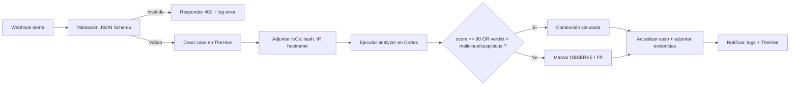

# Manual del playbook en Shuffle

Este documento modela el flujo completo del playbook end-to-end (E2E) para la respuesta automatizada ante incidentes de ransomware. Incluye los pasos, decisiones, entradas y salidas de cada nodo, así como el manejo de errores en cada fase. El playbook está diseñado para actuar desde la recepción de una alerta hasta la contención simulada y la notificación final. Cada paso está documentado para asegurar que el flujo sea claro, auditable y fácil de implementar en herramientas SOAR como Shuffle, integrando TheHive y Cortex.

## Flujo general

El flujo sigue una secuencia lógica: validación de la alerta, creación del caso, adjuntar IoCs, ejecutar análisis, tomar decisiones y aplicar contención simulada. Este diseño permite manejar errores en cada etapa y garantizar que las acciones sean proporcionales al riesgo detectado.

### Diagrama del flujo

## Entradas, Salidas y Manejo de Errores por Nodo
Este apartado describe con detalle cada nodo del playbook E2E, especificando qué datos recibe (entradas), qué produce (salidas) y cómo se gestionan los errores en cada fase. Esta información es esencial para garantizar la trazabilidad del flujo, la correcta implementación en herramientas SOAR y la capacidad de recuperación ante fallos.

| Nodo                | Entradas                                                                 | Salidas                                      | Manejo de Errores / Fallback                                                                 |
|----------------------|--------------------------------------------------------------------------|----------------------------------------------|----------------------------------------------------------------------------------------------|
| **Webhook**         | Payload JSON enviado por SIEM o sistema externo                         | HTTP 200 OK si válido / HTTP 400 si inválido| Si el payload no cumple el esquema → devolver 400, registrar en log y abortar flujo         |
| **Validación**      | JSON recibido                                                           | Boolean (OK/Fail)                           | Campos faltantes, formatos incorrectos → abortar flujo, log detallado                       |
| **Crear caso**      | Datos normalizados (hostname, hash, IP, alert_id, severity)             | `case_id` (UUID generado por TheHive)       | Error API (5xx) → retry; si persiste, registrar error y abortar                              |
| **Adjuntar IoCs**   | hash, IP, hostname                                                     | Observables añadidos al caso en TheHive     | Si falla adjunto → continuar con los restantes, registrar error en log                      |
| **Analyzer (Cortex)**| IoCs (hash preferente, opcional IP/hostname)                           | `score` (0-100), `verdict` (malicious/suspicious/benign/unknown) | Timeout → retry; si persiste, marcar OBSERVE y registrar causa                              |
| **Decisión**        | `score` y `verdict`                                                    | Acción: contención simulada o OBSERVE       | Sin datos (analyzer falló) → ruta OBSERVE, log con etiqueta `no_analyzer_data`              |
| **Contención simulada**| hostname, `case_id`                                                  | Registro en log y adjunto en TheHive        | Fallo script → registrar error y continuar flujo                                            |
| **Notificación**    | `case_id`, estado final (Contained/Observe)                            | Mensaje en log y actualización en TheHive   | Fallo envío → fallback a log local, reintentar adjuntar más tarde                           |

