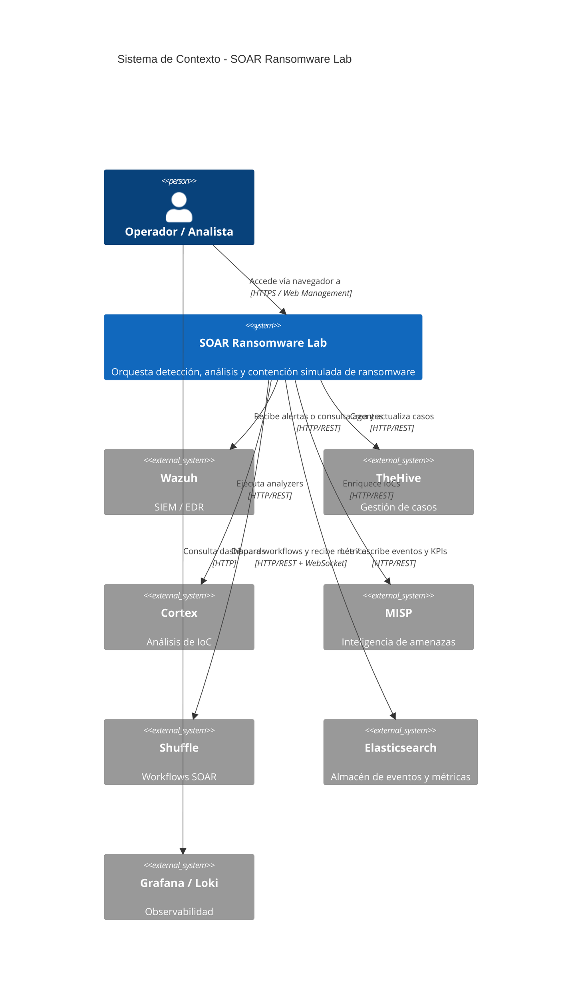
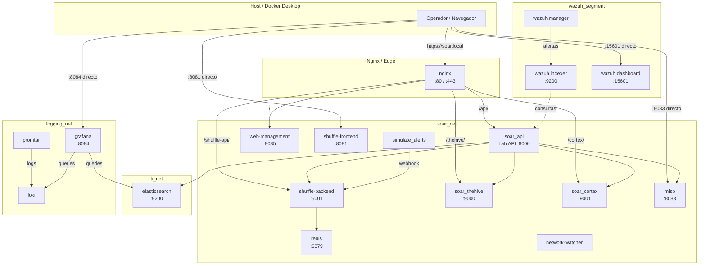
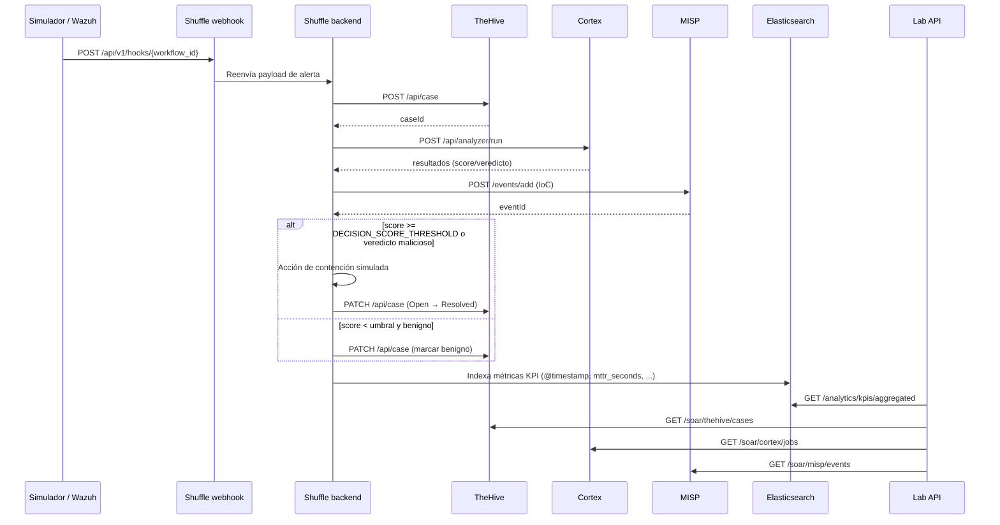

# Guía de Infraestructura

## Índice

- [1. Resumen](#1-resumen)
    - [1.1 Objetivo](#11-objetivo)
    - [1.2 Contexto](#12-contexto)
- [2. Estructura de `infra/`](#2-estructura-de-infra)
- [3. Archivos Docker Compose](#3-archivos-docker-compose)
    - [3.1 Comandos de uso](#31-comandos-de-uso)
    - [3.2 Perfiles de despliegue](#32-perfiles-de-despliegue)
- [4. Redes y puertos](#4-redes-y-puertos)
    - [4.1 Redes Docker](#41-redes-docker)
    - [4.2 Puertos de acceso](#42-puertos-de-acceso)
    - [4.3 Nginx como gateway SSL](#43-nginx-como-gateway-ssl)
    - [4.4 Diagramas de arquitectura](#44-diagramas-de-arquitectura)
    - [4.5 Volúmenes, healthchecks y DNS interno](#45-volúmenes-healthchecks-y-dns-interno)
    - [4.6 Orborus, Cortex analyzers y Network Watcher](#46-orborus-cortex-analyzers-y-network-watcher)
    - [4.7 Verificación post-arranque](#47-verificación-post-arranque)
- [5. Configuraciones centralizadas](#5-configuraciones-centralizadas)
- [6. Dockerfiles personalizados](#6-dockerfiles-personalizados)
- [7. Scripts de Vagrant](#7-scripts-de-vagrant)
- [8. Scripts útiles](#8-scripts-útiles)
- [9. Referencias](#9-referencias)

---

## 1. Resumen

### 1.1 Objetivo

Este documento describe la organización de la infraestructura como código del SOAR Ransomware Lab, incluyendo la estructura de `infra/`, el uso de los archivos Docker Compose, la ubicación de configuraciones y scripts de Vagrant.

### 1.2 Contexto

La infraestructura del laboratorio se gestiona mediante Docker Compose y Vagrant. Tras la refactorización hacia arquitectura hexagonal, la carpeta `infra/` se ha reorganizado para separar claramente configuraciones, imágenes Docker personalizadas y archivos compose.

---

## 2. Estructura de `infra/`

```
infra/
├── docker/                       # Infraestructura Docker
│   ├── compose/                  # Archivos Docker Compose
│   │   ├── docker-compose.yml           # Orquestador principal (redes, volúmenes, Elasticsearch)
│   │   ├── docker-compose.core.yml      # Redis, TheHive, Cortex, Shuffle
│   │   ├── docker-compose.misp.yml      # MISP threat intelligence
│   │   ├── docker-compose.opensearch.yml # Stack OpenSearch adicional
│   │   ├── docker-compose.vagrant.yml   # Ajustes para entornos Vagrant
│   │   ├── docker-compose.wazuh.yml     # Wazuh SIEM stack
│   │   ├── docker-compose.api.yml       # API, docs-site, web-management, nginx
│   │   └── logging/                     # Loki, Promtail, Grafana
│   │       └── docker-compose.logging.yml
│   ├── config/                   # Configuraciones centralizadas
│   │   ├── nginx/                       # nginx.conf y certificados SSL
│   │   ├── cortex.application.conf/     # Configuración de Cortex
│   │   └── thehive.application.conf/    # Configuración de TheHive
│   ├── images/                   # Dockerfiles personalizados
│   │   └── cortex/
│   │       └── Dockerfile               # Imagen de Cortex con dependencias Python
│   └── wazuh/                    # Configuración Wazuh
│       ├── config/                      # Certificados y configuraciones
│       ├── dashboard-entrypoint.sh      # Script de arranque del dashboard
│       ├── generate-indexer-certs.yml   # Generación de certificados
│       └── README.md                    # Instrucciones de despliegue Wazuh
└── vagrant/                      # Scripts de Vagrant
    ├── Vagrantfile                        # Definición de VMs
    ├── provision.sh                       # Provisioning Linux (Ubuntu)
    └── provision-windows.ps1              # Provisioning Windows VM
```

---

## 3. Archivos Docker Compose

### 3.1 Comandos de uso

El despliegue recomendado utiliza el `Makefile`:

```bash
# Iniciar todo el stack (incluye logging)
make up

# Detener todo el stack
make down

# Reiniciar
make down && make up
```

Para despliegue manual, los archivos deben especificarse en orden:

```bash
docker compose \
  --env-file .env.full \
  -f infra/docker/compose/docker-compose.yml \
  -f infra/docker/compose/docker-compose.core.yml \
  -f infra/docker/compose/docker-compose.misp.yml \
  -f infra/docker/compose/docker-compose.wazuh.yml \
  -f infra/docker/compose/docker-compose.api.yml \
  -f infra/docker/compose/logging/docker-compose.logging.yml \
  up -d
```

### 3.2 Perfiles de despliegue

| Compose file | Propósito | Servicios principales |
|---|---|---|
| `infra/docker/compose/docker-compose.yml` | Orquestador base | Redes, volúmenes, `elasticsearch` |
| `infra/docker/compose/docker-compose.core.yml` | Core SOAR | `redis`, `thehive`, `cortex`, `shuffle-frontend`, `shuffle-backend`, `orborus`, `network-watcher`, `tenzir-node` |
| `infra/docker/compose/docker-compose.misp.yml` | Inteligencia de amenazas | `misp-db`, `misp-modules`, `misp` |
| `infra/docker/compose/docker-compose.wazuh.yml` | SIEM Wazuh | `wazuh.manager`, `wazuh.indexer`, `wazuh.dashboard` |
| `infra/docker/compose/docker-compose.api.yml` | API y aplicaciones | `api`, `docs-site`, `web-management`, `nginx` |
| `infra/docker/compose/logging/docker-compose.logging.yml` | Observabilidad | `grafana-db`, `grafana`, `loki`, `promtail` |
| `infra/docker/compose/docker-compose.opensearch.yml` | OpenSearch adicional (no se despliega por defecto) | `opensearch`, `opensearch-dashboards` |
| `infra/docker/compose/docker-compose.vagrant.yml` | Ajustes de volúmenes para entornos Vagrant | Overrides de paths |

---

## 4. Redes y puertos

### 4.1 Redes Docker

El laboratorio define varias redes internas para segmentar el tráfico. Aunque el proyecto no usa el campo `profiles:` de Docker Compose, algunas redes y servicios solo se activan si se incluyen los archivos compose correspondientes. `make up` los incluye todos por defecto.

| Red | CIDR | Tipo | Servicios principales | Propósito |
|---|---|---|---|---|
| `soar_net` | `10.100.0.0/16` | bridge | Todos los servicios salvo `grafana-db` | Red principal del laboratorio |
| `logging_net` | `172.23.0.0/16` | bridge | `grafana-db`, `grafana`, `loki`, `promtail`, `nginx` | Observabilidad (declarada en `docker-compose.yml` y referenciada en `logging/docker-compose.logging.yml`) |
| `ti_net` | `172.22.0.0/16` | `internal: true` | `elasticsearch`, `redis`, `api`, `shuffle-backend`, `shuffle-frontend` | Inteligencia de amenazas (sin salida a Internet) |
| `soar_edge` | dinámico | bridge | Ningún servicio actualmente | Definida en compose base; reservada |
| `bridge` | — | `external: true` | Ninguno directamente | Red por defecto de Docker; declarada por compatibilidad |

`Promtail` está en `soar_net` y `logging_net` para descubrir todos los contenedores y enviar logs a Loki.
Grafana se conecta a `logging_net` y `soar_net` para poder consultar `elasticsearch:9200` y Loki.

> **Nota sobre `ti_net`:** al ser `internal: true`, los contenedores en esta red no tienen salida a Internet. Solo se comunican entre sí y con `soar_net` a través de contenedores que están en ambas.
> **Nota sobre `logging_net`:** `docker-compose.logging.yml` la declara como `external: true` para permitir ejecuciones parciales, pero en un despliegue completo con `make up` la red se crea en el compose base (`docker-compose.yml`).

### 4.2 Puertos de acceso

| Servicio | Puerto host | Acceso directo | Vía Nginx (`https://soar.local`) |
|----------|-------------|----------------|-----------------------------------|
| Nginx HTTP→HTTPS | 80 | `http://localhost` | — |
| Nginx HTTPS | 443 | `https://localhost` | — |
| Web Management | 8085 | `http://localhost:8085` | `/` |
| SOAR API | 8000 | `http://localhost:8000` (Swagger en `http://localhost:8000/docs`) | `/api/` — Swagger vía Nginx: `https://soar.local/api/docs` y `https://soar.local/api/openapi.json`. No usar `https://soar.local:8000/docs` (Nginx no escucha en 8000). |
| Shuffle UI | 8081 | `http://localhost:8081` | No soportado (SPA con rutas absolutas) |
| MISP | 8083 | `http://localhost:8083` | No soportado |
| Grafana | 8084 | `http://localhost:8084` | No soportado |
| Docs Site | 8086 | `http://localhost:8086` | No soportado |
| TheHive | 19000 | `http://localhost:19000` | `/thehive/` |
| Cortex | 19001 | `http://localhost:19001` | `/cortex/` |
| Elasticsearch | 19200 | `http://localhost:19200` | No expuesto |
| Wazuh Dashboard | 15601 | `https://localhost:15601` | No soportado |

### 4.3 Nginx como gateway SSL

Nginx escucha en `80` y `443` y actúa como proxy inverso. Los certificados SSL se encuentran en
`infra/docker/config/nginx/ssl/`:

- `soar.local.crt` — Certificado autofirmado.
- `soar.local.key` — Clave privada.

Para evitar advertencias de seguridad en el navegador, importar `soar.local.crt` como autoridad de confianza.
Nginx redirige HTTP a HTTPS y, bajo `443`, enruta los siguientes subpaths:

| Subpath | Backend | Notas |
|---|---|---|
| `/` | `web-management:80` | SPA principal del panel de operación |
| `/api/` | `soar_api:8000` | API REST/SOAR; añade headers CORS |
| `/thehive/` | `soar_thehive:9000` | Proxy con reescritura de path |
| `/cortex/` | `soar_cortex:9001` | Proxy con reescritura de path |
| `/shuffle-api/` | `shuffle-backend:5001` | Endpoint de webhooks y API de Shuffle |
| `/nginx-health` | — | Healthcheck de Nginx |

Servicios con SPA o assets absolutos **no se sirven por subpath** y requieren acceso directo: Shuffle UI (`8081`), MISP (`8083`), Grafana (`8084`), Docs Site (`8086`), Wazuh Dashboard (`15601`).

> Requisito DNS: el dominio `soar.local` debe resolverse a `127.0.0.1`. En Windows, editar `C:\Windows\System32\drivers\etc\hosts` como administrador.

**Configuración clave de Nginx:**

- Archivo canónico: `infra/docker/config/nginx/nginx.conf`.
- `server_name` por defecto: `soar.local`.
- Redirige HTTP (`80`) a HTTPS (`443`).
- Proxing de WebSockets: el bloque de `/api/` incluye `proxy_set_header Upgrade $http_upgrade;` y `proxy_set_header Connection "upgrade";` para `/ws/logs`.

**Validación básica:**

```bash
# Validar sintaxis del nginx.conf dentro del contenedor
docker exec soar_nginx nginx -t

# Verificar que el puerto 443 responde en soar.local
curl -k -I https://soar.local/nginx-health
```

> **Nota:** Nginx es un proxy inverso con terminación TLS, no un WAF completo. Protecciones adicionales (rate limiting avanzado, WAF, mTLS) están fuera del alcance de este despliegue de laboratorio y deben considerarse como trabajo futuro.

### 4.4 Diagramas de arquitectura

Los siguientes diagramas Mermaid resumen el contexto, los contenedores Docker y el flujo de una alerta.

#### Diagrama de contexto



#### Diagrama de contenedores Docker



#### Flujo de alerta end-to-end



### 4.5 Volúmenes, healthchecks y DNS interno

#### Volúmenes

El stack usa una combinación de **volúmenes nombrados de Docker** y **bind mounts** bajo `${ARTIFACTS_DIR:-../../../artifacts}`. Los principales son:

| Volumen (named) | Ruta en contenedor | Servicio principal | Notas |
|-----------------|--------------------|--------------------|-------|
| `es_data` | `/usr/share/elasticsearch/data` | `elasticsearch` | Bind mount por defecto; overrideado en `docker-compose.vagrant.yml` |
| `thehive_files` | `/opt/thp/thehive/files` | `thehive` | — |
| `cortex_data` | `/var/lib/cortex` | `cortex` | — |
| `shuffle_apps` | `/shuffle-apps` | `shuffle-backend` | Apps descargadas de la App Exchange |
| `shuffle_files` | `/shuffle-files` | `shuffle-backend` | — |
| `redis_data` | `/data` | `redis` | — |
| `nginx_logs` | `/var/log/nginx` | `nginx` | — |
| `misp_db` | `/var/lib/mysql` | `misp-db` | **Volumen Docker normal** (sin bind mount) para evitar `Permission denied` en Windows |
| `misp_files` | `/var/www/MISP/app/files` | `misp` | — |
| `misp_logs` | `/var/www/MISP/app/tmp/logs` | `misp` | — |
| `wazuh-indexer-data` | `/var/lib/wazuh-indexer` | `wazuh.indexer` | — |
| `wazuh-dashboard-custom` | `/usr/share/wazuh-dashboard/plugins/wazuh/public/assets/custom` | `wazuh.dashboard` | — |
| `wazuh_api_config`, `wazuh_etc`, `wazuh_logs` | varias | `wazuh.manager` | Volúmenes internos Wazuh |
| `grafana_db_data` | `/var/lib/postgresql/data` | `grafana-db` | — |
| `grafana_data` | `/var/lib/grafana` | `grafana` | — |
| `loki_data` | `/var/lib/loki` | `loki` | — |

> `docker compose down -v` elimina los volúmenes Docker normales, **pero no** borra los archivos de un bind mount local. Para una limpieza completa en Windows con `misp_db` antiguo como bind mount, revisar manualmente `artifacts/data/misp/db/`.

#### Healthchecks

La mayoría de servicios definen `healthcheck` en Compose. Casos especiales:

- **Loki**: imagen mínima `grafana/loki` sin `curl`/`wget`/`sh`; **no tiene healthcheck** configurado.
- **docs-site**: healthcheck **deshabilitado** temporalmente por un problema de configuración de Docusaurus.
- **shuffle-backend**: usa `healthcheck: disable: true` y expone su propio endpoint de status.
- **shuffle-frontend**: `curl -fsS http://localhost:80`.
- **orborus**: `nc -z shuffle-backend 5001`.
- **network-watcher**: `python -c "import urllib.request; urllib.request.urlopen('http://localhost:8080/health')"`.
- **api**: `python -c "import urllib.request; urllib.request.urlopen('http://localhost:8000/health')"`.
- **thehive/cortex**: `curl` a sus respectivos endpoints de status.

```bash
# Ver estado de salud de todos los contenedores
docker compose ps

# Ver detalle de un healthcheck fallido
docker inspect --format='{{.State.Health.Status}}' soar_<servicio>
```

#### Wazuh - contraseñas y dependencias

- **Contraseña de API Wazuh:** debe tener complejidad (mayúsculas, minúsculas, números y especial). Se recomienda usar `.` y `-`; evitar `@` y `!` porque causan problemas de escaping en Compose (p. ej. `<WAZUH_API_PASSWORD>`).
- **Dependencia con Nginx:** en `docker-compose.wazuh.yml` se usa `service_started` en lugar de `service_healthy` porque Wazuh Manager tarda varios minutos en exponer un healthcheck fiable.
- **Duración del arranque:** tras `make up`, el manager puede requerir 3-5 minutos para aceptar autenticación API.

#### DNS interno y resolución de nombres

- Docker embebido proporciona el resolver `127.0.0.11` dentro de cada contenedor.
- Los servicios en `soar_net` se resuelven directamente por nombre (`elasticsearch`, `redis`, `thehive`, `cortex`, `misp`, `shuffle-backend`, `api`, etc.).
- `network-watcher` inyecta en `/etc/hosts` de los workers las IPs reales de `shuffle-backend`, `elasticsearch`, `thehive` y `misp`.
- Si un contenedor no está en la misma red, no se resolverá por nombre. Ejemplo: `grafana` necesita estar en `soar_net` **y** `logging_net` para consultar `elasticsearch:9200`.

### 4.6 Orborus, Cortex analyzers y Network Watcher

#### Orborus

- Sin puerto host expuesto; escucha internamente en `5000` dentro de `soar_net`.
- Monta `/var/run/docker.sock` para crear contenedores de workers de Shuffle.
- Variable `SHUFFLE_ORBORUS_EXECUTION_CONCURRENCY: "5"` limita la concurrencia y evita timeouts bajo carga (TC-03).
- Depende de `elasticsearch` y `shuffle-backend` en estado `service_started`.
- Healthcheck: `nc -z shuffle-backend 5001`.

#### Cortex analyzers

- `cortex` se construye desde `infra/docker/images/cortex/Dockerfile` e incluye `cortexutils`.
- Ejecuta analyzers como contenedores Docker adicionales; por ello monta `/var/run/docker.sock`.
- Los analyzers necesitan acceso a `soar_net` y a servicios como `thehive`, `misp`, `elasticsearch`.
- `network-watcher` conecta automáticamente los workers de Shuffle (y por tanto los analyzers invocados desde workflows) a `soar_net` e inyecta hosts.

#### Network Watcher

- Imagen/entrypoint: `src/soar_lab/infrastructure/network_watcher/network_watcher.py`.
- Puerto host `15130` mapeado al contenedor `8080`.
- Funciones principales:
  1. Conectar workers de Shuffle a `soar_net`.
  2. Inyectar `/etc/hosts` con IPs reales de `shuffle-backend`, `elasticsearch`, `thehive`, `misp`.
  3. Reescribir `/etc/resolv.conf` a `127.0.0.11`.
- Operación, logs y recuperación manual en [docs/operations/network_watcher.md](network_watcher.md).

### 4.7 Verificación post-arranque

Después de `make up` (o el comando `docker compose` equivalente), ejecutar desde la raíz del repositorio:

```bash
# Estado general del stack
make health
# o
docker compose ps

# Healthchecks de borde
curl -k https://soar.local/nginx-health
curl -k https://soar.local/api/health
curl http://localhost:8000/health
curl http://localhost:8084/api/health

# Swagger / OpenAPI de la Lab API
curl -k https://soar.local/api/openapi.json | head -c 200
curl -k https://soar.local/api/docs

# Validar credenciales sincronizadas
make validate-credentials

# Webhook de Shuffle
cat artifacts/webhook_info.json | python -m json.tool

# Comprobar que los logs llegan a Loki
curl http://localhost:8084/api/datasources

# Ver actividad del network-watcher
docker logs -f soar_network_watcher
```

Si `docker compose ps` muestra contenedores `unhealthy`:

1. Consultar logs del servicio: `docker logs <contenedor>`.
2. Revisar dependencias `depends_on` (p. ej. `elasticsearch` debe estar `healthy`).
3. Para workers de Shuffle que no resuelven nombres, reiniciar `soar_network_watcher` y luego el worker.

## 5. Configuraciones centralizadas

Todas las configuraciones de servicios Docker se han centralizado en `infra/docker/config/`:

- `nginx/` — Configuración de Nginx y certificados SSL (`nginx.conf`, `ssl/`)
- `cortex.application.conf/` — Configuración `cortex.conf`
- `thehive.application.conf/` — Configuración `thehive.conf`

Los archivos Docker Compose montan estas configuraciones mediante rutas relativas:

```yaml
volumes:
  - ../config/nginx/nginx.conf:/etc/nginx/nginx.conf:ro
  - ../config/cortex.application.conf/cortex.conf:/etc/cortex/application.conf:ro
  - ../config/thehive.application.conf/thehive.conf:/etc/thehive/application.conf:ro
```

---

## 6. Dockerfiles personalizados

Las imágenes Docker personalizadas se encuentran en varios puntos del repositorio:

- `infra/docker/images/cortex/Dockerfile` — Extiende la imagen oficial de TheHive Cortex (`thehiveproject/cortex:3.2.0-1`) para instalar dependencias Python (`cortexutils`) necesarias para analyzers.
- `src/soar_lab/infrastructure/network_watcher/Dockerfile` — Imagen ligera basada en `python:3.11-alpine` para el `network-watcher`. Instala `socat` y la librería `docker==7.1.0`.
- `apps/api/Dockerfile` — Imagen `python:3.11-slim` que instala el paquete `soar-lab` con dependencias de test, copia `src/`, `tests/` y los documentos estáticos de la aplicación (`api-docs.html` y la carpeta `docs/` desde el componente `apps/api`), y ejecuta la API con `uvicorn` (`soar_lab.interfaces.api.composition:create_app`).
- `apps/docs-site/Dockerfile` — Imagen Node.js basada en `node:lts-alpine` para servir Docusaurus en modo desarrollo (`npm run start`) en el puerto `3000` (mapeado a `8086` en host).
- `apps/web-management/Dockerfile` — Imagen `nginx:1.25-alpine` que sirve los archivos estáticos `index.html`, `styles.css`, `script.js` y `nginx.conf`.

Referencias en compose:

```yaml
services:
  cortex:
    build:
      context: ../images/cortex
      dockerfile: Dockerfile
```

> **Nota:** `network-watcher` se construye desde `src/soar_lab/infrastructure/network_watcher/` (no desde `infra/docker/images/`), ya que su código forma parte del paquete Python. `apps/api` también contiene su propio Dockerfile y se despliega desde `infra/docker/compose/docker-compose.api.yml`.

---

## 7. Scripts de Vagrant

La carpeta `infra/vagrant/` contiene la automatización para levantar VMs de prueba. Requisitos: VirtualBox y Vagrant instalados en el host.

| Script | Propósito |
|--------|-----------|
| `Vagrantfile` | Definición de VMs Ubuntu y Windows (Windows deshabilitada por compatibilidad) |
| `provision.sh` | Instala dependencias, Docker, Wazuh Agent y configura el stack en Ubuntu |
| `provision-windows.ps1` | Instala Chocolatey, Python, Wazuh Agent y crea `C:\simulate-attack.ps1` |

Uso:

```bash
make vagrant-up
# o
vagrant up soar-ubuntu
```

> **Nota:** El target `vagrant-windows` está deshabilitado en el `Vagrantfile` por incompatibilidades de VirtualBox con la imagen base de Windows. Se mantiene el script `provision-windows.ps1` como referencia para despliegues manuales.

---

## 8. Scripts útiles

- `tests/runners/run_e2e_tests.sh` — Ejecuta un test E2E dentro del contenedor `soar_api`.
- `src/soar_lab/infrastructure/network_watcher/` — Código Python para conectar dinámicamente workers de Shuffle a `soar_net`.
- `src/soar_lab/simulator/simulate_alerts.py` — Simulador de alertas SIEM para pruebas.
- `src/soar_lab/scripts/setup/` — Generación de certificados (`gen_certs.sh`) y secretos (`generate_secrets.py`).
- `src/soar_lab/scripts/setup/init_shuffle_webhook.py` — Inicialización del webhook de ransomware en Shuffle.
- `src/soar_lab/scripts/debug/` — Utilidades de diagnóstico (ver [README](../../src/soar_lab/scripts/README.md)).
- `src/soar_lab/scripts/maintenance/` — Limpieza de volúmenes y backups.

---

## 9. Referencias

- [Arquitectura Docker](../architecture/docker_architecture.md)
- [Arquitectura general](../architecture/overview.md)
- [Guía de usuario](../getting_started/user_guide.md)
- [Manual de configuración](configuration_manual.md)
- [README principal](/README.md)
