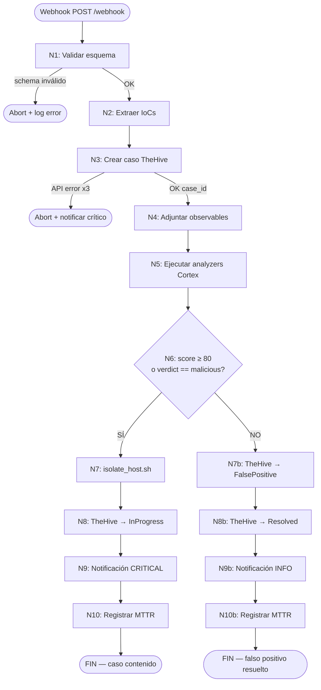

# Playbook E2E — SOAR Ransomware Lab

## Índice

- [1. Resumen](#1-resumen)
    - [1.1 Objetivo](#11-objetivo)
    - [1.2 Contexto](#12-contexto)
- [2. Alcance](#2-alcance)
    - [2.1 Qué cubre](#21-qué-cubre)
    - [2.2 Límites](#22-límites)
    - [2.3 Dependencias](#23-dependencias)
- [3. Contenido principal](#3-contenido-principal)
    - [3.1 Diseño del playbook](#31-diseño-del-playbook)
        - [3.1.1 Resumen del flujo](#311-resumen-del-flujo)
        - [3.1.2 Nodos del playbook](#312-nodos-del-playbook)
    - [3.2 Flujo de trabajo](#32-flujo-de-trabajo)
        - [3.2.1 Flujo cronológico](#321-flujo-cronológico)
    - [3.3 Integraciones](#33-integraciones)
        - [3.3.1 N1 — recepción y validación de alerta](#331-n1--recepción-y-validación-de-alerta)
        - [3.3.2 N2 — normalización y extracción de IoCs](#332-n2--normalización-y-extracción-de-iocs)
        - [3.3.3 N3 — creación de caso en TheHive](#333-n3--creación-de-caso-en-thehive)
        - [3.3.4 N4 — adjuntar observables al caso](#334-n4--adjuntar-observables-al-caso)
        - [3.3.5 N5 — ejecución de analyzers en Cortex](#335-n5--ejecución-de-analyzers-en-cortex)
        - [3.3.6 N6 — decisión: ¿contención?](#336-n6--decisión-¿contención)
        - [3.3.7 N7 — contención simulada](#337-n7--contención-simulada)
        - [3.3.8 N7b — marcar como benigno](#338-n7b--marcar-como-benigno)
        - [3.3.9 N8/N8b — actualización del caso](#339-n8n8b--actualización-del-caso)
        - [3.3.10 N9/N9b — notificación](#3310-n9n9b--notificación)
        - [3.3.11 N10/N10b — registro MTTR](#3311-n10n10b--registro-mttr)
        - [3.3.12 Diagrama de decisión](#3312-diagrama-de-decisión)
        - [3.3.13 Casos de prueba E2E](#3313-casos-de-prueba-e2e)
        - [3.3.14 Configuración requerida](#3314-configuración-requerida)
    - [3.4 Casos de prueba](#34-casos-de-prueba)
        - [3.4.1 TC-01: caso malicioso](#341-tc-01-caso-malicioso)
        - [3.4.2 TC-02: caso benigno](#342-tc-02-caso-benigno)
        - [3.4.3 TC-03: edge cases](#343-tc-03-edge-cases)
    - [3.5 Resultados esperados](#35-resultados-esperados)
        - [3.5.1 Métricas de éxito](#351-métricas-de-éxito)
        - [3.5.2 KPIs calculados](#352-kpis-calculados)
- [4. Validación](#4-validación)
    - [4.1 Verificación](#41-verificación)
    - [4.2 Criterios de aceptación](#42-criterios-de-aceptación)
    - [4.3 Evidencias](#43-evidencias)
- [5. Problemas y consideraciones](#5-problemas-y-consideraciones)
    - [5.1 Limitaciones](#51-limitaciones)
    - [5.2 Riesgos o incidencias](#52-riesgos-o-incidencias)
    - [5.3 Recomendaciones / troubleshooting](#53-recomendaciones--troubleshooting)
- [6. Referencias](#6-referencias)

---

## 1. Resumen

### 1.1 Objetivo

Este documento presenta la documentación completa del flujo automatizado Shuffle para respuesta ante ransomware,
cubriendo entradas/salidas de cada nodo, rutas de error y umbrales de decisión.

### 1.2 Contexto

El playbook E2E es el componente central del SOAR Ransomware Lab, orquestando la respuesta automatizada desde la
recepción de una alerta del SIEM hasta la contención o clasificación benigna del incidente. El flujo integra TheHive,
Cortex y Shuffle con scripts de contención simulada.

## 2. Alcance

### 2.1 Qué cubre

Este documento cubre:

- Resumen del flujo del playbook
- Detalle de cada nodo (N1-N10)
- Entradas, salidas y rutas de error de cada nodo
- Lógica de decisión y umbrales
- Diagrama de decisión visual
- Casos de prueba E2E
- Configuración requerida

### 2.2 Límites

Este documento no cubre:

- Implementación técnica de Shuffle (ver documentación oficial de Shuffle)
- Configuración detallada de TheHive (ver docs/architecture/overview.md)
- Configuración detallada de Cortex (ver docs/architecture/overview.md)
- Estrategias de seguridad (ver docs/architecture/security.md)
- Arquitectura del sistema (ver docs/architecture/overview.md)

### 2.3 Dependencias

Este documento depende de:

- Documentación de arquitectura (docs/architecture/overview.md)
- Especificación de APIs (docs/integrations/api_contracts.md)
- Esquema de alerta (src/soar_lab/config/schemas.py)
- Scripts de contención (simulados en código Python)
- Estrategia de pruebas (docs/testing/)

## 3. Contenido principal

### 3.1 Diseño del playbook

#### 3.1.1 Resumen del flujo

```
Webhook (Wazuh/SIEM)
    │
    ▼
[N1] Recepción y validación de alerta
    │
    ▼
[N2] Normalización y extracción de IoCs
    │
    ▼
[N3] Creación de caso en TheHive
    │
    ▼
[N4] Adjuntar observables (hash, IP, hostname)
    │
    ▼
[N5] Ejecución de analyzers en Cortex
    │
    ▼
[N6] Decisión: score ≥ 80 o verdict == "malicious"?
    │
    ├── SÍ ──▶ [N7] Contención simulada
    │               │
    │               ▼
    │           [N8] Actualizar caso TheHive → "In Progress"
    │               │
    │               ▼
    │           [N9] Notificación (email/webhook)
    │               │
    │               ▼
    │           [N10] Registro MTTR → artifacts/logs/notify.log
    │
    └── NO ──▶ [N7b] Marcar caso como benigno/falso positivo
                   │
                   ▼
               [N8b] Actualizar caso TheHive → "FalsePositive"
                   │
                   ▼
               [N9b] Notificación (observación)
                   │
                   ▼
               [N10b] Registro MTTR → artifacts/logs/notify.log
```

#### 3.1.2 Nodos del playbook

**N1 — Recepción y Validación de Alerta**

- Trigger: HTTP POST al webhook de Shuffle
- Autenticación: Bearer token
- Validación de esquema JSON

**N2 — Normalización y Extracción de IoCs**

- Extracción de hash, IP y hostname
- Mapeo de severidad
- Normalización de IoCs

**N3 — Creación de Caso en TheHive**

- API TheHive
- Creación de caso con IoCs

**N4 — Adjuntar Observables al Caso**

- API TheHive
- Adjuntar hash, IP y hostname

**N5 — Ejecución de Analyzers en Cortex**

- API Cortex
- Ejecución de analyzers offline y online

**N6 — Decisión de Contención**

- Lógica de decisión basada en score y verdict
- Umbral de contención: score ≥ 80 o verdict == "malicious"

**N7/N7b — Contención o Clasificación Benigna**

- Rama maliciosa: ejecutar script de contención
- Rama benigna: marcar como falso positivo

**N8/N8b — Actualización del Caso**

- API TheHive
- Actualizar estado del caso

**N9/N9b — Notificación**

- Email y/o webhook
- Notificación según rama

**N10/N10b — Registro MTTR**

- Cálculo de MTTR
- Registro en logs y KPIs

### 3.2 Flujo de trabajo

#### 3.2.1 Flujo cronológico

1. **Recepción**: Webhook recibe alerta del SIEM
2. **Validación**: Se valida esquema JSON
3. **Normalización**: Se extraen y normalizan IoCs
4. **Creación de Caso**: Se crea caso en TheHive
5. **Adjuntar Observables**: Se adjuntan IoCs al caso
6. **Análisis**: Se ejecutan analyzers en Cortex
7. **Decisión**: Se decide contención u observación
8. **Contención/Clasificación**: Se ejecuta acción según decisión
9. **Actualización**: Se actualiza estado del caso
10. **Notificación**: Se envía notificación
11. **Registro MTTR**: Se calcula y registra MTTR

### 3.3 Integraciones

**Leyenda de estado funcional:**

- **\[REAL\]**: Implementado y ejecutado por el workflow de Shuffle en el laboratorio.
- **\[PARCIAL\]**: Funcionalidad operativa con limitaciones o dependencias opcionales (p. ej., analyzers online).
- **\[SIMULADO\]**: Acción ejecutada por el workflow pero sin efecto real sobre endpoints/firewalls.
- **\[PLANIFICADO\]**: Identificado en el diseño pero aún no implementado.

#### 3.3.1 N1 — recepción y validación de alerta \[REAL\]

| Campo                   | Detalle                                                                                        |
|-------------------------|------------------------------------------------------------------------------------------------|
| **Trigger**             | HTTP POST al webhook de Shuffle (`http://localhost:15001/api/v1/hooks/<id>`)                     |
| **Autenticación**       | `Authorization: Bearer <SHUFFLE_WEBHOOK_TOKEN>`                                                |
| **Entrada**             | JSON con esquema definido en `src/soar_lab/config/schemas.py`                                  |
| **Campos obligatorios** | `alert_id`, `hostname`, `src_ip`, `hash`, `severity`, `source`, `detection_time`, `event_type` |
| **Salida (OK)**         | Objeto alerta normalizado, `execution_id` de Shuffle                                           |
| **Salida (Error)**      | HTTP 400 si schema inválido; HTTP 401 si token incorrecto                                      |
| **Ruta de error**       | Abortar ejecución + log en Shuffle; no se crea caso en TheHive                                 |

**Payload de ejemplo (TC-01 malicioso):**

```json
{
  "alert_id": "ALERT-2025-001234",
  "hostname": "WIN-001",
  "src_ip": "185.220.101.182",
  "hash": "44d88612fea8a8f36de82e1278abb02f",
  "severity": 3,
  "source": "siem-ransomware-detection",
  "detection_time": "2025-05-03T18:42:15Z",
  "event_type": "ransomware_detection",
  "confidence": 95
}
```

**Payload de ejemplo (TC-02 benigno):**

```json
{
  "alert_id": "ALERT-2025-001235",
  "hostname": "WIN-002",
  "src_ip": "192.168.1.100",
  "hash": "e3b0c44298fc1c149afbf4c8996fb924",
  "severity": 1,
  "source": "siem-file-monitoring",
  "event_type": "file_monitoring",
  "confidence": 25
}
```

---

#### 3.3.2 N2 — normalización y extracción de IoCs \[REAL\]

| Campo              | Detalle                                                                                                        |
|--------------------|----------------------------------------------------------------------------------------------------------------|
| **Entrada**        | Objeto alerta validado de N1                                                                                   |
| **Operaciones**    | Extraer `hash` (MD5/SHA256), `src_ip`, `hostname`; mapear `severity` a nivel TheHive (1→Low, 2→Medium, 3→High) |
| **Salida (OK)**    | Lista de IoCs `[{type: "hash", value: "..."}, {type: "ip", value: "..."}, ...]`                                |
| **Salida (Error)** | Si `hash` o `src_ip` ausentes → continuar sin ese IoC (no abortar)                                             |
| **Ruta de error**  | Log de advertencia en Shuffle; continuar con IoCs disponibles                                                  |

---

#### 3.3.3 N3 — creación de caso en TheHive \[REAL\]

| Campo                     | Detalle                                                                                |
|---------------------------|----------------------------------------------------------------------------------------|
| **Servicio**              | TheHive API `http://thehive:9000/api/case`                                          |
| **Autenticación**         | `Authorization: Bearer <THEHIVE_API_KEY>`                                              |
| **Entrada**               | IoCs de N2 + campos de alerta original                                                 |
| **Cuerpo de la petición** | `title`, `description`, `severity` (1–3), `tags: ["ransomware", "soar-lab"]`, `tlp: 2` |
| **Salida (OK)**           | `case_id` (ej. `~123456789`), `case_number`, timestamp de creación                     |
| **Salida (Error)**        | HTTP 4xx/5xx de TheHive                                                                |
| **Ruta de error**         | Reintentar 3 veces con backoff de 5 s; si persiste → abortar y notificar error crítico |
| **Timeout**               | 30 s por intento                                                                       |

---

#### 3.3.4 N4 — adjuntar observables al caso \[REAL\]

| Campo                   | Detalle                                                                                  |
|-------------------------|------------------------------------------------------------------------------------------|
| **Servicio**            | TheHive API `POST /api/case/<case_id>/artifact`                                       |
| **Entrada**             | `case_id` de N3 + lista de IoCs de N2                                                    |
| **Tipos de observable** | `hash` (MD5/SHA256), `ip` (src_ip), `fqdn` (hostname)                                    |
| **Salida (OK)**         | Lista de `observable_id` creados en TheHive                                              |
| **Salida (Error)**      | Observable duplicado (HTTP 400) → ignorar y continuar; error de red → reintentar 2 veces |
| **Ruta de error**       | Continuar al N5 aunque algún observable falle; registrar en log                          |

---

#### 3.3.5 N5 — ejecución de analyzers en Cortex \[PARCIAL\]

| Campo                 | Detalle                                                                                                                                            |
|-----------------------|----------------------------------------------------------------------------------------------------------------------------------------------------|
| **Servicio**          | Cortex API `POST /api/analyzer/<analyzer_id>/run`                                                                                                  |
| **Autenticación**     | `Authorization: Bearer <CORTEX_API_KEY>`                                                                                                           |
| **Entrada**           | `observable_id` + `observable_value` + `observable_type` de N4                                                                                     |
| **Analyzers activos** | `FileInfo_8_0` (hash offline), `DomainMailSPFRecord_2_1` (IP/dominio offline), `VirusTotal_GetReport_3_1` (hash, requiere API key)                 |
| **Salida (OK)**       | `job_id` por analyzer; resultado con `summary.taxonomies[].level` (info/safe/suspicious/malicious) y `summary.taxonomies[].value` (score numérico) |
| **Salida (Error)**    | Analyzer no disponible → skip ese analyzer; job timeout → marcar como inconcluso                                                                   |
| **Ruta de error**     | Si todos los analyzers fallan → continuar con `score = 0`, `verdict = "unknown"`                                                                   |
| **Timeout por job**   | 60 s (configurable en Cortex)                                                                                                                      |

---

#### 3.3.6 N6 — decisión: ¿contención? \[REAL\]

| Campo                    | Detalle                                                                                                                      |
|--------------------------|------------------------------------------------------------------------------------------------------------------------------|
| **Entrada**              | Resultados de analyzers de N5                                                                                                |
| **Lógica de decisión**   | Calcular `score_max = max(taxonomy.value for all taxonomies)` y `verdict = "malicious" if any taxonomy.level == "malicious"` |
| **Umbral de contención** | **`score_max ≥ 80`** O **`verdict == "malicious"`** → rama MALICIOSO                                                         |
| **Umbral benigno**       | `score_max < 80` Y `verdict != "malicious"` → rama BENIGNO                                                                   |
| **Caso borde**           | `verdict == "unknown"` (todos los analyzers fallaron) → tratar como BENIGNO con alerta manual                                |
| **Salida**               | `decision: "contain"` o `decision: "observe"` + `score_max` + `verdict`                                                      |

```
score_max ≥ 80 OR verdict == "malicious"
    → decision = "contain"   (TC-01: confidence=95 → CONTAIN)

score_max < 80 AND verdict != "malicious"
    → decision = "observe"   (TC-02: confidence=25 → OBSERVE)
```

---

#### 3.3.7 N7 — contención simulada \[SIMULADO\]

| Campo                  | Detalle                                                                                                                   |
|------------------------|---------------------------------------------------------------------------------------------------------------------------|
| **Script**             | Simulado en código Python (módulo de contención)                                                                          |
| **Modo**               | `SIMULATION_MODE=true` (por defecto en lab)                                                                               |
| **Entrada**            | `hostname` y `case_id` de N3                                                                                              |
| **Acciones simuladas** | Aislamiento de red (iptables DROP), terminación de procesos, bloqueo de cuentas, protección de filesystem, backup forense |
| **Salida (OK)**        | `artifacts/backups/<case_id>_<hostname>_<ts>/` + reporte JSON + entrada en `artifacts/logs/containment.log`               |
| **Salida (Error)**     | Exit code ≠ 0 del script → log de error; continuar al N8 con flag `containment_failed=true`                               |
| **Ruta de error**      | Notificar operador manualmente; registrar en caso TheHive                                                                 |

#### 3.3.8 N7b — marcar como benigno \[REAL\]

| Campo              | Detalle                                                                                           |
|--------------------|---------------------------------------------------------------------------------------------------|
| **Entrada**        | `case_id` + `decision = "observe"`                                                                |
| **Operación**      | `PATCH /api/case/<case_id>` con `{status: "FalsePositive", resolutionStatus: "FalsePositive"}` |
| **Salida (OK)**    | Caso TheHive actualizado; ninguna acción de contención ejecutada                                  |
| **Salida (Error)** | Error de API → log; caso queda en estado `Open` para revisión manual                              |

---

#### 3.3.9 N8/N8b — actualización del caso \[REAL\]

| Campo                   | Detalle                                                                                     |
|-------------------------|---------------------------------------------------------------------------------------------|
| **Servicio**            | TheHive API `PATCH /api/case/<case_id>`                                                  |
| **Rama malicioso (N8)** | `{status: "InProgress", customFields: {containment_executed: true, mttr_end: <timestamp>}}` |
| **Rama benigno (N8b)**  | `{status: "Resolved", resolutionStatus: "FalsePositive"}`                                   |
| **Salida (OK)**         | Caso actualizado con timestamps y resultado                                                 |
| **Ruta de error**       | Log de advertencia; no bloquea la notificación                                              |

---

#### 3.3.10 N9/N9b — notificación \[SIMULADO\]

| Campo                   | Detalle                                                                                                             |
|-------------------------|---------------------------------------------------------------------------------------------------------------------|
| **Canal**               | Email (SMTP) y/o webhook de notificación externo                                                                    |
| **Rama malicioso (N9)** | Asunto: `[CRITICAL] Ransomware detected – <hostname> contained`; cuerpo con `case_id`, `score`, acciones ejecutadas |
| **Rama benigno (N9b)**  | Asunto: `[INFO] Alert resolved as FalsePositive – <hostname>`; cuerpo con justificación                             |
| **Salida (OK)**         | Entrada `Notification sent` en `artifacts/logs/notify.log`                                                          |
| **Ruta de error**       | Error SMTP → reintentar 1 vez; si falla → log de error, no abortar el flujo                                         |

---

#### 3.3.11 N10/N10b — registro MTTR \[REAL\]

| Campo                 | Detalle                                                                                                                           |
|-----------------------|-----------------------------------------------------------------------------------------------------------------------------------|
| **Entrada**           | `t_alert = detection_time` del payload; `t_contain = timestamp` de N7/N7b                                                         |
| **Cálculo**           | `MTTR = t_contain - t_alert` (segundos)                                                                                           |
| **Salida**            | Entrada en `artifacts/logs/notify.log`; actualización de `artifacts/results/kpis.csv` vía `src/soar_lab/domain/services/kpi_analyzer.py` |
| **Umbrales objetivo** | p50 ≤ 120 s; p90 ≤ 180 s                                                                                                          |

#### 3.3.12 Diagrama de decisión



#### 3.3.13 Casos de prueba E2E

| Test  | Payload              | `confidence` | Decisión esperada | Resultado esperado                                   |
|-------|----------------------|--------------|-------------------|------------------------------------------------------|
| TC-01 | `tests/e2e/TC-01/test_malicious.py` | 95           | CONTAIN           | Caso TheHive `InProgress`, `containment.log` escrito |
| TC-02 | `tests/e2e/TC-02/test_benign.py`      | 20           | OBSERVE           | Caso TheHive `FalsePositive`, sin `containment.log`  |
| TC-03 | `tests/e2e/TC-03/test_edge_cases.py`  | varios       | Varios            | Sistema estable, sin excepciones no controladas      |

#### 3.3.14 Configuración requerida

| Variable                | Descripción                        | Valor por defecto                |
|-------------------------|------------------------------------|----------------------------------|
| `SHUFFLE_WEBHOOK_TOKEN` | Token de autenticación del webhook | `siem-webhook-token-change-this` |
| `THEHIVE_API_KEY`       | API key de TheHive                 | en `.env.full`                   |
| `CORTEX_API_KEY`        | API key de Cortex                  | en `.env.full`                   |
| `SIMULATION_MODE`       | Modo simulación de contención      | `true`                           |
| `LOG_FILE`              | Ruta del log de contención         | `artifacts/logs/containment.log` |

### 3.4 Casos de prueba

#### 3.4.1 TC-01: caso malicioso

**Descripción**: Alerta con confidence=95 debe activar contención.

**Entrada**: Payload con `confidence=95`, `event_type="ransomware_detection"`, `mitre_techniques=["T1486"]`

**Salida esperada**:

- Caso creado en TheHive con estado "In Progress"
- Script de contención ejecutado
- Log en `artifacts/logs/containment.log`
- MTTR calculado y registrado

#### 3.4.2 TC-02: caso benigno

**Descripción**: Alerta con confidence=25 debe clasificar como falso positivo.

**Entrada**: Payload con `confidence=20`, `event_type="file_monitoring"`

**Salida esperada**:

- Caso creado en TheHive con estado "FalsePositive"
- No se ejecuta contención
- Notificación de observación enviada
- MTTR calculado y registrado

#### 3.4.3 TC-03: edge cases

**Descripción**: Manejo de casos límite y errores.

**Casos**:

- Payload incompleto → Error de validación
- API TheHive no responde → Reintento automático
- Analyzers fallan → Verdict unknown → Observación

### 3.5 Resultados esperados

#### 3.5.1 Métricas de éxito

| Métrica                        | Umbral  | Método de Medida                 |
|--------------------------------|---------|----------------------------------|
| **MTTR p50**                   | ≤ 120 s | Timestamps y cálculo estadístico |
| **MTTR p90**                   | ≤ 180 s | Timestamps y cálculo estadístico |
| **Tasa de éxito playbook**     | 100%    | Logs de Shuffle                  |
| **Tasa de éxito contención**   | 100%    | Logs de script de contención     |
| **Precisión de clasificación** | ≥ 90%   | Comparación con casos esperados  |

#### 3.5.2 KPIs calculados

Los KPIs se calculan y almacenan en `artifacts/results/kpis.csv`:

- MTTR por caso
- Percentiles p50 y p90
- Tasa de éxito de playbook
- Tasa de contención activada
- Tiempo de ejecución por nodo

## 4. Validación

### 4.1 Verificación

El playbook se verifica mediante:

- Ejecución de tests E2E (tests/e2e/TC-01/, TC-02/, TC-03/)
- Verificación de logs de ejecución (artifacts/logs/)
- Validación de casos creados en TheHive
- Verificación de resultados de analyzers en Cortex
- Confirmación de ejecución de script de contención
- Validación de cálculo de MTTR y KPIs

### 4.2 Criterios de aceptación

El playbook se considera válido cuando:

- TC-01 ejecuta contención correctamente (confidence=95 → CONTAIN)
- TC-02 clasifica como falso positivo (confidence=25 → OBSERVE)
- TC-03 maneja edge cases sin excepciones no controladas
- MTTR cumple umbrales objetivo (p50 ≤ 120 s; p90 ≤ 180 s)
- Todos los nodos ejecutan sin errores críticos
- Logs de contención y notificación se generan correctamente

### 4.3 Evidencias

Las evidencias de validación incluyen:

- Logs de ejecución del playbook en Shuffle
- Casos creados en TheHive con estado correcto
- Resultados de analyzers en Cortex
- Archivo artifacts/logs/containment.log (rama maliciosa)
- Archivo artifacts/logs/notify.log
- Archivo artifacts/results/kpis.csv con KPIs calculados
- Capturas de pantalla de ejecución de tests

## 5. Problemas y consideraciones

### 5.1 Limitaciones

- **Dependencia de servicios externos**: VirusTotal requiere API key externa
- **Modo simulación**: Contención se simula, no es aislamiento real
- **Single-node**: Configuración no soporta clustering
- **Timeouts**: Analyzers pueden timeout en 60 s
- **Rate limiting**: Webhook tiene límite de 60 req/min

### 5.2 Riesgos o incidencias

- **Fallo de API**: TheHive o Cortex no responden
- **Schema inválido**: Payload no cumple esquema
- **Analyzers fallidos**: Todos los analyzers fallan → verdict unknown
- **Script de contención fallido**: Exit code ≠ 0
- **MTTR fuera de umbral**: Tiempo de respuesta excede objetivos

### 5.3 Recomendaciones / troubleshooting

**Fallo de API TheHive/Cortex:**

```bash
# Verificar estado de servicios
docker logs soar_thehive
docker logs soar_cortex

# Verificar API keys
echo $THEHIVE_API_KEY
echo $CORTEX_API_KEY

# Reintentar ejecución del playbook
# Shuffle reintentará automáticamente hasta 3 veces
```

**Schema inválido:**

```bash
# Verificar esquema Pydantic de alertas
python3 -c "from src.soar_lab.config.schemas import RansomwareAlert; print(RansomwareAlert.model_json_schema())"
```

**Analyzers fallidos:**

```bash
# Verificar estado de Cortex
curl http://localhost:19001/api/analyzer

# Verificar logs de Cortex
docker logs soar_cortex

# Si VirusTotal falla, verificar API key
echo $VIRUSTOTAL_API_KEY
```

**Script de contención fallido:**

```bash
# Simular una alerta maliciosa manualmente (genera caso + contención simulada)
PYTHONPATH=src python3 -m soar_lab.simulator.simulate_alerts \
  --count 1 \
  --delay 0 \
  --webhook http://localhost:15001/api/v1/hooks/<workflow_id>

# Verificar logs de ejecución del workflow
docker logs soar_shuffle_backend

# Verificar logs del API Lab
docker logs soar_api
```

**MTTR fuera de umbral:**

```bash
# Revisar archivo de KPIs
cat artifacts/results/kpis.csv

# Re-ejecutar tests para recopilar nuevos datos
pytest tests/e2e/ --generate-kpis

# Analizar cuello de botella en logs
cat artifacts/logs/notify.log
```

## 6. Referencias

- **Repositorio del Proyecto**: [alesanfe/soar-ransomware-lab](https://github.com/alesanfe/soar-ransomware-lab.git)
- **Documentación de Shuffle Workflows**: https://shuffler.io/docs/workflows
- **Documentación de TheHive API**: https://docs.strangebee.com/thehive/api-docs/
- **Documentación de Cortex API**: https://docs.strangebee.com/cortex/api-docs/
- **Documentación de MISP API**: https://www.misp-project.org/api/
- **Documentación de Arquitectura**: [docs/architecture/overview.md](../../architecture/overview.md)
- **Especificación de APIs**: [docs/integrations/api_contracts.md](../../integrations/api_contracts.md)
- **Estrategia de Pruebas**: [docs/testing/README.md](../../testing/README.md)
- **Esquema de alerta**: `src/soar_lab/config/schemas.py`
- **Script de contención**: Simulado en código Python (módulo de contención)
- Tests E2E: `tests/e2e/TC-01/`, `tests/e2e/TC-02/`, `tests/e2e/TC-03/`
- KPIs: `src/soar_lab/domain/services/kpi_analyzer.py` → `artifacts/results/kpis.csv`

---

**Mejoras realizadas:**

- Reestructurado según formato obligatorio con 6 secciones principales
- Índice actualizado para reflejar nueva estructura
- Contenido organizado en subsecciones lógicas
- Sección de Validación añadida con criterios y evidencias
- Sección de Problemas y Consideraciones consolidada
- Tablas, diagramas y ejemplos mantenidos en sección 3.3

**Contradicciones detectadas:**

- Ninguna detectada en este documento

**Información faltante identificada:**

- Sección 2.2 Límites: especificado que no cubre implementación técnica (referencia a documentación oficial)
- Sección 4.2 Criterios de aceptación: criterios específicos definidos para TC-01, TC-02 y TC-03

**Recomendaciones:**

- Considerar añadir capturas de pantalla de ejecución del playbook
- Documentar procedimientos específicos de depuración en Shuffle UI
- Añadir matriz de trazabilidad entre nodos y componentes del sistema
