# Plan del Proyecto 

> El objetico de este documento es planificar las semanas y los hitos clave para el desarrollo del laboratorio SOAR, incluyendo entorno, integraciones, playbook, pruebas e informe. La **ruta crítica** es: docker → servicios → conexiones → playbook → pruebas → informe.

## Plan por semanas

| Semana | Fase / Hito                | Objetivo principal                                      | Entregables / Evidencias                          |
|--------|----------------------------|---------------------------------------------------------|---------------------------------------------------|
| S1     | Baseline y preparación    | Definir alcance, objetivos y riesgos; crear plan y roadmap | docs/alcance.md, docs/objetivos.md, docs/riesgos.md, docs/plan.md |
| S2     | Entorno (Docker + Seguridad) | Configurar Docker Compose y aplicar hardening básico   | docker-compose.yml, .env.example, scripts/gen_certs.sh, docs/security.md |
| S3     | Servicios                 | Inicializar TheHive, Cortex y Shuffle con configuración mínima | docs/thehive_template.json, docs/cortex_analyzers.md, configuración de Shuffle |
| S4     | Conexiones                | Activar Webhook, definir esquema de alerta y simular SIEM | schemas/alert.schema.json, scripts/send_alert.py, logs de pruebas |
| S5     | Playbook E2E              | Construir flujo completo en Shuffle con contención simulada | playbooks/shuffle/README.md, scripts/isolate_host.sh, scripts/isolate_endpoint.ps1, scripts/notify.sh, logs/notify.log |
| S6     | Pruebas y métricas        | Ejecutar casos malicioso y benigno; calcular KPIs      | tests/e2e/*, results/kpis.csv, capturas de ejecución |
| S7     | Informe y cierre          | Redactar informe técnico, manual del playbook y lecciones aprendidas | docs/informe_pruebas.md, docs/manual_playbook.md, docs/tecnico.md, docs/cierre.md, docs/validacion.md |

### Diagrama Gantt por semanas

```mermaid
gantt
title Roadmap por Semanas
dateFormat WW
axisFormat "S%V"
section Fases
S1 Baseline y preparación :active, s1, 01, 1w
S2 Entorno (Docker + Seguridad) :crit, s2, 02, 1w
S3 Servicios :crit, s3, 03, 1w
S4 Conexiones :crit, s4, 04, 1w
S5 Playbook E2E :crit, s5, 05, 1w
S6 Pruebas y métricas :crit, s6, 06, 1w
S7 Informe y cierre :crit, s7, 07, 1w
```

## Plan por tareas de la EDT

| Tarea EDT | Descripción | Entregables |
|-----------|-------------|-------------|
| 2.1 Plan/roadmap | Crear roadmap visual (Gantt), definir ruta crítica y dependencias | docs/plan.md, diagrama Gantt |
| 2.2 Riesgos | Identificar riesgos y mitigaciones | docs/riesgos.md |
| 3.x Arquitectura | Diseñar arquitectura single-host y flujo del playbook | docs/architecture.md, diagrams/architecture.mmd |
| 4.x Entorno | Configurar Docker Compose, seguridad básica | docker-compose.yml, scripts/gen_certs.sh |
| 5.x Integraciones | Conectar TheHive, Cortex, Shuffle y SIEM simulado | docs/thehive_template.json, docs/cortex_analyzers.md, scripts/send_alert.py |
| 6.x Playbook | Construir flujo E2E con decisiones y contención simulada | playbooks/shuffle/README.md, scripts/isolate_host.sh |
| 7.x Pruebas | Ejecutar pruebas E2E y calcular KPIs | tests/e2e/*, results/kpis.csv |
| 8.x Documentación | Redactar informe técnico, manual y cierre | docs/informe_pruebas.md, docs/manual_playbook.md, docs/cierre.md |

### Diagrama Gantt por tareas EDT

```mermaid
gantt
title Roadmap por Tareas EDT
dateFormat WW
axisFormat "S%V"
section EDT
2.1 Plan/roadmap :active, t1, 01, 1w
2.2 Riesgos :t2, 01, 1w
3.x Arquitectura :crit, t3, 02, 1w
4.x Entorno :crit, t4, 02, 1w
5.x Integraciones :crit, t5, 03, 1w
6.x Playbook :crit, t6, 04, 1w
7.x Pruebas :crit, t7, 05, 1w
8.x Documentación :crit, t8, 06, 2w
```

## Cierre
Al completar el informe y validación, el proyecto estará listo para revisión final con toda la documentación y evidencias organizadas.
