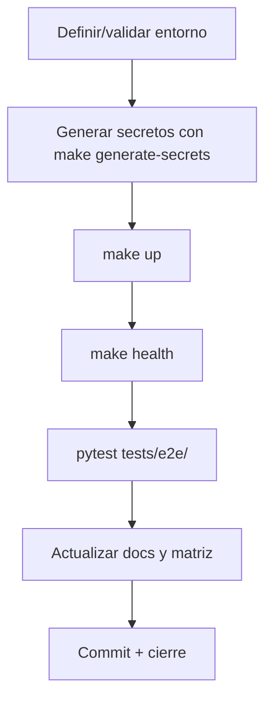

# Plan de gobernanza, validación y cierre del backlog

Documento consolidado para las FASEs 54–65 del plan de remediación documental. Define matriz de trazabilidad, gobernanza del backlog, validación reproducible, arquitectura, seguridad, API/Docker/observabilidad, testing, operativa, tesis y cierre.

## 1. Gobernanza, trazabilidad y control del backlog (FASE 54)

### 1.1 Matriz de trazabilidad requisito → tarea → evidencia → documento → commit (N001)

| Requisito | Tarea | Evidencia | Documento actualizado | Estado |
|-----------|-------|-----------|----------------------|--------|
| Hardcoded secrets removidos | FASE 46, FASE 52 | Diff de Compose/script | `final_audit_report.md`, `inconsistency_matrix.md` | ✅ |
| MISP DB bind mount arreglado | FASE 48, FASE 52 | `docker-compose.misp.yml` sin bind; `docker inspect` tipo `volume` | `infrastructure_guide.md`, `troubleshooting.md` | ✅ |
| Grafana funcional | FASE 50, FASE 60 | E2E KPI pasado, datos en `soar-metrics` | `logging_and_observability.md`, `user_guide.md` | ✅ |
| Nginx/SSL OK | FASE 47 | `nginx -t`, certificado válido | `infrastructure_guide.md`, `final_audit_report.md` | ✅ |
| Arquitectura hexagonal validada | FASE 56 | `tests/architecture/test_hexagonal_imports.py` | `hexagonal-structure.md` | ✅ |
| Backlog de fases 1022-2760 | Esta sesión | TODOS y documentos generados | `governance_and_validation_plan.md` | En curso |

> **Responsabilidad:** cada tarea crítica debe tener un responsable, evidencia y estado antes de cerrarse.

### 1.2 Tipificación de cambios (N002)

| Tipo | Ejemplo | Documento predominante |
|------|---------|--------------------------|
| Código | Nuevo test de arquitectura | `tests/architecture/`, `pytest.ini` |
| Infraestructura | Ajuste de Compose, volúmenes | `infra/docker/compose/`, `infrastructure_guide.md` |
| Seguridad | Eliminación de secretos hardcodeados | `final_audit_report.md`, `inconsistency_matrix.md` |
| Documentación | Expansión de A.6.1 | `docs/thesis/appendix_a.md`, `CHANGELOG_THESIS_UPDATE.md` |
| Pruebas | E2E, unit, smoke | `docs/testing/test_suite.md`, `pytest.ini` |
| Académico | Secciones de la tesis | `docs/thesis/` |

### 1.3 Dependencias y orden de ejecución (N003)



### 1.4 Caducidad de datos volátiles (N004)

- **Credenciales, workflow IDs, API keys:** vigentes solo para el commit/entorno en el que se generaron; regenerar con `make reset && make up`.
- **Capturas/logs:** conservar 30 días como máximo en desarrollo; en CI, se descartan tras el workflow.
- **Versiones de imágenes Docker:** fijar en `.env.example` y Dockerfiles; actualizar tras validación.
- **Resultados de pruebas:** fechar y referenciar al commit; revalidar si cambia código relevante.

### 1.5 Registro de decisiones (N005)

Las decisiones conscientes que no se derivan automáticamente del código se registran en este plan o en `docs/project/decisions/`.

### 1.6 Revisión de privacidad y publicación (N006)

Checklist previo a publicar capturas, logs o artefactos académicos:

- [ ] No aparecen secretos, tokens, IPs internas, nombres de usuario o rutas locales.
- [ ] `.env.full` no se publica (está en `.gitignore`).
- [ ] Los informes `docs/audit/legacy/` no se exponen sin cabecera de "histórico".
- [ ] Certificados y claves privadas (`*.key`, `*.crt`) están en `.gitignore`.

## 2. Validación reproducible y evidencias (FASE 55)

### 2.1 Manifiesto de evidencias (N007)

Cada artefacto de auditoría debe incluir: hash, fecha, entorno, comando y ubicación.

Ejemplo:

```text
archivo: artifacts/evidence/e2e_2026-07-19.txt
sha256: <hash>
fecha: 2026-07-19T20:00:00+02:00
entorno: Windows 11 + Docker Desktop 4.x + WSL2
comando: pytest tests/e2e/ -m e2e
resultado: 16/16 PASSED
```

### 2.2 Convención de nombres y retención (N008)

| Artefacto | Patrón | Retención |
|-----------|--------|-----------|
| Logs E2E | `e2e_<fecha>_<commit>.log` | 30 días |
| Cobertura | `coverage_<fecha>.xml` | 90 días |
| Backups | `backup_<timestamp>_<tipo>.tar.gz` | según política (default 7 días) |
| Capturas | `screenshot_<TC>_<fecha>.png` | 30 días |

### 2.3 Prueba de entorno limpio reset → up (N009)

Procedimiento:

1. `make down -v` (limpiar contenedores/volúmenes).
2. Guardar estado: `docker ps -a`, `docker volume ls`, `git status`.
3. `make generate-secrets` y `make up`.
4. `make health`.
5. Comparar estado; no debe quedar ningún contenedor/volumen no definido en Compose.

### 2.4 Fingerprint del entorno (N010)

Capturar al inicio de cada sesión de auditoría:

```bash
uname -a
python --version
docker --version
docker compose version
make --version
vagrant --version 2>/dev/null || echo "vagrant no disponible"
VBoxManage --version 2>/dev/null || echo "VirtualBox no disponible"
git rev-parse HEAD
```

### 2.5 Plantilla de registro de comandos fallidos (N011)

| Campo | Valor |
|-------|-------|
| Fecha/hora | |
| Comando | |
| Entorno | |
| Salida relevante | |
| Causa raíz | |
| Bloquea a | |
| Impacto | |
| Siguiente acción | |
| Responsable | |

### 2.6 Detección de afirmaciones sin evidencia (N012)

Control manual/automatizado: todo párrafo que afirme "funciona", "está configurado" o "supera umbral" debe citar prueba, comando, OpenAPI, Compose o artefacto. Revisión como checklist en `docs/testing/test_suite.md`.

## 3. Arquitectura hexagonal y límites de seguridad (FASE 56)

### 3.1 Pruebas de dependencias entre capas (N013)

- Test: `tests/architecture/test_hexagonal_imports.py`.
- Regla: `src/soar_lab/domain` no importa `infrastructure`, `interfaces`, `application`, `scripts`, `api`, etc.
- Excepciones temporales: documentar en este plan con justificación y fecha de remediación.

### 3.2 Catálogo puerto → adaptador → implementación (N014)

| Puerto (domain/ports) | Adaptador | Implementación | Consumidor |
|-----------------------|-----------|----------------|------------|
| AlertRepository | SqliteAlertRepository | `src/soar_lab/infrastructure/persistence/sqlite_alert_repository.py` | Casos de uso API |
| BackupDriver | TarBackupDriver | `src/soar_lab/infrastructure/backup/tar_backup_driver.py` | BackupService |
| TokenProviderInterface | JwtTokenProvider | `src/soar_lab/infrastructure/auth/jwt_token_provider.py` | AuthService |
| SystemMetricsInterface | HTTPClient | `src/soar_lab/infrastructure/external/http_client.py` | AnalyticsService |

> El catálogo se mantiene automáticamente inspeccionando `src/soar_lab/domain/ports.py` e `src/soar_lab/infrastructure/**/adapters/`.

## 4. Seguridad de secretos, autenticación y cadena de suministro (FASE 57)

### 4.1 Jerarquía de secretos

- Origen: `.env.full` generado por `make generate-secrets`.
- Runtime: montado en `/app/.env.full` en `api`; nunca en repositorio.
- Rotación: `make reset` regenera excepto que se haga backup previo.
- Escaneo: `grep -R` y bandit evitan defaults en código/Compose.

### 4.2 JWT

- Algoritmo: `HS256`.
- `JWT_SECRET_KEY` se genera con `secrets.token_urlsafe(32)`; si no existe, `AuthService` usa `API_AUTH_SECRET`.
- Validación: tests de token expirado/manipulado.

### 4.3 Cadena de suministro

- Imágenes Docker con tag fijo; `latest` solo en desarrollo experimental.
- Revisar dependencias con `safety`/`bandit`.
- No usar credenciales previsibles en `.env.example`.

## 5. API, WebSocket y contratos (FASE 58)

- Fuente de verdad: `src/soar_lab/interfaces/api/main.py` genera `/openapi.json`.
- `docs/integrations/api_contracts.md` describe los contratos y usa placeholders (`<WEB_UI_PASSWORD>`).
- WebSocket: `src/soar_lab/interfaces/api/websocket.py` (si aplica) documenta eventos y payloads.

## 6. Docker, red, reset y recuperación (FASE 59)

- `make up` usa todos los compose files en `infra/docker/compose/`.
- `make reset` respalda `.env.full`, destruye volúmenes y re-levanta.
- `network-watcher` conecta workers de Shuffle a `soar_net` y reescribe `/etc/resolv.conf`.
- MISP DB usa volumen Docker normal (no bind) para evitar `Permission denied` en Windows.

## 7. Observabilidad, métricas y calidad de datos (FASE 60)

- Promtail → Loki → Grafana.
- Índice `soar-metrics` alias a `soar-metrics-v2`; mapping: `mttr_seconds` float, `@timestamp` date.
- Plugin Elasticsearch instalado en Grafana vía `GF_INSTALL_PLUGINS`.
- Grafana en `soar_net` y `logging_net`.

## 8. Testing, CI y confiabilidad (FASE 61)

- `pytest.ini` categoriza: unit, integration, e2e, smoke, kpi, architecture.
- CI: `make test` ejecuta tests unitarios/integración; `make e2e` requiere Docker.
- Quality gates: tests + coverage + bandit.

## 9. Experiencia operativa y documentación (FASE 62)

- Guías: `installation_guide.md`, `user_guide.md`, `configuration_manual.md`, `troubleshooting.md`.
- Inicio rápido: `make generate-secrets && make up && make health && make e2e`.

## 10. Tesis, resultados y reproducibilidad académica (FASE 63)

- Secciones clave: `introduction.md` 1.2, `appendix_a.md` A.6.1, `CHANGELOG_THESIS_UPDATE.md`.
- Resultados: E2E 16/16 PASSED, MTTR medible en Grafana, arquitectura validada.
- Reproducibilidad: entorno fijado con Docker, Compose y `.env.example`.

## 11. Cierre y mantenimiento continuo (FASE 64)

- Checklist de cierre:
  1. Todos los tests pasan.
  2. Documentación enlazada y libre de secretos.
  3. `inconsistency_matrix.md` actualizado.
  4. `final_audit_report.md` refleja estado actual.
  5. `docs/project/governance_and_validation_plan.md` cerrado.
- Mantenimiento: revisión mensual de secretos, volúmenes, versiones de imagen.

## 12. Gobernanza, privacidad, limpieza y consolidación estructural (FASE 65)

- Consolidar documentos de proyecto en `docs/project/`.
- No duplicar contenido en `.bak`, `apps/api/docs/legacy/`, `docs/audit/legacy/`.
- Revisar `.gitignore` anualmente.
- Publicar documentación solo tras checklist de privacidad.

## Referencias

- `docs/project/documentation_remediation_tasks.md`
- `docs/project/final_audit_report.md`
- `docs/project/inconsistency_matrix.md`
- `docs/project/docs_review_remediation_status.md`
- `docs/testing/test_suite.md`
- `docs/architecture/hexagonal-structure.md`
- `pytest.ini`
