# Plan del Proyecto

## Índice

- [1. Resumen](#1-resumen)
    - [1.1 Objetivo](#11-objetivo)
    - [1.2 Contexto](#12-contexto)
- [2. Alcance](#2-alcance)
    - [2.1 Qué cubre](#21-qué-cubre)
    - [2.2 Límites](#22-límites)
    - [2.3 Dependencias](#23-dependencias)
- [3. Contenido principal](#3-contenido-principal)
    - [3.1 Estrategia de planificación](#31-estrategia-de-planificación)
    - [3.2 Fases y cronograma](#32-fases-y-cronograma)
    - [3.3 Recursos y asignación](#33-recursos-y-asignación)
    - [3.4 Gestión de riesgos](#34-gestión-de-riesgos)
    - [3.5 Seguimiento y control](#35-seguimiento-y-control)
- [4. Validación](#4-validación)
    - [4.1 Verificación](#41-verificación)
    - [4.2 Criterios de aceptación](#42-criterios-de-aceptación)
    - [4.3 Evidencias](#43-evidencias)
- [5. Problemas y consideraciones](#5-problemas-y-consideraciones)
    - [5.1 Limitaciones](#51-limitaciones)
    - [5.2 Riesgos o incidencias](#52-riesgos-o-incidencias)
    - [5.3 Recomendaciones / troubleshooting](#53-recomendaciones--troubleshooting)
- [6. Referencias](#6-referencias)

---

## 1. Resumen

### 1.1 Objetivo

El objetivo de este documento es planificar las semanas y los hitos clave para el desarrollo del laboratorio SOAR,
incluyendo entorno, integraciones, playbook, pruebas e informe. La ruta crítica es: docker → servicios → conexiones →
playbook → pruebas → informe.

### 1.2 Contexto

El proyecto se desarrolla en 15 semanas, desde la definición de alcance y objetivos hasta el informe y cierre. Cada fase
tiene objetivos específicos con entregables e evidencias definidas, alineados con la EDT y los 20 objetivos SMART del
proyecto.

## 2. Alcance

### 2.1 Qué cubre

Este documento cubre:

- Planificación por semanas con fases y hitos
- Planificación por tareas de la EDT
- Ruta crítica del proyecto
- Diagramas Gantt por semanas y por tareas EDT
- Entregables y evidencias por fase

### 2.2 Límites

Este documento no cubre:

- Detalles técnicos de implementación (ver docs/architecture/overview.md)
- Estrategias de seguridad (ver docs/architecture/security.md)
- Objetivos SMART (ver docs/project/objectives.md)
- Alcance del proyecto (ver docs/project/scope.md)
- Gestión de riesgos (ver docs/project/risks.md)

### 2.3 Dependencias

Este documento depende de:

- Alcance del proyecto (docs/project/scope.md)
- Objetivos SMART (docs/project/objectives.md)
- Gestión de riesgos (docs/project/risks.md)
- Arquitectura del sistema (docs/architecture/overview.md)

## 3. Contenido principal

### 3.1 Estrategia de planificación

#### Ruta Crítica

La ruta crítica del proyecto es:

1. **Docker**: Configuración de Docker Compose (`infra/docker/compose/docker-compose.yml`,
   `infra/docker/compose/docker-compose.core.yml`, `infra/docker/compose/docker-compose.misp.yml`,
   `infra/docker/compose/docker-compose.wazuh.yml`, `infra/docker/compose/docker-compose.api.yml`,
   `infra/docker/compose/logging/docker-compose.logging.yml`)
2. **Servicios**: Inicialización de TheHive, Cortex, Shuffle, MISP, Wazuh, Elasticsearch, Redis, MariaDB
3. **Conexiones**: Webhook, esquema de alerta (`src/soar_lab/config/schemas.py`) y SIEM simulado (
   `src/soar_lab/infrastructure/http_alert_sender.py`)
4. **Playbook**: Flujo E2E con contención simulada en Shuffle
5. **Pruebas**: Ejecución de casos (`tests/e2e/TC-01/test_malicious.py`, `tests/e2e/TC-02/test_benign.py`) y cálculo de
   KPIs (`src/soar_lab/services/kpi_analyzer.py`)
6. **Informe**: Documentación técnica (`docs/operations/playbooks/ransomware_playbook_e2e.md`,
   `docs/operations/configuration_manual.md`) y cierre

#### Fases del Proyecto

- **Fase 1: Infraestructura** (4 semanas): Laboratorio, automatización, API, CLI
- **Fase 2: Desarrollo** (5 semanas): Playbook E2E, integración SIEM, scripts, docs-site, web-management
- **Fase 3: Validación** (4 semanas): Métricas MTTR, pruebas especializadas, KPIs
- **Fase 4: Cierre** (2 semanas): Documentación, analytics, aprobación

### 3.2 Fases y cronograma

#### Flujo Cronológico

El proyecto sigue un flujo secuencial de 15 semanas, donde cada fase depende de la anterior. Las tareas críticas están
marcadas en los diagramas Gantt como `:crit` para identificar la ruta crítica.

#### Dependencias entre Fases

- Fase 2 depende de Fase 1 (infraestructura configurada)
- Fase 3 depende de Fase 2 (playbook y aplicaciones desplegadas)
- Fase 4 depende de Fase 3 (pruebas completadas y KPIs calculados)

### 3.3 Recursos y asignación

#### Plan por semanas

| Semana  | Fase / Hito             | Objetivo principal                                                                             | Entregables / Evidencias                                                                                                                       | Hitos de Validación Intermedia                                     |
|---------|-------------------------|------------------------------------------------------------------------------------------------|------------------------------------------------------------------------------------------------------------------------------------------------|--------------------------------------------------------------------|
| S1-S4   | Fase 1: Infraestructura | Laboratorio, automatización, API, CLI (Objetivos 1, 8, 17, 18)                                 | infra/docker/compose/, Makefile, src/soar_lab/api/, src/soar_lab/cli.py, scripts/ci/                                                           | Validación: servicios funcionando, API y CLI operativos (Semana 4) |
| S5-S9   | Fase 2: Desarrollo      | Playbook E2E, integración SIEM, scripts, docs-site, web-management (Objetivos 2, 5, 6, 19, 20) | playbooks/shuffle/, src/soar_lab/infrastructure/http_alert_sender.py, apps/docs-site/, apps/web-management/                                    | Validación: playbook ejecuta, apps desplegadas (Semana 9)          |
| S10-S13 | Fase 3: Validación      | Métricas MTTR, pruebas especializadas, KPIs (Objetivos 3, 9, 10, 11, 12, 13, 14)               | tests/atomic/, tests/integration/, tests/security/, tests/performance/, tests/production/, artifacts/results/kpis.csv, src/soar_lab/analytics/ | Validación: pruebas pasan, KPIs cumplen umbrales (Semana 13)       |
| S14-S15 | Fase 4: Cierre          | Documentación, analytics, aprobación (Objetivos 4, 15, 16)                                     | docs/, src/soar_lab/analytics/, docs/project/ (scope.md, objectives.md, plan.md)                                                               | Validación: documentación aprobada (Semana 15)                     |

#### Diagrama Gantt por semanas

```mermaid
gantt
title Roadmap por Semanas
dateFormat WW
axisFormat "S%V"
section Fases
Fase 1: Infraestructura :active, f1, 01, 4w
Fase 2: Desarrollo :crit, f2, after f1, 5w
Fase 3: Validación :crit, f3, after f2, 4w
Fase 4: Cierre :crit, f4, after f3, 2w
```

#### Plan por tareas de la EDT

| Tarea EDT         | Descripción                                                       | Entregables                                                                                                  |
|-------------------|-------------------------------------------------------------------|--------------------------------------------------------------------------------------------------------------|
| 2.1 Plan/roadmap  | Crear roadmap visual (Gantt), definir ruta crítica y dependencias | docs/project/plan.md, diagrama Gantt                                                                         |
| 2.2 Riesgos       | Identificar riesgos y mitigaciones                                | docs/project/risks.md                                                                                        |
| 3.x Arquitectura  | Diseñar arquitectura single-host y flujo del playbook             | docs/architecture/overview.md                                                                                |
| 4.x Entorno       | Configurar Docker Compose, seguridad básica                       | docker-compose.yml, .env.full                                                                                |
| 5.x Integraciones | Conectar TheHive, Cortex, Shuffle y SIEM simulado                 | docs/project/references/thehive_template.json, src/soar_lab/infrastructure/http_alert_sender.py              |
| 6.x Playbook      | Construir flujo E2E con decisiones y contención simulada          | docs/operations/playbooks/ransomware_playbook_e2e.md, src/soar_lab/services/containment_service.py           |
| 7.x Pruebas       | Ejecutar pruebas E2E y calcular KPIs                              | tests/e2e/*, artifacts/results/kpis.csv                                                                      |
| 8.x Documentación | Redactar informe técnico, manual y cierre                         | docs/operations/playbooks/ransomware_playbook_e2e.md, docs/operations/configuration_manual.md, docs/project/ |

#### Diagrama Gantt por tareas EDT

```mermaid
gantt
title Roadmap por Tareas EDT
dateFormat WW
axisFormat "S%V"
section EDT
2.1 Plan/roadmap :active, t1, 01, 1w
2.2 Riesgos :t2, 01, 1w
3.x Arquitectura :crit, t3, 02, 1w
4.x Entorno :crit, t4, 02, 2w
5.x Integraciones :crit, t5, 04, 2w
6.x Playbook :crit, t6, 06, 2w
7.x Pruebas :crit, t7, 08, 3w
8.x Documentación :crit, t8, 11, 4w
```



### 3.4 Gestión de riesgos

#### Identificación de Riesgos

Los riesgos del proyecto se detallan en `docs/project/risks.md`. Los riesgos principales incluyen:

- Dependencia de servicios externos (TheHive, Cortex, Shuffle)
- Limitaciones de recursos (8GB RAM mínimo)
- Complejidad de integración entre componentes
- Tiempo de ejecución de pruebas E2E

#### Estrategias de Mitigación

- **Backup de configuración**: Mantener copias de configuración en `artifacts/backups/`
- **Monitoreo continuo**: Verificar estado de servicios regularmente
- **Documentación detallada**: Facilitar troubleshooting y recuperación
- **Pruebas incrementales**: Validar componentes individualmente antes de integración

### 3.5 Seguimiento y control

#### Métricas de Seguimiento

- **Progreso por fase**: Porcentaje de tareas completadas por semana
- **Hitos alcanzados**: Verificación de entregables principales
- **Desviaciones**: Comparación entre planificado y real
- **KPIs del proyecto**: Tiempo de ejecución, cobertura de pruebas, etc.

#### Revisión y Ajuste

- Revisiones semanales del progreso
- Ajustes al plan según desviaciones identificadas
- Comunicación sobre bloqueos y riesgos

## 4. Validación

### 4.1 Verificación

El plan se verifica mediante:

- Revisión de entregables por semana (`docs/project/scope.md`, `docs/project/objectives.md`)
- Validación de dependencias entre fases (Makefile targets: `up`, `down`, `test`)
- Confirmación de ruta crítica (diagramas Gantt en este documento)
- Verificación de alineación con EDT (tareas EDT 2.x - 8.x)
- Validación del roadmap mediante `make plan` (si existe) o revisión manual

### 4.2 Criterios de aceptación

El plan se considera válido cuando:

- Todas las semanas tienen objetivos y entregables definidos
- La ruta crítica está identificada correctamente
- Las dependencias entre fases son lógicas y alcanzables
- Los diagramas Gantt reflejan la planificación
- El plan está alineado con los objetivos SMART

### 4.3 Evidencias

Las evidencias de validación incluyen:

- Documento de plan aprobado
- Diagramas Gantt generados
- Checklist de entregables por semana
- Registro de revisiones y aprobaciones

## 5. Problemas y consideraciones

### 5.1 Limitaciones

- **Plazo fijo**: 7 semanas para completar el proyecto
- **Dependencia secuencial**: Cada fase depende de la anterior
- **Recursos limitados**: Requiere 8GB RAM mínimo y tiempo completo

### 5.2 Riesgos o incidencias

- **Retrasos en fases críticas**: Cualquier retraso en ruta crítica afecta el proyecto completo
- **Problemas técnicos**: Errores en configuración Docker o servicios
- **Cambios en alcance**: Modificaciones no planificadas pueden afectar el cronograma
- **Falta de tiempo**: Insuficiente tiempo para completar todas las fases

### 5.3 Recomendaciones / troubleshooting

**Retraso en fase crítica:**

```bash
# Reevaluar prioridades
# Fase S2 (Docker + Seguridad) es crítica
# Priorizar configuración mínima funcional
# Dejar mejoras de seguridad para fases posteriores
```

**Problemas técnicos:**

```bash
# Verificar documentación oficial de componentes
# Revisar logs de Docker
docker logs soar_thehive
docker logs soar_cortex
docker logs soar_shuffle-backend

# Consultar docs/architecture/overview.md para troubleshooting
```

**Cambios en alcance:**

- Evaluar impacto en cronograma
- Actualizar plan y comunicar cambios
- Revisar objetivos SMART si es necesario

**Falta de tiempo:**

- Priorizar ruta crítica sobre mejoras opcionales
- Reducir alcance de documentación no crítica
- Enfocarse en entregables principales

## 6. Referencias

- **Repositorio del Proyecto**: [alesanfe/soar-ransomware-lab](https://github.com/alesanfe/soar-ransomware-lab.git)
- **Documentación de Shuffle**: https://shuffler.io/docs
- **Documentación de TheHive**: https://docs.strangebee.com/thehive/
- **Documentación de Cortex**: https://docs.strangebee.com/cortex/
- **Documentación de MISP**: https://www.misp-project.org/documentation/
- **Documentación de Wazuh**: https://documentation.wazuh.com/
- **Documentación de Elasticsearch**: https://www.elastic.co/guide/en/elasticsearch/reference/current/index.html
- **Documentación de Arquitectura**: [docs/architecture/overview.md](../architecture/overview.md)
- **Documentación de Seguridad**: [docs/architecture/security.md](../architecture/security.md)
- **Objetivos SMART**: [docs/project/objectives.md](objectives.md)
- **Alcance del Proyecto**: [docs/project/scope.md](scope.md)
- **Gestión de Riesgos**: [docs/project/risks.md](risks.md)

---

**Mejoras realizadas:**

- Reestructurado según formato obligatorio con 6 secciones principales
- Índice actualizado para reflejar nueva estructura
- Contenido organizado en subsecciones lógicas
- Sección de Validación añadida con criterios y evidencias
- Sección de Problemas y Consideraciones consolidada
- Tablas y diagramas Gantt mantenidos en sección 3.3

**Contradicciones detectadas:**

- Ninguna detectada en este documento

