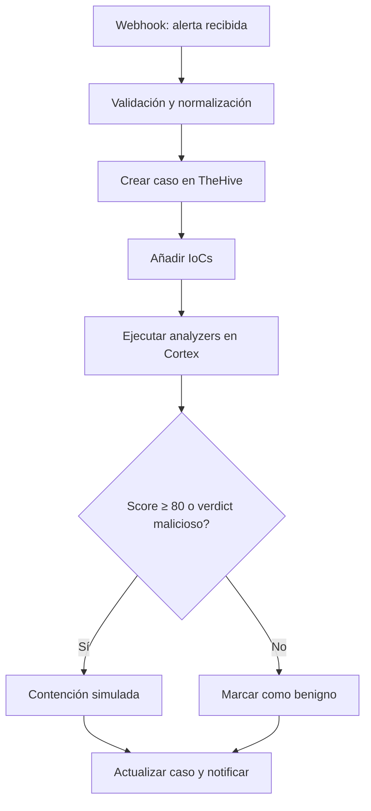
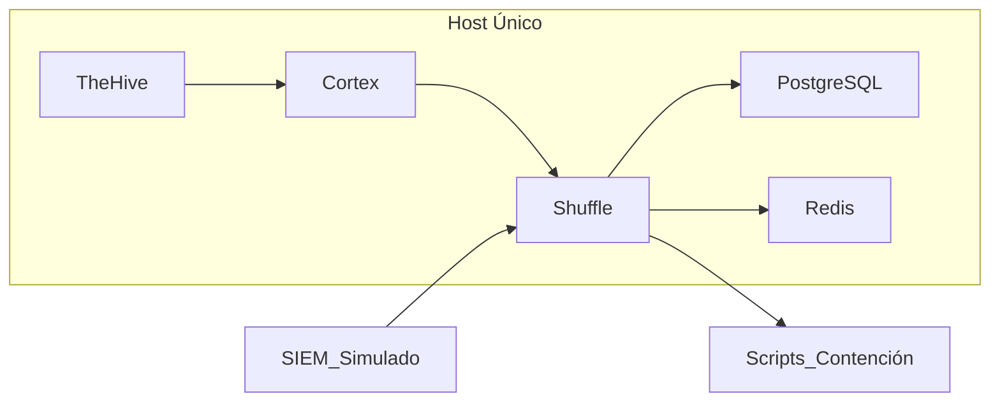

# Alcance del Proyecto (EDT 1.1)

> Este documento define el alcance del Trabajo Fin de Máster (TFM), estableciendo los objetivos y límites del proyecto para garantizar su viabilidad y cumplimiento académico.

## Resumen Ejecutivo

El objetivo principal de este TFM es **diseñar, implementar y evaluar un laboratorio SOAR mínimo viable (MSV)** para la respuesta ante incidentes de ransomware. Este laboratorio ejecutará un **playbook automatizado de extremo a extremo (E2E)** que cubra el flujo completo:
**Webhook → Validación → Caso en TheHive → Adjuntar IoCs → Analyzers en Cortex → Decisión → Contención Simulada → Notificación.**

Este alcance busca que el proyecto sea:
- **Realista**: Adaptado a un TFM unipersonal sin dependencias externas complejas
- **Reproducible**: Basado en entornos Docker y scripts documentados
- **Seguro**: Sin uso de malware real ni riesgos para sistemas productivos
- **Académicamente Riguroso**: Cumplimiento de objetivos medibles y evidencias verificables

Para considerar el entregable completado, el laboratorio debe permitir la ejecución correcta del playbook en dos escenarios (malicioso y benigno), cumplir los umbrales de tiempo **p50 ≤ 120 s** y **p90 ≤ 180 s**, y generar evidencias completas (logs, capturas y métricas).

---

## Delimitación del Alcance

### Componentes Incluidos

- **Playbook E2E Único**: Flujo completo con decisiones automatizadas basadas en score/verdict
- **Integraciones Simuladas**: SIEM simulado para generación de alertas y scripts para contención simulada
- **Métricas de Rendimiento (MTTR-demo)**: Cálculo de **p50 ≤ 120 s** y **p90 ≤ 180 s** desde alerta hasta contención
- **Entorno Reproducible**: Arquitectura **Docker Compose** con TheHive, Cortex, Shuffle SOAR, PostgreSQL y Redis
- **Documentación Completa**: Diseño del laboratorio, configuración, flujo del playbook, resultados y KPIs
- **Validación Académica**: Cumplimiento de objetivos SMART con evidencias verificables

### Componentes Excluidos

- **Integraciones Comerciales Reales**: SIEM, EDR, Firewall comerciales
- **Alta Disponibilidad (HA)**: Entornos multi-host complejos o clustering
- **Malware Funcional**: Solo muestras inertes para simulación segura
- **Escenarios Avanzados**: Múltiples playbooks o automatizaciones adicionales
- **Producción**: No se recomienda para entornos productivos sin hardening adicional

---

## Justificación del Alcance

### Viabilidad Técnica

Este enfoque permite:
- Reducir el tiempo de respuesta ante incidentes mediante automatización demostrable
- Evitar riesgos asociados al uso de malware real en entorno académico
- Facilitar la reproducibilidad para otros profesionales y entornos educativos
- Cumplir con objetivos medibles y realistas en un marco temporal limitado

### Viabilidad Académica

La delimitación del alcance evita sobrecarga de tareas y asegura que los recursos se concentren en los objetivos críticos del TFM, permitiendo:
- Profundización en conceptos fundamentales de SOAR
- Validación experimental de hipótesis de investigación
- Generación de conocimiento aplicado y transferible
- Cumplimiento de plazos académicos establecidos

---

## Criterios de Aceptación

### Criterios Funcionales
- El playbook debe ejecutarse completamente en escenarios maliciosos y benignos
- Los umbrales de tiempo (p50 ≤ 120s, p90 ≤ 180s) deben cumplirse consistentemente
- Todas las integraciones deben funcionar sin errores críticos
- La documentación debe ser completa y verificable

### Criterios Académicos
- Los objetivos SMART deben ser medibles y alcanzables
- Las evidencias deben estar almacenadas y referenciadas correctamente
- La metodología debe ser rigurosa y reproducible
- Las conclusiones deben basarse en datos y análisis objetivos

---

## Matriz de Alcance

| Categoría | Incluido | Excluido | Justificación |
|-----------|----------|----------|----------------|
| **Playbooks** | 1 flujo E2E completo | Múltiples playbooks avanzados | Enfoque en profundidad vs amplitud |
| **Integraciones** | SIEM simulado, contención simulada | APIs comerciales reales | Viabilidad técnica y económica |
| **Seguridad** | Muestras inertes | Malware funcional | Seguridad del entorno académico |
| **Infraestructura** | Single-host con Docker Compose | Alta disponibilidad (HA) | Simplicidad y reproducibilidad |
| **Documentación** | Completa y académica | Superficial o incompleta | Rigor académico requerido |
| **Validación** | Pruebas E2E completas | Pruebas limitadas | Evidencia verificable necesaria |

---

## Diagrama del Flujo del Playbook

Este diagrama ilustra el recorrido completo de una alerta desde su recepción hasta la contención y notificación. Cada paso refleja la lógica del playbook y las decisiones basadas en análisis automatizados.

---

## Arquitectura del Laboratorio

La arquitectura propuesta se basa en un único host con contenedores Docker para simplificar la implementación y garantizar la reproducibilidad. Incluye herramientas clave como TheHive, Cortex y Shuffle, además de servicios de soporte.

---

## Infraestructura Recomendada

La infraestructura se diseña para ser segura y fácil de desplegar, evitando complejidad innecesaria y asegurando compatibilidad con entornos académicos.

| Componente | Descripción | Requisitos Mínimos |
|------------|-------------|-------------------|
| **VM Windows** | Simulación de endpoint víctima, agente EDR | 4GB RAM, 50GB SSD |
| **VM Linux** | Host principal con Docker y herramientas | 8GB RAM, 50GB SSD |
| **Contenedores** | TheHive, Cortex, Shuffle, PostgreSQL, Redis | Docker Engine 20.10+ |

---

## Métricas de Éxito

### Métricas Cuantitativas
- **Tiempo de Respuesta**: p50 ≤ 120s, p90 ≤ 180s
- **Tasa de Éxito**: 100% de ejecuciones completas
- **Disponibilidad**: ≥ 99% durante pruebas
- **Cobertura Documental**: 100% de secciones completadas

### Métricas Cualitativas
- **Reproducibilidad**: Entorno desplegable en ≤ 30 minutos
- **Seguridad**: Sin incidentes de seguridad durante pruebas
- **Usabilidad**: Documentación clara y procedimientos validados
- **Aprendizaje**: Lecciones aprendidas documentadas y aplicables

---

## Limitaciones y Restricciones

### Limitaciones Técnicas
- Dependencia de APIs externas (VirusTotal, URLHaus)
- Limitaciones de recursos en entorno de desarrollo
- Simulación vs escenarios reales de producción

### Restricciones Académicas
- Plazo limitado para desarrollo y validación
- Recursos disponibles para un único desarrollador
- Alcance definido para TFM unipersonal

---

## Consideraciones Éticas

Este proyecto cumple con las siguientes consideraciones éticas:
- Uso exclusivo de muestras inertes para simulación
- No exposición de datos reales o sensibles
- Cumplimiento de buenas prácticas de seguridad
- Contribución al conocimiento académico en ciberseguridad

---

---

## Justificación Adicional del Alcance

Además, delimitar el alcance evita sobrecarga de tareas y asegura que los recursos se concentren en los objetivos críticos del TFM, permitiendo una profundización adecuada en los conceptos fundamentales de SOAR y su aplicación práctica en la respuesta a incidentes de ransomware.
