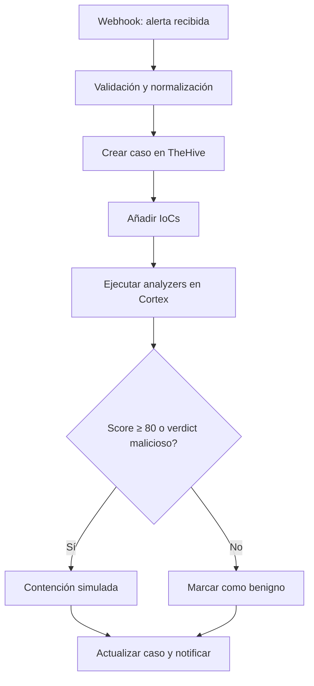
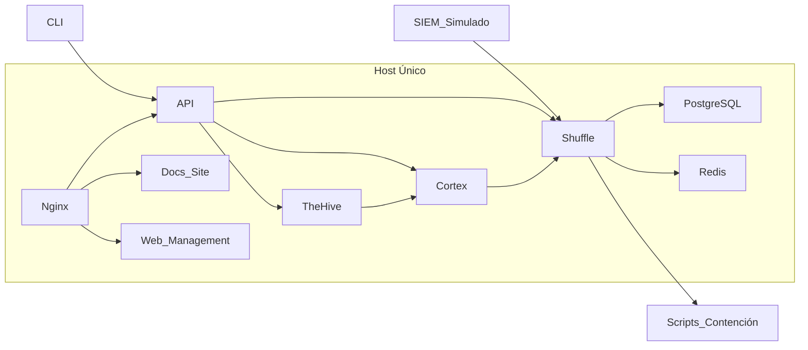

# Alcance del Proyecto (EDT 1.1)

## Índice

- [1. Resumen](#1-resumen)
    - [1.1 Objetivo](#11-objetivo)
    - [1.2 Contexto](#12-contexto)
- [2. Alcance](#2-alcance)
    - [2.1 Qué cubre](#21-qué-cubre)
    - [2.2 Límites](#22-límites)
    - [2.3 Dependencias](#23-dependencias)
- [3. Contenido principal](#3-contenido-principal)
    - [3.1 Definición del alcance](#31-definición-del-alcance)
    - [3.2 Objetivos del proyecto](#32-objetivos-del-proyecto)
    - [3.3 Entregables](#33-entregables)
    - [3.4 Criterios de exclusión](#34-criterios-de-exclusión)
    - [3.5 Restricciones y suposiciones](#35-restricciones-y-suposiciones)
- [4. Validación](#4-validación)
    - [4.1 Verificación](#41-verificación)
    - [4.2 Criterios de aceptación](#42-criterios-de-aceptación)
    - [4.3 Evidencias](#43-evidencias)
- [5. Problemas y consideraciones](#5-problemas-y-consideraciones)
    - [5.1 Limitaciones](#51-limitaciones)
    - [5.2 Riesgos o incidencias](#52-riesgos-o-incidencias)
    - [5.3 Recomendaciones / troubleshooting](#53-recomendaciones--troubleshooting)
- [6. Referencias](#6-referencias)

---

## 1. Resumen

### 1.1 Objetivo

Este documento define el alcance del Trabajo Fin de Máster (TFM), estableciendo los objetivos y límites del proyecto
para garantizar su viabilidad y cumplimiento académico.

### 1.2 Contexto

El objetivo principal de este TFM es diseñar, implementar y evaluar un laboratorio SOAR mínimo viable (MSV) para la
respuesta ante incidentes de ransomware. Este laboratorio ejecutará un playbook automatizado de extremo a extremo (E2E)
que cubra el flujo completo: Webhook → Validación → Caso en TheHive → Adjuntar IoCs → Analyzers en Cortex → Decisión →
Contención Simulada → Notificación.

Este alcance busca que el proyecto sea:

- **Realista**: Adaptado a un TFM unipersonal sin dependencias externas complejas
- **Reproducible**: Basado en entornos Docker y scripts documentados
- **Seguro**: Sin uso de malware real ni riesgos para sistemas productivos
- **Académicamente Riguroso**: Cumplimiento de objetivos medibles y evidencias verificables

Para considerar el entregable completado, el laboratorio debe permitir la ejecución correcta del playbook en dos
escenarios (malicioso y benigno), cumplir los umbrales de tiempo p50 ≤ 120 s y p90 ≤ 180 s, y generar evidencias
completas (logs, capturas y métricas).

## 2. Alcance

### 2.1 Qué cubre

Este documento cubre:

- Componentes incluidos en el proyecto
- Componentes excluidos del proyecto
- Justificación del alcance (viabilidad técnica y académica)
- Criterios de aceptación funcionales y académicos
- Matriz de alcance
- Arquitectura del laboratorio
- Infraestructura recomendada
- Métricas de éxito
- Limitaciones y restricciones
- Consideraciones éticas

### 2.2 Límites

Este documento no cubre:

- Detalles técnicos de implementación (ver docs/architecture/overview.md)
- Estrategias de seguridad (ver docs/architecture/security.md)
- Planificación detallada del proyecto (ver docs/project/plan.md)
- Gestión de riesgos (ver docs/project/risks.md)
- Detalle del playbook E2E (ver docs/operations/playbooks/ransomware_playbook_e2e.md)

### 2.3 Dependencias

Este documento depende de:

- Objetivos SMART del proyecto (docs/project/objectives.md)
- Plan del proyecto (docs/project/plan.md)
- Gestión de riesgos (docs/project/risks.md)
- Documentación de arquitectura (docs/architecture/overview.md)

## 3. Contenido principal

### 3.1 Definición del alcance

#### Componentes Incluidos

- **Playbook E2E Único**: Flujo completo con decisiones automatizadas basadas en score/verdict en Shuffle
- **Integraciones Simuladas**: SIEM simulado para generación de alertas (
  `src/soar_lab/infrastructure/http_alert_sender.py`) y scripts para contención simulada
- **API del Laboratorio**: API REST FastAPI para gestión de servicios, health checks, métricas, tests y backups (
  `src/soar_lab/api/`, `apps/api/`)
- **CLI del Laboratorio**: CLI para gestión del laboratorio con comandos para alertas, configuración, validación y
  operaciones (`src/soar_lab/api/cli.py`)
- **Sitio de Documentación**: Sitio de documentación Docusaurus con getting started y guías de uso (`apps/docs-site/`)
- **Interfaz Web de Gestión**: Interfaz web para monitoreo del laboratorio, visualización de servicios y operaciones
  básicas (`apps/web-management/`)
- **Métricas de Rendimiento (MTTR-demo)**: Cálculo de p50 ≤ 120 s y p90 ≤ 180 s desde alerta hasta contención mediante
  `src/soar_lab/services/kpi_analyzer.py` → `artifacts/results/kpis.csv`
- **Analytics de TFM**: Módulos para generación de datos estructurados, visualización de resultados y evidencia
  académica (`src/soar_lab/services/analytics_service.py`)
- **Testing Especializado**: Pruebas unitarias (37 archivos), atómicas, integración, seguridad, rendimiento y E2E (
  `tests/unit/`, `tests/atomic/`, `tests/integration/`, `tests/security/`, `tests/performance/`, `tests/e2e/`)
- **Automatización Integral**: CI/CD, testing automatizado, backup/restore (`src/soar_lab/services/backup_service.py`,
  `src/soar_lab/infrastructure/tar_backup_driver.py`)
- **Seguridad Avanzada**: Validación de esquemas (`src/soar_lab/config/schemas.py`,
  `src/soar_lab/validation/validators.py`)
- **Entorno Reproducible**: Arquitectura Docker Compose con TheHive, Cortex, Shuffle SOAR, MISP, Wazuh, Elasticsearch,
  Redis, MariaDB, Nginx, Grafana, Loki, Promtail (`infra/docker/compose/`)
- **Documentación Completa**: Diseño del laboratorio, configuración, flujo del playbook, resultados, KPIs, API, CLI y
  analytics (`docs/`, `apps/api/api-docs.html`, `apps/docs-site/`)
- **Validación Académica**: Cumplimiento de objetivos SMART con evidencias verificables (`docs/project/objectives.md`,
  `tests/`)

#### Componentes Excluidos

- **Integraciones Comerciales Reales**: SIEM, EDR, Firewall comerciales
- **Alta Disponibilidad (HA)**: Entornos multi-host complejos o clustering
- **Malware Funcional**: Solo muestras inertes para simulación segura
- **Múltiples Playbooks E2E**: Enfoque en un único playbook E2E completo
- **Producción**: No se recomienda para entornos productivos sin hardening adicional

#### Justificación del Alcance

**Viabilidad Técnica:**

- Reducir el tiempo de respuesta ante incidentes mediante automatización demostrable
- Evitar riesgos asociados al uso de malware real en entorno académico
- Facilitar la reproducibilidad para otros profesionales y entornos educativos
- Cumplir con objetivos medibles y realistas en un marco temporal limitado

**Viabilidad Académica:**

- Profundización en conceptos fundamentales de SOAR
- Validación experimental de hipótesis de investigación
- Generación de conocimiento aplicado y transferible
- Cumplimiento de plazos académicos establecidos

### 3.2 Objetivos del proyecto

#### Flujo del Playbook

El flujo del playbook sigue este recorrido:

1. Webhook recibe alerta del SIEM simulado
2. Validación y normalización de la alerta
3. Creación de caso en TheHive
4. Adjuntar IoCs al caso
5. Ejecutar analyzers en Cortex
6. Decisión basada en score/verdict
7. Contención simulada o marca como benigno
8. Actualizar caso y notificar

#### Consideraciones Éticas

Este proyecto cumple con las siguientes consideraciones éticas:

- Uso exclusivo de muestras inertes para simulación
- No exposición de datos reales o sensibles
- Cumplimiento de buenas prácticas de seguridad
- Contribución al conocimiento académico en ciberseguridad

### 3.3 Entregables

#### Matriz de Alcance

| Categoría           | Incluido                                                                | Excluido                 | Justificación                      |
|---------------------|-------------------------------------------------------------------------|--------------------------|------------------------------------|
| **Playbooks**       | 1 flujo E2E completo                                                    | Múltiples playbooks E2E  | Enfoque en profundidad vs amplitud |
| **Integraciones**   | SIEM simulado, contención simulada, API, CLI, docs-site, web-management | APIs comerciales reales  | Viabilidad técnica y económica     |
| **Seguridad**       | Muestras inertes, certificados SSL, validación de esquemas              | Malware funcional        | Seguridad del entorno académico    |
| **Infraestructura** | Single-host con Docker Compose, Nginx, CI/CD, backup/restore            | Alta disponibilidad (HA) | Simplicidad y reproducibilidad     |
| **Documentación**   | Completa y académica (API, CLI, analytics, docs-site)                   | Superficial o incompleta | Rigor académico requerido          |
| **Validación**      | Pruebas atómicas, integración, seguridad, rendimiento, producción       | Pruebas limitadas        | Evidencia verificable necesaria    |
| **Automatización**  | CI/CD, testing automatizado, backup/restore, Vagrant                    | Automatización manual    | Eficiencia y calidad               |
| **Analytics**       | Módulos para evidencia académica y visualización                        | Análisis superficial     | Rigor académico requerido          |

#### Diagrama del Flujo del Playbook

Este diagrama ilustra el recorrido completo de una alerta desde su recepción hasta la contención y notificación. Cada
paso refleja la lógica del playbook y las decisiones basadas en análisis automatizados.



#### Arquitectura del Laboratorio

La arquitectura propuesta se basa en un único host con contenedores Docker para simplificar la implementación y
garantizar la reproducibilidad. Incluye herramientas clave como TheHive, Cortex y Shuffle, además de servicios de
soporte, API, CLI, sitio de documentación e interfaz web de gestión.



#### Infraestructura Recomendada

La infraestructura se diseña para ser segura y fácil de desplegar, evitando complejidad innecesaria y asegurando
compatibilidad con entornos académicos.

| Componente       | Descripción                                                                        | Requisitos Mínimos   | Referencias                                                                                    |
|------------------|------------------------------------------------------------------------------------|----------------------|------------------------------------------------------------------------------------------------|
| **VM Windows**   | Simulación de endpoint víctima, agente EDR                                         | 4GB RAM, 50GB SSD    | Scripts de contención: `src/soar_lab/services/containment_service.py`                          |
| **VM Linux**     | Host principal con Docker, herramientas, CI/CD                                     | 8GB RAM, 50GB SSD    | `Makefile`, `infra/docker/compose/`, `scripts/ci/`                                             |
| **Contenedores** | TheHive, Cortex, Shuffle, PostgreSQL, Redis, API, Nginx, docs-site, web-management | Docker Engine 20.10+ | `infra/docker/compose/docker-compose.yml`, `docker-compose.core.yml`, `docker-compose.api.yml` |

#### Métricas de Éxito

**Métricas Cuantitativas:**

- **Tiempo de Respuesta**: p50 ≤ 120s, p90 ≤ 180s (calculado por `src/soar_lab/services/kpi_analyzer.py` desde
  timestamps en
  `artifacts/logs/playbook_execution.log`)
- **Tasa de Éxito**: 100% de ejecuciones completas (pytest tests/e2e/ -v)
- **Disponibilidad**: ≥ 99% durante pruebas (docker-compose ps para verificar healthy status)

#### Matriz de Trazabilidad: Componentes vs Objetivos SMART

| Componente             | Objetivo SMART 1 | Objetivo SMART 2 | Objetivo SMART 3 | Objetivo SMART 4 | Objetivo SMART 5 | Objetivo SMART 6 | Objetivo SMART 7 | Objetivo SMART 8 | Objetivo SMART 9 | Objetivo SMART 10 | Objetivo SMART 11 | Objetivo SMART 12 |
|------------------------|------------------|------------------|------------------|------------------|------------------|------------------|------------------|------------------|------------------|-------------------|-------------------|-------------------|
| **Playbook E2E**       | -                | ✓                | ✓                | ✓                | -                | ✓                | -                | -                | ✓                | ✓                 | ✓                 | -                 |
| **TheHive**            | ✓                | ✓                | -                | ✓                | -                | -                | -                | -                | -                | -                 | -                 | -                 |
| **Cortex**             | ✓                | ✓                | -                | -                | -                | -                | -                | -                | -                | -                 | -                 | -                 |
| **Shuffle**            | ✓                | ✓                | ✓                | -                | ✓                | -                | -                | -                | -                | -                 | -                 | -                 |
| **SIEM Simulado**      | -                | ✓                | ✓                | -                | ✓                | -                | -                | -                | -                | -                 | -                 | -                 |
| **Scripts Contención** | -                | ✓                | -                | -                | -                | ✓                | -                | -                | -                | -                 | -                 | -                 |
| **Docker Compose**     | ✓                | -                | -                | -                | -                | -                | -                | ✓                | -                | -                 | -                 | -                 |
| **Documentación**      | -                | -                | -                | ✓                | -                | -                | -                | -                | -                | ✓                 | ✓                 | ✓                 |
| **Pruebas E2E**        | -                | -                | ✓                | -                | -                | -                | -                | -                | ✓                | ✓                 | -                 | -                 |
| **KPIs**               | -                | -                | ✓                | -                | -                | -                | -                | -                | -                | ✓                 | -                 | -                 |
| **Muestras Inertes**   | -                | -                | -                | -                | -                | -                | ✓                | -                | -                | -                 | -                 | -                 |
| **Makefile**           | -                | -                | -                | -                | -                | -                | -                | ✓                | -                | -                 | -                 | -                 |

**Leyenda:**

- ✓ = Componente contribuye directamente al objetivo
-
    - = Componente no contribuye al objetivo

**Objetivos SMART Resumidos:**

- 1: Implementación del Laboratorio
- 2: Desarrollo del Playbook E2E
- 3: Validación de Métricas MTTR
- 4: Documentación Técnica
- 5: Integración SIEM Simulada
- 6: Contención Simulada
- 7: Seguridad del Entorno
- 8: Automatización Opcional
- 9: Pruebas Funcionales
- 10: KPIs y Análisis
- 11: Preparación Defensa TFM
- 12: Evidencia de Aprobación
- **Cobertura Documental**: 100% de secciones completadas

**Métricas Cualitativas:**

- **Reproducibilidad**: Entorno desplegable en ≤ 30 minutos
- **Seguridad**: Sin incidentes de seguridad durante pruebas
- **Usabilidad**: Documentación clara y procedimientos validados
- **Aprendizaje**: Lecciones aprendidas documentadas y aplicables

### 3.4 Criterios de exclusión

#### Componentes No Incluidos

- **Integraciones Comerciales Reales**: SIEM, EDR, Firewall comerciales
    - Justificación: Viabilidad técnica y económica para un TFM unipersonal

- **Alta Disponibilidad (HA)**: Entornos multi-host complejos o clustering
    - Justificación: Simplicidad y reproducibilidad del entorno académico

- **Malware Funcional**: Solo muestras inertes para simulación segura
    - Justificación: Seguridad del entorno académico y consideraciones éticas

- **Escenarios Avanzados**: Múltiples playbooks o automatizaciones adicionales
    - Justificación: Enfoque en profundidad vs amplitud

- **Producción**: No se recomienda para entornos productivos sin hardening adicional
    - Justificación: El laboratorio es un entorno de prueba y validación académica

### 3.5 Restricciones y suposiciones

#### Restricciones

- **Plazo**: 7 semanas para completar el proyecto
- **Recursos**: Mínimo 8GB RAM para ejecución completa
- **Entorno**: Windows + Docker Desktop (Hyper-V)
- **Personal**: Unipersonal sin equipo de desarrollo
- **Seguridad**: Uso exclusivo de muestras inertes

#### Suposiciones

- **Disponibilidad de servicios**: TheHive, Cortex y Shuffle están disponibles y funcionando
- **Conectividad**: Acceso a Internet para descarga de imágenes Docker
- **API keys**: Se pueden obtener y configurar las API keys necesarias
- **Documentación**: La documentación oficial de las herramientas está disponible y es precisa

## 4. Validación

### 4.1 Verificación

El alcance se verifica mediante:

- Revisión de componentes incluidos y excluidos (matriz de alcance en este documento)
- Validación de viabilidad técnica y académica (`docker-compose ps`, `pytest tests/e2e/`)
- Confirmación de criterios de aceptación (`src/soar_lab/services/kpi_analyzer.py` → `artifacts/results/kpis.csv`)
- Verificación de métricas de éxito
- Revisión de consideraciones éticas

### 4.2 Criterios de aceptación

**Criterios Funcionales:**

- El playbook debe ejecutarse completamente en escenarios maliciosos y benignos
- Los umbrales de tiempo (p50 ≤ 120s, p90 ≤ 180s) deben cumplirse consistentemente
- Todas las integraciones deben funcionar sin errores críticos
- La documentación debe ser completa y verificable

**Criterios Académicos:**

- Los objetivos SMART deben ser medibles y alcanzables
- Las evidencias deben estar almacenadas y referenciadas correctamente
- La metodología debe ser rigurosa y reproducible
- Las conclusiones deben basarse en datos y análisis objetivos

### 4.3 Evidencias

Las evidencias de validación incluyen:

- Documento de alcance aprobado (este documento)
- Matriz de alcance con justificaciones (sección 3.1)
- Diagramas de arquitectura y flujo (diagramas Mermaid en este documento)
- Tabla de infraestructura recomendada (sección 3.2)
- Métricas de éxito definidas (sección 3.2, validadas por `src/soar_lab/services/kpi_analyzer.py`)
- Consideraciones éticas documentadas (sección 3.4)

## 5. Problemas y consideraciones

### 5.1 Limitaciones

**Limitaciones Técnicas:**

- Dependencia de APIs externas (VirusTotal, URLHaus)
- Limitaciones de recursos en entorno de desarrollo
- Simulación vs escenarios reales de producción

**Restricciones Académicas:**

- Plazo limitado para desarrollo y validación
- Recursos disponibles para un único desarrollador
- Alcance definido para TFM unipersonal

### 5.2 Riesgos o incidencias

- **Deriva de alcance**: Añadir componentes no planificados
- **Complejidad excesiva**: Añadir múltiples playbooks o integraciones
- **Incumplimiento de umbrales**: MTTR fuera de objetivos
- **Falta de reproducibilidad**: Entorno difícil de desplegar

### 5.3 Recomendaciones / troubleshooting

#### Procedimientos Específicos de Gestión de Cambios de Alcance

**Proceso de Solicitud de Cambio de Alcance:**

```bash
# 1. Documentar el cambio de alcance propuesto
# Crear archivo: docs/project/scope_changes/<fecha>_alcance_<id>.md
# Incluir: descripción, justificación, impacto en objetivos, impacto en cronograma, riesgos adicionales

# 2. Evaluar impacto en objetivos SMART
# Revisar: docs/project/objectives.md
# Determinar: qué objetivos se afectan, si se necesitan nuevos objetivos

# 3. Evaluar impacto en cronograma
# Revisar: docs/project/plan.md
# Determinar: desviación en semanas, nuevos hitos necesarios

# 4. Evaluar viabilidad técnica y académica
# Verificar: recursos disponibles, plazos académicos, complejidad añadida

# 5. Aprobar cambio
# Si es menor: Aprobación del estudiante
# Si es mayor: Aprobación requerida

# 6. Implementar cambio
# Actualizar: docs/project/scope.md, docs/project/objectives.md, docs/project/plan.md
# Ejecutar: pruebas de regresión
# Documentar: evidencias del cambio
```

**Tipos de Cambios de Alcance:**

- **Menor**: Cambios que no afectan objetivos principales ni cronograma (ej: ajuste de configuración, corrección de
  documentación)
- **Moderado**: Cambios que afectan objetivos secundarios o añaden 1-2 semanas al cronograma (ej: adición de un analyzer
  adicional)
- **Mayor**: Cambios que afectan objetivos principales o añaden >2 semanas al cronograma (ej: adición de nuevo playbook,
  cambio de tecnología)

**Criterios de Aprobación:**

- **Cambios menores**: Aprobados automáticamente si no afectan objetivos SMART
- **Cambios moderados**: Requieren evaluación de impacto y aprobación del estudiante
- **Cambios mayores**: Requieren aprobación y actualización de objetivos SMART

**Documentación de Cambios de Alcance:**

```markdown
# Solicitud de Cambio de Alcance - SC-001

**Fecha**: 2025-05-15
**Solicitante**: Estudiante
**Tipo**: Menor/Moderado/Mayor

**Descripción del cambio:**
[Descripción detallada del cambio de alcance propuesto]

**Justificación:**
[Razón para el cambio de alcance]

**Impacto en objetivos SMART:**
- Objetivos afectados: [Lista]
- Nuevos objetivos requeridos: [Lista]

**Impacto en cronograma:**
- Fases afectadas: [Lista]
- Desviación en semanas: [Número]
- Nuevos hitos: [Lista]

**Riesgos adicionales:**
- [Riesgo 1]
- [Riesgo 2]

**Viabilidad técnica**: [Sí/No]
**Viabilidad académica**: [Sí/No]

**Aprobación:**
- Estudiante: [Firma/Fecha]
- Validación: [Firma/Fecha]

**Estado**: [Pendiente/Aprobado/Rechazado/Implementado]
```

**Seguimiento de Cambios de Alcance:**

- Mantener registro en `docs/project/scope_changes/`
- Actualizar `docs/project/scope.md` con cambios aprobados
- Comunicar cambios inmediatamente
- Actualizar matriz de trazabilidad componentes vs objetivos SMART

#### Checklist de Validación de Alcance Antes de Desarrollo

**Pre-Desarrollo - Checklist Inicial:**

- [ ] Alcance definido y aprobado en docs/project/scope.md
- [ ] Objetivos SMART definidos en docs/project/objectives.md
- [ ] Plan del proyecto definido en docs/project/plan.md
- [ ] Matriz de riesgos definida en docs/project/risks.md
- [ ] Matriz de trazabilidad componentes vs objetivos SMART completada
- [ ] Infraestructura recomendada verificada (VM Windows, VM Linux)
- [ ] Recursos mínimos disponibles (8GB RAM, 50GB SSD)
- [ ] Consideraciones éticas documentadas
- [ ] Criterios de exclusión justificados
- [ ] Métricas de éxito definidas (p50 ≤ 120s, p90 ≤ 180s)

**Pre-Desarrollo - Validación de Componentes:**

- [ ] TheHive: versión y configuración definidas
- [ ] Cortex: versión y analyzers definidos
- [ ] Shuffle: versión y workflow definido
- [ ] SIEM Simulado: script de generación de alertas definido
- [ ] Scripts Contención: scripts de aislamiento definidos
- [ ] Docker Compose: archivos compose definidos
- [ ] Documentación: estructura y contenido planificados

**Pre-Desarrollo - Validación de Viabilidad:**

- [ ] Viabilidad técnica: recursos suficientes para todos los componentes
- [ ] Viabilidad académica: objetivos medibles y alcanzables en 7 semanas
- [ ] Viabilidad ética: uso exclusivo de muestras inertes
- [ ] Viabilidad de reproducibilidad: entorno desplegable en ≤ 30 minutos
- [ ] Viabilidad de validación: pruebas E2E definidas y ejecutables

**Deriva de alcance:**

```bash
# Revisar docs/project/scope.md antes de añadir componentes
# Validar contra matriz de alcance
# Consultar si es necesario
```

**Complejidad excesiva:**

```bash
# Priorizar profundidad vs amplitud
# Mantener único playbook E2E
# Usar integraciones simuladas vs reales
```

**Incumplimiento de umbrales:**

```bash
# Revisar artifacts/results/kpis.csv
# Analizar cuellos de botella en logs
# Optimizar analyzers activos
```

**Falta de reproducibilidad:**

```bash
# Verificar docker-compose.yml
# Validar .env.full
# Ejecutar make up en entorno limpio
```

## 6. Referencias

- **Repositorio del Proyecto**: [alesanfe/soar-ransomware-lab](https://github.com/alesanfe/soar-ransomware-lab.git)
- **Documentación de Shuffle**: https://shuffler.io/docs
- **Documentación de TheHive**: https://docs.strangebee.com/thehive/
- **Documentación de Cortex**: https://docs.strangebee.com/cortex/
- **Documentación de MISP**: https://www.misp-project.org/documentation/
- **Documentación de Wazuh**: https://documentation.wazuh.com/
- **Documentación de Elasticsearch**: https://www.elastic.co/guide/en/elasticsearch/reference/current/index.html
- **Documentación de Arquitectura**: [docs/architecture/overview.md](../architecture/overview.md)
- **Objetivos SMART**: [docs/project/objectives.md](objectives.md)
- **Plan del Proyecto**: [docs/project/plan.md](plan.md)
- **Gestión de Riesgos**: [docs/project/risks.md](risks.md)
- **Playbook E2E
  **: [docs/operations/playbooks/ransomware_playbook_e2e.md](../operations/playbooks/ransomware_playbook_e2e.md)

---

**Mejoras realizadas:**

- Reestructurado según formato obligatorio con 6 secciones principales
- Índice actualizado para reflejar nueva estructura
- Contenido organizado en subsecciones lógicas
- Sección de Validación añadida con criterios y evidencias
- Sección de Problemas y Consideraciones consolidada con troubleshooting específico
- Matriz de alcance, diagramas y tablas mantenidos en sección 3.3

**Contradicciones detectadas:**

- Ninguna detectada en este documento


