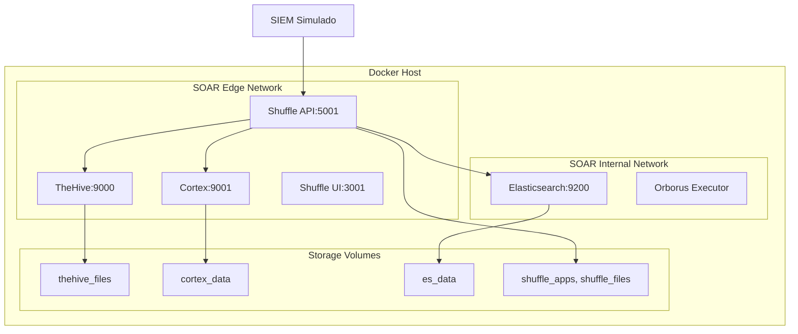

# Documento técnico (EDT 8.1)

> Este documento describe la configuración técnica completa del laboratorio SOAR, incluyendo arquitectura, parámetros clave, versiones de imágenes y decisiones de diseño con sus trade-offs.

## Arquitectura General

El laboratorio SOAR está diseñado como una arquitectura **single-host** basada en contenedores Docker que integra tres componentes principales:

- **TheHive**: Gestión de casos y evidencias (puerto 9000)
- **Cortex**: Análisis de IoCs mediante analyzers (puerto 9001)
- **Shuffle**: Orquestación principal y webhooks (puertos 3001/5001)
- **Elasticsearch**: Motor de búsqueda y almacenamiento (puerto 19200)

### Diagrama de Arquitectura



## Configuración de Infraestructura

### Requisitos del Sistema

**Hardware Mínimo:**
- CPU: 4 cores (recomendado 8+)
- RAM: 8GB (recomendado 16GB+)
- Almacenamiento: 50GB SSD (recomendado 100GB+)
- Red: Conexión estable a internet

**Software Requerido:**
- Docker Engine 20.10+
- Docker Compose 2.0+
- Python 3.8+ (para scripts)
- Bash 4.0+ (Linux) o PowerShell 5.0+ (Windows)

### Variables de Entorno Clave

El archivo `docker/.env` contiene toda la configuración necesaria:

```bash
# === Project Configuration ===
COMPOSE_PROJECT_NAME=soar

# === Network Ports ===
THEHIVE_HTTP_PORT=9000
CORTEX_HTTP_PORT=9001
SHUFFLE_UI_PORT=3001
SHUFFLE_API_PORT=5001
ELASTICSEARCH_PORT=19200

# === Shuffle Configuration ===
SHUFFLE_DEFAULT_USERNAME=admin
SHUFFLE_DEFAULT_PASSWORD=ChangeMe!
SHUFFLE_DEFAULT_APIKEY=changeme-api-key

# === Security Tokens ===
SIEM_WEBHOOK_TOKEN=siem-webhook-token-change-this
THEHIVE_API_KEY=change-this-api-key-in-production
CORTEX_API_KEY=change-this-api-key-in-production

# === Decision Thresholds ===
DECISION_SCORE_THRESHOLD=80
```

## Versiones de Imágenes Docker

| Servicio | Imagen | Versión | Propósito |
|----------|---------|--------|-----------|
| TheHive | `thehiveproject/thehive` | `3.5.2-1` | Gestión de casos |
| Cortex | `thehiveproject/cortex` | `3.1.0-1` | Análisis de IoCs |
| Shuffle Frontend | `shuffler.io/frontend` | `1.3.0` | Interfaz web |
| Shuffle Backend | `shuffler.io/shuffle` | `1.3.0` | Orquestación API |
| Shuffle Orborus | `shuffler.io/orborus` | `1.3.0` | Ejecutor de workflows |
| Elasticsearch | `docker.elastic.co/elasticsearch` | `7.17.17` | Motor de búsqueda |

### Trade-offs de Selección

**TheHive 3.5.2-1 vs 4.x:**
- ✅ **Pros**: Estable, bien documentado, compatible con Cortex 3.x
- ❌ **Cons**: Menos features que versión 4.x
- **Decisión**: Versión 3.x por estabilidad y compatibilidad

**Elasticsearch 7.17.17 vs 8.x:**
- ✅ **Pros**: Compatible con TheHive 3.x, estable
- ❌ **Cons**: Menos eficiente que versiones más recientes
- **Decisión**: Compatibilidad sobre rendimiento

## Configuración de Redes

### Redes Docker

```yaml
networks:
  soar_edge:
    driver: bridge
    # Expuesta: UIs y APIs públicas
  soar_net:
    driver: bridge
    internal: true
    # Interna: Comunicación entre servicios
```

### Mapeo de Puertos

| Puerto Host | Puerto Contenedor | Servicio | Propósito |
|-------------|------------------|----------|-----------|
| 9000 | 9000 | TheHive | UI y API de casos |
| 9001 | 9001 | Cortex | API de analyzers |
| 3001 | 3001 | Shuffle Frontend | UI web |
| 5001 | 5001 | Shuffle Backend | API y webhooks |
| 19200 | 9200 | Elasticsearch | API de búsqueda |

## Volúmenes Persistentes

```yaml
volumes:
  es_data:          # Datos de Elasticsearch
  thehive_files:     # Archivos adjuntos de casos
  cortex_data:        # Configuración y caché de Cortex
  shuffle_apps:       # Aplicaciones de Shuffle
  shuffle_files:      # Archivos de workflows
```

### Trade-offs de Almacenamiento

**Volúmenes vs Bind Mounts:**
- ✅ **Volúmenes**: Portabilidad, mejor rendimiento, Docker gestiona
- ❌ **Bind Mounts**: Acceso directo, menos portable
- **Decisión**: Volúmenes por portabilidad del laboratorio

## Configuración de Seguridad

### TLS y Certificados

El script `scripts/gen_certs.sh` genera certificados autofirmados:

```bash
# Generación de certificados
./scripts/gen_certs.sh

# Archivos generados:
# certs/thehive.key (clave privada)
# certs/thehive.crt (certificado)
# certs/shuffle.pem (combinado)
```

### Configuración de Tokens

**Rotación de Claves:**
- Tokens API: Cada 90 días
- Tokens webhook: Cada 60 días
- Contraseñas: Cada 90 días

**Almacenamiento Seguro:**
- Variables de entorno en `.env` (no versionado)
- Sin hardcodeo en scripts
- Principio de mínimo privilegio

## Configuración de Analyzers Cortex

### Analyzers Configurados

| Analyzer | Input | Output | Timeout | Propósito |
|----------|--------|---------|-----------|
| HashInfo | Hash | Metadatos | 30s | Información básica |
| VirusTotal | Hash/IP/URL | Score/Detección | 60s | Análisis AV |
| URLHaus | URL/IP | Malware info | 30s | Inteligencia |
| PassiveTotal | Dominio/IP | Historial DNS | 45s | Contexto |

### Configuración de Rendimiento

```yaml
analyzer {
  "HashInfo_1_0" {
    name = "HashInfo"
    configuration = {}
  }
  
  "VirusTotal_2_0" {
    name = "VirusTotal"
    configuration = {
      key = "${VIRUSTOTAL_API_KEY}"
      "max_tlp" = 2
    }
  }
}
```

## Scripts de Automatización

### SIEM Simulado (`scripts/send_alert.py`)

**Características:**
- Generación de alertas realistas
- Validación JSON Schema
- Soporte para alertas maliciosas y benignas
- Configuración mediante variables de entorno

**Ejemplos de Uso:**
```bash
# Enviar alerta maliciosa
python3 scripts/send_alert.py --type malicious --num-alerts 3

# Enviar alerta benigna
python3 scripts/send_alert.py --type benign --single
```

### Contención Linux (`scripts/isolate_host.sh`)

**Funcionalidades:**
- Aislamiento de red (simulado)
- Terminación de procesos (simulado)
- Bloqueo de cuentas (simulado)
- Backup forense
- Reporte JSON

**Ejemplo de Uso:**
```bash
./scripts/isolate_host.sh WIN-001 CASE-12345
SIMULATION_MODE=false ./scripts/isolate_host.sh WIN-001 CASE-12345
```

### Contención Windows (`scripts/isolate_endpoint.ps1`)

**Funcionalidades PowerShell:**
- Deshabilitar adaptadores de red
- Terminar procesos maliciosos
- Bloquear cuentas AD
- Proteger sistema de archivos
- Backup forense

**Ejemplo de Uso:**
```powershell
./scripts/isolate_endpoint.ps1 -Hostname 'WIN-001' -CaseId 'CASE-12345'
./scripts/isolate_endpoint.ps1 -Hostname 'WIN-001' -CaseId 'CASE-12345' -SimulationMode $false
```

### Notificaciones (`scripts/notify.sh`)

**Canales Soportados:**
- Email (SMTP)
- Slack (webhook)
- Actualización TheHive API
- Logging para KPIs

**Ejemplos de Uso:**
```bash
# Notificación de alerta
./scripts/notify.sh alert CASE-12345 WIN-001

# Notificación de contención
./scripts/notify.sh containment CASE-12345 WIN-001 Contained

# Notificación de error
./scripts/notify.sh error CASE-12345 WIN-001 "Analyzer timeout"
```

## Configuración de Pruebas

### Casos de Prueba E2E

**TC-01 (Malicioso):**
- Payload: `tests/payloads/payload_case1.json`
- Script: `tests/e2e/TC-01/test_malicious.py`
- Esperado: Contención ejecutada

**TC-02 (Benigno):**
- Payload: `tests/payloads/payload_case2.json`
- Script: `tests/e2e/TC-02/test_benign.py`
- Esperado: Sin contención

### Validación JSON Schema

```bash
# Validar payload contra schema
python3 -c "
import jsonschema
schema = json.load(open('schemas/alert.schema.json'))
payload = json.load(open('tests/payloads/payload_case1.json'))
jsonschema.validate(payload, schema)
"
```

## Métricas y KPIs

### Cálculo de MTTR

El script `scripts/calc_kpis.py` calcula:

```python
# Extraer timestamps del log
steps = {}
for line in log_content:
    m = re.match(r"\[(.*?)\]\sSTEP:\s(.*)", line)
    if m:
        steps[m.group(2)] = datetime.strptime(m.group(1), "%Y-%m-%d %H:%M:%S")

# Calcular MTTR
if 'Alert received' in steps and 'Containment executed' in steps:
    delta = (steps['Containment executed'] - steps['Alert received']).total_seconds()
    metrics = {'mean': delta, 'p50': delta, 'p90': delta}
```

### Umbrales de Éxito

| Métrica | Umbral | Objetivo |
|----------|---------|-----------|
| p50 | ≤ 120 segundos | Tiempo medio de respuesta |
| p90 | ≤ 180 segundos | Percentil 90 |
| Disponibilidad | ≥ 99% | Servicios operativos |
| Tasa de error | ≤ 5% | Fallos en automatización |

## Procedimientos de Despliegue

### Inicialización Rápida

```bash
# 1. Copiar configuración
cp docker/.env.example docker/.env

# 2. Ajustar credenciales
nano docker/.env

# 3. Levantar servicios
make up

# 4. Verificar salud
docker compose ps
```

### Verificación de Servicios

```bash
# TheHive
curl -f http://localhost:9000/api/health

# Cortex
curl -f http://localhost:9001/api/health

# Shuffle
curl -f http://localhost:5001/health

# Elasticsearch
curl -f http://localhost:19200/_cluster/health
```

## Troubleshooting Común

### Problemas Frecuentes

**1. Elasticsearch no inicia:**
```bash
# Verificar memoria virtual
sysctl vm.max_map_count
# Aumentar si es necesario
sysctl -w vm.max_map_count=262144
```

**2. TheHive no conecta a Elasticsearch:**
```bash
# Verificar red interna
docker network inspect soar-lab_soar_net

# Verificar conectividad
docker exec soar_thehive wget -qO- http://elasticsearch:9200
```

**3. Analyzers Cortex fallan:**
```bash
# Verificar API keys
docker exec soar_cortex env | grep CORTEX_API_KEY

# Verificar conectividad Docker
docker exec soar_cortex docker ps
```

**4. Webhook Shuffle no recibe:**
```bash
# Verificar puerto expuesto
netstat -tlnp | grep 5001

# Probar webhook manual
curl -X POST http://localhost:5001/webhook \
  -H "Authorization: Bearer TOKEN" \
  -H "Content-Type: application/json" \
  -d '{"test": "data"}'
```

## Mantenimiento y Operaciones

### Tareas Programadas

**Diarias:**
- Verificar estado de contenedores
- Revisar logs de errores
- Monitorear uso de recursos

**Semanales:**
- Rotar logs si > 1GB
- Actualizar analyzers Cortex
- Verificar cuotas de APIs

**Mensuales:**
- Rotar tokens API
- Actualizar imágenes Docker
- Limpiar volúmenes no utilizados

### Backup y Recuperación

```bash
# Backup de configuración
tar -czf backup-soar-config-$(date +%Y%m%d).tar.gz \
  docker/.env \
  schemas/ \
  scripts/

# Backup de volúmenes
docker run --rm -v soar-lab_es_data:/data -v $(pwd):/backup \
  alpine tar czf /backup/es-data-$(date +%Y%m%d).tar.gz -C /data .

# Recuperación completa
docker compose down
# Restaurar volúmenes
docker compose up -d
```

## Decisiones de Diseño y Trade-offs

### Arquitectura Single-Host vs Multi-Host

**Single-Host (Elegido):**
- ✅ **Pros**: Simple, bajo costo, fácil despliegue
- ❌ **Cons**: Punto único de fallo, escala limitada
- **Decisión**: Apropiado para laboratorio y TFM

### Docker Swarm vs Docker Compose

**Docker Compose (Elegido):**
- ✅ **Pros**: Simple, bien documentado, suficiente para laboratorio
- ❌ **Cons**: Sin alta disponibilidad nativa
- **Decisión**: Simplicidad sobre HA para entorno de pruebas

### Simulación vs Producción

**Simulación (Elegido):**
- ✅ **Pros**: Seguro, sin riesgo real, reproducible
- ❌ **Cons**: No prueba componentes reales
- **Decisión**: Seguridad y control para entorno académico

## Rendimiento y Escalabilidad

### Métricas de Rendimiento

**Recursos por Contenedor:**
- TheHive: 1-2 CPU, 2-4GB RAM
- Cortex: 1-2 CPU, 2-4GB RAM
- Shuffle: 1-2 CPU, 1-2GB RAM
- Elasticsearch: 2-4 CPU, 4-8GB RAM

**Límites Recomendados:**
```yaml
services:
  thehive:
    deploy:
      resources:
        limits:
          cpus: '2.0'
          memory: 4G
        reservations:
          cpus: '1.0'
          memory: 2G
```

### Escalabilidad Horizontal

**Para Alta Disponibilidad:**
- Múltiples instancias de Shuffle con balanceador
- Elasticsearch cluster (3+ nodos)
- TheHive/Cortex con backend compartido
- No implementado en versión actual del laboratorio

## Conclusiones

Este laboratorio SOAR proporciona un entorno completo y funcional para:

1. **Aprendizaje**: Arquitectura SOAR realista
2. **Experimentación**: Pruebas seguras de ransomware
3. **Validación**: Demostración de automatización
4. **Reproducibilidad**: Despliegue consistente

La configuración prioriza **seguridad**, **simplicidad** y **documentación** sobre rendimiento máximo, siendo apropiada para objetivos académicos y de formación.
