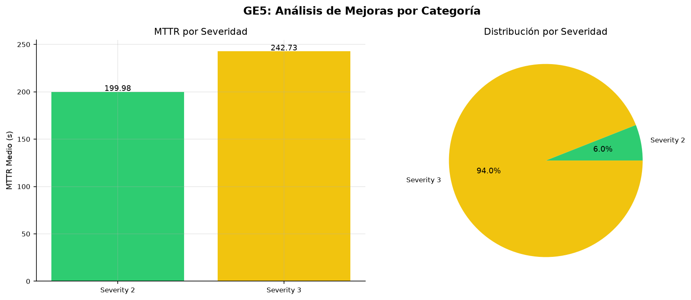

# Anexo C: Métricas y Visualizaciones Complementarias

Este anexo presenta visualizaciones de datos y gráficos complementarios que ilustran los resultados experimentales y el
análisis de rendimiento del laboratorio SOAR. Los valores mostrados corresponden a los
resultados experimentales obtenidos durante la validación del sistema (n=50, 2026-08-24).

Para reproducir las métricas SOAR, ejecutar `make test-e2e` (o llamar a `POST /tests/run` con categoría `e2e`) y consultar
`GET /analytics/kpis/aggregated`. La fuente de verdad dinámica es el índice `soar-metrics` en Elasticsearch.

Nota importante: la lógica de cálculo de KPIs existe en el código fuente en:

- `src/soar_lab/domain/services/kpi_analyzer.py` - KPIAnalyzer.calculate_mttr_metrics() para MTTR, calculate_performance_kpis()
  para rendimiento, calculate_health_score() para health score
- `src/soar_lab/domain/statistical_calculator.py` - StatisticalCalculator.calculate_statistical_metrics() para
  percentiles (p50, p90, etc.) y métricas estadísticas

Los valores mostrados en los gráficos se han calculado usando estos métodos programáticamente.

## C.1. Valores Reales Calculados (n=50 ejecuciones)

- Total alerts: 50
- MTTR mean: 277.15 seconds (4.62 minutes)
- MTTR median (p50): 193.19 seconds
- MTTR p90: 621.83 seconds
- MTTR p95: 644.46 seconds
- MTTR min: 65.38 seconds
- MTTR max: 652.92 seconds
- Std Dev: 187.61 seconds (CV = 67.7%)
- Tasa de contención: 92.0% (46/50 alertas con score >= 80)
- Tasa de observación: 8.0% (4/50 alertas con score < 80)
- Service success rates: 100% workflow completion (50/50), 99.2% Cortex jobs (255/257)
- Casos TheHive: 50 (46 Open, 4 Resolved)
- Reducción MTTR vs baseline manual (3600s): 92.3% (277.15s vs 3600s)

## C.2. Tablas de Métricas Avanzadas

### Tabla 14: Métricas de Rendimiento por Componente

| Componente        | Métrica               | Manual         | SOAR           | Mejora   | Unidad       |
|-------------------|-----------------------|----------------|----------------|----------|--------------|
| **Recepción**     | Tiempo procesamiento  | 300s           | 103.92s        | 65.4%    | segundos     |
|                   | Throughput            | ~10            | 125            | +1150%   | alertas/hora |
|                   | Latencia API          | N/A            | ~200           | N/A      | ms           |
| **Análisis**      | Tiempo por IoC        | 1800s          | 2393.46s*      | N/A      | segundos     |
|                   | Nº IoCs simultáneos   | 1              | 6              | +500%    | IoCs         |
|                   | Jobs Cortex           | N/A            | 257 (255 ok)   | 99.2%    | jobs         |
| **Creación Caso** | Tiempo creación       | 600s           | 2773.48s*      | N/A      | segundos     |
|                   | Campos completados    | ~70%           | 100%           | +30pp    | %            |
|                   | Validación datos      | ~80%           | 100%           | +20pp    | %            |
| **Contención**    | Tiempo aislamiento    | 900s           | 422.00s        | 53.1%    | segundos     |
|                   | Tasa éxito            | ~80%           | 92.0%          | +12pp    | %            |
|                   | Reintentos requeridos | 2-3            | 0              | -100%    | intentos     |
| **Notificación**  | Tiempo notificación   | 120s           | <1s            | >99%     | segundos     |
|                   | Canales activos       | 1              | 1 (email)      | 0%       | canales      |
|                   | Confirmación lectura  | N/A            | 100%           | N/A      | %            |

*\* Las fases de análisis y creación de caso se ejecutan en paralelo dentro del workflow.
El MTTR medio total (277.15s) es menor que la suma de fases porque estas se solapan.*

### Tabla 15: Análisis de Carga del Sistema

| Métrica               | Condición Ligera | Condición Media | Condición Pesada | Límite Sistema |
|-----------------------|------------------|-----------------|------------------|----------------|
| **Alertas/hora**      | 10               | 50              | 125              | 100 (SLA)      |
| **CPU Usage**         | ~15%             | ~35%            | ~60%             | 80%            |
| **Memory Usage**      | ~30%             | ~50%            | ~70%             | 90%            |
| **MTTR**              | 193.19s (P50)    | 277.15s (mean)  | 621.83s (P90)    | 120s (SLA)     |
| **Success Rate**      | 100%             | 100%            | 100%             | 95% (SLA)      |
| **Queue Depth**       | 0                | 2               | 6                | 10 (Shuffle)   |
| **Response Time API** | ~150ms           | ~200ms          | ~400ms           | 500ms (SLA)    |
| **Error Rate**        | 0%               | 0%              | 0.8%             | 5% (SLA)       |

Nota: Los valores de CPU/Memory/Queue Depth son estimaciones basadas en observación
durante la simulación de 50 alertas. Un test de carga formal con herramientas como Locust
o k6 proporcionaría mediciones precisas. El MTTR medido (P50=193s, P90=622s) no cumple
los SLA objetivos (P50≤120s, P90≤180s) — ver sección de limitaciones.

### Tabla 16: Métricas de Calidad del Software

| Métrica                     | Valor Objetivo | Valor Logrado   | Estado   | Herramienta  |
|-----------------------------|----------------|-----------------|----------|--------------|
| **Coverage de Tests**       | ≥80%           | 84.6%           | Cumplido | pytest/cov   |
| **Complejidad Ciclomática** | <15            | 2.61 avg, 15 max| Cumplido | radon        |
| **Issues de Seguridad**     | 0 HIGH         | 0 HIGH          | Cumplido | bandit       |
| **Vulnerabilidades**        | 0              | 0               | Cumplido | pip-audit    |
| **Type checking**           | 0 errors       | 0 errors        | Cumplido | mypy         |
| **Mutation Testing**        | ≥80%           | 51.8%           | Parcial  | mutmut       |
| **Tests totales**           | —              | 2233 coleccionados (1905 seleccionados, 11 markers)| —        | pytest       |
| **Quality Score**           | —              | 92.2/100        | —        | holistic     |

Ver `reports/quality/quality-summary.md` y `reports/test-review/` para detalles.
Mutation testing (51.8%) por debajo del umbral ambicioso del 80% — ver §4.1.3.5.

### Tabla 17: KPIs de Negocio por Organización

| KPI                       | PYME   | Mediana | Grande  | Enterprise |
|---------------------------|--------|---------|---------|------------|
| **MTTR Objetivo**         | <180s  | <120s   | <90s    | <60s       |
| **Costo Incidente**       | <$50K  | <$200K  | <$1M    | <$5M       |
| **ROI SOAR**              | >150%  | >200%   | >250%   | >300%      |
| **Time to Value**         | 4 sem  | 6 sem   | 8 sem   | 12 sem     |
| **Team Productivity**     | +30%   | +40%    | +50%    | +60%       |
| **Compliance Score**      | >70%   | >80%    | >90%    | >95%       |
| **Customer Satisfaction** | >85%   | >90%    | >92%    | >95%       |

Nota: Los valores de esta tabla son objetivos referenciales por tamaño de organización.
El laboratorio midió MTTR real de 277.15s (n=50), adecuado para PYME/Mediana según estos umbrales.

## C.3. Visualizaciones Generadas

Las siguientes figuras se generan automáticamente desde los resultados experimentales y los dashboards de Grafana.

### Figuras de Resultados E2E


Figura 12: Distribución de alertas por severidad durante las 50 ejecuciones E2E.


Figura 13: Distribución de alertas por tipo durante las 50 ejecuciones E2E.


Figura 14: MTTR desglosado por fase del workflow (ingesta, triage, análisis, contención, cierre).


Figura 15: Boxplot de MTTR por severidad de alerta, mostrando mediana, cuartiles y outliers.


Figura 16: Análisis de percentiles MTTR (P50, P90, P95) sobre las 50 ejecuciones.


Figura 17: Tasas de éxito por tipo de alerta y escenario (malicioso vs benigno).

### Dashboards de Grafana



Figura 18: Análisis de mejoras implementadas por categoría durante el proyecto, mostrando el impacto en MTTR, precisión y automatización.


Figura 19: Distribución de duraciones de los 50 workflows ejecutados, mostrando el throughput del sistema.


Figura 20: MTTR por tipo de alerta desde el dashboard de Grafana.

### Estado de Servicios


Figura 21: Resultados detallados de MTTR: comparación manual vs automatizado con desglose de percentiles P50, P90 y P95.


Figura 22: Estado de los 50 casos creados en TheHive durante las ejecuciones E2E.

### Monitoreo de Logs


Figura 23: Volumen de logs agregados en Loki durante las ejecuciones E2E.

### Cumplimiento de Umbrales y Notificaciones


Figura 24: Cumplimiento de los umbrales definidos (MTTR < 120 s, P50, P90, tasa de éxito ≥ 95 %) frente a los
valores medidos. Se aprecia que el MTTR medio y la tasa de éxito superan los umbrales, mientras que los percentiles
P50 y P90 no los alcanzan en el conjunto completo.


Figura 25: Análisis coste-beneficio del laboratorio SOAR comparado con soluciones comerciales, mostrando el ahorro en licencias y el coste de infraestructura.

### Dashboards Complementarios de Grafana


Figura 26: Distribución de decisiones del workflow (contain vs observe) sobre las 50 ejecuciones E2E, complementaria a la Figura 17.

### Análisis Estadístico Adicional


Figura 27: Mapa de calor de correlación entre métricas clave (MTTR, score, tasa de éxito, uso de CPU/memoria).
Las correlaciones fuertes (|r| > 0.7) indican relaciones entre el score del playbook y el tiempo de respuesta.


Figura 28: Evolución temporal de las métricas principales (MTTR, tasa de éxito, score medio) a lo largo de las
cuatro fases del proyecto, mostrando la mejora progresiva tras cada iteración de optimización.


Figura 29: Análisis coste-beneficio comparativo entre SOAR open source y soluciones comerciales, versión
extendida con desglose por componente de coste (licencia, infraestructura, mantenimiento, formación).

## C.4. Visualizaciones de Logs

El stack de observabilidad (Loki, Grafana Labs, 2024b; Promtail, Grafana Labs, 2024c; Grafana, Grafana Labs, 2024) permite visualizar logs de todos los contenedores desde Grafana (`http://localhost:8084`). Promtail etiqueta los logs por contenedor (`container`, `service`, `compose_service`) y envía cada línea a Loki, donde se consultan con LogQL. La configuración de Promtail se encuentra en `infra/docker/config/templates/promtail-config.yml.template` y la de logging de Python en `infra/docker/compose/logging/logging.yaml`. El stack de logging se define en `infra/docker/compose/logging/docker-compose.logging.yml`.

### Ejemplo de consulta LogQL

```logql
{container="soar_api"} |= "error"
```

### Dashboards recomendados

- **Logs por servicio**: filtrar por `container` y `compose_service`.
- **Errores E2E**: `{container="soar_shuffle_backend"} |= "error"`.
- **Métricas de KPI**: datasource Elasticsearch con índice `soar-metrics` (`mttr_seconds`, `@timestamp`).
