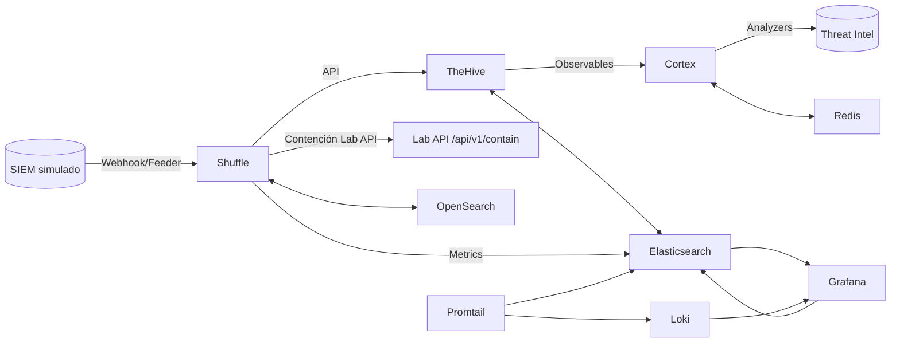
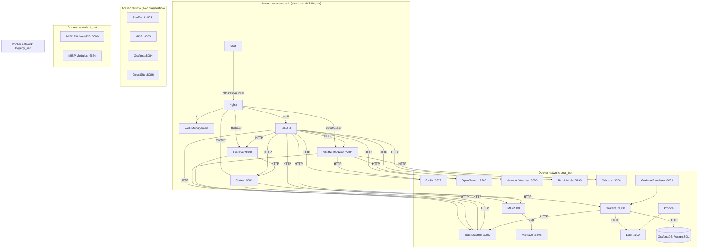
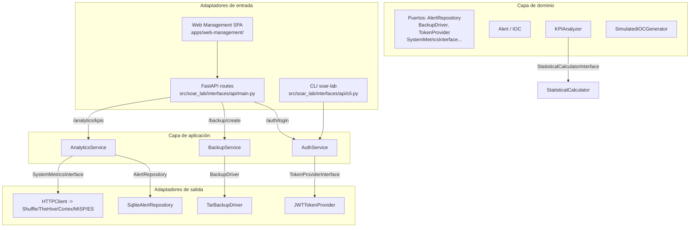
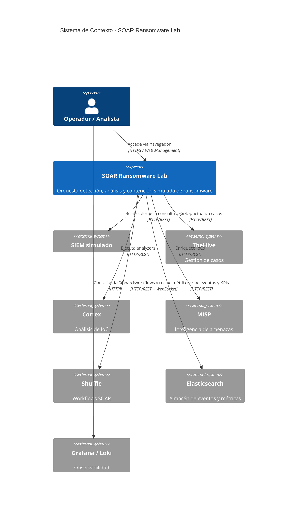
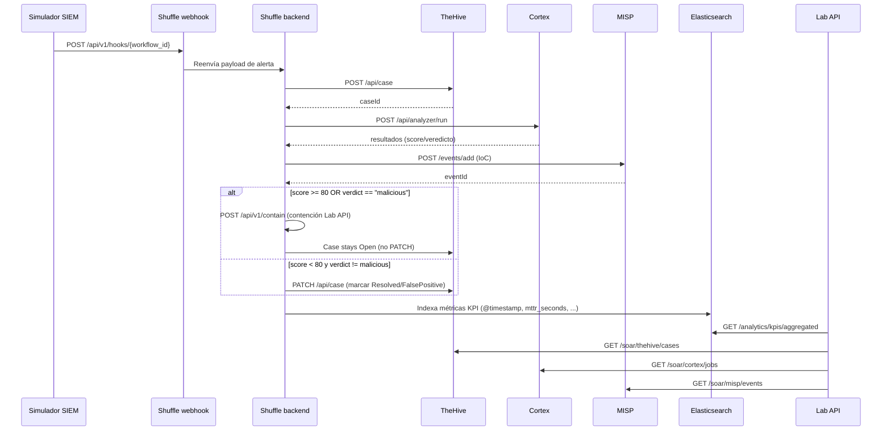
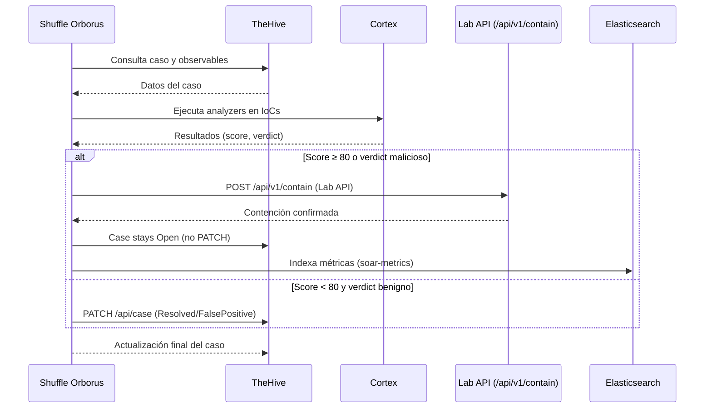
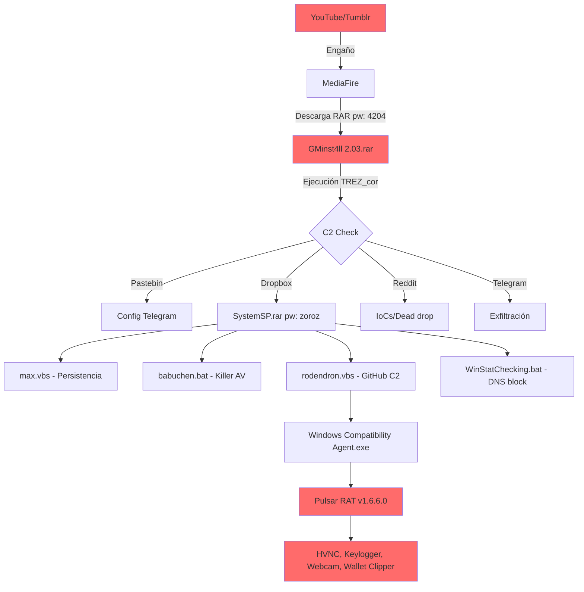
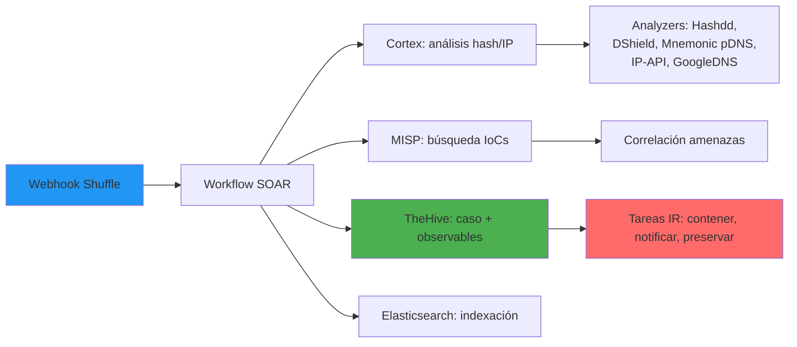

# Anexo F: Diagramas de Arquitectura y Flujos (Mermaid)

Referencia TFM: complementa el Capítulo 4 (Desarrollo específico) y el Capítulo 2 (Estado del arte),
y Anexo B (Playbook SOAR). Estos diagramas son la versión canónica extraída de
`docs/02-architecture.md`, `docs/04-operations.md`, `docs/06-project-management.md`
y `README.md`. Los diagramas de `specific_development.md` son versiones simplificadas;
los de este anexo son los completos.

---

## F.1. Arquitectura de Alto Nivel

Diagrama de componentes principales y flujo de datos del sistema SOAR.



Fuente: `README.md` línea 51

---

## F.2. Arquitectura de Despliegue Docker

Diagrama completo de la topología Docker: Nginx proxy, redes (soar_net, ti_net,
logging_net) y conexiones entre los 23 servicios.



Fuente: `docs/02-architecture.md` línea 169

---

## F.3. Arquitectura Hexagonal (Ports & Adapters)

Diagrama de la arquitectura hexagonal del código Python: capas de dominio, aplicación,
infraestructura e interfaces, con sus puertos y adaptadores.



Fuente: `docs/02-architecture.md` línea 1390

---

## F.4. Diagrama de Contexto C4

Modelo C4 de contexto mostrando los límites del sistema y las integraciones externas.



Fuente: `docs/04-operations.md` línea 1296

---

## F.5. Flujo End-to-End de Alertas (Sequence Diagram)

Diagrama de secuencia completo del flujo de una alerta desde el simulador SIEM hasta
la indexación de métricas en Elasticsearch, pasando por Shuffle, TheHive, Cortex y MISP.



Fuente: `docs/04-operations.md` línea 1380

---

## F.6. Árbol de Decisión del Playbook

Flowchart del playbook SOAR mostrando la lógica de decisión: validación, creación de caso,
análisis con Cortex, y branching entre contención (malicioso) y falso positivo (benigno).

```mermaid
flowchart TD
 A([Webhook POST /webhook]) --> B[N1: Validar esquema]
 B -->|schema inválido| ERR1([Abort + log error])
 B -->|OK| C[N2: Extraer IoCs]
 C --> D[N3: Crear caso TheHive]
 D -->|API error x3| ERR2([Abort + notificar crítico])
 D -->|OK case_id| E[N4: Adjuntar observables]
 E --> F[N5: Ejecutar analyzers Cortex]
 F --> G{N6: score ≥ 80\no verdict == malicious?}

 G -->|SÍ| H[N7: POST /api/v1/contain<br/>(contención Lab API)]
 H --> I[N8: Case stays Open<br/>(no PATCH)]
 I --> J[N9: Notificación CRITICAL email]
 J --> K[N10: Registrar MTTR + métricas ES]
 K --> Z([FIN — caso contenido])

 G -->|NO| H2[N7b: TheHive -> FalsePositive]
 H2 --> I2[N8b: TheHive -> Resolved]
 I2 --> J2[N9b: Notificación INFO]
 J2 --> K2[N10b: Registrar MTTR + métricas ES]
 K2 --> Z2([FIN — falso positivo resuelto])
```

Fuente: `docs/04-operations.md` línea 4302

---

## F.7. Respuesta Automatizada (Sequence Diagram)

Diagrama de secuencia de la respuesta automatizada con lógica de contención basada en
score y verdict de Cortex.



Fuente: `docs/02-architecture.md` línea 519

---

## F.8. Cronograma de Objetivos SMART (Gantt)

Diagrama Gantt del cronograma de los 20 objetivos SMART distribuidos en 4 fases
(planificación inicial 12 semanas, aumentada a 15 tras diseño, ejecución real 18 semanas,
27 abr - 31 ago 2026).

```mermaid
gantt
 title Cronograma de Objetivos SMART - SOAR Ransomware Lab
 dateFormat YYYY-MM-DD
 section Fase 1: Investigación
 Objetivo 1: Laboratorio desplegado :active, obj1, 2026-04-27, 14d
 Objetivo 7: Seguridad del Entorno :obj7, after obj1, 7d
 Objetivo 8: Automatización configurada :obj8, after obj7, 7d
 Objetivo 17: API del Laboratorio :obj17, after obj8, 7d
 Objetivo 18: CLI del Laboratorio :obj18, after obj17, 5d
 section Fase 2: Diseño
 Objetivo 2: Playbook E2E :obj2, 2026-05-11, 28d
 Objetivo 5: Integración SIEM :obj5, after obj2, 7d
 Objetivo 6: Contención simulada :obj6, after obj5, 7d
 Objetivo 19: Sitio de Documentación :obj19, after obj6, 7d
 Objetivo 20: Interfaz Web de Gestión :obj20, after obj19, 7d
 section Fase 3: Desarrollo
 Objetivo 3: Métricas MTTR :obj3, 2026-06-22, 14d
 Objetivo 9: Pruebas Atómicas :obj9, after obj3, 5d
 Objetivo 10: Pruebas de Integración :obj10, after obj9, 7d
 Objetivo 11: Pruebas de Seguridad :obj11, after obj10, 5d
 Objetivo 12: Pruebas de Rendimiento :obj12, after obj11, 5d
 Objetivo 13: Pruebas de Producción :obj13, after obj12, 3d
 Objetivo 14: KPIs y Análisis :obj14, after obj13, 7d
 section Fase 4: Validación
 Objetivo 4: Documentación técnica :obj4, 2026-08-03, 7d
 Objetivo 15: Preparación defensa TFM :obj15, after obj4, 7d
 Objetivo 16: Evidencia aprobación :obj16, after obj15, 7d
```

Fuente: `docs/06-project-management.md` línea 171

---

## F.9. Roadmap por Semanas (Gantt)

Diagrama Gantt simplificado del roadmap semanal con ruta crítica marcada.

```mermaid
gantt
title Roadmap por Semanas
dateFormat WW
axisFormat "S%V"
section Fases
Fase 1: Investigación :active, f1, 01, 3w
Fase 2: Diseño :crit, f2, after f1, 3w
Fase 3: Desarrollo :crit, f3, after f2, 6w
Fase 4: Validación :crit, f4, after f3, 6w
```

Nota: La planificación inicial era de 12 semanas, aumentada a 15 tras
la fase de diseño (integración de Cortex con analyzers externos y stack de
monitoreo no contemplados inicialmente). La ejecución real se extendió a
18 semanas (27 abr - 31 ago 2026, 3+3+6+6) debido a la ampliación de la
suite de tests (2233 tests coleccionados, 1905 seleccionados) y la ejecución del experimento (n=50).
Ver `objectives_and_methodology.md` para el cronograma real.

Fuente: `docs/06-project-management.md` línea 861

---

## F.10. Matriz de Priorización de Riesgos

Diagrama de la matriz de riesgos del proyecto, clasificados por probabilidad e impacto.

```mermaid
graph TD
 A[Alta Prob / Alto Impacto] -->|Críticos| R1(Puertos Hyper-V Sí) & R2(Recursos RAM Parcial) & R11(LaLiga/Cloudflare Parcial)
 B[Alta Prob / Bajo Impacto] --> R6(MISP arranque lento Sí)
 C[Media Prob / Alto Impacto] --> R3(Analyzers timeout Parcial) & R4(Integración tokens Parcial) & R7(Umbrales MTTR Parcial) & R12(API no disponible Parcial) & R13(Certificados SSL Parcial) & R16(CI/CD failures Parcial)
 D[Media Prob / Medio Impacto] --> R5(ES compat Sí) & R8(APIs externas Parcial) & R14(Validación esquemas Parcial) & R15(Cobertura pruebas Parcial) & R19(Web-management UX Parcial) & R20(Analytics fallan Parcial)
 E[Baja Prob / Alto Impacto] --> R9(Pérdida config Parcial)
 F[Baja Prob / Medio Impacto] --> R10(Deriva alcance Sí) & R17(CLI inusable Parcial) & R18(Docs-site desactualizado Parcial)
```



Leyenda: Sí Mitigado · Parcial En seguimiento

Fuente: `docs/06-project-management.md` línea 1390

---

## F.11. Caso de Estudio: GMinst4ll (Flujo de Infección)

Diagrama del flujo completo de infección del malware GMinst4ll, desde la distribución
hasta el despliegue del RAT, usado como caso de estudio real para validar el laboratorio.



Fuente: `docs/04-operations.md` línea 4720

---

## F.12. Pipeline SOAR para IoCs de GMinst4ll

Diagrama del pipeline SOAR procesando IoCs reales del caso GMinst4ll a través de
Cortex, MISP, TheHive y Elasticsearch.



Fuente: `docs/04-operations.md` línea 4807

