# Anexo F: Diagramas de Arquitectura y Flujos (Mermaid)

Referencia TFM: complementa el Capítulo 4 (Desarrollo específico) y el Capítulo 2 (Estado del arte),
y Anexo B (Playbook SOAR). Estos diagramas son la versión canónica extraída de
`docs/02-architecture.md`, `docs/04-operations.md`, `docs/06-project-management.md`
y `README.md`. Los diagramas de `specific_development.md` son versiones simplificadas;
los de este anexo son los completos.

---

## F.1. Arquitectura de Alto Nivel

Diagrama de componentes principales y flujo de datos del sistema SOAR. Muestra
los 23 contenedores Docker del laboratorio más el simulador SIEM (script Python,
no contenedor) y TI (sistemas externos).

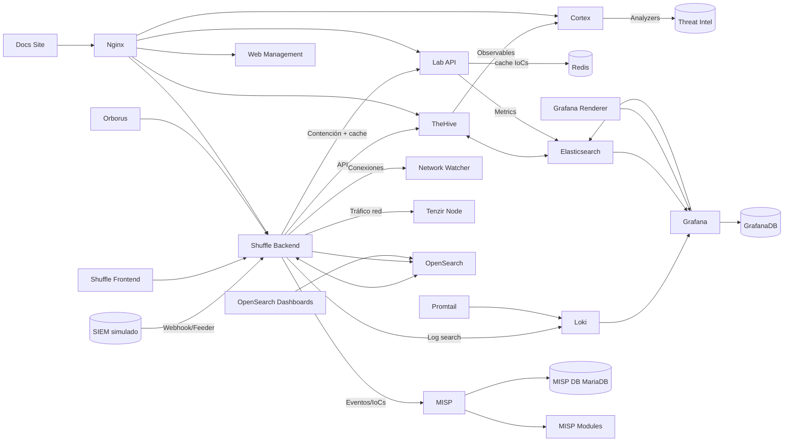

Fuente: `README.md` e `infra/docker/compose/docker-compose*.yml`

---

## F.2. Arquitectura de Despliegue Docker

Diagrama completo de la topología Docker: Nginx proxy, redes (soar_net, ti_net,
logging_net) y conexiones entre los 23 servicios.

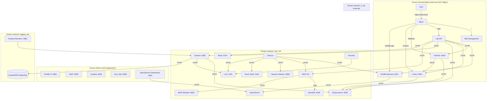

Fuente: `docs/02-architecture.md` línea 169

---

## F.3. Arquitectura Hexagonal (Ports & Adapters)

Diagrama de la arquitectura hexagonal del código Python: capas de dominio, aplicación,
infraestructura e interfaces, con sus puertos y adaptadores.

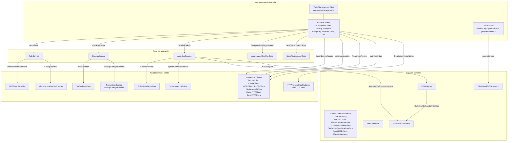

Fuente: `docs/02-architecture.md` línea 1390

---

## F.4. Diagrama de Contexto C4

Modelo C4 de contexto mostrando los límites del sistema y las integraciones externas.

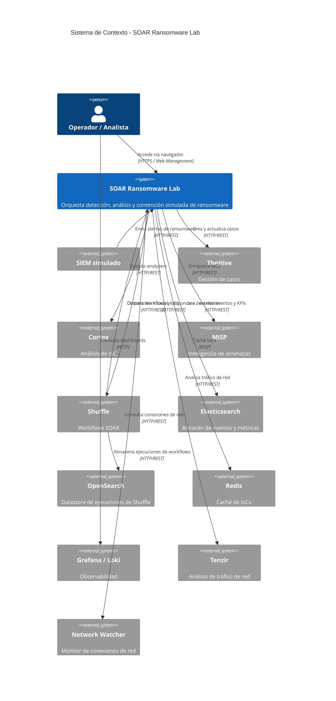

Fuente: `docs/04-operations.md` línea 1296

---

## F.5. Flujo End-to-End de Alertas (Sequence Diagram)

Diagrama de secuencia completo del flujo de una alerta desde el simulador SIEM hasta
la indexación de métricas en Elasticsearch, pasando por Shuffle, TheHive, Cortex y MISP.

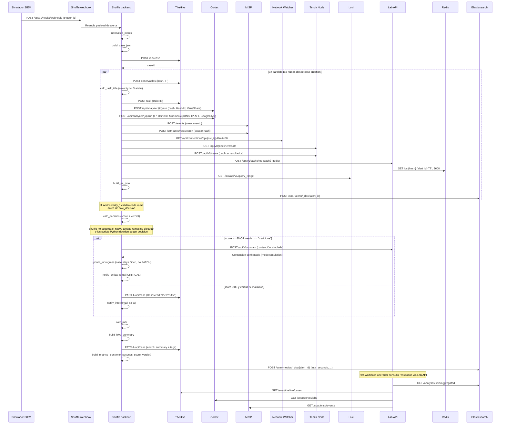

Fuente: `docs/04-operations.md` línea 1380

---

## F.6. Árbol de Decisión del Playbook

Flowchart del playbook SOAR mostrando la lógica de decisión: validación, creación de caso,
análisis con Cortex, y branching entre contención (malicioso) y falso positivo (benigno).

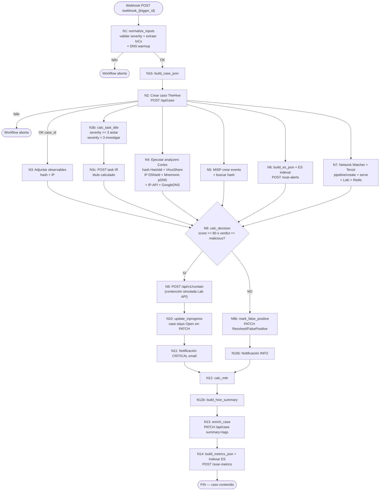

Fuente: `docs/04-operations.md` línea 4302

---

## F.7. Respuesta Automatizada (Sequence Diagram)

Diagrama de secuencia del zoom sobre la rama de decisión del playbook: tras
`calc_decision`, el workflow ejecuta contención (malicioso) o marca falso positivo
(benigno), seguido del enriquecimiento del caso y la indexación de métricas.

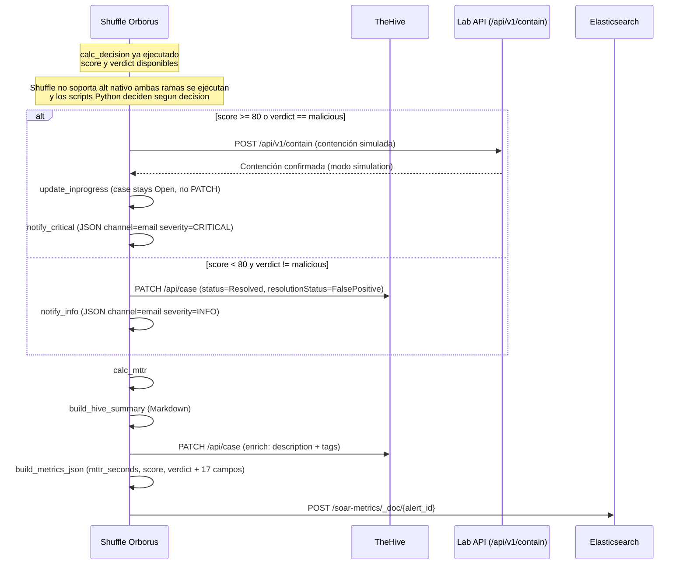

Fuente: `docs/02-architecture.md` línea 519

---

## F.8. Cronograma de Objetivos SMART (Gantt)

Diagrama Gantt del cronograma de los 20 objetivos SMART distribuidos en 4 fases
(planificación inicial 12 semanas, aumentada a 15 tras diseño, ejecución real 18 semanas,
27 abr - 31 ago 2026).

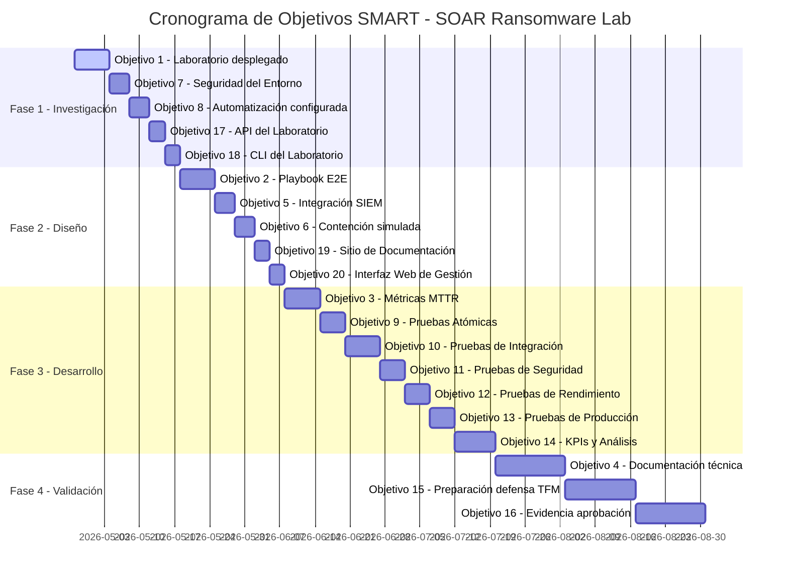

Fuente: `docs/thesis/objectives_and_methodology.md` líneas 86-116 (cronograma 18 semanas 2026), `docs/06-project-management.md` líneas 171-203 (objetivos SMART)

---

## F.9. Roadmap Semanal (Gantt)

Diagrama Gantt simplificado del roadmap semanal con ruta crítica marcada.

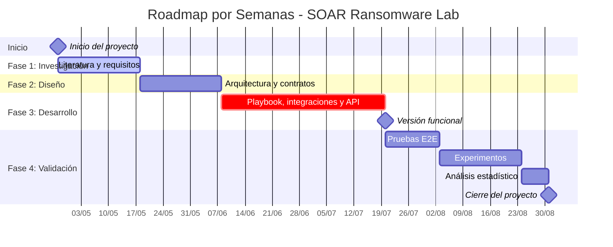

Nota: La planificación inicial era de 12 semanas, aumentada a 15 tras
la fase de diseño (integración de Cortex con analyzers externos y stack de
monitoreo no contemplados inicialmente). La ejecución real se extendió a
18 semanas (27 abr - 31 ago 2026, 3+3+6+6) debido a la ampliación de la
suite de tests (2233 tests coleccionados, 1905 seleccionados) y la ejecución del experimento (n=50).
Ver `objectives_and_methodology.md` para el cronograma real.

Fuente: `docs/thesis/objectives_and_methodology.md` líneas 90-116 (Gantt 18 semanas 2026)

---

## F.10. Matriz de Priorización de Riesgos

Diagrama de la matriz de riesgos del proyecto, clasificados por probabilidad e impacto.

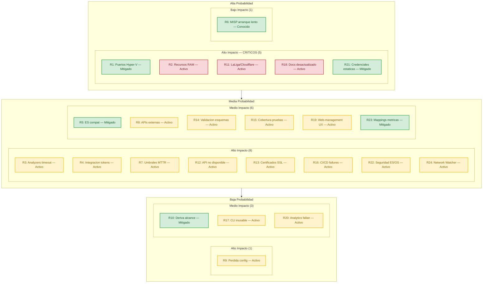

Leyenda: Sí Mitigado o Conocido · Parcial En seguimiento / Activo

Fuente: `docs/06-project-management.md` línea 1381 (tabla detallada R1-R24, fuente autoritativa)

---

## F.11. Caso de Estudio: GMinst4ll (Flujo de Infección)

Diagrama del flujo completo de infección del malware **GMinst4ll 2.03.rar** (884 MB,
InfoStealer/Loader), analizado forensemente entre el 11-13 de junio de 2026 en un
sandbox aislado (Ubuntu 20.04 + Windows Server 2016 con Vagrant, red aislada, Sysmon).
El caso de estudio valida el laboratorio SOAR con IoCs reales: 4 hashes SHA256, 7 URLs
C2, 9 IPs, 1 clave de registro, 66 dominios bloqueados y 7 técnicas MITRE ATT&CK.

| Atributo | Valor |
|----------|-------|
| Actor | `boycots563` (GitHub user ID 193230682, 1 repo, 0 stars, 1 watcher) |
| Origen | Eslovaquia (subida a MediaFire 2026-06-10 23:57:07) |
| Repo C2 | `github.com/boycots563/wlt56` — público y activo, 253 commits (ago 2026) |
| Operador Telegram | @KJL4999S (Chat ID 6820575341, bot `buchstys4_bot` ID 7675556882) |
| Sofisticación | RAR anidado, ConfuserEx, servicios legítimos para C2 |

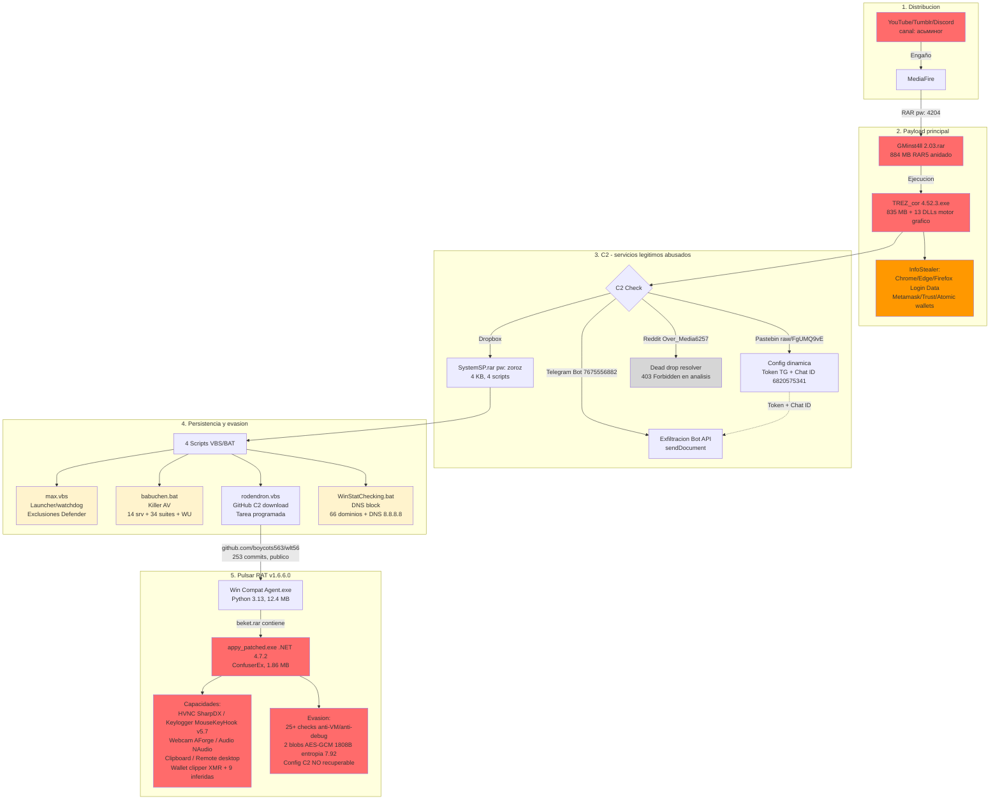

El malware se distribuye mediante engaño social en cuatro plataformas: YouTube (canal
"асьминог", octopus en ruso, vídeo `okNhSxfa__U` reciclado posteriormente para
distribuir "RPG Maker MZ"), Tumblr (`@tutorialsfrommax`, tutoriales falsos de minería),
MediaFire (`GMinstall_4.11.rar`, variante 4.11 vs 2.03) y Discord (`sub4unlock.io/ajLvu`,
trust score 10/100, scam CPA). El ejecutable principal `TREZ_cor 4.52.3.exe` (835 MB)
incluye 13 DLLs de motor gráfico (core_init, physics_core, mesh_processor, renderer,
etc.) y actúa como InfoStealer robando credenciales de navegadores (Chrome, Edge,
Brave, Opera, Firefox — `Login Data` y `logins.json`) y wallets (Metamask, Trust
Wallet, Atomic). Tras el robo de datos, realiza un C2 check contra cuatro servicios
legítimos abusados: Pastebin (configuración dinámica con token Telegram y Chat ID),
Dropbox (payload SystemSP.rar), Reddit (user `Over_Media6257`, dead drop resolver, 403
Forbidden) y Telegram Bot API (exfiltración vía `sendDocument`).

SystemSP.rar (4 KB, contraseña "zoroz") contiene cuatro scripts VBS/BAT para
persistencia y evasión:

| Script | Tipo | Función |
|--------|------|---------|
| `max.vbs` | VBScript | Launcher/watchdog, exclusiones de Windows Defender para `appy.exe` |
| `babuchen.bat` | Batch | Killer AV: detiene 14 servicios, destruye 34 suites, elimina Windows Update |
| `rodendron.vbs` | VBScript | Descarga `Windows Compatibility Agent.exe` desde GitHub C2, tarea programada recurrente |
| `WinStatChecking.bat` | Batch | Bloquea 66 dominios AV en hosts, fuerza DNS a 8.8.8.8 |

El repositorio GitHub C2 (`github.com/boycots563/wlt56`, público y activo, 253 commits
entre octubre 2025 y agosto 2026) contiene nueve archivos:

| Archivo | Tipo | Tamaño | Notas |
|---------|------|--------|-------|
| `Windows Compatibility Agent.exe` | Python 3.13 | 12.4 MB | Imports USER32/KERNEL32/ADVAPI32, packer MachO_File_pyinstaller |
| `Windows Compatibility Agent Host.exe` | Python 3.14 | 8.5 MB | Mismos imports + OpenProcessToken/GetTokenInformation |
| `kamzat.exe` | Python 3.13 | 12.4 MB | PyCryptodome completo (AES, SHA, HMAC, BLAKE2, keccak) + asyncio |
| `postevak.exe` | Python 3.13 | 7.9 MB | HTTP básico, sin criptografía avanzada |
| `appy.exe` | Rust | 719 KB | Launcher, imports ntdll.dll (NtWriteFile, NtCreateNamedPipeFile) |
| `beket.rar` | RAR | — | Contiene `appy_patched.exe` (Pulsar RAT .NET 1.86 MB) |
| `PROMOTIO.BAT` | Batch | — | Actualizado 3-nov-2025 |
| `maximusz.bat` | Batch | — | Actualizado 3 veces el 17-oct-2025 |
| `README.md` | Markdown | — | Disclaimer falso "PoC educativo" añadido 2-ago-2026 |

El patrón de commits revela ciclos repetidos de "Add files via upload" + "Delete
appy.exe"/"Delete kamzat.exe" (oct-nov 2025, dic 2025, abr 2026), indicando rotación de
payloads para evadir detección. Ningún ejecutable Python contiene URLs/IPs directas en
strings — la configuración C2 está probablemente cifrada.

Las hipótesis de atribución indican una campaña activa desde 2025 (múltiples variantes:
versiones 2.03, 4.11, 4.52.3, rotación de payloads en GitHub mediante ciclos
Add/Delete), un operador rusohablante (cirílico "асьминог" en YouTube, nombres temáticos
eslavos: babuchen, rodendron, kamzat, postevak, maximusz) y monetización múltiple (robo
de wallets, venta de credenciales en foros, ingresos por sub4unlock.io CPA).

Fuente: `github.com/alesanfe/gminst4ll-forensics` (README.md, 01_INFORME_PRINCIPAL,
02_BITACORA_FASES, 03_IOCS_Y_DETECCION, 04_OSINT_Y_CAMPANA, 05_PENDIENTES_Y_PLAN,
06_METADATOS_ANALISIS). Estado del repo C2 verificado directamente en
`github.com/boycots563/wlt56` (agosto 2026).

---

## F.12. Pipeline SOAR para IoCs de GMinst4ll

Diagrama del pipeline SOAR procesando IoCs reales extraídos del análisis forense de
GMinst4ll (`github.com/alesanfe/gminst4ll-forensics`) a través de Cortex, MISP, TheHive
y Elasticsearch. Validado con **TC-33** (10 subtests): hashes SHA256 (GMinst4ll, TREZ_cor,
SystemSP, appy_patched), URLs C2 (Pastebin, Dropbox, Reddit, Telegram, GitHub, MediaFire),
dominios (pastebin.com, dropbox.com, reddit.com, telegram.org, github.com, mediafire.com),
IPs (172.66.171.73, 104.20.29.150, 162.125.248.18, 151.101.129.140, 151.101.65.140,
149.154.166.110, 149.154.167.99), Telegram (Bot ID 7675556882, Chat ID 6820575341),
claves de registro (HKLM Winlogon UserInit), MITRE ATT&CK (7 técnicas: T1566.002,
T1059.001, T1547.001, T1562.001, T1056.001, T1102, T1567.002).

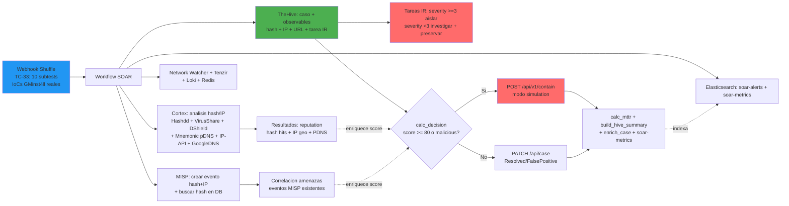

Nota: Para IoCs de GMinst4ll sin enriquecimiento previo de Cortex/MISP, el score
base de `calc_decision` es 60 (severity=3 → +60), veredicto `suspicious`, decisión
`observe`. La contención se activa cuando los analyzers de Cortex (Hashdd/VirusShare
encuentran el hash) o la correlación de MISP (evento existente para la IP) elevan el
score a >=80 o el veredicto a `malicious`. Los IoCs de GMinst4ll son especialmente
valiosos para validación porque incluyen hashes reales con reputation en VirusShare,
IPs de servicios legítimos abusados (Pastebin, Dropbox, Reddit, Telegram) y técnicas
MITRE ATT&CK mapeadas desde análisis estático confirmado.

Los IoCs validados en TC-33 (10 subtests) se distribuyen por tipo como sigue:

| Tipo | Cantidad | Ejemplos |
|------|----------|----------|
| Hashes SHA256 | 4 | GMinst4ll `d70c31b0...`, TREZ_cor `a75def53...`, SystemSP `a50e0785...`, appy_patched `eabe4c16...` |
| URLs C2 | 7 | `pastebin.com/raw/FgUMQ9vE`, `pastebin.com/raw/E3s5iTTz`, `dropbox.com/scl/fi/.../SystemSP.rar`, `reddit.com/user/Over_Media6257/...`, `api.telegram.org/bot7675556882/...`, `github.com/boycots563/wlt56/`, `mediafire.com/.../GMinstall_4.11.rar` |
| Dominios | 6 | pastebin.com, dropbox.com, reddit.com, telegram.org, github.com, mediafire.com |
| IPs | 9 | 172.66.171.73, 104.20.29.150 (Pastebin), 162.125.248.18 (Dropbox), 151.101.129.140, 151.101.65.140, 151.101.193.140, 151.101.1.140 (Reddit), 149.154.166.110, 149.154.167.99 (Telegram) |
| Telegram | 2 | Bot ID 7675556882 (buchstys4_bot), Chat ID 6820575341 |
| Registry | 1 | `HKLM\SOFTWARE\Microsoft\Windows NT\CurrentVersion\Winlogon\UserInit` |
| MITRE ATT&CK | 7 | T1566.002, T1059.001, T1547.001, T1562.001, T1056.001, T1102, T1567.002 |

Las consultas SIEM para hunting incluyen `pastebin.com` (o URLs específicas
`/raw/FgUMQ9vE`, `/raw/E3s5iTTz`), `dropbox.com/scl/fi/` (path SystemSP.rar),
`reddit.com/user/Over_Media6257/`, `api.telegram.org/bot7675556882` y
`github.com/boycots563/wlt56/`. Los patrones de proceso a monitorizar son `TREZ_cor`
en línea de comandos, `wscript.exe` ejecutando `.vbs` desde `%PROGRAMDATA%` y PowerShell
con `-Verb RunAs` tras ejecutar archivos sospechosos.

Fuente: `github.com/alesanfe/gminst4ll-forensics` (03_IOCS_Y_DETECCION_GMINST4LL.md —
Apéndice A con origen exacto de cada IoC: archivo fuente + línea). Pipeline SOAR:
`docs/04-operations.md` línea 4807, TC-33: `tests/e2e/TC-33/`.

