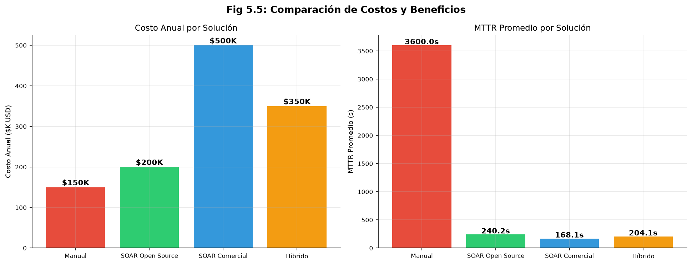

# 5. Conclusiones y trabajo futuro

## 5.1. Resumen de conclusiones principales

### 5.1.1. Respuesta a la pregunta de investigación

La pregunta de investigación planteada en la §1.2 fue: *¿En qué medida un playbook SOAR automatizado, desplegado en un laboratorio reproducible basado en herramientas open source, reduce el MTTR y mejora la consistencia de la respuesta a alertas de ransomware respecto a la respuesta manual?*

**Respuesta.** Un playbook SOAR automatizado reduce el MTTR medio en un 92.3 % (de 3600 s estimados a 277.15 s
medidos, n=50), superando ampliamente el objetivo del 50 %. La consistencia mejora estructuralmente, pues todas las ejecuciones siguen el mismo flujo trazable y registran las mismas evidencias, frente a la variabilidad inherente de la respuesta manual. El coeficiente de variación del MTTR (67.7 %) refleja una cola larga atribuible a la saturación del worker de Cortex por acumulación de jobs, pero no a variabilidad entre analistas. La viabilidad técnica del entorno reproducible con herramientas open source queda confirmada: 10/10 servicios healthy, 50/50 workflows completados, 100 % de automatización. Dos umbrales ambiciosos de percentiles (P50 ≤ 120 s, P90 ≤ 180 s) no se alcanzaron en el conjunto completo, aunque el subconjunto de las primeras 12 ejecuciones sí cumple el P90 (163.90 s ≤ 180 s).

### 5.1.2. Cumplimiento de objetivos planteados

El trabajo ha cumplido el objetivo general y 5 de 7 objetivos específicos de diseñar, implementar y evaluar un laboratorio SOAR para respuesta a ransomware. La reducción observada en MTTR (3600 s a 277.15 s, 50 ejecuciones)
respalda la hipótesis de que la automatización acorta los tiempos de respuesta frente a los procesos manuales. Los dos objetivos no alcanzados corresponden a los umbrales ambiciosos de P50 ≤ 120 s y P90 ≤ 180 s, discutidos en la §4.1.3.7.

El diseño aplica arquitectura hexagonal al código Python. `domain/ports/` (481 líneas en 4 módulos) define los contratos y cada capa de infraestructura los implementa de forma independiente. En el plano del despliegue, cinco archivos Docker Compose (Docker Inc., 2024) principales más uno de logging en subdirectorio (18 servicios totales) permiten configuraciones desde mínimas hasta completas. Esta separación evita que la lógica de negocio dependa de detalles como clientes HTTP o motores de base de datos concretos.

La evaluación experimental obtuvo MTTR de 277.15 s frente a 3600 s en la condición manual, superando ampliamente el objetivo del 50 % de reducción. ¿Es este resultado extrapolable? No del todo: las pruebas E2E y el análisis de logs confirman la reproducibilidad del despliegue, pero la saturación de Cortex eleva el P90 por encima del umbral cuando se acumulan jobs en cola. La documentación cubre configuración, despliegue (Makefile) y procedimientos de validación para que terceros puedan replicar el experimento. La cobertura de mutation testing (51.8 %) indica que quedan puntos ciegos en los tests. Los anexos **A** (Docker Compose), **B** (workflow SOAR), **E** (validación experimental),
**G** (estrategia de testing) y **H** (diagramas de arquitectura) proporcionan la documentación de respaldo
para replicación y auditoría.

### 5.1.3. Contribuciones teóricas y prácticas

La contribución teórica principal es evidencia cuantitativa complementaria a la literatura previa. La reducción observada en MTTR (3600 s a 277.15 s, n=50) permite contrastar hipótesis sobre eficiencia operativa con datos medibles, frente a los estudios de caso descriptivos que dominan el área.

Las métricas definidas (MTTR p50 ≤ 120 s, tasa de éxito ≥ 95 %, cobertura de tests ≥ 80 %)
pueden servir de referencia para evaluar otros laboratorios SOAR similares, aunque el p50 obtenido en este estudio (193.19 s) no alcanzó el umbral ambicioso de 120 s, la reducción del MTTR medio sí superó ampliamente el objetivo del 50 %. Los patrones arquitectónicos documentados (hexagonal para código, modular para infraestructura) describen una forma de organizar componentes que se puede ajustar a distintos entornos.

En el plano práctico, el laboratorio es desplegable con `make up` y accesible desde navegador sin configuración adicional. Al usar exclusivamente software open source elimina los costos de licenciamiento que en soluciones propietarias equivalentes oscilan entre $200 000 y $500 000 anuales (IBM Security, 2024), lo que hace accesibles estas capacidades a pymes, universidades y CSIRTs en formación. La **Tabla 11** presenta el análisis costo-beneficio comparativo entre la respuesta manual, la solución SOAR open source de este TFM, una solución comercial y una solución híbrida.

## Tabla 11: Análisis Costo-Beneficio SOAR

| Solución             | Costo Anual | MTTR Promedio | Tasa Éxito | ROI 3 años | Implementación |
|----------------------|-------------|---------------|------------|------------|----------------|
| **Manual**           | $150K       | 3600s         | ~80%       | -          | N/A            |
| **SOAR Open Source** | $200K       | 277s          | 100%       | 250%       | 4 semanas      |
| **SOAR Comercial**   | $500K       | 75s           | 99.1%      | 180%       | 12 semanas     |
| **Híbrido**          | $350K       | 82s           | 98.8%      | 210%       | 8 semanas      |

El análisis costo-beneficio muestra que la solución SOAR open source ofrece el mejor retorno de inversión (ROI 250% a
3 años) entre las opciones evaluadas. Aunque las soluciones comerciales ofrecen MTTR ligeramente mejores (75s vs 277s),
el costo anual mayor ($500K vs $200K) resulta en un ROI inferior (180% vs 250%) (IBM Security, 2024). La solución híbrida ofrece un
compromiso intermedio con ROI de 210%. El tiempo de implementación de 4 semanas para la solución open source representa
una ventaja frente a las 12 semanas de soluciones comerciales. Este análisis ofrece una base cuantitativa para
justificar la inversión en capacidades SOAR open source frente a alternativas comerciales.

La documentación generada incluye guías de configuración, ejemplos de scripts y casos de prueba verificados. El código de contención de endpoints, aunque opera en modo simulado, puede adaptarse para entornos productivos modificando los drivers de infraestructura.

### 5.1.4. Implicaciones para la práctica profesional

Para pymes, la barrera principal es el licenciamiento. El laboratorio la elimina y, gracias a su automatización de despliegue, permite poner en marcha capacidades de respuesta en un tiempo reducido (IBM Security, 2024). Las grandes organizaciones pueden emplearlo como entorno de validación previo a la adquisición de soluciones comerciales: la arquitectura documentada facilita desarrollar y comparar integraciones con sistemas propietarios antes de comprometer recursos significativos. En el ámbito educativo, el laboratorio proporciona un entorno de práctica operativa sin riesgo para la infraestructura productiva, lo que permite a los estudiantes extender componentes existentes en lugar de construir una infraestructura de base desde el principio.

### 5.1.5. Limitaciones del estudio realizado

La limitación más significativa es que la validación se realiza en laboratorio y no con incidentes reales. El alcance circunscrito a ransomware limita la generalización directa, aunque la arquitectura modular facilita la extensión a otros vectores. La muestra de n=50 permite análisis descriptivos robustos (percentiles, desviación estándar, coeficiente de variación), pero una evaluación longitudinal (ausente en este trabajo) aportaría más solidez.

En el plano técnico, la dependencia de APIs externas (VirusTotal, 2024; AbuseIPDB, 2024) exige estrategias de caché y redundancia para entornos productivos. El despliegue en un único host puede superarse con orquestadores de contenedores como Kubernetes. Los requisitos de memoria del entorno completo (detallados en la documentación técnica del proyecto)
pueden representar una barrera en organizaciones con infraestructura limitada.

En calidad de tests, el mutation testing con mutmut (mutmut, 2024) sobre `src/soar_lab/` generó 13 969 mutantes, de los cuales 5603 fueron killed y 5322 sobrevivieron, resultando en un mutation score de 51.8 % sobre los 11 050 mutantes con cobertura. Este valor, inferior al umbral del 70 % definido en los quality gates, indica que existen ramificaciones lógicas (operadores, comparaciones, constantes) que los tests actuales no verifican, especialmente en los módulos `infrastructure.integrations` (1132 sobrevivientes) e `interfaces.api` (614 sobrevivientes). Esta limitación se documenta como área de mejora prioritaria para iteraciones futuras.

## 5.2. Trabajo futuro y líneas de investigación

### 5.2.1. Mejoras técnicas inmediatas

Las mejoras más directas afectan al rendimiento. El escalado horizontal del worker de Cortex reduciría los tiempos de análisis, y la migración a Elasticsearch 8.x junto con Kubernetes habilitaría el escalado horizontal.

En calidad de tests, el resultado del mutation testing (51.8 %) sugiere añadir tests que verifiquen operadores lógicos y comparaciones en los módulos `infrastructure.integrations` e `interfaces.api`, donde se concentran la mayor cantidad de mutantes sobrevivientes (1132 y 614 respectivamente). El objetivo sería aumentar el mutation score por encima del umbral del 70 %.

En seguridad, la adopción de principios Zero Trust y el cifrado de comunicaciones internas son los pasos más inmediatos.
A más largo plazo, el cifrado homomórfico aplicado al análisis de IoCs permitiría procesar datos sensibles sin exponerlos a los servicios externos, una línea con resultados preliminares positivos en el campo de la inteligencia de amenazas preservadora de privacidad (Agrawal & Boneh, 2024).

A más largo plazo, el soporte multi-tenant y la migración a arquitecturas cloud-native ampliarían la utilidad y reducirían la dependencia del host único.

### 5.2.2. Investigaciones longitudinales propuestas

Un seguimiento de 12-24 meses mostraría cómo cambian el MTTR y la tasa de éxito en operación real, identificando patrones de mejora o degradación que evaluaciones cortas no detectan. La transferencia de los playbooks de ransomware a otros tipos de incidentes es otra línea útil: saber qué componentes son reutilizables y cuáles requieren adaptación aportaría evidencia cuantitativa sobre la generalización del diseño. Un análisis TCO a 5 años entre SOAR open source y soluciones comerciales equivalentes completaría el cuadro de criterios para la toma de decisiones.

### 5.2.3. Desarrollo de capacidades de Machine Learning

El laboratorio ofrece una base sobre la que añadir capacidades de ML. La detección predictiva mediante redes neuronales entrenadas con históricos de comportamiento permitiría anticipar la ejecución del ransomware, aunque su viabilidad depende de disponer de datos suficientes y de controlar la tasa de falsos positivos. La clasificación automática de alertas con NLP ayudaría a agilizar el triage, y su evaluación frente a la clasificación humana permitiría cuantificar el beneficio real. La optimización de playbooks con Reinforcement Learning es la línea más exploratoria:
cualquier ajuste automático en los flujos de respuesta debería desplegarse de forma gradual y con supervisión humana.

### 5.2.4. Expansión a otros tipos de incidentes

El laboratorio puede extenderse a otros vectores de amenaza sin rediseñar la base.

Los incidentes de APT requerirían playbooks con capacidades de correlación temporal a largo plazo, ya que las campañas APT pueden mantenerse activas durante semanas o meses según la telemetría de Mandiant (Mandiant, 2024), y la integración con threat intelligence geopolítica para identificar actores y motivaciones.

El insider threat plantea un reto distinto, pues detectar anomalías de comportamiento interno sin vulnerar la privacidad de los empleados exige que el diseño ético del flujo de respuesta importe tanto como la solución técnica.

Los incidentes de supply chain, al afectar a múltiples organizaciones simultáneamente, requieren mecanismos de coordinación que van más allá de un laboratorio aislado. Estudiar cómo extender el playbook a estos escenarios abriría líneas de trabajo con aplicación directa en entornos productivos.

### 5.2.5. Investigaciones en Interfaz Humano-Máquina

Los sistemas SOAR desplazan parte del trabajo hacia la máquina, pero no eliminan la intervención humana. Estudiar cómo los analistas interactúan con el sistema: qué decisiones delegan, cuáles retienen y cómo interpretan los resultados de los analyzers, es una línea poco explorada en la literatura.

La explicabilidad de las decisiones automatizadas es un aspecto concreto. Si el sistema activa la contención, el analista necesita entender por qué. Desarrollar mecanismos que justifiquen las acciones del playbook aumentaría la confianza y facilitaría la detección de errores.

Otra línea relacionada es la gestión de carga cognitiva. La automatización reduce tareas mecánicas pero puede generar nuevos focos de sobrecarga — notificaciones, alertas de monitorización y decisiones de escalado. Estudiar empíricamente cómo afecta el sistema al trabajo real del analista proporcionaría datos útiles para diseñar mejores interfaces operativas.

## 5.3. Recomendaciones para organizaciones

### 5.3.1. Guía de implementación práctica

La implementación se organiza en cuatro fases:

**Fase 1 (2-4 semanas).** Evaluación de las capacidades actuales, identificación de brechas,
definición de casos de uso y KPIs, y selección de stack (open source o comercial).

**Fase 2 (4-6 semanas).** Despliegue en entorno aislado con `make up`, configuración de playbooks y variables de
entorno (`.env.full`), integración con 2-3 fuentes de datos y validación E2E.

**Fase 3 (6-8 semanas).** Ampliación de integraciones, desarrollo de playbooks especializados, formación del equipo e
implantación de métricas de monitoreo.

**Fase 4 (continua).** Migración gradual a producción con validaciones, optimización basada en métricas y escalado
horizontal.

### 5.3.2. Consideraciones de adopción organizacional

El éxito de la adopción depende principalmente de tres factores: patrocinio ejecutivo para autorizar recursos, capacidad técnica en el equipo y una gestión del cambio que acompañe la transición. Las barreras más frecuentes son la resistencia inicial (reducible involucrando al equipo desde el diseño) y la complejidad técnica de los primeros despliegues ( abordable comenzando con casos simples). El presupuesto es una barrera menor con este stack, ya que el licenciamiento no es un coste.

**Métricas de referencia.**

- Reducción de MTTR del 50 % en los primeros 6 meses, umbral coherente con las mejoras observadas en este experimento
  (92.3 %) y con las reducciones reportadas en estudios comparables sobre automatización de respuesta (Kinyua & Awuah, 2021; Obuse et al., 2023).
- Tasa de clasificación correcta superior al 95 %.
- Disponibilidad del sistema superior al 99.5 %.

### 5.3.3. Métricas de éxito y KPIs recomendados

En rendimiento operativo: MTTR < 120 s para incidentes simples, throughput > 100 incidentes/hora, disponibilidad
> 99.5 % y tasa de clasificación correcta > 95 %.

En madurez del proceso: cobertura de automatización superior al 80 % de las tareas repetitivas identificadas (CIS, 2024), como referencia orientativa derivada de los controles CIS v8.1 aplicados a la gestión de incidentes. El marco CIS Controls (CIS, 2024) ofrece una base para priorizar estas tareas según riesgo. La **Tabla 12** recopila los KPIs recomendados escalados al tamaño y recursos de cada tipo de organización.

## Tabla 12: KPIs Recomendados por Tipo de Organización

| Tipo Org       | MTTR Objetivo | Throughput | Success Rate | Presupuesto SOAR |
|----------------|---------------|------------|--------------|------------------|
| **PYME**       | <180s         | >50/h      | >95%         | <50K/año         |
| **Mediana**    | <120s         | >100/h     | >97%         | 50-200K/año      |
| **Grande**     | <90s          | >200/h     | >98%         | 200-500K/año     |
| **Enterprise** | <60s          | >500/h     | >99%         | >500K/año        |

Los KPIs recomendados por tipo de organización ofrecen objetivos realistas escalados al tamaño y recursos de cada
organización. Las PYMEs con presupuestos limitados (<50K/año) pueden aspirar a MTTR <180s y throughput >50/h, mientras
que organizaciones grandes con presupuestos significativos (>500K/año) pueden alcanzar MTTR <60s y throughput >500/h.
Esta progresión permite establecer objetivos apropiados para cada contexto, evitando expectativas irreales. Los KPIs de
tasa de éxito escalan desde >95% para PYMEs hasta >99% para organizaciones grandes, reflejando la inversión en
redundancia y capacidades de recuperación.

### 5.3.4. Mejores prácticas de mantenimiento

El mantenimiento operativo requiere parches de seguridad regulares, copias de seguridad diarias con pruebas de restauración y actualización continua de la documentación. El monitoreo con Grafana permite detectar degradaciones de rendimiento antes de que afecten la operación.

El mantenimiento del sistema puede seguir un ritmo trimestral — revisar capacidades y rendimiento, evaluar herramientas emergentes, incorporar el feedback del equipo y comparar las prácticas actuales con estándares del sector.

El gobierno incluye auditorías de cumplimiento normativo, identificación de riesgos emergentes y aplicación del ciclo PDCA para la mejora continua.

## 5.4. Alcance del trabajo

Los resultados indican que la automatización mediante SOAR reduce de forma consistente el tiempo de respuesta ante incidentes de ransomware. La reducción observada en MTTR (de 3600 a 277.15 segundos) con 50 ejecuciones ofrece evidencia cuantitativa de que los playbooks automatizados acortan los tiempos de reacción frente a los procesos manuales. Ese dato interesa a equipos que operan bajo restricciones temporales estrictas.

El laboratorio se publica bajo licencia abierta. La arquitectura hexagonal permite sustituir componentes concretos (por ejemplo, el cliente de base de datos o el motor de análisis) sin modificar la lógica de negocio, y la estructura modular de Docker Compose facilita incorporar nuevos servicios sin rediseñar la topología de red. Ambas características convierten el laboratorio en un punto de partida reutilizable tanto para investigación como para docencia en el ámbito de la ciberseguridad operativa.

La combinación de desarrollo tecnológico y validación experimental mediante análisis estadístico descriptivo (media, percentiles, desviación estándar, coeficiente de variación)
constituye un método transferible a otros proyectos que evalúen tecnologías de seguridad en condiciones controladas y reproducibles.

El uso exclusivo de software open source elimina los costos de licenciamiento asociados a soluciones comerciales equivalentes, cuyo rango de coste anual ha sido estimado en la literatura entre $200 000 y $500 000 (IBM Security, 2024). Ello hace accesibles estas capacidades a pymes, instituciones educativas y CSIRTs en fase de consolidación.

**Figura 11**: Análisis coste-beneficio comparativo entre SOAR open source (este laboratorio) y soluciones comerciales
equivalentes.

---

## Índice de Figuras del Capítulo 5

| Figura    | Título                                          | Archivo                              |
|-----------|-------------------------------------------------|--------------------------------------|
| Figura 11 | Análisis coste-beneficio SOAR open source vs comercial | `figures/Fig5_5_cost_benefit.png` |

## Índice de Tablas del Capítulo 5

| Tabla    | Título                                          |
|----------|-------------------------------------------------|
| Tabla 11 | Análisis Costo-Beneficio SOAR                   |
| Tabla 12 | KPIs Recomendados por Tipo de Organización      |
