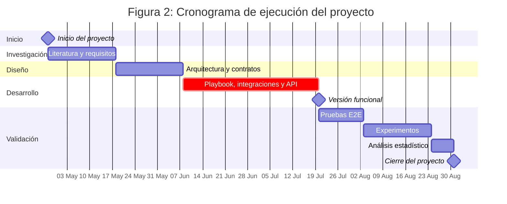

# 3. Objetivos concretos y metodología de trabajo

Este capítulo define qué se quiere demostrar y cómo se organiza el desarrollo. El resultado esperado es un laboratorio SOAR mínimo viable que ejecute un playbook E2E en dos escenarios y produzca métricas para la evaluación.

## 3.1. Objetivo general

Demostrar que un playbook SOAR automatizado reduce el tiempo de respuesta y mejora la consistencia y trazabilidad en la gestión de alertas de ransomware. El entorno debe ser reproducible, usar herramientas open source y generar evidencias verificables.

El objetivo se alcanza cuando el laboratorio ejecuta el flujo completo en dos escenarios (malicioso y benigno), cumple los umbrales de rendimiento (reducción de MTTR ≥ 50 % respecto al baseline manual) y genera evidencias completas (logs, capturas y métricas).

## 3.2. Objetivos específicos

Para alcanzar el objetivo general, el trabajo se divide en objetivos específicos:

### 3.2.1. Objetivos Estratégicos

Los objetivos estratégicos se agrupan en cuatro áreas: diseño arquitectónico, implementación funcional, validación empírica y documentación reproducible.

- **Diseño Arquitectónico**

Diseñar una arquitectura SOAR modular y reproducible basada en TheHive, Cortex y Shuffle. Se valida con una arquitectura documentada con diagramas técnicos, especificaciones de integración definidas, un plan de escalabilidad establecido y una configuración Docker Compose estructurada. Soporte documental en `docs/02-architecture.md`, `docs/03-api-and-integrations.md` e `infra/docker/compose/`.

- **Implementación Funcional**

Implementar un playbook E2E en Shuffle con integración entre TheHive, Cortex y Shuffle. Se cumple cuando hay un playbook funcional E2E en dos escenarios, una integración operativa sin intervención manual, un simulador SIEM funcional y una lógica de contención simulada operativa. El playbook está en `docs/thesis/appendix_b.md`, los scripts en `src/soar_lab/simulator/`, `src/soar_lab/infrastructure/messaging/send_alert.py`, `src/soar_lab/application/use_cases/analytics_service.py` y los logs en `runtime/logs/`.

- **Evaluación Experimental**

Aquí se busca validar la eficacia mediante métricas cuantitativas como MTTR y tasa de éxito. Los criterios de éxito son MTTR p50 ≤ 120s y p90 ≤ 180s, tasa de éxito ≥ 95 %, un dataset de al menos 50 ejecuciones por escenario y un análisis estadístico descriptivo (media, percentiles, desviación estándar, coeficiente de variación). Resultados y código asociado en `reports/e2e/`, `src/soar_lab/application/use_cases/`, `src/soar_lab/domain/statistical_calculator.py`, `src/soar_lab/data/calc_kpis.py`, `tests/e2e/` y `tests/integration/`.

- **Documentación Reproducible**

Documentar exhaustivamente el proceso para permitir la reproducción por terceros. La validación consiste en una guía de instalación y configuración completa, documentación de playbooks con contexto, validación de reproducción mediante Makefile y documentación técnica completa. Material en `docs/`, `docs/04-operations.md`, el Makefile, `docs/03-api-and-integrations.md` y `apps/docs-site/`.

La **Tabla 3** resume los cuatro objetivos estratégicos con sus métricas de éxito, valor objetivo y evidencia requerida.

## Tabla 3: Resumen de Objetivos Estratégicos y Métricas de Éxito

| ID       | Objetivo Específico        | Métricas de Éxito      | Valor Objetivo | Evidencia Requerida         |
|----------|----------------------------|------------------------|----------------|-----------------------------|
| **TE-1** | Diseño arquitectónico SOAR | Componentes integrados | 5+ componentes | Diagramas, especificaciones |
| **TE-2** | Implementación funcional   | Playbook E2E operativo | 2 escenarios (malicioso y benigno) | Scripts funcionales, logs   |
| **TE-3** | Validación experimental    | Reducción MTTR         | ≥50%           | Resultados estadísticos     |
| **TE-4** | Documentación reproducible | Guías completas        | 100% cobertura | Tutoriales, validación      |

El cumplimiento de cada objetivo se reporta en el Capítulo 4 (Resultados) y se discute en el Capítulo 6 (Conclusiones).

### 3.2.2. Objetivos Operativos

Los objetivos operativos detallan los pasos de implementación:

- **Delimitar** el alcance del proyecto estableciendo inclusiones, exclusiones y restricciones de seguridad. El entorno
  no debe tener malware funcional ni dependencias externas complejas.

- **Definir** el flujo funcional del playbook E2E: etapas, entradas, salidas, evidencias y criterios de decisión para
  los escenarios benigno y malicioso.

- **Diseñar** la arquitectura en un host con Docker Compose, incluyendo servicios, dependencias, redes y volúmenes.

- **Verificar** que los servicios arrancan de forma estable tras el despliegue inicial.

- **Configurar** y conectar los componentes: TheHive (TheHive Project, 2024) para gestión de casos, Cortex (Cortex Project, 2024) para análisis y Shuffle (Shuffle Tools, 2024) para
  orquestación.

- **Construir** el mecanismo de ingesta de alertas por webhook y asegurar la validación del payload de entrada.

- **Implementar** la creación y actualización de casos en TheHive, incluyendo IoCs, etiquetas, estados y resúmenes.

- **Automatizar** el enriquecimiento de observables mediante analyzers en Cortex y establecer la lógica de decisión
  basada en umbral de score.

- **Simular** las acciones de contención y registrar evidencias en el caso sin cambios reales en sistemas productivos.

- **Implementar** integraciones simuladas: un SIEM simulado para emitir alertas y endpoints mock para EDR y firewall.

- **Medir** el rendimiento del flujo desde la alerta hasta la contención simulada y calcular los percentiles p50 y p90.

- **Generar** evidencias verificables: logs, capturas, trazas y métricas. Documentar el procedimiento para asegurar
  reproducibilidad.

**Criterios de cumplimiento**: el objetivo general se alcanza cuando el laboratorio ejecuta el flujo completo en dos
escenarios, cumple los umbrales de rendimiento y genera evidencias completas.

## 3.3. Metodología del trabajo

La metodología combina investigación aplicada con desarrollo tecnológico, siguiendo principios de DevSecOps. El proyecto se desarrolla entre el 27 de abril y el 31 de agosto de 2026 (18 semanas) y se estructura en cuatro fases. La **Figura 2** muestra el cronograma Gantt con la distribución temporal de cada fase.

La planificación temporal evolucionó a lo largo del proyecto. La estimación inicial fue de 12 semanas, suficiente según el alcance previsto. Tras la fase de diseño se aumentó a 15 semanas para acomodar la integración de Cortex con analyzers externos y el stack de monitoreo, no contemplados inicialmente. Finalmente, la duración real fue de 18 semanas debido a la ampliación de la suite de pruebas (hasta 2041 tests) y la ejecución del experimento con n=50 ejecuciones.

**Figura 2**: Cronograma de ejecución del proyecto con cuatro fases distribuidas entre abril y agosto de 2026.

**Fase 1 — Investigación (abril-mayo 2026, 3 semanas).** Revisión de la literatura sobre respuesta a
incidentes, ransomware y plataformas SOAR. Identificación de la brecha cuantitativa en la literatura. Definición de requisitos funcionales, no funcionales y de integración. Selección del stack tecnológico open source.

**Fase 2 — Diseño (mayo-junio 2026, 3 semanas).** Diseño de la arquitectura hexagonal del código
Python. Definición de la topología Docker Compose con segmentación de redes. Especificación de contratos de integración entre TheHive, Cortex y Shuffle. Diseño del modelo de scoring y del flujo del playbook.

**Fase 3 — Desarrollo (junio-julio 2026, 6 semanas).** Implementación del playbook E2E en
Shuffle con 46 nodos y 25 scripts Python. Integración con TheHive (gestión de casos) y Cortex (análisis de IoCs).
Desarrollo del simulador SIEM y de la lógica de contención simulada. Implementación de la API FastAPI con arquitectura hexagonal. Configuración del stack de monitoreo (Loki, Promtail, Grafana).

**Fase 4 — Validación (julio-agosto 2026, 6 semanas).** Ejecución de la suite de pruebas
completa (2041 tests). Pruebas E2E, experimentos con n=50 ejecuciones en dos escenarios (malicioso y benigno),
análisis estadístico descriptivo (media, percentiles, desviación estándar, coeficiente de variación) y mutation testing con mutmut.

### Stack tecnológico

La infraestructura se basa en Docker y Docker Compose (Docker Inc., 2024), que permite desplegar todos los servicios como contenedores aislados en un único host, junto con Python como lenguaje de implementación. Para el almacenamiento y los servicios de apoyo se utilizan Elasticsearch (Elastic, 2024) como motor de búsqueda e indexación de alertas y métricas, Redis (Redis Ltd., 2024) como broker de mensajes y caché, MariaDB como base de datos relacional y Nginx (Nginx, 2024) como proxy inverso. Las plataformas SOAR principales son TheHive (TheHive Project, 2024) para gestión de casos, Cortex (Cortex Project, 2024) para el análisis de observables y Shuffle (Shuffle Tools, 2024) como orquestador del playbook. Como componente opcional se incluye MISP (MISP Project, 2024) para el intercambio de indicadores de amenazas, junto con una API REST propia desarrollada en FastAPI. El sistema de monitoreo integra Loki (Grafana Labs, 2024b), Promtail (Grafana Labs, 2024c) y Grafana (Grafana Labs, 2024) para la agregación y visualización centralizada de logs y métricas. Para el desarrollo y la verificación se emplean Git para el control de versiones, Make como interfaz de automatización y pytest (pytest, 2024) como framework de pruebas.

### Diseño experimental

El experimento sigue un diseño cuasi-experimental con un factor entre sujetos: la variable independiente es el tipo de respuesta (manual frente a SOAR), y las variables dependientes son el MTTR, la tasa de éxito, la precisión de la decisión y el uso de recursos. Para controlar variables extrañas, el entorno Docker, el dataset de alertas, el hardware y la configuración del playbook se mantienen constantes entre ejecuciones. Además, el orden de las ejecuciones se aleatoriza para mitigar el efecto de factores secuenciales como el calentamiento de cachés o la degradación de servicios. Cada escenario (malicioso y benigno) se ejecuta 50 veces, produciendo un total de 100 ejecuciones sobre las que se calculan los percentiles p50 y p90 del MTTR.

### Consideraciones éticas y de seguridad

El laboratorio opera exclusivamente con fines académicos en un entorno aislado, sin datos reales ni conectividad a sistemas productivos. La segmentación de red en Docker contiene la actividad simulada, y los secretos se gestionan mediante variables de entorno generadas por `make generate-secrets`, sin almacenar credenciales en el repositorio. El diseño se alinea con el Reglamento General de Protección de Datos (European Union, 2018), la California Consumer Privacy Act (State of California, 2020) y la Health Insurance Portability and Accountability Act (U.S. Department of Health & Human Services, 2023) en cuanto a protección de datos, con ISO 27001 (ISO/IEC, 2022) e ISO 27002 (ISO/IEC, 2023) en gestión de seguridad, y con el NIST Cybersecurity Framework (NIST, 2024a) como referencia para las funciones de identificación, protección, detección, respuesta y recuperación.

### Gestión de riesgos

Los riesgos técnicos principales son el fallo de integración entre componentes, mitigado con pruebas de conexión tempranas durante la Fase 3, y la aparición de vulnerabilidades, abordada con escaneos periódicos de dependencias y configuración. En la planificación se incorpora una holgura del 20 % sobre la estimación de duración de cada fase y se realizan copias de seguridad diarias del estado de los volúmenes Docker. El sesgo experimental se controla mediante la aleatorización del orden de ejecuciones y el mantenimiento de condiciones constantes, mientras que las limitaciones de generalización —derivadas del uso de un único host, un dataset sintético y contención simulada— se discuten en el capítulo de conclusiones.

### Reproducción del experimento

La reproducción del experimento por terceros sigue cinco pasos. Primero, se define la línea base manual simulando la recepción de una alerta de ransomware y contabilizando el tiempo empleado en validación, apertura de caso, enriquecimiento, decisión y cierre. Segundo, se implementa el laboratorio clonando el repositorio, ejecutando `make generate-secrets` y `make up` siguiendo `docs/01-getting-started.md`. Tercero, se ejecuta el playbook E2E lanzando `pytest tests/e2e/` para las dos líneas de alerta, maliciosa y benigna. Cuarto, se extrae `mttr_seconds` del índice `soar-metrics` o del cálculo del workflow. Por último, se comparan los resultados del MTTR y la consistencia respecto a la línea base manual.

Durante la reproducción pueden aparecer errores conocidos: la falta de recursos (`vm.max_map_count` o memoria insuficiente) impide el arranque de Elasticsearch; los errores de DNS entre contenedores hacen que los workers de Shuffle no resuelvan `shuffle-backend`; la API key de Shuffle cambia tras `make reset` y queda desactualizada en `.env.full`; y las credenciales con caracteres especiales como `@` o `!` provocan errores de escaping en MariaDB u otros servicios.

Los criterios de verificación establecen que `make up` finaliza con todos los contenedores en estado `healthy` según `docker compose ps`, que `pytest tests/e2e/` devuelve el 100 % de tests superados, que el dashboard de Grafana muestra las métricas `mttr_seconds`, `p50` y `p90` confirmando la reducción del MTTR respecto al baseline manual, y que los logs del playbook junto con las entradas en TheHive y Cortex evidencian trazabilidad completa de la alerta.

---

## Índice de Figuras del Capítulo 3

| Figura    | Título                          | Archivo          |
|-----------|---------------------------------|------------------|
| Figura 2 | Cronograma Gantt del proyecto | Mermaid (inline) |

## Índice de Tablas del Capítulo 3

| Tabla   | Título                                          |
|---------|-------------------------------------------------|
| Tabla 3 | Objetivos Específicos con Métricas de Éxito     |
