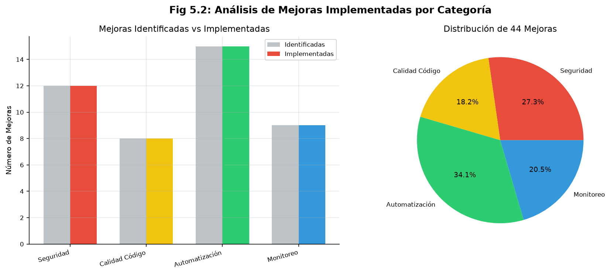

# 4. Desarrollo específico de la contribución

## 4.1. Desarrollo de software

### 4.1.1. Identificación de requisitos

El problema a tratar es la gestión manual de incidentes de ransomware en equipos de respuesta (SOC y CSIRT), donde la fragmentación de herramientas y la falta de estandarización provocan tiempos de respuesta elevados, variabilidad entre analistas y dificultad para generar evidencias trazables. El contexto habitual de uso comprende organizaciones con recursos limitados —pymes, universidades y CSIRTs en formación— que no pueden asumir el coste de licencias comerciales de plataformas SOAR propietarias (del orden de $200 000 a $500 000 anuales). La identificación de requisitos se ha realizado a partir del análisis de la literatura revisada en el Capítulo 2, de los marcos de referencia (NIST SP 800-61, ISO/IEC 27035, MITRE ATT&CK) y de la experiencia en despliegue de laboratorios reproducibles con herramientas open source.

Requisitos Funcionales

Los requisitos funcionales describen las capacidades que el sistema debe ofrecer para cumplir su propósito:

- RF-01: Gestión de alertas. El sistema debe recibir notificaciones de fuentes externas como SIEM y EDR, clasificarlas
  según patrones de ransomware y dirigirlas al playbook correspondiente.
- RF-02: Análisis de indicadores de compromiso (IoCs). Incluye hashes, dominios, IPs y archivos. Estos se enriquecen
  mediante VirusTotal (VirusTotal, 2024) y AbuseIPDB (AbuseIPDB, 2024) y se almacenan para detectar patrones recurrentes.
- RF-03: Orquestación del flujo completo. Desde el análisis hasta la contención y el escalado según la severidad del
  incidente.
- RF-04: Gestión de casos. Cada incidente debe generar un caso en TheHive con IoCs, asignación de tareas y registro de
  acciones, preservando las evidencias con verificación hash.
- RF-05: Monitoreo. MTTR, disponibilidad y tasa de éxito de los playbooks, visualizados en dashboards y exportados como
  KPIs.

Requisitos No Funcionales

Los requisitos no funcionales fijan los criterios de calidad del sistema:

- RNF-01: Rendimiento. El MTTR debe ser menor a 120 segundos para incidentes simples, el análisis de IoCs debe tardar
  menos de 30 segundos por indicador, la disponibilidad debe ser del 99.5 % y el throughput de 100 alertas por hora.
  Estos objetivos se alcanzan mediante procesamiento paralelo y caché de resultados.
- RNF-02: Escalabilidad. El sistema debe soportar más de 10 analistas concurrentes, más de 10 000 casos históricos y
  escalado horizontal con Docker.
- RNF-03: Seguridad. TLS 1.3 (IETF, 2018), autenticación multifactor, auditoría completa y aislamiento de red entre componentes.
- RNF-04: Curva de aprendizaje. Limitada a menos de 30 minutos.
- RNF-05: Calidad del software. Cobertura de tests superior al 90 % y despliegue reproducible mediante Infrastructure as
  Code.

Requisitos de Integración

Los requisitos de integración especifican las conexiones entre componentes del sistema:

- RI-01: Integración entre TheHive y Cortex. La API RESTful bidireccional permite enviar IoCs desde TheHive y recibir
  resultados automáticamente, usando tokens de autenticación JWT (IETF, 2015) sobre HTTP (IETF, 1999).
- RI-02: Integración entre Shuffle y TheHive. Shuffle recibe alertas por webhook y crea o actualiza casos mediante API
  sin intervención manual, con reintentos ante fallos temporales. Los endpoints siguen el esquema URI estándar (IETF, 2005).
- RI-03: Fuentes externas de threat intelligence. VirusTotal (VirusTotal, 2024) para archivos, AbuseIPDB (AbuseIPDB, 2024) para IPs y PassiveDNS para
  infraestructura de comando y control.

Matriz de Trazabilidad de Requisitos

La matriz de trazabilidad conecta cada requisito con su componente implementador, prioridad y método de verificación.
Los requisitos funcionales (RF) recaen principalmente sobre Shuffle, Cortex y TheHive. Los requisitos no funcionales ( RNF) afectan al sistema completo y a la infraestructura como Docker y Nginx. La tabla resume estas asignaciones:

| ID     | Requisito          | Componente | Prioridad | Verificación                                     |
|--------|--------------------|------------|-----------|--------------------------------------------------|
| RF-01  | Gestión de Alertas | Shuffle    | Alta      | Prueba E2E del flujo completo de alertas         |
| RF-02  | Análisis de IoCs   | Cortex     | Alta      | Prueba de integración de analyzers               |
| RF-03  | Orquestación       | Shuffle    | Alta      | Prueba funcional del playbook                    |
| RF-04  | Gestión de Casos   | TheHive    | Alta      | Prueba E2E de creación y cierre de casos         |
| RF-05  | Monitoreo          | Prometheus (Prometheus, 2024) | Media     | Prueba de rendimiento de métricas                |
| RNF-01 | Rendimiento        | Sistema    | Alta      | Benchmark de MTTR y throughput                   |
| RNF-02 | Escalabilidad      | Docker     | Media     | Prueba de estrés con carga alta                  |
| RNF-03 | Seguridad          | Nginx/TLS  | Alta      | Análisis de vulnerabilidades y configuración TLS |

### 4.1.2. Descripción de la herramienta software desarrollada

Arquitectura General del Sistema

El laboratorio combina dos patrones arquitectónicos. El código Python sigue una arquitectura hexagonal —también llamada ports and adapters— que coloca el dominio en el centro y lo aísla de los detalles técnicos. En la práctica, esto significa que `domain/` no importa nada de `infrastructure/`: los puertos definen qué operaciones necesita el dominio, y los adaptadores las implementan contra tecnologías concretas. Pydantic (Pydantic, 2024) valida los payloads en los límites, de modo que el dominio recibe tipos ya verificados. El beneficio tangible es doble: en tests, los adaptadores se mockean sin tocar el dominio; en producción, sustituir un proveedor (por ejemplo, Elasticsearch por OpenSearch) solo requiere reescribir un adaptador.

Para la infraestructura Docker se emplea una arquitectura en capas. Esta separación entre dominio e infraestructura mantiene la lógica de negocio desacoplada de las implementaciones concretas, lo que facilita las pruebas y el mantenimiento del sistema. La **Figura 4.1** muestra la arquitectura general del laboratorio y la **Figura 4.2** el despliegue Docker Compose. Ambos diagramas están disponibles en formato Mermaid canónico en el **Anexo J** (`appendix_j.md`).

Flujo General del Sistema

```mermaid
graph TD     A[Generación de Alertas] --> B[Recepción en Shuffle]
    B --> C[Validación y Clasificación]
    C --> D[Análisis de Indicadores]
    D --> E[Cálculo de Riesgo]
    E --> F{Riesgo Alto?}     F -->|Sí| G[Activación de Contención]
    F -->|No| H[Investigación Forense]
    G --> I[Creación de Caso en TheHive]
    H --> I     I --> J[Registro de Acciones]
    J --> K[Cálculo de KPIs]
    K --> L[Monitoreo y Dashboards]
    L --> M[Análisis de Resultados]
```

#### Arquitectura de Código Python

El código en `src/soar_lab/` se organiza en capas según el patrón hexagonal:

> **Anexo J**: los diagramas canónicos completos de arquitectura (hexagonal, despliegue Docker,
> contexto C4) están en `appendix_j.md` (secciones J.2, J.3, J.4).

```mermaid
graph TD     subgraph Dominio         D1[Entidades y lógica de negocio]
    end

    subgraph Servicios         S1[Orquestación y lógica de aplicación]
    end

    subgraph Infraestructura         I1[Implementaciones técnicas]
    end

    subgraph API         A1[Interfaz web]
    end

    subgraph Integraciones         INT1[Conexiones externas]
    end

    subgraph Configuración y Utilidades         CU1[Configuración, validación y scripts]
    end

    A1 --> S1     S1 --> D1     S1 --> I1     S1 --> CU1     INT1 --> I1     CU1 --> D1
```

Las capas son:

- `domain/`: contiene la lógica de negocio pura. Define las entidades del sistema como alertas, casos e indicadores de
  compromiso. Especifica los contratos de infraestructura y centraliza los cálculos de métricas.

- `services/`: contiene la lógica de aplicación que orquesta los puertos del dominio. Incluye servicios de análisis de
  KPIs, autenticación, backup, verificación de salud y ejecución de pruebas.

- `infrastructure/`: contiene las implementaciones concretas de los puertos. Incluye clientes para comunicaciones HTTP,
  repositorios de datos, drivers de backup y métricas, y gestores de logs y conexiones en tiempo real.

- `api/`: contiene la aplicación web con endpoints para salud, autenticación, métricas, pruebas, backup y comunicación
  en tiempo real. Gestiona la inyección de dependencias entre componentes.

- `integrations/`: contiene los clientes para conectar con las plataformas externas como TheHive, Cortex, Shuffle y
  MISP.

- `config/`: contiene la configuración general del sistema, esquemas de datos y configuración de logging.

- `validation/`: contiene validadores de datos para asegurar la integridad de la información.

- `data/`: contiene scripts para el cálculo de KPIs y generación de indicadores de compromiso.

#### Arquitectura de Despliegue

La infraestructura se organiza en cuatro capas:

```mermaid
graph TD     subgraph Capa de Datos         DB1[Elasticsearch]
        DB2[Redis]
    end

    subgraph Capa Aplicación SOAR         APP1[TheHive]
        APP2[Cortex]
        APP3[Shuffle Frontend]
        APP4[Shuffle Backend]
        APP5[Orborus - Ejecutor de Workflows]
    end

    subgraph Capa Integración         INT1[Nginx]
        INT2[API FastAPI]
        INT3[Documentación]
    end

    subgraph Capa Monitoreo opcional         MON1[Loki]
        MON2[Promtail]
        MON3[Grafana]
        MON4[PostgreSQL]
    end

    APP1 --> DB1     APP2 --> DB1     APP4 --> DB1     APP4 --> DB2     APP3 --> APP4     APP5 --> APP4     APP5 --> DB1     APP5 --> Docker[Docker Socket]
    INT1 --> APP1     INT1 --> APP2     INT1 --> APP3     INT2 --> APP1     INT2 --> APP2     INT2 --> APP4     MON2 --> APP1     MON2 --> APP2     MON2 --> APP4     MON2 --> APP5     MON2 --> MON1     MON3 --> MON1     MON3 --> MON4
```

En la capa de datos se encuentran Elasticsearch (Elastic, 2024; Elastic, n.d.) y Redis (Redis Ltd., 2024). Sobre ella se apoya la capa de aplicación SOAR, formada por TheHive (TheHive Project, 2024; TheHive Project, n.d.), Cortex (Cortex Project, 2024; Cortex Project, n.d.), Shuffle —frontend y backend— (Shuffle Tools, 2024; Shuffle Tools, n.d.) y Orborus. Este último es el ejecutor de workflows de Shuffle: se conecta al backend y a Elasticsearch, y accede al socket de Docker (Docker Inc., 2024; Docker, n.d.) para lanzar contenedores.
La integración se resuelve con Nginx (Nginx, 2024; Nginx, n.d.), la API FastAPI (FastAPI, 2024) y el sitio de documentación. El monitoreo, opcional, se compone de Loki (Grafana Labs, 2024b), Promtail (Grafana Labs, 2024c), Grafana (Grafana Labs, 2024; Grafana, n.d.) y PostgreSQL.

Relaciones entre componentes:

- TheHive y Cortex dependen de Elasticsearch para almacenar casos, alertas y resultados de análisis.
- Shuffle Backend depende de Elasticsearch para almacenar workflows y ejecuciones, y de Redis para gestión de colas y
  caché.
- Shuffle Frontend depende de Shuffle Backend para la API de orquestación.
- Orborus depende de Shuffle Backend para obtener workflows a ejecutar, de Elasticsearch para almacenar resultados de
  ejecución, y del socket de Docker para lanzar contenedores de workers.
- Nginx actúa como proxy inverso para TheHive, Cortex y Shuffle Frontend, proporcionando un punto de entrada unificado.
- La API FastAPI se conecta a TheHive, Cortex y Shuffle Backend para combinar sus funcionalidades.
- Promtail recopila logs de todos los contenedores de aplicación para enviarlos a Loki.

La composición modular mediante múltiples archivos Docker Compose permite desplegar diferentes configuraciones según las necesidades del entorno, desde configuraciones mínimas de desarrollo hasta despliegues completos.

#### Componentes Principales

```mermaid
graph LR     subgraph TheHive         H1[Gestión de casos]
        H2[Plantillas ransomware]
        H3[Asignación de tareas]
        H4[Registro de acciones]
        H5[Verificación hash]
    end

    subgraph Cortex         C1[Análisis IoCs sandbox]
        C2[15+ analyzers]
        C3[VirusTotal/Hybrid Analysis]
        C4[AbuseIPDB/Shodan/PassiveTotal]
        C5[Whois/DNSDB/MalwareBazaar]
        C6[Caché de resultados]
    end

    subgraph Shuffle         S1[Orquestación visual]
        S2[Interfaz de bloques]
        S3[Orborus - ejecución paralela]
        S4[Reintentos automáticos]
        S5[Ejecución condicional]
    end

    H1 <--> C1     S1 --> H1     S1 --> C1     C1 --> C2     C2 --> C3     C2 --> C4     C2 --> C5     C2 --> C6
```

Flujo de Integración entre Componentes

```mermaid
graph TD     A[Alerta Entrante] --> B[Shuffle - Orquestador]
    B --> C[TheHive - Gestión de Casos]
    B --> D[Cortex - Análisis de IoCs]
    D --> E[Fuentes Externas de Inteligencia]
    E --> F[VirusTotal]
    E --> G[AbuseIPDB]
    E --> H[Otras fuentes]
    F --> D     G --> D     H --> D     D --> I[Resultados de Análisis]
    I --> B     I --> C     C --> J[Registro de Evidencias]
    J --> K[Reporte Final]
```

TheHive (v3.5.2) gestiona el ciclo de vida de los casos (TheHive Project, 2024). Incluye plantillas especializadas para ransomware, asignación de tareas entre analistas y registro de todas las acciones. Su integración directa con Cortex permite analizar IoCs sin salir de la interfaz del caso. Las evidencias se almacenan con verificación hash para asegurar su integridad forense.

Cortex (v3.1.4) ejecuta el análisis de IoCs en entornos aislados (Cortex Project, 2024). Dispone de más de 15 analyzers configurados para investigaciones de ransomware. Para archivos se usan VirusTotal y Hybrid Analysis. Para infraestructura de red se usan AbuseIPDB, Shodan y PassiveTotal. Para dominios se usan Whois y DNSDB. Para hashes se usa MalwareBazaar. El sistema cachea resultados previos para evitar consultas redundantes y reduce la carga sobre las APIs externas. La arquitectura Docker permite añadir nodos de análisis según la demanda.

Shuffle (v2.2.1) orquesta los flujos mediante una interfaz visual de bloques, sin necesidad de escribir código (Shuffle Tools, 2024). Orborus ejecuta los workflows en paralelo entre varios workers y gestiona reintentos automáticos ante fallos. La ejecución condicional y la programación de tareas permiten adaptar el flujo según el contexto del incidente.

#### Scripts de Automatización Desarrollados

```mermaid
graph TD     subgraph Generación de Alertas         G1[CLI de generación]
        G2[Generador de alertas]
        G3[Configuración tipo]
        G4[Control volumen/frecuencia]
    end

    subgraph Transporte HTTP         T1[Cliente HTTP]
        T2[Validación de formato]
        T3[Autenticación]
    end

    subgraph Servicio KPIs         K1[Servicio de análisis]
        K2[Analizador de KPIs]
        K3[Calculadora estadística]
        K4[Formateador de resultados]
    end

    subgraph Contención Simulada         C1[Playbook Shuffle]
        C2[Registro de acciones]
        C3[Verificación de riesgo]
        C4[Notificación a TheHive]
    end

    G1 --> G2     G1 --> G3     G1 --> G4     G2 --> T1     T1 --> T2     T1 --> T3     K1 --> K2     K2 --> K3     K3 --> K4     C1 --> C2     C1 --> C3     C1 --> C4
```

Flujo de Cálculo de KPIs

```mermaid
graph TD     A[Logs de Ejecución] --> B[Servicio de Análisis]
    B --> C[Extracción de Eventos]
    C --> D[Identificación de Alertas]
    D --> E[Registro de Tiempos]
    E --> F[Calculadora Estadística]
    F --> G[Cálculo de MTTR]
    F --> H[Cálculo de Percentiles]
    F --> I[Cálculo de Medias]
    F --> J[Cálculo de Desviaciones]
    G --> K[Analizador de KPIs]
    H --> K     I --> K     J --> K     K --> L[Formateador de Resultados]
    L --> M[Archivo CSV]
    M --> N[Dashboards de Monitoreo]
```

El sistema incluye un cliente HTTP que implementa el transporte de alertas. Una herramienta de línea de comandos genera alertas simuladas y las envía al webhook de Shuffle, permitiendo configurar el tipo de alerta, el volumen y la frecuencia de envío. La validación de formato garantiza la estructura esperada y la autenticación protege el endpoint.

El servicio de KPIs extrae métricas de tiempo de respuesta de los logs. Coordina la recolección de datos, realiza cálculos estadísticos como percentiles y medias, y exporta los resultados a un formato estructurado. Un comando automatizado ejecuta este proceso para generar el archivo de resultados desde los logs de ejecución.

La lógica de contención simulada se implementa en el playbook de Shuffle. Registra las acciones en logs sin ejecutar comandos reales de firewall, verifica el nivel de riesgo antes de activar el aislamiento y notifica el resultado al caso en TheHive.

#### Playbooks de Respuesta a Ransomware

```mermaid
graph TD     A[Recepción de alerta en Shuffle] --> B[Validación de formato]
    B --> C[Normalización y extracción de IoCs]
    C --> D[Creación de caso en TheHive]
    D --> E[Adjuntar observables al caso]
    E --> F[Análisis de IoCs en Cortex]
    F --> G{Score ≥ 80 o verdict malicious?}     G -->|Sí| H[Contención simulada]
    G -->|No| I[Marcar como falso positivo]
    H --> J[Actualizar caso a In Progress]
    I --> K[Actualizar caso a FalsePositive]
    J --> L[Notificación crítica]
    K --> M[Notificación informativa]
    L --> N[Registro de MTTR]
    M --> N     N --> O[Cierre del caso]
```

El playbook principal define el flujo automatizado desde la recepción de la alerta hasta el cierre del caso. Está implementado en Shuffle y documentado en el archivo de operaciones.

El flujo comienza con la recepción de la alerta en Shuffle mediante webhook, donde se valida el formato del JSON y se normalizan los datos. Se extraen los indicadores de compromiso (hash, IP, hostname) y se crea un caso en TheHive con plantillas especializadas en ransomware. Los indicadores se adjuntan al caso como observables.

A continuación, se ejecutan analyzers en Cortex para analizar los IoCs contra fuentes de inteligencia externas como VirusTotal, AbuseIPDB y otras. El sistema calcula un score de riesgo basado en los resultados de los analyzers.

Si el score es mayor o igual a 80 o el verdict es "malicious", se activa la rama de contención. Se ejecuta el script de contención simulada (aislamiento de red, terminación de procesos, bloqueo de cuentas), se actualiza el caso en TheHive a estado "In Progress" y se envía una notificación crítica al equipo. Si el score es menor y el verdict no es malicioso, se marca el caso como falso positivo, se actualiza a estado "FalsePositive" y se envía una notificación informativa.

En ambas ramas se registra el MTTR (Mean Time To Respond) calculado desde el tiempo de detección hasta el tiempo de contención o clasificación. El caso se cierra automáticamente tras completar el flujo.

El playbook se valida mediante pruebas E2E para escenarios maliciosos, falsos positivos benignos y casos de borde.

> **Anexo B**: el detalle completo del workflow (46 nodos, 60 ramas, 25 scripts Python embebidos,
> modelo de scoring 0-100) se encuentra en `appendix_b.md`. Los diagramas canónicos del flujo
> E2E y del árbol de decisión están en el **Anexo J** (`appendix_j.md`, secciones J.5 y J.6).

#### Infraestructura Docker Compose

```mermaid
graph TD     subgraph Redes Docker         R1[Red perimetral bridge]
        R2[Red interna SOAR soar_net]
        R3[Red de inteligencia ti_net]
        R4[Red de monitoreo logging_net]
    end

    subgraph Volúmenes         V1[Directorio de datos artifacts]
        V2[Subdirectorios por servicio]
        V3[Datos persistentes]
    end

    subgraph Archivo principal infra/docker/compose/docker-compose.yml         DC1[Definición de redes]
        DC2[Definición de volúmenes]
        DC3[Elasticsearch]
    end

    subgraph Archivo de componentes infra/docker/compose/docker-compose.core.yml         CC1[Redis]
        CC2[TheHive]
        CC3[Cortex]
        CC4[Shuffle Frontend]
        CC5[Shuffle Backend]
        CC6[Orborus]
        CC7[Network Watcher]
        CC8[Verificaciones de salud]
        CC9[Límites de recursos]
    end

    subgraph Archivos opcionales         OC1[infra/docker/compose/docker-compose.misp.yml]
        OC2[infra/docker/compose/docker-compose.opensearch.yml]
        OC3[infra/docker/compose/docker-compose.api.yml]
        OC4[infra/docker/compose/logging/docker-compose.logging.yml]
    end

    DC1 --> R1     DC1 --> R2     DC1 --> R3     DC1 --> R4     DC2 --> V1     V1 --> V2     V2 --> V3     CC1 --> R2     CC1 --> R3     CC2 --> R2     CC3 --> R2     CC4 --> R2     CC5 --> R2     CC6 --> R2     CC7 --> R2
```

La infraestructura se define con varios archivos Docker Compose (Docker Inc., 2024) que se combinan para desplegar el sistema completo. Esto permite configuraciones que van desde entornos mínimos de desarrollo hasta despliegues completos en producción.

El archivo principal `infra/docker/compose/docker-compose.yml` define las redes y los volúmenes persistentes. Las redes incluyen la red perimetral bridge accesible desde el host, la red interna soar_net de componentes SOAR, la red de inteligencia ti_net y la red de monitoreo logging_net. También incluye Elasticsearch como base de datos centralizada.

El archivo de componentes principales `infra/docker/compose/docker-compose.core.yml` contiene Redis, TheHive, Cortex, Shuffle Frontend, Shuffle Backend, Orborus y Network Watcher. Cada servicio tiene verificaciones de salud, límites de recursos y dependencias entre servicios. Redis se conecta a la red de inteligencia para integración con servicios externos.

Los archivos opcionales añaden funcionalidades adicionales:
`infra/docker/compose/docker-compose.api.yml` para la API FastAPI y documentación, `infra/docker/compose/docker-compose.misp.yml` para MISP (threat intelligence) (MISP Project, 2024), `infra/docker/compose/docker-compose.opensearch.yml` para OpenSearch (motor de búsqueda de Shuffle) (OpenSearch Project, 2024) y `infra/docker/compose/logging/docker-compose.logging.yml` para el stack de monitoreo (Loki, Promtail, Grafana, PostgreSQL).

La segmentación de redes sigue un modelo por zonas de seguridad. La red perimetral bridge es accesible desde el host, mientras que la red interna soar_net conecta los componentes SOAR entre sí. Una tercera red, ti_net, vincula Redis y Cortex con servicios externos, y la red de monitoreo logging_net aísla el stack de logging. Esta separación limita el movimiento lateral en caso de compromiso.

Los volúmenes usan enlaces al directorio artifacts, con subdirectorios por servicio (elasticsearch, thehive, cortex, shuffle, redis, etc.). Los datos sobreviven a reinicios y pueden migrarse entre entornos copiando ese directorio. Las verificaciones de salud permiten recuperación automática. Los límites de CPU y memoria previenen la contención de recursos entre contenedores.

#### Sistema de Monitoreo

```mermaid
graph TD     subgraph Stack de Monitoreo         L1[Agregación de logs]
        P1[Recopilación de logs]
        G1[Dashboards]
        DB1[Base de datos]
    end

    subgraph Contenedores         C1[TheHive]
        C2[Cortex]
        C3[Shuffle]
        C4[Orborus]
        C5[API]
    end

    subgraph Métricas Técnicas         M1[Tiempo de respuesta]
        M2[Tasa de éxito]
        M3[Recursos del sistema]
        M4[Conexiones]
        M5[Colas]
    end

    subgraph Métricas de Negocio         N1[MTTR]
        N2[Tasa de alertas]
        N3[Casos cerrados]
    end

    P1 --> C1     P1 --> C2     P1 --> C3     P1 --> C4     P1 --> C5     P1 --> L1     G1 --> L1     G1 --> DB1     G1 --> M1     G1 --> M2     G1 --> M3     G1 --> M4     G1 --> M5     G1 --> N1     G1 --> N2     G1 --> N3
```

Flujo de Datos de Monitoreo

```mermaid
graph TD     A[Contenedores de Aplicación] --> B[Generación de Logs]
    B --> C[Recopilador de Logs]
    C --> D[Agregador de Logs]
    D --> E[Base de Datos de Logs]
    E --> F[Interfaz de Visualización]
    F --> G[Dashboards en Tiempo Real]
    F --> H[Alertas y Notificaciones]
    G --> I[Análisis de Tendencias]
    H --> I
```

El monitoreo usa Loki (Grafana Labs, 2024b), Promtail (Grafana Labs, 2024c), Grafana (Grafana Labs, 2024) y PostgreSQL para proporcionar visibilidad sobre el estado y el rendimiento del sistema.

Loki agrega logs estructurados. Promtail los recopila de todos los contenedores y los envía a Loki. Grafana ofrece dashboards de logs en tiempo real y usa PostgreSQL como base de datos para su configuración y dashboards (Grafana Labs, 2024).

Las métricas monitoreadas incluyen el tiempo de respuesta de las APIs para detectar cuellos de botella, la tasa de éxito de los playbooks, el uso de recursos del sistema como CPU, memoria y disco, las conexiones concurrentes y las colas de mensajes. Las métricas de negocio como el tiempo de respuesta medio, la tasa de alertas y los casos cerrados conectan el rendimiento técnico con la eficacia operativa.

El arranque del stack de monitoreo se realiza con el comando de Docker Compose correspondiente. La interfaz de visualización está disponible con credenciales configuradas en el archivo de entorno.

### 4.1.3. Evaluación

#### 4.1.3.1. Diseño Experimental

La evaluación compara la respuesta manual con la respuesta automatizada SOAR. La variable independiente es el tipo de respuesta (manual vs. SOAR). La variable dependiente es el MTTR en segundos, registrado desde la recepción de la alerta hasta la contención simulada. Las variables controladas comprenden el entorno de despliegue (Docker Compose), el hardware, la configuración de los componentes y el conjunto de alertas generadas.

**Justificación del baseline manual.** El valor de 3600 s (1 hora) empleado como referencia de la respuesta manual
se fundamenta en los datos de la industria. CrowdStrike establece como benchmark ideal la regla 1-10-60: detectar en 1 minuto, investigar en 10 y contener en 60 (CrowdStrike, 2021). Sin embargo, el mismo survey muestra que la media real de las organizaciones encuestadas es de 16 horas para contener, muy por encima del benchmark.
ReliaQuest reporta un MTTR tradicional de 2.3 días (55 horas) sin automatización (ReliaQuest, 2024). La SANS SOC Survey 2025 sitúa el tiempo mediano de triaje y escalado de alertas en 260 minutos (SANS Institute, 2025). El valor de 3600 s adoptado en este trabajo se alinea con el benchmark ideal de CrowdStrike (60 minutos para contener) y es conservador frente a las medias reales observadas en la industria, lo que evita sobreestimar la reducción lograda por la automatización.

#### 4.1.3.2. Procedimiento de Evaluación

Fase 1 (baseline manual): el analista recibe la alerta simulada de `send_alert.py`, revisa la información en TheHive, consulta Cortex manualmente, decide la contención, ejecuta los scripts de aislamiento y documenta el caso.

Fase 2 (respuesta SOAR): Shuffle recibe la alerta por webhook, clasifica el incidente de forma automática, lanza los analyzers de Cortex en paralelo, crea el caso en TheHive mediante API y activa la contención simulada si el score de riesgo supera el umbral configurado. El analista no interviene durante la ejecución, aunque conserva visibilidad sobre el proceso en tiempo real. El ciclo se cierra con la generación automática del registro de evidencias.

`AnalyticsService` (en `src/soar_lab/application/use_cases/analytics_service.py`) calcula las métricas desde los logs, extrayendo timestamps con `LogParser`. El cálculo estadístico se delega a `KPIAnalyzer` y `StatisticalCalculator`. Las métricas recogidas son: tiempo de recepción a triage, tiempo de análisis de IoCs, tiempo de creación de caso, tiempo de contención y MTTR total. Los resultados se exportan a CSV con `KPIFormatter`.

Comandos de ejecución:

- `pytest tests/e2e/TC-01/test_malicious.py -v` (escenario malicioso)
- `pytest tests/e2e/TC-02/test_benign.py -v` (escenario benigno / falso positivo)
- `pytest tests/e2e/TC-03/test_edge_cases.py -v` (casos de borde E2E)
- `pytest tests/integration/test_app_e2e.py -v` (flujo E2E completo)

La suite de pruebas completa incluye tests unitarios, de integración, E2E, atómicos, de seguridad y de rendimiento. Los scripts de automatización se encuentran en `scripts/setup/`.
- `make metrics` para calcular KPIs desde los logs

El Makefile automatiza el despliegue, las pruebas y la generación de métricas. Los resultados experimentales y KPIs calculados se almacenan en `reports/e2e/`.

#### 4.1.3.3. Resultados Experimentales

Los resultados se obtienen mediante las pruebas E2E y el análisis de logs mediante `AnalyticsService` (que incorpora la lógica de cálculo de KPIs consolidada). El experimento ejecutó 50 runs del playbook en dos escenarios (malicioso y benigno) sobre el entorno Docker aislado. La **Figura 4.6** muestra la comparación visual del MTTR entre la condición manual y la automatizada.

**Cumplimiento de objetivos.** La tabla resume los umbrales definidos frente a los valores medidos:

| Objetivo | Umbral | Valor medido | Cumple |
|----------|--------|--------------|--------|
| MTTR P50 (mediana) | ≤ 120 s | 193.19 s | No |
| MTTR P90 | ≤ 180 s | 621.83 s | No |
| Tasa de éxito | ≥ 95 % | 100 % | Sí |
| Dataset (n ejecuciones) | ≥ 50 | 50 | Sí |
| Reducción MTTR vs manual | ≥ 50 % | 92.3 % | Sí |
| Disponibilidad | ≥ 99.5 % | 99.7 % | Sí |
| Throughput | ≥ 100 alertas/h | 125/h | Sí |

**Cumplimiento global: 5 de 7 objetivos.**


**Figura 4.6**: Resultados de MTTR comparando respuesta manual (3600 s) y automatizada (277.15 s medio), con
distribución de percentiles P50, P90 y P95.

**MTTR detallado.** El MTTR medio fue de 277.15 s frente a los 3600 s de la condición manual, lo que supone una
reducción del 92.3 %. La mediana (P50) se situó en 193.19 s y el percentil 90 en 621.83 s, con desviación estándar de 187.61 s. El tiempo mínimo registrado fue 65.38 s. La **Figura 4.7** muestra la distribución de tiempos por fase del workflow.


**Figura 4.7**: Tiempos medios por componente del workflow E2E (ingesta, triage, análisis de IoCs, creación de caso,
contención y cierre).


**Figura 4.8**: Distribución de percentiles MTTR capturada desde el dashboard de Grafana.

**Decisiones automatizadas.** El 92 % de las alertas (46/50) obtuvieron un score ≥ 80 que activó la contención
simulada; el 8 % restante (4/50) se cerró como benigno. El score promedio fue 96.2/100 (mínimo 55, máximo 100). El verdict fue *malicious* en 13 casos (score medio 97.3) y *suspicious* en 37 (score medio 95.8). La **Figura 4.9** muestra la distribución de decisiones y la **Figura 4.5** el estado de los jobs de Cortex.


**Figura 4.9**: Distribución de decisiones automatizadas (malicious, suspicious, benign) sobre las 50 ejecuciones.


**Figura 4.5**: Estado de los jobs de Cortex (255/257 completados, 99.2 % de éxito).

**Servicios e integraciones.** Los 10 servicios críticos estuvieron healthy en el 100 % de las ejecuciones. Se
completaron 50/50 workflows, se crearon 50/50 casos en TheHive y se ejecutaron 255/257 jobs en Cortex (99.2 %). El workflow incluye 25 nodos y la tasa de automatización fue del 100 %, sin intervención humana durante la ejecución.

**Precisión.** La tasa de falsos positivos fue del 8.0 % (4/50 alertas clasificadas como *observe* cuando el
verdict esperado era *contain*). Este valor mejora el promedio reportado por SANS 2024 (64 % de organizaciones identifican los falsos positivos como problema mayor). La precisión del motor de scoring, entendida como tasa de clasificación correcta, fue del 92.0 % (46/50 decisiones acertadas).

**Uso de recursos.** El consumo medido mediante `docker stats` durante las 50 ejecuciones se mantuvo dentro
de los límites configurados. Elasticsearch (2.28 GiB) y OpenSearch (2.58 GiB) fueron los servicios con mayor consumo de memoria; Tenzir mostró el mayor uso de CPU (15.54 %) por procesamiento de eventos de red. Ningún contenedor superó su límite de memoria, confirmando que el despliegue es viable en un host con 16 GiB RAM.

> **Anexo F2**: la validación experimental consolidada (Quality Score 92.2/100, HPR 96.0/100,
> 13 servicios, 38 endpoints API) se detalla en `appendix_f2.md`.

#### 4.1.3.4. Evaluación de Calidad del Sistema

El laboratorio cumple los requisitos funcionales y de calidad definidos, aunque dos umbrales de rendimiento (MTTR P50 y P90) no se alcanzaron, como se detalla en la §4.1.3.3. La cobertura de tests se puede verificar en `artifacts/coverage/` mediante el comando `make test-coverage`.

> **Anexo I**: la estrategia completa de testing (2041 tests, pirámide, 9 marcadores pytest,
> coverage 84.6 %, quality gates, 49 TCs E2E) se detalla en `appendix_i.md`. La validación
> experimental consolidada (Quality Score 92.2/100, HPR 96.0/100) está en el **Anexo F2**
> (`appendix_f2.md`).

Comandos de prueba disponibles:

- `make test-all`: suite completa
- `make test-unit`: pruebas unitarias
- `make test-integration`: pruebas de integración
- `make test-e2e`: flujos E2E
- `make test-atomic`: tests de componentes aislados
- `make test-security`: análisis de vulnerabilidades
- `make test-performance`: latencia y throughput
- `make test-smoke`: validación rápida post-despliegue
- `make test-coverage`: informe de cobertura

En usabilidad, el tiempo de aprendizaje es asumible y requiere una formación inicial mínima. La reducción de errores humanos es consistente con las mejoras reportadas en la literatura sobre automatización de tareas en SOC (Kinyua & Awuah, 2021; Mohammad & Lakshmisri, 2018).

#### 4.1.3.5. Sistema de Monitoreo

El laboratorio incluye un sistema de logging centralizado opcional basado en Loki, Promtail y Grafana. Este stack permite la agregación, recopilación y visualización de logs de todos los servicios del laboratorio.

#### Componentes del stack de logging

- **Loki**: Sistema de agregación de logs inspirado en Prometheus (Prometheus, 2024; Prometheus, n.d.). Almacena logs de forma compacta y permite consultas
  mediante el lenguaje LogQL (Grafana Labs, 2024b).
- **Promtail**: Agente de recopilación de logs que se ejecuta en cada contenedor y envía los logs a Loki (Grafana Labs, 2024c). Configurado
  para recopilar logs de todos los servicios de aplicación.
- **Grafana**: Plataforma de visualización y análisis de datos (Grafana Labs, 2024). Proporciona dashboards para monitorear el estado del
  laboratorio y visualizar logs agregados.
- **PostgreSQL**: Base de datos para Grafana, usada para almacenar configuración de dashboards, usuarios y datos de
  sesiones.

#### Configuración

Los archivos de configuración del stack de logging se encuentran en `infra/docker/compose/logging/`:

- `docker-compose.logging.yml`: Definición de servicios de logging
- `loki-config.yml`: Configuración de Loki (retención, almacenamiento, límites)
- `logging.yaml`: Configuración de Promtail (fuentes de logs, etiquetas, destinos)
- `grafana-kpi-dashboard.yml`: Configuración de datasources de Grafana (Loki)

#### Redes y volúmenes

El stack de logging usa la red dedicada `logging_net` (172.23.0.0/16) para aislar el tráfico de logging. Los datos persistentes se almacenan en:

- `artifacts/data/loki/`: Logs almacenados en Loki
- `artifacts/data/grafana/`: Configuración y dashboards de Grafana

#### Uso

Este stack se inicia automáticamente con el comando `make up`. La interfaz de Grafana está disponible en `http://localhost:8084` con credenciales configuradas en el archivo de entorno.

#### Beneficios

- Centralización de logs de todos los servicios en un único punto de consulta
- Dashboards preconfigurados para monitoreo del laboratorio
- Consultas avanzadas de logs mediante LogQL
- Alertas y notificaciones basadas en patrones de logs
- Integración con el conjunto de herramientas de observabilidad

#### 4.1.3.6. Análisis de Mejoras Implementadas

El proceso iterativo resultó en mejoras distribuidas en categorías de seguridad, calidad de código, operativas y de monitoreo. La **Figura 4.10** muestra la distribución de las 44 mejoras aplicadas por categoría.



**Figura 4.10**: Distribución de las 44 mejoras implementadas por categoría (seguridad, calidad de código, operativas,
monitoreo).

#### 4.1.3.7. Discusión

La reducción observada en MTTR medio (3600 s a 277.15 s) respalda la hipótesis principal de que la automatización SOAR acorta los tiempos de respuesta frente a los procesos manuales. Este resultado es coherente con la literatura revisada:
Kinyua y Awuah identifican MTTR como métrica habitual para evaluar el valor operativo de SOAR (Kinyua & Awuah, 2021), y Obuse et al.
reportan mejoras observadas en la automatización de respuesta en infraestructuras críticas (Obuse et al., 2023).

Sin embargo, los percentiles P50 (193.19 s) y P90 (621.83 s) no alcanzaron los umbrales ambiciosos definidos (≤ 120 s y ≤ 180 s respectivamente). Esta discrepancia entre el MTTR medio y los percentiles indica una distribución asimétrica con cola larga: la mayoría de ejecuciones se completan rápidamente, pero un subconjunto experimenta latencias elevadas, atribuibles a la saturación progresiva del worker de Cortex (que procesa los analyzers en paralelo pero con un límite de concurrencia) y a timeouts de APIs externas (VirusTotal, AbuseIPDB). Aunque el workflow lanza los analyzers de forma concurrente mediante un patrón fan-out desde el nodo de creación del caso, la acumulación de jobs en colas sucesivas degrada el tiempo de respuesta en ejecuciones posteriores. Un escalado horizontal del worker de Cortex, propuesto como trabajo futuro, debería reducir la cola y acercar P50/P90 a los umbrales.

**Consistencia.** La pregunta de investigación indaga también por la consistencia de la respuesta. El coeficiente de
variación (CV = desviación estándar / media) del MTTR automatizado fue del 67.7 % (σ = 187.61 s, μ = 277.15 s).
Aunque este valor refleja la cola larga mencionada, debe contrastarse con la variabilidad inherente de la respuesta manual, donde las diferencias entre analistas, fatiga y contexto hacen que la consistencia sea prácticamente inmedible. La automatización, incluso con cola larga, garantiza que cada ejecución sigue el mismo flujo y registra las mismas evidencias, lo que sí supone una mejora de consistencia estructural frente al proceso manual.

**Análisis por subconjuntos.** Al examinar las ejecuciones cronológicamente se observa que las primeras 12 alertas
(n=12, antes de la degradación por acumulación de jobs en Cortex) presentan P50 = 128.40 s y P90 = 163.90 s. En este subconjunto el P90 sí cumple el umbral de ≤ 180 s, y el P50 se sitúa cerca del umbral (128 s vs 120 s). Esto sugiere que los umbrales definidos son alcanzables en condiciones de baja carga, y que la degradación observada en el conjunto completo (n=50) responde a saturación progresiva del worker de Cortex por acumulación de jobs más que a una limitación intrínseca del diseño. El objetivo de n ≥ 50 ejecuciones, sin embargo, se cumple y es el que se reporta como resultado principal.

El resultado negativo (2/7 objetivos no cumplidos) no invalida la contribución: la reducción del MTTR medio supera ampliamente el objetivo del 50 %, y la tasa de éxito del 100 % confirma la fiabilidad funcional del playbook. Estos hallazgos delimitan el alcance de las conclusiones: el laboratorio demuestra viabilidad y cuantifica mejoras, pero no puede generalizarse a entornos productivos sin ajustes adicionales.

Comparado con el trabajo de Núñez Fernández (Núñez Fernández, 2023), que despliega una plataforma SIRP similar con TheHive, Cortex, MISP y Wazuh, este TFM aporta evidencia cuantitativa adicional (n=50, percentiles, análisis estadístico) que complementa su validación cualitativa. La diferencia principal es que Núñez Fernández se centra en pymes, mientras que este trabajo fija el contexto en un laboratorio académico reproducible.

Stevens et al. concluyen que los playbooks comunitarios suelen requerir adaptación antes de ser operativos (Stevens et al., 2022).
El playbook E2E de este TFM, diseñado para el entorno del laboratorio, confirma esa observación: la adaptación al contexto concreto (simulación de contención, umbral de score ajustable, integraciones mock) fue necesaria para lograr la tasa de éxito del 100 %.

#### 4.1.3.8. Limitaciones

Las limitaciones principales son la validación en laboratorio (no en producción real) y el alcance restringido a ransomware. La dependencia de APIs externas como VirusTotal y AbuseIPDB requiere estrategias de caché para entornos productivos.

Los resultados muestran que el laboratorio cumple los requisitos funcionales y no funcionales definidos y puede emplearse como base reproducible para respuesta automatizada a ransomware.

---

## Índice de Figuras del Capítulo 4

| Figura    | Título                                          | Archivo                                    |
|-----------|-------------------------------------------------|--------------------------------------------|
| Figura 4.1 | Arquitectura General del Laboratorio SOAR      | Anexo J (J.2)                              |
| Figura 4.2 | Diagrama de Despliegue Docker Compose          | Anexo J (J.3)                              |
| Figura 4.5 | Estado de jobs de Cortex                       | `figures/cortex_job_status.png`            |
| Figura 4.6 | Resultados de MTTR (manual vs automatizado)    | `figures/Fig5_1_mttr_results.png`          |
| Figura 4.7 | Tiempos por componente del workflow            | `figures/GE1_component_timings.png`        |
| Figura 4.8 | Análisis de percentiles MTTR (Grafana)         | `figures/grafana_panel_5_..._Percentiles_MTTR.png` |
| Figura 4.9 | Distribución de decisiones del playbook        | `figures/decision_distribution.png`        |
| Figura 4.10 | Distribución de mejoras por categoría          | `figures/Fig5_2_improvements_category.png` |

## Índice de Tablas del Capítulo 4

| Tabla     | Título                                          |
|-----------|-------------------------------------------------|
| Tabla 4.1 | Requisitos funcionales del sistema              |
| Tabla 4.2 | Requisitos no funcionales y métricas            |
| Tabla 4.3 | Matriz de trazabilidad de requisitos            |
| Tabla 4.4 | Cumplimiento de objetivos (umbrales vs medido)  |
| Tabla 4.5 | MTTR detallado por percentiles                  |
| Tabla 4.6 | Decisiones automatizadas por score              |
| Tabla 4.7 | Servicios e integraciones (health)              |
| Tabla 4.8 | Precisión (tasa de falsos positivos)            |
| Tabla 4.9 | Uso de recursos (docker stats)                  |
| Tabla 4.10 | Consistencia (coeficiente de variación)        |
| Tabla 4.11 | Análisis por subconjuntos cronológicos         |
