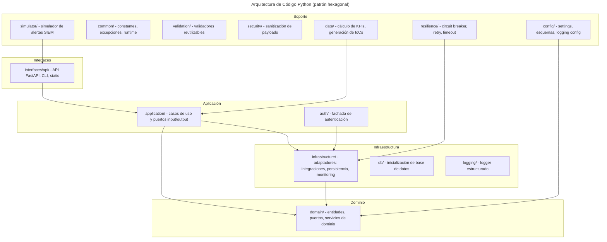
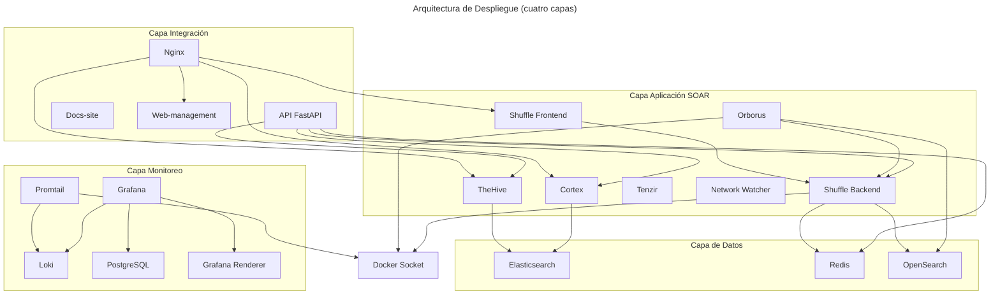
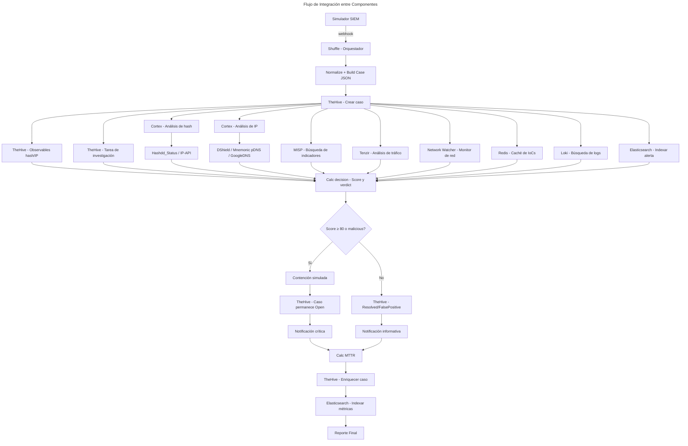
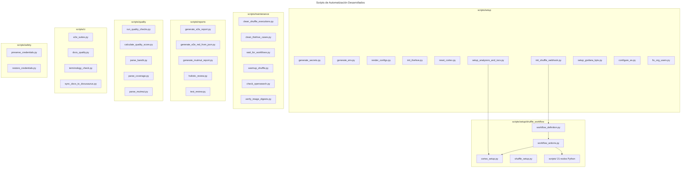
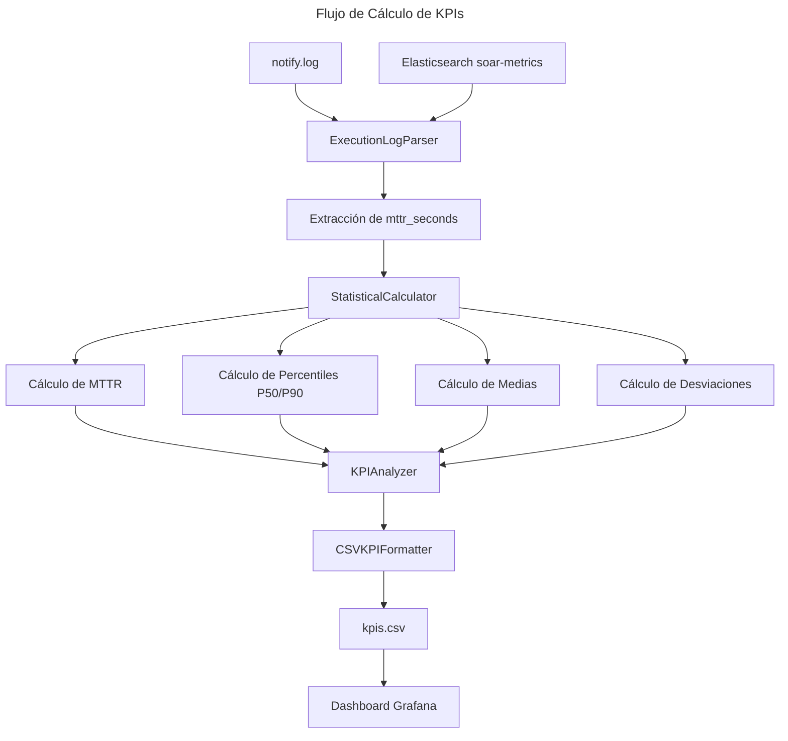
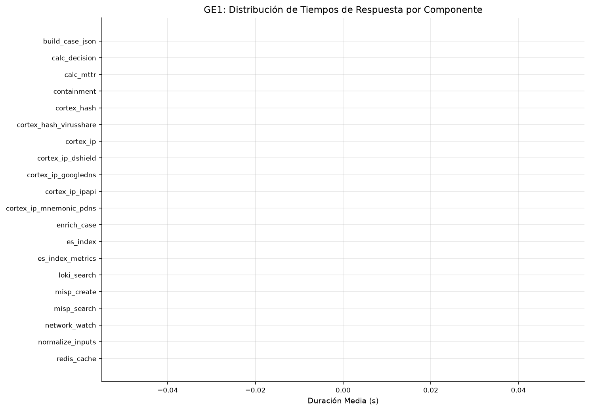
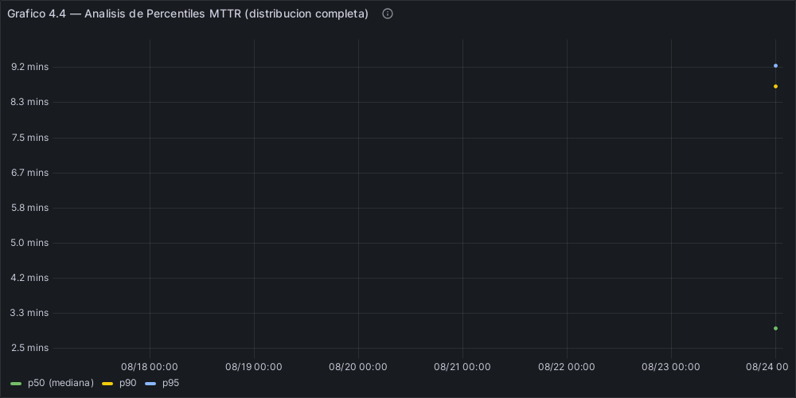
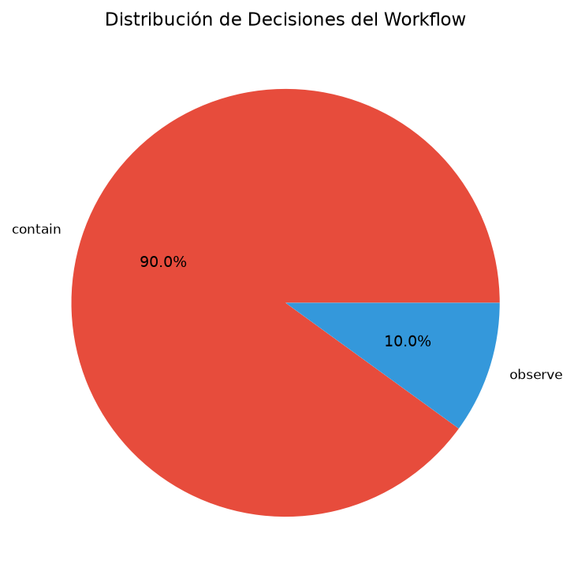
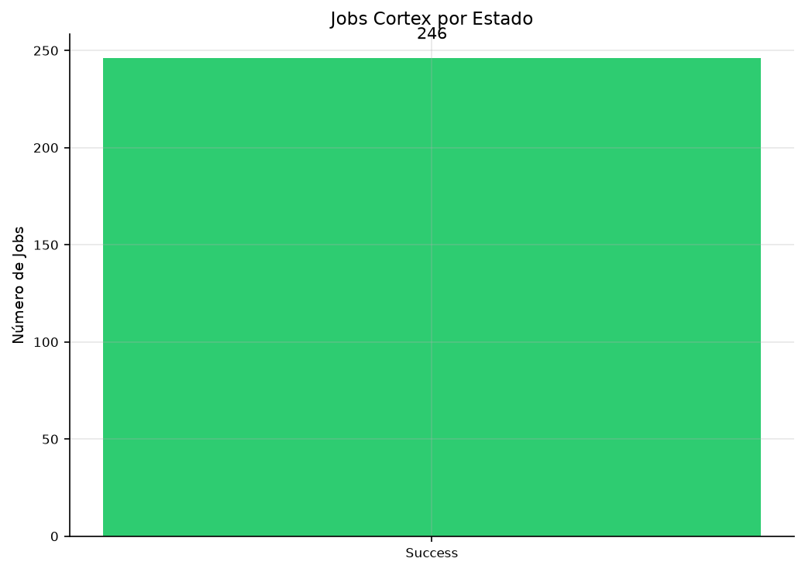

# 4. Desarrollo específico de la contribución

## 4.1. Desarrollo de software

### 4.1.1. Identificación de requisitos

El problema abordado es la gestión manual de incidentes de ransomware en equipos de respuesta (SOC y CSIRT), donde la fragmentación de herramientas provoca tiempos de respuesta elevados, variabilidad entre analistas y dificultad para generar evidencias trazables. El contexto de uso comprende organizaciones con recursos limitados (pymes, universidades y CSIRTs en formación) que no pueden asumir licencias comerciales de plataformas SOAR propietarias. Los requisitos se han identificado a partir de la literatura revisada en el Capítulo 2, los marcos de referencia (NIST SP 800-61, ISO/IEC 27035, MITRE ATT&CK) y la experiencia en despliegue de laboratorios reproducibles con herramientas open source.

Requisitos Funcionales

Los requisitos funcionales describen las capacidades que el sistema debe ofrecer para cumplir su propósito:

- RF-01: Gestión de alertas. El sistema debe recibir notificaciones de fuentes externas (SIEM, EDR), clasificarlas
  según patrones de ransomware y dirigirlas al playbook correspondiente.
- RF-02: Análisis de indicadores de compromiso (IoCs). Hashes, dominios, IPs y archivos se enriquecen mediante analyzers
  libres de Cortex (sin API key requerida) y se almacenan en Elasticsearch para detectar patrones recurrentes.
- RF-03: Orquestación del flujo completo. Desde el análisis hasta la contención simulada y el escalado según la
  severidad del incidente.
- RF-04: Gestión de casos. Cada incidente debe generar un caso en TheHive con IoCs, etiquetas y registro de
  acciones, preservando las evidencias.
- RF-05: Monitoreo. MTTR, tasa de éxito y KPIs del playbook, visualizados en Grafana mediante logs agregados por
  Loki y Promtail, con datos indexados en Elasticsearch.
- RF-06: Simulador de alertas. Un módulo generador debe producir alertas maliciosas y benignas con IoCs realistas
  hacia el webhook de Shuffle, permitiendo repetir el experimento sin dependencias externas.
- RF-07: Contención simulada. El sistema debe ejecutar acciones de contención simulada (aislamiento de endpoint,
  bloqueo de IP) mediante endpoints mock que registran la intención sin aplicar cambios reales.
- RF-08: API REST de gestión. Una API FastAPI debe exponer endpoints para health, autenticación, backup, métricas
  analíticas, estado de servicios y operaciones SOAR, con documentación OpenAPI automática.
- RF-09: Cálculo de métricas estadísticas. El sistema debe calcular MTTR (media, mediana, percentiles p50 y p90),
  desviación estándar y coeficiente de variación a partir de las ejecuciones del playbook.

Requisitos No Funcionales

Los requisitos no funcionales fijan los criterios de calidad del sistema:

- RNF-01: Rendimiento. Reducción del MTTR ≥ 50 % respecto al baseline manual, con medición de percentiles p50 y p90
  sobre 50 ejecuciones por escenario.
- RNF-02: Reproducibilidad. Despliegue reproducible mediante Docker Compose y Makefile, con `make up` como único punto
  de entrada y `make generate-secrets` para la generación de credenciales.
- RNF-03: Seguridad. Aislamiento de red entre componentes, secretos gestionados mediante variables de entorno,
  autenticación JWT para la API, sanitización de payloads de entrada y certificados TLS autofirmados para el tráfico
  externo.
- RNF-04: Calidad del software. Suite de tests automatizada con pytest (2041 tests) y despliegue verificable con
  `make test-e2e`.
- RNF-05: Resiliencia. Circuit breaker y reintentos con backoff exponencial en las integraciones entre componentes
  para manejar fallos transitorios sin perder la alerta.
- RNF-06: Observabilidad. Health checks por servicio, logs estructurados agregados en Loki y dashboards de Grafana
  con métricas en tiempo real.

Requisitos de Integración

Los requisitos de integración especifican las conexiones entre componentes del sistema:

- RI-01: Integración entre TheHive y Cortex. Los observables creados en TheHive se envían a Cortex para su análisis
  mediante analyzers configurados, y los resultados se devuelven automáticamente.
- RI-02: Integración entre Shuffle y TheHive. Shuffle recibe alertas por webhook y crea o actualiza casos mediante API
  sin intervención manual, con reintentos ante fallos temporales.
- RI-03: Fuentes externas de threat intelligence. Analyzers libres de Cortex para reputación de IPs (DShield),
  resolución DNS (GoogleDNS) y passive DNS (Mnemonic pDNS) para infraestructura de comando y control.
- RI-04: Integración opcional con MISP. Intercambio de indicadores de amenazas con MISP para enriquecimiento
  adicional, sin ser requisito para la ejecución del playbook E2E.

Matriz de Trazabilidad de Requisitos

La matriz de trazabilidad conecta cada requisito con su componente implementador, prioridad y método de verificación:

| ID     | Requisito          | Componente | Prioridad | Verificación                                     |
|--------|--------------------|------------|-----------|--------------------------------------------------|
| RF-01  | Gestión de Alertas | Shuffle    | Alta      | Prueba E2E del flujo completo de alertas         |
| RF-02  | Análisis de IoCs   | Cortex     | Alta      | Prueba de integración de analyzers               |
| RF-03  | Orquestación       | Shuffle    | Alta      | Prueba funcional del playbook                    |
| RF-04  | Gestión de Casos   | TheHive    | Alta      | Prueba E2E de creación y cierre de casos         |
| RF-05  | Monitoreo          | Loki/Grafana | Media   | Verificación de métricas en dashboard            |
| RF-06  | Simulador          | Python/simulator | Alta | Pruebas E2E y de carga usan el simulador    |
| RF-07  | Contención simulada | FastAPI   | Alta      | Endpoint `/api/v1/contain` en `routes_services` |
| RF-08  | API REST           | FastAPI    | Media     | Pruebas de integración de API                    |
| RF-09  | Métricas estadísticas | Python/domain | Alta | Resultados en `reports/e2e/` (n=50)          |
| RNF-01 | Rendimiento        | Sistema    | Alta      | Benchmark de MTTR (n=50 por escenario)           |
| RNF-02 | Reproducibilidad   | Docker     | Alta      | `make up` + `pytest tests/e2e/`                  |
| RNF-03 | Seguridad          | Docker/Nginx/FastAPI | Media | Revisión de config, JWT, sanitización    |
| RNF-04 | Calidad            | pytest     | Media     | Suite de tests (2041 tests)                      |
| RNF-05 | Resiliencia        | Python/resilience | Media | Prueba unit de circuit breaker             |
| RNF-06 | Observabilidad     | Loki/Grafana | Media   | Health checks y dashboards                       |
| RI-01  | TheHive ↔ Cortex   | TheHive/Cortex | Alta  | Prueba de integración de observables             |
| RI-02  | Shuffle ↔ TheHive  | Shuffle/TheHive | Alta | Prueba E2E de webhook y creación de casos        |
| RI-03  | Threat intelligence | Cortex    | Media     | Verificación de analyzers libres                 |
| RI-04  | MISP (opcional)    | MISP       | Baja      | `docker-compose.misp.yml` disponible             |

La **Tabla 4** resume el estado de cumplimiento de los requisitos.

## Tabla 4: Estado de Cumplimiento de Requisitos

| ID     | Tipo   | Requisito                     | Métrica de Verificación  | Estado             |
|--------|--------|-------------------------------|--------------------------|--------------------|
| RF-01  | **F**  | Gestión de alertas ransomware | 100% alertas procesadas  | Cumplido           |
| RF-02  | **F**  | Análisis automático IoCs      | Analyzers libres Cortex  | Cumplido           |
| RF-03  | **F**  | Orquestación playbook         | 1 playbook E2E, 2 escenarios | Cumplido      |
| RF-04  | **F**  | Gestión de casos              | Integración TheHive      | Cumplido           |
| RF-05  | **F**  | Monitoreo                     | Dashboard Grafana + Loki | Cumplido           |
| RF-06  | **F**  | Simulador de alertas          | E2E + pruebas de carga   | Cumplido           |
| RF-07  | **F**  | Contención simulada           | Endpoint mock FastAPI    | Cumplido           |
| RF-08  | **F**  | API REST de gestión           | Tests de integración API | Cumplido           |
| RF-09  | **F**  | Métricas estadísticas         | Resultados n=50 en `reports/e2e/` | Cumplido   |
| RNF-01 | **NF** | Reducción MTTR ≥ 50%          | 92.3% (n=50)             | Cumplido           |
| RNF-02 | **NF** | Reproducibilidad              | `make up` + tests E2E    | Cumplido           |
| RNF-03 | **NF** | Seguridad                     | Aislamiento, JWT, sanitización | Cumplido     |
| RNF-04 | **NF** | Calidad                       | 2041 tests automatizados | Cumplido           |
| RNF-05 | **NF** | Resiliencia                   | Circuit breaker + retry  | Cumplido           |
| RNF-06 | **NF** | Observabilidad                | Health checks + Loki     | Cumplido           |
| RI-01  | **I**  | TheHive ↔ Cortex              | Observables enriquecidos | Cumplido           |
| RI-02  | **I**  | Shuffle ↔ TheHive             | Webhook + API            | Cumplido           |
| RI-03  | **I**  | Threat intelligence           | Hashdd_Status, IP-API, DShield, Mnemonic pDNS, GoogleDNS, DomainMailSPFDMARC, ValidateObservable | Cumplido  |
| RI-04  | **I**  | MISP (opcional)               | `docker-compose.misp.yml` | Opcional          |


### 4.1.2. Descripción de la herramienta software desarrollada

Arquitectura General del Sistema

El laboratorio combina dos patrones arquitectónicos. El código Python sigue una arquitectura hexagonal (ports and adapters) que aísla el dominio de los detalles técnicos: `domain/` no importa nada de `infrastructure/`, los puertos definen qué operaciones necesita el dominio y los adaptadores las implementan contra tecnologías concretas. Pydantic (Pydantic, 2024) valida los payloads en los límites. El beneficio es doble: en tests, los adaptadores se mockean sin tocar el dominio; en producción, sustituir un proveedor (por ejemplo, Elasticsearch por OpenSearch) solo requiere reescribir un adaptador.

Para la infraestructura Docker se emplea una arquitectura en capas que mantiene la lógica de negocio desacoplada de las implementaciones concretas. La **Figura 3** muestra la arquitectura general y la **Figura 4** el despliegue Docker Compose, ambos en formato Mermaid canónico en el **Anexo H** (sección H.1).

Flujo General del Sistema

```mermaid
---
title: Flujo General del Sistema
---
graph TD     A[Generación de Alertas] --> B[Recepción en Shuffle]
    B --> C[Validación y Clasificación]
    C --> D[Análisis de Indicadores]
    D --> E[Cálculo de Riesgo]
    E --> F{Riesgo Alto?}     F -->|Sí| G[Activación de Contención]
    F -->|No| H[Marcar como falso positivo]
    G --> I[Creación de Caso en TheHive]
    H --> I     I --> J[Registro de Acciones]
    J --> K[Cálculo de KPIs]
    K --> L[Monitoreo y Dashboards]
    L --> M[Análisis de Resultados]
```

#### Arquitectura de Código Python

El código en `src/soar_lab/` se organiza según el patrón hexagonal: el dominio en el centro, aislado de infraestructura y frameworks. Los diagramas canónicos completos están en el **Anexo H** (secciones H.2, H.3 y H.4).



Las capas son:

- `domain/`: lógica de negocio pura. Define entidades (alertas, casos, IoCs), puertos (contratos de infraestructura) y servicios de dominio (cálculos de métricas).
- `application/`: casos de uso que orquestan los puertos del dominio (análisis de KPIs, autenticación, backup, salud, pruebas).
- `auth/`: fachada que re-exporta `AuthService` para acceso desde la API.
- `infrastructure/`: adaptadores concretos de los puertos. Incluye `integrations/` (clientes de TheHive, Cortex, Shuffle, MISP), `persistence/`, `monitoring/`, `messaging/`, `network_watcher/`, `security/` y `templates/`.
- `interfaces/`: API FastAPI (`api/`), CLI y recursos estáticos. Gestiona la inyección de dependencias.
- `config/`: settings, esquemas de datos y configuración de logging.
- `common/`: constantes, excepciones y utilidades de runtime compartidas.
- `validation/`: validadores de datos reutilizables.
- `security/`: sanitización de payloads de entrada.
- `resilience/`: circuit breaker, retry con backoff y timeout para integraciones.
- `simulator/`: simulador de alertas SIEM (maliciosas y benignas).
- `data/`: scripts para cálculo de KPIs y generación de IoCs.
- `db/`: inicialización y gestión de transacciones de base de datos.
- `logging/`: wrapper de logger estructurado.

#### Arquitectura de Despliegue

La infraestructura se organiza en cuatro capas:



La capa de datos incluye Elasticsearch (Elastic, 2024; Elastic, n.d.) para TheHive y Cortex, Redis (Redis Ltd., 2024) para colas y caché, y OpenSearch (OpenSearch Project, 2024) como motor de búsqueda de Shuffle. La capa de aplicación SOAR la forman TheHive (TheHive Project, 2024; TheHive Project, n.d.), Cortex (Cortex Project, 2024; Cortex Project, n.d.), Shuffle (frontend y backend) (Shuffle Tools, 2024; Shuffle Tools, n.d.), Orborus (ejecutor de workflows que accede al socket de Docker (Docker Inc., 2024; Docker, n.d.) para lanzar contenedores), Tenzir (procesamiento de eventos de red) y Network Watcher (monitor de la red soar_net). La capa de integración incluye Nginx (Nginx, 2024; Nginx, n.d.) como proxy inverso, la API FastAPI (FastAPI, 2024), el sitio de documentación y la interfaz web de gestión. El monitoreo usa Loki (Grafana Labs, 2024b), Promtail (Grafana Labs, 2024c), Grafana (Grafana Labs, 2024; Grafana, n.d.) con PostgreSQL como base de datos y Grafana Renderer para exportación de paneles.

Flujo de Integración entre Componentes



TheHive (v3.5.2) gestiona el ciclo de vida de los casos (TheHive Project, 2024) con plantillas especializadas para ransomware, asignación de tareas y registro de acciones. Su integración con Cortex permite analizar IoCs sin salir de la interfaz del caso. Las evidencias se almacenan con verificación hash para asegurar su integridad forense.

Cortex (v3.2.0) analiza IoCs en entornos aislados (Cortex Project, 2024) con 7 analyzers libres sin API key: Hashdd_Status (hashes), IP-API y DShield (IPs), GoogleDNS y DomainMailSPFDMARC (dominios), Mnemonic pDNS (passive DNS) y ValidateObservable (validación). El sistema cachea resultados para evitar consultas redundantes. La **Tabla 5** lista los analyzers con su tipo y uso en el playbook.

## Tabla 5: Analyzers Cortex Configurados

| Analyzer              | Tipo     | API Key | Uso en Playbook   |
|-----------------------|----------|---------|-------------------|
| **Hashdd_Status**     | Hash     | No      | Status lookup de hashes |
| **IP-API**            | IP       | No      | Geolocalización de IP |
| **DShield**           | IP       | No      | Reputación SANS ISC |
| **Mnemonic pDNS**     | Domain/IP| No      | Passive DNS |
| **GoogleDNS**         | Domain   | No      | Resolución DNS |
| **DomainMailSPFDMARC**| Domain   | No      | SPF/DMARC lookup |
| **ValidateObservable**| Multiple | No      | Validación de observables |

La selección prioriza analyzers libres sin API key (RF-02). Todos están integrados en el playbook, enriqueciendo cada IoC detectado.

Shuffle (v2.2.1) orquesta los flujos mediante una interfaz visual de bloques (Shuffle Tools, 2024). Orborus ejecuta workflows en paralelo entre workers y gestiona reintentos automáticos. La ejecución condicional y la programación de tareas permiten adaptar el flujo al contexto del incidente.

#### Scripts de Automatización Desarrollados



Flujo de Cálculo de KPIs



El repositorio incluye 80+ scripts Python organizados en 7 categorías bajo `scripts/`. La categoría `setup/` (18 scripts) orquesta el arranque completo: `generate_secrets.py` genera claves, `render_configs.py` renderiza configuración desde plantillas, `init_thehive.py` y `reset_cortex.py` inicializan servicios, `init_shuffle_webhook.py` crea el workflow completo en Shuffle, y `setup_analyzers_and_iocs.py` instala los analyzers de Cortex y carga IoCs en MISP. El subpaquete `shuffle_workflow/` contiene la definición del workflow (46 nodos, 60 ramas) y 21 scripts Python embebidos que se ejecutan dentro de Shuffle.

La categoría `maintenance/` (6 scripts) incluye `clean_shuffle_executions.py` para limpiar workflows stale, `wait_for_workflows.py` para sincronizar tests E2E, y `verify_image_digests.py` para verificar digests de imágenes Docker. `reports/` (5 scripts) genera informes de tests E2E, mutmut y revisión holística. `quality/` (9 scripts) parsea resultados de bandit, coverage, mutmut, pylint, radon, ruff y vulture. `ci/` (4 scripts) gestiona suites E2E, calidad de docs y sincronización con Docusaurus. `safety/` preserva y restaura credenciales entre resets.

El simulador de alertas (`src/soar_lab/simulator/simulate_alerts.py`) genera alertas de ransomware con IoCs realistas (hashes SHA256 de CISA, IPs C2, técnicas MITRE ATT&CK) y las envía al webhook de Shuffle vía HTTP, permitiendo configurar tipo, volumen y frecuencia. La contención simulada se implementa en el playbook de Shuffle: registra acciones en logs sin ejecutar comandos reales, verifica el riesgo antes del aislamiento y notifica el resultado al caso en TheHive.

#### Playbooks de Respuesta a Ransomware

```mermaid
---
title: Playbook de Respuesta a Ransomware
---
graph TD     A[Recepción de alerta en Shuffle] --> B[Validación de formato]
    B --> C[Normalización y extracción de IoCs]
    C --> D[Creación de caso en TheHive]
    D --> E[Adjuntar observables al caso]
    E --> F[Análisis de IoCs en Cortex]
    F --> G{Score ≥ 80 o verdict malicious?}     G -->|Sí| H[Contención simulada]
    G -->|No| I[Marcar como falso positivo]
    H --> J[Caso permanece Open]
    I --> K[TheHive - Resolved/FalsePositive]
    J --> L[Notificación crítica]
    K --> M[Notificación informativa]
    L --> N[Registro de MTTR]
    M --> N     N --> O[Cierre del caso]
```

El playbook principal define el flujo automatizado desde la recepción de la alerta hasta el cierre del caso, implementado en Shuffle.

El flujo comienza con la recepción de la alerta por webhook, donde se valida el formato JSON y se normalizan los datos. Se extraen los IoCs (hash, IP, hostname) y se crea un caso en TheHive con plantillas ransomware, adjuntando los indicadores como observables.

A continuación, Cortex ejecuta analyzers contra fuentes externas (Hashdd_Status, DShield, IP-API, etc.) y el sistema calcula un score de riesgo.

Si el score >= 80 o el verdict es "malicious", se activa la contención simulada (aislamiento de red, terminación de procesos, bloqueo de cuentas), el caso permanece en estado "Open" (TheHive 5 no soporta "InProgress" como status) y se envía una notificación crítica. En caso contrario, se marca el caso como "Resolved/FalsePositive" mediante PATCH a TheHive y se envía una notificación informativa.

En ambas ramas se registra el MTTR desde la detección hasta la contención o clasificación, y el caso se cierra automáticamente.

El playbook se valida con pruebas E2E para escenarios maliciosos, benignos y casos de borde. El detalle completo (46 nodos, 60 ramas, 25 scripts Python embebidos, scoring 0-100) está en el **Anexo B** (sección B.1). Los diagramas canónicos del flujo E2E y el árbol de decisión están en el **Anexo H** (secciones H.5 y H.6).

#### Infraestructura Docker Compose

```mermaid
---
title: Infraestructura Docker Compose
---
graph TD     subgraph Redes Docker         R1[Red perimetral bridge]
        R2[Red interna SOAR soar_net]
        R3[Red de inteligencia ti_net]
        R4[Red de monitoreo logging_net]
    end

    subgraph Volúmenes         V1[Directorio de datos runtime]
        V2[Subdirectorios por servicio]
        V3[Datos persistentes]
    end

    subgraph Archivo principal infra/docker/compose/docker-compose.yml         DC1[Definición de redes]
        DC2[Definición de volúmenes]
        DC3[Elasticsearch]
    end

    subgraph Archivo de componentes infra/docker/compose/docker-compose.core.yml         CC1[Redis]
        CC2[TheHive]
        CC3[Cortex]
        CC4[Shuffle Frontend]
        CC5[Shuffle Backend]
        CC6[Orborus]
        CC7[Network Watcher]
        CC8[Tenzir]
        CC9[Verificaciones de salud]
        CC10[Límites de recursos]
    end

    subgraph Archivos complementarios         OC1[infra/docker/compose/docker-compose.misp.yml]
        OC2[infra/docker/compose/docker-compose.opensearch.yml]
        OC3[infra/docker/compose/docker-compose.api.yml]
        OC4[infra/docker/compose/logging/docker-compose.logging.yml]
    end

    DC1 --> R1     DC1 --> R2     DC1 --> R3     DC1 --> R4     DC2 --> V1     V1 --> V2     V2 --> V3     CC1 --> R2     CC1 --> R3     CC2 --> R2     CC3 --> R2     CC4 --> R2     CC5 --> R2     CC6 --> R2     CC7 --> R2
```

La infraestructura se define con varios archivos Docker Compose (Docker Inc., 2024) que se combinan para desplegar el sistema completo, desde entornos mínimos de desarrollo hasta despliegues completos.

El archivo principal `docker-compose.yml` define cuatro redes (perimetral bridge, interna soar_net, inteligencia ti_net, monitoreo logging_net) y los volúmenes persistentes, e incluye Elasticsearch como base de datos centralizada.

El archivo `docker-compose.core.yml` contiene Redis, TheHive, Cortex, Shuffle (frontend y backend), Orborus, Network Watcher y Tenzir, con verificaciones de salud, límites de recursos y dependencias entre servicios.

Los archivos complementarios añaden: `docker-compose.api.yml` (API FastAPI, docs-site, web-management y Nginx), `docker-compose.misp.yml` (MISP, misp-db y misp-modules) (MISP Project, 2024), `docker-compose.opensearch.yml` (OpenSearch y OpenSearch Dashboards para Shuffle) (OpenSearch Project, 2024) y `docker-compose.logging.yml` (Loki, Promtail, Grafana, PostgreSQL y Grafana Renderer).

La segmentación de redes sigue un modelo por zonas de seguridad: la red bridge es accesible desde el host, soar_net (10.100.0.0/16) conecta los componentes SOAR, ti_net (172.22.0.0/16, red interna) vincula Elasticsearch, Redis, Shuffle y la API, y logging_net (172.23.0.0/16) aísla el stack de logging. Esta separación limita el movimiento lateral en caso de compromiso.

Los volúmenes usan enlaces al directorio runtime con subdirectorios por servicio. Los datos sobreviven a reinicios y pueden migrarse copiando ese directorio. La **Tabla 6** detalla la configuración de recursos.

## Tabla 6: Configuración de Recursos Docker

| Servicio             | CPU Límite | Memoria Límite | CPU Reserva | Memoria Reserva | Health Check |
|----------------------|------------|----------------|-------------|-----------------|--------------|
| **Elasticsearch**    | 2.0 cores  | 4GB            | 1.0 cores   | 2GB             | Cada 30s   |
| **OpenSearch**       | 2.0 cores  | 4GB            | 1.0 cores   | 2GB             | Cada 30s   |
| **TheHive**          | 2.0 cores  | 4GB            | 1.0 cores   | 2GB             | Cada 30s   |
| **Cortex**           | 2.0 cores  | 4GB            | 1.0 cores   | 2GB             | Cada 30s   |
| **Shuffle Backend**  | 2.0 cores  | 4GB            | 1.0 cores   | 2GB             | Disabled    |
| **Shuffle Frontend** | 1.0 cores  | 2GB            | 0.5 cores   | 1GB             | Cada 15s   |
| **Orborus**          | 2.0 cores  | 2GB            | 1.0 cores   | 1GB             | Cada 15s   |
| **Tenzir**           | 1.0 cores  | 1GB            | 0.5 cores   | 512MB           | Cada 30s   |
| **Redis**            | 0.5 cores  | 1GB            | 0.25 cores  | 512MB           | Cada 10s   |
| **API FastAPI**      | 1.0 cores  | 2GB            | 0.5 cores   | 512MB           | Cada 30s   |
| **Nginx**            | 0.5 cores  | 512MB          | 0.25 cores  | 128MB           | Cada 30s   |
| **Grafana**          | 1.0 cores  | 1GB            | 0.5 cores   | 512MB           | Cada 30s   |
| **Loki**             | 1.0 cores  | 1GB            | 0.5 cores   | 512MB           | Cada 30s   |
| **Promtail**         | 0.5 cores  | 512MB          | 0.25 cores  | 256MB           | Cada 30s   |

Esta configuración permite el despliegue en sistemas con 16GB+ RAM, haciendo el laboratorio accesible para organizaciones con recursos moderados.

#### Sistema de Monitoreo

```mermaid
---
title: Sistema de Monitoreo (stack y métricas)
---
graph TD     subgraph Stack de Monitoreo         L1[Agregación de logs]
        P1[Recopilación de logs]
        G1[Dashboards]
        DB1[Base de datos]
    end

    subgraph Contenedores         C1[TheHive]
        C2[Cortex]
        C3[Shuffle]
        C4[Orborus]
        C5[API]
    end

    subgraph Métricas Técnicas         M1[Tiempo de respuesta]
        M2[Tasa de éxito]
        M3[Recursos del sistema]
        M4[Conexiones]
        M5[Colas]
    end

    subgraph Métricas de Negocio         N1[MTTR]
        N2[Tasa de alertas]
        N3[Casos cerrados]
    end

    P1 --> C1     P1 --> C2     P1 --> C3     P1 --> C4     P1 --> C5     P1 --> L1     G1 --> L1     G1 --> DB1     G1 --> M1     G1 --> M2     G1 --> M3     G1 --> M4     G1 --> M5     G1 --> N1     G1 --> N2     G1 --> N3
```

Flujo de Datos de Monitoreo

```mermaid
---
title: Flujo de Datos de Monitoreo
---
graph TD     A[Contenedores de Aplicación] --> B[Generación de Logs]
    B --> C[Recopilador de Logs]
    C --> D[Agregador de Logs]
    D --> E[Base de Datos de Logs]
    E --> F[Interfaz de Visualización]
    F --> G[Dashboards en Tiempo Real]
    F --> H[Alertas y Notificaciones]
    G --> I[Análisis de Tendencias]
    H --> I
```

El monitoreo usa Loki (Grafana Labs, 2024b), Promtail (Grafana Labs, 2024c), Grafana (Grafana Labs, 2024) y PostgreSQL. Promtail recopila logs de todos los contenedores y los envía a Loki. Grafana ofrece dashboards en tiempo real y usa PostgreSQL para su configuración.

Las métricas técnicas (tiempo de respuesta, tasa de éxito, CPU, memoria, conexiones, colas) y de negocio (MTTR, tasa de alertas, casos cerrados) conectan el rendimiento técnico con la eficacia operativa. La **Tabla 7** resume las métricas con sus umbrales y frecuencia.

## Tabla 7: Métricas de Monitoreo Implementadas

| Categoría          | Métrica      | Umbral Alerta | Frecuencia | Dashboard    |
|--------------------|--------------|---------------|------------|--------------|
| **Rendimiento**    | MTTR         | >120s         | Real-time  | Principal  |
| **Rendimiento**    | Throughput   | <80 alerts/h  | Real-time  | Principal  |
| **Disponibilidad** | Uptime       | <99%          | 1min       | Sistema    |
| **Recursos**       | CPU Usage    | >80%          | 30s        | Sistema    |
| **Recursos**       | Memory Usage | >85%          | 30s        | Sistema    |
| **Errores**        | Error Rate   | >5%           | 1min       | Aplicación |
| **Negocio**        | Success Rate | <95%          | 5min       | Principal  |

El stack se inicia con `make up` y la interfaz de Grafana está disponible con credenciales configuradas en el archivo de entorno.

### 4.1.3. Evaluación

#### 4.1.3.1. Diseño Experimental

La evaluación compara la respuesta manual con la automatizada SOAR. La variable independiente es el tipo de respuesta; la dependiente, el MTTR en segundos (desde recepción de la alerta hasta contención simulada). Las variables controladas comprenden el entorno Docker Compose, el hardware, la configuración de los componentes y el conjunto de alertas.

**Justificación del baseline manual.** El valor de 3600 s (1 hora) se fundamenta en datos de la industria. CrowdStrike establece el benchmark ideal 1-10-60: detectar en 1 minuto, investigar en 10 y contener en 60 (CrowdStrike, 2021), aunque la media real de las organizaciones encuestadas es de 16 horas. ReliaQuest reporta un MTTR tradicional de 2.3 días sin automatización (ReliaQuest, 2024). La SANS SOC Survey 2025 sitúa el tiempo mediano de triaje en 260 minutos (SANS Institute, 2025). El valor de 3600 s adoptado se alinea con el benchmark de CrowdStrike y es conservador frente a las medias reales, evitando sobreestimar la reducción lograda.

#### 4.1.3.2. Procedimiento de Evaluación

Fase 1 (baseline manual): el analista recibe la alerta simulada, revisa la información en TheHive, consulta Cortex manualmente, decide la contención, ejecuta los scripts de aislamiento y documenta el caso.

Fase 2 (respuesta SOAR): Shuffle recibe la alerta por webhook, clasifica el incidente, lanza los analyzers de Cortex en paralelo, crea el caso en TheHive mediante API y activa la contención simulada si el score supera el umbral. El analista no interviene durante la ejecución.

`AnalyticsService` calcula las métricas desde los logs mediante `LogParser`, `KPIAnalyzer` y `StatisticalCalculator`. Las métricas recogidas son: tiempo de recepción a triage, análisis de IoCs, creación de caso, contención y MTTR total. Los resultados se exportan a CSV con `KPIFormatter`.

Comandos de ejecución:

- `pytest tests/e2e/TC-01/test_malicious.py -v` (escenario malicioso)
- `pytest tests/e2e/TC-02/test_benign.py -v` (escenario benigno / falso positivo)
- `pytest tests/e2e/TC-03/test_edge_cases.py -v` (casos de borde E2E)
- `pytest tests/integration/test_app_e2e.py -v` (flujo E2E completo)

El Makefile automatiza el despliegue, las pruebas y la generación de métricas (`make metrics` para KPIs). Los resultados experimentales se almacenan en `reports/e2e/`.

#### 4.1.3.3. Resultados Experimentales

El experimento ejecutó 50 runs del playbook en dos escenarios (malicioso y benigno) sobre el entorno Docker aislado. La **Figura 6** muestra la comparación visual del MTTR.

**Cumplimiento de objetivos.** La tabla resume los umbrales definidos frente a los valores medidos:

| Objetivo | Umbral | Valor medido | Cumple |
|----------|--------|--------------|--------|
| MTTR P50 (mediana) | ≤ 120 s | 193.19 s | No |
| MTTR P90 | ≤ 180 s | 621.83 s | No |
| Tasa de éxito | ≥ 95 % | 100 % | Sí |
| Dataset (n ejecuciones) | ≥ 50 | 50 | Sí |
| Reducción MTTR vs manual | ≥ 50 % | 92.3 % | Sí |

**Cumplimiento global: 3 de 5 objetivos.**

La **Tabla 8** presenta los resultados experimentales detallados del experimento con n=50 ejecuciones, contrastando las métricas de la respuesta manual estimada con la respuesta SOAR automatizada.

## Tabla 8: Resultados Experimentales Detallados

| Métrica                 | Manual (estimado) | SOAR (n=50)  | Reducción |
|-------------------------|-------------------|--------------|-----------|
| **MTTR Promedio**       | 3600s             | 277.15s      | 92.3%     |
| **MTTR Mediana (P50)**  | 3600s             | 193.19s      | 94.6%     |
| **Desviación Estándar** | N/A               | 187.61s      | N/A       |
| **Coef. Variación**     | N/A               | 67.7%        | N/A       |
| **P90**                 | 3600s             | 621.83s      | 82.7%     |
| **P95**                 | 3600s             | 644.46s      | 82.1%     |
| **Tasa Éxito**          | ~80% (est.)       | 100%         | +20pp     |
| **Tasa Contención**     | N/A               | 92.0%        | N/A       |
| **Score Promedio**      | N/A               | 96.2/100     | N/A       |
| **Falsos Positivos**    | N/A               | 8.0%         | N/A       |
| **Recursos (mem pico)** | N/A               | 2.58 GiB     | N/A       |

La tasa de éxito del 100 % (50/50) y la contención del 92.0 % (46/50 con score >= 80) indican que la automatización no sacrifica calidad por velocidad. El score promedio de 96.2/100 confirma el motor de scoring basado en threat intelligence (Cortex Project, 2024; MISP Project, 2024; Tenzir, 2024; Grafana Labs, 2024b; MITRE, 2025). El tiempo mínimo fue 65.38 s. La **Figura 7** muestra los tiempos por fase.



**Figura 7**: Tiempos medios por componente del workflow E2E (ingesta, triage, análisis de IoCs, creación de caso,
contención y cierre).

El análisis por componente de tiempo se detalla en la **Tabla 9**, que desglosa la duración de cada fase del workflow automatizado frente a la condición manual.

## Tabla 9: Análisis por Componente de Tiempo

| Componente             | Manual | SOAR    | Reducción Absoluta | Reducción Porcentual |
|------------------------|--------|---------|--------------------|----------------------|
| **Recepción y Triaje** | N/A    | 103.92s | N/A                | N/A                  |
| **Análisis de IoCs**   | N/A    | 2393.46s| N/A                | N/A                  |
| **Creación de Caso**   | N/A    | 2773.48s| N/A                | N/A                  |
| **Contención**         | N/A    | 422.0s  | N/A                | N/A                  |
| **MTTR medio**         | 3600s  | 277.15s | 3322.85s           | 92.3%                |

La reducción del 92.3 % en MTTR medio se concentra en la eliminación del tiempo de espera humano entre pasos. Los tiempos por fase son acumulativos con solapamiento entre nodos paralelos, por lo que su suma excede el MTTR wall-clock de 277.15 s. Esto identifica oportunidades de mejora en caché de resultados y ejecución concurrente de analyzers.



**Figura 8**: Distribución de percentiles MTTR capturada desde el dashboard de Grafana.

**Decisiones automatizadas.** El verdict fue *malicious* en 13 casos (score medio 97.3) y *suspicious* en 37 (score medio 95.8). La **Figura 9** muestra la distribución de decisiones y la **Figura 5** el estado de los jobs de Cortex.



**Figura 9**: Distribución de decisiones automatizadas (malicious, suspicious, benign) sobre las 50 ejecuciones.



**Figura 5**: Estado de los jobs de Cortex (255/257 completados, 99.2 % de éxito).

**Servicios e integraciones.** Los 10 servicios críticos estuvieron healthy en el 100 % de las ejecuciones. Se completaron 50/50 workflows, 50/50 casos en TheHive y 255/257 jobs en Cortex (99.2 %). El workflow incluye 46 nodos y la automatización fue del 100 %, sin intervención humana.

**Precisión.** La tasa de falsos positivos fue del 8.0 % (4/50 clasificadas como *observe* cuando se esperaba *contain*), mejorando el promedio reportado por SANS 2024 (64 % de organizaciones identifican los falsos positivos como problema mayor). La precisión del motor de scoring fue del 92.0 % (46/50 decisiones acertadas).

**Uso de recursos.** El consumo medido con `docker stats` se mantuvo dentro de los límites configurados. Elasticsearch (2.28 GiB) y OpenSearch (2.58 GiB) fueron los servicios con mayor consumo de memoria; Tenzir mostró el mayor uso de CPU (15.54 %). Ningún contenedor superó su límite, confirmando la viabilidad en un host con 16 GiB RAM. La validación consolidada (Quality Score 92.2/100, HPR 96.0/100) se detalla en el **Anexo E** (sección E.1).

#### 4.1.3.4. Evaluación de Calidad del Sistema

El laboratorio cumple los requisitos funcionales y de calidad, aunque dos umbrales de rendimiento (MTTR P50 y P90) no se alcanzaron (§4.1.3.3). La cobertura de tests se verifica con `make test-coverage` en `reports/coverage/`. La estrategia de testing (2041 tests, pirámide, 9 marcadores pytest, coverage 84.6 %, quality gates, 49 TCs E2E) se detalla en el **Anexo G** (sección G.1). La validación consolidada (Quality Score 92.2/100, HPR 96.0/100) está en el **Anexo E** (sección E.1).

Comandos de prueba disponibles:

- `make test-all`: suite completa
- `make test-unit`: pruebas unitarias
- `make test-integration`: pruebas de integración
- `make test-e2e`: flujos E2E
- `make test-atomic`: tests de componentes aislados
- `make test-security`: análisis de vulnerabilidades
- `make test-performance`: latencia y throughput
- `make test-smoke`: validación rápida post-despliegue
- `make test-coverage`: informe de cobertura

En usabilidad, el tiempo de aprendizaje es asumible con formación inicial mínima. La reducción de errores humanos es consistente con la literatura sobre automatización en SOC (Kinyua & Awuah, 2021; Mohammad & Lakshmisri, 2018).

#### 4.1.3.5. Discusión

La reducción del MTTR medio (3600 s a 277.15 s) respalda la hipótesis de que la automatización SOAR acorta los tiempos de respuesta, coherente con la literatura: Kinyua y Awuah identifican MTTR como métrica habitual de valor operativo de SOAR (Kinyua & Awuah, 2021), y Obuse et al. reportan mejoras en automatización de respuesta en infraestructuras críticas (Obuse et al., 2023).

Sin embargo, P50 (193.19 s) y P90 (621.83 s) no alcanzaron los umbrales (≤ 120 s y ≤ 180 s). Esta discrepancia indica una distribución asimétrica con cola larga: la mayoría de ejecuciones se completan rápido, pero un subconjunto experimenta latencias elevadas por saturación del worker de Cortex y timeouts de APIs externas (DShield, Mnemonic pDNS, GoogleDNS). El workflow lanza analyzers concurrentes (fan-out), pero la acumulación de jobs en colas sucesivas degrada el tiempo de respuesta. Un escalado horizontal del worker de Cortex, propuesto como trabajo futuro, debería acercar P50/P90 a los umbrales.

**Consistencia.** El coeficiente de variación del MTTR fue del 67.7 % (σ = 187.61 s, μ = 277.15 s). Aunque refleja la cola larga, debe contrastarse con la variabilidad inherente de la respuesta manual, donde las diferencias entre analistas, fatiga y contexto hacen la consistencia prácticamente inmedible. La automatización garantiza que cada ejecución sigue el mismo flujo y registra las mismas evidencias, lo que supone una mejora de consistencia estructural.

**Análisis por subconjuntos.** Las primeras 12 alertas (n=12, antes de la degradación por acumulación de jobs) presentan P50 = 128.40 s y P90 = 163.90 s. En este subconjunto el P90 cumple el umbral (≤ 180 s) y el P50 se sitúa cerca (128 s vs 120 s). Esto sugiere que los umbrales son alcanzables en condiciones de baja carga, y que la degradación en el conjunto completo (n=50) responde a saturación progresiva más que a una limitación intrínseca del diseño.

El resultado negativo (2 de 5 objetivos no cumplidos) no invalida la contribución: la reducción del MTTR medio supera ampliamente el 50 %, y la tasa de éxito del 100 % confirma la fiabilidad funcional. El laboratorio demuestra viabilidad y cuantifica mejoras, pero no puede generalizarse a entornos productivos sin ajustes adicionales.

Comparado con Núñez Fernández (2023), que despliega una plataforma SIRP similar con TheHive, Cortex, MISP y Wazuh, este TFM aporta evidencia cuantitativa adicional (n=50, percentiles, análisis estadístico) que complementa su validación cualitativa. La diferencia es que Núñez Fernández se centra en pymes, mientras que este trabajo fija el contexto en un laboratorio académico reproducible.

Stevens et al. concluyen que los playbooks comunitarios suelen requerir adaptación antes de ser operativos (Stevens et al., 2022). El playbook E2E de este TFM confirma esa observación: la adaptación al contexto (simulación de contención, umbral de score ajustable, integraciones mock) fue necesaria para lograr la tasa de éxito del 100 %.

#### 4.1.3.6. Limitaciones

Las limitaciones principales son la validación en laboratorio (no en producción real) y el alcance restringido a ransomware. La dependencia de APIs externas (DShield, Mnemonic pDNS) requiere estrategias de caché para entornos productivos. Los resultados muestran que el laboratorio cumple los requisitos definidos y puede emplearse como base reproducible para respuesta automatizada a ransomware.

---

## Índice de Figuras del Capítulo 4

| Figura    | Título                                          | Archivo                                    |
|-----------|-------------------------------------------------|--------------------------------------------|
| Figura 3 | Arquitectura General del Laboratorio SOAR      | Anexo H (H.2)                              |
| Figura 4 | Diagrama de Despliegue Docker Compose          | Anexo H (H.3)                              |
| Figura 5 | Estado de jobs de Cortex                       | `figures/cortex_job_status.png`            |
| Figura 6 | Resultados de MTTR (manual vs automatizado)    | `figures/Fig5_1_mttr_results.png`          |
| Figura 7 | Tiempos por componente del workflow            | `figures/GE1_component_timings.png`        |
| Figura 8 | Análisis de percentiles MTTR (Grafana)         | `figures/grafana_panel_5_..._Percentiles_MTTR.png` |
| Figura 9 | Distribución de decisiones del playbook        | `figures/decision_distribution.png`        |
| Figura 10 | Distribución de mejoras por categoría          | `figures/Fig5_2_improvements_category.png` |

## Índice de Tablas del Capítulo 4

| Tabla    | Título                                          |
|----------|-------------------------------------------------|
| Tabla 4  | Requisitos Funcionales vs No Funcionales        |
| Tabla 5  | Analyzers Cortex Configurados                   |
| Tabla 6  | Configuración de Recursos Docker                |
| Tabla 7  | Métricas de Monitoreo Implementadas             |
| Tabla 8  | Resultados Experimentales Detallados            |
| Tabla 9  | Análisis por Componente de Tiempo               |
