# 4. Desarrollo específico de la contribución

## 4.1. Desarrollo de software

### 4.1.1. Identificación de requisitos

Requisitos Funcionales

Los requisitos funcionales describen las capacidades que el sistema debe ofrecer para cumplir su propósito:

- RF-01: Gestión de alertas. El sistema debe recibir notificaciones de fuentes externas como SIEM y EDR, clasificarlas
  según patrones de ransomware y dirigirlas al playbook correspondiente.
- RF-02: Análisis de indicadores de compromiso (IoCs). Incluye hashes, dominios, IPs y archivos. Estos se enriquecen
  mediante VirusTotal y AbuseIPDB y se almacenan para detectar patrones recurrentes.
- RF-03: Orquestación del flujo completo. Desde el análisis hasta la contención y el escalado según la severidad del
  incidente.
- RF-04: Gestión de casos. Cada incidente debe generar un caso en TheHive con IoCs, asignación de tareas y registro de
  acciones, preservando las evidencias con verificación hash.
- RF-05: Monitoreo. MTTR, disponibilidad y tasa de éxito de los playbooks, visualizados en dashboards y exportados como
  KPIs.

Requisitos No Funcionales

Los requisitos no funcionales fijan los criterios de calidad del sistema:

- RNF-01: Rendimiento. El MTTR debe ser menor a 120 segundos para incidentes simples, el análisis de IoCs debe tardar
  menos de 30 segundos por indicador, la disponibilidad debe ser del 99.5% y el throughput de 100 alertas por hora.
  Estos objetivos se alcanzan mediante procesamiento paralelo y caché de resultados.
- RNF-02: Escalabilidad. El sistema debe soportar más de 10 analistas concurrentes, más de 10 000 casos históricos y
  escalado horizontal con Docker.
- RNF-03: Seguridad. TLS 1.3, autenticación multifactor, auditoría completa y aislamiento de red entre componentes.
- RNF-04: Curva de aprendizaje. Limitada a menos de 30 minutos.
- RNF-05: Calidad del software. Cobertura de tests superior al 90% y despliegue reproducible mediante Infrastructure as
  Code.

Requisitos de Integración

Los requisitos de integración especifican las conexiones entre componentes del sistema:

- RI-01: Integración entre TheHive y Cortex. La API RESTful bidireccional permite enviar IoCs desde TheHive y recibir
  resultados automáticamente, usando tokens de autenticación.
- RI-02: Integración entre Shuffle y TheHive. Shuffle recibe alertas por webhook y crea o actualiza casos mediante API
  sin intervención manual, con reintentos ante fallos temporales.
- RI-03: Fuentes externas de threat intelligence. VirusTotal para archivos, AbuseIPDB para IPs y PassiveDNS para
  infraestructura de comando y control.

Matriz de Trazabilidad de Requisitos

La matriz de trazabilidad conecta cada requisito con su componente implementador, prioridad y método de verificación.
Los requisitos funcionales (RF) recaen principalmente sobre Shuffle, Cortex y TheHive. Los requisitos no funcionales (
RNF) afectan al sistema completo y a la infraestructura como Docker y Nginx. La tabla resume estas asignaciones:

| ID     | Requisito          | Componente | Prioridad | Verificación                                     |
|--------|--------------------|------------|-----------|--------------------------------------------------|
| RF-01  | Gestión de Alertas | Shuffle    | Alta      | Prueba E2E del flujo completo de alertas         |
| RF-02  | Análisis de IoCs   | Cortex     | Alta      | Prueba de integración de analyzers               |
| RF-03  | Orquestación       | Shuffle    | Alta      | Prueba funcional del playbook                    |
| RF-04  | Gestión de Casos   | TheHive    | Alta      | Prueba E2E de creación y cierre de casos         |
| RF-05  | Monitoreo          | Prometheus | Media     | Prueba de rendimiento de métricas                |
| RNF-01 | Rendimiento        | Sistema    | Alta      | Benchmark de MTTR y throughput                   |
| RNF-02 | Escalabilidad      | Docker     | Media     | Prueba de estrés con carga alta                  |
| RNF-03 | Seguridad          | Nginx/TLS  | Alta      | Análisis de vulnerabilidades y configuración TLS |

### 4.1.2. Descripción de la herramienta software desarrollada

Arquitectura General del Sistema

El laboratorio combina dos patrones arquitectónicos. Para el código Python se utiliza arquitectura hexagonal, también
conocida como ports and adapters. Este patrón organiza el código alrededor del dominio de la aplicación, separando la
lógica de negocio de los detalles técnicos como bases de datos, APIs y sistemas externos. El dominio se comunica con el
exterior a través de puertos que definen interfaces, y los adaptadores implementan estas interfaces para tecnologías
específicas. Esto facilita las pruebas, permite cambiar infraestructura sin modificar la lógica de negocio y hace el
código más mantenible.

Para la infraestructura Docker se emplea una arquitectura en capas. Esta separación entre dominio e infraestructura
mantiene la lógica de negocio desacoplada de las implementaciones concretas, lo que facilita las pruebas y la evolución
del sistema.

Flujo General del Sistema

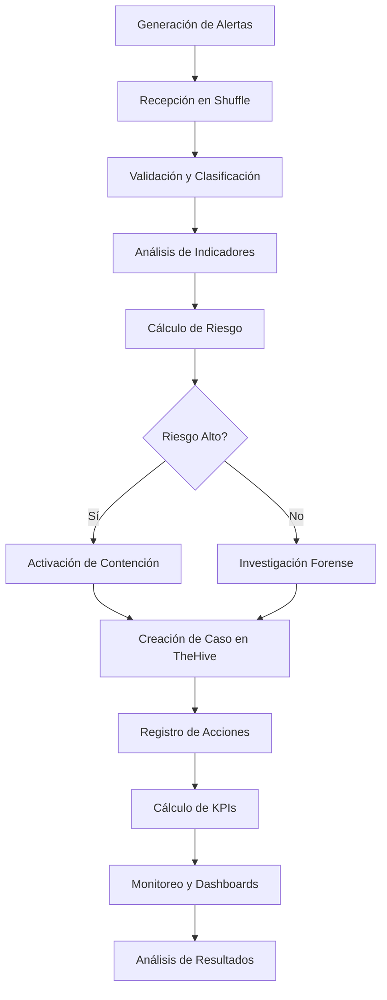

#### Arquitectura de Código Python

El código en `src/soar_lab/` se organiza en capas según el patrón hexagonal:

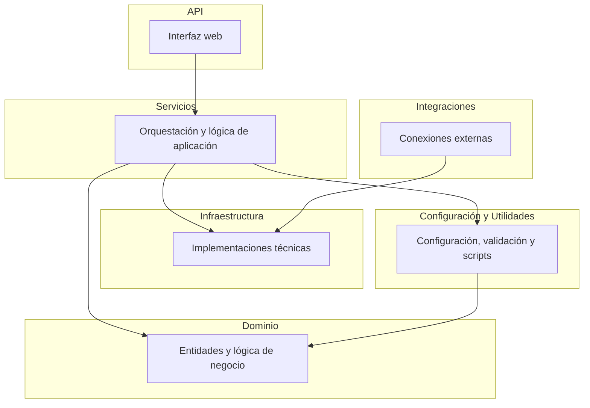

Las capas son:

- `domain/`: contiene la lógica de negocio pura. Define las entidades del sistema como alertas, casos e indicadores de
  compromiso. Especifica los contratos de infraestructura y centraliza los cálculos de métricas.

- `services/`: contiene la lógica de aplicación que orquesta los puertos del dominio. Incluye servicios de análisis de
  KPIs, autenticación, backup, verificación de salud y ejecución de pruebas.

- `infrastructure/`: contiene las implementaciones concretas de los puertos. Incluye clientes para comunicaciones HTTP,
  repositorios de datos, drivers de backup y métricas, y gestores de logs y conexiones en tiempo real.

- `api/`: contiene la aplicación web con endpoints para salud, autenticación, métricas, pruebas, backup y comunicación
  en tiempo real. Gestiona la inyección de dependencias entre componentes.

- `integrations/`: contiene los clientes para conectar con las plataformas externas como TheHive, Cortex, Shuffle y
  MISP.

- `config/`: contiene la configuración general del sistema, esquemas de datos y configuración de logging.

- `validation/`: contiene validadores de datos para asegurar la integridad de la información.

- `data/`: contiene scripts para el cálculo de KPIs y generación de indicadores de compromiso.

#### Arquitectura de Despliegue

La infraestructura se organiza en cuatro capas:

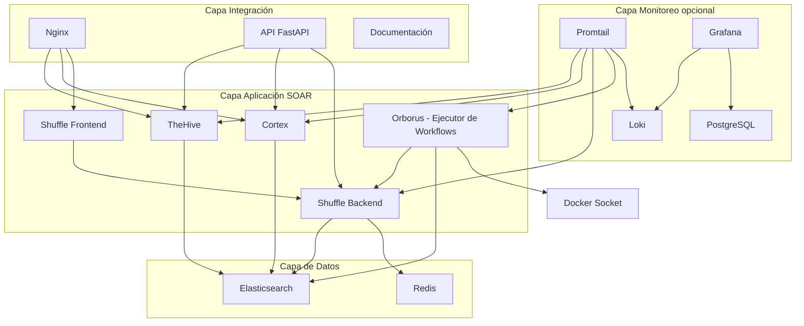

La capa de datos incluye Elasticsearch y Redis. La capa de aplicación SOAR contiene TheHive, Cortex, Shuffle (frontend y
backend) y Orborus. Orborus es el ejecutor de workflows de Shuffle que se conecta al backend de Shuffle y a
Elasticsearch, y tiene acceso al socket de Docker para ejecutar contenedores. La capa de integración incluye Nginx, la
API FastAPI y el sitio de documentación. La capa de monitoreo opcional incluye Loki, Promtail, Grafana y PostgreSQL.

Relaciones entre componentes:

- TheHive y Cortex dependen de Elasticsearch para almacenar casos, alertas y resultados de análisis.
- Shuffle Backend depende de Elasticsearch para almacenar workflows y ejecuciones, y de Redis para gestión de colas y
  caché.
- Shuffle Frontend depende de Shuffle Backend para la API de orquestación.
- Orborus depende de Shuffle Backend para obtener workflows a ejecutar, de Elasticsearch para almacenar resultados de
  ejecución, y del socket de Docker para lanzar contenedores de workers.
- Nginx actúa como proxy inverso para TheHive, Cortex y Shuffle Frontend, proporcionando un punto de entrada unificado.
- La API FastAPI se conecta a TheHive, Cortex y Shuffle Backend para integrar sus funcionalidades.
- Promtail recopila logs de todos los contenedores de aplicación para enviarlos a Loki.

La composición modular mediante múltiples archivos Docker Compose permite desplegar diferentes configuraciones según las
necesidades del entorno, desde configuraciones mínimas de desarrollo hasta despliegues completos.

#### Componentes Principales

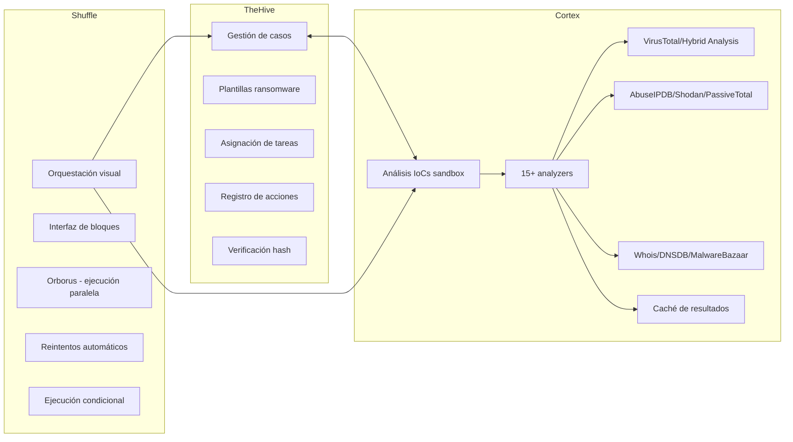

Flujo de Integración entre Componentes

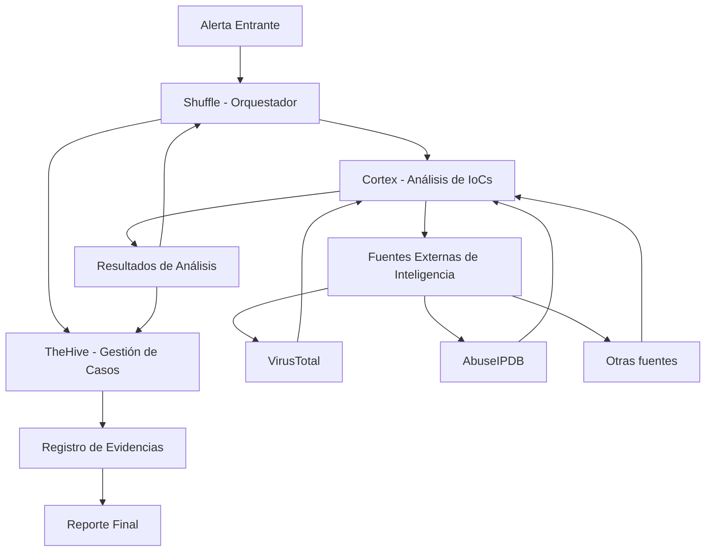

TheHive (v3.5.2) gestiona el ciclo de vida de los casos. Incluye plantillas especializadas para ransomware, asignación
de tareas entre analistas y registro de todas las acciones. Su integración directa con Cortex permite analizar IoCs sin
salir de la interfaz del caso. Las evidencias se almacenan con verificación hash para garantizar su integridad forense.

Cortex (v3.1.4) ejecuta el análisis de IoCs en entornos aislados. Dispone de más de 15 analyzers configurados para
investigaciones de ransomware. Para archivos se usan VirusTotal y Hybrid Analysis. Para infraestructura de red se usan
AbuseIPDB, Shodan y PassiveTotal. Para dominios se usan Whois y DNSDB. Para hashes se usa MalwareBazaar. El sistema
cachea resultados previos para evitar consultas redundantes y reduce la carga sobre las APIs externas. La arquitectura
Docker permite añadir nodos de análisis según la demanda.

Shuffle (v2.2.1) orquesta los flujos mediante una interfaz visual de bloques, sin necesidad de escribir código. Orborus
ejecuta los workflows en paralelo entre varios workers y gestiona reintentos automáticos ante fallos. La ejecución
condicional y la programación de tareas permiten adaptar el flujo según el contexto del incidente.

#### Scripts de Automatización Desarrollados

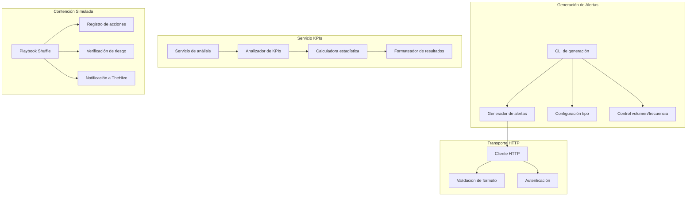

Flujo de Cálculo de KPIs

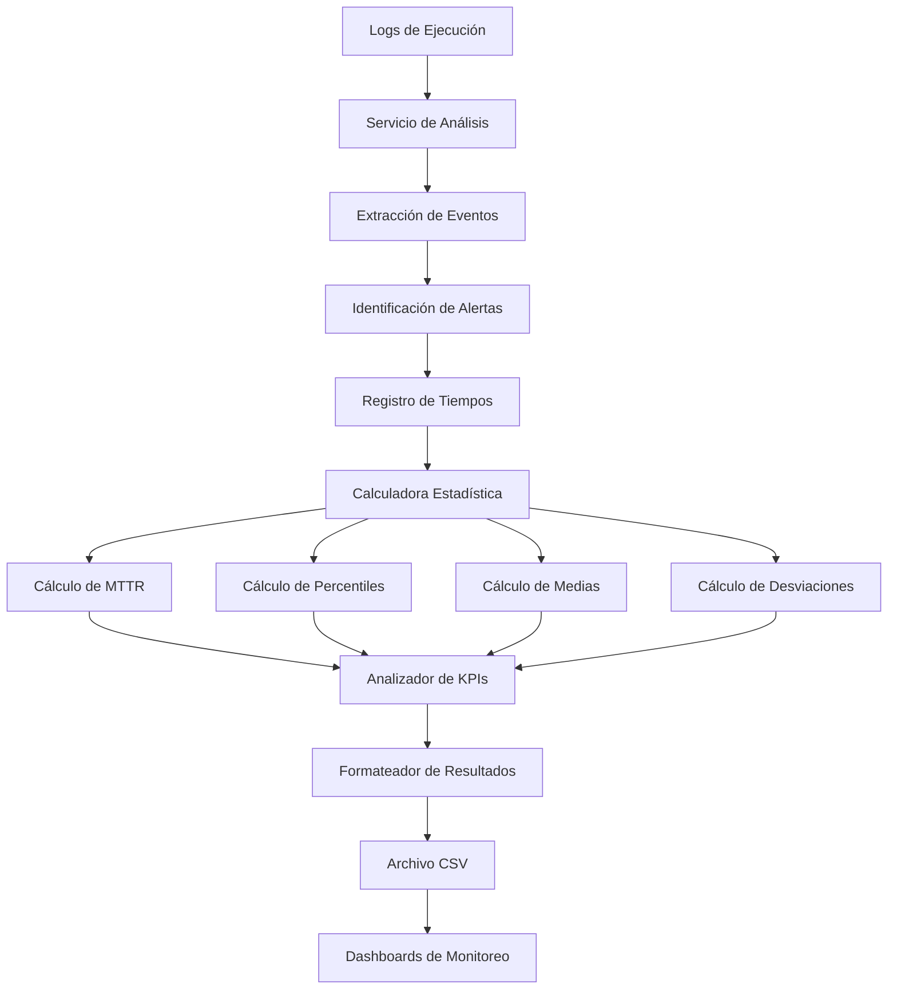

El sistema incluye un cliente HTTP que implementa el transporte de alertas. Una herramienta de línea de comandos genera
alertas simuladas y las envía al webhook de Shuffle. Permite configurar el tipo de alerta, el volumen y la frecuencia de
envío. La validación de formato garantiza la estructura esperada y la autenticación protege el endpoint.

El servicio de KPIs extrae métricas de tiempo de respuesta de los logs. Coordina la recolección de datos, realiza
cálculos estadísticos como percentiles y medias, y exporta los resultados a un formato estructurado. Un comando
automatizado ejecuta este proceso para generar el archivo de resultados desde los logs de ejecución.

La lógica de contención simulada se implementa en el playbook de Shuffle. Registra las acciones en logs sin ejecutar
comandos reales de firewall, verifica el nivel de riesgo antes de activar el aislamiento y notifica el resultado al caso
en TheHive.

#### Playbooks de Respuesta a Ransomware

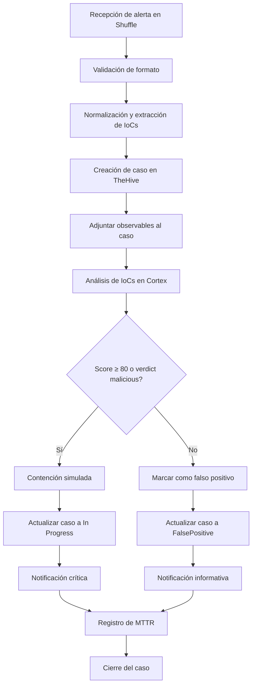

El playbook principal define el flujo automatizado desde la recepción de la alerta hasta el cierre del caso. Está
implementado en Shuffle y documentado en el archivo de operaciones.

El flujo comienza con la recepción de la alerta en Shuffle mediante webhook, donde se valida el formato del JSON y se
normalizan los datos. Se extraen los indicadores de compromiso (hash, IP, hostname) y se crea un caso en TheHive con
plantillas especializadas en ransomware. Los indicadores se adjuntan al caso como observables.

A continuación, se ejecutan analyzers en Cortex para analizar los IoCs contra fuentes de inteligencia externas como
VirusTotal, AbuseIPDB y otras. El sistema calcula un score de riesgo basado en los resultados de los analyzers.

Si el score es mayor o igual a 80 o el verdict es "malicious", se activa la rama de contención. Se ejecuta el script de
contención simulada (aislamiento de red, terminación de procesos, bloqueo de cuentas), se actualiza el caso en TheHive a
estado "In Progress" y se envía una notificación crítica al equipo. Si el score es menor y el verdict no es malicioso,
se marca el caso como falso positivo, se actualiza a estado "FalsePositive" y se envía una notificación informativa.

En ambas ramas se registra el MTTR (Mean Time To Respond) calculado desde el tiempo de detección hasta el tiempo de
contención o clasificación. El caso se cierra automáticamente tras completar el flujo.

El playbook se valida mediante pruebas E2E para escenarios maliciosos, falsos positivos benignos y casos de borde.

#### Infraestructura Docker Compose

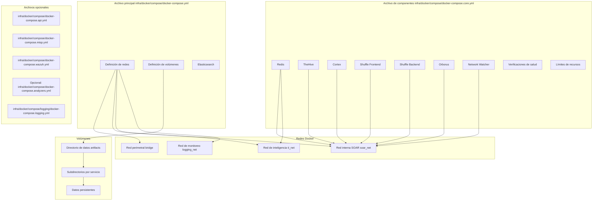

La infraestructura se define con varios archivos Docker Compose que se combinan para desplegar el sistema completo. Esto
permite configuraciones que van desde entornos mínimos de desarrollo hasta despliegues completos en producción.

El archivo principal `infra/docker/compose/docker-compose.yml` define las redes y los volúmenes persistentes. Las redes incluyen la red
perimetral bridge accesible desde el host, la red interna soar_net de componentes SOAR, la red de inteligencia ti_net y
la red de monitoreo logging_net. También incluye Elasticsearch como base de datos centralizada.

El archivo de componentes principales `infra/docker/compose/docker-compose.core.yml` contiene Redis, TheHive, Cortex, Shuffle Frontend,
Shuffle Backend, Orborus y Network Watcher. Cada servicio tiene verificaciones de salud, límites de recursos y
dependencias entre servicios. Redis se conecta a la red de inteligencia para integración con servicios externos.

Los archivos opcionales añaden funcionalidades adicionales: `infra/docker/compose/docker-compose.api.yml` para la API FastAPI y
documentación, `infra/docker/compose/docker-compose.misp.yml` para MISP (threat intelligence), `infra/docker/compose/docker-compose.wazuh.yml` para Wazuh (SIEM) y
`infra/docker/compose/logging/docker-compose.logging.yml` para el stack de monitoreo (Loki, Promtail, Grafana, PostgreSQL).

La segmentación de redes sigue un modelo por zonas de seguridad. La red perimetral bridge es accesible desde el host. La
red interna soar_net conecta los componentes SOAR. La red de inteligencia ti_net vincula Redis y Cortex con servicios
externos. La red de monitoreo logging_net conecta el stack de monitoreo. Esta separación limita el movimiento lateral en
caso de compromiso.

Los volúmenes usan enlaces al directorio artifacts, con subdirectorios por servicio (elasticsearch, thehive, cortex,
shuffle, redis, etc.). Los datos sobreviven a reinicios y pueden migrarse entre entornos copiando ese directorio. Las
verificaciones de salud permiten recuperación automática. Los límites de CPU y memoria previenen la contención de
recursos entre contenedores.

#### Sistema de Monitoreo

```mermaid
graph TD
    subgraph Stack de Monitoreo
        L1[Agregación de logs]
        P1[Recopilación de logs]
        G1[Dashboards]
        DB1[Base de datos]
    end

    subgraph Contenedores
        C1[TheHive]
        C2[Cortex]
        C3[Shuffle]
        C4[Orborus]
        C5[API]
    end

    subgraph Métricas Técnicas
        M1[Tiempo de respuesta]
        M2[Tasa de éxito]
        M3[Recursos del sistema]
        M4[Conexiones]
        M5[Colas]
    end

    subgraph Métricas de Negocio
        N1[MTTR]
        N2[Tasa de alertas]
        N3[Casos cerrados]
    end

    P1 --> C1
    P1 --> C2
    P1 --> C3
    P1 --> C4
    P1 --> C5
    P1 --> L1
    G1 --> L1
    G1 --> DB1
    G1 --> M1
    G1 --> M2
    G1 --> M3
    G1 --> M4
    G1 --> M5
    G1 --> N1
    G1 --> N2
    G1 --> N3
```

Flujo de Datos de Monitoreo

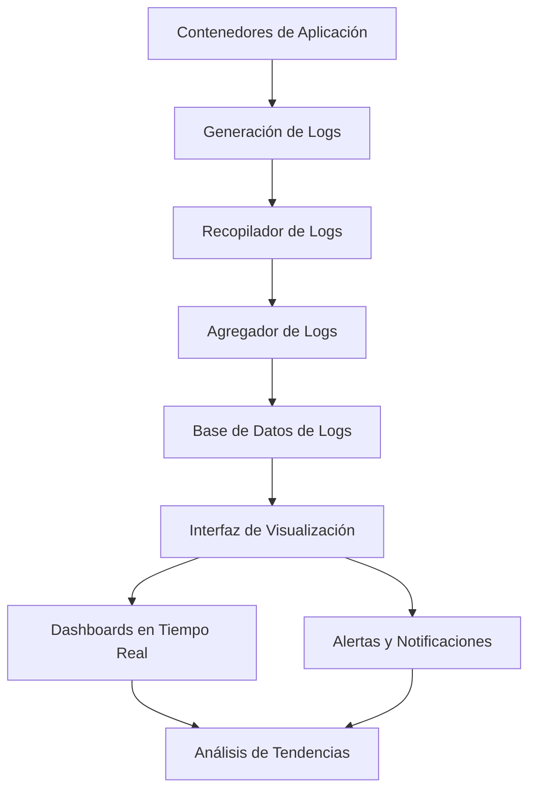

El monitoreo usa Loki, Promtail, Grafana y PostgreSQL para proporcionar visibilidad sobre el estado y el rendimiento del
sistema.

Loki agrega logs estructurados. Promtail los recopila de todos los contenedores y los envía a Loki. Grafana ofrece
dashboards de logs en tiempo real y usa PostgreSQL como base de datos para su configuración y dashboards.

Las métricas monitoreadas incluyen el tiempo de respuesta de las APIs para detectar cuellos de botella, la tasa de éxito
de los playbooks, el uso de recursos del sistema como CPU, memoria y disco, las conexiones concurrentes y las colas de
mensajes. Las métricas de negocio como el tiempo de respuesta medio, la tasa de alertas y los casos cerrados conectan el
rendimiento técnico con la eficacia operativa.

El stack de monitoreo arranca con el comando de Docker Compose correspondiente. La interfaz de visualización está
disponible con credenciales configuradas en el archivo de entorno.

### 4.1.3. Evaluación

#### 4.1.3.1. Diseño Experimental

La evaluación compara la respuesta manual con la respuesta automatizada SOAR. La variable independiente es el tipo de
respuesta (manual vs. SOAR). La variable dependiente es el MTTR en segundos, registrado desde la recepción de la alerta
hasta la contención simulada. Las variables controladas comprenden el entorno de despliegue (Docker Compose), el
hardware, la configuración de los componentes y el conjunto de alertas generadas.

#### 4.1.3.2. Procedimiento de Evaluación

Fase 1 (baseline manual): el analista recibe la alerta simulada de `send_alert.py`, revisa la información en TheHive,
consulta Cortex manualmente, decide la contención, ejecuta los scripts de aislamiento y documenta el caso.

Fase 2 (respuesta SOAR): Shuffle recibe la alerta por webhook, clasifica el incidente de forma automática, lanza los
analyzers de Cortex en paralelo, crea el caso en TheHive mediante API y activa la contención simulada si el score de
riesgo supera el umbral configurado. El analista no interviene durante la ejecución, aunque conserva visibilidad sobre
el proceso en tiempo real. El ciclo se cierra con la generación automática del registro de evidencias.

`AnalyticsService` (en `src/soar_lab/application/use_cases/analytics_service.py`) calcula las métricas desde los logs, extrayendo
timestamps con `LogParser`. El cálculo estadístico se delega a `KPIAnalyzer` y `StatisticalCalculator`. Las métricas
recogidas son: tiempo de recepción a triage, tiempo de análisis de IoCs, tiempo de creación de caso, tiempo de
contención y MTTR total. Los resultados se exportan a CSV con `KPIFormatter`.

Comandos de ejecución:

- `pytest tests/e2e/TC-01/test_malicious.py -v` (escenario malicioso)
- `pytest tests/e2e/TC-02/test_benign.py -v` (escenario benigno / falso positivo)
- `pytest tests/e2e/TC-03/test_edge_cases.py -v` (casos de borde E2E)
- `pytest tests/integration/test_app_e2e.py -v` (flujo E2E completo)
- `make metrics` para calcular KPIs desde los logs

#### 4.1.3.3. Resultados Experimentales

Los resultados se obtienen mediante las pruebas E2E y el análisis de logs mediante `AnalyticsService` (que incorpora la
lógica de cálculo de KPIs consolidada).

#### 4.1.3.4. Evaluación de Calidad del Sistema

El laboratorio cumple los requisitos de rendimiento definidos. La cobertura de tests se puede verificar en
`artifacts/coverage/` mediante el comando `make test-coverage`.

Comandos de prueba disponibles:

- `make test-all`: suite completa
- `make test-unit`: pruebas unitarias
- `make test-integration`: pruebas de integración
- `make test-e2e`: flujos E2E
- `make test-atomic`: tests de componentes aislados
- `make test-security`: análisis de vulnerabilidades
- `make test-performance`: latencia y throughput
- `make test-smoke`: validación rápida post-despliegue
- `make test-coverage`: informe de cobertura

En usabilidad, el tiempo de aprendizaje es asumible y requiere una formación inicial mínima. La reducción de errores
humanos es consistente con las mejoras reportadas en la literatura sobre automatización de tareas en SOC.

#### 4.1.3.6. Sistema de Monitoreo

El laboratorio incluye un sistema de logging centralizado opcional basado en Loki, Promtail y Grafana. Este stack
permite la agregación, recopilación y visualización de logs de todos los servicios del laboratorio.

**Componentes del stack de logging:**

- **Loki**: Sistema de agregación de logs inspirado en Prometheus. Almacena logs de forma eficiente y permite consultas
  mediante el lenguaje LogQL.
- **Promtail**: Agente de recopilación de logs que se ejecuta en cada contenedor y envía los logs a Loki. Configurado
  para recopilar logs de todos los servicios de aplicación.
- **Grafana**: Plataforma de visualización y análisis de datos. Proporciona dashboards para monitorear el estado del
  laboratorio y visualizar logs agregados.
- **PostgreSQL**: Base de datos para Grafana, usada para almacenar configuración de dashboards, usuarios y datos de
  sesiones.

**Configuración:**

Los archivos de configuración del stack de logging se encuentran en `infra/docker/compose/logging/`:

- `docker-compose.logging.yml`: Definición de servicios de logging
- `loki-config.yml`: Configuración de Loki (retención, almacenamiento, límites)
- `promtail-config.yml`: Configuración de Promtail (fuentes de logs, etiquetas, destinos)
- `grafana-datasources.yml`: Configuración de datasources de Grafana (Loki)

**Redes y volúmenes:**

El stack de logging usa la red dedicada `logging_net` (172.23.0.0/16) para aislar el tráfico de logging. Los datos
persistentes se almacenan en:

- `artifacts/data/loki/`: Logs almacenados en Loki
- `artifacts/data/grafana/`: Configuración y dashboards de Grafana

**Uso:**

El stack de logging se inicia automáticamente con el comando `make up`. La interfaz de Grafana está disponible en
`http://localhost:8084` con credenciales configuradas en el archivo de entorno.

**Beneficios:**

- Centralización de logs de todos los servicios en un único punto de consulta
- Dashboards preconfigurados para monitoreo del laboratorio
- Consultas avanzadas de logs mediante LogQL
- Alertas y notificaciones basadas en patrones de logs
- Integración con el ecosistema de herramientas de observabilidad

#### 4.1.3.5. Análisis de Mejoras Implementadas

El proceso iterativo resultó en mejoras distribuidas en categorías de seguridad, calidad de código, operativas y de
monitoreo.

#### 4.1.3.6. Limitaciones

Las limitaciones principales son la validación en laboratorio (no en producción real) y el alcance restringido a
ransomware. La dependencia de APIs externas como VirusTotal y AbuseIPDB requiere estrategias de caché para entornos
productivos.

Los resultados muestran que el laboratorio cumple los requisitos funcionales y no funcionales definidos y puede
emplearse como base reproducible para respuesta automatizada a ransomware.
